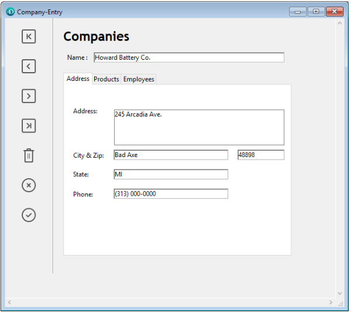

Un control de pestañas crea un objeto que permite al usuario elegir entre un conjunto de pantallas virtuales que están encerradas por el objeto de control de pestañas. Se accede a cada pantalla haciendo clic en su pestaña.

El siguiente formulario multipágina utiliza un objeto de control de pestañas:



Para navegar de una pantalla a otra, el usuario sólo tiene que hacer clic en la pestaña deseada.

Las pantallas pueden representar páginas en un formulario de varias páginas o un objeto que cambia cuando el usuario hace clic en una pestaña. If the tab control is used as a page navigation tool, then the [`FORM GOTO` PAGE](https://doc.4d.com/4dv19/help/command/en/page247.html) command or the `gotoPage` standard action would be used when a user clicks a tab.

Otro uso del control de pestañas es para controlar los datos que se muestran en un subformulario. Por ejemplo, se podría implementar un Rolodex utilizando un control de pestañas. Las pestañas mostrarían las letras del alfabeto y la acción del control de pestañas sería cargar los datos correspondientes a la letra que el usuario pulsara.

Cada pestaña puede mostrar etiquetas o rótulos y un pequeño icono. Si incluye iconos, éstos aparecen a la izquierda de cada etiqueta. Este es un ejemplo de un control de pestañas que utiliza iconos:


Cuando se crea un control de pestañas, 4D gestiona el espaciado y la colocación de las mismas. Sólo tiene que suministrar las etiquetas en forma de array, o los iconos y etiquetas en forma de lista jerárquica.

Si el control de pestañas es lo suficientemente amplio como para mostrar todas las pestañas con las etiquetas y los iconos, muestra ambos. Si el control de pestañas no es lo suficientemente ancho para mostrar tanto las etiquetas como los iconos, 4D muestra sólo los iconos. Si no caben todos los iconos, coloca flechas de desplazamiento a la derecha de la última pestaña visible. Las flechas de desplazamiento permiten al usuario desplazar los iconos hacia la izquierda o la derecha.

En macOS, además de la posición estándar (arriba), los controles de las pestañas también pueden alinearse en la parte inferior.

### Ejemplo JSON

```4d
 "myTab": {
  "type": "tab",
   "left": 60, 
  "top": 160,  
  "width": 100, 
  "height": 20, 
  "labelsPlacement": "bottom" //define the direction
 }
```

## Añadir etiquetas a un control de pestañas

Para suministrar las etiquetas de un control de pestañas, puede utilizar:

- un objeto
- una lista de selección
- un array

### Utilizar un objeto

You can assign an [object](Concepts/dt_object.md) encapsulating a [collection](Concepts/dt_collection) as the [data source](properties_Object.md#variable-or-expression) of the tab control. El objeto debe contener las siguientes propiedades:

| Propiedad      | Type       | Descripción                                                                                                                                                  |
| -------------- | ---------- | ------------------------------------------------------------------------------------------------------------------------------------------------------------ |
| `values`       | Collection | Obligatorio - Colección de valores escalares. Sólo se admiten valores de tipo cadena. Si es inválido, vacío o no definido, el control de pestañas está vacío |
| `index`        | number     | Index of the currently tab control page (value between 0 and `collection.length-1`)                                                                          |
| `currentValue` | Text       | Valor actual seleccionado                                                                                                                                    |

The initialization code must be executed before the form is presented to the user.

In the following example, `Form.tabControl` has been defined as tab control [expression](properties_Object.md#variable-or-expression). You can associate the [`gotoPage` standard action](#goto-page-action) to the form object:

```4d
Form.tabControl:=New object
Form.tabControl.values:=New collection("Page 1"; "Page 2"; "Page 3")
Form.tabControl.index:=2 //start on page 3
```

### Utilizar una lista de selección

You can assign a [choice list](properties_DataSource.md#choice-list-static-list) to the tab control, either through a collection (static list) or a JSON pointer to a json list ("$ref"). Icons associated with list items in the Lists editor will be displayed in the tab control.

### Utilizar un array Text

Puede crear un array Texto que contenga los nombres de cada página del formulario. Este código debe ejecutarse antes de que el formulario se presente al usuario. Por ejemplo, podrías colocar el código en el método del objeto del control de la pestaña y ejecutarlo cuando se produzca el evento `On Load`.

```4d
 ARRAY TEXT(arrPages;3)
 arrPages{1}:="Name"
 arrPages{2}:="Address"
 arrPages{3}:="Notes"  
```
> You can also store the names of the pages in a hierarchical list and use the [LIST TO ARRAY](https://doc.4d.com/4dv19/help/command/en/page288.html) command to load the values into the array.

## Funcionalidades de Goto page

### Comando FORM GOTO PAGE

You can use the [`FORM GOTO PAGE`](https://doc.4d.com/4dv19/help/command/en/page247.html) command in the tab control’s method:

```4d
FORM GOTO PAGE(arrPages)
```

The command is executed when the [`On Clicked`](Events/onClicked.md) event occurs. You should then clear the array when the [`On Unload`](Events/onUnload.md) event occurs.

He aquí un ejemplo de método objeto:

```4d
 Case of
    :(Form event=On Load)
       LIST TO ARRAY("Tab Labels";arrPages)
    :(Form event=On Clicked)
       FORM GOTO PAGE(arrPages)
    :(Form event=On Unload)
       CLEAR VARIABLE(arrPages)
 End case
```

### Acción Goto Page

Cuando se asigna la acción [acción estándar](properties_Action.md#standard-action) `gotoPage` a un control de pestañas, 4D mostrará automáticamente la página del formulario que corresponde al número de la pestaña que está seleccionada.

Por ejemplo, si el usuario selecciona la tercera pestaña, 4D mostrará la página 3 del formulario actual (si existe).

## Propiedades soportadas

[Bold](properties_Text.md#bold) - [Bottom](properties_CoordinatesAndSizing.md#bottom) - [Choice List](properties_DataSource.md#choice-list-static-list) - [Class](properties_Object.md#css-class) - [Expression Type](properties_Object.md#expression-type) - [Font](properties_Text.md#font) - [Font Size](properties_Text.md#font-size) - [Height](properties_CoordinatesAndSizing.md#height) - [Help Tip](properties_Help.md#help-tip) - [Horizontal Sizing](properties_ResizingOptions.md#horizontal-sizing) - [Italic](properties_Text.md#italic) - [Left](properties_CoordinatesAndSizing.md#left) - [Object Name](properties_Object.md#object-name) - [Right](properties_CoordinatesAndSizing.md#right) - [Save value](properties_Object.md#save-value) - [Standard action](properties_Action.md#standard-action) - [Tab Control Direction](properties_Appearance.md#tab-control-direction) - [Top](properties_CoordinatesAndSizing.md#top) - [Type](properties_Object.md#type) - [Underline](properties_Text.md#underline) - [Vertical Sizing](properties_ResizingOptions.md#vertical-sizing) - [Variable or Expression](properties_Object.md#variable-or-expression) - [Visibility](properties_Display.md#visibility) - [Width](properties_CoordinatesAndSizing.md#width)
