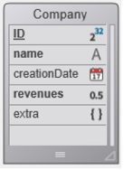

La tecnología ORDA se basa en un mapeo automático de una estructura 4D subyacente. También ofrece acceso a los datos a través de los objetos selección de entidades (entity selection) y entidad (entity). As a result, ORDA exposes the whole database as a set of data model objects.

## Cartografía de la estructura

When you call a datastore using the `ds` or the `Open datastore` command, 4D automatically references tables and fields of the corresponding 4D structure as properties of the returned [datastore](#datastore) object:

* Las tablas correspondientes a las dataclasses.
* Los campos corresponden a los atributos de almacenamiento.
* Relations are mapped to relation attributes - relation names, defined in the Structure editor, are used as relation attribute names.


### Reglas generales

Se aplican las siguientes reglas para todas las conversiones:

* Los nombres de tabla, campo y relación se mapean a los nombres de propiedad de objeto. Asegúrese de que dichos nombres cumplen con las reglas generales de denominación de objetos, como se explica en la sección [Convenciones de denominación de objetos](Concepts/identifiers.md).
* Un datastore sólo hace referencia a las tablas con una sola llave primaria. Las siguientes tablas no están referenciadas:
  * Tablas sin llave primaria
  * Tablas con llaves primarias compuestas.
* Los atributos de tipo [BLOB](Concepts/dt_blob.md) no se gestionan en el datastore. Los atributos de tipo BLOB se devuelven como Null en las entidades y no se pueden asignar.

> ORDA mapping does not take into account:  
> 
> * the "Invisible" option for tables or fields,
> * the virtual structure defined through `SET TABLE TITLES` or `SET FIELD TITLES`,
> * the "Manual" or "Automatic" property of relations.

### Normas de control de acceso remoto

When accessing a remote datastore through the `Open datastore` command or [REST requests](REST/gettingStarted.md), only tables and fields with the **Expose as REST resource** property are available remotely.

This option must be selected at the 4D structure level for each table and each field that you want to be exposed as dataclass and attribute in the datastore:


### Actualización del modelo de datos

Any modifications applied at the level of the database structure invalidate the current ORDA model layer. Estas modificaciones incluyen:

* la adición o la eliminación de una tabla, de un campo, o de una relación
* el cambio de nombre de una tabla, de un campo o de una relación
* changing a core property of a field (type, unique, index, autoincrement, null value support)

When the current ORDA model layer has been invalidated, it is automatically reloaded and updated in subsequent calls of the local `ds` datastore on 4D and 4D Server. Note that existing references to ORDA objects such as entities or entity selections will continue to use the model from which they have been created, until they are regenerated.

However, the updated ORDA model layer is not automatically available in the following contexts:

* a remote 4D application connected to 4D Server -- the remote application must reconnect to the server.
* a remote datastore opened using `Open datastore` or through [REST calls](REST/gettingStarted.md) -- a new session must be opened.

## Definiciones de los objetos

### Datastore

El datastore es el objeto de interfaz de una base de datos. Crea una representación de toda la base como objeto. A datastore is made of a **model** and **data**:

* The model contains and describes all the dataclasses that make up the datastore. Es independiente de la propia base de datos subyacente.
* Data refers to the information that is going to be used and stored in this model. For example, names, addresses, and birthdates of employees are pieces of data that you can work with in a datastore.

When handled through the code, the datastore is an object whose properties are all of the [dataclasses](#dataclass) which have been specifically exposed.

4D le permite gestionar los siguientes datastores:

* the local datastore, based on the current 4D database, returned by the `ds` command (the main datastore).
* one or more remote datastore(s) exposed as REST resources in remote 4D databases, returned by the `Open datastore` command.

Un datastore hace referencia sólo a una base de datos local o remota.

El objeto datastore en sí no puede ser copiado como un objeto:

```4d
$mydatastore:=OB Copy(ds) //devuelve null
```

Las propiedades del datastore son sin embargo enumerables:

```4d
 ARRAY TEXT($prop;0)
 OB GET PROPERTY NAMES(ds;$prop)
  //$prop contains the names of all the dataclasses
```

The main (default) datastore is always available through the `ds` command, but the `Open datastore` command allows referencing any remote datastore.

### Dataclass

Una dataclass es el equivalente de una tabla. It is used as an object model and references all fields as attributes, including relational attributes (attributes built upon relations between dataclasses). Los atributos relacionales pueden utilizarse en las peticiones como cualquier otro atributo.

All dataclasses in a 4D project are available as a property of the `ds` datastore. For remote datastores accessed through `Open datastore` or [REST requests](REST/gettingStarted.md), the **Expose as REST resource** option must be selected at the 4D structure level for each exposed table that you want to be exposed as dataclass in the datastore.

Por ejemplo, considere la siguiente tabla en la estructura 4D:



The `Company` table is automatically available as a dataclass in the `ds` datastore. Puede escribir:

```4d
var $compClass : cs.Company //declares a $compClass object variable of the Company class
$compClass:=ds.Company //assigns the Company dataclass reference to $compClass
```

Un objeto dataclass puede contener:

* attributes
* atributos relacionales

The dataclass offers an abstraction of the physical database and allows handling a conceptual data model. The dataclass is the only means to query the datastore. Una consulta se hace desde una única dataclass. Queries are built around attributes and relation attribute names of the dataclasses. So the relation attributes are the means to involve several linked tables in a query.

El objeto dataclass mismo no puede copiarse como un objeto:

```4d
$mydataclass:=OB Copy(ds.Employee) //devuelve null
```

Las propiedades de la dataclass son sin embargo enumerables:

```code4d
ARRAY TEXT($prop;0)
OB GET PROPERTY NAMES(ds.Employee;$prop)
//$prop contains the names of all the dataclasse attributes
```

### Atributo

Dataclass properties are attribute objects describing the underlying fields or relations. Por ejemplo:

```4d
 $nameAttribute:=ds.Company.name //reference to class attribute
 $revenuesAttribute:=ds.Company["revenues"] //alternate way
```

This code assigns to `$nameAttribute` and `$revenuesAttribute` references to the name and revenues attributes of the `Company` class. Esta sintaxis NO devuelve los valores mantenidos dentro del atributo, sino que devuelve referencias a los propios atributos. Para manejar los valores, es necesario pasar por [Entidades](#entity).

All eligible fieds in a table are available as attributes of their parent [dataclass](#dataclass). For remote datastores accessed through `Open datastore` or [REST requests](REST/gettingStarted.md), the **Expose as REST resource** option must be selected at the 4D structure level for each field that you want to be exposed as a dataclass attribute.

#### Atributos de almacenamiento y relacionales

Dataclass attributes come in several kinds: storage, relatedEntity, and relatedEntities. Attributes that are scalar (*i.e.*, provide only a single value) support the standard 4D data type (integer, text, object, etc.).

* A **storage attribute** is equivalent to a field in the 4D database and can be indexed. Values assigned to a storage attribute are stored as part of the entity when it is saved. When a storage attribute is accessed, its value comes directly from the datastore. Storage attributes are the most basic building block of an entity and are defined by name and data type.
* A **relation attribute** provides access to other entities. Relation attributes can result in either a single entity (or no entity) or an entity selection (0 to N entities). Relation attributes are built upon "classic" relations in the relational structure to provide direct access to related entity or related entities. Relation attributes are directy available in ORDA using their names.

For example, consider the following partial database structure and the relation properties:


All storage attributes will be automatically available:

* in the Project dataclass: "ID", "name", and "companyID"
* en la dataclasss Company: "ID", "name" y "discount"

In addition, the following relation attributes will also be automatically available:

* in the Project dataclass: **theClient** attribute, of the "relatedEntity" kind; there is at most one Company for each Project (the client)
* in the Company dataclass: **companyProjects** attribute, of the "relatedEntities" kind; for each Company there is any number of related Projects.
> > The Manual or Automatic property of a database relation has no effect in ORDA.

All dataclass attributes are exposed as properties of the dataclass:


Keep in mind that these objects describe attributes, but do not give access to data. Reading or writing data is done through [entity objects](entities.md#using-entity-attributes).

### Entity

Una entidad es el equivalente a un registro. En realidad es un objeto que hace referencia a un registro de la base de datos. It can be seen as an instance of a [dataclass](#dataclass), like a record of the table matching the dataclass. However, an entity also contains data correlated to the database related to the datastore.

The purpose of the entity is to manage data (create, update, delete). When an entity reference is obtained by means of an entity selection, it also retains information about the entity selection which allows iteration through the selection.

El objeto entidad en sí no puede ser copiado como un objeto:

```4d
 $myentity:=OB Copy(ds.Employee.get(1)) //devuelve null
```

Sin embargo, las propiedades de la entidad son enumerables:

```4d
 ARRAY TEXT($prop;0)
 OB GET PROPERTY NAMES(ds.Employee.get(1);$prop)
  //$prop contains the names of all the entity attributes
```

### Entity selection

An entity selection is an object containing one or more reference(s) to entities belonging to the same dataclass. It is usually created as a result of a query or returned from a relation attribute. Una entity selection puede contener 0, 1 o X entidades de la dataclass -- donde X puede representar el número total de entidades contenidas en la dataclass.

Ejemplo:

```4d
var $e : cs.EmployeeSelection //declares a $e object variable of the EmployeeSelection class type
$e:=ds.Employee.all() //assigns the resulting entity selection reference to the $e variable
```

Entity selections can be "sorted" or "unsorted" ([see below](#ordered-or-unordered-entity-selection)).

> Entity selections can also be "shareable" or "non-shareable", depending on [how they have been created](entities.md#shareable-or-alterable-entity-selections).

El objeto selección de entidades en sí no puede ser copiado como un objeto:

```4d
 $myentitysel:=OB Copy(ds.Employee.all()) //returns null
```

Las propiedades de las selecciones de entidades son sin embargo enumerables:

```4d
 ARRAY TEXT($prop;0)
 OB GET PROPERTY NAMES(ds.Employee.all();$prop)
  //$prop contains the names of the entity selection properties
  //("length", 00", "01"...)
```

#### Entity selections ordenadas o no ordenadas

For optimization reasons, by default 4D ORDA usually creates unordered entity selections, except when you use the `orderBy( )` method or use specific options. In this documentation, unless specified, "entity selection" usually refers to an "unordered entity selection".

Ordered entity selections are created only when necessary or when specifically requested using options, i.e. in the following cases:

* result of an `orderBy()` on a selection (of any type) or an `orderBy()` on a dataclass
* result of the `newSelection()` method with the `dk keep ordered` option

Las selecciones de entidades desordenadas se crean en los siguientes casos:

* result of a standard `query()` on a selection (of any type) or a `query()` on a dataclass,
* resultado del método `newSelection()` sin opción,
* result of any of the comparison methods, whatever the input selection types: `or()`, `and()`, `minus()`.
> > The following entity selections are always **ordered**: > > * entity selections returned by 4D Server to a remote client > * entity selections built upon remote datastores.
> 
> * > > * > > * > > * entity selections returned by 4D Server to a remote client > * entity selections built upon remote datastores.
> * selecciones de entidades basadas en datastores remotos.

Note that when an ordered entity selection becomes an unordered entity selection, any repeated entity references are removed.
