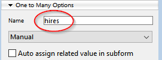
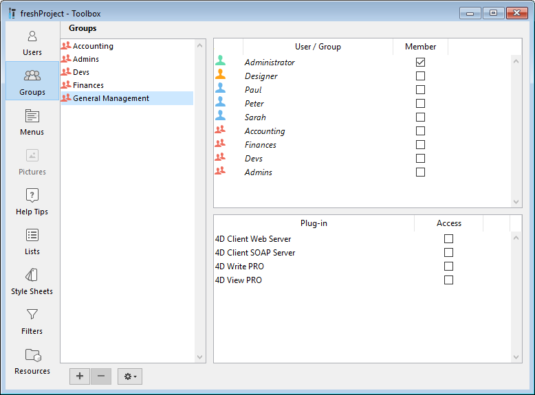
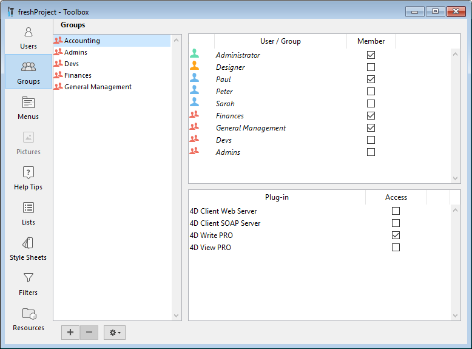

Dado que ORDA está basado en objetos, su uso requiere conocimientos básicos de programación de objetos.

## Explorar el datastore

El datastore ORDA se basa automáticamente en una estructura de base de datos 4D, siempre que cumpla los [requisitos previos de ORDA](overview.md#orda-prerequisites).

Este ejemplo utilizará la siguiente estructura de base de datos 4D simple:


Para saber qué se expone como datastore, cree un nuevo método proyecto, escriba la siguiente línea:

```code4d
TRACE
```

Ejecute el método -- simplemente llama la ventana del depurador. En el área de Expresión, haga doble clic para insertar una expresión e introduzca `ds`. Devuelve el objeto del datastore. Despliegue el objeto, puede ver que las tablas y los campos son expuestos automáticamente por ORDA como propiedades del objeto `ds`:


Esto significa por ejemplo que, siempre que necesite hacer referencia al campo city de la tabla [Company], en ORDA sólo tendrá que escribir:

```code4d
ds.Company.city // devuelve el nombre de la ciudad
```

> En el mundo ORDA, ds.Company es una **dataclass**. ds.Company.city es un **atributo**.

> ORDA es sensible a las mayúsculas y minúsculas. `ds.company.city` no hará referencia al atributo ds.Company.city.

También habrá notado la propiedad extra `hires` en la dataclass ds.Company. No corresponde a un campo. `hires` es en realidad el nombre de la relación *Uno a muchos* entre Company y Employee:

 *Nombre de la relación definida en el Inspector*

Es decir, siempre que necesite acceder a la lista de empleados que trabajan en una empresa, en ORDA sólo tiene que escribir:

```code4d
ds.Company.hires //devuelve la lista de empleados
```

Pero no vaya tan rápido. Veamos ahora cómo registrar datos en las clases de datos ORDA.

## Añadir datos

En ORDA, puede añadir un registro a una dataclass utilizando el comando `new()`.
> En el mundo ORDA, un registro es una **entidad** -- una entidad es en sí misma un objeto. Un comando que se adjunta a un objeto específico se denomina **método miembro**.

```code4d
$entity:=ds.Company.new() //crear una nueva referencia de entidad
//en la dataclass Company  
//y asignar a la variable $entity
```

Un nuevo objeto entidad contiene una "copia" de todos los atributos de su dataclass padre, por lo que puede asignarles los valores:

```code4d
$entity.name:="ACME, inc."  
$entity.city:="London"  
//$entity.ID se llena automáticamente
```

Por el momento, la entidad sólo existe en la memoria. Para almacenarlo en el archivo de datos, es necesario guardarlo utilizando el método miembro `save()`:

```code4d
$status:=$entity.save()
```

El editor de usuarios se encuentran en la caja de herramientas de 4D.


### Añadir y modificar usuarios

El editor de usuarios permite crear cuentas de usuario, definir sus propiedades y asignarlas a distintos grupos.

Para añadir un usuario desde la caja de herramientas :

1. Seleccione **Caja de herramientas > Usuarios** en el menú **Diseño** o haga clic en el botón **Caja de herramientas** de la barra de herramientas de 4D. 4D muestra el editor de usuarios.

La lista de usuarios muestra todos los usuarios, incluyendo el [Diseñador y el Administrador](#designer-and-administrator).

2. Haga clic en el botón  situado debajo de la lista de usuarios. OR Right-click in the list of users and choose **Add** or **Duplicate** in the context menu.

> El comando **Duplicar** se puede utilizar para crear varios usuarios que tengan las mismas características rápidamente.

4D añade un nuevo usuario a la lista, llamado por defecto "Nuevo usuarioX".

3. Introduzca el nombre de usuario. Este nombre será utilizado por el usuario para abrir la base. Puede renombrar un usuario en cualquier momento utilizando el comando **Renombrar** del menú contextual, o utilizando los atajos Alt+clic (Windows) u Opción+clic (macOS), o haciendo dos veces clic en el nombre que quiera cambiar.

4. Para introducir una contraseña del usuario, haga clic en el botón **Editar...** en el área de propiedades del usuario e introduzca la contraseña dos veces en la caja de diálogo. Puede utilizar hasta 15 caracteres alfanuméricos para una contraseña. El editor de contraseñas es sensible a las mayúsculas y minúsculas.

> Los usuarios pueden cambiar su contraseña en cualquier momento según las opciones de la página "Seguridad" de las propiedades de la base, o utilizando el comando `CHANGE PASSWORD`.

5. Defina el grupo o los grupos a los que pertenece el usuario mediante la tabla "Miembro de los grupos". Puede añadir o eliminar el usuario seleccionado a un grupo marcando la opción correspondiente en la columna Miembro.

La pertenencia de los usuarios a los distintos grupos también puede definirse por grupos en la página [Grupos](#configuring-access-groups).

### Eliminar un usuario

Para eliminar un usuario, selecciónelo y haga clic en el botón de eliminación o utilice el comando **Suprimir** del menú contextual. 

Los nombres de usuario borrados ya no aparecen en el editor de usuarios. Tenga en cuenta que los ID de los usuarios eliminados se reasignan cuando se crean nuevas cuentas de usuario.

### Propiedades de los usuarios

- El campo **Tipo de usuario**: el campo Tipo de usuario contiene "Diseñador", "Administrador" o (para todos los demás usuarios) "Usuario".

- **Método de inicio**: nombre de un método asociado que se ejecutará automáticamente cuando el usuario abra la base (opcional). Este método puede utilizarse, por ejemplo, para cargar las preferencias usuario.

## Editor de grupos

El editor de grupos se encuentra en la caja de herramientas de 4D.

### Configurar grupos

El editor de grupos sirve para definir los elementos que contiene cada grupo (usuarios y/o otros grupos) y para distribuir los accesos a los plug-ins.

Tenga en cuenta que una vez que se ha creado un grupo, no se puede eliminar. Si desea desactivar un grupo, sólo tiene que eliminar los usuarios que contiene.

Para crear un grupo:

1. Seleccione **Caja de herramientas > Grupos** en el menú **Diseño** o haga clic en el botón **Caja de herramientas** de la barra de herramientas de 4D luego haga clic en el botón **Grupos**. 4D muestra la ventana del editor de grupos. La lista de grupos muestra todos los grupos de la base.

2. Haga clic en el botón ubicado debajo de la lista de grupos.  
   O  
   Haga clic derecho en la lista de grupos y elija el comando **Añadir** o **Duplicar** en el menú contextual.

> El comando Duplicar se puede utilizar para crear varios grupos que tengan las mismas características rápidamente.

4D añade un nuevo grupo a la lista, llamado por defecto "Nuevo grupoX".

3. Introduzca el nombre del nuevo grupo. El nombre del grupo puede tener hasta 15 caracteres. Puede renombrar un grupo en cualquier momento utilizando el comando **Renombrar** del menú contextual, o utilizando los atajos Alt+clic (Windows) u Opción+clic (macOS), o haciendo dos veces clic en el nombre que quiera cambiar.

### Colocar los usuarios o los grupos en grupos

Puede colocar cualquier usuario o grupo en un grupo, y también puede colocar el propio grupo en varios otros grupos. No es obligatorio colocar a un usuario en un grupo.

Para incluir a un usuario o grupo en un grupo, basta con marcar la opción "Miembro" para cada usuario o grupo en el área de atribución de los miembros:


Si se marca el nombre de un usuario, éste se añade al grupo. Si marca el nombre de un grupo, todos los usuarios del grupo se añaden al nuevo grupo. El usuario o grupo afiliado tendrá entonces los mismos privilegios de acceso que los asignados al nuevo grupo.

La colocación de grupos dentro de otros grupos permite crear una jerarquía de usuarios. Los usuarios de un grupo colocados en otro grupo tendrán los privilegios de acceso de ambos grupos. Ver "[Un esquema de jerarquía de acceso](#an-access-hierarchy-scheme)" abajo.

Para eliminar un usuario o grupo de otro grupo, basta con deseleccionar la opción correspondiente en el área de asignación de miembros.

### Asignar un grupo a un plug-in o a un servidor

Puede asignar privilegios de grupo a todo plug-in instalado en la base. Esto incluye todos los plug-ins de 4D y los de terceros.

Distribuir los accesos a los plug-ins le permite controlar el uso de las licencias que posee para estos plug-ins. Todo usuario que no pertenezca al grupo de acceso de un plug-in no puede cargar este plug-in.

También puede controlar el uso del servidor Web y del servidor SOAP de 4D en modo remoto a través del área de acceso a los plug-ins.

El área "Plug-in" de la página Grupos de la caja de herramientas lista todos los plug-ins cargados por la aplicación 4D. Para dar acceso a un grupo a un complemento, basta con marcar la opción correspondiente.


Las líneas **4D Client Web Server** y **4D Client SOAP Server** permiten controlar la posibilidad de publicación Web y SOAP (Web Services) de cada 4D en modo remoto. Estas licencias son consideradas por 4D Server como licencias de plug-in. Por lo tanto, al igual que en el caso de los plug-ins, puede restringir el derecho de uso de estas licencias a un grupo específico de usuarios.

### Un esquema de acceso jerárquico

La mejor manera de garantizar la seguridad de su base de datos y de ofrecer a los usuarios diferentes niveles de acceso es utilizar un esquema jerárquico de acceso. Los usuarios pueden ser asignados a los grupos apropiados y los grupos pueden ser anidados para crear una jerarquía de derechos de acceso. Esta sección describe varios enfoques de este esquema.

En este ejemplo, un usuario es asignado a uno de los tres grupos en función de su nivel de responsabilidad. Los usuarios asignados al grupo Contabilidad son responsables de la entrada de datos. Los usuarios asignados al grupo Finanzas son responsables de mantener los datos, incluyendo la actualización de los registros y la eliminación de los registros obsoletos. Los usuarios asignados al grupo de Gestión General se encargan de analizar los datos, incluyendo la realización de búsquedas y la impresión de informes analíticos.

A continuación, los grupos se anidan para que los privilegios se distribuyan correctamente entre los usuarios de cada grupo.

- El grupo de Dirección General sólo contiene usuarios de "alto nivel". 

- El grupo Finanzas contiene usuarios de mantenimiento de datos, así como también usuarios de Dirección General, por lo que los usuarios de Dirección General también tienen los privilegios del grupo Finanzas. 

- El grupo Contabilidad contiene usuarios de entrada de datos así como usuarios del grupo Finanzas, por lo que los usuarios que pertenecen al grupo Finanzas y al grupo Dirección General disfrutan también de los privilegios del grupo Contabilidad. 

Puede decidir qué privilegios de acceso asignar a cada grupo en función del nivel de responsabilidad de los usuarios que contiene.

Este sistema jerárquico permite recordar fácilmente a qué grupo debe asignarse un nuevo usuario. Sólo tiene que asignar cada usuario a un grupo y utilizar la jerarquía de grupos para determinar los accesos.
