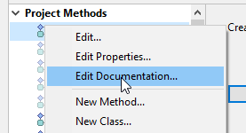
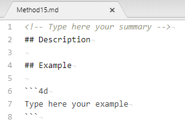
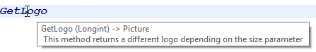

En los proyectos aplicación, puede documentar sus métodos así como sus formularios, tablas o campos. La creación de documentación es especialmente apropiada para proyectos desarrollados por varios programadores y, en general, es una buena práctica de programación. La documentación puede contener una descripción de un elemento, así como cualquier información necesaria para entender cómo funciona el elemento en la aplicación.

Los siguientes elementos del proyecto aceptan la documentación:

- Métodos (métodos base, métodos componente, métodos proyecto, métodos formulario, métodos 4D Mobile, triggers y clases)
- Formularios
- Tablas y campos

Sus archivos de documentación se escriben en la sintaxis Markdown (archivos .md) utilizando cualquier editor que soporte el Markdown. Se almacenan como archivos independientes dentro de la carpeta Proyecto.

La documentación se muestra en el área de vista previa (panel lateral derecho) del Explorador:


También se puede exponer parcialmente como [consejos del editor de código](#viewing-documentation-in-the-code-editor).

## Archivos documentación

### Nombre del archivo de documentación

Los archivos de documentación tienen el mismo nombre que su elemento adjunto, con la extensión ".md". Por ejemplo, el archivo de documentación adjunto al método proyecto `myMethod.4dm` se llamará `myMethod.md`.

En el Explorador, 4D muestra automáticamente el archivo de documentación con el mismo nombre que el elemento seleccionado (ver abajo).

### Arquitectura de los archivos de documentación

Todos los archivos de documentación se almacenan en la carpeta `Documentación`, situada en el primer nivel de la carpeta Package.

La arquitectura de la carpeta `Documentation` es la siguiente:

- **Documentation**
  - **Clases**
    - myClass.md
  - **DatabaseMethods**
    - onStartup.md
    - ...
  - **Formularios**
    - loginDial.md
    - ...
  - **Métodos**
    - myMethod.md
    - ...
  - **TableForms**
    - **1**
      - input.md
      - ...
    - ...
  - **Triggers**
    - table1.md
    - ...

- Un formulario proyecto y su método de formulario proyecto comparten el mismo archivo de documentación para el formulario y el método.
- Un formulario tabla y su método de formulario tabla comparten el mismo archivo de documentación para el formulario y el método.

> Renombrar o eliminar un elemento documentado en su proyecto también renombrará o eliminará el archivo Markdown asociado al elemento.

## Documentación en el Explorador

### Ver la documentación

Para ver la documentación en la ventana del Explorador:

1. Asegúrese de que se muestra el área de vista previa.
2. Seleccione el elemento documentado en la lista del Explorador.
3. Haga clic en el botón **Documentation** situado debajo del área de vista previa.


- Si no se ha encontrado ningún archivo de documentación para el elemento seleccionado, se muestra un botón **Crear** (ver más abajo).

- De lo contrario, si existe un archivo de documentación para el elemento seleccionado, el contenido se muestra en el área. El contenido no se puede editar directamente en el panel.

### Modificar el archivo de documentación

Puede crear y/o editar un archivo de documentación Markdown desde la ventana del Explorador para el elemento seleccionado.

Si no existe un archivo de documentación para el elemento seleccionado, puede:

- haga clic en el botón **Crear** en el panel `Documentation` o,
- elija la opción **Modificar la documentación...** en el menú contextual o el menú de opciones del Explorador.



4D crea automáticamente un archivo .md con el nombre adecuado y una plantilla básica en la ubicación correspondiente y lo abre con su editor Markdown predeterminado.

Si ya existe un archivo de documentación para el elemento seleccionado, puede abrirlo con su editor de Markdown eligiendo la opción **Modificar la documentación...** del menú contextual o del menú de opciones del Explorador.

## Visualizar la documentación en el editor de código

El editor de código 4D muestra una parte de la documentación de un método en su consejo de ayuda.


Si existe un archivo llamado `\&#060;MethodName&#062;.md` en la carpeta `\&#060;package&#062;/documentation`, el editor de código muestra (por prioridad):

- Todo texto introducido en una etiqueta HTML `comment` (*\<!-- command documentation -->*) en la parte superior del archivo markdown.

- O, si no se utiliza la etiqueta de `comentario` html, la primera frase después de una etiqueta `# Description` del archivo markdown.  
  En este caso, la primera línea contiene el **prototipo** del método, generado automáticamente por el analizador de código de 4D.

 > En caso contrario, el editor de código muestra [el comentario del bloque en la parte superior del código del método](https://doc.4d.com/4Dv18R2/4D/18-R2/Writing-a-method.300-4824019.en.html#4618226).

## Definición del archivo de documentación

4D utiliza una plantilla básica para crear nuevos archivos de documentación. Esta plantilla sugiere las funcionalidades específicas que permiten [mostrar la información en el editor de código](#viewing-documentation-in-the-code-editor).

Sin embargo, puede utilizar todas las [etiquetas Markdown soportadas](#supported-markdown).

Los nuevos archivos de documentación se crean con el siguiente contenido por defecto:



| Línea                                               | Descripción                                                                                                                                                                                 |
| --------------------------------------------------- | ------------------------------------------------------------------------------------------------------------------------------------------------------------------------------------------- |
| "\<!-- Type your summary here -->"       | Comentario HTML. Se utiliza prioritariamente como descripción del método en los [consejos del editor de código](#viewing-documentation-in-the-code-editor)                                  |
| ## Description                                     | Título de nivel 2 en Markdown. La primera frase después de esta etiqueta se utiliza como descripción del método en las sugerencias del editor de código si no se utiliza el comentario HTML |
| ## Ejemplo                                         | Título de nivel 2, puede utilizar esta área para mostrar un ejemplo de código                                                                                                               |
| \``` 4D <br/>Digite su ejemplo aquí \` `` | Se utiliza para dar formato a los ejemplos de código 4D (utiliza la librería highlight.js)                                                                                                  |

### Markdown soportado

- La etiqueta del título es soportada:

```
# Title 1
## Title 2
### Title 3
```

- Las etiquetas de estilo (cursiva, negrita, tachado) son compatibles:

```
_italic_
**bold**
**_bold/italic_**
~~strikethrough~~
```

- La etiqueta de bloque de código (\``4d ... ``) es compatible con el resaltado del código 4D:

 \``` 4d  
C_TEXT($txt)  
$txt:="Hello world!"  
\` ``

- La etiqueta de la tabla es soportada:

```
| Parameter | Type   | Description  |
| --------- | ------ | ------------ |
| wpArea    | Text |Write pro area|
| toolbar   | Text |Toolbar name  |
```

- La etiqueta del enlace es soportada:

```
// Caso 1
La [documentation](https://doc.4d.com) del comando ....

// Case 2
[4D blog][1]

[1]: https://blog.4d.com
```

- Las etiquetas de imagen son soportadas:

```


[](https://blog.4d.com)
```

[](https://blog.4d.com)

> Para más información, consulte la [guía Markdown de GitHub](https://guides.github.com/features/mastering-markdown/).

## Ejemplo

En el archivo `WP SwitchToolbar.md`, puede escribir:

```4d
<!-- Este método devuelve un logotipo diferente en función del parámetro de tamaño -->


GetLogo (size) -> logo


| Parameter | Type   | in/out | Description |
| --------- | ------ | ------ | ----------- |
| size      | Integer  | in | Logo style selector (1 to 5)  |
| logo      | Picture | out | Selected logo |


## Description

Este método devuelve un logotipo diferente en función del parámetro *size*.
1 = tamaño más pequeño, 5 = tamaño más grande.

## Ejemplo

C_PICTURE($logo)
C_LONGINT($size)

//Obtener el logo más grande
$logo:=GetLogo(5)
```

- Explorer view: 

- Code editor view: 
