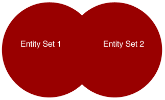

Después de [crear un conjunto de entidades]($method.md#methodentityset) mediante el uso de `$method=entityset`, puede utilizarlo posteriormente.

## Sintaxis disponible

| Sintaxis                                                                                                       | Ejemplo                                                                            | Descripción                                                                                         |
| -------------------------------------------------------------------------------------------------------------- | ---------------------------------------------------------------------------------- | --------------------------------------------------------------------------------------------------- |
| [**$entityset/\{entitySetID\}**](#entitysetentitySetID)                                                      | `/People/$entityset/0ANUMBER`                                                      | Recupera un conjunto de entidades existente                                                         |
| [**$entityset/\{entitySetID\}?$operator...&$otherCollection**](#entitysetentitysetidoperatorothercollection) | `/Employee/$entityset/0ANUMBER?$logicOperator=AND &$otherCollection=C0ANUMBER` | Crea un nuevo conjunto de entidades a partir de la comparación de conjuntos de entidades existentes |

## $entityset/\{entitySetID\}

Recupera un conjunto de entidades existente (*p. ej.*, `People/$entityset/0AF4679A5C394746BFEB68D2162A19FF`)

### Descripción

Esta sintaxis permite ejecutar cualquier operación sobre un conjunto de entidades definido.

Como los conjuntos de entidades tienen un límite de tiempo (ya sea por defecto o después de llamar a `$timeout` con su propio límite), puede llamar a `$savedfilter` y a `$savedorderby` para guardar el filtro y ordenar por instrucciones cuando cree un conjunto de entidades.

Cuando se recupera un conjunto de entidades existente almacenado en la caché de 4D Server, también se puede aplicar cualquiera de los siguientes elementos al conjunto de entidades: [`$expand`]($expand.md), [`$filter`]($filter.md), [`$orderby`]($orderby.md), [`$skip`]($skip.md) y [`$top/$limit`]($top_$limit.md).

### Ejemplo

Después de crear un conjunto de entidades, el ID del conjunto de entidades se devuelve junto con los datos. Llame a este ID de la siguiente manera:

 `GET  /rest/Employee/$entityset/9718A30BF61343C796345F3BE5B01CE7`

## $entityset/\{entitySetID\}?$operator...&$otherCollection

Cree otro conjunto de entidades basado en conjuntos de entidades creados anteriormente

| Parámetros       | Tipo | Descripción                                                                 |
| ---------------- | ---- | --------------------------------------------------------------------------- |
| $operator        | Text | Uno de los operadores lógicos para probar con el otro conjunto de entidades |
| $otherCollection | Text | ID del conjunto de entidades                                                |

### Descripción

Después de crear un conjunto de entidades (conjunto de entidades nº 1) utilizando `$method=entityset`, puede crear otro conjunto de entidades utilizando la sintaxis `$entityset/\{entitySetID\}?$operator... &$otherCollection`, la propiedad `$operator` (cuyos valores se muestran a continuación), y otro conjunto de entidades (conjunto de entidades nº 2) definido por la propiedad `$otherCollection`. Los dos conjuntos de entidades deben estar en la misma clase de datos.

A continuación, puede crear otro conjunto de entidades que contenga los resultados de esta llamada utilizando el `$method=entityset` al final de la petición REST.

Aquí están los operadores lógicos:

| Operador  | Descripción                                                                                                                                                                         |
| --------- | ----------------------------------------------------------------------------------------------------------------------------------------------------------------------------------- |
| AND       | Devuelve las entidades comunes a ambos conjuntos de entidades                                                                                                                       |
| O         | Devuelve las entidades contenidas en ambos conjuntos de entidades                                                                                                                   |
| EXCEPT    | Devuelve las entidades del conjunto de entidades #1 menos las del conjunto de entidades #2                                                                                          |
| INTERSECT | Devuelve true o false si hay una intersección de las entidades en ambos conjuntos de entidades (lo que significa que al menos una entidad es común en ambos conjuntos de entidades) |
> Los operadores lógicos no distinguen entre mayúsculas y minúsculas, por lo que puede escribir "AND" o "and".

A continuación se muestra una representación de los operadores lógicos basada en dos conjuntos de entidades. La sección roja es la que se devuelve.

**AND**

**O**

**EXCEPT**

La sintaxis es la siguiente:

 `GET  /rest/dataClass/$entityset/entitySetID?$logicOperator=AND&$otherCollection=entitySetID`

### Ejemplo

En el ejemplo siguiente, devolvemos las entidades que están en ambos conjuntos de entidades ya que estamos utilizando el operador lógico AND:

 `GET  /rest/Employee/$entityset/9718A30BF61343C796345F3BE5B01CE7?$logicOperator=AND&$otherCollection=C05A0D887C664D4DA1B38366DD21629B`

Si queremos saber si los dos conjuntos de entidades se cruzan, podemos escribir lo siguiente:

 `GET  /rest/Employee/$entityset/9718A30BF61343C796345F3BE5B01CE7?$logicOperator=intersect&$otherCollection=C05A0D887C664D4DA1B38366DD21629B`

Si hay una intersección, esta consulta devuelve true. En caso contrario, devuelve false.

En el siguiente ejemplo creamos un nuevo conjunto de entidades que combina todas las entidades de ambos conjuntos de entidades:

`GET  /rest/Employee/$entityset/9718A30BF61343C796345F3BE5B01CE7?$logicOperator=OR&$otherCollection=C05A0D887C664D4DA1B38366DD21629B&$method=entityset`
