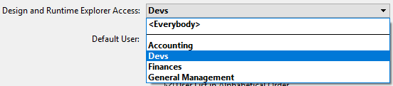

Si diferentes personas utilizan una aplicación, lo que suele ocurrir en la arquitectura cliente-servidor o de interfaces web, es necesario controlar el acceso u ofrecer diferentes funcionalidades según de los usuarios conectados. También es esencial ofrecer seguridad a los datos sensibles. Puede ofrecer esta protección asignando contraseñas a los usuarios y creando grupos que tengan diferentes niveles de acceso a la información en la aplicación o en las operaciones de la misma.

> Consulte la documentación [Guía de seguridad de 4D](https://blog.4d.com/4d-security-guide/) para una visión de conjunto de las funciones de seguridad de 4D.

## Asignación de acceso a grupos

El sistema de acceso con contraseña de 4D se basa en usuarios y grupos. Se crean usuarios y se les asignan contraseñas, se colocan los usuarios en grupos y se les asignan a cada grupo derechos de acceso apropiados a las partes de la aplicación.

Los grupos pueden entonces asignar privilegios de acceso a partes específicas o funcionalidades de la aplicación (acceso al modo Diseño, servidor HTTP, servidor SQL, etc.), o a toda parte personalizada.

El siguiente ejemplo muestra los derechos de acceso del explorador de diseño y tiempo de ejecución asignados al grupo "Devs":

## Activar el control de acceso

El sistema de control de acceso por contraseña de 4D en cliente-servidor se activa mediante **la asignación de una contraseña al Diseñador**.

Hasta que no le asigne una contraseña al Diseñador, todos los accesos a la aplicación se hacen con los derechos de acceso del Diseñador, incluso si ha configurado usuarios y grupos (cuando se abre la aplicación, no se requiere ninguna identificación). Se puede abrir cualquier parte de la aplicación.

Cuando se asigna una contraseña al Diseñador, todos los privilegios de acceso entran en vigor. Para poder conectarse a la aplicación, los usuarios remotos deben introducir una contraseña.

Para desactivar el sistema de acceso por contraseña, basta con eliminar la contraseña del Diseñador.

## Usuarios y grupos en la arquitectura proyecto

En las aplicaciones proyecto (archivos .4DProject o .4dz), los usuarios y grupos 4D pueden configurarse tanto en entornos monousuario como cliente-servidor. Sin embargo, el control de acceso sólo es efectivo con 4D Server. La siguiente tabla enumera las principales funcionalidades de los usuarios y grupos y su disponibilidad:

|                                                                          | 4D (monopuesto)                       | 4D Server |
| ------------------------------------------------------------------------ | ------------------------------------- | --------- |
| Añadir/editar usuarios y grupos                                          | sí                                    | sí        |
| Asignar el acceso de usuarios/grupos a los servidores                    | sí                                    | sí        |
| Identificación del usuario                                               | no (todos los usuarios son Diseñador) | sí        |
| Control de acceso una vez que se ha asignado una contraseña al Diseñador | no (todos los accesos son Diseñador)  | sí        |

## Editor de la caja de herramientas

Los editores de usuarios y grupos se encuentran en la caja de herramientas de 4D. Estos editores pueden utilizarse para crear tanto usuarios como grupos, asignar contraseñas a los usuarios, colocar a los usuarios en grupos, etc.

> El editor de usuarios y grupos se puede mostrar en tiempo de ejecución utilizando el comando [EDIT ACCESS](https://doc.4d.com/4Dv18/4D/18/EDIT-ACCESS.301-4504687.en.html). Users and groups editor can be displayed at runtime using the [EDIT ACCESS](https://doc.4d.com/4Dv18/4D/18/EDIT-ACCESS.301-4504687.en.html) command.

## Archivo directory.json

Los usuarios, grupos, así como sus derechos de acceso se almacenan en un archivo específico del proyecto llamado **directory.json**.

Este archivo puede almacenarse en las siguientes ubicaciones:

- en la carpeta de propiedades usuario, es decir, en la carpeta "Settings" al mismo nivel que la carpeta "Project". Estas propiedades se utilizan por defecto en la aplicación.
- en la carpeta de propiedades de los datos, es decir, en la carpeta " Settings " de la carpeta " Data ". Si un archivo **directory.json** está presente en esta ubicación, tiene prioridad sobre el archivo en la carpeta Settings usuario. Esta funcionalidad permite definir configuraciones Usuarios y Grupos personalizadas/locales. La configuración personalizada no se verá afectada por una actualización de la aplicación.

> Si el control de acceso con contraseña 4D está inactivo, no se crea el **directory.json**.
