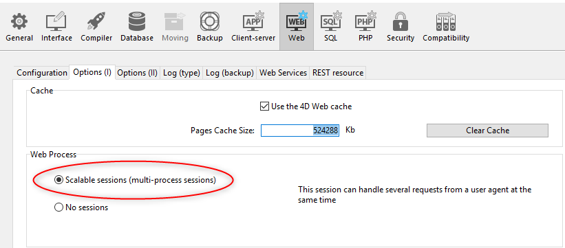

El servidor web de 4D ofrece funciones integradas para la gestión de **sesiones de usuario**. La creación y el mantenimiento de sesiones de usuario le permiten controlar y mejorar la experiencia del usuario en su aplicación web. Cuando se activan las sesiones de usuario, los clientes web pueden reutilizar el mismo contexto de servidor de una solicitud a otra.

Las sesiones de usuario del servidor web permiten:

- manejar múltiples peticiones simultáneamente desde el mismo cliente web a través de un número ilimitado de procesos apropiativos (las sesiones del servidor web son **escalables**),
- compartir datos entre los procesos de un cliente web,
- asociar privilegios a las sesiones de usuario,
- gestionan el acceso a través de un objeto `Session` y de la [Session API](API/SessionClass.md).

> **Nota:** la implementación actual es sólo el primer paso de una próxima funcionalidad completa que permitirá a los desarrolladores gestionar los permisos jerárquicos de los usuarios a través de las sesiones en toda la aplicación web.

## Activación de sesiones

La funcionalidad de gestión de sesiones puede ser activada y desactivada en su servidor web 4D. Hay diferentes maneras de habilitar la gestión de la sesión:

- Utilizando la opción **Sesiones escalables** en la página "Web/Opciones (I)" de la Configuración (configuración permanente): 

Esta opción está seleccionada por defecto en los nuevos proyectos. Sin embargo, se puede desactivar seleccionando la opción **Sin sesiones**, en cuyo caso las funcionalidades de la sesión web se desactivan (no hay ningún objeto `Session` disponible).

- Utilizando la propiedad [`.scalableSession`](API/WebServerClass.md#scalablesession) del objeto Web Server (para pasar el parámetro *settings* de la función [`.start()`](API/WebServerClass.md#start)). En este caso, esta configuración anula la opción definida en la caja de diálogo Configuración del objeto Servidor Web (no se almacena en el disco).

> El comando `WEB SET OPTION` también puede establecer el modo de sesión para el servidor web principal.

En cualquier caso, la configuración es local para la máquina; por lo que puede ser diferente en el servidor web de 4D Server y en los servidores web de las máquinas 4D remotas.

> **Compatibilidad**: una opción **Sesiones legacy** está disponible en proyectos creados con una versión de 4D anterior a 4D v18 R6 (para más información, consulte el sitio web [doc.4d.com](https://doc.4d.com)).

## Implementación de la sesión

Cuando [se habilitan las sesiones](#enabling-sessions), se implementan mecanismos automáticos, basados en una cookie privada establecida por el propio 4D: "4DSID_*AppName*", donde *AppName* es el nombre del proyecto de la aplicación. Esta cookie hace referencia a la sesión web actual de la aplicación.

> El nombre de la cookie puede obtenerse utilizando la propiedad [`.sessionCookieName`](API/WebServerClass.md#sessioncookiename).

1. En cada petición del cliente web, el servidor web comprueba la presencia y el valor de la cookie privada "4DSID_*AppName*".

2. Si la cookie tiene un valor, 4D busca la sesión que creó esta cookie entre las sesiones existentes; si se encuentra esta sesión, se reutiliza para la llamada.

2. Si la solicitud del cliente no corresponde a una sesión ya abierta:

- se crea una nueva sesión con una cookie privada "4DSID_*AppName*" en el servidor web
- se crea un nuevo objeto Guest `Session` dedicado a la sesión web escalable.

El objeto `Session` actual puede entonces ser accedido a través del comando [`Session`](API/SessionClass.md#session) en el código de cualquier proceso web.


> Los procesos web no suelen terminar, sino que se reciclan en un fondo común para ser más eficientes. Cuando un proceso termina de ejecutar una petición, se devuelve al pool y queda disponible para la siguiente petición. Dado que un proceso web puede ser reutilizado por cualquier sesión, [las variables de proceso](Concepts/variables.md#process-variables) deben ser borradas por su código al final de su ejecución (utilizando [`CLEAR VARIABLE`](https://doc.4d.com/4dv18/help/command/en/page89.html) por ejemplo). Esta limpieza es necesaria para cualquier información relacionada con el proceso, como una referencia a un archivo abierto. Esta es la razón por la que **se recomienda** utilizar el objeto [Sesión](API/SessionClass.md) cuando se quiera guardar información relacionada con la sesión.

### Modo apropiativo

En 4D Server, las sesiones del servidor web se manejan automáticamente a través de procesos apropiativos, **incluso en modo interpretado**. You need to make sure that your web code is [compliant with a preemptive execution](preemptiveWeb.md#writing-thread-safe-web-server-code).

> To debug web code on 4D Server (interpreted), you need to launch and connect [4D on the same machine as 4D Server](Desktop/clientServer.md#using-4d-and-4d-server-on-the-same-machine) and open the development environment (e.g., the Explorer) on the 4D application. With this configuration, all processes switch to cooperative mode and the web server code can be debugged.

Con 4D monopuesto, el código interpretado se ejecuta siempre en modo cooperativo.

## Compartir información

Cada objeto `Session` ofrece una propiedad [`.storage`](API/SessionClass.md#storage) que es un [objeto compartido](Concepts/shared.md). Esta propiedad permite compartir información entre todos los procesos manejados por la sesión.

## Fecha de caducidad de la sesión

Una sesión web escalable se cierra cuando:

- el servidor web está detenido,
- se ha alcanzado el tiempo de espera de la cookie de sesión.

La vida útil de una cookie inactiva es de 60 minutos por defecto, lo que significa que el servidor web cerrará automáticamente las sesiones inactivas después de 60 minutos.

Este tiempo de espera se puede establecer utilizando la propiedad [`.idleTimeout`](API/SessionClass.md#idletimeout) del objeto `Session` (el tiempo de espera no puede ser inferior a 60 minutos).

Cuando se cierra una sesión web escalable, si después se llama al comando [`Session`](API/SessionClass.md#session):

- el objeto `Session` no contiene privilegios (es una sesión de invitado)
- la propiédad [`.storage`](API/SessionClass.md#storage) está vacía
- se asocia una nueva cookie de sesión a la sesión

## Privilegios

Los privilegios pueden asociarse a las sesiones. En el servidor web, puede proporcionar un acceso o unas funcionalidades específicas en función de los privilegios de la sesión.

Puede asignar privilegios utilizando la función [`.setPrivileges()`](API/SessionClass.md#setprivileges). En su código, puede comprobar los privilegios de la sesión para permitir o denegar el acceso utilizando la función [`.hasPrivilege()`](API/SessionClass.md#hasprivilege). Por defecto, las nuevas sesiones no tienen ningún privilegio: son sesiones **invitados** (la función [`.isGuest()`](API/SessionClass.md#isguest) devuelve true).

> En la implementación actual (v18 R6), sólo está disponible el privilegio "WebAdmin".

Ejemplo:

```4d
If (Session.hasPrivilege("WebAdmin"))
 //Access is granted, do nothing
Else
 //Display an authentication page
End if
```

## Ejemplo

En una aplicación CRM, cada vendedor gestiona su propia cartera de clientes. El almacén de datos contiene al menos dos clases de datos vinculadas: Customers y SalesPersons (un vendedor tiene varios clientes).


Queremos que un vendedor se autentique, abra una sesión en el servidor web y que se carguen los 3 primeros clientes en la sesión.

1. Ejecutamos esta URL para abrir una sesión:

```
http://localhost:8044/authenticate.shtml
```

> En un entorno de producción, es necesario utilizar una conexión [HTTPS](API/WebServerClass.md#httpsenabled) para evitar que cualquier información no cifrada circule por la red.

2. La página `authenticate.shtml` es un formulario que contiene los campos de entrada *userId* y *password* y envía una acción 4DACTION POST:

```html
<!DOCTYPE html>
<html>
<body bgcolor="#ffffff">
<FORM ACTION="/4DACTION/authenticate" METHOD=POST>
 UserId: <INPUT TYPE=TEXT NAME=userId VALUE=""><br/>
 Password: <INPUT TYPE=TEXT NAME=password VALUE=""><br/>
<INPUT TYPE=SUBMIT NAME=OK VALUE="Log In">
</FORM>
</body>
</html>
```


3. El método authenticate project busca la persona *userID* y valida la contraseña contra el valor hash ya almacenado en la tabla *SalesPersons*:

```4d
var $indexUserId; $indexPassword; $userId : Integer
var $password : Text
var $userTop3; $sales; $info : Object


ARRAY TEXT($anames; 0)
ARRAY TEXT($avalues; 0)

WEB GET VARIABLES($anames; $avalues)

$indexUserId:=Find in array($anames; "userId")
$userId:=Num($avalues{$indexUserId})

$indexPassword:=Find in array($anames; "password")
$password:=$avalues{$indexPassword}

$sales:=ds.SalesPersons.query("userId = :1"; $userId).first()

If ($sales#Null)
    If (Verify password hash($password; $sales.password))
        $info:=New object()
        $info.userName:=$sales.firstname+" "+$sales.lastname
        Session.setPrivileges($info)
        Use (Session.storage)
            If (Session.storage.myTop3=Null)
                $userTop3:=$sales.customers.orderBy("totalPurchase desc").slice(0; 3)
                Session.storage.myTop3:=$userTop3
            End if 
        End use 
        WEB SEND HTTP REDIRECT("/authenticationOK.shtml")
    Else 
        WEB SEND TEXT("This password is wrong")
    End if 
Else 
    WEB SEND TEXT("This userId is unknown")
End if 
```
