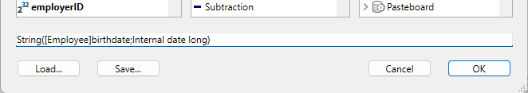
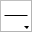

El editor de etiquetas de 4D ofrece una forma práctica de imprimir una amplia variedad de etiquetas. Con ella, puede hacer lo siguiente:

- Diseñe etiquetas para envíos postales, carpetas y fichas de archivo, y para muchas otras necesidades,
- crear e insertar elementos decorativos en un modelo de etiquetas,
- definir la fuente, el tamaño y el estilo de la fuente a utilizar para las etiquetas,
- determinar el número de etiquetas a lo largo y a lo ancho de cada página,
- Especifique cuántas etiquetas imprimir por registro,
- Especifique los márgenes de la página de etiquetas,
- designar un método a ejecutar al imprimir cada etiqueta o registro,
- Crea una vista previa e imprime las etiquetas.

:::note

Las etiquetas también se pueden crear usando el [Editor de formularios](../FormEditor/formEditor.md). Utilice el editor de formularios para diseñar etiquetas especializadas que incluyan variables o aproveche las herramientas de dibujo disponibles en el editor de formularios e imprímalas utilizando el editor de etiquetas o el comando [`PRINT LABEL`](../commands-legacy/print-label.md).

:::

El editor de etiquetas permite crear, formatear e imprimir las etiquetas. El editor de etiquetas contiene los parámetros para diseñar etiquetas y colocarlas en el papel de etiquetas. Por ejemplo, al producir etiquetas de correo, es posible que desee un diseño de etiqueta que incluya el nombre y apellidos de la persona en la primera línea, la dirección postal en la segunda línea, etc. Como parte del diseño, el editor de etiquetas le permite especificar el número de etiquetas de la página y los márgenes del papel de etiquetas para que el texto de las etiquetas quede centrado dentro de las mismas.
Cuando crea un diseño de etiqueta satisfactorio, puede guardarlo en disco para poder reutilizarlo.

Para abrir el editor de etiquetas:

- En el entorno Diseño, elija **Etiquetas...** en el menú **Herramientas** o en el menú asociado al botón "Herramientas" en la barra de herramientas de 4D.
  O
- En una aplicación, llame al comando [`PRINT LABEL`](../commands-legacy/print-label.md).


Utilice la página Etiqueta para especificar el contenido de la etiqueta y la página Diseño para definir el tamaño y la posición de las etiquetas en la página.


## Página Etiqueta

La página Etiqueta contiene varias áreas con opciones para diseñar y dar formato a las etiquetas.

### Lista de campos

Muestra los nombres de los campos de la tabla actual en una lista jerárquica. Si esta tabla está relacionada con otras tablas, los campos de clave externa tienen un signo más (en Windows) o una flecha (en macOS). Puede visualizar los campos de la tabla relacionada expandiendo los campos relacionados. Los campos de la tabla relacionada están indentados. Para utilizar un campo de esta lista en la plantilla de etiquetas, basta con arrastrarlo a la zona de vista previa de etiquetas situada a la derecha de la lista.

:::note Notas

- Sólo las tablas y los campos visibles aparecen en el editor de etiquetas.
- Los campos de [tipo Objeto](../Concepts/dt_object.md) no son compatibles con el editor de etiquetas.

:::

El área de búsqueda le permite limitar la lista de campos mostrados a aquellos que contengan la cadena de caracteres introducida:


### Vista previa de etiqueta

Utilice esta área para diseñar su zona de etiquetas colocando y posicionando todos los elementos que desee incluir en su etiqueta. El rectángulo blanco representa una sola etiqueta (su tamaño se configura en la página [Diseño](#layout-page)).

- Puede arrastrar los campos a la etiqueta.
- También puede concatenar dos campos soltando el segundo campo sobre el primero. Se separan automáticamente con un espacio.<br/>
  <br/>
  Si mantiene presionada la tecla **Mayús**, se separan con un retorno de carro. Esto le permite crear, por ejemplo, etiquetas de direcciones utilizando varios campos superpuestos (Dirección1, Dirección2, etc.), sin producir una línea vacía cuando una dirección sólo requiere un campo.
- Puede añadir una fórmula a la etiqueta seleccionando la herramienta **Fórmula**  (o eligiendo **Herramienta>Fórmula** en el menú contextual) y dibujando un área. The **Formula editor** is then displayed:
  <br/>
  For example, you can apply a format to a field using the [`String`](../commands-legacy/string.md) command:<br/>

<br/>

:::note

Tenga en cuenta que sólo puede introducir métodos "permitidos" para la base de datos en el Editor de fórmulas. Los métodos permitidos dependen de los [parámetros del proyecto](../settings/security.md#options) y del comando [`SET ALLOWED METHODS`](../commands/set-allowed-methods.md).

:::

- Puedes arrastrar y soltar archivos imagen, así como archivos de etiquetas (archivos ".4lbp") desde el escritorio del sistema operativo.

- Para modificar el área, haga doble clic en el contenido para pasar al modo edición. Al hacer doble clic en campos o fórmulas, aparece el **Editor de fórmulas**, que permite eliminar o modificar elementos:
  

### Formulario a utilizar

Esta lista desplegable permite definir un formulario tabla como modelo de etiqueta. El formulario elegido debe estar especialmente adaptado a la creación de etiquetas.
En este caso, el editor de etiquetas está parcialmente deshabilitado: sólo las funciones de la [página de diseño](#layout-page) pueden ser usadas — para permitirte configurar la página basada en el formulario. La imagen del formulario seleccionado se muestra en el área de previsualización de etiquetas.
Cuando se utiliza un formulario, 4D ejecuta cualquier método de formulario u objeto asociado a él. Al usar esta opción, también puede designar un método proyecto para ejecutar para cada registro o etiqueta y luego asignar variables (ver [este ejemplo](#printing-labels-using-forms-and-methods-example) más abajo). Si desea crear sus etiquetas utilizando el propio editor, deberá elegir la opción **Sin formulario**.

:::note Notas

- Puede restringir los formularios listados que aparecen en este menú mediante un [archivo JSON específico](#controlling-available-forms-and-methods).
- Si la base no contiene ningún formulario tabla, este menú no se muestra.

:::

### Comandos del área gráfica

El área gráfica del editor incluye tanto una barra de herramientas como un menú contextual que puede utilizar para diseñar su plantilla de etiquetas.

La parte izquierda de la barra de herramientas incluye comandos para seleccionar e insertar objetos. También puede acceder a estas herramientas mediante el comando **Herramienta>** del menú contextual del área.

| Icono                                     | Nombre de la herramienta | Descripción                                                                                                                                                                                                                                           |
| ----------------------------------------- | ------------------------ | ----------------------------------------------------------------------------------------------------------------------------------------------------------------------------------------------------------------------------------------------------- |
|  | Selección                | Haga clic en un solo objeto o dibuje un cuadro de selección alrededor de varios objetos. Para una selección de objetos no adyacentes, mantenga presionada **Mayús** y haga clic en cada objeto que desee seleccionar. |
|  | Creación de línea        |                                                                                                                                                                                                                                                       |
|  | Creación rectangular     | Para creación de rectángulo o rectángulo redondeado.                                                                                                                                                                                  |
|  | Creación de círculo      |                                                                                                                                                                                                                                                       |
|  | Inserción de texto       | Dibuja un rectángulo e introduce texto en su interior. Puede editar toda área de texto, incluidas las que contienen referencias a campos, haciendo doble clic en ellas.                                               |
|  | Inserción de fórmula     | Dibuje un rectángulo para mostrar el **Editor de fórmulas**, donde puede definir el contenido dinámico de las etiquetas (campos y fórmulas).                                                                       |

Hay atajos disponibles para mover o redimensionar objetos con mayor precisión utilizando las teclas de flecha del teclado:

- Las teclas de flecha del teclado mueven la selección de objetos de 1 píxel a la vez.
- **Mayús** + teclas de flecha mueven la selección de objetos 10 píxeles a la vez.
- **Ctrl** + teclas de flecha agrandan o reducen la selección de objetos en 1 píxel.
- **Ctrl** + **Maj** + teclas de flecha amplían o reducen la selección de objetos en 10 píxeles.

El lado derecho de la barra de herramientas contiene comandos utilizados para modificar elementos de la plantilla de etiqueta:

| Icono                                      | Nombre de la herramienta  | Descripción                                                                                                                                                                                                                                                                                                                                                                       |
| ------------------------------------------ | ------------------------- | --------------------------------------------------------------------------------------------------------------------------------------------------------------------------------------------------------------------------------------------------------------------------------------------------------------------------------------------------------------------------------- |
|   | Color de relleno          | todos los iconos de color muestran el color seleccionado                                                                                                                                                                                                                                                                                                                          |
|   | Color de línea            |                                                                                                                                                                                                                                                                                                                                                                                   |
|   | Peso lineal               |                                                                                                                                                                                                                                                                                                                                                                                   |
|  | Menú Fuente               | Define la fuente y su tamaño, así como el estilo, el color y la alineación del texto para los bloques de texto seleccionados.                                                                                                                                                                                                                                     |
|  | Alineación y distribución | Deben seleccionarse dos o más objetos para que las opciones de alineación estén disponibles. "Repartir" objetos significa definir automáticamente los intervalos horizontales o verticales entre al menos tres objetos, de modo que sean idénticos. El intervalo resultante es una media de todos los existentes en la selección. |
|  | Nivel de los objetos      | Mueve los objetos a la parte frontal o atrás, o mueve uno o más objetos hacia arriba o hacia abajo de un nivel.                                                                                                                                                                                                                                                   |

## Página Diseño

Esta página contiene los controles para imprimir etiquetas en función de los requisitos de sus parámetros de impresión actuales.


- **Orden de etiquetas**: indica si las etiquetas deben imprimirse en la dirección de las líneas o de las columnas.
- **Líneas** y **Columnas**: defina el número de etiquetas a imprimir por "línea" y "columna" en cada hoja. Estos parámetros determinan las dimensiones de las etiquetas cuando la opción "Dimensiones automáticas" está activada.
- **Etiquetas por registro**: define el número de copias a imprimir para cada etiqueta (las copias se imprimen consecutivamente).
- **Formato de impresión...**: formato de la página en la que se imprimirá la hoja de etiquetas. Cuando hace clic en este botón, aparece el cuadro de diálogo de configuración de la impresora seleccionada en su sistema. Por defecto, la hoja de etiquetas se genera basándose en una página A4 en modo retrato.
  **Nota:** la hoja creada por el editor se basa en la página lógica de la impresora, es decir, la página física (por ejemplo, una hoja A4) menos los márgenes que no se pueden utilizar a cada lado de la hoja. Los márgenes de la página física se representan por las líneas azules en el área de vista previa.
- **Unidad**: modifica las unidades en las que especifica las medidas de la etiqueta y de la página de etiqueta. Puede utilizar puntos, milímetros, centímetros o pulgadas.
- **Dimensiones automáticas**: indica que 4D calcula automáticamente el tamaño de las etiquetas (es decir, los parámetros Ancho y Alto) según los valores definidos en todos los demás parámetros. Cuando esta opción está marcada, el tamaño de las etiquetas se recalcula cada vez que se modifica un parámetro en la página. Los parámetros Ancho y Alto ya no pueden ajustarse manualmente.
- **Ancho** y **Alto**: define la altura y el ancho de cada etiqueta manualmente. No se pueden editar cuando la opción **Dimensionamiento automático** está marcada.
- **Márgenes** (Superior, Derecho, Izquierdo, Inferior): define los márgenes de su hoja. Estos márgenes son simbolizados por líneas azules en el área de vista previa. Al hacer clic en **Aplicar los márgenes de la impresora** con el fin de replicar, en el área de vista previa, la información de margen proporcionada por la impresora seleccionada (estos valores pueden ser modificados).
- **Intervalos**: defina el espacio vertical y/o horizontal entre las líneas y columnas de las etiquetas.
- **Método**: permite activar un método específico que se ejecutará al momento de la impresión. Por ejemplo, puede ejecutar un método que publique la fecha y la hora en que se imprimió cada etiqueta. Esta funcionalidad también es útil cuando se imprimen etiquetas usando un formulario tabla dedicado, en cuyo caso se pueden llenar variables a partir de un método.
  Para ser elegible para el procesamiento de etiquetas, un método proyecto debe cumplir con las siguientes condiciones:
  - debe ser "permitido" para la base de datos (los métodos permitidos dependen de los [parámetros del proyecto](../settings/security.md#options) y el comando [`SET ALLOWED METHODS`](../commands/set-allowed-methods.md), de lo contrario no se mostrará en el menú **Aplicación**.
  - debe tener la opción [Compartido por componentes y base de datos local](../Project/code-overview.md#shared-by-components-and-host-database).
    Ver también [este ejemplo](#printing-labels-using-forms-and-methods-example) a continuación.

:::note

Para necesidades avanzadas, puede restringir la lista de métodos disponibles utilizando un [archivo json específico](#controlling-available-forms-and-methods).
Las opciones **Para cada: Registro o Etiqueta** permiten especificar si ejecutar el método una vez por etiqueta o una vez por registro. Este control sólo tiene sentido si está imprimiendo más de una copia de cada etiqueta y también está ejecutando un método al momento de la impresión.

:::

- **Vista previa del diseño**: permite visualizar en tiempo real las modificaciones que ingrese en el editor de etiquetas. La vista previa de la página también refleja el tamaño de papel seleccionado en el cuadro de diálogo Configuración de la impresión. También puede utilizar esta área para designar la primera etiqueta de la página a imprimir (esta opción solo afecta a la primera hoja en el caso de la impresión multipágina). Esto puede ser útil, por ejemplo, cuando se desea imprimir en una hoja de etiquetas adhesivas, parte de las cuales ya se ha utilizado. También puede seleccionar la primera etiqueta en la página a imprimir haciendo clic en ella:


## Impresión de etiquetas mediante formularios y métodos (ejemplo)

Puede utilizar formularios de tabla dedicados y métodos proyecto para imprimir etiquetas con variables calculadas. Este ejemplo explica como configurar los diferentes elementos.

1. En un formulario tabla dedicado, añada su(s) campo(s) de etiqueta y su(s) variable(s).
   Aquí, en una tabla llamada "etiqueta", sumamos la variable *myVar*:
   

2. Crea un método proyecto llamado `setMyVar` con el siguiente código:

```4d
 var myVar+=1
```

3. Defina el método proyecto como ["Compartido por los componentes y la base de datos local"](../Project/code-overview.md#shared-by-components-and-host-database).

4. Antes de mostrar el editor de etiquetas, asegúrese de que el método proyecto está autorizado ejecutando este código:

```4d
 ARRAY TEXT($methods;1)
 $methods{1}:="setMyVar"
 SET ALLOWED METHODS($methods)
```

5. Abre el editor de etiquetas y use su formulario:
   

6. En la página Diseño, seleccione el método:
   

Luego puede imprimir sus etiquetas:


## Definición de los formularios y métodos disponibles

El editor de etiquetas incluye una función avanzada que le permite limitar los formularios y los métodos proyecto (dentro de los métodos "permitidos") pueden seleccionarse en el cuadro de diálogo:

- en el menú **Formulario a utilizar** de la página "Etiqueta" y/o
- en el menú **Aplicar (método)** de la página "Diseño".

1. Crea un archivo JSON llamado **labels.json** y ponlo en la [carpeta de recursos](../Project/architecture.md#resources) del proyecto.
2. En este archivo, añada los nombres de los formularios y/o métodos proyecto que desea poder seleccionar en los menús del editor de etiquetas.

El contenido del archivo **labels.json** debe ser similar a:

```json
[ 
    {"tableId":2,"forms":[],"methods":["myMethod1","myMethod2"]},
    {"tableId":1,"forms":["Sample Label 1","Sample Label 2"],"methods":[]}
]
```

Si no se ha definido ningún archivo **labels.json** entonces no se aplica ningún filtro.

## Gestión de archivos de etiquetas

4D le permite guardar cada modelo de etiquetas en un archivo que podrá abrir posteriormente desde el asistente. Si guarda sus diseños de etiquetas, podrá crear una biblioteca de etiquetas adaptada a sus necesidades específicas. Cada diseño de etiqueta almacena los ajustes definidos en las páginas Etiqueta y Diseño.

Puede arrastrar y soltar archivos de etiquetas desde el escritorio al área de diseño de etiquetas.

Los diseños de etiquetas se gestionan mediante los botones **Cargar** y **Guardar** de la barra de herramientas.

- Para cargar un diseño de etiqueta, haga clic en el botón **Cargar** y designe el diseño que desea cargar mediante el cuadro de diálogo Abrir archivo (si ya existe un diseño de etiqueta en el asistente, 4D lo sustituye por el que ha cargado).
- Para guardar un diseño de etiqueta, haga clic en el botón **Guardar** e indique el nombre y la ubicación del diseño que desea crear.

### Formato del archivo

La extensión de archivo de las etiquetas 4D guardadas por el asistente es ".4lbp". Tenga en cuenta que este formato es abierto, ya que está escrito internamente en XML.

### Precargando archivos de etiqueta

El editor de etiquetas le permite almacenar archivos de etiquetas dentro de su aplicación, de forma que los diseños de etiquetas puedan ser seleccionados y abiertos por el usuario directamente mediante el botón **Cargar**.

Para ello, basta con crear una carpeta llamada `Labels` en la [carpeta Resources](../Project/architecture.md#resources) del proyecto y copiar en ella los archivos de etiquetas:


:::note

Se admiten tanto los archivos ".4lbp" estándar como los generados por el asistente anterior (".4lb").

:::

Cuando se inicia el Asistente de etiquetas, si se detecta esta carpeta y contiene archivos de etiquetas válidos, se añade un icono emergente al botón **Cargar**. Los modelos de etiquetas pueden seleccionarse a través de una línea de menú:


