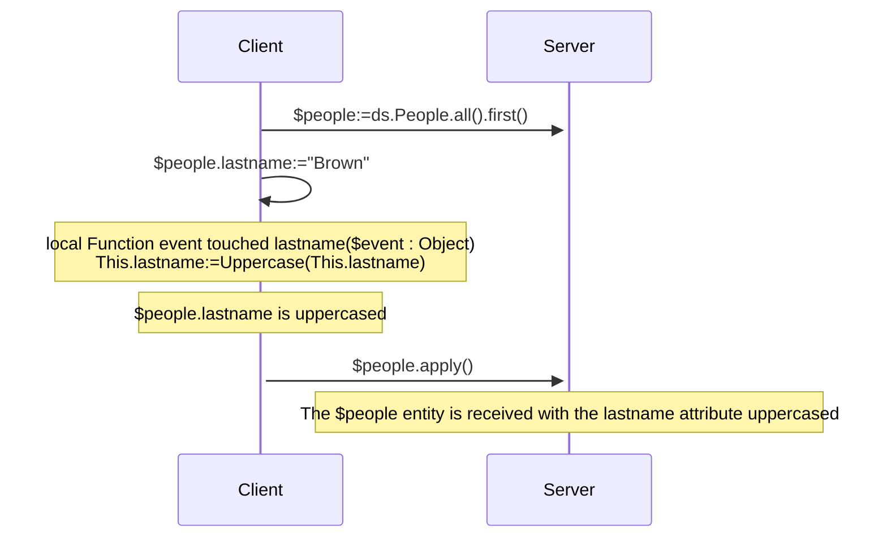
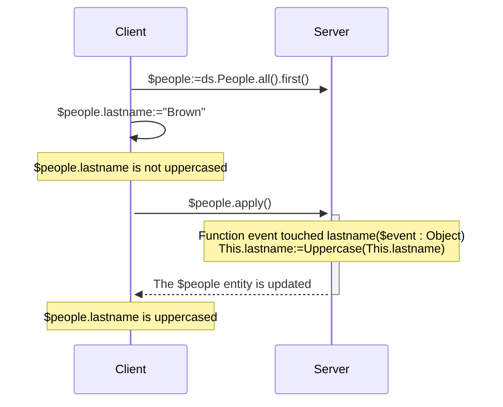
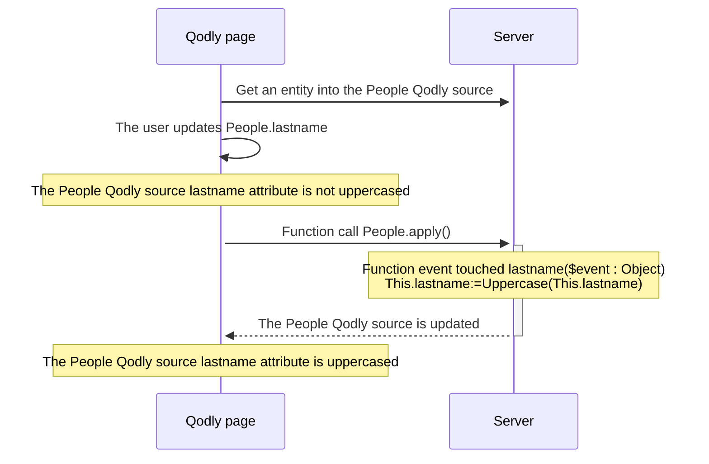

<details><summary>Historia</summary>

| Lanzamiento | Modificaciones      |
| ----------- | ------------------- |
| 20 R10      | touched event added |

</details>

ORDA events are functions that are automatically invoked by ORDA each time entities and entity attributes are manipulated (added, deleted, or modified). You can write very simple events, and then make them more sophisticated.

No se puede activar directamente la ejecución de la función de evento. Events are called automatically by ORDA based on user actions or operations performed through code on entities and their attributes.

:::info Nota de compatibilidad

ORDA events in the datastore are equivalent to triggers in the 4D database. However, actions triggered at the 4D database level using the 4D classic language commands or standard actions do not trigger ORDA events.

:::

## Generalidades

### Nivel del evento

A event function is always defined in the [Entity class](../ORDA/ordaClasses.md#entity-class).

It can be set at the **entity** level and/or the **attribute** level (it includes [**computed attributes**](../ORDA/ordaClasses.md#computed-attributes)). In the first case, it will be triggered for any attributes of the entity; on the other case, it will only be triggered for the targeted attribute.

For the same event, you can define different functions for different attributes.

You can also define the same event at both attribute and entity levels. The attribute event is called first and then the entity event.

### Ejecución en configuraciones remotas

Normalmente, los eventos ORDA se ejecutan en el servidor.

In client/server configuration however, the `touched()` event function can be executed on the **server or the client**, depending on the use of [`local`](./ordaClasses.md#local-functions) keyword. A specific implementation on the client side allows the triggering of the event on the client.

:::note

ORDA [`constructor()`](./ordaClasses.md#class-constructor) functions are always executed on the client.

:::

Con otras configuraciones remotas (p. ej. Qodly applications, [REST API requests](../REST/REST_requests.md), or requests through [`Open datastore`](../commands/open-datastore.md)), the `touched()` event function is always executed **server-side**. It means that you have to make sure the server can "see" that an attribute has been touched to trigger the event (see below).

### Tabla resumen

The following table lists ORDA events along with their rules.

| Evento                     | Nivel    | Nombre de la función                                    |                 (C/S) Ejecutado en                |
| :------------------------- | :------- | :------------------------------------------------------ | :------------------------------------------------------------------: |
| Instanciación de entidades | Entity   | [`constructor()`](./ordaClasses.md#class-constructor-1) |                                client                                |
| Atributo tocado            | Atributo | `event touched <attrName>()`                            | Depends on [`local`](../ORDA/ordaClasses.md#local-functions) keyword |
|                            | Entity   | `event touched()`                                       | Depends on [`local`](../ORDA/ordaClasses.md#local-functions) keyword |

:::note

The [`constructor()`](./ordaClasses.md#class-constructor-1) function is not actually an event function but is always called when a new entity is instantiated.

:::

## Parámetro *event*

Event functions accept a single *event* object as parameter. When the function is called, the parameter is filled with several properties:

| Nombre de propiedad | Disponibilidad                               | Tipo   | Descripción                                                                 |
| :------------------ | :------------------------------------------- | :----- | :-------------------------------------------------------------------------- |
| `kind`              | siempre                                      | String | Event name ("touched")                                   |
| *attributeName*     | Sólo para eventos que involucran un atributo | String | Nombre del atributo (por ejemplo, "nombre")              |
| *dataClassName*     | siempre                                      | String | Nombre de la Dataclass (*ej.* "Company") |

## Event function description

### `Function event touched`

#### Sintaxis

```4d
{local} Function event touched($event : Object)
{local} Function event touched <attributeName>($event : Object)
// code
```

This event is triggered each time a value is modified in the entity.

 - if you defined the function at the entity level (first syntax), it is triggered for modifications on any attribute of the entity.
 - if you defined the function at the attribute level (second syntax), it is triggered only for modifications on this attribute.

This event is triggered as soon as the 4D Server / 4D engine can detect a modification of attribute value which can be due to the following actions:

 - in **client/server with the [`local` keyword](../ORDA/ordaClasses.md#local-functions)** or in **4D single-user**:
    - el usuario define un valor en un formulario 4D,
    - el código 4D realiza una asignación con el operador `:=`. The event is also triggered in case of self-assignment (`$entity.attribute:=$entity.attribute`).
 - in **client/server without the `local` keyword**: some 4D code that makes an assignment with the `:=` operator is [executed on the server](../commands-legacy/execute-on-server.md).
 - in **client/server without the `local` keyword**, in **[Qodly application](https://developer.qodly.com/docs)** and **[remote datastore](../commands/open-datastore.md)**: the entity is received on 4D Server while calling an ORDA function (on the entity or with the entity as parameter). It means that you might have to implement a *refresh* or *preview* function on the remote application that sends an ORDA request to the server and triggers the event.
 - with the REST server: the value is received on the REST server with a [REST request](../REST/$method.md#methodupdate) (`$method=update`)

The function receives an [*event* object](#event-parameter) as parameter.

If this event [throws](../commands-legacy/throw.md) an error, it will not stop the undergoing action.

:::note

Este evento también se activa:

 - when attributes are assigned by the [`constructor()`](./ordaClasses.md#class-constructor-1) event,
 - when attributes are edited through the [Data Explorer](../Admin/dataExplorer.md).

:::

#### Ejemplo 1

You want to uppercase all text attributes of an entity when it is updated.

```4d
    //ProductsEntity class
Function event touched($event : Object)
	
	If (Value type(This[$event.attributeName])=Is text)
		This[$event.attributeName]:=Uppercase(This[$event.attributeName])
	End if 
```

#### Ejemplo 2

The "touched" event is useful when it is not possible to write indexed query code in [`Function query()`](./ordaClasses.md#function-query-attributename) for a [computed attribute](./ordaClasses.md#computed-attributes).

This is the case for example, when your [`query`](./ordaClasses.md#function-query-attributename) function has to compare the value of different attributes from the same entity, you must use formulas in the returned ORDA query -- which triggers sequential queries.

To fully understand this case, let's examine the following two calculated attributes:

```4d
Function get onGoing() : Boolean
        return ((This.departureDate<=Current date) & (This.arrivalDate>=Current date))

Function get sameDay() : Boolean
        return (This.departureDate=This.arrivalDate)
```

Even though they are very similar, these functions cannot be associated with identical queries because they do not compare the same types of values. The first compares attributes to a given value, while the second compares attributes to each other.

 - For the *onGoing* attribute, the [`query`](./ordaClasses.md#function-query-attributename) function is simple to write and uses indexed attributes:

```4d
Function query onGoing($event : Object) : Object
    var $operator : Text
    var $myQuery : Text
    var $onGoingValue : Boolean
    var $parameters : Collection
    $parameters:=New collection()

    $operator:=$event.operator
    Case of 
            : (($operator="=") | ($operator="==") | ($operator="==="))
                $onGoingValue:=Bool($event.value)
            : (($operator="!=") | ($operator="!=="))
                $onGoingValue:=Not(Bool($event.value))
            Else 
                return {query: ""; parameters: $parameters}
    End case 

    $myQuery:=($onGoingValue) ? "departureDate <= :1 AND arrivalDate >= :1" : "departureDate > :1 OR arrivalDate < :1"
        // the ORDA query string uses indexed attributes, it will be indexed
    $parameters.push(Current date)
    return {query: $myQuery; parameters: $parameters}
```

 - For the *sameDay* attribute, the [`query`](./ordaClasses.md#function-query-attributename) function requires an ORDA query based on formulas and will be sequential:

```4d
Function query sameDay($event : Object) : Text
    var $operator : Text
    var $sameDayValue : Boolean

    $operator:=$event.operator
    Case of 
        : (($operator="=") | ($operator="==") | ($operator="==="))
            $sameDayValue:=Bool($event.value)
        : (($operator="!=") | ($operator="!=="))
            $sameDayValue:=Not(Bool($event.value))
        Else 
            return ""
        End case 

    return ($sameDayValue) ? "eval(This.departureDate != This.arrivalDate)” : "eval(This.departureDate = This.arrivalDate)"
        // the ORDA query string uses a formula attributes, it will be indexed

```

 - Using a **scalar** *sameDay* attribute updated when other attributes are "touched" will save time:

```4d
    //BookingEntity class

Function event touched departureDate($event : Object) 

    This.sameDay:=(This.departureDate = This.arrivalDate) 
//
//
Function event touched arrivalDate($event : Object) 

    This.sameDay:=(This.departureDate = This.arrivalDate)

```

#### Ejemplo 3 (diagrama): cliente/servidor con la palabra clave `local`:



#### Example 4 (diagram): Client/server without the `local` keyword



#### Ejemplo 5 (diagrama): Aplicación Qodly




