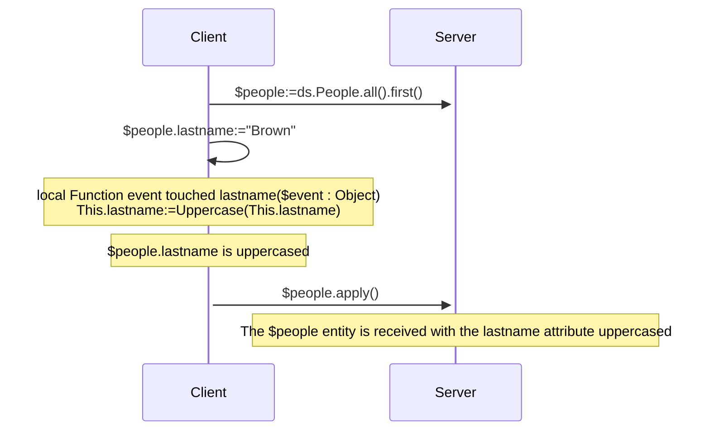
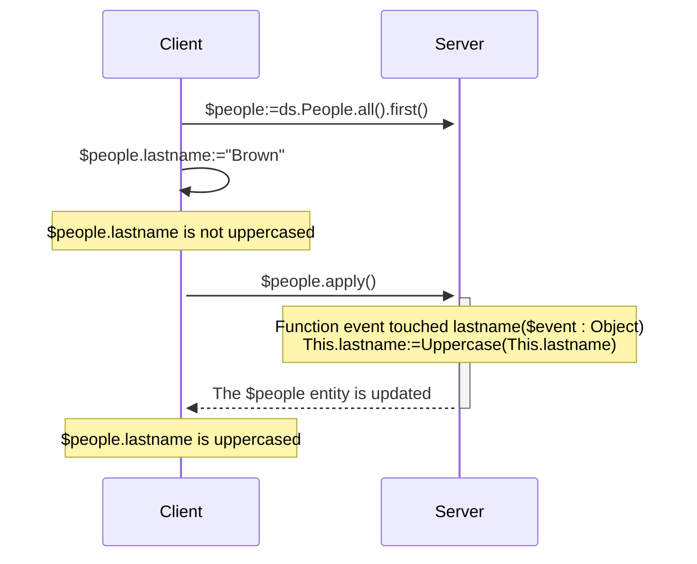
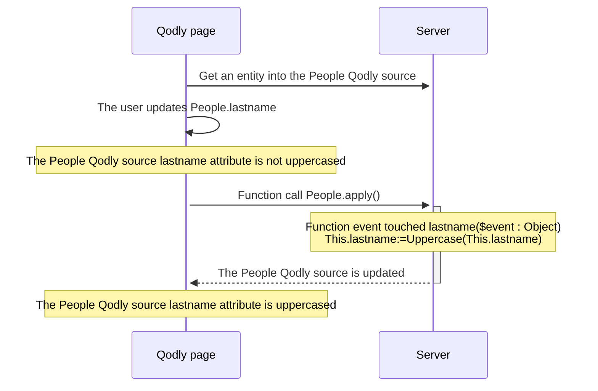

<details><summary>Historia</summary>

| Lanzamiento | Modificaciones                  |
| ----------- | ------------------------------- |
| 20 R10      | se ha añadido un evento touched |

</details>

Los eventos de entidad son funciones que ORDA invoca automáticamente cada vez que las entidades y los atributos de entidad se manipulan (añaden, eliminan o modifican). Puede escribir eventos muy sencillos y luego hacerlos más sofisticados.

No se puede activar directamente la ejecución de la función de evento. Los eventos son llamados automáticamente por ORDA basándose en las acciones del usuario o en las operaciones realizadas mediante código sobre las entidades y sus atributos.

:::info Nota de compatibilidad

Los eventos de entidad ORDA en el almacen de datos equivalen a triggers en la base de datos 4D. Sin embargo, las acciones desencadenadas a nivel de la base de datos 4D utilizando los comandos del lenguaje clásico 4D o las acciones estándar no desencadenan eventos ORDA. Note also that, unlike triggers, ORDA entity events do not lock the entire underlying table of a dataclass while saving or dropping entities. Several events can run in parallel as long as they involve distinct entities (i.e. records).

:::

## Generalidades

### Nivel del evento

Una función de evento de entidad se define siempre en la [clase Entity](../ORDA/ordaClasses.md#entity-class).

Un evento puede definirse al nivel de la **entidad** y/o a nivel del **atributo** (incluye los [**atributos calculados**](../ORDA/ordaClasses.md#computed-attributes)). En el primer caso, se activará para cualquier atributo de la entidad; en el otro caso, sólo se activará para el atributo objetivo.

Para un mismo evento, puede definir diferentes funciones para diferentes atributos.

También puede definir el mismo evento tanto a nivel del atributo como de la entidad. El evento atributo se llama primero y luego el evento entidad.

### Ejecución en configuraciones remotas

Normalmente, los eventos ORDA se ejecutan en el servidor.

Sin embargo, en la configuración cliente/servidor, la función de evento `touched()` puede ejecutarse en el **servidor o en el cliente**, dependiendo del uso de la palabra clave [`local`](./ordaClasses.md#local-functions). Una implementación específica en el lado del cliente permite la activación del evento en el cliente.

:::note

Las funciones ORDA [`constructor()`](./ordaClasses.md#class-constructor) se ejecutan siempre en el cliente.

:::

Con otras configuraciones remotas (p. ej. Qodly applications, [REST API requests](../REST/REST_requests.md), or requests through [`Open datastore`](../commands/open-datastore.md)), the `touched()` event function is always executed **server-side**. Esto significa que tiene que asegurarse de que el servidor puede "ver" que se ha tocado un atributo para activar el evento (ver abajo).

### Tabla resumen

La siguiente tabla lista los eventos de entidad ORDA junto con sus reglas.

| Evento                     | Nivel    | Nombre de la función                                    |                     (C/S) Ejecutado en                     |
| :------------------------- | :------- | :------------------------------------------------------ | :---------------------------------------------------------------------------: |
| Instanciación de entidades | Entity   | [`constructor()`](./ordaClasses.md#class-constructor-1) |                                     client                                    |
| Atributo tocado            | Atributo | `event touched <attrName>()`                            | Depende de la palabra clave [`local`](../ORDA/ordaClasses.md#local-functions) |
|                            | Entity   | `event touched()`                                       | Depende de la palabra clave [`local`](../ORDA/ordaClasses.md#local-functions) |

:::note

La función [`constructor()`](./ordaClasses.md#class-constructor-1) no es realmente una función de evento, pero siempre es llamada cuando una nueva entidad es instanciada.

:::

## Parámetro *event*

Las funciones de evento aceptan un único objeto *event* como parámetro. Cuando se llama a la función, el parámetro se llena con varias propiedades:

| Nombre de propiedad | Disponibilidad                               | Tipo   | Descripción                                                                 |
| :------------------ | :------------------------------------------- | :----- | :-------------------------------------------------------------------------- |
| `kind`              | siempre                                      | String | Nombre del evento ("touched")                            |
| *attributeName*     | Sólo para eventos que involucran un atributo | String | Nombre del atributo (por ejemplo, "nombre")              |
| *dataClassName*     | siempre                                      | String | Nombre de la Dataclass (*ej.* "Company") |

## Descripción de las funciones

### `Function event touched`

#### Sintaxis

```4d
{local} Function event touched($event : Object)
{local} Function event touched <attributeName>($event : Object)
// código
```

Este evento se activa cada vez que se modifica un valor en la entidad.

- if you defined the function at the entity level (first syntax), it is triggered for modifications on any attribute of the entity.
- si ha definido la función en el nivel de atributo (segunda sintaxis), se activa sólo para modificaciones en este atributo.

Este evento se activa tan pronto como el motor de 4D Server / 4D detecta una modificación del valor del atributo que puede deberse a las siguientes acciones:

- en **cliente/servidor con la [palabra clave `local`](../ORDA/ordaClasses.md#local-functions)** o en **4D monousuario**:
  - el usuario define un valor en un formulario 4D,
  - el código 4D realiza una asignación con el operador `:=`. El evento también se activa en caso de autoasignación (`$entity.attribute:=$entity.attribute`).
- en **cliente/servidor sin la palabra clave `local`**: algún código 4D que hace una asignación con el operador `:=` es [ejecutado en el servidor](../commands-legacy/execute-on-server.md).
- in **client/server without the `local` keyword**, in **[Qodly application](https://developer.qodly.com/docs)** and **[remote datastore](../commands/open-datastore.md)**: the entity is received on 4D Server while calling an ORDA function (on the entity or with the entity as parameter). Significa que puede que tenga que implementar una función *refresh* o *preview* en la aplicación remota que envía una petición ORDA al servidor y activa el evento.
- con el servidor REST: el valor es recibido en el servidor REST con una [petición REST](../REST/$method.md#methodupdate) (`$method=update`)

La función recibe un [objeto *event*](#event-parameter) como parámetro.

Si este evento [genera un error](../commands-legacy/throw.md), no detendrá la acción en curso.

:::note

Este evento también se activa:

- cuando los atributos son asignados por el evento [`constructor()`](./ordaClasses.md#class-constructor-1),
- cuando los atributos son editados a través del [Explorador de datos](../Admin/dataExplorer.md).

:::

#### Ejemplo 1

Quiere en mayúsculas todos los atributos de texto de una entidad cuando se actualiza.

```4d
    //ProductsEntity class
Function event touched($event : Object)
	
	If (Value type(This[$event.attributeName])=Is text)
		This[$event.attributeName]:=Uppercase(This[$event.attributeName])
	End if 
```

#### Ejemplo 2

El evento "touched" es útil cuando no es posible escribir código de consulta indexada en [`Function query()`](./ordaClasses.md#function-query-attributename) para un [atributo calculado](./ordaClasses.md#computed-attributes).

Este es el caso, por ejemplo, cuando tu función [`query`](./ordaClasses.md#function-query-attributename) tiene que comparar el valor de diferentes atributos de la misma entidad entre sí. Debe usar fórmulas en la consulta ORDA devuelta, que activa consultas secuenciales.

Para entender plenamente este caso, examinemos los siguientes dos atributos calculados:

```4d
Function get onGoing() : Boolean
        return ((This.departureDate<=Current date) & (This.arrivalDate>=Current date))

Function get sameDay() : Boolean
        return (This.departureDate=This.arrivalDate)
```

Aunque son muy similares, estas funciones no pueden ser asociadas con consultas idénticas porque no comparan los mismos tipos de valores. La primera compara los atributos a un valor determinado, mientras que la segunda compara los atributos entre sí.

- Para el atributo *onGoing*, la función [`query`](./ordaClasses.md#function-query-attributename) es sencilla de escribir y utiliza atributos indexados:

```4d
Function query onGoing($event : Object) : Object
    var $operator : Text
    var $myQuery : Text
    var $onGoingValue : Boolean
    var $parameters : Collection
    $parameters:=New collection()

    $operator:=$event.operator
    Case of 
            : (($operator="=") | ($operator="==") | ($operator="==="))
                $onGoingValue:=Bool($event.value)
            : (($operator="!=") | ($operator="!=="))
                $onGoingValue:=Not(Bool($event.value))
            Else 
                return {query: ""; parameters: $parameters}
    End case 

    $myQuery:=($onGoingValue) ? "departureDate <= :1 AND arrivalDate >= :1" : "departureDate > :1 OR arrivalDate < :1"
        // la cadena de consulta ORDA utiliza atributos indexados, se indexará
    $parameters.push(Current date)
    return {query: $myQuery; parameters: $parameters}
```

- Para el atributo *sameDay*, la función [`query`](./ordaClasses.md#function-query-attributename) requiere una consulta ORDA basada en fórmulas y será secuencial:

```4d
Function query sameDay($event : Object) : Text
    var $operator : Text
    var $sameDayValue : Boolean

    $operator:=$event.operator
    Case of 
        : (($operator="=") | ($operator="==") | ($operator="==="))
            $sameDayValue:=Bool($event.value)
        : (($operator="!=") | ($operator="!=="))
            $sameDayValue:=Not(Bool($event.value))
        Else 
            return ""
        End case 

    return ($sameDayValue) ? "eval(This.departureDate = This.arrivalDate)" : "eval(This.departureDate != This.arrivalDate)"
        // la cadena de consulta ORDA utiliza una fórmula, no será indexada

```

- Using a **scalar** *sameDay* attribute updated when other attributes are "touched" will save time:

```4d
    //BookingEntity class

Function event touched departureDate($event : Object) 

    This.sameDay:=(This.departureDate = This.arrivalDate) 
//
//
Function event touched arrivalDate($event : Object) 

    This.sameDay:=(This.departureDate = This.arrivalDate)

```

#### Ejemplo 3 (diagrama): cliente/servidor con la palabra clave `local`:



#### Ejemplo 4 (diagrama): cliente/servidor sin la palabra clave `local`



#### Ejemplo 5 (diagrama): Aplicación Qodly




