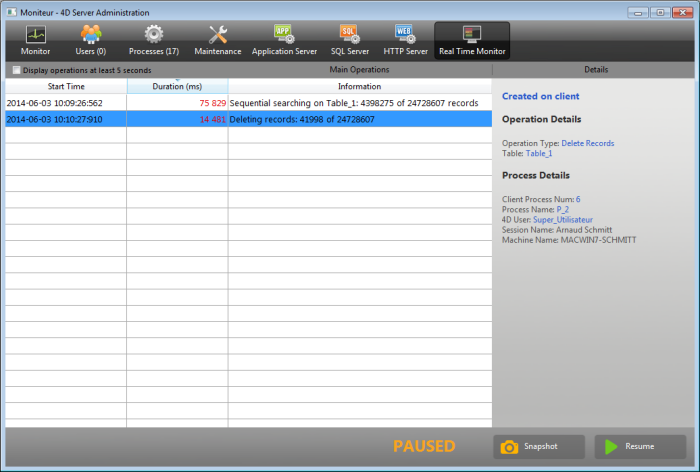

La página Monitor en tiempo real supervisa el progreso de las operaciones "largas" realizadas por la aplicación en tiempo real. Estas operaciones son, por ejemplo, consultas secuenciales, ejecución de fórmulas, etc.

> Esta página está disponible en la ventana de administración de la máquina servidor y también desde una máquina 4D remota. En el caso de un equipo remoto, esta página muestra los datos de las operaciones realizadas en el equipo servidor.

Se añade una línea para cada operación larga realizada en los datos. Esta línea desaparece automáticamente cuando finaliza la operación (puede marcar la opción **Mostrar operaciones al menos 5 segundos** para conservar las operaciones rápidas en pantalla durante 5 segundos, ver abajo).

La siguiente información se ofrece para cada línea:

- **Hora de inicio**: hora de inicio de la operación en el formato "dd/mm/yyyy - hh:mm:ss"
- **Duración** (ms): duración en milisegundos de la operación en curso
- **Información**: título de la operación.
- **Detalles**: esta área muestra información detallada que variará en función del tipo de operación seleccionada. En particular:
    - **Creada en**: indica si la operación es el resultado de una acción del cliente (Creada en cliente) o si se inició explícitamente en el servidor mediante un procedimiento almacenado o la opción "Ejecutar en el servidor" (Creada en servidor).
    - **Detalles de la operación**: tipo de operación y (para las operaciones de consulta) plan de búsqueda.
    - **Suboperaciones** (si las hay): operaciones dependientes de la operación seleccionada (por ejemplo, eliminar registros relacionados antes que un registro padre).
    - **Detalles del proceso**: información adicional relativa a la tabla, campo, proceso o cliente, en función del tipo de operación

> La página de monitoreo en tiempo real utiliza el comando [`ACTIVITY SNAPSHOT`](../commands-legacy/activity-snapshot.md) internamente. Puede encontrar más información en la descripción de este comando.

La página está activa y se actualiza permanentemente en cuanto se muestra. Cabe señalar que su funcionamiento puede ralentizar considerablemente la ejecución de la aplicación. Es posible suspender la actualización de esta página de una de las siguientes maneras:

- haciendo clic en el botón **Pausa**,
- haciendo clic en la lista,
- presionando la barra espaciadora.

Al pausar la página, aparece el mensaje "PAUSED" y la etiqueta del botón cambia a **Reanudar**.
Puede reanudar el seguimiento de las operaciones realizando la misma acción que para la pausa.

## Modo avanzado

La página MTR puede mostrar información adicional, si es necesario, para cada operación listada.

Para acceder al modo avanzado de una operación, presione **Mayús** y seleccione la operación deseada. All available information is then displayed in the "Process Details" area without any filtering (as returned by the `ACTIVITY SNAPSHOT` command). La información disponible depende de la operación seleccionada.

Este es un ejemplo de la información que se muestra en el modo estándar:

En el modo avanzado (**Mayús+Clic** en la operación), se muestra información adicional:

## Botón Instantánea

El botón **Instantánea** permite copiar en el portapapeles todas las operaciones que se muestran en el panel RTM, así como sus detalles relacionados (información de procesos y suboperaciones):

## Mostrar operaciones al menos 5 segundos

Si marca la opción **Mostrar operaciones al menos 5 segundos**, todas las operaciones listadas se mostrarán en la página durante al menos cinco segundos, incluso después de que finalice su ejecución. Las operaciones retenidas aparecen atenuadas en la lista de operaciones. Esta función es útil para obtener información sobre las operaciones que se ejecutan muy rápidamente.
