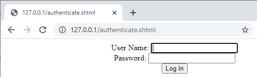

El servidor web de 4D ofrece funciones integradas para la gestión de **sesiones web**. La creación y el mantenimiento de sesiones web le permiten controlar y mejorar la experiencia del usuario en su aplicación web. Cuando se activan las sesiones web, los clientes web pueden reutilizar el mismo contexto de servidor de una solicitud a otra.

Las sesiones web permiten:

- manejar múltiples peticiones simultáneamente desde el mismo cliente web a través de un número ilimitado de procesos apropiativos (las sesiones web son **escalables**),
- gestionar la sesión a través de un objeto `Session` y la [Session API](API/SessionClass.md),
- almacenar y compartir datos entre procesos de un cliente web utilizando el [.storage](../API/SessionClass.md#storage) de la sesión,
- asociar privilegios al usuario que ejecuta la sesión.

:::tip Entrada de blog relacionada

[Sesiones escalables para aplicaciones web avanzadas](https://blog.4d.com/scalable-sessions-for-advanced-web-applications/)

:::

## Usos

Las sesiones web se utilizan para:

- [Aplicaciones web](gettingStarted.md) que envían peticiones http,
- llamadas a la [REST API](../REST/authUsers.md), que utilizan [datastores remotos](../ORDA/remoteDatastores.md) y [formularios Qodly](qodly-studio.md).

## Activando sesiones web {#enabling-web-sessions}

La funcionalidad de gestión de sesiones puede ser activada y desactivada en su servidor web 4D. Hay diferentes maneras de habilitar la gestión de la sesión:

- Utilizando la opción de **sesiones escalables** en la página "Web/Opciones (I)" de la Configuración (configuración permanente):
  

Esta opción está seleccionada por defecto en los nuevos proyectos. Sin embargo, se puede desactivar seleccionando la opción **Sin sesiones**, en cuyo caso las funcionalidades de la sesión web se desactivan (no hay ningún objeto `Session` disponible).

- Usando la propiedad [`.scalableSession`](API/WebServerClass.md#scalablesession) del objeto Servidor Web (para pasar el parámetro *settings* de la función [`.start()`](API/WebServerClass.md#start)). En este caso, esta configuración anula la opción definida en la caja de diálogo Configuración del objeto Servidor Web (no se almacena en el disco).

> El comando [`WEB SET OPTION`](../commands-legacy/web-set-option.md) también puede definir el modo de sesión para el servidor Web principal.

En cualquier caso, la configuración es local para la máquina; por lo que puede ser diferente en el servidor web de 4D Server y en los servidores web de las máquinas 4D remotas.

> **Compatibilidad**: una opción **Sesiones legacy** está disponible en proyectos creados con una versión de 4D anterior a 4D v18 R6 (para más información, consulte el sitio web [doc.4d.com](https://doc.4d.com)).

## Implementación de la sesión

When [sessions are enabled](#enabling-web-sessions), automatic mechanisms are implemented, based upon a private cookie set by 4D itself: "4DSID__AppName_", where *AppName* is the name of the application project. Esta cookie hace referencia a la sesión web actual de la aplicación.

:::info

El nombre de la cookie se puede obtener utilizando la propiedad [`.sessionCookieName`](API/WebServerClass.md#sessioncookiename).

:::

1. En cada petición del cliente web, el servidor web comprueba la presencia y el valor de la cookie privada "4DSID__AppName_".

2. Si la cookie tiene un valor, 4D busca la sesión que creó esta cookie entre las sesiones existentes; si se encuentra esta sesión, se reutiliza para la llamada.

3. Si la solicitud del cliente no corresponde a una sesión ya abierta:

- se crea una nueva sesión con una cookie privada "4DSID__AppName_" en el servidor web
- se crea un nuevo objeto Guest `Session` dedicado a la sesión web escalable.

:::note

La creación de una sesión web para una petición REST puede requerir que una licencia esté disponible, consulte [esta página](../REST/authUsers.md).

:::

Se puede acceder al objeto `Session` de la sesión actual a través del comando [`Session`](commands/session.md) en el código de todo proceso web.


:::info

Los procesos web no suelen terminar, sino que se reciclan en un fondo común para ser más eficientes. Cuando un proceso termina de ejecutar una petición, se devuelve al pool y queda disponible para la siguiente petición. Dado que un proceso web puede ser reutilizado por cualquier sesión, las [variables proceso](Concepts/variables.md#process-variables) deben ser borradas por su código al final de su ejecución (utilizando [`CLEAR VARIABLE`](../commands-legacy/clear-variable.md) por ejemplo). Esta limpieza es necesaria para cualquier información relacionada con el proceso, como una referencia a un archivo abierto. Esta es la razón por la que **se recomienda** utilizar el objeto [Sesión](API/SessionClass.md) cuando se quiera guardar información relacionada con la sesión.

:::

## Almacenar y compartir información de sesión

Cada objeto `Session` proporciona una propiedad [`.storage`](API/SessionClass.md#storage) que es un [objeto compartido](Concepts/shared.md). Esta propiedad permite compartir información entre todos los procesos manejados por la sesión.

## Fecha de caducidad de la sesión

Una sesión web escalable se cierra cuando:

- el servidor web está detenido,
- se ha alcanzado el tiempo de espera de la cookie de sesión.

La vida útil de una cookie inactiva es de 60 minutos por defecto, lo que significa que el servidor web cerrará automáticamente las sesiones inactivas después de 60 minutos.

Este tiempo de espera puede establecerse utilizando la propiedad [`.idleTimeout`](API/SessionClass.md#idletimeout) del objeto `Session` (el tiempo de espera no puede ser inferior a 60 minutos) o el parámetro *connectionInfo* del comando [`Open datastore`](../commands/open-datastore.md).

Cuando se cierra una sesión web, si después se llama al comando [`Session`](commands/session.md):

- el objeto `Session` no contiene privilegios (es una sesión de invitado)
- la propiedad [`.storage`](API/SessionClass.md#storage) está vacía
- se asocia una nueva cookie de sesión a la sesión

:::info

Puede cerrar una sesión desde un formulario Qodly utilizando la función [**logout**](qodly-studio.md#logout).

:::

## Privilegios

Fecha de caducidad de la sesión En el servidor web, puede proporcionar un acceso o unas funcionalidades específicas en función de los privilegios de la sesión.

Puedes asignar privilegios utilizando la función [`.setPrivileges()`](API/SessionClass.md#setprivileges). En su código, puede comprobar los privilegios de la sesión para permitir o denegar el acceso utilizando la función [`.hasPrivilege()`](API/SessionClass.md#hasprivilege). Por defecto, las sesiones nuevas no tienen ningún privilegio: son sesiones **Invitadas** (la función [`.isGuest()`](API/SessionClass.md#isguest) devuelve true).

Ejemplo:

```4d
If (Session.hasPrivilege("WebAdmin"))
	//Acceso concedido, no hacer nada
Else
	//Mostrar una página de autenticación
End if
```

:::info

Los privilegios se implementan en el corazón de la arquitectura ORDA para proporcionar a los desarrolladores una tecnología poderosa para controlar el acceso al almacén de datos y a las funciones de la clase de datos. Para más información, consulte la página [**Privilegios**](../ORDA/privileges.md) del capítulo ORDA.

:::

## Ejemplo

En una aplicación CRM, cada vendedor gestiona su propia cartera de clientes. El almacén de datos contiene al menos dos clases de datos vinculadas: Customers y SalesPersons (un vendedor tiene varios clientes).


Queremos que un vendedor se autentique, abra una sesión en el servidor web y que se carguen los 3 primeros clientes en la sesión.

1. Ejecutamos esta URL para abrir una sesión:

```
http://localhost:8044/authenticate.shtml
```

> En un entorno de producción, es necesario utilizar una conexión [HTTPS](API/WebServerClass.md#httpsenabled) para evitar que cualquier información no cifrada circule por la red.

2. La página `authenticate.shtml` es un formulario que contiene los campos de entrada *userId* y *password* y envía una acción 4DACTION POST:

```html
<!DOCTYPE html>
<html>
<body bgcolor="#ffffff">
<FORM ACTION="/4DACTION/authenticate" METHOD=POST>
	UserId: <INPUT TYPE=TEXT NAME=userId VALUE=""><br/>
	Password: <INPUT TYPE=TEXT NAME=password VALUE=""><br/>
<INPUT TYPE=SUBMIT NAME=OK VALUE="Log In">
</FORM>
</body>
</html>
```



3. El método authenticate project busca la persona *userID* y valida la contraseña contra el valor hash ya almacenado en la tabla *SalesPersons*:

```4d
var $indexUserId; $indexPassword; $userId : Integer
var $password : Text
var $userTop3; $sales; $info : Object


ARRAY TEXT($anames; 0)
ARRAY TEXT($avalues; 0)

WEB GET VARIABLES($anames; $avalues)

$indexUserId:=Find in array($anames; "userId")
$userId:=Num($avalues{$indexUserId})

$indexPassword:=Find in array($anames; "password")
$password:=$avalues{$indexPassword}

$sales:=ds.SalesPersons.query("userId = :1"; $userId).first()

If ($sales#Null)
    If (Verify password hash($password; $sales.password))
        $info:=New object()
        $info.userName:=$sales.firstname+" "+$sales.lastname
        Session.setPrivileges($info)
        Use (Session.storage)
            If (Session.storage.myTop3=Null)
                $userTop3:=$sales.customers.orderBy("totalPurchase desc").slice(0; 3)

                Session.storage.myTop3:=$userTop3
            End if
        End use
        WEB SEND HTTP REDIRECT("/authenticationOK.shtml")
    Else
        WEB SEND TEXT("This password is wrong")
    End if
Else
    WEB SEND TEXT("This userId is unknown")
End if
```

:::tip Entradas de blog relacionadas

[Sesiones escalables para aplicaciones web avanzadas](https://blog.4d.com/scalable-sessions-for-advanced-web-applications/)

:::

## Token de sesión (OTP)

El servidor web 4D le permite generar, compartir y utilizar tokens de sesión OTP (One-Time Passcode). Los tokens de sesión OTP se utilizan para asegurar comunicaciones con aplicaciones de terceros o sitios web. For information on OTP, please refer to the [One-time password page](https://en.wikipedia.org/wiki/One-time_password) on Wikipedia.

In 4D, OTP session tokens are useful when calling external URLs and being called back in another browser or device (mobile/computer). Normalmente, una aplicación de terceros envía un correo electrónico de confirmación que contiene un enlace de retrollamada en el que el usuario tiene que hacer clic. El enlace de retrollamada incluye el token OTP, para que la sesión que activó la retrollamada se cargue junto con sus datos y privilegios. This principle allows you to share the same session on multiple devices. Gracias a esta arquitectura, la [cookie de sesión](#session-implementation) no está expuesta en la red, lo que elimina el riesgo de un ataque de hombre en el medio.

### Generalidades

La secuencia básica de uso de un testigo de sesión OTP en una aplicación web 4D es la siguiente:

1. El usuario web inicia una acción que requiere una conexión segura de terceros, por ejemplo una validación, desde una sesión específica.
2. En su código 4D, crea un nuevo OTP para la sesión utilizando la función [`Session.createOTP()`](../API/SessionClass.md#createotp).
3. Usted envía una solicitud a la aplicación de terceros con el token de sesión incluido en la retrollamda Uri. Tenga en cuenta que la forma de proporcionar la retrollamada Uri a una aplicación de terceros depende de su API (ver más adelante).
4. La aplicación de terceros devuelve una petición a 4D con el patrón que usted proporcionó en la retrollamada Uri.
5. La retrollamada de la petición se procesa en su aplicación.

Por definición, un token OTP sólo puede utilizarse una vez. En este escenario, si se recibe una petición web con un testigo de sesión como parámetro que ya ha sido utilizado, no se restaura la sesión inicial.

### Procesando el OTP en la retrollamada

Las retrollamadas de aplicaciones de terceros que incluyen el token OTP pueden ser procesadas de diferentes maneras en su aplicación 4D. dependiendo de su desarrollo y de la API de terceros. Básicamente, tienes dos posibilidades para manejar el token: a través del parámetro **`$4DSID`** para un procesamiento automático, o a través de un parámetro personalizado que necesite procesar.

#### Uso de `$4DSID` en la URL

Utilizar el parámetro `$4DSID` es la forma más sencilla de procesar una retrollamada desde la aplicación de terceros:

- El token OTP se ofrece como parámetro directamente en la url de retrollamada utilizando la sintaxis estándar `?$4DSID=XXXX123`.
- In 4D, you implement a dedicated [HTTP Request handler](http-request-handler.md) in your 4D application using [`IncomingMessage`](../API/IncomingMessageClass.md) and [`OutgoingMessage`](../API/OutgoingMessageClass.md) classes.
- If the `$4DSID` token is valid, the related web user session is **automatically restored** in any web process with its storage and privileges.

:::note

Una url [`4DACCIÓN`](./httpRequests.md#4daction) también puede ser usada en el lado 4D.

:::

#### Utilizar un parámetro personalizado

El token OTP también se puede suministrar como un parámetro personalizado que necesita procesar específicamente para restaurar la sesión. Debe utilizar esta solución si:

- la aplicación de terceros no permite insertar parámetros como un `$4DSID` directamente en la Uri de redirección, y proporciona una API dedicada (la implementación depende de la aplicación de terceros),
- o, quiere llamar a una función ORDA a través de REST para procesar la retrollamada, en cuyo caso es necesario pasar el OTP con la [sintaxis de parámetro REST](../REST/ClassFunctions.md#parameters) (por ejemplo, `?$params='["XXX123"]'`).

En ambos casos, necesita extraer el token del parámetro personalizado y llamar a la función [`Session.restore()`](../API/SessionClass.md#restore) con el token como parámetro.

#### Procesando un OTP inválido

El token OTP se considera inválido si:

- el token de sesión ya ha sido utilizado,
- el token de sesión ha caducado,
- el token de sesión no existe,
- la propia sesión original ha caducado.

En este caso, no se restaura ninguna sesión de usuario web y la sesión actual (si existe) se deja sin cambios. Normalmente, puede decidir mostrar una página de conexión o abrir una sesión guest.

La verificación de la validez del token OTP recibido depende de cómo fue manejado:

- Si utilizó un `$4DSID`, puede almacenar una propiedad de estado personalizada en el [almacenamiento de sesión](../API/SessionClass.md#storage) en el momento de la creación de tokens, y compruebe este estado una vez que el token OTP fue recibido para ver si es el mismo valor (ver ejemplo).
- Si uso la función [`Session.restore()`](../API/SessionClass.md#restore), devuelve true si la sesión se restauró correctamente.

### Escenario con $4DSID

El escenario utilizando la clave `$4DSID` se ilustra en el siguiente diagrama:


La definición del gestor de peticiones HTTP de 4D:

```json
[
  {
    "class": "OperationsHandler",
    "method": "handleOperation",
    "regexPattern": "/my4DApp/completeOperation",
    "verbs": "get"
  }
]
```

La clase singleton:

```4d
//Class OperationsHandler
shared singleton Class constructor()
    function handleOperation($request : 4D.IncomingMessage) 
    $session:=Session
```

### Escenario con función `restore`

El escenario usando un parámetro personalizado se ilustra en el siguiente diagrama:


La definición del gestor de peticiones HTTP de 4D:

```json
[
  {
    "class": "OperationsHandler",
    "method": "handleOperation",
    "regexPattern": "/my4DApp/completeOperation",
    "verbs": "get"
  }
]
```

La clase singleton:

```4d
//Class OperationsHandler
shared singleton Class constructor()
    Function handleOperation($req : 4D.IncomingMessage) : 4D.OutgoingMessage
    Session.restore($req.urlQuery.state)
```

### Ejemplo de validación de correo electrónico con $4DSID

1. A user account is created in a *Users* dataclass. A *$info* object is received with the email and password. Se genera un OTP correspondiente a la sesión actual. A continuación, se devuelve una URL con esta OTP dada en el parámetro $4DSID.

```4d
//cs.Users class

Function create($info : Object) : Text
	
var $user : cs.UsersEntity
var $status : Object
var $token : Text
	
$user:=This.new() //create a new user
$user.fromObject($info)
$status:=$user.save()
	
//Store information in the session
//including user creation status
Use (Session.storage)
	Session.storage.status:=New shared object("step"; "Waiting for validation email"; /
    "email"; $user.email; "ID"; $user.ID)
End use 
	
//Generate an OTP corresponding to the session
$token:=Session.createOTP()

// Return an URL with a $4DSID parameter
return "https://my.server.com/tools/validateEmail?$4DSID="+$token`

```

2. Se envía al usuario esta URL como enlace en un correo electrónico. El prefijo URL `/validateEmail` es manejado por un [gestor de solicitudes HTTP personalizadas](./http-request-handler.md):

```json
[
  {
    "class": "RequestHandler",
    "method": "validateEmail",
    "regexPattern": "/validateEmail",
    "verbs": "get"
  }
]
```

The *validateEmail()* function of the RequestHandler singleton:

```4d
//validateEmail class

shared singleton Class constructor()

Function validateEmail() : 4D.OutgoingMessage
	
 var $result:=4D.OutgoingMessage.new()
    //The session which generated the OTP is retrieved 
    //thanks to the $4DSID parameter given in the URL
 If (Session.storage.status.step="Waiting for validation email")
	
  $user:=ds.Users.get(Session.storage.status.ID)
  $user.emailValidated() //set to true
		
  $result.setBody("Congratulations <br>"\
  +"Your email "+Session.storage.status.email+" has been validated")
		
  $result.setHeader("Content-Type"; "text/html"	
  Use (Session.storage.status)
	Session.storage.status.step:="Email validated"
  End use
 Else
  $result.setBody("Invalid token")

 End if 
	
 return $result

```

Dado que el parámetro `$4DSID` contiene una OTP válida correspondiente a la sesión original, el objeto `Session` hace referencia a la sesión que creó la OTP.

Se crea un nuevo usuario y se almacena cierta información en la sesión, especialmente el paso actual del proceso de creación de la cuenta de usuario (Esperando correo electrónico de validación) y el ID de usuario.

### Contextos soportados

- Se admiten esquemas HTTP y HTTPS.
- Sólo [sesiones escalables](#enabling-web-sessions) pueden ser reutilizados con tokens.
- Sólo se pueden reutilizar las sesiones de la base de datos local (las sesiones creadas en servidores web de componentes no se pueden restaurar).
- Los tokens no son compatibles con las sesiones cliente/servidor ni con las sesiones monousuario.

### Vida útil

Un testigo de sesión tiene una vida útil, y la propia sesión tiene una vida útil. El tiempo de vida útil del token de sesión puede definirse [en la creación de tokens](../API/SessionClass.md#createotp). Por defecto, el tiempo de vida del token es el mismo valor que el valor de [`.idleTimeout`](../API/SessionClass.md#idletimeout).

Una sesión solo se restaura mediante un token si tanto la vida útil del token de sesión como la vida útil de la sesión no han expirado. En otros casos (el testigo de sesión ha caducado y/o la propia sesión ha caducado), se crea una sesión de invitado cuando se recibe una petición web con un testigo de sesión.

:::note

Para obtener más información, consulte la entrada de blog [Conecte sus aplicaciones web a sistemas de terceros](https://blog.4d.com/connect-your-web-apps-to-third-party-systems/).

:::