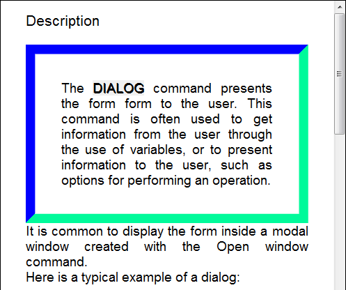
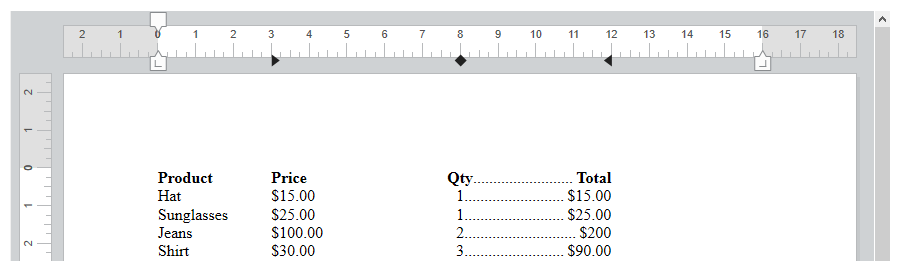

<!--REF #_command_.WP SET ATTRIBUTES.Syntax-->**WP SET ATTRIBUTES** ( *targetObj* ; *...attribName* ; *...attribValue* )<br/>**WP SET ATTRIBUTES** ( *targetObj* ; *attribObj* )<!-- END REF-->

<!--REF #_command_.WP SET ATTRIBUTES.Params-->

| Parámetros  | Tipo                                            |                             | Descripción                                                                               |
| ----------- | ----------------------------------------------- | --------------------------- | ----------------------------------------------------------------------------------------- |
| targetObj   | Object                                          | &#8594; | Rango o elemento o documento 4D Write Pro                                                 |
| attribName  | Text                                            | &#8594; | Nombre del atributo a definir                                                             |
| attribValue | Text, Number, Object, Collection, Picture, Date | &#8594; | Nuevo valor de atributo                                                                   |
| attribObj   | Object                                          | &#8594; | Objeto que contiene los nombres de los atributos y sus correspondientes valores a definir |

<!-- END REF-->

## Descripción

El comando **WP SET ATTRIBUTES** <!--REF #_command_.WP SET ATTRIBUTES.Summary-->le permite definir el valor de cualquier atributo en un rango, elemento, documento.<!-- END REF--> Este comando le da acceso a cualquier tipo de atributo interno de 4D Write Pro: caracter, párrafo, documento, tabla o imagen.

En *targetObj*, puede pasar:

- un rango, o
- un elemento (encabezado / pie de página / cuerpo / tabla / línea / párrafo / imagen anclada / sección / subsección / hoja de estilo), o
- un documento 4D Write Pro

Puede especificar atributos a definir para *targetObj* de una de dos maneras:

- Utilice los parámetros *attribName* y *attribValue*. En *attribName*, pase el nombre del atributo a definir para el objetivo y en *attribValue*, pase el nuevo valor a definir. Puede pasar tantos pares *attribName*/*attribValue* como desee en una sola llamada.

- Utilice el parámetro *attribObj* para pasar un único objeto que contenga nombres de atributos y sus valores correspondientes como propiedades del objeto.

Para obtener una lista completa de los atributos a pasar, así como su alcance y valores respectivos, consulte la sección [Atributos 4D Write Pro](../4d-write-pro-attributes).

## Ejemplo 1

En esta área 4D Write Pro, ha seleccionado una palabra:


Si ejecuta el siguiente código:

```4d
 $range:=WP Get selection(*;"WParea") //obtener el rango seleccionado
 
  // definir el shadow offset en pt para el texto seleccionado
 WP SET ATTRIBUTES($range;wk text shadow offset;1)
  //establecer el relleno del párrafo
 WP SET ATTRIBUTES($range;wk padding;1)
  //define un borde de 10 pt
 WP SET ATTRIBUTES($range;wk border style;wk solid;wk border width;10)
  //define los colores del borde
 WP SET ATTRIBUTES($range;wk border color;"blue";wk border color bottom;"#00FA9A";wk border color right;"#00FA9A")
```

Obtiene el siguiente resultado:



## Ejemplo 2

Este ejemplo ilustra el uso de las constantes wk inside y wk outside:

```4d
 $wpRange:=WP Get selection(writeProdoc)
 WP SET ATTRIBUTES($wpRange;wk border style+wk inside;wk dotted)
 WP SET ATTRIBUTES($wpRange;wk border style+wk outside;wk solid)
 WP SET ATTRIBUTES($wpRange;wk border color+wk outside;"#00FA9A")
```

Suponiendo que se hayan seleccionado todos los contenidos, el resultado es:


## Ejemplo 3

Desea definir una imagen de fondo para el documento:

```4d
 var WParea : Object
 WParea:=WP New
 
 READ PICTURE FILE("C:\\Pictures\\boats.jpg";$picture)
 
 WP SET ATTRIBUTES(WParea;wk background image;$picture)
```

El resultado es:


Desea definir una imagen de fondo que cubra toda el área imprimible. Todos los atributos se pasan utilizando un único objeto:

```4d
 var WParea : Object
 WParea:=WP New
 
 READ PICTURE FILE("C:\\Pictures\\boats.jpg";$picture)
 
 $myAttributes:=New object()
 $myAttributes[wk background image]:=$picture
 $myAttributes[wk background clip]:=wk paper box
 $myAttributes[wk background origin]:=wk paper box

 WP SET ATTRIBUTES(WParea;$myAttributes)
```

El resultado es:


:::note

El valor paper box sólo es aplicable a documentos y secciones.

:::

## Ejemplo 4

Desea definir tabulaciones a intervalos variables y designar un caracter como caracter principal de la última tabulación:

```4d
 $tab1:=New object()
 $tab1[wk type]:=wk left
 $tab1[wk offset]:="3cm"
 $tab1[wk leading]:=""
 
 $tab2:=New object()
 $tab2[wk type]:=wk center
 $tab2[wk offset]:="8cm"
 $tab2[wk leading]:=""
 
 $tab3:=New object()
 $tab3[wk type]:=wk right
 $tab3[wk offset]:="12cm"
 $tab3[wk leading]:="."
 
 $_tabs:=New collection($tab1;$tab2;$tab3)
 WP SET ATTRIBUTES(wpArea;wk tabs;$_tabs)
```

El resultado es:



## Ver también

[4D Write Pro Attributes](../4d-write-pro-attributes)  
[WP GET ATTRIBUTES](../commands/wp-get-attributes.md)  
[WP RESET ATTRIBUTES](../commands/wp-reset-attributes.md)