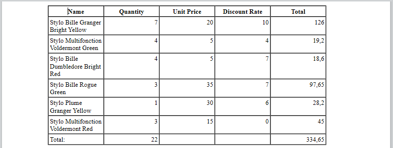

<!--REF #_command_.WP Table append row.Syntax-->**WP Table append row** ( *tableRef* ; *...value* )  : Object<br/>**WP Table append row** ( *tableRef* ; *valueColl* ) : Object<!-- END REF-->

<!--REF #_command_.WP Table append row.Params-->

| Parámetros | Tipo                                      |                             | Descripción                                       |
| ---------- | ----------------------------------------- | --------------------------- | ------------------------------------------------- |
| tableRef   | Object                                    | &#8594; | Referencia de tabla                               |
| value      | Text, Number, Time, Date, Picture, Object | &#8594; | Valor(es) a definir en la fila |
| valueColl  | Collection                                | &#8594; | Colección de valores a definir en la línea        |
| Resultado  | Object                                    | &#8592; | Objeto de rango de filas                          |

<!-- END REF-->

## Descripción

El comando **WP Table append row**<!--REF #_command_.WP Table append row.Summary--> añade una fila a la tabla *tableRef*, la llena con *value*(s) o una colección *valueColl*, y devuelve el objeto de rango de filas correspondiente.<!-- END REF-->

El comando soporta dos sintaxis:

- **Usando valores como parámetros:**
  Añade tantas celdas en la fila como valores proporcionados en el parámetro o parámetros *value*. Puede pasar cualquier número de valores de diferentes tipos.

- **Usando una colección de valores (*valueColl)*:**
  Llena la fila con valores de la colección *valueColl*. Cada elemento de la colección corresponde a una célula en la fila.

  En ambas sintaxis se admiten los siguientes tipos de valores: Texto, Número, Hora, Fecha, Imagen y Objeto (fórmulas o fórmulas con nombre que devuelven un elemento de fila).

La alineación predeterminada de las celdas dependerá del tipo de valor:

- texto: alineación izquierda
- imágenes: centrado
- otros tipos (números, fecha y hora): alineados a la derecha

:::note Notas

- No se admiten valores de tipo array.
- Asegúrese de que el número de valores o el tamaño de la colección coincide con el número de celdas de la tabla para evitar resultados inesperados.

:::

El comando devuelve la nueva fila como un objeto de rango de filas.

## Ejemplo 1

Desea crear una tabla vacía y añadir varias líneas de diferentes tamaños. Puede escribir:

```4d
 var $wpTable;$wpRange;$wpRow1;$wpRow2;$wpRow3 : Object
 $wpRange:=WP Text range(WParea;wk start text;wk end text)
 $wpTable:=WP Insert table($wpRange;wk append)
 $wpRow1:=WP Table append row($wpTable;"Paul";"Smith";25)
 $wpRow2:=WP Table append row($wpTable;"John";"Richmond";40)
 $wpRow3:=WP Table append row($wpTable;"Mary";"Trenton";18;"New!")
```


## Ejemplo 2

Desea crear una tabla vacía y añadir una línea utilizando una colección:

```4d
$table:=WP Insert table(WParea; wk replace; wk include in range)

$row:=WP Table append row($table; "Reference"; "Date"; "Time"; "rnd 1"; "rdn 2")
WP SET ATTRIBUTES($row; wk background color; "lightgrey")

$colItems:=[]
$colItems.push("KX-825")
$colItems.push(Formula(Current date))
$colItems.push(Formula(String(Current time; HH MM SS)))
$colItems.push(Formula(Random))
$colItems.push({name: "RND NUMBER"; formula: Formula(Random)})

$row:=WP Table append row($table; $colItems)
```


## Ejemplo 3

En una aplicación de facturación, desea crear una tabla automáticamente llena con líneas de facturas relacionadas:

```4d
 var $wpTable;$wpRange : Object
 
 $wpRange:=WP Text range(4DWPArea;wk start text;wk end text)
 
 $wpTable:=WP Insert table($wpRange;wk append) //crea la tabla
 
  // añade la línea de encabezado
 $row:=WP Table append row($wpTable;"Name";"Quantity";"Unit Price";"Discount Rate";"Total")
 WP SET ATTRIBUTES($row;wk font bold;wk true;wk text align;wk center)

  //simplemente aplicar a la selección
 APPLY TO SELECTION([INVOICE_LINES];WP Table append row($wpTable;[INVOICE_LINES]ProductName;[INVOICE_LINES]Quantity;[INVOICE_LINES]ProductUnitPrice;[INVOICE_LINES]DiscountRate;[INVOICE_LINES]Total))
 
  //añadir una fila a pie de página
 $row:=WP Table append row($wpTable; "Total:";Sum([INVOICE_LINES]Quantity);"";"";Sum([INVOICE_LINES]Total))
 
  //formatear la tabla
 $range:=WP Table get columns($wpTable;1;5)
 WP SET ATTRIBUTES($range;wk width; "80pt")
 WP SET ATTRIBUTES($wpTable;wk font size;10)
```



## Ver también

[WP Insert table](../commands-legacy/wp-insert-table.md)</br>
[WP Table get rows](../commands-legacy/wp-table-get-rows.md)