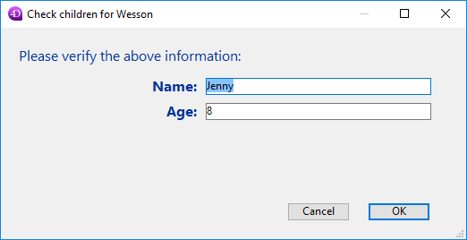

<!--REF #_command_.DIALOG.Syntax-->**DIALOG** ( {*aTable* ;} *form* {; *formData*}{; *} )<!-- END REF-->

<!--REF #_command_.DIALOG.Params-->

| Parámetros | Tipo         |                             | Descripción                                                                                                                                                                                                              |
| ---------- | ------------ | --------------------------- | ------------------------------------------------------------------------------------------------------------------------------------------------------------------------------------------------------------------------ |
| aTable     | Tabla        | &#8594; | Tabla propia del formulario o Si se omite: tabla por defecto o uso del formulario del proyecto                                                                                                           |
| form       | Text, Object | &#8594; | Nombre (string) de la tabla o formulario proyecto, o una ruta POSIX (string) a un archivo .json que describa el formulario, o un objeto que describa el formulario |
| formData   | Object       | &#8594; | Datos a asociar al formulario                                                                                                                                                                                            |
| \*         | Operador     | &#8594; | Usar el mismo proceso                                                                                                                                                                                                    |

<!-- END REF-->

## Descripción

<!--REF #_command_.DIALOG.Summary-->El comando **DIALOG** presenta el *formulario* al usuario, junto con (el) los parámetro(s) *formData* (opcional).<!-- END REF--> 

Este comando está diseñado para trabajar con interfaces de usuario personalizadas y avanzadas basadas en formularios. Puede utilizarlo para mostrar información procedente de la base de datos o de otras ubicaciones, o para proporcionar funciones de entrada de datos. A diferencia de [ADD RECORD](../commands-legacy/add-record.md) o [MODIFY RECORD](../commands-legacy/modify-record.md), **DIALOG** le ofrece un control total sobre el formulario, su contenido y los botones de navegación y validación.

Este comando suele invocarse junto con el comando [Open form window](../commands-legacy/open-form-window.md) para mostrar formularios sofisticados, como se muestra en el siguiente ejemplo:


El comando **DIALOG** también puede utilizarse en lugar de [ALERT](../commands-legacy/alert.md), [CONFIRM](../commands-legacy/confirm.md) o [Request](../commands-legacy/request.md) cuando la información a presentar o recopilar es más compleja de lo que esos comandos pueden gestionar.

En el parámetro *form*, puede pasar:

- el nombre de un formulario (formulario proyecto o formulario tabla) a utilizar;
- la ruta (en sintaxis POSIX) a un archivo .json válido que contenga una descripción del formulario a utilizar;
- un objeto que contiene la descripción del formulario a utilizar.

Opcionalmente, puede pasar uno o varios parámetros al *form* utilizando un objeto "form data". Todas las propiedades del objeto de datos del formulario estarán entonces disponibles desde el contexto del formulario a través del comando [Form](form.md). Por ejemplo, si utiliza un objeto de datos de formulario que contenga {"version"; "12"}, podrá obtener o definir el valor de la propiedad "version" en el formulario llamando a:

```4d
 $v:=Form.version //"12"
 Form.version:=13
```

Para llenar el objeto "form data", tiene dos posibilidades:

- usar el parámetro *formData*. Usar una variable local para *formData* le permite pasar con seguridad parámetros a sus formularios, sea cual sea el contexto de llamada. En particular, si el mismo formulario se llama desde diferentes lugares en el mismo proceso, siempre podrá acceder a sus valores específicos simplemente llamando a [Form](form.md).myProperty. Además, como los objetos se pasan por referencia, si el usuario modifica el valor de una propiedad en el formulario, se guardará automáticamente en el propio objeto.

- [asociar una clase usuario al formulario](../FormEditor/properties_FormProperties.md#form-class), en cuyo caso 4D instanciará automáticamente un objeto de esta clase cuando se cargará el formulario. Las propiedades y funciones del objeto estarán automáticamente disponibles a través del objeto devuelto por [Form](form.md). Puede escribir por ejemplo `Form.myFunction()`.

:::note

- El parámetro *formData* tiene prioridad sobre una clase de formulario (el objeto de clase no es instanciado si se pasa un parámetro *formData*).
- Si no pasa el parámetro *formData* (o si pasa un objeto no definido) y no hay ninguna clase de usuario asociada al formulario, **DIALOG** crea un nuevo objeto vacío vinculado al *form*.

:::

El diálogo es cerrado por el usuario ya sea con una acción "aceptar" (activada por la acción estándar ak accept, la tecla Intro, o el comando [ACCEPT](../commands-legacy/accept.md)), o con una acción de "cancelar" (activada por la acción estándar ak cancel, la tecla Escape, o el comando [CANCEL](../commands-legacy/cancel.md)). Una acción de aceptación pondrá la variable sistema OK en 1, mientras que una acción de cancelación pondrá OK en 0\.

Tenga en cuenta que la validación no es igual al guardado: si el diálogo incluye campos, debe llamar explícitamente al comando [SAVE RECORD](../commands-legacy/save-record.md) para guardar cualquier dato que haya sido modificado.

Si se pasa el parámetro opcional *\**, el formulario se carga y se muestra en la última ventana abierta del proceso actual y el comando finaliza su ejecución dejando el formulario activo en la pantalla.\
Este formulario reacciona entonces "normalmente" a las acciones del usuario y se cierra utilizando una acción estándar o cuando el código 4D relacionado con el formulario (método objeto o método formulario) llama al comando [CANCEL](../commands-legacy/cancel.md) o [ACCEPT](../commands-legacy/accept.md). Si el proceso actual termina, los formularios creados de este modo se cierran automáticamente del mismo modo que si se hubiera llamado a un comando [CANCEL](../commands-legacy/cancel.md). Este modo de apertura es especialmente útil para mostrar una paleta flotante con un documento, sin necesidad de otro proceso.

**Notas:**

- Puede combinar el uso de la sintaxis **DIALOG**(form;\*) con el comando [CALL FORM](../commands-legacy/call-form.md) para establecer la comunicación entre los formularios.
- Debe crear una ventana antes de llamar a la instrucción **DIALOG**(form;\*). No es posible utilizar la ventana de diálogo actual en el proceso ni la ventana creada por defecto para cada proceso. En caso contrario, se genera el error -9909.
- Cuando se utiliza el parámetro *\**, la ventana se cierra automáticamente tras una acción estándar o una llamada al comando [CANCEL](../commands-legacy/cancel.md) o [ACCEPT](../commands-legacy/accept.md). No tiene que gestionar el cierre de la propia ventana.

## Ejemplo 1

El siguiente ejemplo permite crear una paleta de herramientas:

```4d
  //Mostrar paleta de herramientas
 $palette_window:=Open form window("tools";Palette form window)
 DIALOG("tools";*) //Devolver el control inmediatamente
  //Mostrar ventana de documento principall
 $document_window:=Open form window("doc";Plain form window)
 DIALOG("doc")
```

## Ejemplo 2

En un formulario que muestra el registro de una persona, un botón "Check children" abre un cuadro de diálogo para verificar/modificar los nombres y edades de sus hijos:


**Nota:** el campo objeto "Children" se representa sólo para mostrar su estructura en este ejemplo.

En el formulario de verificación, ha asignado algunas propiedades del objeto [Form](form.md) a variables:


Este es el código del botón "Check children":

```4d
 var $win;$n;$i : Integer
 var $save : Boolean
 ARRAY OBJECT($children;0)
 OB GET ARRAY([Person]Children; "children";$children) //obtener la colección children
 $save:=False //inicializar la variable save
 
 $n:=Tamaño del array($children)
 If($n>0)
    $win:=Open form window("Edit_Children";Movable form dialog box)
    SET WINDOW TITLE("Check children for "+[Person]Name)
    For($i;1;$n) //para cada hijo
       DIALOG("Edit_Children";$children{$i}) //muestra el diálogo lleno de valores
       If(OK=1) //el usuario ha pulsado OK
          $save:=True
       End if
    End for
    If($save=True)
       [Person]Children:=[Person]Children //forza la actualización del campo objeto
    End if
    CLOSE WINDOW($win)
 Else
    ALERT("No child to check.")
 End if
```

El formulario muestra información sobre cada niño:



Si se editan los valores y se presiona el botón OK, se actualiza el campo (después hay que guardar el registro principal).

## Ejemplo 3

El siguiente ejemplo utiliza la ruta a un formulario .json para mostrar los registros de una lista de empleados:

```4d
 Open form window("/RESOURCES/OutputPersonnel.json";Plain form window)
 ALL RECORDS([Personnel])
 DIALOG("/RESOURCES/OutputPersonnel.json";*)
```

que muestra:


## Ejemplo 4

El siguiente ejemplo utiliza un archivo .json como objeto y modifica algunas propiedades:

```4d
 var $form : Object
 $form:=JSON Parse(Document to text(Get 4D folder(Current resources folder)+"OutputPersonnel.json"))
 $form.windowTitle:="The Avengers"
 $form.pages[1].objects.logo.picture:="/RESOURCES/Images/Avengers.png"
 $form.pages[1].objects.myListBox.borderStyle:="double"
 Open form window($form;Plain form window)
 DIALOG($form;*)
```

El formulario modificado se muestra con el título, el logotipo y el borde modificado:


## Variables y conjuntos sistema

Tras una llamada a **DIALOG**, si se acepta el diálogo, OK se pone en 1; si se cancela, OK se pone en 0.

## Ver también

[ACCEPT](../commands-legacy/accept.md)\
[ADD RECORD](../commands-legacy/add-record.md)\
[CALL FORM](../commands-legacy/call-form.md)\
[CANCEL](../commands-legacy/cancel.md)\
[Form](form.md)\
[Open window](../commands-legacy/open-window.md)

## Propiedades

|                        |                             |
| ---------------------- | --------------------------- |
| Número de comando      | 40                          |
| Hilo seguro            | &cross; |
| Modifica las variables | OK, error                   |

