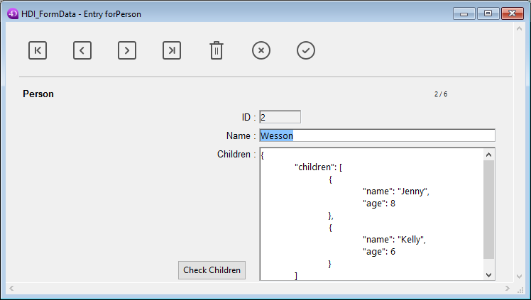

<!--REF #_command_.Form.Syntax-->**Form** : Object<!-- END REF-->

<!--REF #_command_.Form.Params-->

| Parámetros | Tipo   |                             | Descripción                 |
| ---------- | ------ | --------------------------- | --------------------------- |
| Resultado  | Object | &#8592; | Datos del formulario actual |

<!-- END REF-->

<details><summary>Historia</summary>

| Lanzamiento | Modificaciones                       |
| ----------- | ------------------------------------ |
| 20 R8       | Soporte de las clases de formularios |

</details>

## Descripción

<!--REF #_command_.Form.Summary-->El comando **Form** devuelve el objeto asociado al formulario actual (instanciado a partir del parámetro *formData* o de la clase de usuario asignada en el editor de formularios).<!-- END REF--> 4D automatically associates an object to the current form in the following cases:

 - the current form has been loaded by one of the [`DIALOG`](dialog.md), [`Print form`](print-form.md), or [`FORM LOAD`](form-load.md) commands,
 - el formulario actual es un subformulario,
 - un formulario de tabla se muestra actualmente en la pantalla.

### Commands (DIALOG...)

If the current form is being displayed or loaded by a call to the [DIALOG](dialog.md), [`Print form`](print-form.md), or [`FORM LOAD`](form-load.md) commands, **Form** returns either:

 - el objeto *formData* pasado como parámetro a este comando, si existe,
 - o, un objeto instanciado de la [clase de usuario asociada al formulario](../FormEditor/properties_FormProperties.md#form-class), si existe,
 - o, un objeto vacío.

### Subformulario

If the current form is a subform, the returned object depends on the parent container variable:

 - **Form** returns the object associated with the table form displayed on screen.\
    **Form** returns the object associated with the table form displayed on screen.\
    In the context of an input form displayed from an output form (i.e. after a double-click on a record), the returned object contains the following property:

```4d
 (OBJECT Get pointer(Object subform container))->  
```

 - If the variable associated to the parent container has not been typed as an object, **Form** returns an empty object, maintained by 4D in the subform context.

Para más información, consulte la sección *Subformularios de página*.

### Formulario tabla

**Form** returns the object associated with the table form displayed on screen.\
**Form** returns the object associated with the table form displayed on screen.\
In the context of an input form displayed from an output form (i.e. after a double-click on a record), the returned object contains the following property: **Form** returns the object associated with the table form displayed on screen.\
In the context of an input form displayed from an output form (i.e. after a double-click on a record), the returned object contains the following property:

| **Propiedad** | **Tipo** | **Description**                                |
| ------------- | -------- | ---------------------------------------------- |
| parentForm    | object   | Objeto **Form** del formulario de salida padre |

## Ejemplo

En un formulario que muestra el registro de una persona, un botón "Check children" abre un cuadro de diálogo para verificar/modificar los nombres y edades de sus hijos:



**Nota:** el campo objeto "Children" se representa sólo para mostrar su estructura en este ejemplo.

In the verification form, you have assigned some Form object properties to inputs:


Este es el código del botón "Check children":

```4d
 var $win;$n;$i : Integer
 var $save : Boolean
 ARRAY OBJECT($children;0)
 OB GET ARRAY([Person]Children; "children";$children) //obtener la colección children
 $save:=False //inicializar la variable save
 
 $n:=Tamaño del array($children)
 If($n>0)
    $win:=Open form window("Edit_Children";Movable form dialog box)
    SET WINDOW TITLE("Check children for "+[Person]Name)
    For($i;1;$n) //para cada hijo
       DIALOG("Edit_Children";$children{$i}) //muestra el diálogo lleno de valores
       If(OK=1) //el usuario ha pulsado OK
          $save:=True
       End if
    End for
    If($save=True)
       [Person]Children:=[Person]Children //forza la actualización del campo objeto
    End if
    CLOSE WINDOW($win)
 Else
    ALERT("No child to check.")
 End if
```

El formulario muestra información sobre cada niño:


Si se editan los valores y se presiona el botón OK, se actualiza el campo (después hay que guardar el registro principal).

## Ver también

[DIALOG](dialog.md)

## Propiedades

|                   |                             |
| ----------------- | --------------------------- |
| Número de comando | 1466                        |
| Hilo seguro       | &cross; |


