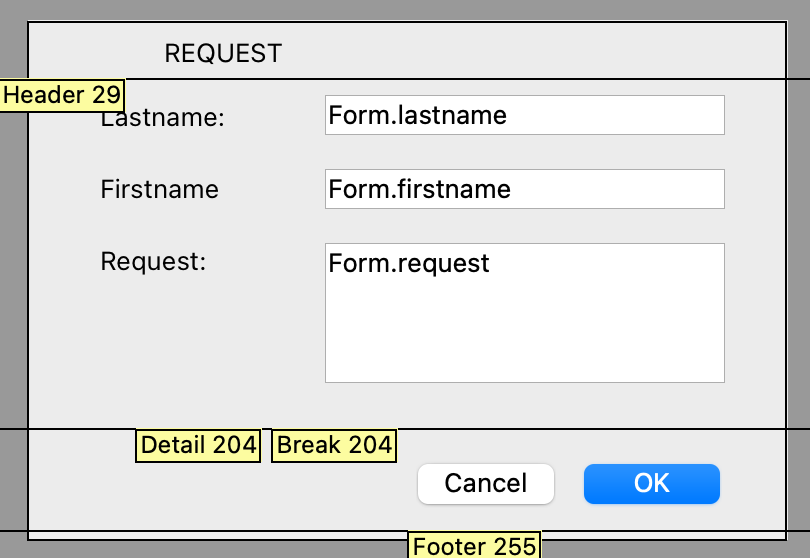

<!--REF #_command_.Print form.Syntax-->**Print form** ( {*aTable* ;} *form* {; *formData*} {; *areaStart*{; *areaEnd*}} ) : Integer<!-- END REF-->

<!--REF #_command_.Print form.Params-->

| Parámetros | Tipo         |                             | Descripción                                                                                                                                                                                                  |
| ---------- | ------------ | --------------------------- | ------------------------------------------------------------------------------------------------------------------------------------------------------------------------------------------------------------ |
| aTable     | Tabla        | &#8594; | Tabla del formulario, o tabla por defecto, si se omite                                                                                                                                                       |
| form       | Text, Object | &#8594; | Nombre (cadena) del formulario, o ruta POSIX (cadena) a un archivo .json que describa el formulario, o un objeto que describa el formulario a imprimir |
| formData   | Object       | &#8594; | Datos a asociar al formulario                                                                                                                                                                                |
| areaStart  | Integer      | &#8594; | Marcador de impresión, o área de inicio (si se especifica areaEnd)                                                                                                                        |
| areaEnd    | Integer      | &#8594; | Área final (si se especifica areaStart)                                                                                                                                                   |
| Resultado  | Integer      | &#8592; | Altura de la sección impresa                                                                                                                                                                                 |

<!-- END REF-->

## Descripción

<!--REF #_command_.Print form.Summary-->El comando **Print form** simplemente imprime *form* con los valores actuales de los campos y variables de la tabla *aTable*.<!-- END REF--> Suele utilizarse para imprimir informes muy complejos que requieren un control total del proceso de impresión. **Print form** no realiza ningún procesamiento de registros, ni las rupturas, ni de saltos de página. Estas operaciones son responsabilidad suya. **Print form*** imprime campos y variables solo en un marco de tamaño fijo.

En el parámetro *form*, puede pasar:

- el nombre de un formulario, o
- la ruta (en sintaxis POSIX) de un archivo .json válido que contenga una descripción del formulario a utilizar (ver *Ruta de acceso al archivo de formulario*), o
- un objeto que contiene la descripción del formulario.

Como **Print form** no genera un salto de página después de imprimir el formulario, es fácil combinar diferentes formularios en la misma página. Así, **Print form** es perfecto para tareas de impresión complejas que implican diferentes tablas y diferentes formularios. Para forzar un salto de página entre formularios, utilice el comando [PAGE BREAK](../commands-legacy/page-break.md). Para transferir la impresión a la página siguiente de un formulario cuya altura es superior al espacio disponible, invoque el comando [CANCEL](../commands-legacy/cancel.md) antes del comando [PAGE BREAK](../commands-legacy/page-break.md).

Se pueden utilizar tres sintaxis diferentes:

- **Impresión de área de detalle**

Sintaxis:

```4d
 height:=Print form(myTable;myForm)
```

En este caso, **Print form** sólo imprime el área de detalle del formulario (el área entre la línea de encabezado y la línea de detalle).

- **Impresión de área de formulario**

Sintaxis:

```4d
 height:=Print form(myTable;myForm;marker)
```

En este caso, el comando imprimirá la sección designada por el *marker*. Pase una de las constantes del tema *Form Area* en el parámetro marcador:

| Constante     | Tipo    | Valor |
| ------------- | ------- | ----- |
| Form break0   | Integer | 300   |
| Form break1   | Integer | 301   |
| Form break2   | Integer | 302   |
| Form break3   | Integer | 303   |
| Form break4   | Integer | 304   |
| Form break5   | Integer | 305   |
| Form break6   | Integer | 306   |
| Form break7   | Integer | 307   |
| Form break8   | Integer | 308   |
| Form break9   | Integer | 309   |
| Form detail   | Integer | 0     |
| Form footer   | Integer | 100   |
| Form header   | Integer | 200   |
| Form header1  | Integer | 201   |
| Form header10 | Integer | 210   |
| Form header2  | Integer | 202   |
| Form header3  | Integer | 203   |
| Form header4  | Integer | 204   |
| Form header5  | Integer | 205   |
| Form header6  | Integer | 206   |
| Form header7  | Integer | 207   |
| Form header8  | Integer | 208   |
| Form header9  | Integer | 209   |

- **Impresión de sección**

Sintaxis:

```4d
 height:=Print form(myTable;myForm;areaStart;areaEnd)
```

En este caso, el comando imprimirá la sección incluida entre los parámetros *areaStart* y *areaEnd*. Los valores introducidos deben expresarse en píxeles.

**formData**

Opcionalmente, puede pasar parámetros al *form* usando el objeto *formData* o el objeto de clase form automáticamente instanciado por 4D si has [asociado una clase de usuario al formulario](../FormEditor/properties_FormProperties.md#form-class). Todas las propiedades del objeto de datos del formulario estarán entonces disponibles desde el contexto del formulario a través del comando [Form](form.md). Optionally, you can pass parameters to the *form* using either the *formData* object or the form class object automatically instantiated by 4D if you have [associated a user class to the form](../FormEditor/properties_FormProperties.md#form-class).

Para obtener información detallada sobre el objeto de datos del formulario, consulte el comando [`DIALOG`](dialog.md).

**Valor devuelto**

El valor devuelto por **Print form** indica la altura del área de impresión. Este valor será tomado en cuenta automáticamente por el comando [Get printed height](../commands-legacy/get-printed-height.md).

Las cajas de diálogo de la impresora no aparecen cuando se utiliza **Print form**. El informe no utiliza la configuración de impresión definida en el modo Diseño para el formulario. Hay dos formas de especificar los parámetros de impresión antes de realizar una serie de llamadas a **Print form**:

- Llamar a [PRINT SETTINGS](../commands-legacy/print-settings.md). En este caso, deja que el usuario elija la configuración.
- Llame a [SET PRINT OPTION](../commands-legacy/set-print-option.md) y [GET PRINT OPTION](../commands-legacy/get-print-option.md). En este caso, los parámetros de impresión se especifican por programación.

**Print form** crea cada página impresa en la memoria. Cada página se imprime cuando la página en memoria está llena o cuando se llama a [PAGE BREAK](../commands-legacy/page-break.md). Para asegurar la impresión de la última página después de cualquier uso de **Print form**, debe concluir con el comando [PAGE BREAK](../commands-legacy/page-break.md) (excepto en el contexto de un [OPEN PRINTING JOB](../commands-legacy/open-printing-job.md), ver nota). En caso contrario, si la última página no está llena, permanece en memoria y no se imprime.

**Atención:** si se llama al comando en el contexto de un trabajo de impresión abierto con [OPEN PRINTING JOB](../commands-legacy/open-printing-job.md), NO se debe llamar a [PAGE BREAK](../commands-legacy/page-break.md) para la última página porque se imprime automáticamente con el comando [CLOSE PRINTING JOB](../commands-legacy/close-printing-job.md). Si llama a [PAGE BREAK](../commands-legacy/page-break.md) en este caso, se imprime una página en blanco.

Este comando imprime áreas y objetos externos (por ejemplo, áreas 4D Write o 4D View). El área se reinicializa cada vez que se ejecuta el comando.

**Atención:** los subformularios no se imprimen con **Print form**. Para imprimir sólo un formulario con dichos objetos, utilice [PRINT RECORD](../commands-legacy/print-record.md) en su lugar.

**Print form** genera sólo un [evento `On Printing Detail`](../Events/onPrintingDetail.md) para el método formulario.

**4D Server:** este comando puede ejecutarse en 4D Server en el marco de un procedimiento almacenado. En este contexto:

- Asegúrese de que no aparezca ningún cuadro de diálogo en el equipo servidor (salvo que se trate de un requisito específico).
- En el caso de un problema relacionado con la impresora (falta de papel, impresora desconectada, etc.), no se genera ningún mensaje de error.

## Ejemplo 1

El siguiente ejemplo funciona como lo haría un comando [PRINT SELECTION](../commands-legacy/print-selection.md). Sin embargo, el informe utiliza una de dos formas diferentes, dependiendo de si el registro corresponde a un cheque o a un ingreso:

```4d
 QUERY([Register]) // Seleccionar los registros
 If(OK=1)
    ORDER BY([Register]) // Ordenar los registros
    If(OK=1)
       PRINT SETTINGS // Mostrar cuadros de diálogo de impresión
       If(OK=1)
          For($vlRecord;1;Records in selection([Register]))
             If([Register]Type ="Check")
                Print form([Register];"Check Out") // Utilice un formulario para cheques
             Else
                Print form([Register];"Deposit Out") // Utilice otro formulario para depósitos
             End if
             NEXT RECORD([Register])
          End for
          PAGE BREAK // Asegúrese de que se imprime la última página
       End if
    End if
 End if
```

## Ejemplo 2

Consulte el ejemplo del comando [SET PRINT MARKER](../commands-legacy/set-print-marker.md).

## Ejemplo 3

Este formulario se utiliza como diálogo y luego se imprime con modificaciones:



El método del formulario:

```4d
 If(Form event code=On Printing Detail)
    Form.lastname:=Uppercase(Form.lastname)
    Form.firstname:=Uppercase(Substring(Form.firstname;1;1))+Lowercase(Substring(Form.firstname;2))
    Form.request:=Lowercase(Form.request)
 End if
```

El código que llama al diálogo imprime su cuerpo:

```4d
 $formData:=New object
 $formData.lastname:="Smith"
 $formData.firstname:="john"
 $formData.request:="I need more COFFEE"
 $win:=Open form window("Request_obj";Plain form window;Horizontally centered;Vertically centered)
 DIALOG("Request_obj";$formData)
 $h:=Print form("Request_var";$formData;Form detail)
```

## Ver también

[CANCEL](../commands-legacy/cancel.md)\
[PAGE BREAK](../commands-legacy/page-break.md)\
[PRINT SETTINGS](../commands-legacy/print-settings.md)\
[SET PRINT OPTION](../commands-legacy/set-print-option.md)

## Propiedades

|                   |                             |
| ----------------- | --------------------------- |
| Número de comando | 5                           |
| Hilo seguro       | no |


