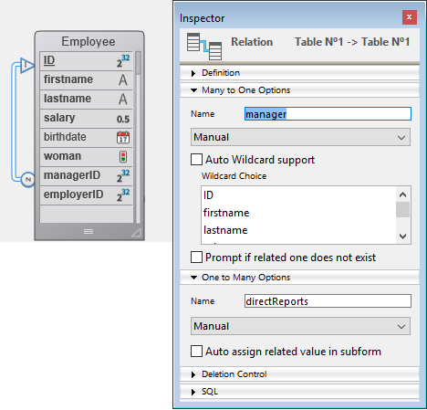

Los atributos Dataclass están disponibles como propiedades de sus respectivas clases. Por ejemplo:

```4d
 nameAttribute:=ds.Company.name //referencia a un atributo de clase
 revenuesAttribute:=ds.Company["revenues"] //método alternativo
```

Este código asigna a *nameAttribute* y *revenuesAttribute* referencias a los atributos name y revenues de la clase Company. Esta sintaxis NO devuelve los valores mantenidos dentro del atributo, sino que devuelve referencias a los propios atributos. Para manejar los valores, es necesario pasar por [**Entidades**](EntityClass.md).

Los objetos `DataClassAttribute` tienen propiedades que puede leer para obtener información sobre los atributos de su clase de datos.

> Los objetos del atributo Dataclass pueden ser modificados, pero la estructura subyacente de la base de datos no será alterada.

### Resumen

|                                                                                                                                                                                                    |
| -------------------------------------------------------------------------------------------------------------------------------------------------------------------------------------------------- |
| [<!-- INCLUDE DataClassAttributeClass.autoFilled.Syntax -->](#autofilled)&nbsp;&nbsp;&nbsp;&nbsp;<!-- INCLUDE DataClassAttributeClass.autoFilled.Summary -->|
| [<!-- INCLUDE DataClassAttributeClass.exposed.Syntax -->](#exposed)&nbsp;&nbsp;&nbsp;&nbsp;<!-- INCLUDE DataClassAttributeClass.exposed.Summary --> |
| [<!-- INCLUDE DataClassAttributeClass.fieldNumber.Syntax -->](#fieldnumber)&nbsp;&nbsp;&nbsp;&nbsp;<!-- INCLUDE DataClassAttributeClass.fieldNumber.Summary --> |
| [<!-- INCLUDE DataClassAttributeClass.fieldType.Syntax -->](#fieldtype)&nbsp;&nbsp;&nbsp;&nbsp;<!-- INCLUDE DataClassAttributeClass.fieldType.Summary --> |
| [<!-- INCLUDE DataClassAttributeClass.indexed.Syntax -->](#indexed)&nbsp;&nbsp;&nbsp;&nbsp;<!-- INCLUDE DataClassAttributeClass.indexed.Summary --> |
| [<!-- INCLUDE DataClassAttributeClass.inverseName.Syntax -->](#inversename)&nbsp;&nbsp;&nbsp;&nbsp;<!-- INCLUDE DataClassAttributeClass.inverseName.Summary --> |
| [<!-- INCLUDE DataClassAttributeClass.keywordIndexed.Syntax -->](#keywordindexed)&nbsp;&nbsp;&nbsp;&nbsp;<!-- INCLUDE DataClassAttributeClass.keywordIndexed.Summary --> |
| [<!-- INCLUDE DataClassAttributeClass.kind.Syntax -->](#kind)&nbsp;&nbsp;&nbsp;&nbsp;<!-- INCLUDE DataClassAttributeClass.kind.Summary --> |
| [<!-- INCLUDE DataClassAttributeClass.mandatory.Syntax -->](#mandatory)&nbsp;&nbsp;&nbsp;&nbsp;<!-- INCLUDE DataClassAttributeClass.mandatory.Summary --> |
| [<!-- INCLUDE DataClassAttributeClass.name.Syntax -->](#name)&nbsp;&nbsp;&nbsp;&nbsp;<!-- INCLUDE DataClassAttributeClass.name.Summary --> |
| [<!-- INCLUDE DataClassAttributeClass.path.Syntax -->](#path)&nbsp;&nbsp;&nbsp;&nbsp;<!-- INCLUDE DataClassAttributeClass.path.Summary --> |
| [<!-- INCLUDE DataClassAttributeClass.readOnly.Syntax -->](#readonly)&nbsp;&nbsp;&nbsp;&nbsp;<!-- INCLUDE DataClassAttributeClass.readOnly.Summary --> |
| [<!-- INCLUDE DataClassAttributeClass.relatedDataClass.Syntax -->](#relateddataclass)&nbsp;&nbsp;&nbsp;&nbsp;<!-- INCLUDE DataClassAttributeClass.relatedDataClass.Summary --> |
| [<!-- INCLUDE DataClassAttributeClass.type.Syntax -->](#type)&nbsp;&nbsp;&nbsp;&nbsp;<!-- INCLUDE DataClassAttributeClass.type.Summary --> |
| [<!-- INCLUDE DataClassAttributeClass.unique.Syntax -->](#unique)&nbsp;&nbsp;&nbsp;&nbsp;<!-- INCLUDE DataClassAttributeClass.unique.Summary --> |

<!-- REF DataClassAttributeClass.autoFilled.Desc -->
## .autoFilled

<details><summary>Histórico</summary>

| Versión | Modificaciones |
| ------- | -------------- |
| v17 R5  | Añadidos       |

</details>

<!-- REF DataClassAttributeClass.autoFilled.Syntax -->**.autoFilled** : Boolean<!-- END REF -->

#### Descripción

La propiedad `.autoFilled` <!-- REF DataClassAttributeClass.autoFilled.Summary -->contiene True si el valor del atributo es rellenado automáticamente por 4D<!-- END REF -->. Esta propiedad corresponde a las siguientes propiedades de campo 4D:

* "Autoincremento", para campos de tipo numérico
* "Auto UUID", para los campos UUID (tipo alfa).

Esta propiedad no se devuelve si `.kind` = "relatedEntity" o "relatedEntities".
> Para la programación genérica, se puede utilizar **Bool**(dataClassAttribute.autoFilled) para obtener un valor válido (false) aunque no se devuelva `.autoFilled`.

<!-- END REF -->

<!-- REF DataClassAttributeClass.exposed.Desc -->
## .exposed

<details><summary>Histórico</summary>

| Versión | Modificaciones |
| ------- | -------------- |
| v19 R3  | Añadidos       |

</details>

<!-- REF DataClassAttributeClass.exposed.Syntax -->**.exposed** : Boolean<!-- END REF -->

#### Descripción

La propiedad `.exposed` es <!-- REF DataClassAttributeClass.exposed.Summary -->true si el atributo está expuesto en REST<!-- END REF -->.

#### Ver también

[DataClass.getInfo()](DataClassClass.md#getinfo)

<!-- END REF -->

<!-- REF DataClassAttributeClass.fieldNumber.Desc -->
## .fieldNumber

<details><summary>Histórico</summary>

| Versión | Modificaciones |
| ------- | -------------- |
| v17 R5  | Añadidos       |

</details>

<!-- REF DataClassAttributeClass.fieldNumber.Syntax -->**.fieldNumber** : Integer<!-- END REF -->

#### Descripción

La propiedad `.fieldNumber` <!-- REF DataClassAttributeClass.fieldNumber.Summary -->contiene el número de campo 4D interno del atributo<!-- END REF -->.

Esta propiedad no se devuelve si `.kind` = "relatedEntity" o "relatedEntities".
> Para la programación genérica, puede utilizar **Num**(dataClassAttribute.fieldNumber) para obtener un valor válido (0) aunque no se devuelva `.fieldNumber`.

<!-- END REF -->

<!-- REF DataClassAttributeClass.fieldType.Desc -->
## .fieldType

<details><summary>Histórico</summary>

| Versión | Modificaciones               |
| ------- | ---------------------------- |
| v19 R4  | Soporta atributos alias      |
| v19 R3  | Soporta atributos calculados |

</details>

<!-- REF DataClassAttributeClass.fieldType.Syntax -->**.fieldType** : Integer<!-- END REF -->

#### Descripción

La propiedad `.fieldType` <!-- REF DataClassAttributeClass.fieldType.Summary -->contiene el tipo de base de datos 4D del atributo<!-- END REF -->. .

**Valores posibles:**

| dataClassAttribute.kind | fieldType                                                                                                    |
| ----------------------- | ------------------------------------------------------------------------------------------------------------ |
| storage                 | Tipo de campo 4D correspondiente, ver [`Value type`](https://doc.4d.com/4dv19/help/command/en/page1509.html) |
| relatedEntity           | 38 (`Is object`)                                                                                             |
| relatedEntities         | 42 (`Is collection`)                                                                                         |
| calculated              | <li>escalar: tipo de campo 4D correspondiente, ver [`Value type`](https://doc.4d.com/4dv19/help/command/en/page1509.html)</li><li>entity: 38 (`Is object`)</li><li>entity selection: 42 (`Is collection`)</li>                                  |
| alias                   | <li>escalar: tipo de campo 4D correspondiente, ver [`Value type`](https://doc.4d.com/4dv19/help/command/en/page1509.html)</li><li>entity: 38 (`Is object`)</li><li>entity selection: 42 (`Is collection)`</li>                                  |

<!-- END REF -->

#### Ver también

[.type](#type)

<!-- REF DataClassAttributeClass.indexed.Desc -->
## .indexed

<details><summary>Histórico</summary>

| Versión | Modificaciones |
| ------- | -------------- |
| v17 R5  | Añadidos       |

</details>

<!-- REF DataClassAttributeClass.indexed.Syntax -->**.indexed**: Booleano<!-- END REF -->

#### Descripción

La propiedad `.indexed` <!-- REF DataClassAttributeClass.indexed.Summary -->contiene **True** si hay un índice B-tree o un Cluster B-tree en el atributo<!-- END REF -->.

Esta propiedad no se devuelve si `.kind` = "relatedEntity" o "relatedEntities".
> Para la programación genérica, se puede utilizar **Bool**(dataClassAttribute.indexed) para obtener un valor válido (false) aunque no se devuelva `.indexed`.

<!-- END REF -->

<!-- REF DataClassAttributeClass.inverseName.Desc -->
## .inverseName

<details><summary>Histórico</summary>

| Versión | Modificaciones |
| ------- | -------------- |
| v17 R5  | Añadidos       |

</details>

<!-- REF DataClassAttributeClass.inverseName.Syntax -->**.inverseName**: Texto<!-- END REF -->

#### Descripción

La propiedad `.inverseName` <!-- REF DataClassAttributeClass.inverseName.Summary -->devuelve el nombre del atributo que está al otro lado de la relación<!-- END REF -->.

Esta propiedad no se devuelve si `.kind` = "storage". Debe ser del tipo "relatedEntity" o "relatedEntities".
> Para la programación genérica, puede utilizar **String**(dataClassAttribute.inverseName) para obtener un valor válido ("") aunque no se devuelva `.inverseName`.  

<!-- END REF -->

<!-- REF DataClassAttributeClass.keywordIndexed.Desc -->
## .keywordIndexed

<details><summary>Histórico</summary>

| Versión | Modificaciones |
| ------- | -------------- |
| v17 R5  | Añadidos       |

</details>

<!-- REF DataClassAttributeClass.keywordIndexed.Syntax -->**.keywordIndexed**: Boolean<!-- END REF -->

#### Descripción

La propiedad `.keywordIndexed` <!-- REF DataClassAttributeClass.keywordIndexed.Summary -->contiene **True** si hay un índice de palabras clave en el atributo<!-- END REF -->.

Esta propiedad no se devuelve si [`.kind`](#kind) = "relatedEntity" o "relatedEntities".
> Para la programación genérica, se puede utilizar **Bool**(dataClassAttribute.keywordIndexed) para obtener un valor válido (false) aunque no se devuelva `.keywordIndexed`.

<!-- END REF -->

<!-- REF DataClassAttributeClass.kind.Desc -->
## .kind

<details><summary>Histórico</summary>

| Versión | Modificaciones          |
| ------- | ----------------------- |
| v19 R4  | Adición de "alias"      |
| v19 R3  | Adición de "calculated" |

</details>

<!-- REF DataClassAttributeClass.kind.Syntax -->**.kind** : Text<!-- END REF -->

#### Descripción

La propiedad `.kind` <!-- REF DataClassAttributeClass.kind.Summary -->devuelve la categoría del atributo<!-- END REF -->. El valor devuelto puede ser uno de los siguientes:

* "storage": atributo de almacenamiento (o escalar), es decir, atributo que almacena un valor, no una referencia a otro atributo
* "calculated": atributo calculado, es decir definido por [la función `get`](ORDA/ordaClasses.md#function-get-attributename)
* "alias": atributo basado en [otro atributo](ORDA/ordaClasses.md#alias-attributes-1)
* "relatedEntity": N -> 1 atributo de relación (referencia a una entidad)
* "relatedEntities": 1 -> N atributo de relación (referencia a una selección de entidades)

#### Ejemplo

Dada la siguiente tabla y relación:



```4d
 var $attKind : Text
 $attKind:=ds.Employee.lastname.kind //$attKind="storage"
 $attKind:=ds.Employee.manager.kind //$attKind="relatedEntity"
 $attKind:=ds.Employee.directReports.kind //$attKind="relatedEntities"
```

<!-- END REF -->

<!-- REF DataClassAttributeClass.mandatory.Desc -->
## .mandatory

<details><summary>Histórico</summary>

| Versión | Modificaciones |
| ------- | -------------- |
| v17 R5  | Añadidos       |

</details>

<!-- REF DataClassAttributeClass.mandatory.Syntax -->**.mandatory**: Booleano<!-- END REF -->

#### Descripción

La propiedad `.mandatory` <!-- REF DataClassAttributeClass.mandatory.Summary -->contiene True si se rechaza la entrada de valores nulos para el atributo<!-- END REF -->.

Esta propiedad no se devuelve si [`.kind`](#kind) = "relatedEntity" o "relatedEntities".
> Para la programación genérica, se puede utilizar **Bool**(dataClassAttribute.mandatory) para obtener un valor válido (false) aunque no se devuelva `.mandatory`.
> **Atención**: esta propiedad corresponde a la propiedad del campo "Reject NULL value input" a nivel de la base de datos 4D. No tiene relación con la propiedad "Obligatorio" existente, que es una opción de control de entrada de datos para una tabla.

<!-- END REF -->

<!-- REF DataClassAttributeClass.name.Desc -->
## .name

<details><summary>Histórico</summary>

| Versión | Modificaciones |
| ------- | -------------- |
| v17 R5  | Añadidos       |

</details>

<!-- REF DataClassAttributeClass.name.Syntax -->**.name** : Text<!-- END REF -->

#### Descripción

La propiedad `.name` <!-- REF DataClassAttributeClass.name.Summary -->The `.name` property<!-- END REF -->.

#### Ejemplo

```4d
 var $attName : Text
 $attName:=ds.Employee.lastname.name //$attName="lastname"
```

<!-- END REF -->

<!-- REF DataClassAttributeClass.path.Desc -->
## .path

<details><summary>Histórico</summary>

| Versión | Modificaciones |
| ------- | -------------- |
| v19 R4  | Añadidos       |

</details>

<!-- REF DataClassAttributeClass.path.Syntax -->**.path** : Text<!-- END REF -->

#### Descripción

La propiedad `.path` <!-- REF DataClassAttributeClass.path.Summary -->devuelve la ruta de un atributo alias basado en una relación<!-- END REF -->.

#### Ejemplo

```4d
 var $path : Text
 $path:=ds.Teacher.students.path //$path="courses.student"
```

<!-- END REF -->

<!-- REF DataClassAttributeClass.readOnly.Desc -->
## .readOnly

<details><summary>Histórico</summary>

| Versión | Modificaciones |
| ------- | -------------- |
| v19 R3  | Añadidos       |

</details>

<!-- REF DataClassAttributeClass.readOnly.Syntax -->**.readOnly** : Boolean<!-- END REF -->

#### Descripción

La propiedad `.readOnly` es <!-- REF DataClassAttributeClass.readOnly.Summary -->true si el atributo es de sólo lectura<!-- END REF -->.

Por ejemplo, los atributos calculados sin función [`set`](ORDA/ordaClasses.md#function-set-attributename) son solo lectura.

<!-- END REF -->

<!-- REF DataClassAttributeClass.relatedDataClass.Desc -->
## .relatedDataClass

<details><summary>Histórico</summary>

| Versión | Modificaciones |
| ------- | -------------- |
| v17 R5  | Añadidos       |

</details>

<!-- REF DataClassAttributeClass.relatedDataClass.Syntax -->**.relatedDataClass**: Text<!-- END REF -->

#### Descripción
> Esta propiedad sólo está disponible con atributos de la propiedad "relatedEntity" o "relatedEntities" [`.kind`](#kind).

La propiedad `.relatedDataClass` <!-- REF DataClassAttributeClass.relatedDataClass.Summary -->devuelve el nombre de la clase de datos relacionada con el atributo<!-- END REF -->.

#### Ejemplo

Dadas las siguientes tablas y relaciones:


```4d
 var $relClass1; $relClassN : Text
 $relClass1:=ds.Employee.employer.relatedDataClass //$relClass1="Company"
 $relClassN:=ds.Employee.directReports.relatedDataClass //$relClassN="Employee"
```

<!-- END REF -->

<!-- REF DataClassAttributeClass.type.Desc -->
## .type

<details><summary>Histórico</summary>

| Versión | Modificaciones               |
| ------- | ---------------------------- |
| v19 R3  | Soporta atributos calculados |

</details>

<!-- REF DataClassAttributeClass.type.Syntax -->**.type** : Text<!-- END REF -->

#### Descripción

La propiedad `.type` <!-- REF DataClassAttributeClass.type.Summary -->contiene el tipo de valor conceptual del atributo<!-- END REF -->útil para programación genérica.

El tipo de valor conceptual depende del atributo [`.kind`](#kind).

**Valores posibles:**

| dataClassAttribute.kind | type                                                                           | Comentario                                                                                                                                                                                                                                                                 |
| ----------------------- | ------------------------------------------------------------------------------ | -------------------------------------------------------------------------------------------------------------------------------------------------------------------------------------------------------------------------------------------------------------------------- |
| storage                 | "blob", "bool", "date", "image", "number", "object", o "string"                | "number" se devuelve para cualquier tipo numérico, incluyendo la duración. "string" se devuelve para los tipos de campo uuid, alfa y texto. Los atributos "blob" son [objetos blob](Concepts/dt_blob.md#blob-type), se gestionan utilizando [la clase Blob](BlobClass.md). |
| relatedEntity           | related dataClass name                                                         | Ej.: "Companies"                                                                                                                                                                                                                                                           |
| relatedEntities         | related dataClass name + "Selection" suffix                                    | Ej.: "EmployeeSelection"                                                                                                                                                                                                                                                   |
| calculated              | <li>storage: type ("blob", "number", etc.)</li><li>entity: dataClass name</li><li>entity selection: dataClass name + "Selection"</li> |                                                                                                                                                                                                                                                                            |

<!-- END REF -->

#### Ver también

[`.fieldType`](#fieldtype)

<!-- REF DataClassAttributeClass.unique.Desc -->
## .unique

<details><summary>Histórico</summary>

| Versión | Modificaciones |
| ------- | -------------- |
| v17 R5  | Añadidos       |

</details>

<!-- REF DataClassAttributeClass.unique.Syntax -->**.unique** : Boolean<!-- END REF -->

#### Descripción

La propiedad `.unique` <!-- REF DataClassAttributeClass.unique.Summary -->contiene True si el valor del atributo debe ser único<!-- END REF -->. Esta propiedad corresponde a la propiedad de campo 4D "Unique".

Esta propiedad no se devuelve si [`.kind`](#kind) = "relatedEntity" o "relatedEntities".
> Para la programación genérica, se puede utilizar**Bool**(dataClassAttribute.unique) para obtener un valor válido (false) aunque no se devuelva `.unique`.

<!-- END REF -->
