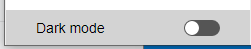

The Data Explorer provides a web interface to view, query, and edit data in your project datastore. Utilizando esta herramienta, puede navegar fácilmente entre todas sus entidades y buscar, ordenar o filtrar los valores de los atributos. It helps you quickly identifying issues at any step of the development process, as well as controlling and editing data.


## Configuración

El Explorador de datos se basa en el componente servidor web [`WebAdmin`](webAdmin.md) para la configuración y los parámetros de autenticación.

- **configuración**: la configuración del Explorador de datos reutiliza los [parámetros del servidor web `WebAdmin`](webAdmin.md#webadmin-settings),
- **autenticación**: el acceso al Explorador de datos se concede cuando [el usuario de la sesión está autenticado](webAdmin.md#authentication-and-session) y tiene el privilegio "WebAdmin". Cuando se accede al Explorador de datos a través del elemento de menú **Explorador de datos** (ver más adelante), se proporciona una autenticación automática.

> El acceso al Explorador de Datos puede desactivarse mediante la función [`.setAdminProtection()`](API/DataStoreClass.md#setadminprotection).

## Apertura del Explorador de datos

[El servidor web `WebAdmin`](webAdmin.md#starting-the-webadmin-web-server) se inicia automáticamente si es necesario al hacer clic en el Explorador de datos.

Para conectarse a la página web del Explorador de datos:

- De una aplicación 4D (con interfaz):
  - Para abrir una nueva ventana 4D con la página Explorador de datos mostrada en un área web, seleccione **Explorador de datos** en el menú **Registros** o haga clic en el botón **Datos** de la barra de herramientas principal.
  - Para abrir el Explorador de datos en una pestaña externa del navegador, seleccione **Explorador de datos en el navegador** en el menú **Registros** o presione la tecla **Alt** (Windows)/**Opción** (macOS) y haga clic en el botón **Datos** de la barra de herramientas principal.
- Desde 4D Server, seleccione **Explorador de datos en el navegador** en el menú **Ventana** (el Explorador de Datos sólo puede abrirse en un navegador externo).

- Tanto si utiliza una aplicación 4D sin interfaz como si no, puede abrir su navegador web e introducir la siguiente dirección:

 `IPaddress:HTTPPort/dataexplorer` or `IPaddress:HTTPSPort/dataexplorer`

 En este contexto, se le pedirá que introduzca la [clave de acceso](webAdmin.md#access-key) para abrir una sesión de `WebAdmin` en el servidor:


> Los valores [HTTPPort](webAdmin.md#http-port) y [HTTPSPort](webAdmin.md#https-port) se configuran en los parámetros de `WebAdmin`.


## Requisitos

El Explorador de datos es compatible con los siguientes navegadores web:

- Chrome
- Safari
- Edge
- FireFox

La resolución mínima para utilizar el Explorador de Datos es de 1280x720. La resolución recomendada es de 1920x1080.


## Browsing Data

Además de una vista completa y personalizable de sus datos, el Explorador de datos le permite consultar y ordenar sus datos.


### Basics

El Explorador de Datos ofrece un acceso global al modelo de datos ORDA con respecto a las reglas de mapeo [ORDA](ORDA/dsMapping.md#general-rules).

:::info

Cuando el modelo ORDA o los datos se modifican del lado de la base de datos (se añade una tabla, se edita o se elimina un registro, etc.), basta con actualizar la página del Explorador de datos en el navegador (utilizando la tecla F5, por ejemplo).

:::

Puede pasar al tema de visualización **modo oscuro** utilizando el selector en la parte inferior de la página:




La página contiene varias áreas:

- En el lado izquierdo se encuentran el **área de las Clases de datos** y el **área de los atributos**, lo que permite seleccionar las clases de datos y los atributos a mostrar. Los atributos se ordenan según el orden de creación de la estructura subyacente. Las llaves primarias y los atributos indexados tienen un icono específico. Puede filtrar la lista de nombres de clases de datos y de atributos propuestos utilizando las áreas de búsqueda respectivas. 

- La parte central contiene el **Área de búsqueda** y la **Rejilla de datos** (lista de entidades de la clase de datos seleccionada). Cada columna de la cuadrícula representa un atributo del almacén de datos.
  - Por defecto, se muestran todas las entidades. Puede filtrar las entidades mostradas utilizando el área de búsqueda. Hay dos modos de consulta disponibles: [Consulta sobre atributos](#query-on-attributes) (seleccionada por defecto), y la [Consulta avanzada con expresión](#advanced-query-with-expression). El modo de consulta se selecciona haciendo clic en el botón correspondiente (el botón **X** permite restablecer el área de consulta y, por tanto, dejar de filtrar): 
  - El nombre de la clase de datos seleccionada se añade como una pestaña encima de la cuadrícula de datos. Utilizando estas pestañas, puede cambiar entre las clases de datos que ya han sido seleccionadas. Puede eliminar una clase de datos referenciada haciendo clic en el icono "eliminar" situado a la derecha del nombre de la clase de datos.
  - Puede reducir el número de columnas desmarcando los atributos en la parte izquierda. También puede cambiar las columnas de la cuadrícula de datos utilizando arrastrar y soltar. Puede hacer clic en el encabezado de una columna para [ordenar entidades](#ordering-entities) de acuerdo a sus valores (cuando sea posible).
  - Si una operación requiere mucho tiempo, se muestra una barra de progreso. Puede detener la operación en curso en cualquier momento haciendo clic en el botón rojo:<br/> 

- En la parte derecha se encuentra el área **Detalles**: muestra los valores de los atributos de la entidad actualmente seleccionada, así como los **datos relacionados**, si los hay. Puede navegar entre las entidades de la clase de datos haciendo clic en los enlaces **Primero** / **Anterior** / **Siguiente** / **Último** en la parte inferior del área.
  - Se muestran todos los tipos de atributos, incluidas las imágenes, los objetos (expresados en json), así como los [atributos calculados](../ORDA/ordaClasses.md#computed-attributes-1) y los [alias](../ORDA/ordaClasses.md#alias-attributes-1).
  - Los datos relacionados (relaciones uno a uno y uno a muchos) pueden mostrarse a través de áreas expandibles/colapsables:<br/> 
  - **Ctrl+Clic** (Windows) o **Comando+Clic** (macOS) en un nombre de atributo relacionado en el área de la derecha muestra los valores del atributo en un área flotante independiente:<br/> 


### Ordenar las entidades

Puede reordenar la lista de entidades mostrada según los valores de los atributos. Todos los tipos de atributos pueden utilizarse para una ordenación, excepto la imagen y el objeto.

- Haga clic en el encabezado de una columna para ordenar entidades de acuerdo a los valores de atributo correspondientes. Por defecto, la ordenación es ascendente. Haga clic dos veces para una ordenación descendente. Una columna utilizada para ordenar las entidades se muestra con un pequeño icono y su nombre está en *itálica*.


- Puede ordenar los atributos en varios niveles. Por ejemplo, puede ordenar a los empleados por ciudad y luego por salario. Para ello, manténga presionada la tecla **Mayús** y haga clic sucesivamente en el encabezado de cada columna a incluir en el orden de clasificación.

### Consultas basadas en atributos

En este modo, puede filtrar las entidades introduciendo los valores que desea encontrar (o excluir) en las áreas situadas arriba de la lista de atributos. Puede filtrar por uno o varios atributos. La lista de entidades se actualiza automáticamente cuando se digita.


Si introduce varios atributos, se aplica automáticamente un AND. Por ejemplo, el siguiente filtro muestra las entidades con el atributo *firstname* que empieza por "flo" AND el valor del atributo *salary* > 50000:


El botón **X** permite eliminar los atributos introducidos y así dejar de filtrar.

Existen diferentes operadores y opciones de consulta, según el tipo de datos del atributo.

> No se puede filtrar por atributos de imagen o de objeto.

#### Operadores numéricos

Con los atributos numéricos, de fecha y de hora, el operador "=" está seleccionado por defecto. Sin embargo, puede seleccionar otro operador de la lista de operadores (haga clic en el icono "=" para mostrar la lista):


#### Fechas

Con los atributos de fecha, puede introducir la fecha a utilizar a través de un widget de selección de fecha (haga clic en el área de la fecha para mostrar el calendario):


#### Booleanos

Al hacer clic en un área de atributos booleanos, se puede filtrar sobre los valores **true**/**false** pero también los valores **null**/**not null**:


- **null** indica que el valor del atributo no fue definido
- **no nulo** indica que el valor del atributo está definido (por tanto, true o false).

#### Text

Los filtros texto no son diacríticos (a = A).

El filtro es del tipo "empieza por". Por ejemplo, al introducir "Jim" se mostrarán los valores "Jim" y "Jimmy".

También puede utilizar el carácter comodín (@) para sustituir uno o varios caracteres iniciales. Por ejemplo:

| Un filtro con | Resultados                                                |
| ------------- | --------------------------------------------------------- |
| Bel           | Todos los valores que empiezan por "Bel"                  |
| @do           | Todos los valores que contienen "do"                      |
| Bel@do        | Todos los valores que empiezan por "Bel" y contienen "do" |

Si desea crear consultas más específicas, como "es exactamente", es posible que tenga que utilizar la función de consultas avanzadas.

### Consultas avanzadas con expresión

Cuando se selecciona esta opción, aparece un área de consulta sobre la lista de entidades, que permite introducir cualquier expresión para filtrar el contenido:


Puede introducir consultas avanzadas que no están disponibles como consultas de atributos. Por ejemplo, si quiere encontrar entidades con el atributo *firstname* que contenga "Jim" pero no "Jimmy", puede escribir:

```
firstname=="Jim"
```

Puede utilizar cualquier expresión de consulta ORDA como [documentada con la función `query()`](API/DataClassClass.md#query), con las siguientes limitaciones o diferencias:

- Por seguridad, no se pueden ejecutar fórmulas utilizando `eval()`.
- No se pueden utilizar marcadores de posición; hay que escribir un *queryString* con valores.
- Los valores de las cadenas que contienen caracteres de espacio deben ir entre comillas dobles ("").

Por ejemplo, con la clase de datos Employee, puede escribir:

```
firstname = "Marie Sophie" AND manager.lastname = "@th"
```

Puede hacer clic en el icono `v` para mostrar tanto [`queryPlan`](API/DataClassClass.md#queryplan) como [`queryPath`](API/DataClassClass.md#querypath). En el área, puede pasar sobre los bloques de subconsultas para tener información detallada por subconsulta:


Haga clic derecho en el área de consulta para mostrar las anteriores consultas válidas:


## Editing Data

The Data Explorer allows you to modify attribute values, add or delete entities. These feature is intended to administrators, for example to test implementations or fix issues with invalid data.

### Allow editing

For security reasons, to be able to edit data through the Data Explorer, you first need to enable the editing mode using the **Allow editing** selector. When enabled, edit action buttons are displayed to the right side:


This selector is enabled **per dataclass** and **per browser session**.

:::info

The selector is intended to prevent accidental modifications since no confirmation dialog boxes are displayed when editing data through the Data Explorer.

:::

### Entering values

When the **Allow editing** selector is enabled for a dataclass, you can enter values for a new or selected entity through dedicated input widgets in the **Details** area for the selected dataclass.

The following scalar attribute values can be edited:

- text
- boolean
- numeric
- date
- time
- image (you can upload or drag and drop an image)
- object (JSON string)

Blob attributes cannot be modified.

New or modified values are stored in the local cache, you need to [save them explicitely](#saving-modifications) to store them in the data.


### Creating entities

You can create a new, empty entity in the selected table by clicking on the creation button . You can then [enter values](#entering-values) for this entity.

The new entity is is kept in the local cache, you need to [save it explicitely](#saving-modifications) to store it in the data.

:::info

Attribute values that need to be calculated by 4D (IDs, computed attributes) will be returned only after you saved the entity.

:::

### Reloading values

The **reload** button  reloads the entity attribute values from the data file. This button is useful for example when you want to make sure the displayed values are the most recent saved values.


### Saving modifications

Except for [deletion](#deleting-entities) (see below), entity modifications are done locally and need to be saved so that they are stored in the data file.

To save modifications or to save an entity you created in the Data Explorer, click on the **Save** button .

:::info

Modifications on an existing entity are automatically saved when you select another entity of the same dataclass.

:::


In case of conflict (e.g. another user has modified the same attribute value on the same entity), an error message is displayed at the bottom of the Data Explorer. You can click on the [**Reload** button](#reloading-values) to get the new value from the data and then, apply and save your modifications.

### Deleting entities

You can delete entities by clicking on the **delete** button .

To delete a set of entities, select two or more entities in the list area using **Shift+click** (continuous selection) or **Ctrl/Command+click** (discontinuous selection) and click on the **delete** button.

:::note

If some entities could not be deleted because of a conflict (e.g. entities locked on the server), they are highlighted in the list.

:::

:::caution

No confirmation dialog is displayed when you delete entities. Selected entities are immediately deleted from the data.

:::