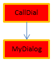

The compiled 4D code can be executed in **preemptive processes**. Gracias a esta característica, sus aplicaciones compiladas 4D pueden aprovechar al máximo las computadoras multinúcleo para que su ejecución sea más rápida y puedan soportar más usuarios conectados.

## ¿Qué es un proceso apropiativo?

When run in *preemptive* mode, a process is dedicated to a CPU. La gestión de procesos se delega entonces en el sistema, que puede asignar cada CPU por separado en una máquina multinúcleo.

When run in *cooperative* mode, all processes are managed by the parent application thread and share the same CPU, even on a multi-core machine.

Como resultado, en modo apropiativo, se mejora el rendimiento general de la aplicación, especialmente en máquinas de múltiples núcleos, ya que varios procesos (hilos) pueden ejecutarse realmente de forma simultánea. Sin embargo, las ganancias reales dependen de las operaciones que se ejecuten. A cambio, dado que cada hilo es independiente de los demás en modo apropiativo y no es administrado directamente por la aplicación, existen restricciones específicas aplicadas al código que se desea que cumpla con el uso apropiativo. Además, la ejecución apropiativa sólo está disponible en determinados contextos específicos.

## Disponibilidad del modo apropiativo

El uso del modo apropiativo está soportado en los siguientes contextos de ejecución:

| Contexto          | Ejecución apropiativa                                                  |
| ----------------- | ---------------------------------------------------------------------- |
| 4D Server         | sí                                                                     |
| 4D remoto         | yes, with [ServerNet or QUIC](../settings/client-server#network-layer) |
| 4D monopuesto     | sí                                                                     |
| Modo compilado    | sí                                                                     |
| Modo interpretado | no                                                                     |

If the execution context supports preemptive mode and if the method is "thread-safe", a new 4D process launched using the `New process` or `CALL WORKER` commands, or the "Run method" menu item, will be executed in a preemptive thread.

Otherwise, if you call `New process` or `CALL WORKER` from an execution context that is not supported (i.e. from interpreted mode), the process is always cooperative.


## Hilo seguro vs. hilo inseguro

El código 4D se puede ejecutar en hilo apropiativo sólo cuando se cumplen algunas condiciones específicas. Each part of the code being executed (commands, methods, variables, functions, etc.) must be compliant with preemptive use. Los elementos que se pueden ejecutar en hilos apropiativos se llaman hilos seguros y los elementos que no se pueden ejecutar en hilos apropiativos se llaman hilos inseguros.

:::note

Dado que un hilo se maneja de forma independiente a partir del método del proceso padre, toda la cadena de llamada no debe incluir ningún código inseguro para los hilos; de lo contrario, la ejecución apropiativa no será posible. This point is discussed [in this paragraph](#when-is-a-process-started-preemptively).

:::

La propiedad "seguridad de hilo" de cada elemento depende del elemento en sí:

- Comandos 4D: hilo seguro es una propiedad interna. In the [4D Language Reference manual](https://doc.4d.com/4Dv20/4D/20.1/4D-Language-Reference.100-6479538.en.html), thread-safe commands are identified by the  icon. You can also use the [`Command name`](https://doc.4d.com/4dv20/help/command/en/page538.html) command to know if a command is thread-safe. Gran parte de los comandos 4D pueden ejecutarse en modo apropiativo.
- Project methods: conditions for being thread-safe are listed in [this paragraph](#writing-a-thread-safe-method).

Básicamente, el código que se ejecuta en hilos apropiativos no puede llamar a las partes con las interacciones externas, tal como el código plug-in o las variables interproceso. Los accesos a los datos, sin embargo, son permitidos desde el servidor de datos 4D que soporta la ejecución apropiativa.


## Declarar un método apropiativo

Por defecto, 4D ejecuta todos los métodos proyecto de su aplicación en modo cooperativo. Si desea beneficiarse de la función de modo apropiativo, el primer paso consiste en declarar explícitamente todos los métodos que desee que se inicien en modo apropiativo siempre que sea posible, es decir, los métodos que considere que pueden ejecutarse en un proceso apropiativo. The compiler will [check that these methods are actually thread-safe](#writing-a-thread-safe-method) at compile time. También puede desactivar el modo apropiativo para algunos métodos, si es necesario.

Tenga en cuenta que declarar un método "capable" de uso apropiativo lo hace elegible para la ejecución apropiativa, pero no garantiza que realmente se ejecute en modo apropiativo en tiempo de ejecución. Starting a process in preemptive mode results from an [evaluation performed by 4D](#when-is-a-process-started-preemptively) regarding the properties of all the methods in the call chain of the process.

Para declarar su método como elegible para su uso en modo apropiativo, debe utilizar la opción de declaración "Modo de ejecución" en el diálogo Propiedades del Método:


Se ofrecen las siguientes opciones:

- **Can be run in preemptive processes**: By checking this option, you declare that the method is able of being run in a preemptive process and therefore should be run in preemptive mode whenever possible. La propiedad "preemptive" del método toma el valor "capable".

    Cuando esta opción está seleccionada, el compilador de 4D verificará que el método es realmente capaz y devolverá errores si este no es el caso, por ejemplo, si llama directa o indirectamente a comandos o métodos que no pueden ser ejecutados en modo apropiativo (la cadena de llamadas completa es analizada pero los errores sólo son reportados al primer nivel). A continuación, puede editar el método para que sea hilo seguro, o seleccionar otra opción.

    Si la elegibilidad del método apropiativo es aprobada, éste se etiquetará internamente como "thread-safe" y se ejecutará en modo apropiativo siempre que se cumplan las condiciones requeridas. This property defines its eligibility for preemptive mode but does not guarantee that the method will actually be run in preemptive mode, since this execution mode requires a [specific context](#when-is-a-process-started-preemptively).

- **No puede ser ejecutado en procesos apropiativos**: marcando esta opción, declara que el método nunca debe ser ejecutado en modo apropiativo, y por lo tanto debe ser ejecutado siempre en modo cooperativo, como en versiones anteriores de 4D. La propiedad "preemptive" del método toma el valor "incapable".

    Cuando esta opción está marcada, el compilador de 4D no verificará la capacidad del método para ejecutarse de forma apropiativa; se etiquetará automáticamente como "thread-unsafe" internamente (incluso si es teóricamente compatible). Cuando se llama en ejecución, este método "contaminará" todos los otros métodos en el mismo hilo, forzando así que este hilo se ejecute en modo cooperativo, incluso si los otros métodos son hilo-seguro.

- **Indiferente**(por defecto): al marcar esta opción, se declara que no se quiere manejar la propiedad del modo apropiativo para el método. La propiedad "preemptive" del método se establece como "indifferent".

    Cuando esta opción está seleccionada, el compilador de 4D evaluará la compatibilidad del método con el modo apropiativo y lo etiquetará internamente como "thread-safe" o "thread-unsafe". No se devuelve ningún error relacionado con la ejecución apropiativa. Si el método se evalúa como "thread-safe", en la ejecución no impedirá el uso del modo apropiativo si se llama en un contexto apropiativo. Por el contrario, si el método se evalúa como "thread-unsafe", en ejecución impedirá la ejecución del modo apropiativo cuando sea llamado.

Note that with this option, whatever the internal thread safety evaluation, the method will always be executed in cooperative mode when called directly by 4D as the first parent method (for example through the `New process` command). Si se marca como "thread-safe" internamente, sólo se tiene en cuenta cuando se llama desde otros métodos dentro de una cadena de llamadas.

:::note Caso particular

If the method has also the [**Shared by components and host database**](../Project/code-overview.md#shared-by-components-and-host-database) property, setting the **Indifferent** option will automatically tag the method as thread-unsafe. Si quiere que un método de componente compartido sea hilo seguro, debe configurarlo explícitamente como **Puede ejecutarse en procesos apropiativos**.

:::

## ¿Cuándo se inicia un proceso de manera apropiativa?

:::info Recordatorio

La ejecución en modo apropiativo solo está disponible en modo compilado.

:::

In compiled mode, when starting a process created by either `New process` or `CALL WORKER` commands, 4D reads the preemptive property of the process method (also named *parent* method) and executes the process in preemptive or cooperative mode, depending on this property:

- Si el método del proceso es hilo seguro (validado durante la compilación), el proceso se ejecuta en un hilo apropiativo.
- Si el método del proceso no es hilo seguro, el proceso se ejecuta en un hilo cooperativo.
- Si la propiedad apropiativa del método de proceso fue definida "indifferent", por compatibilidad el proceso se ejecuta en un hilo cooperativo (incluso si el método es realmente capaz de utilizar apropiativo). Tenga en cuenta, sin embargo, que esta funcionalidad de compatibilidad sólo se aplica cuando el método se utiliza como método de proceso: un método declarado "indifferent" pero etiquetado internamente como "thread-safe" por el compilador puede ser llamado de forma apropiativa por otro método (ver más adelante).

La propiedad real hilo seguro depende de la cadena de llamada. Si un método con la propiedad declarada como "capable" llama a un método hilo no seguro en cualquiera de sus subniveles, se devolverá un error de compilación: si un único método en toda la cadena de llamadas es hilo no seguro, "contaminará" a todos los demás métodos y la ejecución apropiativa será rechazada por el compilador. Un hilo apropiativo sólo se puede crear cuando toda la cadena es hilo seguro y el método de proceso ha sido declarado "Se puede ejecutar en proceso apropiativo". Por otro lado, el mismo método hilo seguro puede ejecutarse en un hilo apropiativo cuando está en una cadena de llamada, y en un hilo cooperativo cuando está en otra cadena de llamada.

Por ejemplo, considere los siguientes métodos proyecto:

```4d
  //MyDialog project method
  //contains interface calls: will be internally thread unsafe
 $win:=Open form window("tools";Palette form window)
 DIALOG("tools")
```

```4d  
  //MyComp project method
  //contains simple computing: will be internally thread safe
 #DECLARE($value : Integer) -> $result : Integer
 $result:=$value*2
```

```4d
  //CallDial project method
 var $vName : Text
 MyDialog
```

```4d
  //CallComp project method
 var $vAge : Integer
 MyComp($vAge)
```

La ejecución de un método en modo apropiativo dependerá de su propiedad "ejecución" y de la cadena de llamadas. La siguiente tabla ilustra estas diversas situaciones:


| Declaración y cadena de llamadas      | Compilación | Seguridad de hilo resultante           | Ejecución                 | Comentario                                                                                                                                                                                                                                                                                                                                                                                                                                                             |
| ------------------------------------- | ----------- | -------------------------------------- | ------------------------- | ---------------------------------------------------------------------------------------------------------------------------------------------------------------------------------------------------------------------------------------------------------------------------------------------------------------------------------------------------------------------------------------------------------------------------------------------------------------------- |
|  | OK          |   | Apropiativo               | CallComp es el método padre, declarado "capaz" de uso apropiativo; ya que MyComp es internamente hilo seguro, CallComp es hilo seguro y el proceso es apropiativo                                                                                                                                                                                                                                                                                                      |
|  | Error       |   | La ejecución es imposible | CallDial es el método padre, declarado "capaz"; MyDialog es "indiferente". Sin embargo, ya que MyDialog está internamente hilo inseguro, contamina la cadena de llamadas. La compilación falla debido a un conflicto entre la declaración deCallDial y su capacidad real. La solución es o bien modificar MyDialog para que sea hilo seguro, de modo que la ejecución es apropiativa, o cambiar la declaración de propiedad de CallDial para correrlo como cooperativo |
|  | OK          |   | Cooperativo               | Como CallDial se declara "incapaz" de uso apropiativo, la compilación es internamente hilo inseguro, la ejecución siempre será cooperativa, cualquiera que sea el estado de MyDialog                                                                                                                                                                                                                                                                                   |
|  | OK          |   | Cooperativo               | Como CallComp es el método padre con la propiedad "indiferente", luego el proceso es cooperativo incluso si toda la cadena es hilo seguro.                                                                                                                                                                                                                                                                                                                             |
|  | OK          |  | Cooperativo               | Como CallDial es el método padre (la propiedad era "indiferente"), entonces el proceso es cooperativo y la compilación exitosa                                                                                                                                                                                                                                                                                                                                         |


### Cómo buscar el modo de ejecución actual

4D permite identificar el modo de ejecución de los procesos en modo compilado:

- The [`PROCESS PROPERTIES`](https://doc.4d.com/4dv20/help/command/en/page336.html) command allows you to find out whether a process is run in preemptive or cooperative mode.
- Both the Runtime Explorer and the [4D Server administration window](../ServerWindow/processes.md#process-type) display specific icons for preemptive processes.


## Escribir un método hilo seguro

Para ser hilo seguro, un método debe respetar las siguientes reglas:

- Debe tener la propiedad "Puede ejecutarse en procesos apropiativos" o "Indiferente"
- No debe llamar a un comando o función 4D que no sea hilo seguro.
- No debe llamar a otro método proyecto o función que no sea hilo seguro
- No debe llamar a un plug-in que no sea hilo seguro.
- No debe utilizar ninguna variable interproceso(1)
- No debe llamar a objetos de interfaz(2) (sin embargo, hay excepciones, ver más abajo).

(1) To exchange data between preemptive processes (and between all processes), you can pass [shared collections or shared objects](../Concepts/shared.md) as parameters to processes, and/or use the [`Storage`](https://doc.4d.com/4dv20/help/command/en/page1525.html) catalog. [Worker processes](processes.md#worker-processes) also allow you to exchange messages between any processes, including preemptive processes.

(2) The [`CALL FORM`](https://doc.4d.com/4dv20/help/command/en/page1391.html) command provides an elegant solution to call interface objects from a preemptive process.

:::note Notas

- En el caso de un método "Compartido por componentes y bases de datos locales", debe seleccionarse la propiedad "Puede ejecutarse en procesos apropiativos".
- Todas las declaraciones SQL son hilo seguro. SQL code inserted in `Begin SQL`/`End SQL` blocks must comply with the following conditions:
    + It must apply to the 4D Server or 4D local database (ODBC or remote databases via `SQL LOGIN` are thread-unsafe. However, local databases used with `USE DATABASE` are thread-safe).
    - Any trigger called by SQL statements must be thread-safe (see [Triggers](#triggers) below).

:::


Los métodos con la propiedad "Se puede ejecutar en procesos apropiativos" serán comprobados por 4D durante la compilación. Se emite un error de compilación cada vez que el compilador encuentra algo que impide que sea hilo seguro:


:::info

It is possible to [disable locally the thread-safety verification](#).

:::

The [symbol file](../Project/compiler.md/#complete-list-of-methods), if enabled, also contains the thread safety status for each method.

### Interfaz de usuario

Dado que se trata de accesos "externos", las llamadas a objetos de la interfaz de usuario como formularios, así como al depurador, no están permitidas en hilos apropiativos.

Los únicos accesos posibles a la interfaz de usuario desde un hilo apropiativo son:

- [Standard error dialog](../Debugging/basics). El diálogo se muestra en el proceso de modo usuario (en 4D) o en el proceso de interfaz de usuario del servidor (4D Server). The **Trace** button is disabled.
- Indicadores de progreso estándar
- `ALERT`, `Request` and `CONFIRM` dialogs. El diálogo se muestra en el proceso de modo usuario (en 4D) o en el proceso de interfaz de usuario del servidor (4D Server). Tenga en cuenta que si 4D Server se ha lanzado como un servicio en Windows sin permitir la interacción del usuario, los diálogos no se mostrarán.


### Triggers

Cuando un método utiliza un comando que puede llamar a un trigger, el compilador 4D evalúa la seguridad de los hilos del trigger para comprobar la seguridad de hilos del método:

```4d
 SAVE RECORD([Table_1]) //trigger on Table_1, if it exists, must be thread-safe
```

Aquí está la lista de comandos que se verifican en tiempo de compilación para la seguridad de hilos de trigger:

`SAVE RECORD`, `SAVE RELATED ONE`, `DELETE RECORD`, `DELETE SELECTION`, `ARRAY TO SELECTION`, `JSON TO SELECTION`, `APPLY TO SELECTION`, `IMPORT DATA`, `IMPORT DIF`, `IMPORT ODBC`, `IMPORT SYLK`, `IMPORT TEXT`.

Si la tabla se pasa dinámicamente, a veces el compilador no puede averiguar qué trigger debe evaluar. Estos son algunos ejemplos de estas situaciones:

```4d
 DEFAULT TABLE([Table_1])
 SAVE RECORD
 SAVE RECORD($ptrOnTable->)
 SAVE RECORD(Table(myMethodThatReturnsATableNumber())->)
```

En este caso, se evalúan todos los triggers. Si se detecta un comando que no sea hilo seguro en al menos un trigger, se rechaza todo el grupo y el método se declara hilo no seguro.

### Métodos de gestión de errores

[Error-catching methods](../Concepts/error-handling.md) installed by the `ON ERR CALL` command must be thread-safe if they are likely to be called from a preemptive process. In order to handle this case, the compiler checks the thread safety property of error-catching project methods passed to the `ON ERR CALL` command during compilation and returns appropriate errors if they do not comply with preemptive execution.

Tenga en cuenta que esta comprobación solo es posible cuando el nombre del método se pasa como una constante y no se calcula, como se muestra a continuación:

```4d
 ON ERR CALL("myErrMethod1") //will be checked by the compiler
 ON ERR CALL("myErrMethod"+String($vNum)) //will not be checked by the compiler
```

Además, si un método de proyecto captador de errores no puede ser llamado en tiempo de ejecución (después de un problema de seguridad de hilo, o por cualquier razón como "método no encontrado"), se genera el error -10532 "No se puede llamar al método de gestión de errores 'methodName'".


### Compatibilidad de punteros

Un proceso puede desreferenciar un puntero para acceder al valor de la variable de otro proceso solo si ambos procesos están cooperando; en caso contrario, 4D lanzará un error. En un proceso apropiativo, si algún código 4D intenta hacer referencia a un puntero a una variable interproceso, 4D lanzará un error.

Ejemplo con los siguientes métodos:

Method1:

```4d
 myVar:=42
 $pid:=New process("Method2";0;"process name";->myVar)
```

Method2:

```4d
 $value:=$1->
```

If either the process running Method1 or the process running Method2 is preemptive, then the expression `$value:=$1->` will throw an execution error.

### Referencia de documento refDoc

The use of DocRef type parameters (opened document reference, used or returned by `Open document`, `Create document`, `Append document`, `CLOSE DOCUMENT`, `RECEIVE PACKET`, `SEND PACKET`) is limited to the following contexts:

- When called from a preemptive process, a `DocRef` reference is only usable from that preemptive process.
- When called from a cooperative process, a `DocRef` reference is usable from any other cooperative process.


## Desactivar localmente la verificación hilo de seguridad

En algunos casos, puede que prefiera que la verificación "thread-safety" de los comandos no se aplique a algunas partes del código, como por ejemplo, cuando tiene comandos no hilo seguro que sabe que nunca se van a llamar.

To do this, you must surround the code to be excluded from command thread safety checking with the special directives `%T-` and `%T+` as comments. The `//%T-` comment disables thread safety checking and `//%T+` enables it again:

```4d
  // %T- to disable thread safety checking

  // Place the code containing commands to be excluded from thread safety checking here
 $w:=Open window(10;10;100;100) //for example

  // %T+ to enable thread safety checking again for the rest of the method
```

Por supuesto, el desarrollador 4D es responsable de que el modo apropiativo del código sea compatible con las directivas de activación y de reactivación. Se generarán errores de tiempo de ejecución si se ejecuta código hilo no seguro en un hilo apropiativo.


