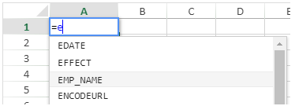

## Utilización de las fórmulas

Una fórmula de hoja de cálculo es una expresión que calcula el valor de una celda.

### Entrada de las fórmulas

Para introducir una fórmula en un área 4D View Pro:

1. Seleccione la celda en la que introducirá la fórmula o función.
2. Introduzca = (el signo igual).
3. Escriba la fórmula y presione la tecla **Intro**.

Al escribir una fórmula, puede utilizar diferentes atajos:

- haga clic en una celda para introducir su referencia en la fórmula:


- escriba la primera letra de una función a ingresar. Aparece un menú contextual en el que se listan las funciones y referencias disponibles, permitiéndole seleccionar los elementos deseados:


También puede crear fórmulas con nombre que pueden ser llamadas a través de su nombre. To do so, enter these formulas using the [VP ADD FORMULA NAME](method-list.md#vp-add-formula-name) command.

### Operadores y operandos

Todas las fórmulas tienen operandos y operadores:

- **Operators**: see [Values and operators](#values-and-operators) below.
- **Operands** include several categories:
  - [values](#values-and-operators) (5 data types are supported)
  - [references to other cells](#cell-references) (relative, absolute, mixed or by name)
  - [standard spreadsheet functions](#using-functions)
  - [4D functions](#4d-functions) based upon 4D formulas and providing access to 4D variables, fields, methods, commands, or expressions.

## Valores y operadores

4D View Pro soporta cinco tipos de datos. Para cada tipo de datos, se soportan valores literales y de operadores específicos.

| Tipos de datos                    | Valores                             | Operadores                                                                                                                                                                                                                                                                                                                                 |
| --------------------------------- | ----------------------------------- | ------------------------------------------------------------------------------------------------------------------------------------------------------------------------------------------------------------------------------------------------------------------------------------------------------------------------------------------ |
| [Number](Concepts/dt_number.md)   | 1.2<br/>1.2 E3<br/>1.2E-3<br/>10.3x | - (suma)<br/>- (resta)<br/>\* (multiplicación)<br/>/ (división)<br/>^ (exponente, el número de veces que hay que multiplicar un número por sí mismo)<br/>% (porcentaje -- dividir el número antes del operador por cien) |
| [Date](Concepts/dt_date.md)       | 10/24/2017                          | * (date + number of days -> date)<br/>+ (date + time -> date + time of day)<br/>- (date - number of days -> date)<br/>- (date - date -> number of days between the two)                                                                                        |
| [Time](Concepts/dt_time.md)       | 10:12:10                            | Duration operators:<br/>+ (addition)<br/>- (subtraction)<br/>\* (duration \* number -> duration)<br/>/ (duration / number -> duration)                                                                                                                         |
| [String](Concepts/dt_string.md)   | 'Sophie' o "Sophie"                 | & (concatenación)                                                                                                                                                                                                                                                                                                       |
| [Boolean](Concepts/dt_boolean.md) | TRUE o FALSE                        | -                                                                                                                                                                                                                                                                                                                                          |

### Operadores de comparación

Los siguientes operadores pueden utilizarse con dos operandos del mismo tipo:

| Operador | Comparación       |
| -------- | ----------------- |
| =        | igual a           |
| `<>`     | es diferente de   |
| >        | mayor que         |
| <        | menor que         |
| > =      | mayor o igual que |
| <=       | menor o igual que |

### Presedencia de los operadores

Lista de los operadores de la mas a menos importante:

| Operador                    | Descripción                                  |
| --------------------------- | -------------------------------------------- |
| ()       | Paréntesis (para agrupar) |
| -                           | Negativo                                     |
| *                           | Más                                          |
| %                           | Porcentaje                                   |
| ^                           | Exponente                                    |
| - y /                       | Multiplicar y dividar                        |
| * y -                       | Añadir y restar                              |
| &                           | Concatenar                                   |
| `=`  `>` `<` `>=` `<=` `<>` | Comparar                                     |

## Referencias de celdas

Las fórmulas a menudo se refieren a otras celdas por medio de direcciones de celdas. Puede copiar estas fórmulas a otras celdas. Por ejemplo, la siguiente fórmula, introducida en la celda C8, suma los valores de las dos celdas superiores y muestra el resultado.

```
= C6 + C7
```

Esta fórmula se refiere a las celdas C6 y C7. Es decir, 4D View Pro tiene instrucciones de referirse a estas otras celdas para los valores a utilizar en la fórmula.

Cuando copie o mueva estas fórmulas a nuevas ubicaciones, cada dirección de celda en esa fórmula cambiará o permanecerá igual, dependiendo de cómo se escriba.

- A reference that changes is called a **relative reference**, and refers to a cell by how far left/right and up/down it is from the cell with the formula.
- A reference that always points to a particular cell is called an **absolute reference**.
- También puede crear una referencia mixta que apunte siempre a una línea o columna fija.

### Notación de las referencias

If you use only cell coordinates, for example, `C5`, 4D View Pro interprets the reference as relative. You may make the reference an absolute reference by putting a dollar sign in front of the letter and the number, as in `$C$5`.

You can mix absolute and relative references by inserting a dollar sign in front of the letter or the number alone, for example, `$C5` or `C$5`. Una referencia mixta permite especificar la fila o la columna como absolutas, permitiendo al mismo tiempo que la otra parte de la dirección se refiera a ella de forma relativa.

Una forma cómoda, rápida y precisa de especificar una referencia absoluta es nombrar la celda y utilizar ese nombre en lugar de la dirección de la celda. Una referencia a una celda nombrada es siempre absoluta. You can create or modify named cells or named cell ranges using the [`VP ADD RANGE NAME`](method-list.md#vp-add-range-name) method.

La siguiente tabla muestra el efecto de las diferentes notaciones:

| Ejemplo            | Tipo de referencia | Descripción                                                                                                                                                     |
| ------------------ | ------------------ | --------------------------------------------------------------------------------------------------------------------------------------------------------------- |
| C5                 | Relativo           | La referencia es a la ubicación relativa de la celda C5, dependiendo de la ubicación de la celda en la que se utiliza la referencia por primera vez             |
| $C$5               | Absoluto           | La referencia es absoluta. Siempre se referirá a la celda C5 sin importar dónde se utilice.                                                                     |
| $C5                | Mixed              | La referencia es siempre a la columna C, pero la referencia de línea es relativa a la ubicación de la celda en la que se utiliza la referencia por primera vez. |
| C$5                | Mixed              | La referencia es siempre la línea 5, pero la referencia de la columna es relativa a la ubicación de la celda en la que se utiliza la referencia por primera vez |
| Nombre de la celda | Absoluto           | La referencia es absoluta. Will always refer to the [named cell or range](method-list.md#vp-add-range-name) no matter where the reference is used.              |

## Funciones integradas

Las funciones de hoja de cálculo son fórmulas predefinidas utilizadas para calcular los valores de las celdas. Al teclear la primera letra de la función a introducir, aparece un menú emergente con las funciones y referencias disponibles, que permite seleccionar los elementos deseados:


See [**SpreadJS's extented list of functions**](https://developer.mescius.com/spreadjs/docs/formulareference/FormulaFunctions) for details and examples.

## Funciones 4D

4D View Pro allows you to define and call **4D custom functions**, which execute [4D formulas](API/FunctionClass.md). El uso de las funciones personalizadas 4D extiende las posibilidades de sus documentos 4D View Pro y permite interacciones avanzadas con la base de datos 4D.

Las funciones personalizadas 4D permiten acceder, desde sus fórmulas 4D View Pro, a:

- variables proceso 4D,
- campos,
- métodos proyecto,
- comandos del lenguaje 4D,
- o cualquier expresión válida de 4D.

4D custom functions can receive [parameters](#parameters) from the 4D View Pro area, and return values.

You declare all your functions using the [`VP SET CUSTOM FUNCTIONS`](method-list.md#vp-set-custom-functions) method. Ejemplos:

```4d
o:=New object

//Nombre de la fonción en 4D View Pro: "DRIVERS_LICENCE"
$o.DRIVERS_LICENCE:=New object

/variable process
$o.DRIVERS_LICENCE.formula:=Formula(DriverLicence)

//campo table
$o.DRIVERS_LICENCE.formula:=Formula([Users]DriverLicence)

//método proyecto
$o.DRIVERS_LICENCE.formula:=Formula(DriverLicenceState)

//Comando 4D
$o.DRIVERS_LICENCE:=Formula(Choose(DriverLicence; "Obtained"; "Failed"))

//expresión y parámetro 4D 
$o.DRIVERS_LICENCE.formula:=Formula(ds.Users.get($1).DriverLicence)
$o.DRIVERS_LICENCE.parameters:=New collection
$o.DRIVERS_LICENCE.parameters.push(New object("name"; "ID"; "type"; Is longint))
```

> **See also** [4D View Pro: Use 4D formulas in your spreadsheet (blog post)](https://blog.4d.com/4d-view-pro-use-4d-formulas-in-your-spreadsheet/)

### Ejemplo con Hello World

Queremos imprimir "Hola Mundo" en una celda del área 4D View Pro utilizando un método proyecto 4D:

1. Cree un método proyecto "myMethod" con el siguiente código:

```4d
 #DECLARE->$hw Text
 $hw:="Hello World"

```

2. Ejecute el siguiente código antes de abrir cualquier formulario que contenga un área 4D View Pro:

```4d
  Case of
    :(Form event code=On Load)
       var $o : Object
       $o:=New object
  // Define "vpHello" function from the "myMethod" method
       $o.vpHello:=New object
       $o.vpHello.formula:=Formula(myMethod)
       VP SET CUSTOM FUNCTIONS("ViewProArea";$o)
 End case
```

3. Edite el contenido de una celda en un área 4D View Pro y escriba:

   

   "myMethod" es entonces llamado por 4D y la la celda se muestra:

   

### Parámetros

Los parámetros se pueden pasar a las funciones 4D que llaman a los métodos proyecto utilizando la siguiente sintaxis:

```
=METHODNAME(param1,param2,...,paramN)
```

These parameters are received in _methodName_ in $1, $2...$N.

Tenga en cuenta que los ( ) son obligatorios, incluso si no se pasan parámetros:

```
=METHODWITHOUTNAME()
```

You can declare the name, type, and number of parameters through the _parameters_ collection of the function you declared using the [VP SET CUSTOM FUNCTIONS](method-list.md#vp-set-custom-functions) method. Optionally, you can control the number of parameters passed by the user through _minParams_ and _maxParams_ properties.

For more information on supported incoming parameter types, please refer to the [VP SET CUSTOM FUNCTIONS](method-list.md#vp-set-custom-functions) method description.

:::note

If you do not declare parameters, values can be sequentially passed to methods (they will be received in $1, $2...) y su tipo se convertirá automáticamente. Dates in _jstype_ will be passed as [object](Concepts/dt_object.md) in 4D code with two properties:

| Propiedad | Tipo  | Descripción      |
| --------- | ----- | ---------------- |
| value     | Fecha | Valor fecha      |
| time      | Real  | Hora en segundos |

:::

Los métodos proyecto 4D también pueden devolver valores en la fórmula de la celda 4D View Pro a través de $0. Los siguientes tipos de datos son soportados para los parámetros devueltos:

- [text](Concepts/dt_string.md) (converted to string in 4D View Pro)

- [real](Concepts/dt_number.md)/[longint](Concepts/dt_number.md) (converted to number in 4D View Pro)

- [date](Concepts/dt_date.md) (converted to JS Date type in 4D View Pro - hour, minute, sec = 0)

- [time](Concepts/dt_time.md) (converted to JS Date type in 4D View Pro - date in base date, i.e. 12/30/1899)

- [boolean](Concepts/dt_boolean.md) (converted to bool in 4D View Pro)

- [picture](Concepts/dt_picture.md) (jpg,png,gif,bmp,svg other types converted into png) creates a URI (data:image/png;base64,xxxx) and then used as the background in 4D View Pro in the cell where the formula is executed

- [object](Concepts/dt_object.md) with the following two properties (allowing passing a date and time):

  | Propiedad | Tipo  | Descripción      |
  | --------- | ----- | ---------------- |
  | value     | Fecha | Valor fecha      |
  | time      | Real  | Hora en segundos |

Si el método 4D no devuelve nada, se devuelve automáticamente una cadena vacía.

Se devuelve un error en la celda 4D View Pro si:

- el método 4D devuelve otro tipo distinto de los mencionados anteriormente,
- se ha producido un error durante la ejecución del método 4D (cuando el usuario presiona el botón "abortar").

#### Ejemplo

```4d
var $o : Object

$o.BIRTH_INFORMATION:=New object
$o.BIRTH_INFORMATION.formula:=Formula(BirthInformation)
$o.BIRTH_INFORMATION.parameters:=New collection
$o.BIRTH_INFORMATION.parameters.push(New object("name";"First name";"type";Is text))
$o.BIRTH_INFORMATION.parameters.push(New object("name";"Birthday";"type";Is date))
$o.BIRTH_INFORMATION.parameters.push(New object("name";"Time of birth";"type";Is time))
$o.BIRTH_INFORMATION.summary:="Returns a formatted string from given information"

VP SET CUSTOM FUNCTIONS("ViewProArea"; $o)
```


## Compatibilidad

Existen soluciones alternativas para declarar campos o métodos como funciones en sus áreas 4D View Pro. Estas soluciones se mantienen por razones de compatibilidad y pueden utilizarse en casos concretos. However, using the [`VP SET CUSTOM FUNCTIONS`](method-list.md#vp-set-custom-functions) method is recommended.

### Referenciación de campos mediante la estructura virtual

4D View Pro allows you to reference 4D fields using the virtual structure of the database, i.e. declared through the [`SET TABLE TITLES`](https://doc.4d.com/4dv19/help/command/en/page601.html) and/or [`SET FIELD TITLES`](https://doc.4d.com/4dv19/help/command/en/page602.html) commands with the \* parameter. This alternate solution could be useful if your application already relies on a virtual structure (otherwise, [using `VP SET CUSTOM FUNCTIONS`](#4d-functions) is recommended).

> **WARNING:** You cannot use the virtual structure and `VP SET CUSTOM FUNCTIONS` simultaneously. As soon as `VP SET CUSTOM FUNCTIONS` is called, the functions based upon `SET TABLE TITLES` and `SET FIELD TITLES` commands are ignored in the 4D View Pro area.

#### Requisitos

- The field must belong to the virtual structure of the database, i.e. it must be declared through the [`SET TABLE TITLES`](https://doc.4d.com/4dv19/help/command/en/page601.html) and/or [`SET FIELD TITLES`](https://doc.4d.com/4dv19/help/command/en/page602.html) commands with the \* parameter (see example),
- Table and field names must be ECMA compliant (see [ECMA Script standard](https://www.ecma-international.org/ecma-262/5.1/#sec-7.6)),
- El tipo de campo debe ser soportado por 4D View Pro (ver arriba).

Se devuelve un error en la celda 4D View Pro si la fórmula llama a un campo que no es compatible.

#### Llamar a un campo virtual en una fórmula

Para insertar una referencia a un campo virtual en una fórmula, introduzca el campo con la siguiente sintaxis:

```
TABLENAME_FIELDNAME()
```

Por ejemplo, si declaró el campo "Name" de la tabla "People" en la estructura virtual, puede llamar las siguientes funciones:

```
=PEOPLE_NAME()
=LEN(PEOPLE_NAME())
```

> Si un campo tiene el mismo nombre que un [método 4D], tiene prioridad sobre el método.

#### Ejemplo

Queremos imprimir el nombre de una persona en una celda del área 4D View Pro utilizando un campo virtual 4D:

1. Crear una tabla "Employee" con un campo "L_Name":


2. Ejecuta el siguiente código para inicializar una estructura virtual:

   ```4d
   ARRAY TEXT($tableTitles;1)
   ARRAY LONGINT($tableNum;1)
   $tableTitles{1}:="Emp"
   $tableNum{1}:=2
   SET TABLE TITLES($tableTitles;$tableNum;*)
    
   ARRAY TEXT($fieldTitles;1)
   ARRAY LONGINT($fieldNum;1)
   $fieldTitles{1}:="Name"
   $fieldNum{1}:=2 //last name
   SET FIELD TITLES([Employee];$fieldTitles;$fieldNum;*)
   ```

3. Edite el contenido de una celda en el área 4D View Pro e introduzca "=e":



4. Seleccione EMP_NAME (utilice la tecla Tab) e introduzca el cierre).


5. Valide el campo para mostrar el nombre del empleado actual:


> La tabla [Employee] debe tener un registro actual.

### Declarar los métodos autorizados

Puede llamar directamente a los métodos del proyecto 4D desde sus fórmulas 4D View Pro. For security reasons, you must declare explicitly methods that can be called by the user with the [VP SET ALLOWED METHODS](method-list.md#vp-set-allowed-methods) method.

#### Requisitos

Para ser llamado en una fórmula 4D View Pro, un método proyecto debe ser:

- **Allowed**: it was explicitly declared using the [VP SET ALLOWED METHODS](method-list.md#vp-set-allowed-methods) method.
- **Runnable**: it belongs to the host project or a loaded component with the "Shared by components and host project" option enabled (see [Sharing of project methods](../Concepts/components.md#sharing-of-project-methods)).
- **Not in conflict** with an existing 4D View Pro spreadsheet function: if you call a project method with the same name as a 4D View Pro built-in function, the function is called.

> If neither the [VP SET CUSTOM FUNCTIONS](method-list.md#vp-set-custom-functions) nor the [VP SET ALLOWED METHODS](method-list.md#vp-set-allowed-methods) method has been executed during the session, 4D View Pro custom functions rely on allowed methods defined by 4D's generic `SET ALLOWED METHODS` command. In this case, the project method names must comply with JavaScript Identifier Grammar (see [ECMA Script standard](https://www.ecma-international.org/ecma-262/5.1/#sec-7.6)). The global filtering option in the Settings dialog box (see _Data Access_) is ignored in all cases.
