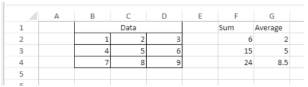
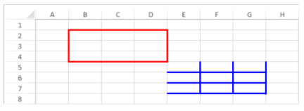
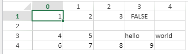

> **Atención**: los comandos de esta página no son hilo seguro.

[A](#a) -
[C](#c) -
[D](#d) -
[E](#e) -
[F](#f) -
[G](#g) -
[I](#i) -
[M](#m) -
[N](#n) -
[O](#o) -
[P](#p) -
[R](#r) -
[S](#s)

## A

### VP ADD FORMULA NAME

<!-- REF #_method_.VP ADD FORMULA NAME.Syntax -->

**VP ADD FORMULA NAME** ( _vpAreaName_ : Text ; _vpFormula_ : Text ; _name_ : Text { ; _options_ : Object } )<!-- END REF -->

<!-- REF #_method_.VP ADD FORMULA NAME.Params -->

| Parámetros | Tipo   |    | Descripción                                  |                  |
| ---------- | ------ | -- | -------------------------------------------- | ---------------- |
| vpAreaName | Text   | -> | Nombre de objeto formulario área 4D View Pro |                  |
| vpFormula  | Text   | -> | Fórmula 4D View Pro                          |                  |
| name       | Text   | -> | Nombre de la fórmula                         |                  |
| options    | Object | -> | Opciones de la fórmula temporal              | <!-- END REF --> |

#### Descripción

El comando `VP ADD FORMULA NAME` <!-- REF #_method_.VP ADD FORMULA NAME.Summary -->crea o modifica una fórmula temporal en el documento abierto<!-- END REF -->.

> Las fórmulas temporales creadas por este comando se guardan en el documento.

En _vpAreaName_, pase el nombre del área 4D View Pro. Si pasa un nombre que no existe, se devuelve un error.

Pase la fórmula 4D View Pro que desea nombrar en _vpFormula_. Para obtener información detallada sobre la sintaxis de las fórmulas, consulte la página [Fórmulas y funciones](formulas.md).

Pase el nuevo nombre para la fórmula en _name_. Si el nombre ya se utiliza en el mismo alcance, la nueva fórmula nombrada sustituye la existente. Tenga en cuenta que puede utilizar el mismo nombre para diferentes alcances (ver más adelante).

Puede pasar un objeto con las propiedades adicionales para la fórmula nombrada en _options_. Se soportan las siguientes propiedades:

| Propiedad | Tipo   | Descripción                                                                                                                                                                                                                                                                                                                                                                                                                                                                   |
| --------- | ------ | ----------------------------------------------------------------------------------------------------------------------------------------------------------------------------------------------------------------------------------------------------------------------------------------------------------------------------------------------------------------------------------------------------------------------------------------------------------------------------- |
| scope     | Number | Alcance de la fórmula. Puede pasar el índice de hojas (el conteo comienza en 0) o usar las siguientes constantes: <li>`vk current sheet`</li><li>`vk workbook`</li>El ámbito determina si un nombre de fórmula es local en una hoja de trabajo determinada (_scope_=sheet index o `vk current sheet`), o global en todo el libro de trabajo (_scope_=`vk workbook`). |
| comment   | Text   | Comentario asociado a una fórmula nombrada                                                                                                                                                                                                                                                                                                                                                                                                                                    |

#### Ejemplo

```4d
VP ADD FORMULA NAME("ViewProArea";"SUM($A$1:$A$10)";"Total2")
```

#### Ver también

[Cell references](formulas.md#cell-references)<br/>[VP Get formula by name](#vp-get-formula-by-name)<br/>[VP Get names](#vp-get-names)

### VP ADD RANGE NAME

<!-- REF #_method_.VP ADD RANGE NAME.Syntax -->

**VP ADD RANGE NAME** ( _rangeObj_ : Object ; _name_ : Text { ; _options_ : Object } )<!-- END REF -->

<!-- REF #_method_.VP ADD RANGE NAME.Params -->

| Parámetros | Tipo   |    | Descripción                     |                  |
| ---------- | ------ | -- | ------------------------------- | ---------------- |
| rangeObj   | Object | -> | Objeto rango                    |                  |
| name       | Text   | -> | Nombre de la fórmula            |                  |
| options    | Object | -> | Opciones de la fórmula temporal | <!-- END REF --> |

#### Descripción

El comando `VP ADD RANGE NAME` <!-- REF #_method_.VP ADD RANGE NAME.Summary -->crea o modifica un rango con nombre en el documento abierto<!-- END REF -->.

> Los rangos nombrados creados por este comando se guardan con el documento.

En _rangeObj_, pase el rango que quiere nombrar, y pase el nuevo nombre del rango en _name_. Si el nombre ya se utiliza en el mismo alcance, el nuevo rango nombrado sustituye al existente. Tenga en cuenta que puede utilizar el mismo nombre para diferentes alcances (ver más adelante).

Puede pasar un objeto con las propiedades adicionales para el rango nombrado en _options_. Se soportan las siguientes propiedades:

| Propiedad | Tipo   | Descripción                                                                                                                                                                                                                                                                                                                                                                                                                                                              |
| --------- | ------ | ------------------------------------------------------------------------------------------------------------------------------------------------------------------------------------------------------------------------------------------------------------------------------------------------------------------------------------------------------------------------------------------------------------------------------------------------------------------------ |
| scope     | Number | Alcance del rango. Puede pasar el índice de hojas (el conteo comienza en 0) o usar las siguientes constantes: <li>`vk current sheet`</li><li>`vk workbook`</li>El alcance determina si un nombre de rango es local en una hoja de trabajo determinada (_scope_=sheet index o `vk current sheet`), o global en todo el libro de trabajo (_scope_=`vk workbook`). |
| comment   | Text   | Comentario asociado al rango nombrado                                                                                                                                                                                                                                                                                                                                                                                                                                    |

> - Un rango nombrado es en realidad una fórmula nombrada que contiene coordenadas. `VP ADD RANGE NAME` facilita la creación de rangos temporales, pero también puede utilizar el método [`VP ADD FORMULA NAME`](#vp-add-formula-name) para crear rangos temporales.
> - Las fórmulas que definen rangos con nombre pueden recuperarse con el método [`VP Get formula by name`](#vp-get-formula-by-name).

#### Ejemplo

Quiere crear un rango nombrado para un rango de celdas:

```4d
$range:=VP Cell("ViewProArea";2;10)
VP ADD RANGE NAME($range;"Total1")
```

#### Ver también

[VP Get names](#vp-get-names)<br/>[VP Name](#vp-name)

### VP ADD SELECTION

<!-- REF #_method_.VP ADD SELECTION.Syntax -->

**VP ADD SELECTION** ( _rangeObj_ : Object )<!-- END REF -->

<!-- REF #_method_.VP ADD SELECTION.Params -->

| Parámetros | Tipo |    | Descripción  |                  |
| ---------- | ---- | -- | ------------ | ---------------- |
| rangeObj   | Text | -> | Objeto rango | <!-- END REF --> |

#### Descripción

El comando `VP ADD SELECTION` <!-- REF #_method_.VP ADD SELECTION.Summary -->añade las celdas especificadas a las celdas actualmente seleccionadas<!-- END REF -->.

En _rangeObj_, pase un objeto rango de varias celdas para añadir a la selección actual.

> La celda activa no se modifica.

#### Ejemplo

Actualmente tienes celdas seleccionadas:


El siguiente código añadirá celdas a su selección:

```4d
$currentSelection:=VP Cells("myVPArea";3;4;2;3)
VP ADD SELECTION($currentSelection)
```

Resultado:


#### Ver también

[VP Get active cell](#vp-get-active-cell)<br/>[VP Get selection](#vp-get-selection)<br/>[VP RESET SELECTION](#vp-reset-selection)<br/>[VP SET ACTIVE CELL](#vp-set-active-cell)<br/>[VP SET SELECTION](#vp-set-selection)<br/>[VP SHOW CELL](#vp-show-cell)

### VP ADD SHEET

<!-- REF #_method_.VP ADD SHEET.Syntax -->

**VP ADD SHEET** ( _vpAreaName_ : Text )<br/>**VP ADD SHEET** ( _vpAreaName_ : Text ; _index_ : Integer )<br/>**VP ADD SHEET** ( _vpAreaName_ : Text ; _sheet_ : Integer ; _name_ : Text )<!-- END REF -->

<!-- REF #_method_.VP ADD SHEET.Params -->

| Parámetros | Tipo    |    | Descripción                                  |                  |
| ---------- | ------- | -- | -------------------------------------------- | ---------------- |
| vpAreaName | Text    | -> | Nombre de objeto formulario área 4D View Pro |                  |
| sheet      | Integer | -> | Indice de la nueva hoja                      |                  |
| name       | Text    | -> | Nombre de la hoja                            | <!-- END REF --> |

#### Descripción

El comando `VP ADD SHEET` <!-- REF #_method_.VP ADD SHEET.Summary -->inserta una hoja en el documento cargado en _vpAreaName_.<!-- END REF -->

En _vpAreaName_, pase el nombre del área 4D View Pro.

En _sheet_, puede pasar un índice para la nueva hoja. Si el _index_ pasado es inferior o igual a 0, el comando inserta la nueva hoja al principio. Si el _index_ supera el número de hojas, el comando inserta la nueva hoja después de las existentes.

> La indexación comienza en 0.

En _name_, puede pasar un nombre para la nueva hoja. El nuevo nombre no puede contener los siguientes caracteres: `*, :, [, ], ?,\,/`

#### Ejemplo

El documento tiene actualmente 3 hojas:


Para insertar una hoja en la tercera posición (índice 2) y nombrarla "March":

```4d
VP ADD SHEET("ViewProArea";2;"March")
```


#### Ver también

[VP REMOVE SHEET](#vp-remove-sheet)

### VP ADD SPAN

<!-- REF #_method_.VP ADD SPAN.Syntax -->

**VP ADD SPAN** ( _rangeObj_ : Object )<!-- END REF -->

<!-- REF #_method_.VP ADD SPAN.Params -->

| Parámetros | Tipo   |    | Descripción  |                  |
| ---------- | ------ | -- | ------------ | ---------------- |
| rangeObj   | Object | -> | Objeto rango | <!-- END REF --> |

#### Descripción

El comando `VP ADD SPAN` combina las celdas de _rangeObj_ como un único tramo de celdas.

En _rangeObj_, pase un rango de celdas. Las celdas del rango se unen para crear una celda más grande que se extiende por varias columnas y/o líneas. Puede pasar varios rangos de celdas para crear varios espacios al mismo tiempo. Tenga en cuenta que si los rangos de celdas se superponen, sólo se utiliza el primer rango de celdas.

> - Sólo se muestran los datos de la celda superior izquierda. Los datos de las otras celdas combinadas se ocultan hasta que se elimina la fusión.
> - Los datos ocultos en las celdas fusionadas son accesibles mediante fórmulas (empezando por la celda superior izquierda).

#### Ejemplo

Para fusionar las celdas First quarter y Second quarter a través de las dos celdas al lado, y de fusionar la celda del área South a través de las dos líneas debajo de ella:


```4d
 // Rango First quarter
 $q1:=VP Cells("ViewProArea";2;3;3;1)

// Rango Second quarter
 $q2:=VP Cells("ViewProArea";5;3;3;1)

  // Rango South area
 $south:=VP Cells("ViewProArea";0;5;1;3)

 VP ADD SPAN(VP Combine ranges($q1;$q2;$south))
```


#### Ver también

[4D View Pro Range Object Properties](getting-started.md#using-range-objects)<br/>[VP Get spans](#vp-get-spans)<br/>[VP REMOVE SPAN](#vp-remove-span)

### VP ADD STYLESHEET

<!-- REF #_method_.VP ADD STYLESHEET.Syntax -->

**VP ADD STYLESHEET** ( _vpAreaName_ : Text ; _styleName_ : Text ; _styleObj_ : Object { ; _sheet_ : Integer } )<!-- END REF -->

<!-- REF #_method_.VP ADD STYLESHEET.Params -->

| Parámetros | Tipo    |    | Descripción                                                    |                  |
| ---------- | ------- | -- | -------------------------------------------------------------- | ---------------- |
| vpAreaName | Text    | -> | Nombre de objeto formulario área 4D View Pro                   |                  |
| styleName  | Text    | -> | Nombre del estilo                                              |                  |
| styleObj   | Object  | -> | Objeto definiendo las propiedades del atributo                 |                  |
| sheet      | Integer | -> | Índice de la hoja (hoja actual si se omite) | <!-- END REF --> |

#### Descripción

El comando `VP ADD STYLESHEET` <!-- REF #_method_.VP ADD STYLESHEET.Summary -->crea o modifica la hoja de estilo _styleName_ basándose en la combinación de las propiedades especificadas en _styleObj_ en el documento abierto<!-- END REF -->. Si ya existe una hoja de estilo con el mismo nombre e índice en el documento, este comando la sobrescribirá con los nuevos valores.

> Las hojas de estilo creadas por este comando se guardan con el documento.

En _vpAreaName_, pase el nombre del área 4D View Pro. Si pasa un nombre que no existe, se devuelve un error.

El parámetro _styleName_ permite asignar un nombre a la hoja de estilo. Si el nombre ya se utiliza dentro del mismo alcance, la nueva hoja de estilo sustituye a la existente. Tenga en cuenta que puede utilizar el mismo nombre para diferentes alcances (ver más adelante).

Dentro del _styleObj_, designe la configuración de la hoja de estilo (por ejemplo, fuente, decoración del texto, alineación, bordes, etc.). Para ver la lista completa de propiedades de estilo, consulte [Propiedades de los objetos de estilo](configuring.md#style-object-properties).

Puede designar dónde definir la hoja de estilo en el parámetro opcional _sheet_ utilizando el índice de la hoja (la indexación comienza en 0) o con las siguientes constantes:

- `vk current sheet`
- `vk workbook`

Si una hoja de estilo _styleName_ está definida al nivel del libro de trabajo y de la hoja, el nivel de hoja tiene prioridad sobre el nivel del libro de trabajo cuando se define la hoja de estilo.

Para aplicar la hoja de estilo, utilice los comandos [VP SET DEFAULT STYLE](#vp-set-default-style) o [VP SET CELL STYLE](#vp-set-cell-style).

#### Ejemplo

El código siguiente:

```4d
$styles:=New object
$styles.backColor:="green"

//Line Border Object
$borders:=New object("color";"green";"style";vk line style medium dash dot)
 
$styles.borderBottom:=$borders
$styles.borderLeft:=$borders
$styles.borderRight:=$borders
$styles.borderTop:=$borders
 
VP ADD STYLESHEET("ViewProArea";"GreenDashDotStyle";$styles)

//Para aplicar el estiloVP SET CELL STYLE(VP Cells("ViewProArea";1;1;2;2);New object("name";"GreenDashDotStyle"))
```

creará y aplicará el siguiente objeto estilo llamado _GreenDashDotStyle_:

```
{
 backColor:green,
 borderBottom:{color:green,style:10},
 borderLeft:{color:green,style:10},
 borderRight:{color:green,style:10},
 borderTop:{color:green,style:10}
}
```

#### Ver también

[4D View Pro Style Objects and Style Sheets](configuring.md#style-objects--style-sheets)<br/>[VP Get stylesheet](#vp-get-stylesheet)<br/>[VP Get stylesheets](#vp-get-stylesheets)<br/>[VP REMOVE STYLESHEET](#vp-remove-stylesheet)<br/>[VP SET CELL STYLE](#vp-set-cell-style)<br/>[VP SET DEFAULT STYLE](#vp-set-default-style)

### VP All

<!-- REF #_method_.VP All.Syntax -->

**VP All** ( _vpAreaName_ : Text { ; _sheet_ : Integer } )  : Object<!-- END REF -->

<!-- REF #_method_.VP All.Params -->

| Parámetros | Tipo    |    | Descripción                                                    |                  |
| ---------- | ------- | -- | -------------------------------------------------------------- | ---------------- |
| vpAreaName | Text    | -> | Nombre de objeto formulario área 4D View Pro                   |                  |
| sheet      | Integer | -> | Índice de la hoja (hoja actual si se omite) |                  |
| Result     | Object  | <- | Objeto rango de todas las celdas                               | <!-- END REF --> |

#### Descripción

El comando `VP ALL` <!-- REF #_method_.VP All.Summary -->devuelve un nuevo objeto de rango que hace referencia a todas las celdas<!-- END REF -->.

En _vpAreaName_, pase el nombre del área 4D View Pro. Si pasa un nombre que no existe, se devuelve un error.

En el parámetro opcional _sheet_, puede designar una hoja específica donde se definirá el rango (la numeración comienza en 0). Si se omite o si se pasa `vk current sheet`, se utiliza la hoja de cálculo actual.

#### Ejemplo

Desea definir un objeto rango para todas las celdas de la hoja de cálculo actual:

```4d
$all:=VP All("ViewProArea") // todas las celdas de la hoja actual
```

#### Ver también

[VP Cell](#vp-cell)<br/>[VP Cells](#vp-cells)<br/>[VP Column](#vp-column)<br/>[VP Combine ranges](#vp-combine-ranges)<br/>[VP Name](#vp-name)<br/>[VP Row](#vp-row)

## C

### VP Cell

<!-- REF #_method_.VP Cell.Syntax -->

**VP Cell** ( _vpAreaName_ ; _column_ : Integer ; _row_ : Integer ; Text { ; _sheet_ : Integer } )  : Object<!-- END REF -->

<!-- REF #_method_.VP Cell.Params -->

| Parámetros | Tipo    |    | Descripción                                                    |
| ---------- | ------- | -- | -------------------------------------------------------------- |
| vpAreaName | Text    | -> | Nombre de objeto formulario área 4D View Pro                   |
| column     | Longint | -> | Índice de la columna                                           |
| row        | Longint | -> | Índice de la línea                                             |
| sheet      | Integer | -> | Índice de la hoja (hoja actual si se omite) |
| Result     | Object  | <- | Objeto rango de una sola celda                                 |

<!-- END REF -->

#### Descripción

El comando `VP Cell` <!-- REF #_method_.VP Cell.Summary -->devuelve un nuevo objeto de rango que hace referencia a una celda específica<!-- END REF -->.

> Este comando se aplica a los rangos de una sola celda. Para crear un objeto de rango para múltiples celdas, utilice el comando [VP Cells](#vp-cells).

En _vpAreaName_, pase el nombre del área 4D View Pro. Si pasa un nombre que no existe, se devuelve un error.

El parámetro _column_ define la columna de la posición del rango de celdas. Pase el índice de columna en este parámetro.

El parámetro _row_ define la línea del rango de celdas. Pase el índice de la línea en este parámetro.

En el parámetro opcional _sheet_, puede designar el índice de la hoja en donde se definirá el rango. Si se omite o si se pasa `vk current sheet`, se utiliza la hoja de cálculo actual por defecto.

> la indexación comienza en 0.

#### Ejemplo

Desea definir un objeto rango para la celda mostrada abajo (en la hoja actual):


El código es el siguiente:

```4d
$cell:=VP Cell("ViewProArea";2;4) // C5
```

#### Ver también

[VP All](#vp-all)<br/>[VP Cells](#vp-cells)<br/>[VP Column](#vp-column)<br/>[VP Combine ranges](#vp-combine-ranges)<br/>[VP Name](#vp-name)<br/>[VP Row](#vp-row)

### VP Cells

<!-- REF #_method_.VP Cells.Syntax -->

**VP Cells** ( _vpAreaName_ : Text ; _column_: Integer ; _row_: Integer ; _columnCount_ : Integer ; _rowCount_ : Integer { ; _sheet_ : Integer } ) : Object<!-- END REF -->

<details><summary>Historia</summary>

| Lanzamiento | Modificaciones |
| ----------- | -------------- |
| 17 R4       | Añadidos       |

</details>

<!-- REF #_method_.VP Cells.Params -->

| Parámetros  | Tipo    |    | Descripción                                                    |                  |
| ----------- | ------- | -- | -------------------------------------------------------------- | ---------------- |
| vpAreaName  | Text    | -> | Nombre de objeto formulario área 4D View Pro                   |                  |
| column      | Integer | -> | Índice de la columna                                           |                  |
| row         | Integer | -> | Índice de la línea                                             |                  |
| columnCount | Integer | -> | Número de columnas                                             |                  |
| rowCount    | Integer | -> | Número de líneas                                               |                  |
| sheet       | Integer | -> | Índice de la hoja (hoja actual si se omite) |                  |
| Result      | Object  | <- | Objeto rango de celdas                                         | <!-- END REF --> |

#### Descripción

El comando `VP Cells` <!-- REF #_method_.VP Cells.Summary -->devuelve un nuevo objeto de rango que hace referencia a celdas específicas<!-- END REF -->.

En _vpAreaName_, pase el nombre del área 4D View Pro. Si pasa un nombre que no existe, se devuelve un error.

El parámetro _column_ define la primera columna del rango de celdas. Pase el índice de la columna (la numeración comienza en 0) en este parámetro. Si el rango está dentro de varias columnas, también debe utilizar el parámetro _columnCount_.

En el parámetro _row_, puede definir la(s) línea(s) del rango de celdas. Pase el índice de la línea (el conteo comienza en 0) en este parámetro. Si el rango contiene varias líneas, también debe utilizar el parámetro _rowCount_.

El parámetro _columnCount_ permite definir el número total de columnas en las que se encuentra el rango. _columnCount_ debe ser mayor que 0.

El parámetro _rowCount_ permite definir el número total de líneas en las que se encuentra el rango. _rowCount_ debe ser mayor que 0.

En el parámetro opcional _sheet_, puede designar una hoja específica donde se definirá el rango (la numeración comienza en 0). Si se omite o si se pasa `vk current sheet`, se utiliza la hoja de cálculo actual por defecto.

#### Ejemplo

Desea definir un objeto rango para las siguientes celdas (de la hoja actual):


El código es el siguiente:

```4d
$cells:=VP Cells("ViewProArea";2;4;2;3) // de C5 a D7
```

#### Ver también

[VP All](#vp-all)<br/>[VP Cells](#vp-cells)<br/>[VP Column](#vp-column)<br/>[VP Combine ranges](#vp-combine-ranges)<br/>[VP Name](#vp-name)<br/>[VP Row](#vp-row)

### VP Column

<!-- REF #_method_.VP Column.Syntax -->

**VP Column** ( _vpAreaName_ : Text ; _column_: Integer ; _columnCount_ : Integer { ; _sheet_ : Integer } ) : Object<!-- END REF -->

<!-- REF #_method_.VP Column.Params -->

| Parámetros  | Tipo    |    | Descripción                                                    |                  |
| ----------- | ------- | -- | -------------------------------------------------------------- | ---------------- |
| vpAreaName  | Text    | -> | Nombre de objeto formulario área 4D View Pro                   |                  |
| column      | Integer | -> | Índice de la columna                                           |                  |
| columnCount | Integer | -> | Número de columnas                                             |                  |
| sheet       | Integer | -> | Índice de la hoja (hoja actual si se omite) |                  |
| Result      | Object  | <- | Objeto rango de celdas                                         | <!-- END REF --> |

#### Descripción

El comando `VP Column` <!-- REF #_method_.VP Column.Summary -->devuelve un nuevo objeto de rango que hace referencia a una columna o columnas específicas<!-- END REF -->.

En _vpAreaName_, pase el nombre del área 4D View Pro. Si pasa un nombre que no existe, se devuelve un error.

El parámetro _column_ define la primera columna del rango. Pase el índice de la columna (el conteo comienza en 0) en este parámetro. Si el rango contiene varias columnas, también debe utilizar el parámetro opcional _columnCount_.

El parámetro opcional _columnCount_ permite definir el número total de columnas en las que se encuentra el rango. _columnCount_ debe ser mayor que 0. Si se omite, el valor se establecerá en 1 por defecto y se creará un rango de tipo de columna.

En el parámetro opcional _sheet_, puede designar una hoja específica donde se definirá el rango (la numeración comienza en 0). Si se omite o si se pasa `vk current sheet`, se utiliza la hoja de cálculo actual por defecto.

#### Ejemplo

Desea definir un objeto rango para la columna mostrada abajo (en la hoja actual):


El código es el siguiente:

```4d
 $column:=VP Column("ViewProArea";3) // columna D
```

#### Ver también

[VP All](#vp-all)<br/>[VP Cells](#vp-cells)<br/>[VP Column](#vp-column)<br/>[VP Combine ranges](#vp-combine-ranges)<br/>[VP Name](#vp-name)<br/>[VP Row](#vp-row)<br/>[VP SET COLUMN ATTRIBUTES](#vp-set-column-attributes)

### VP COLUMN AUTOFIT

<!-- REF #_method_.VP COLUMN AUTOFIT.Syntax -->

**VP COLUMN AUTOFIT** ( _rangeObj_ : Object )<!-- END REF -->

<!-- REF #_method_.VP COLUMN AUTOFIT.Params -->

| Parámetros | Tipo   |    | Descripción  |                  |
| ---------- | ------ | -- | ------------ | ---------------- |
| rangeObj   | Object | -> | Objeto rango | <!-- END REF --> |

#### Descripción

El comando `VP COLUMN AUTOFIT` <!-- REF #_method_.VP COLUMN AUTOFIT.Summary -->dimensiona automáticamente la(s) columna(s) en _rangeObj_ según su contenido<!-- END REF -->.

En _rangeObj_, pase un objeto de rango que contenga un rango de columnas cuyo tamaño se manejará automáticamente.

#### Ejemplo

Las siguientes columnas tienen el mismo tamaño y no muestran parte del texto:


La selección de las columnas y la ejecución de este código:

```4d
 VP COLUMN AUTOFIT(VP Get selection("ViewProarea"))
```

... redimensiona las columnas para ajustarse al tamaño de los contenidos:


#### Ver también

[VP ROW AUTOFIT](#vp-row-autofit)

### VP Combine ranges

<!-- REF #_method_.VP Combine ranges.Syntax -->

**VP Combine ranges** ( _rangeObj_ : Object ; _otherRangeObj_ : Object {;..._otherRangeObjN_ : Object }  ) : Object<!-- END REF -->

<!-- REF #_method_.VP Combine ranges.Params -->

| Parámetros    | Tipo   |    | Descripción                            |                  |
| ------------- | ------ | -- | -------------------------------------- | ---------------- |
| rangeObj      | Object | -> | Objeto rango                           |                  |
| otherRangeObj | Object | -> | Objeto rango                           |                  |
| Result        | Object | <- | Objeto que contiene un rango combinado | <!-- END REF --> |

#### Descripción

El comando `VP Combine Ranges` <!-- REF #_method_.VP Combine ranges.Summary -->devuelve un nuevo objeto de rango que incorpora dos o más objetos de rango existentes<!-- END REF -->. Todos los rangos deben ser de la misma área 4D View Pro.

En _rangeObj_, pase el primer rango.

En _otherRangeObj_, pase otro objeto(s) rango para combinar con _rangeObj_.

> El comando incorpora _rangeObj_ y _otherRangeObj_ por referencia.

#### Ejemplo

Quiere combinar los rangos de tipo celda, columna y línea en un nuevo rango distinto:

```4d
 $cell:=VP Cell("ViewProArea";2;4) // C5
 $column:=VP Column("ViewProArea";3) // columna D
 $row:=VP Row("ViewProArea";9) // línea 10

 $combine:=VP Combine ranges($cell;$column;$row)
```

#### Ver también

[VP All](#vp-all)<br/>[VP Cells](#vp-cells)<br/>[VP Column](#vp-column)<br/>[VP Combine ranges](#vp-combine-ranges)<br/>[VP Name](#vp-name)<br/>[VP Row](#vp-row)<br/>[VP SET COLUMN ATTRIBUTES](#vp-set-column-attributes)

### VP Convert from 4D View

<!-- REF #_method_.VP Convert from 4D View.Syntax -->

**VP Convert from 4D View** ( _4DViewDocument_ : Blob ) : Object<!-- END REF -->

<!-- REF #_method_.VP Convert from 4D View.Params -->

| Parámetros     | Tipo   |    | Descripción                        |
| -------------- | ------ | -- | ---------------------------------- |
| 4DViewDocument | Blob   | -> | Documento 4D View                  |
| Result         | Object | <- | Objeto 4D View Pro<!-- END REF --> |

#### Descripción

El comando `VP Convert from 4D View` <!-- REF #_method_.VP Convert from 4D View.Summary -->permite convertir un documento heredado de 4D View en un objeto 4D View Pro<!-- END REF -->.

> Este comando no requiere que el plug-in 4D View esté instalado en su entorno.

En el parámetro _4DViewDocument_, pase una variable o un campo BLOB que contenga el documento 4D View a convertir. El comando devuelve un objeto 4D View Pro en el que toda la información almacenada originalmente en el documento 4D View se convierte en atributos 4D View Pro.

#### Ejemplo

Quiere obtener un objeto 4D View Pro a partir de un área 4D View almacenada en un BLOB:

```4d
C_OBJECT($vpObj)
$vpObj:=VP Convert from 4D View($pvblob)
```

### VP Convert to picture

<!-- REF #_method_.VP Convert to picture.Syntax -->

**VP Convert to picture** ( _vpObject_ : Object {; _rangeObj_ : Object} ) : Picture<!-- END REF -->

<!-- REF #_method_.VP Convert to picture.Params -->

| Parámetros | Tipo    |    | Descripción                                         |                  |
| ---------- | ------- | -- | --------------------------------------------------- | ---------------- |
| vpObject   | Object  | -> | Objeto 4D View Pro que contiene el área a convertir |                  |
| rangeObj   | Object  | -> | Objeto rango                                        |                  |
| Result     | Picture | <- | Imagen SVG del área                                 | <!-- END REF --> |

#### Descripción

El comando `VP Convert to picture` <!-- REF #_method_.VP Convert to picture.Summary -->convierte el objeto _vpObject_ de 4D View Pro (o el rango _rangeObj_ dentro de _vpObject_) en una imagen SVG<!-- END REF -->.

Este comando es útil, por ejemplo:

- para integrar un documento de 4D View Pro en otro documento, como un documento de 4D Write Pro
- para imprimir un documento 4D View Pro sin tener que cargarlo en un área de 4D View Pro.

En _vpObject_, pase el objeto 4D View Pro a convertir. Este objeto debe haber sido analizado previamente usando [VP Export to object](#vp-export-to-object) o guardado utilizando [VP EXPORT DOCUMENT](#vp-export-document).

> El proceso de conversión a SVG requiere que las expresiones y formatos (cf. [Formato de celda](configuring.md#cell-format)) incluidos en el área 4D View Pro se evalúen al menos una vez, para que puedan exportarse correctamente. Si convierte un documento que no ha sido evaluado previamente, las expresiones o los formatos pueden aparecer de forma inesperada.

En _rangeObj_, pase un rango de celdas a convertir. Por defecto, si se omite este parámetro, se convierte todo el contenido del documento.

El contenido del documento se convierte con respecto a sus atributos de visualización, incluidos los formatos (ver la nota anterior), la visibilidad de los encabezados, las columnas y las líneas. La conversión de los siguientes elementos es soportada:

- Texto: estilo / fuente / tamaño / alineación / orientación / rotación / formato
- Fondo de la celda : color / imagen
- Bordes de las celdas : grosor / color / estilo
- Fusión de celdas
- Imágenes
- Altura de líneas
- Ancho de columnas
- Columnas / líneas ocultas.

> La visibilidad de la rejilla depende del atributo del documento definido con [VP SET PRINT INFO](#vp-set-print-info).

#### Resultado

El comando devuelve una imagen en formato SVG.

#### Ejemplo

Quiere convertir un área 4D View Pro en SVG, previsualizar el resultado y enviarlo a una variable imagen:

```4d
C_OBJECT($vpAreaObj)
C_PICTURE($vPict)
$vpAreaObj:=VP Export to object("ViewProArea")
$vPict:=VP Convert to picture($vpAreaObj) //exportar toda el área
```

#### Ver también

[VP EXPORT DOCUMENT](#vp-export-document)<br/>[VP Export to object](#vp-export-to-object)<br/>[VP SET PRINT INFO](#vp-set-print-info)

### VP Copy to object

<details><summary>Historia</summary>

| Lanzamiento | Modificaciones |
| ----------- | -------------- |
| 19 R4       | Añadidos       |

</details>

<!-- REF #_method_.VP Copy to object.Syntax -->

**VP Copy to object** ( _rangeObj_ : Object {; _options_ : Object} ) : Object<!-- END REF -->

<!-- REF #_method_.VP Copy to object.Params -->

| Parámetros | Tipo   |    | Descripción                                                  |                  |
| ---------- | ------ | -- | ------------------------------------------------------------ | ---------------- |
| rangeObj   | Object | -> | Objeto rango                                                 |                  |
| options    | Object | -> | Opciones adicionales                                         |                  |
| Result     | Object | <- | Objeto devuelto. Contiene los datos copiados | <!-- END REF --> |

#### Descripción

El comando `VP Copy to object` <!-- REF #_method_.VP Copy to object.Summary -->copia el contenido, estilo y fórmulas de _rangeObj_ a un objeto<!-- END REF -->.

En _rangeObj_, pase el rango de celdas con los valores, formato y fórmulas a copiar. Si _rangeObj_ es un rango combinado, sólo se utiliza el primero.

Puede pasar un parámetro opcional _options_ con las siguientes propiedades:

| Propiedad   | Tipo    | Descripción                                                                                                                                                                                                                                                                                                                                                                                                                                                                                                                                                                                                                                                                                                                                                                                                                                                                                       |
| ----------- | ------- | ------------------------------------------------------------------------------------------------------------------------------------------------------------------------------------------------------------------------------------------------------------------------------------------------------------------------------------------------------------------------------------------------------------------------------------------------------------------------------------------------------------------------------------------------------------------------------------------------------------------------------------------------------------------------------------------------------------------------------------------------------------------------------------------------------------------------------------------------------------------------------------------------- |
| copy        | Boolean | _True_ (por defecto) para mantener los valores, el formato y las fórmulas copiados después de la ejecución del comando. _False_ para eliminarlos.                                                                                                                                                                                                                                                                                                                                                                                                                                                                                                                                                                                                                                                                                              |
| copyOptions | Longint | Especifica lo que se copia o mueve. Valores posibles: <p><table><tr><th>Valor</th><th>Descripción</th></tr><tr><td>`vk clipboard options all` (por defecto)</td><td>Copia todos los objetos de datos, incluidos los valores, el formato y las fórmulas.</td></tr><tr><td>`vk clipboard options formatting`</td><td>Copia sólo el formato.</td></tr><tr><td>`vk clipboard options formulas`</td><td>Copia sólo las fórmulas.</td></tr><tr><td>`vk clipboard options formulas and formatting`</td><td>Copia las fórmulas y el formato.</td></tr><tr><td>`vk clipboard options values`</td><td>Copia sólo los valores.</td></tr><tr><td>`vk clipboard options value and formatting`</td><td>Copia los valores y el formato.</td></tr></table></p> |

Se tienen en cuenta las opciones de pegado definidas en las [opciones del libro de trabajo](#vp-set-workbook-options).

El comando devuelve un objeto que contiene los datos copiados.

#### Ejemplo

Este ejemplo de código primero almacena el contenido, los valores, el formato y las fórmulas de un rango a un objeto, y luego los pega en otro rango:

```4d
var $originRange; $targetRange; $dataObject; $options : Object

$originRange:=VP Cells("ViewProArea"; 0; 0; 2; 5)

$options:=New object
$options.copy:=True
$options.copyOptions:=vk clipboard options all

$dataObject:=VP Copy to object($originRange; $options)

$targetRange:=VP Cell("ViewProArea"; 4; 0)
VP PASTE FROM OBJECT($targetRange; $dataObject; vk clipboard options all)
```

#### Ver también

[VP PASTE FROM OBJECT](#vp-paste-from-object)<br/>[VP MOVE CELLS](#vp-move-cells)<br/>[VP Get workbook options](#vp-get-workbook-options)<br/>[VP SET WORKBOOK OPTIONS](#vp-set-workbook-options)

### VP CREATE TABLE

<details><summary>Historia</summary>

| Lanzamiento | Modificaciones                                                                                                                 |
| ----------- | ------------------------------------------------------------------------------------------------------------------------------ |
| 19 R8       | Soporte de opciones de tema: `bandColumns`, `bandRows`, `highlightFirstColumn`, `highlightLastColumn`, `theme` |
| 19 R7       | Soporte de la opción `allowAutoExpand`                                                                                         |
| 19 R6       | Añadidos                                                                                                                       |

</details>

<!-- REF #_method_.VP CREATE TABLE.Syntax -->

**VP CREATE TABLE** ( _rangeObj_ : Object ; _tableName_ : Text {; _source_ : Text} {; _options_ : cs.ViewPro.TableOptions} )<!-- END REF -->

<!-- REF #_method_.VP CREATE TABLE.Params -->

| Parámetros | Tipo                                                                               |    | Descripción                                                        |                  |
| ---------- | ---------------------------------------------------------------------------------- | -- | ------------------------------------------------------------------ | ---------------- |
| rangeObj   | Object                                                                             | -> | Objeto rango                                                       |                  |
| tableName  | Text                                                                               | -> | Nombre de la tabla                                                 |                  |
| source     | Text                                                                               | -> | Nombre de la propiedad del contexto de datos a mostrar en la tabla |                  |
| options    | [cs.ViewPro.TableOptions](classes.md#tableoptions) | -> | Opciones adicionales                                               | <!-- END REF --> |

#### Descripción

El comando `VP CREATE TABLE` <!-- REF #_method_.VP CREATE TABLE.Summary -->crea una tabla en el rango especificado<!-- END REF -->. Puede crear una tabla en un rango de celdas para facilitar la gestión y el análisis de un grupo de datos relacionados. Una tabla suele contener datos relacionados en filas y columnas, y aprovecha un [contexto de datos](#vp-set-data-context).


En _rangeObj_, pase el rango de celdas donde se creará la tabla.

En _tableName_, introduzca un nombre para la tabla. El nombre debe:

- ser único en la hoja
- incluir al menos 5 caracteres
- no incluir espacios o empezar con un número

En _source_, puede pasar un nombre de propiedad de un [contexto de datos](#vp-set-data-context) para mostrar sus datos en la tabla. Esto vincula la tabla al contexto de datos. Cuando se actualiza el contexto de los datos, los datos mostrados en la tabla se actualizan en consecuencia. La propiedad _source_ debe contener una colección de objetos y cada elemento representa una fila.

- Si no especifica una _source_, el comando crea una tabla vacía con el tamaño definido en _rangeObj_.
- Si la _source_ especificada no se puede mostrar completamente en el documento, no se crea ninguna tabla.

En el parámetro _options_, pase un objeto de la clase [`cs.ViewPro.TableOptions`](classes.md#tableoptions) que contenga las propiedades de la tabla a definir.

Dentro del objeto _options_, la colección _tableColumns_ determina la estructura de las columnas de la tabla. La longitud de la colección _tableColumns_ debe ser igual al recuento de columnas del rango:

- Cuando el conteo de columnas en _rangeObj_ excede el número de columnas en _tableColumns_, la tabla se llena con columnas vacías adicionales.
- Cuando la cuenta de columnas en _rangeObj_ es inferior al número de _tableColumns_, la tabla muestra un número de columnas que coinciden con el recuento de columnas del rango.

Si pasa una _source_ pero no la opción _tableColumn_, el comando genera las columnas automáticamente. En este caso, _rangeObj_ debe ser un rango de celdas. De lo contrario, se utilizará la primera celda del rango. Cuando se generan columnas automáticamente, se aplican las siguientes reglas:

- Si los datos pasados al comando son una colección de objetos, los nombres de las propiedades se utilizan como títulos de las columnas. Por ejemplo:

```4d
([{ LastName: \"Freehafer\", FirstName: \"Nancy\"},{ LastName: \"John\", FirstName: \"Doe\"})
```

Aquí los títulos de las columnas serían `LastName` y `FirstName`.

- Si los datos pasados al comando son una colección de valores escalares, deben contener una colección de subcolecciones:

  - La colección de primer nivel contiene subcolecciones de valores. Cada subcolección define una línea. Pasa una colección vacía para saltar una línea. El número de valores de la primera subcolección determina cuántas columnas se crean.
  - Los índices de las subcolecciones se utilizan como títulos de las columnas.
  - Cada subcolección define los valores de las celdas para la línea. Los valores pueden ser `Integer`, `Real`, `Boolean`, `Text`, `Date`, `Null`, `Time` o `Picture`. Un valor `Time` debe ser un objeto que contenga un atributo time, tal y como se describe en [VP SET VALUE](#vp-set-value).

> Esto sólo funciona cuando se generan columnas automáticamente. No puede utilizar una colección de datos escalares con la opción _tableColumns_.

#### Ejemplo

Para crear una tabla utilizando un contexto de datos:

```4d
// Define un contexto de datos
var $data : Object

$data:=New object()
$data.people:=New collection()
$data.people.push(New object("firstName"; "John"; "lastName"; "Smith"; "email"; "johnsmith@gmail.com"))
$data.people.push(New object("firstName"; "Mary"; "lastName"; "Poppins"; "email"; "marypoppins@gmail.com"))


VP SET DATA CONTEXT("ViewProArea"; $data)

// Define las columnas de la tabla
var $options : cs.ViewPro.TableOptions

$options:=cs.ViewPro.TableOptions.new()
$options.tableColumns:=New collection()
$options.tableColumns.push(cs.ViewPro.TableColumns.new("name"; "First name"; "dataField"; "firstName"))
$options.tableColumns.push(cs.ViewPro.TableColumns.new("name"; "Last name"; "dataField"; "lastName"))
$options.tableColumns.push(cs.ViewPro.TableColumns.new("name"; "Email"; "dataField"; "email"))

// Crea una tabla de la colección "people"
VP CREATE TABLE(VP Cells("ViewProArea"; 1; 1; $options.tableColumns.length; 1); "ContextTable"; "people"; $options)
```

Aquí está el resultado:


#### Ver también

[VP Find table](#vp-find-table)<br/>[VP Get table column attributes](#vp-get-table-column-attributes)<br/>[VP Get table column index](#vp-get-table-column-index)<br/>[VP INSERT TABLE COLUMNS](#vp-insert-table-columns)<br/>[VP INSERT TABLE ROWS](#vp-insert-table-rows)<br/>[VP REMOVE TABLE](#vp-remove-table)<br/>[VP RESIZE TABLE](#vp-resize-table)<br/>[VP SET DATA CONTEXT](#vp-set-data-context)<br/>[VP SET TABLE COLUMN ATTRIBUTES](#vp-set-table-column-attributes)<br/>[VP SET TABLE THEME](#vp-set-table-theme)

## D

### VP DELETE COLUMNS

<!-- REF #_method_.VP DELETE COLUMNS.Syntax -->

**VP DELETE COLUMNS** ( _rangeObj_ : Object )<!-- END REF -->

<!-- REF #_method_.VP DELETE COLUMNS.Params -->

| Parámetros | Tipo   |    | Descripción  |                  |
| ---------- | ------ | -- | ------------ | ---------------- |
| rangeObj   | Object | -> | Objeto rango | <!-- END REF --> |

#### Descripción

El comando `VP DELETE COLUMNS` <!-- REF #_method_.VP DELETE COLUMNS.Summary -->elimina las columnas del _rangeObj_<!-- END REF -->.

En _rangeObj_, pase un objeto que contenga un rango de columnas a eliminar. Si el rango pasado contiene:

- de las columnas y de las líneas, sólo se eliminan las columnas.
- únicamente las líneas, el comando no hace nada.

> \> Columns are deleted from right to left.

#### Ejemplo

Para eliminar las columnas seleccionadas por el usuario (en la imagen de abajo las columnas B, C y D):


utilice el siguiente código:

```4d
VP DELETE COLUMNS(VP Get selection("ViewProArea"))
```

#### Ver también

[VP All](#vp-delete-rows)<br/>[VP Cells](#vp-insert-columns)<br/>[VP Column](#vp-insert-rows)

### VP DELETE ROWS

<!-- REF #_method_.VP DELETE ROWS.Syntax -->

**VP DELETE ROWS** ( _rangeObj_ : Object )<!-- END REF -->

<!-- REF #_method_.VP DELETE ROWS.Params -->

| Parámetros | Tipo   |    | Descripción  |                  |
| ---------- | ------ | -- | ------------ | ---------------- |
| rangeObj   | Object | -> | Objeto rango | <!-- END REF --> |

#### Descripción

El comando `VP DELETE ROWS` <!-- REF #_method_.VP DELETE ROWS.Summary -->elimina las filas del _rangeObj_<!-- END REF -->.

En _rangeObj_, pase un objeto que contenga un rango de líneas a eliminar. Si el rango pasado contiene:

- tanto las columnas como las líneas, sólo se eliminan las líneas.
- sólo columnas, el comando no hace nada.

> \> Rows are deleted from bottom to top.

#### Ejemplo

Para eliminar las líneas seleccionadas por el usuario (en la imagen de abajo las líneas 1, 2 y 3):


utilice el siguiente código:

```4d

 VP DELETE ROWS(VP Get selection("ViewProArea"))
```

#### Ver también

[VP All](#vp-delete-columns)<br/>[VP Cells](#vp-insert-columns)<br/>[VP Column](#vp-insert-rows)

## E

### VP EXPORT DOCUMENT

<details><summary>Historia</summary>

| Lanzamiento | Modificaciones                             |
| ----------- | ------------------------------------------ |
| 20 R2       | Soporte de documentos .sjs |

</details>

<!-- REF #_method_.VP EXPORT DOCUMENT.Syntax -->

**VP EXPORT DOCUMENT** ( _vpAreaName_ : Text ; _filePath_ : Text {; _paramObj_ : Object} )<!-- END REF -->

<!-- REF #_method_.VP EXPORT DOCUMENT.Params -->

| Parámetros | Tipo   |    | Descripción                                  |                  |
| ---------- | ------ | -- | -------------------------------------------- | ---------------- |
| vpAreaName | Text   | -> | Nombre de objeto formulario área 4D View Pro |                  |
| filePath   | Text   | -> | Ruta de acceso del documento                 |                  |
| paramObj   | Object | -> | Opciones de exportación                      | <!-- END REF --> |

#### Descripción

El comando `VP EXPORT DOCUMENT` <!-- REF #_method_.VP EXPORT DOCUMENT.Summary -->exporta el objeto de 4D View Pro adjunto al área 4D View Pro _vpAreaName_ a un documento en disco según los parámetros _filePath_ y _paramObj_<!-- END REF -->.

En _vpAreaName_, pase el nombre del área 4D View Pro. Si pasa un nombre que no existe, se devuelve un error.

En _filePath_, pase la ruta de destino y el nombre del documento a exportar. Si no especifica una ruta, el documento se guardará en el mismo nivel que la carpeta Project.

Puede especificar el formato del archivo exportado incluyendo una extensión después del nombre del documento:

- 4D View Pro (".4vp")
- Microsoft Excel (".xlsx")
- PDF (".pdf")
- CSV (".txt", o ".csv")
- [Documento SpreadJS](https://developer.mescius.com/spreadjs/docs/features/spreadjs-file-format) (".sjs")

Si no se incluye la extensión, pero se especifica el formato en _paramObj_, el archivo exportado tendrá la extensión que corresponda al formato, excepto para el formato CSV (en este caso no se añade ninguna extensión).

El parámetro opcional _paramObj_ le permite definir múltiples propiedades para el objeto 4D View Pro exportado y lanzar un método de retrollamada cuando la exportación haya finalizado.

| Propiedad            | Tipo                        | Descripción                                                                                                                                                                                                                                                                                                                                                                                                                                                                                                                                                                                                                                                                                                                                                                                                                                                                                                                                                                                                                                                                                                                                                                                                                                                                                                                                                                                                                       |
| -------------------- | --------------------------- | --------------------------------------------------------------------------------------------------------------------------------------------------------------------------------------------------------------------------------------------------------------------------------------------------------------------------------------------------------------------------------------------------------------------------------------------------------------------------------------------------------------------------------------------------------------------------------------------------------------------------------------------------------------------------------------------------------------------------------------------------------------------------------------------------------------------------------------------------------------------------------------------------------------------------------------------------------------------------------------------------------------------------------------------------------------------------------------------------------------------------------------------------------------------------------------------------------------------------------------------------------------------------------------------------------------------------------------------------------------------------------------------------------------------------------- |
| format               | text                        | (opcional) Cuando está presente, designa el formato del archivo exportado: ".4vp" (por defecto), ".csv", ".xlsx", ".pdf" o ".sjs". Puede utilizar las siguientes constantes<li>:`vk 4D View Pro format``vk</li><li> csv format``vk</li><li> MS Excel format``vk</li><li> pdf format``vk</li><li> sjs format`</li>4D añade la extensión adecuada al nombre del archivo si es necesario. Si el formato especificado no corresponde con la extensión en _filePath_, se añadirá al final de _filePath_. Si no se especifica un formato y no se da ninguna extensión en _filePath_, se utiliza el formato de archivo por defecto.                                                                                                                                                                                                                                                                                                                                                                                                                                                                                                                                                                                |
| contraseña           | text                        | Sólo Microsoft Excel (opcional) - Contraseña utilizada para proteger el documento MS Excel                                                                                                                                                                                                                                                                                                                                                                                                                                                                                                                                                                                                                                                                                                                                                                                                                                                                                                                                                                                                                                                                                                                                                                                                                                                                                                                     |
| formula              | 4D.Function | Método de retrollamada que se lanzará cuando la exportación haya finalizado. La utilización de un método de retrollamada es necesaria cuando la exportación es asíncrona (que es el caso de los formatos PDF y Excel) si necesita que se ejecute algún código después de la exportación. El método retrollamada debe pasarse con el comando [`Formula`](../API/FunctionClass.md#formula). Ver [Pasar un método de retrollamada (fórmula)](#passing-a-callback-method-formula).                                                                                                                                                                                                                                                                                                                                                                                                                                                                                                                                                                                                                                                                                                                                                                                                                                              |
| valuesOnly           | boolean                     | Especifica que sólo los valores de las fórmulas (si las hay) serán exportados.                                                                                                                                                                                                                                                                                                                                                                                                                                                                                                                                                                                                                                                                                                                                                                                                                                                                                                                                                                                                                                                                                                                                                                                                                                                                                                                 |
| includeFormatInfo    | boolean                     | True para incluir información de formato, false en caso contrario (por defecto es True). La información de formato es útil en algunos casos, por ejemplo, para una exportación a SVG. Por otro lado, poner esta propiedad en _false_ permite reducir el tiempo de exportación.                                                                                                                                                                                                                                                                                                                                                                                                                                                                                                                                                                                                                                                                                                                                                                                                                                                                                                                                                                                                                                                                                 |
| includeBindingSource | boolean                     | Sólo 4DVP y Microsoft Excel. True (por defecto) para exportar los valores del contexto de datos actual como valores de celda en el documento exportado (los contextos de datos en sí no se exportan). False en caso contrario. El enlace de la celda siempre se exporta. Para la gestión del contexto de datos y del enlace celular, ver [VP SET DATA CONTEXT](#vp-set-data-context) y [VP SET BINDING PATH](#vp-set-binding-path).                                                                                                                                                                                                                                                                                                                                                                                                                                                                                                                                                                                                                                                                                                                                                                                                                                                                         |
| sheet                | number                      | PDF únicamente (opcional) - Índice de la hoja a exportar (empezando por 0). -2=todas las hojas visibles (**por defecto**), -1=sólo la hoja actual                                                                                                                                                                                                                                                                                                                                                                                                                                                                                                                                                                                                                                                                                                                                                                                                                                                                                                                                                                                                                                                                                                                                                                                                        |
| pdfOptions           | object                      | Sólo PDF (opcional) - Opciones para la exportación de pdf <p><table><tr><th>Propiedad</th><th>Tipo</th><th>Descripción</th></tr><tr><td>creator</td><td>text</td><td>nombre de la aplicación que creó el documento original a partir del cual se convirtió.</td></tr><tr><td>title</td><td>text</td><td>título del documento.</td></tr><tr><td>author</td><td>text</td><td>nombre de la persona que ha creado el documento.</td></tr><tr><td>keywords</td><td>text</td><td>palabras clave asociadas al documento.</td></tr><tr><td>subject</td><td>text</td><td>asunto del documento.</td></tr></table></p>                                                                                                                                                                                                                                                                                                                                                                                                                                                                                                                                                                                                                                                                                                                    |
| csvOptions           | object                      | Sólo CSV (opcional) - Opciones para la exportación csv <p><table><tr><th>Propiedad</th><th>Tipo</th><th>Descripción</th></tr><tr><td>range</td><td>object</td><td>Objeto rango de celdas</td></tr><tr><td>rowDelimiter</td><td>text</td><td>Delimitador de fila. Por defecto: "<code>\r\n</code>"</td></tr><tr><td>columnDelimiter</td><td>text</td><td>Delimitador de columna. Por defecto: ","</td></tr></table></p>                                                                                                                                                                                                                                                                                                                                                                                                                                                                                                                                                                                                                                                                                                                                                                                                                                                                                                                         |
| sjsOptions           | object                      | SJS only (optional) - Options for sjs export <p><table><tr><th>Property</th><th>Type</th><th>Description</th></tr><tr><td>includeAutoMergedCells</td><td>boolean</td><td>whether to include the automatically merged cells, default is false.</td></tr><tr><td>includeBindingSource</td><td>boolean</td><td>whether to include the binding source, default is true.</td></tr><tr><td>includeCalcModelCache</td><td>boolean</td><td>whether to include the extra data of calculation. Can be faster when open the file with those data, default is false.</td></tr><tr><td>includeEmptyRegionCells</td><td>boolean</td><td>whether to include any empty cells (cells with no data or only style) outside the used data range, default is true.</td></tr><tr><td>includeFormulas</td><td>boolean</td><td>whether to include the formulas, default is true.</td></tr><tr><td>includeStyles</td><td>boolean</td><td>whether to include the style, default is true.</td></tr><tr><td>includeUnusedNames</td><td>boolean</td><td>whether to include the unused custom names, default is true.</td></tr><tr><td>saveAsView</td><td>boolean</td><td>whether to apply the format string to exporting values, default is false.</td></tr></table></p> |
| _customProperty_     | any                         | Toda propiedad personalizada que estará disponible a través del parámetro $3 en el método de retrollamada.                                                                                                                                                                                                                                                                                                                                                                                                                                                                                                                                                                                                                                                                                                                                                                                                                                                                                                                                                                                                                                                                                                                                                                                                                                                                                                        |

**Notas sobre el formato Excel**:

- Al exportar un documento 4D View Pro a un archivo con formato Microsoft Excel, pueden perderse algunos parámetros. Por ejemplo, los métodos y fórmulas 4D no son soportados por Excel. You can verify other settings with [this list from SpreadJS](https://developer.mescius.com/spreadjs/docs/excelimpexp/excelexport).
- La exportación en este formato se ejecuta de forma asíncrona, utilice la propiedad `formula` del _paramObj_ para el código a ejecutar después de la exportación.

**Notas sobre el formato PDF**:

- Al exportar un documento 4D View Pro en PDF, las fuentes utilizadas en el documento se integran automáticamente en el archivo PDF. Sólo se pueden integrar las fuentes OpenType (archivos .OTF o .TTF) que tengan un tabla Unicode. Si no se encuentra un archivo de fuentes válido para una fuente, se utiliza una fuente por defecto.
- La exportación en este formato se ejecuta de forma asíncrona, utilice la propiedad `formula` del _paramObj_ para el código a ejecutar después de la exportación.

**Notas sobre el formato CSV**:

- Al exportar un documento 4D View Pro al formato CSV, es posible que se pierdan algunos parámetros, ya que sólo se guardan el texto y los valores.
- Todos los valores se guardan como cadenas entre comillas. Para más información sobre valores separados por delimitadores, ver [este artículo en Wikipedia](https://en.wikipedia.org/wiki/Delimiter-separated_values).
- La exportación en este formato se ejecuta de forma asíncrona, utilice la propiedad `formula` del _paramObj_ para el código a ejecutar después de la exportación.

**Notas sobre el formato de archivo SpreadJS**:

- [SpreadJS files](https://developer.mescius.com/spreadjs/docs/features/spreadjs-file-format) are zipped files.
- La exportación en este formato se ejecuta de forma asíncrona, utilice la propiedad `formula` del _paramObj_ para el código a ejecutar después de la exportación.

Once the export operation is finished, `VP EXPORT DOCUMENT` automatically triggers the execution of the method set in the _formula_ property of the _paramObj_, if used.

#### Pasar un método retrollamada (fórmula)

Cuando se incluye el parámetro opcional _paramObj_, el comando le permite utilizar el comando [`Formula`](../API/FunctionClass.md#formula) para llamar a un método 4D que se ejecutará una vez finalizada la exportación. El método de retrollamada recibirá los siguientes valores en parámetros locales:

| Parámetros |                               | Tipo    | Descripción                                                       |
| ---------- | ----------------------------- | ------- | ----------------------------------------------------------------- |
| param1     |                               | text    | El nombre del objeto de área 4D View Pro                          |
| param2     |                               | text    | Ruta de acceso del objeto 4D View Pro exportado                   |
| param3     |                               | object  | Una referencia al _paramObj_ del comando                          |
| param4     |                               | object  | Un objeto devuelto por el método con un mensaje de estado         |
|            | .success      | boolean | True si exporta con éxito, de lo contrario False. |
|            | .errorCode    | integer | Código de error.                                  |
|            | .errorMessage | text    | Mensaje de error.                                 |

#### Ejemplo 1

Quiere exportar el contenido del área "VPArea" a un documento 4D View Pro en el disco:

```4d
var $docPath: Text
 
$docPath:="C:\\Bases\\ViewProDocs\\MyExport.4VP"
VP EXPORT DOCUMENT("VPArea";$docPath)
//MyExport.4VP se guarda en su disco
```

#### Ejemplo 2

Quiere exportar la hoja actual en PDF:

```4d
var $params: Object
$params:=New object
$params.format:=vk pdf format
$params.sheet:=-1
$params.pdfOptions:=New object("title";"Annual Report";"author";Current user)
VP EXPORT DOCUMENT("VPArea";"report.pdf";$params)
```

#### Ejemplo 3

Desea exportar un documento 4D View Pro en formato ".xlsx" y llamar a un método que inicie Microsoft Excel con el documento abierto una vez completada la exportación:

```4d
 $params:=New object
 $params.formula:=Formula(AfterExport)
 $params.format:=vp MS Excel format //".xlsx"
 $params.valuesOnly:=True
 
 VP EXPORT DOCUMENT("ViewProArea";"c:\\tmp\\convertedfile";$params)
```

Método _**AfterExport**_:

```4d
 #DECLARE($areaName : Text ; $filePath : Text ; $params : Object ; $status : Object )
 
 If($status.success=False)
    ALERT($status.errorMessage)
 Else
    LAUNCH EXTERNAL PROCESS("C:\\Program Files\\Microsoft Office\\Office15\\excel "+$filePath)
 End if
```

#### Ejemplo 4

Quiere exportar la hoja actual a un archivo `.txt` con valores separados por "|":


```4d
var $params : Object
$params:=New object
$params.range:=VP Cells("ViewProArea";0;0;2;5)
$params.rowDelimiter:="\n"
$params.columnDelimiter:="|"
VP EXPORT DOCUMENT("ViewProArea";"c:\\tmp\\data.txt";New object("format";vk csv format;"csvOptions";$params))
```

Aquí está el resultado:


#### Ver también

[VP Convert to picture](#vp-convert-to-picture)<br/>[VP Export to object](#vp-export-to-object)<br/>[VP Column](#vp-import-document)<br/>[VP Print](#vp-print)

### VP EXPORT TO BLOB

<!-- REF #_method_.VP EXPORT TO BLOB.Syntax -->

**VP EXPORT TO BLOB** ( _vpAreaName_ : Text ; _paramObj_ : Object ) <!-- END REF -->

<!-- REF #_method_.VP EXPORT TO BLOB.Params -->

| Parámetros | Tipo   |    | Descripción                                  |                  |
| ---------- | ------ | -- | -------------------------------------------- | ---------------- |
| vpAreaName | Text   | -> | Nombre de objeto formulario área 4D View Pro |                  |
| paramObj   | Object | -> | Opciones de exportación                      | <!-- END REF --> |

#### Descripción

El comando `VP EXPORT TO BLOB` <!-- REF #_method_.VP EXPORT TO BLOB.Summary -->exporta el documento 4D View Pro _vpAreaName_ en un 4D.Blob según las opciones _paramObj_.<!-- END REF --> El blob exportado está disponible a través de la retrollamada de exportación. Exportar e importar áreas de 4D View Pro como blogs es rápido y eficiente en memoria.

En _paramObj_, puede pasar varias propiedades:

| Propiedad               | Tipo                        | Descripción                                                                                                                                                                                                                                           |
| ----------------------- | --------------------------- | ----------------------------------------------------------------------------------------------------------------------------------------------------------------------------------------------------------------------------------------------------- |
| formula                 | 4D.Function | (obligatorio) Método de retrollamada que se lanzará cuando la exportación haya finalizado. Ver [Pasar un método de retrollamada (fórmula)](#passing-a-callback-method-formula). |
| includeAutoMergedCells  | Boolean                     | Si se incluyen las celdas combinadas automáticamente al guardar, por defecto=false.                                                                                                                                                   |
| includeBindingSource    | Boolean                     | Si incluir la fuente de vinculación al guardar, por defecto=true.                                                                                                                                                                     |
| includeCalcModelCache   | Boolean                     | Si desea incluir los datos adicionales de cálculo. Puede afectar a la velocidad de apertura del archivo, por defecto=false.                                                                                           |
| includeEmptyRegionCells | Boolean                     | Si se incluyen celdas vacías (celdas sin datos o sólo con estilo) fuera del rango de datos utilizado, por defecto=true                                                                                                             |
| includeFormulas         | Boolean                     | Si se incluye la fórmula al guardar, por defecto=true.                                                                                                                                                                                |
| includeStyles           | Boolean                     | Si se incluye el estilo al guardar, por defecto=true.                                                                                                                                                                                 |
| includeUnusedNames      | Boolean                     | Si se incluye el nombre personalizado no utilizado al guardar, por defecto=true.                                                                                                                                                      |

|saveAsView|Boolean|Si aplicar la cadena de formato al valor exportado al guardar, por defecto=false.|

Los siguientes parámetros se pueden utilizar en el método de retrollamada:

| Parámetros |                               | Tipo                    | Descripción                                                       |
| :--------- | :---------------------------- | :---------------------- | :---------------------------------------------------------------- |
| param1     |                               | text                    | El nombre del objeto 4D View Pro                                  |
| param2     |                               | 4D.blob | El blob exportado                                                 |
| param3     |                               | object                  | Referencia al parámetro _paramObj_ del comando                    |
| param4     |                               | object                  | Un objeto devuelto por el método con un mensaje de estado         |
|            | .success      | boolean                 | True si exporta con éxito, de lo contrario False. |
|            | .errorCode    | integer                 | Código de error.                                  |
|            | .errorMessage | text                    | Mensaje de error.                                 |

#### Ejemplo

El comando `VP EXPORT TO BLOB` es asíncrono. Debe crear un método de retrollamada (llamado _VPBlobCallback_ en nuestro ejemplo) para utilizar los resultados de la exportación.

```4d
//Exportar el documento VP
VP EXPORT TO BLOB("ViewProArea"; {formula: Formula(VPBlobCallback)})
```

```4d
//Método VPBlobCallback
#DECLARE($area : Text; $data : 4D.Blob; $parameters : Object; $status : Object)
var $myEntity : cs.myTableEntity

If ($status.success)
   // Save the document in a table
   $myEntity:=ds.myTable.new()
   $myEntity.blob:=$data
   $myEntity.save()
End if

```

#### Ver también

[VP IMPORT FROM BLOB](#vp-import-from-blob)

### VP Export to object

<!-- REF #_method_.VP Export to object.Syntax -->

**VP Export to object** ( _vpAreaName_ : Text {; _options_ : Object} ) : Object<!-- END REF -->

<!-- REF #_method_.VP Export to object.Params -->

| Parámetros | Tipo   |    | Descripción                                  |                  |
| ---------- | ------ | -- | -------------------------------------------- | ---------------- |
| vpAreaName | Text   | -> | Nombre de objeto formulario área 4D View Pro |                  |
| options    | Object | -> | Opciones de exportación                      |                  |
| Result     | Object | <- | Objeto 4D View Pro                           | <!-- END REF --> |

#### Descripción

El comando `VP Export to object` <!-- REF #_method_.VP Export to object. ummary --> devuelve el objeto 4D View Pro adjunto al área 4D View Pro _vpAreaName_<!-- END REF -->. Puede utilizar este comando, por ejemplo, para almacenar el área 4D View Pro en un campo objeto de la base de datos 4D.

En _vpAreaName_, pase el nombre del área 4D View Pro. Si pasa un nombre que no existe, se devuelve un error.

En el parámetro _options_, puede pasar las siguientes opciones de exportación, si es necesario:

| Propiedad            | Tipo    | Descripción                                                                                                                                                                                                                                                                                                                                 |
| -------------------- | ------- | ------------------------------------------------------------------------------------------------------------------------------------------------------------------------------------------------------------------------------------------------------------------------------------------------------------------------------------------- |
| includeFormatInfo    | Boolean | True (por defecto) para incluir la información del formato, en caso contrario false. La información de formato es útil en algunos casos, por ejemplo, para una exportación a SVG. Por otro lado, poner esta propiedad en False permite reducir el tiempo de exportación. |
| includeBindingSource | Boolean | True (por defecto) para exportar los valores del contexto de datos actual como valores de celda en el objeto exportado (los contextos de datos en sí no se exportan). False en caso contrario. El enlace de la celda siempre se exporta.              |

Para más información sobre los objetos 4D View Pro, consulte el párrafo [Objeto 4D View Pro](configuring.md#4d-view-pro-object).

#### Ejemplo 1

Quiere obtener la propiedad "version" del área 4D View Pro actual:

```4d
var $vpAreaObj : Object
var $vpVersion : Number
$vpAreaObj:=VP Export to object("vpArea")
 // $vpVersion:=OB Get($vpAreaObj;"version")
$vpVersion:=$vpAreaObj.version
```

#### Ejemplo 2

Desea exportar el área, excluyendo la información de formato:

```4d
var $vpObj : Object
$vpObj:=VP Export to object("vpArea";New object("includeFormatInfo";False))
```

#### Ver también

[VP Convert to picture](#vp-convert-to-picture)<br/>[VP EXPORT DOCUMENT](#vp-export-document)<br/>[VP IMPORT FROM OBJECT](#vp-import-from-object)

## F

### VP Find

<!-- REF #_method_.VP Find.Syntax -->

**VP Find** (  _rangeObj_ : Object ; _searchValue_ : Text ) : Object<br/>**VP Find** (  _rangeObj_ : Object ; _searchValue_ : Text ; _searchCondition_ : Object } ) : Object<br/>**VP Find** (  _rangeObj_ : Object ; _searchValue_ : Text ; _searchCondition_ : Object ; _replaceValue_ : Text ) : Object<!-- END REF -->

<!-- REF #_method_.VP Find.Params -->

| Parámetros      | Tipo   |    | Descripción                                                                               |                  |
| --------------- | ------ | -- | ----------------------------------------------------------------------------------------- | ---------------- |
| rangeObj        | Object | -> | Objeto rango                                                                              |                  |
| searchValue     | Text   | -> | Valor de búsqueda                                                                         |                  |
| searchCondition | Object | -> | Objeto que contiene la(s) condición(es) de búsqueda |                  |
| replaceValue    | Text   | -> | Valor de reemplazo                                                                        |                  |
| Result          | Object | <- | Objeto rango                                                                              | <!-- END REF --> |

#### Descripción

El comando `VP Find` <!-- REF #_method_.VP Find.Summary -->busca en el _rangeObj_ el _searchValue_<!-- END REF -->. Se pueden utilizar parámetros opcionales para afinar la búsqueda y/o sustituir los resultados encontrados.

En el parámetro _rangeObj_, pase un objeto que contenga un rango a buscar.

El parámetro _searchValue_ permite pasar el texto a buscar dentro del _rangeObj_.

Puede pasar el parámetro opcional _searchCondition_ para especificar el funcionamiento de la búsqueda. Se soportan las siguientes propiedades:

| Propiedad   | Tipo    | Descripción                                                                                                                                                                                                                                                                                                                                                                                                                                                                                                                                                                                                                                                                                                                                                                                                                                                                                                                             |
| ----------- | ------- | --------------------------------------------------------------------------------------------------------------------------------------------------------------------------------------------------------------------------------------------------------------------------------------------------------------------------------------------------------------------------------------------------------------------------------------------------------------------------------------------------------------------------------------------------------------------------------------------------------------------------------------------------------------------------------------------------------------------------------------------------------------------------------------------------------------------------------------------------------------------------------------------------------------------------------------- |
| afterColumn | Integer | El número de la columna justo antes de la columna inicial de la búsqueda. If the _rangeObj_ is a combined range, the column number given must be from the first range. Valor por defecto: -1 (inicio de _rangeObj_)                                                                                                                                                                                                                                                                                                                                                                                                                                                                                                                                                                                                                                                  |
| afterRow    | Integer | El número de la línea justo antes de la línea inicial de la búsqueda. Si _rangeObj_ es un rango combinado, el número de línea indicado debe ser del primer rango. Valor por defecto: -1 (inicio de _rangeObj_)                                                                                                                                                                                                                                                                                                                                                                                                                                                                                                                                                                                                                                                       |
| all         | Boolean | <li>True - Se devuelven todas las celdas en *rangeObj* correspondientes a *searchValue*</li><li>False - (valor por defecto) Sólo se devuelve la primera celda de *rangeObj* correspondiente a *searchValue*</li>                                                                                                                                                                                                                                                                                                                                                                                                                                                                                                                                                                                                                                                                                                                        |
| flags       | Integer | <table><tr><td>`vk find flag exact match`</td><td>The entire content of the cell must completely match the search value</td></tr><tr><td>`vk find flag ignore case`</td><td>Capital and lower-case letters are considered the same. Ex: "a" is the same as "A".</td></tr><tr><td>`vk find flag none`</td><td>no search flags are considered (default)</td></tr><tr><td>`vk find flag use wild cards`</td><td>Wildcard characters (\*,?) puede utilizarse en la cadena de búsqueda. Wildcard characters can be used in any string comparison to match any number of characters:<li>\* for zero or multiple characters (for example, searching for "bl*"  can find "bl", "black", or "blob")</li><li>? for a single character (for example, searching for "h?t" can find "hot", or "hit"</li></td></tr></table>These flags can be combined. For example: <code>$search.flags:=vk find flag use wild cards+vk find flag ignore case</code> |
| order       | Integer | <table><tr><td>`vk find order by columns`</td><td>La búsqueda se realiza por columnas. Each row of a column is searched before the search continues to the next column.</td></tr><tr><td>`vk find order by rows`</td><td>The search is performed by rows. Se busca en cada columna de una linea antes de continuar con la siguiente linea (por defecto)</td></tr></table>                                                                                                                                                                                                                                                                                                                                                                                                                                                                                                                                                               |
| target      | Integer | <table><tr><td>`vk find target formula`</td><td>The search is performed in the cell formula</td></tr><tr><td>`vk find target tag`</td><td>The search is performed in the cell tag</td></tr><tr><td>`vk find target text`</td><td>The search is performed in the cell text (default)</td></tr></table><p>These flags can be combined. Por ejemplo:<code>$search.target:=vk find target formula+vk find target text</code></p>                                                                                                                                                                                                                                                                                                                                                                                                                                                                                                            |

En el parámetro opcional _replaceValue_, puede pasar un texto para que ocupe el lugar de toda instancia del texto en el _searchValue_ encontrado en _rangeObj_.

#### Objeto devuelto

La función devuelve un objeto de rango que describe cada valor de búsqueda encontrado o reemplazado. Se devuelve un objeto de rango vacío si no se encuentran resultados.

#### Ejemplo 1

Para encontrar la primera celda que contenga la palabra "Total":

```4d
var $range;$result : Object
 
$range:=VP All("ViewProArea")
 
$result:=VP Find($range;"Total")
```

#### Ejemplo 2

Para encontrar "Total" y reemplazarlo por "Grand Total":

```4d
var $range;$condition;$result : Object
 
$range:=VP All("ViewProArea")
 
$condition:=New object
$condition.target:=vk find target text
$condition.all:=True //Search entire document
$condition.flags:=vk find flag exact match
 
  // Replace the cells containing only 'Total' in the current sheet with "Grand Total"


$result:=VP Find($range;"Total";$condition;"Grand Total")
 
  // Check for empty range object 
If($result.ranges.length=0)
    ALERT("No result found")
Else
    ALERT($result.ranges.length+" results found")
End if
```

### VP Find table

<details><summary>Historia</summary>

| Lanzamiento | Modificaciones |
| ----------- | -------------- |
| 19 R7       | Añadidos       |

</details>

<!-- REF #_method_.VP Find table.Syntax -->

**VP Find table** ( _rangeObj_ : Object ) : Text<!-- END REF -->

<!-- REF #_method_.VP Find table.Params -->

| Parámetros | Tipo   |    | Descripción        |                  |
| ---------- | ------ | -- | ------------------ | ---------------- |
| rangeObj   | Object | -> | Rango de celdas    |                  |
| Result     | Text   | <- | Nombre de la tabla | <!-- END REF --> |

#### Descripción

El comando `VP Find table` <!-- REF #_method_.VP Find table.Summary -->devuelve el nombre de la tabla a la que pertenece la celda _rangeObj_<!-- END REF -->.

En _rangeObj_, pase un objeto de rango de celdas. Si las celdas designadas no pertenecen a una tabla, el comando devuelve una cadena vacía.

Si _rangeObj_ no es un rango de celdas o contiene varios rangos, se utiliza la primera celda del primer rango.

#### Ejemplo

```4d
If (FORM Event.code=On After Edit && FORM Event.action="valueChanged")
     $tableName:=VP Find table(FORM Event.range)
     If ($tableName#"")
         ALERT("La tabla "+$tableName+" ha sido modificada.")
     End if 
End if
```

#### Ver también

[VP Get table range](#vp-get-table-range)

### VP FLUSH COMMANDS

<!-- REF #_method_.VP FLUSH COMMANDS.Syntax -->

**VP FLUSH COMMANDS** (  _vpAreaName_ : Text )<!-- END REF -->

<!-- REF #_method_.VP FLUSH COMMANDS.Params -->

| Parámetros | Tipo |    | Descripción                                  |                  |
| ---------- | ---- | -- | -------------------------------------------- | ---------------- |
| vpAreaName | Text | -> | Nombre de objeto formulario área 4D View Pro | <!-- END REF --> |

#### Descripción

El comando `VP FLUSH COMMANDS` <!-- REF #_method_.VP FLUSH COMMANDS.Summary -->ejecuta inmediatamente los comandos almacenados y borra el buffer de comandos<!-- END REF -->.

En _vpAreaName_, pase el nombre del área 4D View Pro. Si pasa un nombre que no existe, se devuelve un error.

Para aumentar el rendimiento y reducir el número de peticiones enviadas, los comandos 4D View Pro llamados por el desarrollador se almacenan en un buffer de comandos. Cuando se llama, `VP FLUSH COMMANDS` ejecuta los comandos como un lote al salir del método y vacía el contenido del buffer de comandos.

#### Ejemplo

Quiere rastrear la ejecución de los comandos y vaciar el buffer:

```4d

 VP SET TEXT VALUE(VP Cell("ViewProArea1";10;1);"INVOICE")
 VP SET TEXT VALUE(VP Cell("ViewProArea1";10;2);"Invoice date: ")
 VP SET TEXT VALUE(VP Cell("ViewProArea1";10;3);"Due date: ")
 
 VP FLUSH COMMANDS(("ViewProArea1")
 TRACE
```

### VP Font to object

<!-- REF #_method_.VP Font to object.Syntax -->

**VP Font to object** (  _font_ : Text ) : Object<!-- END REF -->

<!-- REF #_method_.VP Font to object.Params -->

| Parámetros | Tipo   |    | Descripción                     |
| ---------- | ------ | -- | ------------------------------- |
| font       | Text   | -> | Cadena abreviada para la fuente |
| Result     | Object | <- | Objeto fuente                   |

<!-- END REF -->

#### Descripción

El comando utilitario `VP Font to object` <!-- REF #_method_.VP Font to object.Summary -->devuelve un objeto a partir de una cadena abreviada de fuentes<!-- END REF -->. Este objeto se puede utilizar para establecer u obtener la configuración de las propiedades de la fuente a través de la notación de objetos.

En el parámetro _font_, pase una cadena de fuente abreviada para especificar las diferentes propiedades de una fuente (por ejemplo, "12 pt Arial"). Puede obtener más información sobre las cadenas abreviadas de fuentes [en esta página](https://www.w3schools.com/cssref/pr_font_font.asp), por ejemplo.

El objeto devuelto contiene los atributos de fuente definidos como propiedades. Para obtener más información sobre las propiedades disponibles, consulte el comando [VP Object to font](#vp-object-to-font).

#### Ejemplo 1

Este código:

```4d
$font:=VP Font to object("16pt arial")
```

devolverá el objeto $font:

```4d
{

family:arial
size:16pt
}
```

#### Ejemplo 2

Ver el ejemplo de [`VP Object to to font`](#vp-object-to-font).

#### Ver también

[4D View Pro Style Objects and Style Sheets](configuring.md#style-objects--style-sheets)<br/>[VP Object to font](#vp-object-to-font)<br/>[VP SET CELL STYLE](#vp-set-cell-style)<br/>[VP SET DEFAULT STYLE](#vp-set-default-style)

## G

### VP Get active cell

<!-- REF #_method_.VP Get active cell.Syntax -->

**VP Get active cell** (  _vpAreaName_ : Text { ; _sheet_ : Integer } ) : Object<!-- END REF -->

<!-- REF #_method_.VP Get active cell.Params -->

| Parámetros | Tipo    |    | Descripción                                                    |                  |
| ---------- | ------- | -- | -------------------------------------------------------------- | ---------------- |
| vpAreaName | Text    | -> | Nombre de objeto formulario área 4D View Pro                   |                  |
| sheet      | Integer | -> | Índice de la hoja (hoja actual si se omite) |                  |
| Result     | Object  | <- | Objeto rango de una sola celda                                 | <!-- END REF --> |

#### Descripción

El comando `VP Get active cell` <!-- REF #_method_.VP Get active cell.Summary -->devuelve un nuevo objeto de rango que hace referencia a la celda que tiene el foco y en la que se introducirán los nuevos datos (la celda activa)<!-- END REF -->.

En _vpAreaName_, pase el nombre del área 4D View Pro. Si pasa un nombre que no existe, se devuelve un error.

En el parámetro opcional _sheet_, puede designar una hoja específica donde se definirá el rango (la numeración comienza en 0). Si se omite o si se pasa `vk current sheet`, se utiliza la hoja de cálculo actual.

#### Ejemplo


El siguiente código recuperará las coordenadas de la celda activa:

```4d
$activeCell:=VP Get active cell("myVPArea")

  //devuelve un objeto rango que contiene: 
  //$activeCell.ranges[0].column=3
  //$activeCell.ranges[0].row=4
  //$activeCell.ranges[0].sheet=0
```

#### Ver también

[VP ADD SELECTION](#vp-add-selection)<br/>[VP Get selection](#vp-get-selection)<br/>[VP RESET SELECTION](#vp-reset-selection)<br/>[VP SET ACTIVE CELL](#vp-set-active-cell)<br/>[VP SET SELECTION](#vp-set-selection)<br/>[VP SHOW CELL](#vp-show-cell)

### VP Get binding path

<details><summary>Historia</summary>

| Lanzamiento | Modificaciones |
| ----------- | -------------- |
| 19 R5       | Añadidos       |

</details>

<!-- REF #_method_.VP Get binding path.Syntax -->

**VP Get binding path** ( _rangeObj_ : Object ) : Text<!-- END REF -->

<!-- REF #_method_.VP Get binding path.Params -->

| Parámetros | Tipo   |    | Descripción                              |                  |
| ---------- | ------ | -- | ---------------------------------------- | ---------------- |
| rangeObj   | Object | -> | Objeto rango                             |                  |
| Result     | Text   | <- | Nombre del atributo vinculado a la celda | <!-- END REF --> |

#### Descripción

El comando `VP Get binding path` <!-- REF #_method_.VP Get binding path.Summary -->devuelve el nombre del atributo ligado a la celda especificada en _rangeObj_<!-- END REF -->.

En _rangeObj_, pase un objeto que es un rango de celdas o un rango combinado de celdas. Note que:

- Si _rangeObj_ es un rango de varias celdas, el comando devuelve el nombre del atributo asociado a la primera celda del rango.
- Si _rangeObj_ contiene varios rangos de celdas, el comando devuelve el nombre del atributo asociado a la primera celda del primer rango.

#### Ejemplo

```4d
var $p; $options : Object
var $myAttribute : Text

$p:=New object
$p.firstName:="Freehafer"
$p.lastName:="Nancy"

VP SET DATA CONTEXT("ViewProArea"; $p)

VP SET BINDING PATH(VP Cell("ViewProArea"; 0; 0); "firstName")
VP SET BINDING PATH(VP Cell("ViewProArea"; 1; 0); "lastName")

$myAttribute:=VP Get binding path(VP Cell("ViewProArea"; 1; 0)) // "lastName"
```

#### Ver también

[VP SET BINDING PATH](#vp-set-binding-path)<br/>[VP Get data context](#vp-get-data-context)<br/>[VP SET DATA CONTEXT](#vp-get-data-context)

### VP Get cell style

<!-- REF #_method_.VP Get cell style.Syntax -->

**VP Get cell style** (  _rangeObj_ : Object ) : Object<!-- END REF -->

<!-- REF #_method_.VP Get cell style.Params -->

| Parámetros | Tipo   |    | Descripción  |                  |
| ---------- | ------ | -- | ------------ | ---------------- |
| rangeObj   | Object | -> | Objeto rango |                  |
| Result     | Object | <- | Objeto style | <!-- END REF --> |

#### Descripción

El comando `VP Get cell style` <!-- REF #_method_.VP Get cell style.Summary -->devuelve un [objeto estilo](configuring.md#style-objects) para la primera celda del _rangeObj_<!-- END REF -->.

En _rangeObj_, pase un rango que contenga el estilo a recuperar.

- Si _rangeObj_ contiene un rango de celdas, se devuelve el estilo de la celda.

- Si _rangeObj_ contiene un rango que no es un rango de celdas, se devuelve el estilo de la primera celda del rango.

- Si _rangeObj_ contiene varios rangos, sólo se devuelve el estilo de la primera celda del primer rango.

#### Ejemplo

Para obtener los detalles sobre el estilo en la celda seleccionada (B2):


Este código:

```4d
$cellStyle:=VP Get cell style(VP Get selection("myDoc"))
```

... devolverá este objeto:

```4d
{
  "backColor":"Azure",
  "borderBottom":
   {
     "color":#800080,
     "style":5
   }
  "font":"8pt Arial",
  "foreColor":"red",
  "hAlign":1,
  "isVerticalText":"true",
  "vAlign":0
}
```

#### Ver también

[VP GET DEFAULT STYLE](#vp-get-default-style)<br/>[VP SET CELL STYLE](#vp-set-cell-style)

### VP Get column attributes

<!-- REF #_method_.VP Get column attributes.Syntax -->

**VP Get column attributes** (  _rangeObj_ : Object ) : Collection<!-- END REF -->

<!-- REF #_method_.VP Get column attributes.Params -->

| Parámetros | Tipo       |    | Descripción                          |                  |
| ---------- | ---------- | -- | ------------------------------------ | ---------------- |
| rangeObj   | Object     | -> | Objeto rango                         |                  |
| Result     | Collection | <- | Colección de propiedades de columnas | <!-- END REF --> |

#### Descripción

El comando `VP Get column attributes` <!-- REF #_method_.VP Get column attributes.Summary -->devuelve una colección de propiedades para toda columna del _rangeObj_<!-- END REF -->.

En _rangeObj_, pase un objeto que contenga un rango de columnas cuyos atributos serán recuperados.

La colección devuelta contiene todas las propiedades de las columnas, hayan sido o no definidas por el comando [VP SET COLUMN ATTRIBUTES](#vp-set-column-attributes).

#### Ejemplo

El código siguiente:

```4d
C_OBJECT($range)
C_COLLECTION($attr)
 
$range:=VP Column("ViewProArea";1;2)
$attr:=VP Get column attributes($range)
```

... devolverá una colección de los atributos dentro del rango dado:


#### Ver también

[VP Get row attributes](#vp-get-row-attributes)<br/>[VP SET COLUMN ATTRIBUTES](#vp-set-column-attributes)<br/>[VP SET ROW ATTRIBUTES](#vp-set-row-attributes)

### VP Get column count

<!-- REF #_method_.VP Get column count.Syntax -->

**VP Get column count** ( _vpAreaName_ : Text { ; _sheet_ :  Integer } ) : Integer<!-- END REF -->

<!-- REF #_method_.VP Get column count.Params -->

| Parámetros | Tipo    |    | Descripción                                                    |                  |
| ---------- | ------- | -- | -------------------------------------------------------------- | ---------------- |
| vpAreaName | Text    | -> | Nombre del área 4D View Pro en el formulario                   |                  |
| sheet      | Integer | -> | Índice de la hoja (hoja actual si se omite) |                  |
| Result     | Integer | <- | Número total de columnas                                       | <!-- END REF --> |

#### Descripción

El comando `VP Get column count` <!-- REF #_method_.VP Get column count.Summary -->devuelve el número total de columnas de la _sheet_ designada<!-- END REF -->.

En _vpAreaName_, pase el nombre de la propiedad del área 4D View Pro. Si pasa un nombre que no existe, se devuelve un error.

Puede definir dónde obtener el número de columnas en el parámetro opcional _sheet_ utilizando el índice de la hoja (la numeración comienza en 0). Si se omite o si se pasa `vk current sheet`, se utiliza la hoja de cálculo actual.

#### Ejemplo

El siguiente código devuelve el número de columnas en el área 4D View Pro:

```4d
C_INTEGER($colCount)
$colCount:=VP Get column count("ViewProarea")
```

#### Ver también

[VP Get row count](#vp-get-row-count)<br/>[VP SET COLUMN COUNT](#vp-set-column-count)<br/>[VP SET ROW COUNT](#vp-set-row-count)

### VP Get current sheet

<!-- REF #_method_.VP Get current sheet.Syntax -->

**VP Get current sheet** ( _vpAreaName_ : Text )<!-- END REF -->

<!-- REF #_method_.VP Get current sheet.Params -->

| Parámetros | Tipo    |    | Descripción                                  |                  |
| ---------- | ------- | -- | -------------------------------------------- | ---------------- |
| vpAreaName | Text    | -> | Nombre de objeto formulario área 4D View Pro |                  |
| Resultado  | Integer | <- | Indice de la hoja actual                     | <!-- END REF --> |

#### Descripción

El comando `VP Get current sheet` <!-- REF #_method_.VP Get current sheet.Summary -->devuelve el índice de la hoja actual en _vpAreaName_. La hoja actual es la hoja seleccionada en el documento.<!-- END REF -->

En _vpAreaName_, pase el nombre del área 4D View Pro.

> La indexación comienza en 0.

#### Ejemplo

Cuando se selecciona la tercera hoja:


El comando devuelve 2:

```4d
$index:=VP Get current sheet("ViewProArea")
```

#### Ver también

[VP SET CURRENT SHEET](#vp-set-current-sheet)

### VP Get data context

<details><summary>Historia</summary>

| Lanzamiento | Modificaciones |
| ----------- | -------------- |
| 19 R5       | Añadidos       |

</details>

<!-- REF #_method_.VP Get data context.Syntax -->

**VP Get data context** ( _vpAreaName_ : Text {; _sheet_ : Integer } ) : Object<br/>**VP Get data context** ( _vpAreaName_ : Text {; _sheet_ : Integer } ) : Collection<!-- END REF -->

<!-- REF #_method_.VP Get data context.Params -->

| Parámetros | Tipo                 |    | Descripción                                         |                  |
| ---------- | -------------------- | -- | --------------------------------------------------- | ---------------- |
| vpAreaName | Object               | -> | Nombre de objeto formulario área 4D View Pro        |                  |
| sheet      | Integer              | -> | Índice de la hoja para obtener el contexto de datos |                  |
| Result     | Object \| Collection | <- | Contexto de datos                                   | <!-- END REF --> |

#### Descripción

El comando `VP Get data context` <!-- REF #_method_.VP Get data context.Summary -->devuelve el contexto de datos actual de una hoja de cálculo<!-- END REF -->. El contexto devuelto incluye toda modificación realizada en el contenido del contexto de datos.

En _sheet_, pase el índice de la hoja de la que obtener el contexto de datos. Si no se pasa ningún índice, el comando devuelve el contexto de datos de la hoja de cálculo actual. Si no hay contexto para la hoja de trabajo, el comando devuelve `Null`.

La función devuelve un objeto o una colección dependiendo del tipo de contexto de datos establecido con [VP SET DATA CONTEXT](#vp-set-data-context).

#### Ejemplo

Para obtener el contexto de datos asociado a las siguientes celdas:


```4d
var $dataContext : Object

$dataContext:=VP Get data context("ViewProArea") // {firstName:Freehafer,lastName:Nancy}
```

#### Ver también

[VP SET DATA CONTEXT](#vp-set-data-context)<br/>[VP Get binding path](#vp-get-binding-path)<br/>[VP SET BINDING PATH](#vp-set-binding-path)

### VP Get default style

<!-- REF #_method_.VP Get default style.Syntax -->

**VP Get default style** ( _vpAreaName_ : Text { ; _sheet_ :  Integer } ) : Object<!-- END REF -->

<!-- REF #_method_.VP Get default style.Params -->

| Parámetros | Tipo    |    | Descripción                                                    |                  |
| ---------- | ------- | -- | -------------------------------------------------------------- | ---------------- |
| vpAreaName | Text    | -> | Nombre del área 4D View Pro en el formulario                   |                  |
| sheet      | Integer | -> | Índice de la hoja (hoja actual si se omite) |                  |
| Result     | Object  | <- | Parámetros de estilo por defecto                               | <!-- END REF --> |

#### Descripción

The `VP Get default style` command <!-- REF #_method_.VP Get default style.Summary -->returns a default style object for a sheet<!-- END REF -->. The returned object contains basic document rendering properties as well as the default style settings (if any) previously set by the [VP SET DEFAULT STYLE](#vp-set-default-style) method. For more information about style properties, see [Style Objects & Style Sheets](configuring.md#style-objects--style-sheets).

En _vpAreaName_, pase el nombre de la propiedad del área 4D View Pro. Si pasa un nombre que no existe, se devuelve un error.

Puede definir dónde obtener el número de columnas en el parámetro opcional _sheet_ utilizando el índice de la hoja (la numeración comienza en 0). Si se omite o si se pasa `vk current sheet`, se utiliza la hoja de cálculo actual.

#### Ejemplo

Para obtener los detalles sobre el estilo predeterminado para este documento:


Este código:

```4d
$defaultStyle:=VP Get default style("myDoc")
```

devolverá esta información en el objeto _$defaultStyle_:

```4d
{
 backColor:#E6E6FA,
 hAlign:0,
 vAlign:0,
 font:12pt papyrus
}
```

#### Ver también

[VP Get cell style](#vp-get-cell-style)<br/>[VP SET DEFAULT STYLE](#vp-set-default-style)

### VP Get formula

<!-- REF #_method_.VP Get formula.Syntax -->

**VP Get formula** ( _rangeObj_ : Object) : Text<!-- END REF -->

<!-- REF #_method_.VP Get formula.Params -->

| Parámetros | Tipo   |    | Descripción  |                  |
| ---------- | ------ | -- | ------------ | ---------------- |
| rangeObj   | Object | -> | Objeto rango |                  |
| Result     | Text   | <- | Formula      | <!-- END REF --> |

#### Descripción

El comando `VP Get formula` <!-- REF #_method_.VP Get formula.Summary -->recupera la fórmula de un rango de celdas designado<!-- END REF -->.

En _rangeObj_, pase un rango cuya fórmula desea recuperar. Si _rangeObj_ designa varias celdas o varios rangos, se devuelve la fórmula de la primera celda. Si _rangeObj_ es una celda que no contiene una fórmula, el método devuelve una cadena vacía.

#### Ejemplo

```4d
  //set a formula
VP SET FORMULA(VP Cell("ViewProArea";5;2);"SUM($A$1:$C$10)")
 
$result:=VP Get formula(VP Cell("ViewProArea";5;2)) // $result="SUM($A$1:$C$10)"
```

#### Ver también

[VP Get formulas](#vp-get-formulas)<br/>[VP SET FORMULA](#vp-set-formula)<br/>[VP SET ROW COUNT](#vp-set-row-count)

### VP Get formula by name

<!-- REF #_method_.VP Get formula by name.Syntax -->

**VP Get formula by name** ( _vpAreaName_ : Text ; _name_ : Text { ; _scope_ : Number } ) : Object<!-- END REF -->

<!-- REF #_method_.VP Get formula by name.Params -->

| Parámetros | Tipo   |    | Descripción                                                   |                  |
| ---------- | ------ | -- | ------------------------------------------------------------- | ---------------- |
| vpAreaName | Text   | -> | Nombre de objeto formulario área 4D View Pro                  |                  |
| name       | Text   | -> | Nombre del rango nombrado                                     |                  |
| scope      | Number | -> | Alcance objetivo (por defecto=hoja actual) |                  |
| Result     | Object | <- | Definición de la fórmula o rango con nombre                   | <!-- END REF --> |

#### Descripción

El comando `VP Get formula by name` <!-- REF #_method_.VP Get formula by name.Summary --> devuelve la fórmula y el comentario correspondientes al rango con nombre o a la fórmula con nombre pasada en el parámetro _name_, o **null** si no existe en el ámbito definido<!-- END REF -->.

En _vpAreaName_, pase el nombre del área 4D View Pro. Si pasa un nombre que no existe, se devuelve un error.

Pase el rango con nombre o la fórmula con nombre que desea obtener en _name_. Tenga en cuenta que los rangos con nombre se devuelven como fórmulas que contienen referencias absolutas de celdas.

Puede definir dónde obtener la fórmula en _scope_ utilizando el índice de la hoja (la numeración comienza en 0) o una de las siguientes constantes:

- `vk current sheet`
- `vk workbook`

##### Objeto devuelto

El objeto devuelto contiene las siguientes propiedades:

| Propiedad | Tipo | Descripción                                                                                                                                                                                     |
| --------- | ---- | ----------------------------------------------------------------------------------------------------------------------------------------------------------------------------------------------- |
| formula   | Text | Texto de la fórmula correspondiente a la fórmula nombrada o al rango nombrado. Para los rangos nombrados, la fórmula es una secuencia de coordenadas absolutas. |
| comment   | Text | Comentario correspondiente a la fórmula nombrada o al rango nombrado                                                                                                                            |

#### Ejemplo

```4d
$range:=VP Cell("ViewProArea";0;0)
VP ADD RANGE NAME("Total1";$range)
 
$formula:=VP Get formula by name("ViewProArea";"Total1")
  //$formula.formula=Sheet1!$A$1
 
$formula:=VP Get formula by name("ViewProArea";"Total")
  //$formula=null (if not existing)
```

#### Ver también

[VP ADD FORMULA NAME](#vp-add-formula-name)<br/>[VP Get names](#vp-get-names)

### VP Get formulas

<!-- REF #_method_.VP Get formulas.Syntax -->

**VP Get formulas** ( _rangeObj_ : Object ) : Collection<!-- END REF -->

<!-- REF #_method_.VP Get formulas.Params -->

| Parámetros | Tipo       |    | Descripción                         |                  |
| ---------- | ---------- | -- | ----------------------------------- | ---------------- |
| rangeObj   | Object     | -> | Objeto rango                        |                  |
| Result     | Collection | <- | Colección de valores de una fórmula | <!-- END REF --> |

#### Descripción

El comando `VP Get formulas` <!-- REF #_method_.VP Get formulas.Summary -->recupera las fórmulas de un _rangeObj_ designado<!-- END REF -->.

En _rangeObj_, pase un rango cuyas fórmulas desea recuperar. Si _rangeObj_ designa varios rangos, se devuelve la fórmula del primer rango. Si _rangeObj_ no contiene fórmulas, el comando devuelve una cadena vacía.

La colección devuelta es bidimensional:

- La colección de primer nivel contiene subcolecciones de fórmulas. Cada subcolección representa una línea.
- Cada subcolección define los valores de las celdas para la línea. The first-level collection contains subcollections of formulas.

#### Ejemplo

Quiere recuperar las fórmulas de las columnas Sum y Average de este documento:



Puede utilizar este código:

```4d
$formulas:=VP Get formulas(VP Cells("ViewProArea";5;1;2;3))
//$formulas[0]=[Sum(B2:D2),Average(B2:D2)]
//$formulas[1]=[Sum(B3:D3),Average(B3:D3)]
//$formulas[2]=[Sum(B4:D4),Average(C4:D4)]
```

#### Ver también

[VP Get formula](#vp-get-formula)<br/>[VP Get values](#vp-get-values)<br/>[VP SET FORMULAS](#vp-set-formulas)<br/>[VP SET VALUES](#vp-set-values)

### VP Get frozen panes

<!-- REF #_method_.VP Get frozen panes.Syntax -->

**VP Get frozen panes** ( vpAreaName : Text { ; sheet : Integer } ) : Object<!-- END REF -->

<!-- REF #_method_.VP Get frozen panes.Params -->

| Parámetros | Tipo    |    | Descripción                                                            |                  |
| ---------- | ------- | -- | ---------------------------------------------------------------------- | ---------------- |
| vpAreaName | Text    | -> | Nombre de objeto formulario área 4D View Pro                           |                  |
| sheet      | Integer | -> | Índice de la hoja (hoja actual si se omite)         |                  |
| Result     | Object  | <- | Objeto que contiene la información de las columnas y líneas congeladas | <!-- END REF --> |

#### Descripción

El comando `VP Get frozen panes` <!-- REF #_method_.VP Get frozen panes.Summary -->devuelve un objeto con información sobre las columnas y filas congeladas en _vpAreaName_<!-- END REF -->.

En _vpAreaName_, pase el nombre del área 4D View Pro. Si pasa un nombre que no existe, se devuelve un error.

En el parámetro opcional _sheet_, puede designar una hoja específica donde se definirá el rango (la numeración comienza en 0). Si se omite o si se pasa `vk current sheet`, se utiliza la hoja de cálculo actual.

##### Objeto devuelto

El comando devuelve un objeto que describe las columnas y líneas congeladas. Este objeto puede contener las siguientes propiedades:

| Propiedad           | Tipo    | Descripción                                                    |
| ------------------- | ------- | -------------------------------------------------------------- |
| columnCount         | Integer | El número de columnas congeladas a la izquierda de la hoja     |
| trailingColumnCount | Integer | El número de columnas congeladas a la derecha de la hoja       |
| rowCount            | Integer | El número de líneas congeladas en la parte superior de la hoja |
| trailingRowCount    | Integer | El número de líneas congeladas en la parte inferior de la hoja |

#### Ejemplo

Quiere recuperar información sobre el número de columnas y líneas congeladas:

```4d
var $panesObj : Object

 
$panesObj:=VP Get frozen panes("ViewProArea")
```

El objeto devuelto contiene, por ejemplo:


#### Ver también

[VP SET FROZEN PANES](#vp-set-frozen-panes)

### VP Get names

<!-- REF #_method_.VP Get names.Syntax -->

**VP Get names** ( vpAreaName : Text { ; scope : Number } ) : Collection<!-- END REF -->

<!-- REF #_method_.VP Get names.Params -->

| Parámetros | Tipo       |    | Descripción                                                    |                  |
| ---------- | ---------- | -- | -------------------------------------------------------------- | ---------------- |
| vpAreaName | Text       | -> | Nombre de objeto formulario área 4D View Pro                   |                  |
| scope      | Number     | -> | Alcance objetivo (por defecto= hoja actual) |                  |
| Result     | Collection | <- | Nombres existentes en el alcance definido                      | <!-- END REF --> |

#### Descripción

El comando `VP Get names` <!-- REF #_method_.VP Get names.Summary -->devuelve una colección de todos los "nombres" definidos en la hoja actual o en el ámbito designado por el parámetro _scope_<!-- END REF -->.

En _vpAreaName_, pase el nombre del área 4D View Pro. Si pasa un nombre que no existe, se devuelve un error.

Puede definir dónde obtener los nombres en _scope_ utilizando el índice de la hoja (la numeración comienza en 0) o una de las siguientes constantes:

- `vk current sheet`
- `vk workbook`

##### Colección devuelta

La colección devuelta contiene un objeto por nombre. Las propiedades de objetos siguientes pueden ser devueltas:

| Propiedad                                                                               | Tipo | Descripción                   |
| --------------------------------------------------------------------------------------- | ---- | ----------------------------- |
| result\[ ].name    | Text | nombre de celda o de rango    |
| result\[ ].formula | Text | formula                       |
| result\[ ].comment | Text | Comentario asociado al nombre |

Las propiedades disponibles dependen del tipo de elemento con nombre (celda con nombre, rango con nombre o fórmula con nombre).

#### Ejemplo

```4d
var $list : Collection


$list:=VP Get names("ViewProArea";2) //nombres en la 3a hoja
```

#### Ver también

[VP ADD FORMULA NAME](#vp-get-formula)<br/>[VP ADD RANGE NAME](#vp-add-range-name)<br/>[VP Get formula by name](#vp-get-formula-by-name)<br/>[VP Name](#vp-name)

### VP Get print info

<!-- REF #_method_.VP Get print info.Syntax -->

**VP Get print info** ( vpAreaName : Text { ; sheet : Integer } ) : Object<!-- END REF -->

<!-- REF #_method_.VP Get print info.Params -->

| Parámetros | Tipo    |    | Descripción                                                    |                  |
| ---------- | ------- | -- | -------------------------------------------------------------- | ---------------- |
| vpAreaName | Text    | -> | Nombre de objeto formulario área 4D View Pro                   |                  |
| sheet      | Integer | -> | Índice de la hoja (hoja actual si se omite) |                  |
| Result     | Object  | <- | Objeto que contiene la información de impresión                | <!-- END REF --> |

#### Descripción

El comando `VP Get print info` <!-- REF #_method_.VP Get print info.Summary -->devuelve un objeto que contiene los atributos de impresión del _vpAreaName_<!-- END REF -->.

Pase el nombre del área de 4D View Pro en _vpAreaName_. Si pasa un nombre que no existe, se devuelve un error.

En el parámetro opcional _sheet_, puede designar una hoja de cálculo específica (la numeración comienza en 0) cuyos atributos de impresión desea devolver.  Si se omite o si se pasa `vk current sheet`, se utiliza la hoja de cálculo actual.

#### Ejemplo

Este código:

```4d
$pinfo:=VP Get print info("ViewProArea")
```

... devuelve los atributos de impresión del área de 4D View Pro definida en el comando [VP SET PRINT INFO](#vp-set-print-info):

```4d
{
bestFitColumns:false,
bestFitRows:false,
blackAndWhite:false,
centering:0,
columnEnd:8,
columnStart:0,
firstPageNumber:1,
fitPagesTall:1,
fitPagesWide:1,
footerCenter:"&BS.H.I.E.L.D. &A Sales Per Region",
footerCenterImage:,
footerLeft:,
footerLeftImage:,
footerRight:"page &P of &N",
footerRightImage:,
headerCenter:,
headerCenterImage:,
headerLeft:"&G",
headerLeftImage:logo.png,
headerRight:,
headerRightImage:,
margin:{top:75,bottom:75,left:70,right:70,header:30,footer:30},
orientation:2,
pageOrder:0,
pageRange:,
paperSize:{width:850,height:1100,kind:1},
qualityFactor:2,
repeatColumnEnd:-1,
repeatColumnStart:-1,
repeatRowEnd:-1,
repeatRowStart:-1,
rowEnd:24,
rowStart:0,
showBorder:false,
showColumnHeader:0,
showGridLine:false,
showRowHeader:0,
useMax:true,
watermark:[],
zoomFactor:1
}
```

#### Ver también

[4D View Pro Print Attributes](configuring.md#print-attributes)<br/>[VP SET PRINT INFO](#vp-set-print-info)

### VP Get row attributes

<!-- REF #_method_.VP Get row attributes.Syntax -->

**VP Get row attributes** ( rangeObj : Object ) : Collection<!-- END REF -->

<!-- REF #_method_.VP Get row attributes.Params -->

| Parámetros | Tipo       |    | Descripción                          |                  |
| ---------- | ---------- | -- | ------------------------------------ | ---------------- |
| rangeObj   | Object     | -> | Objeto rango                         |                  |
| Result     | Collection | <- | Colección de propiedades de la línea | <!-- END REF --> |

#### Descripción

El comando `VP Get row attributes` <!-- REF #_method_.VP Get row attributes.Summary -->devuelve una colección de propiedades para cualquier fila del _rangeObj_<!-- END REF -->.

En _rangeObj_, pase un objeto que contenga un rango de líneas cuyos atributos serán recuperados.

La colección devuelta contiene las propiedades de las filas, hayan sido o no definidas por el método [VP SET ROW ATTRIBUTES](#vp-set-row-attributes).

#### Ejemplo

El siguiente código devuelve una colección de los atributos dentro del rango dado:

```4d
var $range : Object
var $attr : Collection
 
$range:=VP Column("ViewProArea";1;2)
$attr:=VP Get row attributes($range)
```


#### Ver también

[VP Get column attributes](#vp-get-column-attributes)<br/>[VP SET COLUMN ATTRIBUTES](#vp-set-column-attributes)<br/>[VP SET ROW ATTRIBUTES](#vp-set-row-attributes)

### VP Get row count

<!-- REF #_method_.VP Get row count.Syntax -->

**VP Get row count** ( _vpAreaName_ : Text {; _sheet_ : Integer } ) : Integer<!-- END REF -->

<!-- REF #_method_.VP Get row count.Params -->

| Parámetros | Tipo    |    | Descripción                                                    |                  |
| ---------- | ------- | -- | -------------------------------------------------------------- | ---------------- |
| vpAreaName | Text    | -> | Nombre del área 4D View Pro en el formulario                   |                  |
| sheet      | Integer | -> | Índice de la hoja (hoja actual si se omite) |                  |
| Result     | Integer | <- | Número total de líneas                                         | <!-- END REF --> |

#### Descripción

El comando `VP Get row count` <!-- REF #_method_.VP Get row count.Summary -->devuelve el número total de filas de la _sheet_ designada<!-- END REF -->.

En _vpAreaName_, pase el nombre de la propiedad del área 4D View Pro. Si pasa un nombre que no existe, se devuelve un error.

Puede definir dónde obtener el número de líneas en el parámetro opcional _sheet_ utilizando el índice de la hoja (la numeración comienza en 0). Si se omite o si se pasa `vk current sheet`, se utiliza la hoja de cálculo actual.

#### Ejemplo

El siguiente código devuelve el número de líneas en el área 4D View Pro:

```4d
var $rowCount : Integer
$rowCount:=VP Get row count("ViewProarea")
```

#### Ver también

[VP Get column count](#vp-get-column-count)<br/>[VP SET COLUMN COUNT](#vp-set-column-count)<br/>[VP SET ROW COUNT](#vp-set-row-count)

### VP Get selection

<!-- REF #_method_.VP Get selection.Syntax -->

**VP Get selection** ( _vpAreaName_ : Text {; _sheet_ : Integer } ) ) : Object<!-- END REF -->

<!-- REF #_method_.VP Get selection.Params -->

| Parámetros | Tipo    |    | Descripción                                                    |                  |
| ---------- | ------- | -- | -------------------------------------------------------------- | ---------------- |
| vpAreaName | Text    | -> | Nombre del área 4D View Pro en el formulario                   |                  |
| sheet      | Integer | -> | Índice de la hoja (hoja actual si se omite) |                  |
| Result     | Object  | <- | Objeto rango de celdas                                         | <!-- END REF --> |

#### Descripción

El comando `VP Get selection` <!-- REF #_method_.VP Get selection.Summary -->devuelve un nuevo objeto de rango que hace referencia a las celdas seleccionadas actualmente<!-- END REF -->.

En _vpAreaName_, pase el nombre del área 4D View Pro. Si pasa un nombre que no existe, se devuelve un error.

En el parámetro opcional _sheet_, puede designar una hoja específica donde se definirá el rango (la numeración comienza en 0). Si se omite o si se pasa `vk current sheet`, se utiliza la hoja de cálculo actual.

#### Ejemplo


El siguiente código recuperará las coordenadas de todas las celdas de la selección actual:

```4d
$currentSelection:=VP Get selection("myVPArea")

 
//devuelve un objeto rango que contiene:
//$currentSelection.ranges[0].column=5
//$currentSelection.ranges[0].columnCount=2
//$currentSelection.ranges[0].row=8
//$currentSelection.ranges[0].rowCount=6
```

#### Ver también

[VP ADD SELECTION](#vp-add-selection)<br/>[VP Get active cell](#vp-reset-selection)<br/>[VP SET ACTIVE CELL](#vp-set-active-cell)<br/>[VP SET SELECTION](#vp-set-selection)<br/>[VP SHOW CELL](#vp-show-cell)

### VP Get sheet count

<!-- REF #_method_.VP Get sheet count.Syntax -->

**VP Get sheet count** ( _vpAreaName_ : Text ) : Integer<!-- END REF -->

<!-- REF #_method_.VP Get sheet count.Params -->

| Parámetros | Tipo    |    | Descripción                                  |                  |
| ---------- | ------- | -- | -------------------------------------------- | ---------------- |
| vpAreaName | Text    | -> | Nombre de objeto formulario área 4D View Pro |                  |
| Resultado  | Integer | <- | Número de hojas                              | <!-- END REF --> |

#### Descripción

El comando `VP Get sheet count` <!-- REF #_method_.VP Get sheet count.Summary -->devuelve el número de hojas del documento cargado en _vpAreaName_.<!-- END REF -->

En _vpAreaName_, pase el nombre del área 4D View Pro.

#### Ejemplo

En el siguiente documento:


Obtener el número de hojas y define la hoja actual como la última hoja:

```4d
 $count:=VP Get sheet count("ViewProArea")
  //definir la hoja actual como la última hoja (la indexación comienza en 0)
 VP SET CURRENT SHEET("ViewProArea";$count-1)
```


#### Ver también

[VP Get sheet index](#vp-get-sheet-index)<br/>[VP SET SHEET COUNT](#vp-set-sheet-count)

### VP Get sheet index

<!-- REF #_method_.VP Get sheet index.Syntax -->

**VP Get sheet index** ( _vpAreaName_ : Text ; _name_ : Text ) : Integer<!-- END REF -->

<!-- REF #_method_.VP Get sheet index.Params -->

| Parámetros | Tipo    |    | Descripción                                  |                  |
| ---------- | ------- | -- | -------------------------------------------- | ---------------- |
| vpAreaName | Text    | -> | Nombre de objeto formulario área 4D View Pro |                  |
| name       | Text    | -> | Nombre de la hoja                            |                  |
| Resultado  | Integer | <- | Índice de la hoja                            | <!-- END REF --> |

#### Descripción

El comando `VP Get sheet index` <!-- REF #_method_.VP Get sheet index.Summary -->devuelve el índice de una hoja basándose en su nombre en _vpAreaName_.<!-- END REF -->

En _vpAreaName_, pase el nombre del área 4D View Pro.

En _name_, pase el nombre de la hoja cuyo índice se devolverá. Si no se encuentra ninguna hoja llamada _name_ en el documento, el método devuelve -1.

> La indexación comienza en 0.

#### Ejemplo

En el siguiente documento:


Obtiene el índice de la hoja llamada "Total first quarter":

```4d
$index:=VP Get sheet index("ViewProArea";"Total premier trimestre") //devuelve 2
```

#### Ver también

[VP Get sheet count](#vp-get-sheet-count)<br/>[VP Get sheet name](#vp-get-sheet-name)

### VP Get sheet name

<!-- REF #_method_.VP Get sheet name.Syntax -->

**VP Get sheet name** ( _vpAreaName_ : Text ; _sheet_ : Integer ) : Text<!-- END REF -->

<!-- REF #_method_.VP Get sheet name.Params -->

| Parámetros | Tipo    |    | Descripción                                  |                  |
| ---------- | ------- | -- | -------------------------------------------- | ---------------- |
| vpAreaName | Text    | -> | Nombre de objeto formulario área 4D View Pro |                  |
| sheet      | Integer | -> | Índice de la hoja                            |                  |
| Resultado  | Text    | <- | Nombre de la hoja                            | <!-- END REF --> |

#### Descripción

El comando `VP Get sheet name` <!-- REF #_method_.VP Get sheet name.Summary -->devuelve el nombre de una hoja en función de su índice en _vpAreaName_.<!-- END REF -->

En _vpAreaName_, pase el nombre del área 4D View Pro.

En _sheet_, pase el índice de la hoja cuyo nombre se devolverá.

Si el índice de hoja pasado no existe, el método devuelve un nombre vacío.

> La indexación comienza en 0.

#### Ejemplo

Obtener el nombre de la tercera hoja en el documento:

```4d
$sheetName:=VP Get sheet name("ViewProArea";2)
```

#### Ver también

[VP Get sheet index](#vp-get-sheet-index)

### VP Get sheet options

<!-- REF #_method_.VP Get sheet options.Syntax -->

**VP Get sheet options** ( _vpAreaName_ : Text {; _sheet_ : Integer } ) ) : Object<!-- END REF -->

<!-- REF #_method_.VP Get sheet options.Params -->

| Parámetros | Tipo    |    | Descripción                                                    |                  |
| ---------- | ------- | -- | -------------------------------------------------------------- | ---------------- |
| vpAreaName | Text    | -> | Nombre del área 4D View Pro en el formulario                   |                  |
| sheet      | Integer | -> | Índice de la hoja (hoja actual si se omite) |                  |
| Result     | Object  | <- | Objeto opciones de la hoja                                     | <!-- END REF --> |

#### Descripción

El comando `VP Get sheet options` <!-- REF #_method_.VP Get sheet options.Summary -->devuelve un objeto que contiene las opciones de hoja actuales del área _vpAreaName_<!-- END REF -->.

Pase el nombre del área de 4D View Pro en _vpAreaName_. Si pasa un nombre que no existe, se devuelve un error.

En el parámetro opcional _sheet_, puede designar una hoja específica (la numeración comienza en 0). Si se omite o si se pasa `vk current sheet`, se utiliza la hoja de cálculo actual.

#### Objeto devuelto

El método devuelve un objeto que contiene los valores actuales de todas las opciones de hoja disponibles. Un valor de opción puede haber sido modificado por el usuario o por el método [VP SET SHEET OPTIONS](#vp-set-sheet-options).

Para ver la lista completa de las opciones, consulte [Opciones de hoja](configuring.md#sheet-options).

#### Ejemplo

```4d
$options:=VP Get sheet options("ViewProArea")
If($options.colHeaderVisible) //los encabezados de las columnas son visibles
    ... //do something
End if
```

#### Ver también

[4D VIEW PRO SHEET OPTIONS](configuring.md#sheet-options)<br/>[VP SET SHEET OPTIONS](#vp-set-sheet-options)

### VP Get show print lines

<!-- REF #_method_.VP Get show print lines.Syntax -->

**VP Get show print lines** ( _vpAreaName_ : Text {; _sheet_ : Integer } ) : Boolean<!-- END REF -->

<!-- REF #_method_.VP Get show print lines.Params -->

| Parámetros | Tipo    |    | Descripción                                                         |                  |
| ---------- | ------- | -- | ------------------------------------------------------------------- | ---------------- |
| vpAreaName | Text    | -> | Nombre de objeto formulario área 4D View Pro                        |                  |
| sheet      | Integer | <- | Índice de la hoja                                                   |                  |
| Resultado  | Boolean | <- | True si las líneas de impresión son visibles, de lo contrario False | <!-- END REF --> |

#### Descripción

The `VP Get show print lines` command <!-- REF #_method_.VP Get show print lines.Summary -->returns `True` if the print preview lines are visible and `False` if they are hidden.<!-- END REF -->

En _vpAreaName_, pase el nombre del área 4D View Pro.

En _sheet_, pase el índice de la hoja objetivo. Si se omite _sheet_, el comando se aplica a la hoja actual.

> La indexación comienza en 0.

#### Ejemplo

El siguiente código comprueba si las líneas de vista previa se muestran u ocultan en el documento:

```4d
 var $result : Boolean
 $result:=VP Get show print lines("ViewProArea";1)
```

#### Ver también

[VP SET SHOW PRINT LINES](#vp-set-show-print-lines)

### VP Get spans

<!-- REF #_method_.VP Get spans.Syntax -->

**VP Get spans** ( _rangeObj_ : Object ) : Object<!-- END REF -->

<!-- REF #_method_.VP Get spans.Params -->

| Parámetros | Tipo   |    | Descripción                                      |                  |
| ---------- | ------ | -- | ------------------------------------------------ | ---------------- |
| rangeObj   | Object | -> | Objeto rango                                     |                  |
| Result     | Object | <- | Objeto de celdas fusionadas en el rango definido | <!-- END REF --> |

#### Descripción

El comando `VP Get spans` <!-- REF #_method_.VP Get spans.Summary -->recupera los rangos de celdas en el _rangeObj_ designado<!-- END REF -->.

En _rangeObj_, pase un rango de celdas fusionadas que desee recuperar. Si _rangeObj_ no contiene celdas fusionadas, se devuelve un rango vacío.

#### Ejemplo

Para centrar el texto de las celdas fusionadas en este documento:


```4d
// Search for all cell spans 
$range:=VP Get spans(VP All("ViewProArea"))
 
//center text
$style:=New object("vAlign";vk vertical align center;"hAlign";vk horizontal align center)
VP SET CELL STYLE($range;$style)
```

#### Ver también

[VP ADD SPAN](configuring.md#sheet-options)<br/>[VP REMOVE SPAN](#vp-remove-span)

### VP Get stylesheet

<!-- REF #_method_.VP Get stylesheet.Syntax -->

**VP Get stylesheet** ( _vpAreaName_ : Text ; _styleName_ : Text { ; _sheet_ : Integer } ) : Object<!-- END REF -->

<!-- REF #_method_.VP Get stylesheet.Params -->

| Parámetros | Tipo    |    | Descripción                                                    |                  |
| ---------- | ------- | -- | -------------------------------------------------------------- | ---------------- |
| vpAreaName | Text    | -> | Nombre de objeto formulario área 4D View Pro                   |                  |
| styleName  | Text    | -> | Nombre del estilo                                              |                  |
| sheet      | Integer | -> | Índice de la hoja (hoja actual si se omite) |                  |
| Result     | Object  | <- | Objeto hoja de estilo                                          | <!-- END REF --> |

#### Descripción

The `VP Get stylesheet` command <!-- REF #_method_.VP Get stylesheet.Summary -->returns the _styleName_ style sheet object containing the property values which have been defined<!-- END REF -->.

En _vpAreaName_, pase el nombre del área 4D View Pro. Si pasa un nombre que no existe, se devuelve un error.

En _styleName_, pase el nombre de la hoja de estilo a obtener.

You can define where to get the style sheet in the optional _sheet_ parameter using the sheet index (counting begins at 0) or with the following constants:

- `vk current sheet`
- `vk workbook`

#### Ejemplo

El código siguiente:

```4d
$style:=VP Get stylesheet("ViewProArea";"GreenDashDotStyle")
```

... devolverá el objeto estilo _GreenDashDotStyle_ de la hoja actual:

```4d
{
backColor:green,
borderBottom:{color:green,style:10},
borderLeft:{color:green,style:10},
borderRight:{color:green,style:10},
borderTop:{color:green,style:10}
}
```

#### Ver también

[4D View Pro Style Objects and Style Sheets](configuring.md#style-objects--style-sheets)<br/>[VP ADD STYLESHEET](#vp-set-sheet-options)<br/>[VP Get stylesheets](#vp-get-stylesheets)<br/>[VP REMOVE STYLESHEET](#vp-remove-stylesheet)

### VP Get stylesheets

<!-- REF #_method_.VP Get stylesheets.Syntax -->

**VP Get stylesheets** ( _vpAreaName_ : Text { ; _sheet_ : Integer } ) : Collection<!-- END REF -->

<!-- REF #_method_.VP Get stylesheets.Params -->

| Parámetros | Tipo       |    | Descripción                                                     |                  |
| ---------- | ---------- | -- | --------------------------------------------------------------- | ---------------- |
| vpAreaName | Text       | -> | Nombre de objeto formulario área 4D View Pro                    |                  |
| sheet      | Integer    | -> | Alcance objetivo (por defecto = hoja actual) |                  |
| Result     | Collection | <- | Colección de objetos de hojas de estilo                         | <!-- END REF --> |

#### Descripción

The `VP Get stylesheets` command <!-- REF #_method_.VP Get stylesheets.Summary -->returns the collection of defined style sheet objects from the designated _sheet_<!-- END REF -->.

En _vpAreaName_, pase el nombre de la propiedad del área 4D View Pro. Si pasa un nombre que no existe, se devuelve un error.

You can define where to get the style sheets in the optional _sheet_ parameter using the sheet index (counting begins at 0) or with the following constants:

- `vk current sheet`
- `vk workbook`

#### Ejemplo

El siguiente código devolverá una colección de todos los objetos estilo de la hoja actual:

```4d
$styles:=VP Get stylesheets("ViewProArea")
```

En este caso, la hoja actual utiliza dos objetos estilo:

```4d
[
   {
     backColor:green,
     borderLeft:{color:green,style:10}, 
     borderTop:{color:green,style:10}, 
     borderRight:{color:green,style:10}, 
     borderBottom:{color:green,style:10}, 
     name:GreenDashDotStyle
   },
   {
     backColor:red,
     textIndent:10,
     name:RedIndent
   }
]
```

#### Ver también

[VP ADD STYLESHEET](#vp-add-stylesheet)<br/>[VP Get stylesheet](#vp-get-stylesheet)<br/>[VP REMOVE STYLESHEET](#vp-remove-stylesheet)

### VP Get table column attributes

<details><summary>Historia</summary>

| Lanzamiento | Modificaciones |
| ----------- | -------------- |
| 19 R7       | Añadidos       |

</details>

<!-- REF #_method_.VP Get table column attributes.Syntax -->

**VP Get table column attributes** ( _vpAreaName_ : Text ; _tableName_ : Text ; _column_ : Integer {; _sheet_ : Integer } ) : Object<!-- END REF -->

<!-- REF #_method_.VP Get table column attributes.Params -->

| Parámetros | Tipo    |    | Descripción                                                    |                  |
| ---------- | ------- | -- | -------------------------------------------------------------- | ---------------- |
| vpAreaName | Text    | -> | Nombre de objeto formulario área 4D View Pro                   |                  |
| tableName  | Text    | -> | Nombre de la tabla                                             |                  |
| column     | Integer | -> | Índice de la columna en la tabla                               |                  |
| sheet      | Integer | -> | Índice de la hoja (hoja actual si se omite) |                  |
| Result     | Object  | <- | Atributos de la _columna_                                      | <!-- END REF --> |

#### Descripción

The `VP Get table column attributes` command <!-- REF #_method_.VP Get table column attributes.Summary -->returns the current attributes of the specified _column_ in the _tableName_<!-- END REF -->.

En _vpAreaName_, pase el nombre del área 4D View Pro.

En _sheet_, pase el índice de la hoja objetivo. Si no se especifica ningún índice o si pasa -1, el comando se aplica a la hoja actual.

> La indexación comienza en 0.

El comando devuelve un objeto que describe los atributos actuales de la _column_:

| Propiedad           | Tipo    | Descripción                                                                                                                                     |
| ------------------- | ------- | ----------------------------------------------------------------------------------------------------------------------------------------------- |
| dataField           | text    | Nombre de la propiedad de la columna de la tabla en el contexto de datos. No se devuelve si la tabla se muestra automáticamente |
| name                | text    | Nombre de la columna de la tabla.                                                                                               |
| footerText          | text    | Valor del pie de columna.                                                                                                       |
| footerFormula       | text    | Fórmula del pie de columna.                                                                                                     |
| filterButtonVisible | boolean | True si se muestra el botón de filtro de la columna de la tabla, False en caso contrario.                                       |

If _tableName_ is not found or if _column_ index is higher than the number of columns, the command returns **null**.

#### Ejemplo

```4d
var $attributes : Object
$attributes:=VP Get table column attributes("ViewProArea"; $tableName; 1)
If ($attributes.dataField#"")
     ...
End if
```

#### Ver también

[VP CREATE TABLE](#vp-create-table)<br/>[VP Find table](#vp-find-table)<br/>[VP SET TABLE COLUMN ATTRIBUTES](#vp-set-table-column-attributes)<br/>[VP RESIZE TABLE](#vp-resize-table)

### VP Get table column index

<details><summary>Historia</summary>

| Lanzamiento | Modificaciones |
| ----------- | -------------- |
| 19 R7       | Añadidos       |

</details>

<!-- REF #_method_.VP Get table column index.Syntax -->

**VP Get table column index** ( _vpAreaName_ : Text ; _tableName_ : Text ; _columnName_ : Text {; _sheet_ : Integer } ) : Integer<!-- END REF -->

<!-- REF #_method_.VP Get table column index.Params -->

| Parámetros | Tipo    |    | Descripción                                                    |                  |
| ---------- | ------- | -- | -------------------------------------------------------------- | ---------------- |
| vpAreaName | Text    | -> | Nombre de objeto formulario área 4D View Pro                   |                  |
| tableName  | Text    | -> | Nombre de la tabla                                             |                  |
| columnName | Text    | -> | Nombre de la columna de la tabla                               |                  |
| sheet      | Integer | -> | Índice de la hoja (hoja actual si se omite) |                  |
| Result     | Integer | <- | Índice de _columnName_                                         | <!-- END REF --> |

#### Descripción

The `VP Get table column index` command <!-- REF #_method_.VP Get table column index.Summary -->returns the index of the _columnName_ in the _tableName_<!-- END REF -->.

En _vpAreaName_, pase el nombre del área 4D View Pro.

En _columnName_, pase el nombre de la columna de la tabla para la que desea obtener el índice.

En _sheet_, pase el índice de la hoja objetivo. Si no se especifica ningún índice o si pasa -1, el comando se aplica a la hoja actual.

> La indexación comienza en 0.

Si no se encuentra _tableName_ o _columnName_, el comando devuelve -1.

#### Ejemplo

```4d
	// Search the column id according the column name
var $id : Integer
$id:=VP Get table column index($area; $tableName; "Weight price")
	// Remove the column by id
VP REMOVE TABLE COLUMNS($area; $tableName; $id)
```

#### Ver también

[VP CREATE TABLE](#vp-create-table)<br/>[VP Find table](#vp-find-table)<br/>[VP Get table column attributes](#vp-get-table-column-attributes)<br/>[VP SET TABLE COLUMN ATTRIBUTES](#vp-set-table-column-attributes)

### VP Get table dirty rows

<details><summary>Historia</summary>

| Lanzamiento | Modificaciones |
| ----------- | -------------- |
| 19 R8       | Añadidos       |

</details>

<!-- REF #_method_.VP Get table dirty rows.Syntax -->

**VP Get table dirty rows** ( _vpAreaName_ : Text ; _tableName_ : Text { ; _reset_ : Boolean {; _sheet_ : Integer }} ) : Collection<!-- END REF -->

<!-- REF #_method_.VP Get table dirty rows.Params -->

| Parámetros | Tipo       |    | Descripción                                                                                                          |                  |
| ---------- | ---------- | -- | -------------------------------------------------------------------------------------------------------------------- | ---------------- |
| vpAreaName | Text       | -> | Nombre de objeto formulario área 4D View Pro                                                                         |                  |
| tableName  | Text       | -> | Nombre de la tabla                                                                                                   |                  |
| reset      | Boolean    | -> | True para borrar el estado sucio de la tabla actual, False para mantenerlo intacto. Por defecto=True |                  |
| sheet      | Integer    | -> | Índice de la hoja (hoja actual si se omite)                                                       |                  |
| Result     | Collection | <- | Colección de objetos con todos los elementos modificados desde el último reinicio                                    | <!-- END REF --> |

#### Descripción

The `VP Get table dirty rows` command <!-- REF #_method_.VP Get table dirty rows.Summary -->returns a collection of _dirty row_ objects, containing items that were modified since the last reset in the specified _tableName_<!-- END REF -->.

En _vpAreaName_, pase el nombre del área 4D View Pro.

En _tableName_, pase el nombre de la tabla de la que desea obtener las líneas sucias. Only modified columns bound to a [data context](#vp-set-data-context) will be taken into account.

Por defecto, al llamar al comando se borrará el estado _sucio_ de la tabla actual. Para mantener este estado intacto, pase `False` en el parámetro _reset_.

En _sheet_, pase el índice de la hoja objetivo. Si no se especifica ningún índice o si pasa -1, el comando se aplica a la hoja actual.

> La indexación comienza en 0.

Cada objeto _dirty row_ de la colección devuelta contiene las siguientes propiedades:

| Propiedad    | Tipo    | Descripción                              |
| ------------ | ------- | ---------------------------------------- |
| item         | object  | Objeto modificado de la línea modificada |
| originalItem | object  | Objeto antes de la modificación          |
| row          | integer | Índice de la línea modificada            |

If _tableName_ is not found or if it does not contain a modified column, the command returns an empty collection.

#### Ejemplo

Desea contar el número de lineas editadas:

```4d
var $dirty : Collection
$dirty:=VP Get table dirty rows("ViewProArea"; "ContextTable"; False)
VP SET NUM VALUE(VP Cell("ViewProArea"; 0; 0); $dirty.length)
```

#### Ver también

[VP CREATE TABLE](#vp-create-table)<br/>[VP Find table](#vp-find-table)<br/>[VP SET TABLE COLUMN ATTRIBUTES](#vp-set-table-column-attributes)<br/>[VP RESIZE TABLE](#vp-resize-table)

### VP Get table range

<details><summary>Historia</summary>

| Lanzamiento | Modificaciones |
| ----------- | -------------- |
| 19 R7       | Añadidos       |

</details>

<!-- REF #_method_.VP Get table range.Syntax -->

**VP Get table range** ( _vpAreaName_ : Text ; _tableName_ : Text {; _onlyData_ : Integer {; _sheet_ : Integer }} ) : Object<!-- END REF -->

<!-- REF #_method_.VP Get table range.Params -->

| Parámetros | Tipo    |    | Descripción                                                                    |                  |
| ---------- | ------- | -- | ------------------------------------------------------------------------------ | ---------------- |
| vpAreaName | Text    | -> | Nombre de objeto formulario área 4D View Pro                                   |                  |
| tableName  | Text    | -> | Nombre de la tabla                                                             |                  |
| onlyData   | Integer | -> | `vk table full range` (por defecto) o `vk table data range` |                  |
| sheet      | Integer | -> | Índice de la hoja (hoja actual si se omite)                 |                  |
| Result     | Object  | <- | Rango que contiene la tabla                                                    | <!-- END REF --> |

#### Descripción

El comando `VP Get table range` <!-- REF #_method_.VP Get table range.Summary -->devuelve el rango de _tableName_<!-- END REF -->.

En _vpAreaName_, pase el nombre del área 4D View Pro.

En el parámetro _onlyData_, puede pasar una de las siguientes constantes para indicar si desea obtener sólo los datos:

| Constante             | Valor | Descripción                                                                                                                     |
| --------------------- | ----- | ------------------------------------------------------------------------------------------------------------------------------- |
| `vk table full range` | 0     | Obtiene el rango de celdas para el área de la tabla con pie de página y encabezado (por defecto si se omite) |
| `vk table data range` | 1     | Obtener el rango de celdas sólo para el área de datos de la tabla                                                               |

En _sheet_, pase el índice de la hoja objetivo. Si no se especifica ningún índice, el comando se aplica a la hoja actual.

> La indexación comienza en 0.

Si no se encuentra _tableName_, el comando devuelve **null**.

#### Ver también

[VP RESIZE TABLE](#vp-resize-table)<br/>
[VP Find table](#vp-find-table)

### VP Get table theme

<details><summary>Historia</summary>

| Lanzamiento | Modificaciones |
| ----------- | -------------- |
| 19 R8       | Añadidos       |

</details>

<!-- REF #_method_.VP Get table theme.Syntax -->

**VP Get table theme** ( _vpAreaName_ : Text ; _tableName_ : Text ) : cs.ViewPro.TableTheme<!-- END REF -->

<!-- REF #_method_.VP Get table theme.Params -->

| Parámetros | Tipo                                                                           |    | Descripción                                      |                  |
| ---------- | ------------------------------------------------------------------------------ | -- | ------------------------------------------------ | ---------------- |
| vpAreaName | Text                                                                           | -> | Nombre de objeto formulario área 4D View Pro     |                  |
| tableName  | Text                                                                           | -> | Nombre de la tabla                               |                  |
| Result     | [cs.ViewPro.TableTheme](classes.md#tabletheme) | <- | Valores de propiedad del tema de la tabla actual | <!-- END REF --> |

#### Descripción

El comando `VP Get table theme` <!-- REF #_method_.VP Get table theme.Summary -->devuelve los valores actuales de las propiedades del tema de la tabla _tableName_<!-- END REF -->. El tema de una tabla puede establecerse mediante los comandos [`VP CREATE TABLE`](#vp-create-table) o [`VP SET TABLE THEME`](#vp-set-table-theme), o a través de la interfaz.

En\* vpAreaName\*, pase el nombre del área 4D View Pro y en _tableName_, el nombre de la tabla.

El comando devuelve un objeto de la clase [cs.ViewPro.TableTheme](classes.md#tabletheme) con propiedades y valores que describen el tema actual de la tabla.

#### Ejemplo

El comando devuelve un objeto `tema` completo incluso si se utilizó un nombre de [tema nativo de SpreadJS](https://developer.mescius.com/spreadjs/api/classes/GC.Spread.Sheets.Tables.TableThemes) para definir el tema.

```4d
var $param : cs.ViewPro.TableTheme
$param:=cs.ViewPro.TableTheme.new()
$param.theme:="dark10" //uso de un nombre de tema nativo

VP SET TABLE THEME("ViewProArea"; "ContextTable"; $param)
$vTheme:=VP Get table theme("ViewProArea"; "ContextTable")
$result:=Asserted(Value type($vTheme.theme)=Is object) //true
```

#### Ver también

[VP CREATE TABLE](#vp-create-table)<br/>[VP SET TABLE THEME](#vp-set-table-theme)

### VP Get tables

<details><summary>Historia</summary>

| Lanzamiento | Modificaciones |
| ----------- | -------------- |
| 19 R7       | Añadidos       |

</details>

<!-- REF #_method_.VP Get tables.Syntax -->

**VP Get tables** ( _vpAreaName_ : Text { ; _sheet_ : Integer } ) : Collection<!-- END REF -->

<!-- REF #_method_.VP Get tables.Params -->

| Parámetros | Tipo       |    | Descripción                                                    |                  |
| ---------- | ---------- | -- | -------------------------------------------------------------- | ---------------- |
| vpAreaName | Text       | -> | Nombre de objeto formulario área 4D View Pro                   |                  |
| sheet      | Integer    | -> | Índice de la hoja (hoja actual si se omite) |                  |
| Result     | Collection | <- | Colección de textos con todos los nombres de las tablas        | <!-- END REF --> |

#### Descripción

El comando `VP Get tables` <!-- REF #_method_.VP Get tables.Summary -->devuelve una colección de todos los nombres de tablas definidos en la _hoja_<!-- END REF -->.

En _vpAreaName_, pase el nombre del área 4D View Pro.

En _sheet_, pase el índice de la hoja objetivo. Si no se especifica ningún índice, el comando se aplica a la hoja actual.

> La indexación comienza en 0.

#### Ejemplo

El siguiente código devolverá una colección de todos los nombres de tablas de la hoja actual:

```4d
$tables:=VP Get tables("ViewProArea")
//$tables contiene por ejemplo ["contextTable","emailTable"]

```

#### Ver también

[VP CREATE TABLE](#vp-create-table)

### VP Get value

<!-- REF #_method_.VP Get value.Syntax -->

**VP Get value** ( _rangeObj_ : Object ) : Object<!-- END REF -->

<!-- REF #_method_.VP Get value.Params -->

| Parámetros | Tipo   |    | Descripción                           |                  |
| ---------- | ------ | -- | ------------------------------------- | ---------------- |
| rangeObj   | Object | -> | Objeto rango                          |                  |
| Result     | Object | <- | Objeto que contiene un valor de celda | <!-- END REF --> |

#### Descripción

The `VP Get value` command <!-- REF #_method_.VP Get value.Summary -->retrieves a cell value from a designated cell range<!-- END REF -->.

En _rangeObj_, pase un rango cuyo valor desea recuperar.

#### Objeto devuelto

The object returned will contain the `value` property, and, in case of a js date value, a `time` property:

| Propiedad | Tipo                               | Descripción                                                                     |
| --------- | ---------------------------------- | ------------------------------------------------------------------------------- |
| value     | Integer, Real, Boolean, Text, Date | Valor en el _rangeObj_ (excepto- tiempo)                     |
| time      | Real                               | Valor hora (en segundos) si el valor es del tipo de fecha js |

Si el objeto devuelto incluye una fecha u hora, se trata como una fecha-hora y se completa de la siguiente manera:

- valor hora - la parte de la fecha se completa como December 30, 1899 en formato dd/MM/yyyy (30/12/1899)
- valor fecha - la parte de la hora se completa como medianoche en formato HH:mm:ss (00:00:00)

If _rangeObj_ contains multiple cells or multiple ranges, the value of the first cell is returned. El comando devuelve un objeto null si la celda está vacía.

#### Ejemplo

```4d
$cell:=VP Cell("ViewProArea";5;2)
$value:=VP Get value($cell)
If(Value type($value.value)=Is text)
    VP SET VALUE($cell;New object("value";Uppercase($value.value)))
End if
```

#### Ver también

[VP Get values](#vp-get-values)<br/>[VP SET VALUE](#vp-set-value)<br/>[VP SET VALUES](#vp-set-values)

### VP Get values

<!-- REF #_method_.VP Get values.Syntax -->

**VP Get values** ( _rangeObj_ : Object ) : Collection<!-- END REF -->

<!-- REF #_method_.VP Get values.Params -->

| Parámetros | Tipo       |    | Descripción          |                  |
| ---------- | ---------- | -- | -------------------- | ---------------- |
| rangeObj   | Object     | -> | Objeto rango         |                  |
| Result     | Collection | <- | Colección de valores | <!-- END REF --> |

#### Descripción

El comando `VP Get values` <!-- REF #_method_.VP Get values.Summary --> recupera los valores del _rangeObj_ designado<!-- END REF -->.

En _rangeObj_, pase un rango cuyos valores desea recuperar. Si _rangeObj_ incluye varios rangos, sólo se utiliza el primer rango.

La colección devuelta por `VP Get values` contiene una colección bidimensional:

- Cada elemento de la colección de primer nivel representa una línea y contiene una subcolección de valores
- Cada subcolección contiene los valores de las celdas de la línea. Los valores pueden ser Integer, Real, Boolean, Text, Null. Si un valor es de tipo fecha u hora, se devuelve en un objeto con las siguientes propiedades:

| Propiedad | Tipo  | Descripción                                                                     |
| --------- | ----- | ------------------------------------------------------------------------------- |
| value     | Fecha | Valor de la celda (excepto - time)                           |
| time      | Real  | Valor hora (en segundos) si el valor es del tipo de fecha js |

Las fechas o las horas son consideradas como un datetime y se completan de la siguiente manera:

- valor de tipo hora - la parte fecha se completa como 30 de diciembre de 1899
- valor de tipo date - la parte de la hora se completa como medianoche (00:00:00:000)

#### Ejemplo

Quiere obtener los valores de C4 a G6:


```4d
$result:=VP Get values(VP Cells("ViewProArea";2;3;5;3))
// $result[0]=[4,5,null,hello,world]
// $result[1]=[6,7,8,9,null]
// $result[2]=[null,{time:42,value:2019-05-29T00:00:00.000Z},null,null,null]
```

#### Ver también

[VP Get formulas](#vp-get-formulas)<br/>[VP Get value](#vp-get-value)<br/>[VP SET FORMULAS](#vp-set-formulas)<br/>[VP SET VALUES](#vp-set-values)

### VP Get workbook options

<!-- REF #_method_.VP Get workbook options.Syntax -->

**VP Get workbook options** ( _vpAreaName_ : Text ) : Object<!-- END REF -->

<!-- REF #_method_.VP Get workbook options.Params -->

| Parámetros | Tipo   |    | Descripción                                           |                  |
| ---------- | ------ | -- | ----------------------------------------------------- | ---------------- |
| vpAreaName | Text   | -> | Nombre de objeto formulario área 4D View Pro          |                  |
| Result     | Object | <- | Objeto que contiene las opciones del libro de trabajo | <!-- END REF --> |

#### Descripción

`VP Get workbook options` <!-- REF #_method_.Get workbook options.Summary -->
returns an object containing all the workbook options in _vpAreaName_<!-- END REF -->

En _vpAreaName_, pase el nombre del área 4D View Pro.

El objeto devuelto contiene todas las opciones del libro de trabajo (por defecto y modificadas), en el libro de trabajo.

The list of workbook options is referenced in [`VP SET WORKBOOK OPTIONS`'s description](#vp-set-workbook-options).

#### Ejemplo

```4d
var $workbookOptions : Object

$workbookOptions:=VP Get workbook options("ViewProArea")
```

#### Ver también

[VP SET WORKBOOK OPTIONS](#vp-set-workbook-options)

## I

### VP IMPORT DOCUMENT

<details><summary>Historia</summary>

| Lanzamiento | Modificaciones                             |
| ----------- | ------------------------------------------ |
| 20 R2       | Soporte de documentos .sjs |

</details>

<!-- REF #_method_.VP IMPORT DOCUMENT.Syntax -->

**VP IMPORT DOCUMENT** ( _vpAreaName_ : Text ; _filePath_ : Text { ; _paramObj_ : Object} ) <!-- END REF -->

<!-- REF #_method_.VP IMPORT DOCUMENT.Params -->

| Parámetros | Tipo   |    | Descripción                                  |                  |
| ---------- | ------ | -- | -------------------------------------------- | ---------------- |
| vpAreaName | Text   | -> | Nombre de objeto formulario área 4D View Pro |                  |
| filePath   | Text   | -> | Ruta de acceso del documento                 |                  |
| paramObj   | Object | -> | Opciones de importación                      | <!-- END REF --> |

#### Descripción

The `VP IMPORT DOCUMENT` command <!-- REF #_method_.VP IMPORT DOCUMENT.Summary -->imports and displays the document designated by _filePath_ in the 4D View Pro area _vpAreaName_<!-- END REF -->. El documento importado sustituye a los datos ya insertados en el área.

En _vpAreaName_, pase el nombre del área 4D View Pro. Si pasa un nombre que no existe, se devuelve un error.

En _filePath_, pase la ruta y el nombre del documento a importar. Se soportan los siguientes formatos:

- Los documentos 4D View Pro (extensión ".4vp")
- Microsoft Excel (extensión ".xlsx")
- documentos texto (extension ".txt", ".csv", el documento debe estar en utf-8)
- [SpreadJS documents](https://developer.mescius.com/spreadjs/docs/features/spreadjs-file-format) (extension ".sjs")

Si la extensión del documento no es una extensión reconocida, como `.4vp` o `.xlsx`, el documento se considera un documento texto. Debe pasar una ruta completa, a menos que el documento se encuentre en el mismo nivel que la carpeta Project, en cuyo caso puede pasar sólo su nombre.

Se devuelve un error si el parámetro `filePath` no es válido, o si el archivo falta o está mal formado.

The optional _paramObj_ parameter allows you to define properties for the imported document:

| Parámetros |                     | Tipo                        | Descripción                                                                                                                                                                                                                                                                                                                                                                                                                                                                                                                      |
| ---------- | ------------------- | --------------------------- | -------------------------------------------------------------------------------------------------------------------------------------------------------------------------------------------------------------------------------------------------------------------------------------------------------------------------------------------------------------------------------------------------------------------------------------------------------------------------------------------------------------------------------- |
| formula    |                     | 4D.Function | Un método de retollamada que se lanzará cuando la importación haya terminado. You must use a formula returned by the [`Formula`](../API/FunctionClass.md#formula) command. Ver [Pasar un método de retrollamada (fórmula)](#passing-a-callback-method-formula).                                                                                                                                                                                               |
| contraseña |                     | text                        | Sólo Microsoft Excel (opcional) - La contraseña utilizada para proteger un documento MS Excel.                                                                                                                                                                                                                                                                                                                                                                                                |
| csvOptions |                     | object                      | opciones de importación csv                                                                                                                                                                                                                                                                                                                                                                                                                                                                                                      |
|            | range               | object                      | Rango de celdas que contiene la primera celda donde se escribirán los datos. Si el rango especificado no es un rango de celdas, sólo se utiliza la primera celda del rango.                                                                                                                                                                                                                                                                                                                      |
|            | rowDelimiter        | text                        | Delimitador de línea. Si no está presente, el delimitador es determinado automáticamente por 4D.                                                                                                                                                                                                                                                                                                                                                                                                 |
|            | columnDelimiter     | text                        | Delimitador de columna. Por defecto: ","                                                                                                                                                                                                                                                                                                                                                                                                                                                         |
| sjsOptions |                     | object                      | opciones para la importación de sjs                                                                                                                                                                                                                                                                                                                                                                                                                                                                                              |
|            | calcOnDemand        | boolean                     | Si se calculan las fórmulas sólo cuando se solicitan, por defecto es false.                                                                                                                                                                                                                                                                                                                                                                                                                                      |
|            | dynamicReferences   | boolean                     | Si calcular funciones con referencias dinámicas, por defecto es true.                                                                                                                                                                                                                                                                                                                                                                                                                                            |
|            | fullRecalc          | boolean                     | Si calcular después de cargar los datos json, false por defecto.                                                                                                                                                                                                                                                                                                                                                                                                                                                 |
|            | includeFormulas     | boolean                     | Si se incluyen las fórmulas al cargar, por defecto es true.                                                                                                                                                                                                                                                                                                                                                                                                                                                      |
|            | includeStyles       | boolean                     | Si se incluyen los estilos al cargar, por defecto es true.                                                                                                                                                                                                                                                                                                                                                                                                                                                       |
|            | includeUnusedStyles | boolean                     | Si se incluyen los estilos de nombre no utilizados al convertir excel xml a json, por defecto es true.                                                                                                                                                                                                                                                                                                                                                                                                           |
|            | openMode            | integer                     | <li>0 (normal): modo abierto normal, sin perezoso (lazy) e incremental. When opening file, UI and UI event could be refreshed and responsive at specific time points.</li><li>1 (lazy): lazy open mode. Al abrir el archivo, sólo se cargará directamente la hoja activa. Las demás hojas sólo se cargarán cuando se vayan a utilizar.</li><li>2 (incremental): modo de apertura incremental. Al abrir un archivo, la interfaz de usuario y el evento de interfaz de usuario podrían actualizarse y responder directamente.</li> |

:::note Notas

- La importación de archivos en formatos .xslx, .csv y .sjs es **asíncrona**. Con estos formatos, debe utilizar el atributo `formula` si desea iniciar una acción al final del procesamiento del documento.
- Al importar un archivo con formato Microsoft Excel a un documento 4D View Pro, algunos parámetros pueden perderse. Puede verificar su configuración con [esta lista de SpreadJS](https://developer.mescius.com/spreadjs/docs/excelimpexp/excelexport).
- For more information on the CSV format and delimiter-separated values in general, see [this article on Wikipedia](https://en.wikipedia.org/wiki/Delimiter-separated_values)

:::

#### Ejemplo 1

Desea importar un documento 4D View Pro por defecto almacenado en el disco, al abrir el formulario:

```4d
C_TEXT($docPath)
If(Form event code=On VP Ready) //Área 4D View Pro cargada y lista
    $docPath:="C:\\Bases\\ViewProDocs\\MyExport.4VP"
    VP IMPORT DOCUMENT("VPArea";$docPath)
End if
```

#### Ejemplo 2

Desea importar un documento Microsoft Excel protegido por contraseña a un área 4D View Pro:

```4d
	//Import code
var $o : Object
$o:=New object
$o.password:="excel123"
$o.formula:=Formula(myImport)
 
VP IMPORT DOCUMENT("ViewProArea";"c:\\tmp\\excelfilefile.xlsx";$o)
```

```4d
	//myImport callback method
#DECLARE($area : Text; $filePath : Text; $param : Object; $status : Object)

If ($status.success)
     ALERT("Import successfully completed")
Else 
     ALERT("Error: "+$status.errorMessage)
End if
```

#### Ejemplo 3

Quiere importar un archivo `.txt` que utiliza una coma (",") como delimitador:


```4d
$params:=New object
$params.range:=VP Cells("ViewProArea";0;0;2;5)
VP IMPORT DOCUMENT("ViewProArea";"c:\\import\\my-file.txt";New object("csvOptions";$params))
```

Aquí está el resultado:


#### Ver también

[VP EXPORT DOCUMENT](#vp-export-document)<br/>[VP NEW DOCUMENT](#vp-new-document)

### VP IMPORT FROM BLOB

<!-- REF #_method_.VP IMPORT FROM BLOB.Syntax -->

**VP IMPORT FROM BLOB** ( _vpAreaName_ : Text ; _vpBlob_ : 4D.blob { ; _paramObj_ : Object} ) <!-- END REF -->

<!-- REF #_method_.VP IMPORT FROM BLOB.Params -->

| Parámetros | Tipo                    |    | Descripción                                   |                  |
| ---------- | ----------------------- | -- | --------------------------------------------- | ---------------- |
| vpAreaName | Text                    | -> | Nombre de objeto formulario área 4D View Pro  |                  |
| vpBlob     | 4D.Blob | -> | Blob que contiene un documento de 4D View Pro |                  |
| paramObj   | Object                  | -> | Opciones de importación                       | <!-- END REF --> |

#### Descripción

The `VP IMPORT FROM BLOB` command <!-- REF #_method_.VP IMPORT FROM BLOB.Summary -->imports the _vpBlob_ in the 4D View Pro area _vpAreaName_ and replaces its contents<!-- END REF -->. _vpBlob_ must contain a 4D View Pro document previously saved as Blob either by using the [VP EXPORT TO BLOB](#vp-export-to-blob) command or via the 4D View Pro interface.

En _paramObj_, puede pasar varias propiedades:

| Propiedad           | Tipo                        | Descripción                                                                                                                                                                                                                                                                                                                                                                                                                                                                                                                                                                                                                                                                                                                                                       |
| ------------------- | --------------------------- | ----------------------------------------------------------------------------------------------------------------------------------------------------------------------------------------------------------------------------------------------------------------------------------------------------------------------------------------------------------------------------------------------------------------------------------------------------------------------------------------------------------------------------------------------------------------------------------------------------------------------------------------------------------------------------------------------------------------------------------------------------------------- |
| formula             | 4D.Function | Método de retrollamada que se lanzará cuando la importación haya finalizado. Ver [Pasar un método de retrollamada (fórmula)](#passing-a-callback-method-formula).                                                                                                                                                                                                                                                                                                                                                                                                                                                                                                                                              |
| calcOnDemand        | Boolean                     | Si se calculan las fórmulas sólo cuando se solicitan, por defecto=false.                                                                                                                                                                                                                                                                                                                                                                                                                                                                                                                                                                                                                                                                          |
| dynamicReferences   | Boolean                     | Si calcular funciones con referencia dinámica, por defecto=true.                                                                                                                                                                                                                                                                                                                                                                                                                                                                                                                                                                                                                                                                                  |
| fullRecalc          | Boolean                     | Si calcular después de cargar los datos json, false por defecto.                                                                                                                                                                                                                                                                                                                                                                                                                                                                                                                                                                                                                                                                                  |
| includeFormulas     | Boolean                     | Si se incluye la fórmula al cargar, por defecto=true.                                                                                                                                                                                                                                                                                                                                                                                                                                                                                                                                                                                                                                                                                             |
| includeStyles       | Boolean                     | Si se incluye el estilo al cargar, por defecto=true.                                                                                                                                                                                                                                                                                                                                                                                                                                                                                                                                                                                                                                                                                              |
| includeUnusedStyles | Boolean                     | Si incluir el estilo de nombre no utilizado al convertir excel xml al json, default=true.                                                                                                                                                                                                                                                                                                                                                                                                                                                                                                                                                                                                                                                         |
| openMode            | Integer                     | puede ser: <br/>0: modo abierto normal, sin lazy e incremental. Al abrir el documento, el evento de la interfaz de usuario y la interfaz de usuario podrían actualizarse y responder en puntos de tiempo específicos. <br/>1: modo abierto perezoso (lazy). Al abrir el documento, solo la hoja activa se cargará directamente. Las demás hojas sólo se cargarán cuando se vayan a utilizar. <br/>2: modo abierto incremental. Al abrir un documento, la interfaz de usuario y el evento de interfaz de usuario podrían actualizarse y responder directamente. |

Los siguientes parámetros se pueden utilizar en el método de retrollamada:

| Parámetros |                               | Tipo                    | Descripción                                                                               |
| :--------- | :---------------------------- | :---------------------- | :---------------------------------------------------------------------------------------- |
| param1     |                               | text                    | El nombre del objeto de área 4D View Pro                                                  |
| param2     |                               | 4D.Blob | El blob importado                                                                         |
| param3     |                               | object                  | Referencia al parámetro _paramObj_ del comando                                            |
| param4     |                               | object                  | Un objeto devuelto por el método con un mensaje de estado                                 |
|            | .success      | boolean                 | True si la importación se realiza correctamente, False en caso contrario. |
|            | .errorCode    | integer                 | Código de error.                                                          |
|            | .errorMessage | text                    | Mensaje de error.                                                         |

#### Ejemplo

Desea importar al "ViewProArea" un documento 4D View Pro previamente guardado como Blob en la primera entidad de la dataclass Table.

```4d
var $myBlobDocument : 4D.Blob :=ds.Table.all().first().blob
VP IMPORT FROM BLOB("ViewProArea"; $myBlobDocument)

```

#### Ver también

[VP EXPORT TO BLOB](#vp-export-to-blob)

### VP IMPORT FROM OBJECT

<!-- REF #_method_.VP IMPORT FROM OBJECT.Syntax -->

**VP IMPORT FROM OBJECT** ( _vpAreaName_ : Text  { ; _viewPro_ : Object} ) <!-- END REF -->

<!-- REF #_method_.VP IMPORT FROM OBJECT.Params -->

| Parámetros | Tipo   |    | Descripción                                  |                  |
| ---------- | ------ | -- | -------------------------------------------- | ---------------- |
| vpAreaName | Text   | -> | Nombre de objeto formulario área 4D View Pro |                  |
| viewPro    | Object | -> | Objeto 4D View Pro                           | <!-- END REF --> |

#### Descripción

The `VP IMPORT FROM OBJECT` command <!-- REF #_method_.VP IMPORT FROM OBJECT.Summary -->imports and displays the _viewPro_ 4D View Pro object in the _vpAreaName_ 4D View Pro area<!-- END REF -->. El contenido del objeto importado sustituye todos los datos insertados en el área.

En _vpAreaName_, pase el nombre del área 4D View Pro. Si pasa un nombre que no existe, se devuelve un error.

En _viewPro_, pase un objeto 4D View Pro válido. Este objeto puede haber sido creado utilizando [VP Export to object](#vp-export-to-object) o manualmente. Para más información sobre los objetos 4D View Pro, consulte la sección [Objeto 4D View Pro](configuring.md#4d-view-pro-object).

Se devuelve un error si el objeto _viewPro_ no es válido.

#### Ejemplo

Desea importar una hoja de cálculo que se ha guardado previamente en un campo objeto:

```4d
QUERY([VPWorkBooks];[VPWorkBooks]ID=10)
VP IMPORT FROM OBJECT("ViewProArea1";[VPWorkBooks]SPBook)
```

#### Ver también

[VP Export to object](#vp-export-to-object)

### VP INSERT COLUMNS

<!-- REF #_method_.VP INSERT COLUMNS.Syntax -->

**VP INSERT COLUMNS** ( _rangeObj_ : Object ) <!-- END REF -->

<!-- REF #_method_.VP INSERT COLUMNS.Params -->

| Parámetros | Tipo   |    | Descripción  |                  |
| ---------- | ------ | -- | ------------ | ---------------- |
| rangeObj   | Object | -> | Objeto rango | <!-- END REF --> |

#### Descripción

The `VP INSERT COLUMNS` command <!-- REF #_method_.VP INSERT COLUMNS.Summary -->inserts columns into the _rangeObj_<!-- END REF -->.

In _rangeObj_, pass an object containing a range of the starting column (the column which designates where the new column will be inserted) and the number of columns to insert. Si se omite el número de columna a insertar (no se define), se inserta una sola columna.

New columns are inserted on the left, directly before the starting column in the _rangeObj_.

#### Ejemplo

Para insertar tres columnas antes de la segunda columna:

```4d
VP INSERT COLUMNS(VP Column("ViewProArea";1;3))
```

El resultado es:


#### Ver también

[VP DELETE COLUMNS](#vp-delete-columns)<br/>[VP DELETE ROWS](#vp-delete-rows)<br/>[VP INSERT ROWS](#vp-insert-rows)

### VP INSERT ROWS

<!-- REF #_method_.VP INSERT ROWS.Syntax -->

**VP INSERT ROWS** ( _rangeObj_ : Object ) <!-- END REF -->

<!-- REF #_method_.VP INSERT ROWS.Params -->

| Parámetros | Tipo   |    | Descripción  |                  |
| ---------- | ------ | -- | ------------ | ---------------- |
| rangeObj   | Object | -> | Objeto rango | <!-- END REF --> |

#### Descripción

El comando `VP INSERT ROWS` <!-- REF #_method_.VP INSERT ROWS.Summary -->inserta filas definidas por el _rangeObj_<!-- END REF -->.

In _rangeObj_, pass an object containing a range of the starting row (the row which designates where the new row will be inserted) and the number of rows to insert. Si se omite el número de línea a insertar (no se define), se inserta una sola línea.

Las nuevas líneas se insertan directamente antes de la primera línea de _rangeObj_.

#### Ejemplo

Para insertar 3 líneas antes de la primera línea:

```4d
VP INSERT ROWS(VP Row("ViewProArea";0;3))
```

El resultado es:


#### Ver también

[VP DELETE COLUMNS](#vp-delete-columns)<br/>[VP DELETE ROWS](#vp-delete-rows)<br/>[VP INSERT COLUMNS](#vp-insert-columns)

### VP INSERT TABLE COLUMNS

<details><summary>Historia</summary>

| Lanzamiento | Modificaciones |
| ----------- | -------------- |
| 19 R7       | Añadidos       |

</details>

<!-- REF #_method_.VP INSERT TABLE COLUMNS.Syntax -->

**VP INSERT TABLE COLUMNS** ( _vpAreaName_ : Text ; _tableName_ : Text ; _column_ : Integer {; _count_ : Integer {; _insertAfter_ : Integer {; _sheet_ : Integer }}} )<!-- END REF -->

<!-- REF #_method_.VP INSERT TABLE COLUMNS.Params -->

| Parámetros  | Tipo    |    | Descripción                                                    |                  |
| ----------- | ------- | -- | -------------------------------------------------------------- | ---------------- |
| vpAreaName  | Text    | -> | Nombre de objeto formulario área 4D View Pro                   |                  |
| tableName   | Text    | -> | Nombre de la tabla                                             |                  |
| column      | Integer | -> | Índice en la tabla de la columna inicial a insertar            |                  |
| count       | Text    | -> | Número de columnas a añadir (debe ser >0)   |                  |
| insertAfter | Integer | -> | `vk table insert before` o `vk table insert after` _columna_   |                  |
| sheet       | Integer | -> | Índice de la hoja (hoja actual si se omite) | <!-- END REF --> |

#### Descripción

The `VP INSERT TABLE COLUMNS` command <!-- REF #_method_.VP INSERT TABLE COLUMNS.Summary -->inserts one or _count_ empty column(s) in the specified _tableName_ at the specified _column_ index<!-- END REF -->.

When a column has been inserted with this command, you typically modify its contents using the [VP SET TABLE COLUMN ATTRIBUTES](#vp-set-table-column-attributes) command.

In the _insertAfter_ parameter, you can pass one of the following constants to indicate if the column(s) must be inserted before or after the _column_ index:

| Constante                | Valor | Descripción                                                                                               |
| ------------------------ | ----- | --------------------------------------------------------------------------------------------------------- |
| `vk table insert before` | 0     | Insertar columna(s) antes de la _columna_ (por defecto si se omite) |
| `vk table insert after`  | 1     | Insertar columna(s) después de la _columna_                                            |

Este comando inserta algunas columnas en _tableName_, NO en la hoja. El número total de columnas de la hoja no se ve afectado por el comando. Los datos presentes a la derecha de la tabla (si los hay) se desplazan automáticamente hacia la derecha según el número de columnas añadidas.

Si _tableName_ no existe o si no hay suficiente espacio en la hoja, no ocurre nada.

#### Ejemplo

See examples for [VP INSERT TABLE ROWS](#vp-insert-table-rows) and [VP SET TABLE COLUMN ATTRIBUTES](#vp-set-table-column-attributes).

#### Ver también

[VP INSERT TABLE ROWS](#vp-insert-table-rows)<br/>[VP REMOVE TABLE COLUMNS](#vp-remove-table-columns)<br/>[VP SET TABLE COLUMN ATTRIBUTES](#vp-set-table-column-attributes)

### VP INSERT TABLE ROWS

<details><summary>Historia</summary>

| Lanzamiento | Modificaciones |
| ----------- | -------------- |
| 19 R7       | Añadidos       |

</details>

<!-- REF #_method_.VP INSERT TABLE ROWS.Syntax -->

**VP INSERT TABLE ROWS** ( _vpAreaName_ : Text ; _tableName_ : Text ; _row_ : Integer {; _count_ : Integer {; _insertAfter_ : Integer {; _sheet_ : Integer }}} )<!-- END REF -->

<!-- REF #_method_.VP INSERT TABLE ROWS.Params -->

| Parámetros  | Tipo    |    | Descripción                                                    |                  |
| ----------- | ------- | -- | -------------------------------------------------------------- | ---------------- |
| vpAreaName  | Text    | -> | Nombre de objeto formulario área 4D View Pro                   |                  |
| tableName   | Text    | -> | Nombre de la tabla                                             |                  |
| row         | Integer | -> | Índice en la tabla de la línea inicial a insertar              |                  |
| count       | Text    | -> | Número de líneas a añadir (debe ser >0)     |                  |
| insertAfter | Integer | -> | `vk table insert before` o `vk table insert after` _fila_      |                  |
| sheet       | Integer | -> | Índice de la hoja (hoja actual si se omite) | <!-- END REF --> |

#### Descripción

The `VP INSERT TABLE ROWS` command <!-- REF #_method_.VP INSERT TABLE ROWS.Summary -->inserts one or _count_ empty row(s) in the specified _tableName_ at the specified _row_ index<!-- END REF -->.

En el parámetro _insertAfter_, puede pasar una de las siguientes constantes para indicar si la(s) línea(s) debe(n) ser insertada(s) antes o después del índice _row_:

| Constante                | Valor | Descripción                                                                                         |
| ------------------------ | ----- | --------------------------------------------------------------------------------------------------- |
| `vk table insert before` | 0     | Insertar fila(s) antes de la _fila_ (por defecto si se omite) |
| `vk table insert after`  | 1     | Insertar línea(s) después de la _línea_                                          |

Este comando inserta algunas líneas en la tabla _tableName_, NO en la hoja. El número total de líneas de la hoja no se ve afectado por el comando. Los datos presentes debajo de la tabla (si los hay) se desplazan automáticamente hacia abajo según el número de líneas añadidas.

If the _tableName_ table is bound to a [data context](#vp-set-data-context), the command inserts new, empty element(s) in the collection.

Si _tableName_ no existe o si no hay suficiente espacio en la hoja, no ocurre nada.

#### Ejemplo

Usted crea una tabla con un contexto de datos:

```4d
var $context : Object
$context:=New object()

$context.col:=New collection
$context.col.push(New object("name"; "Smith"; "salary"; 10000))
$context.col.push(New object("name"; "Wesson"; "salary"; 50000))
$context.col.push(New object("name"; "Gross"; "salary"; 10500))

VP SET DATA CONTEXT("ViewProArea"; $context)

VP CREATE TABLE(VP Cells("ViewProArea"; 1; 1; 3; 3); "PeopleTable"; "col")
```


Si quiere insertar dos líneas y dos columnas en la tabla, puede escribir:

```4d
VP INSERT TABLE ROWS("ViewProArea"; "PeopleTable"; 1; 2)
VP INSERT TABLE COLUMNS("ViewProArea"; "PeopleTable"; 1; 2)
```


#### Ver también

[VP INSERT TABLE COLUMNS](#vp-insert-table-columns)<br/>[VP REMOVE TABLE ROWS](#vp-remove-table-rows)

## M

### VP MOVE CELLS

<details><summary>Historia</summary>

| Lanzamiento | Modificaciones |
| ----------- | -------------- |
| 19 R4       | Añadidos       |

</details>

<!-- REF #_method_.VP MOVE CELLS.Syntax -->

**VP MOVE CELLS** ( _originRange_ : Object ; _targetRange_ : Object ; _options_ : Object )<!-- END REF -->

<!-- REF #_method_.VP MOVE CELLS.Params -->

| Parámetros  | Tipo   |    | Descripción                                                  |                  |
| ----------- | ------ | -- | ------------------------------------------------------------ | ---------------- |
| originRange | Object | -> | Rango de celdas desde donde copiar                           |                  |
| targetRange | Object | -> | Rango de destino para los valores, el formato y las fórmulas |                  |
| options     | Object | -> | Opciones adicionales                                         | <!-- END REF --> |

#### Descripción

The `VP MOVE CELLS` command <!-- REF #_method_.VP MOVE CELLS.Summary -->moves or copies the values, style and formulas from _originRange_ to _targetRange_<!-- END REF -->.

_originRange_ y _targetRange_ pueden referirse a diferentes áreas View Pro.

En _originRange_, pase un objeto rango que contenga los valores, el estilo y las celdas de la fórmula a copiar o mover. If _originRange_ is a combined range, only the first one is used.

In _targetRange_, pass the range of cells where the cell values, style, and formulas will be copied or moved.

El parámetro _options_ tiene varias propiedades:

| Propiedad    | Tipo    | Descripción                                                                                                                                                                                                                                                                                                                                                                                                                                                                                                                                                                                                                                                                                                                                                                                                                                                                     |
| ------------ | ------- | ------------------------------------------------------------------------------------------------------------------------------------------------------------------------------------------------------------------------------------------------------------------------------------------------------------------------------------------------------------------------------------------------------------------------------------------------------------------------------------------------------------------------------------------------------------------------------------------------------------------------------------------------------------------------------------------------------------------------------------------------------------------------------------------------------------------------------------------------------------------------------- |
| copy         | Boolean | Determines if the values, formatting and formulas of the cells in _originRange_ are removed after the command executes:<ul><li>_False_ (default) to remove them</li><li>_True_ to keep them</li></ul>                                                                                                                                                                                                                                                                                                                                                                                                                                                                                                                                                                                                                                        |
| pasteOptions | Longint | Especifica lo que se pega. Possible values: <p><table><tr><th>Value</th><th>Description</th></tr><tr><td>`vk clipboard options all` (default)</td><td>Pastes all data objects, including values, formatting, and formulas.</td></tr><tr><td>`vk clipboard options formatting`</td><td>Pastes only the formatting.</td></tr><tr><td>`vk clipboard options formulas`</td><td>Pastes only the formulas.</td></tr><tr><td>`vk clipboard options formulas and formatting`</td><td>Pastes the formulas and formatting.</td></tr><tr><td>`vk clipboard options values`</td><td>Pastes only the values.</td></tr><tr><td>`vk clipboard options value and formatting`</td><td>Pastes the values and formatting.</td></tr></table></p> |

Se tienen en cuenta las opciones de pegado definidas en las [opciones del libro de trabajo](#vp-set-workbook-options).

#### Ejemplo

Para copiar el contenido, los valores, el formato y las fórmulas de un rango origen:

```4d
var $originRange; $targetRange; $options : Object

$originRange:=VP Cells("ViewProArea"; 0; 0; 2; 5)

$targetRange:=VP Cells("ViewProArea"; 4; 0; 2; 5)

$options:=New object
$options.copy:=True
$options.pasteOptions:=vk clipboard options all

VP MOVE CELLS($originRange; $targetRange; $options)
```

#### Ver también

[VP Copy to object](#vp-copy-to-object)<br/>[VP PASTE FROM OBJECT](#vp-paste-from-object)<br/>[VP SET WORKBOOK OPTIONS](#vp-set-workbook-options)

## N

### VP Name

<!-- REF #_method_.VP Name.Syntax -->

**VP Name** ( _vpAreaName_ : Text ; _rangeName_ : Text { ; _sheet_ : Integer }  ) : Object <!-- END REF -->

<!-- REF #_method_.VP Name.Params -->

| Parámetros | Tipo    |    | Descripción                                                      |                  |
| ---------- | ------- | -- | ---------------------------------------------------------------- | ---------------- |
| vpAreaName | Text    | -> | Nombre de objeto formulario área 4D View Pro                     |                  |
| rangeName  | Text    | -> | Nombre del rango existente                                       |                  |
| sheet      | Integer | -> | Ubicación del rango (hoja actual si se omite) |                  |
| Result     | Object  | <- | Rango de nombre                                                  | <!-- END REF --> |

#### Descripción

El comando `VP Name` <!-- REF #_method_.VP Name.Summary -->devuelve un nuevo objeto de rango que hace referencia a un rango con nombre<!-- END REF -->.

En _vpAreaName_, pase el nombre del área 4D View Pro. Si pasa un nombre que no existe, se devuelve un error.

The _rangeName_ parameter specifies an existing named cell range.

In the optional _sheet_ parameter, you can designate a specific spreadsheet where _rangeName_ is defined. Si se omite, se utiliza por defecto la hoja de cálculo actual. Puede seleccionar explícitamente la hoja de cálculo actual o todo el libro de trabajo con las siguientes constantes:

- `vk current sheet`
- `vk workbook`

#### Ejemplo

Quiere asignar un valor al rango llamado "Total".

```4d
// llama la celda B5 Total
VP ADD RANGE NAME(VP Cell("ViewProArea";1;4);"Total")
$name:=VP Name("ViewProArea";" Total")
VP SET NUM VALUE($name;285;"$#,###.00")
```

#### Ver también

[VP ADD RANGE NAME](#vp-add-range-name)<br/>[VP ALL](#vp-all)<br/>[VP Cell](#vp-cell)<br/>[VP Cells](#vp-cells)<br/>[VP Column](#vp-column)<br/>[VP Combine ranges](#vp-combine-ranges)<br/>[VP Get names](#vp-get-names)<br/>[VP REMOVE NAME](#vp-remove-name)<br/>[VP Row](#vp-row)

### VP NEW DOCUMENT

<!-- REF #_method_.VP NEW DOCUMENT.Syntax -->

**VP NEW DOCUMENT** ( _vpAreaName_ : Text ) <!-- END REF -->

<!-- REF #_method_.VP NEW DOCUMENT.Params -->

| Parámetros | Tipo |    | Descripción                                  |                  |
| ---------- | ---- | -- | -------------------------------------------- | ---------------- |
| vpAreaName | Text | -> | Nombre de objeto formulario área 4D View Pro | <!-- END REF --> |

#### Descripción

The `VP NEW DOCUMENT` command <!-- REF #_method_.VP NEW DOCUMENT.Summary -->loads and display a new, default document in the 4D View Pro form area object _vpAreaName_<!-- END REF -->. El nuevo documento vacío sustituye a los datos ya insertados en el área.

En _vpAreaName_, pase el nombre del área 4D View Pro. Si pasa un nombre que no existe, se devuelve un error.

#### Ejemplo

Quiere mostrar un documento vacío en el objeto formulario "myVPArea":

```4d
VP NEW DOCUMENT("myVPArea")
```

#### Ver también

[VP IMPORT DOCUMENT](#vp-import-document)

---

## O

### VP Object to font

<!-- REF #_method_.VP Object to font.Syntax -->

**VP Object to font** ( _fontObj_ : Object ) : Text <!-- END REF -->

<!-- REF #_method_.VP Object to font.Params -->

| Parámetros  | Tipo   |    | Descripción      |                  |
| ----------- | ------ | -- | ---------------- | ---------------- |
| font object | Object | -> | Objeto fuente    |                  |
| Result      | Text   | <- | Fuente abreviada | <!-- END REF --> |

#### Descripción

The `VP Object to font` command <!-- REF #_method_.VP Object to font.Summary -->returns a font shorthand string from _fontObj_<!-- END REF -->.

En _fontObj_, pase un objeto que contenga las propiedades de la fuente. Se soportan las siguientes propiedades:

| Propiedad | Tipo | Descripción                                                                                                                                                                         | Valores posibles                                                                                                                                                                                                                                                                                                                                                                                                                                             | Obligatorio |
| --------- | ---- | ----------------------------------------------------------------------------------------------------------------------------------------------------------------------------------- | ------------------------------------------------------------------------------------------------------------------------------------------------------------------------------------------------------------------------------------------------------------------------------------------------------------------------------------------------------------------------------------------------------------------------------------------------------------ | ----------- |
| family    | text | Define la fuente.                                                                                                                                                   | todo tipo de familia de fuentes estándar o genérica. Ej. "Arial", "Helvetica", "serif", "arial,sans-serif"                                                                                                                                                                                                                                                                                                                   | Sí          |
| size      | text | Defines the size of the font. The line-height can be added to the font-size: font-size/line-height: Ex: "15pt/20pt" | a number with one of the following units: <li>"em", "ex", "%", "px", "cm", "mm", "in", "pt", "pc", "ch", "rem", "vh", "vw", "vmin", "vmax"</li>or one of the following:<li>`vk font size large`</li><li>`vk font size larger`</li><li>`vk font size x large`</li><li>`vk font size xx large`</li><li>`vk font size small`</li><li>`vk font size smaller`</li><li>`vk font size x small`</li><li>`vk font size xx small`</li> | Sí          |
| style     | text | Estilo de fuente.                                                                                                                                                   | <li>`vk font style italic`</li><li>`vk font style oblique`</li>                                                                                                                                                                                                                                                                                                                                                                                              | No          |
| variant   | text | Especifica el tipo de letra en minúsculas.                                                                                                                          | <li>`vk font variant small caps`</li>                                                                                                                                                                                                                                                                                                                                                                                                                        | No          |
| weight    | text | Define el grosor de la fuente.                                                                                                                                      | <li>`vk font weight 100`</li><li>`vk font weight 200`</li><li>`vk font weight 300`</li><li>`vk font weight 400`</li><li>`vk font weight 500`</li><li>`vk font weight 600`</li><li>`vk font weight 700`</li><li>`vk font weight 800`</li><li>`vk font weight 900`</li><li>`vk font weight bold`</li><li>`vk font weight bolder`</li><li>`vk font weight lighter`</li>                                                                                         | No          |

Este objeto puede crearse con el comando [VP Font to object](#vp-font-to-object).

La cadena abreviada devuelta puede asignarse a la propiedad "fuente" de una celda con la función [VP SET CELL STYLE](#vp-set-cell-style), por ejemplo.

#### Ejemplo

```4d
$cellStyle:=VP Get cell style($range)
 
$font:=VP Font to object($cellStyle.font)
$font.style:=vk font style oblique
$font.variant:=vk font variant small caps
$font.weight:=vk font weight bolder
 
$cellStyle.font:=VP Object to font($font)
//$cellStyle.font contains "bolder oblique small-caps 16pt arial"
```

#### Ver también

[4D View Pro Style Objects and Style Sheets](configuring.md#style-objects--style-sheets)<br/>[VP Font to object](#vp-font-to-object)<br/>[VP SET CELL STYLE](#vp-set-cell-style)<br/>[VP SET DEFAULT STYLE](#vp-set-default-style)

## P

### VP PASTE FROM OBJECT

<details><summary>Historia</summary>

| Lanzamiento | Modificaciones |
| ----------- | -------------- |
| 19 R4       | Añadidos       |

</details>

<!-- REF #_method_.PASTE FROM OBJECT.Syntax -->

**VP PASTE FROM OBJECT** ( _rangeObj_ : Object ; _dataObject_ : Object {; _options_ : Longint} )<!-- END REF -->

<!-- REF #_method_.PASTE FROM OBJECT.Params -->

| Parámetros | Tipo    |    | Descripción                           |                  |
| ---------- | ------- | -- | ------------------------------------- | ---------------- |
| rangeObj   | Object  | -> | Objeto de rango de celda              |                  |
| dataObject | Object  | -> | Objeto que contiene los datos a pegar |                  |
| options    | Longint | -> | Especifica lo que se pega             | <!-- END REF --> |

#### Descripción

The `VP PASTE FROM OBJECT` command <!-- REF #_method_.PASTE FROM OBJECT.Summary -->pastes the contents, style and formulas stored in _dataObject_ to the _rangeObj_ object<!-- END REF -->.

In _rangeObj_, pass the cell range object where the values, formatting, and/or formula cells will be pasted. Si _rangeObj_ se refiere a más de una celda, sólo se utiliza la primera.

En _dataObject_, pase el objeto que contiene los datos de la celda, el formato y las fórmulas a pegar.

En el parámetro opcional _options_, puede especificar qué pegar en el rango de celdas. Valores posibles:

|Constant|Description|
\|---|---|---|
|`vk clipboard options all`|Pastes all data objects, including values, formatting, and formulas.|
|`vk clipboard options formatting`|Pastes only the formatting.|
|`vk clipboard options formulas`|Pastes only the formulas.|
|`vk clipboard options formulas and formatting`|Pastes formulas and formatting.|
|`vk clipboard options values`|Pastes only values.|
|`vk clipboard options value and formatting`|Pastes values and formatting.|

Se tienen en cuenta las opciones de pegado definidas en las [opciones del libro de trabajo](#vp-set-workbook-options).

If _options_ refers to a paste option not present in the copied object (e.g. formulas), the command does nothing.

#### Ejemplo

Ver el ejemplo de [VP Copy to object](#vp-copy-to-object)

#### Ver también

[VP Copy to object](#vp-copy-to-object)<br/>[VP MOVE CELLS](#vp-move-cells)<br/>[VP Get workbook options](#vp-get-workbook-options)<br/>[VP SET WORKBOOK OPTIONS](#vp-set-workbook-options)

### VP PRINT

<!-- REF #_method_.VP PRINT.Syntax -->

**VP PRINT** ( _vpAreaName_ : Text  { ; _sheet_ : Integer } ) <!-- END REF -->

<!-- REF #_method_.VP PRINT.Params -->

| Parámetros | Tipo    |    | Descripción                                                    |                  |
| ---------- | ------- | -- | -------------------------------------------------------------- | ---------------- |
| vpAreaName | Text    | -> | Nombre de objeto formulario área 4D View Pro                   |                  |
| sheet      | Integer | -> | Índice de la hoja (hoja actual si se omite) | <!-- END REF --> |

#### Descripción

El comando `VP PRINT` <!-- REF #_method_.VP PRINT.Summary -->abre una ventana de diálogo de impresión para imprimir _vpAreaName_<!-- END REF -->.

Pase el área 4D View Pro a imprimir en _vpAreaName_. El comando abrirá la ventana de diálogo de impresión del sistema donde se puede definir la impresora y las propiedades de la página.

> Las propiedades definidas en la ventana de diálogo de impresión son para el papel de la impresora, no son las propiedades de impresión para el área 4D View Pro. Printing properties for 4D View Pro areas are defined using the [VP SET PRINT INFO](#vp-set-print-info) command. Se recomienda encarecidamente que las propiedades de la impresora y del área 4D View Pro coincidan, de lo contrario el documento impreso podría no corresponder a sus expectativas.

En el parámetro opcional _sheet_, puede designar una hoja específica a imprimir (la numeración comienza en 0). Si se omite, la hoja actual se utiliza por defecto. Puedes seleccionar explícitamente la hoja de cálculo actual o todo el libro de trabajo con las siguientes constantes:

- `vk current sheet`
- `vk workbook`

> * Las áreas 4D View Pro sólo pueden imprimirse con el comando `VP PRINT`.
> * Los comandos del tema de lenguaje 4D **Impresión** no son compatibles con `VP PRINT`.
> * Este comando está destinado a la impresión individual por parte del usuario final. Para trabajos de impresión automatizados, se aconseja exportar el área 4D View Pro como PDF con el método [VP EXPORT DOCUMENT](#vp-export-document).

#### Ejemplo

El código siguiente:

```4d
 VP PRINT("myVPArea")
```

... abrirá una ventana de diálogo de impresión:


#### Ver también

[VP EXPORT DOCUMENT](#vp-export-document)<br/>[VP SET PRINT INFO](#vp-set-print-info)

## R

### VP RECOMPUTE FORMULAS

<!-- REF #_method_.VP RECOMPUTE FORMULAS.Syntax -->

**VP RECOMPUTE FORMULAS** ( _vpAreaName_ : Text ) <!-- END REF -->

<!-- REF #_method_.VP RECOMPUTE FORMULAS.Params -->

| Parámetros | Tipo |    | Descripción                                  |                  |
| ---------- | ---- | -- | -------------------------------------------- | ---------------- |
| vpAreaName | Text | -> | Nombre de objeto formulario área 4D View Pro | <!-- END REF --> |

#### Descripción

The `VP RECOMPUTE FORMULAS` command <!-- REF #_method_.VP RECOMPUTE FORMULAS.Summary -->immediately evaluates all formulas in _vpAreaName_<!-- END REF -->. Por defecto, 4D calcula automáticamente las fórmulas cuando se insertan, importan o exportan. `VP RECOMPUTE FORMULAS` allows you to force the compute at any time (e.g, in case modifications are made to the formulas or if the formulas contain calls to the database). The command launches the execution of the [VP FLUSH COMMANDS](#vp-flush-commands) command to execute any stored commands and clear the command buffer, then calculates all formulas in the workbook.

En _vpAreaName_, pase el nombre del área 4D View Pro. Si pasa un nombre que no existe, se devuelve un error.

> Be sure the [VP SUSPEND COMPUTING](#vp-suspend-computing) command has not been executed before using `VP RECOMPUTE FORMULAS`, otherwise the command does nothing.

#### Ejemplo

Para refrescar todas las fórmulas del libro de trabajo:

```4d
VP RECOMPUTE FORMULAS("ViewProArea")
```

#### Ver también

[VP RESUME COMPUTING](#vp-resume-computing)<br/>[VP SUSPEND COMPUTING](#vp-suspend-computing)

### VP REMOVE NAME

<!-- REF #_method_.VP REMOVE NAME.Syntax -->

**VP REMOVE NAME** ( _vpAreaName_ : Text  ; _name_  : Text { ; _sheet_ : Integer } )<!-- END REF -->

<!-- REF #_method_.VP REMOVE NAME.Params -->

| Parámetros | Tipo    |    | Descripción                                                   |                  |
| ---------- | ------- | -- | ------------------------------------------------------------- | ---------------- |
| vpAreaName | Text    | -> | Nombre de objeto formulario área 4D View Pro                  |                  |
| name       | Text    | -> | Nombre del rango nombrado o fórmula nombrada a eliminar       |                  |
| scope      | Integer | -> | Alcance objetivo (por defecto=hoja actual) | <!-- END REF --> |

#### Descripción

The `VP REMOVE NAME` command <!-- REF #_method_.VP REMOVE NAME.Summary -->removes the named range or named formula passed in the _name_ parameter in the defined _scope_<!-- END REF -->.

En _vpAreaName_, pase el nombre del área 4D View Pro. Si pasa un nombre que no existe, se devuelve un error.

Pase el rango con nombre o la fórmula con nombre que desea eliminar en _name_.

You can define where to remove the name in _scope_ using either the sheet index (counting begins at 0) or the following constants:

- `vk current sheet`
- `vk workbook`

#### Ejemplo

```4d
$range:=VP Cell("ViewProArea";0;0)
VP ADD RANGE NAME("Total1";$range)
 
VP REMOVE NAME("ViewProArea";"Total1")
$formula:=VP Get formula by name("ViewProArea";"Total1")
//$formula=null
```

#### Ver también

[VP Name](#vp-name)

### VP REMOVE SHEET

<!-- REF #_method_.VP REMOVE SHEET.Syntax -->

**VP REMOVE SHEET** ( _vpAreaName_ : Text ; _index_: Integer ) <!-- END REF -->

<!-- REF #_method_.VP REMOVE SHEET.Params -->

| Parámetros | Tipo    |    | Descripción                                  |                  |
| ---------- | ------- | -- | -------------------------------------------- | ---------------- |
| vpAreaName | Text    | -> | Nombre de objeto formulario área 4D View Pro |                  |
| index      | Integer | -> | Índice de la hoja a eliminar                 | <!-- END REF --> |

#### Ver también

[VP ADD SHEET](#vp-add-sheet)

#### Descripción

The `VP REMOVE SHEET` command <!-- REF #_method_.VP REMOVE SHEET.Summary -->removes the sheet with the specified _index_ from the document loaded in _vpAreaName_<!-- END REF -->.

En _vpAreaName_, pase el nombre del área 4D View Pro.

En _index_, pase el índice de la hoja que desea eliminar. Si el _index_ pasado no existe, el comando no hace nada.

> La indexación comienza en 0.

#### Ejemplo

El documento tiene actualmente tres hojas:


Eliminar la tercera hoja:

```4d
VP REMOVE SHEET("ViewProArea";2)
```


### VP REMOVE SPAN

<!-- REF #_method_.VP REMOVE SPAN.Syntax -->

**VP REMOVE SPAN** ( _rangeObj_ : Object ) <!-- END REF -->

<!-- REF #_method_.VP REMOVE SPAN.Params -->

| Parámetros | Tipo   |    | Descripción  |                  |
| ---------- | ------ | -- | ------------ | ---------------- |
| rangeObj   | Object | -> | Objeto rango | <!-- END REF --> |

#### Descripción

The `VP REMOVE SPAN` command <!-- REF #_method_.VP REMOVE SPAN.Summary -->removes the span from the cells in _rangeObj_<!-- END REF -->.

En _rangeObj_, pase un objeto rango de la fusión. Las celdas fusionadas en el rango se dividen en celdas individuales.

#### Ejemplo

Para eliminar todas las fusiones de celdas de este documento:


```4d
 //identifica todas las celdas fusionadas
 $span:=VP Get spans(VP All("ViewProArea"))

 //eliminar las fusiones
 VP REMOVE SPAN($span)
```

Resultado:


#### Ver también

[VP ADD SPAN](#vp-add-span)<br/>[VP Get spans](#vp-get-spans)

### VP REMOVE STYLESHEET

<!-- REF #_method_.VP REMOVE STYLESHEET.Syntax -->

**VP REMOVE STYLESHEET** ( _vpAreaName_ : Text ; _styleName_ : Text { ; _sheet_ : Integer } ) <!-- END REF -->

<!-- REF #_method_.VP REMOVE STYLESHEET.Params -->

| Parámetros | Tipo    |    | Descripción                                                    |                  |
| ---------- | ------- | -- | -------------------------------------------------------------- | ---------------- |
| vpAreaName | Text    | -> | Nombre de objeto formulario área 4D View Pro                   |                  |
| styleName  | Text    | -> | Nombre del estilo a eliminar                                   |                  |
| sheet      | Integer | -> | Índice de la hoja (hoja actual si se omite) | <!-- END REF --> |

#### Descripción

The `VP REMOVE STYLESHEET` command <!-- REF #_method_.VP REMOVE STYLESHEET.Summary -->removes the style sheet passed in the _styleName_ from the _vpAreaName_<!-- END REF -->.

En _vpAreaName_, pase el nombre del área 4D View Pro. Si pasa un nombre que no existe, se devuelve un error.

Pase la hoja de estilo a eliminar en el parámetro _styleName_.

Puede definir dónde eliminar el estilo en el parámetro opcional _sheet_ utilizando el índice de la hoja (la numeración comienza en 0) o con las siguientes constantes:

- `vk current sheet`
- `vk workbook`

#### Ejemplo

Para eliminar el objeto estilo _GreenDashDotStyle_ de la hoja actual:

```4d
VP REMOVE STYLESHEET("ViewProArea";"GreenDashDotStyle")
```

#### Ver también

[VP ADD STYLESHEET](#vp-add-stylesheet)<br/>[VP Get stylesheet](#vp-get-stylesheet)<br/>[VP Get stylesheets](#vp-get-stylesheets)

### VP REMOVE TABLE

<details><summary>Historia</summary>

| Lanzamiento | Modificaciones |
| ----------- | -------------- |
| 19 R6       | Añadidos       |

</details>

<!-- REF #_method_.VP REMOVE TABLE.Syntax -->

**VP REMOVE TABLE** ( _vpAreaName_ : Object; _tableName_ : Text {; _options_ : Integer} {; _sheet_ : Integer}} )<!-- END REF -->

<!-- REF #_method_.VP REMOVE TABLE.Params -->

| Parámetros | Tipo    |    | Descripción                                                    |                  |
| ---------- | ------- | -- | -------------------------------------------------------------- | ---------------- |
| vpAreaName | Text    | -> | Nombre del área View Pro                                       |                  |
| tableName  | Text    | -> | Nombre de la tabla a eliminar                                  |                  |
| options    | Integer | -> | Opciones adicionales                                           |                  |
| sheet      | Integer | -> | Índice de la hoja (hoja actual si se omite) | <!-- END REF --> |

#### Descripción

The `VP REMOVE TABLE` command <!-- REF #_method_.VP REMOVE TABLE.Summary -->removes a table<!-- END REF --> that you created with [VP CREATE TABLE](#vp-create-table).

En _vpAreaName_, pase el nombre del área donde se encuentra la tabla a eliminar.

En _tableName_, pase el nombre de la tabla a eliminar.

En _options_, puede especificar comportamientos adicionales. Los valores posibles son:

| Constante               | Valor | Descripción                                  |
| ----------------------- | ----- | -------------------------------------------- |
| vk table remove all     | 0     | Eliminar todos los estilos y datos incluidos |
| vk table remove style   | 1     | Eliminar estilo pero mantener datos          |
| vk tabla eliminar datos | 2     | Eliminar datos pero mantener el estilo       |

Los nombres de tablas se definen a nivel de la hoja. Puede especificar dónde se encuentra la tabla utilizando el parámetro opcional _sheet_ (la indexación comienza en 0).

#### Ejemplo

Para eliminar la tabla "people" en la segunda hoja y mantener los datos en las celdas:

```4d
VP REMOVE TABLE("ViewProArea"; "people"; vk table remove style; 2)
```

#### Ver también

[VP CREATE TABLE](#vp-create-table)

### VP REMOVE TABLE COLUMNS

<details><summary>Historia</summary>

| Lanzamiento | Modificaciones |
| ----------- | -------------- |
| 19 R7       | Añadidos       |

</details>

<!-- REF #_method_.VP REMOVE TABLE COLUMNS.Syntax -->

**VP REMOVE TABLE COLUMNS** ( _vpAreaName_ : Text ; _tableName_ : Text ; _column_ : Integer {; _count_ : Integer {; _sheet_ : Integer }}} )<!-- END REF -->

<!-- REF #_method_.VP REMOVE TABLE COLUMNS.Params -->

| Parámetros | Tipo    |    | Descripción                                                    |                  |
| ---------- | ------- | -- | -------------------------------------------------------------- | ---------------- |
| vpAreaName | Text    | -> | Nombre de objeto formulario área 4D View Pro                   |                  |
| tableName  | Text    | -> | Nombre de la tabla                                             |                  |
| column     | Integer | -> | Índice en la tabla de la columna inicial a eliminar            |                  |
| count      | Text    | -> | Número de columnas a eliminar (debe ser >0) |                  |
| sheet      | Integer | -> | Índice de la hoja (hoja actual si se omite) | <!-- END REF --> |

#### Descripción

The `VP REMOVE TABLE COLUMNS` command <!-- REF #_method_.VP REMOVE TABLE COLUMNS.Summary -->removes one or _count_ column(s) in the specified _tableName_ at the specified _column_ index<!-- END REF -->. El comando elimina valores y estilos.

El comando elimina las columnas de la tabla _tableName_, NO de la hoja. El número total de columnas de la hoja no se ve afectado por el comando. Los datos a la derecha de la tabla (si los hay) se desplazan automáticamente a la izquierda según el número de columnas eliminadas.

Si _tableName_ no existe, no pasa nada.

#### Ejemplo

Para eliminar dos columnas de la tercera columna de la tabla "dataTable":

```4d
VP REMOVE TABLE COLUMNS("ViewProArea"; "dataTable"; 3; 2)
```

#### Ver también

[VP INSERT TABLE COLUMNS](#vp-insert-table-columns)<br/>[VP REMOVE TABLE ROWS](#vp-remove-table-rows)

### VP REMOVE TABLE ROWS

<details><summary>Historia</summary>

| Lanzamiento | Modificaciones |
| ----------- | -------------- |
| 19 R7       | Añadidos       |

</details>

<!-- REF #_method_.VP REMOVE TABLE ROWS.Syntax -->

**VP REMOVE TABLE ROWS** ( _vpAreaName_ : Text ; _tableName_ : Text ; _row_ : Integer {; _count_ : Integer {; _sheet_ : Integer }}} )<!-- END REF -->

<!-- REF #_method_.VP REMOVE TABLE ROWS.Params -->

| Parámetros | Tipo    |    | Descripción                                                    |                  |
| ---------- | ------- | -- | -------------------------------------------------------------- | ---------------- |
| vpAreaName | Text    | -> | Nombre de objeto formulario área 4D View Pro                   |                  |
| tableName  | Text    | -> | Nombre de la tabla                                             |                  |
| row        | Integer | -> | Índice en la tabla de la línea inicial a eliminar              |                  |
| count      | Text    | -> | Número de líneas a eliminar (debe ser >0)   |                  |
| sheet      | Integer | -> | Índice de la hoja (hoja actual si se omite) | <!-- END REF --> |

#### Descripción

The `VP REMOVE TABLE ROWS` command <!-- REF #_method_.VP REMOVE TABLE ROWS.Summary -->removes one or _count_ row(s) from the specified _tableName_ at the specified _row_ index<!-- END REF -->. El comando elimina valores y estilos.

Este comando elimina las líneas de la tabla _tableName_, NO de la hoja. El número total de líneas de la hoja no se ve afectado por el comando. Los datos presentes debajo de la tabla (si los hay) se desplazan automáticamente hacia arriba en función del número de líneas eliminadas.

Si la tabla _tableName_ está vinculada a un [contexto de datos](#vp-set-data-context), el comando elimina elemento(s) de la colección.

Si _tableName_ no existe, no pasa nada.

#### Ejemplo

Para eliminar dos líneas de la tercera línea de la tabla "dataTable":

```4d
VP REMOVE TABLE ROWS("ViewProArea"; "dataTable"; 3; 2)
```

#### Ver también

[VP INSERT TABLE ROWS](#vp-insert-table-rows)<br/>[VP REMOVE TABLE COLUMNS](#vp-remove-table-columns)

### VP RESET SELECTION

<!-- REF #_method_.VP RESET SELECTION.Syntax -->

**VP RESET SELECTION** ( _vpAreaName_ : Text { ; _sheet_ : Integer } ) <!-- END REF -->

<!-- REF #_method_.VP RESET SELECTION.Params -->

| Parámetros | Tipo    |    | Descripción                                                    |                  |
| ---------- | ------- | -- | -------------------------------------------------------------- | ---------------- |
| vpAreaName | Text    | -> | Nombre de objeto formulario área 4D View Pro                   |                  |
| sheet      | Integer | -> | Índice de la hoja (hoja actual si se omite) | <!-- END REF --> |

#### Descripción

El comando `VP RESET SELECTION` <!-- REF #_method_.VP RESET SELECTION.Summary -->deselecciona todas las celdas, con lo que no hay selección actual ni celda activa visible<!-- END REF -->.

> Una celda activa por defecto (celda A1) permanece definida para los comandos 4D View Pro.

En _vpAreaName_, pase el nombre del área 4D View Pro. Si pasa un nombre que no existe, se devuelve un error.

En el parámetro opcional _sheet_, puede designar una hoja específica donde se definirá el rango (la numeración comienza en 0). Si se omite, se utiliza por defecto la hoja de cálculo actual. Puede seleccionar explícitamente la hoja de cálculo actual con la siguiente constante:

- `vk current sheet`

#### Ejemplo

Desea deseleccionar todas las celdas (la celda activa y cualquier otra celda seleccionada):

```4d
VP RESET SELECTION("myVPArea")
```

#### Ver también

[VP ADD SELECTION](#vp-add-selection)<br/>[VP Get active cell](#vp-get-active-cell)<br/>[VP Get selection](#vp-get-selection)<br/>[VP SET ACTIVE CELL](#vp-set-active-cell)<br/>[VP SET SELECTION](#vp-set-selection)<br/>[VP SHOW CELL](#vp-show-cell)

### VP RESIZE TABLE

<details><summary>Historia</summary>

| Lanzamiento | Modificaciones |
| ----------- | -------------- |
| 19 R7       | Añadidos       |

</details>

<!-- REF #_method_.VP RESIZE TABLE.Syntax -->

**VP RESIZE TABLE** ( _rangeObj_ : Object; _tableName_ : Text )<!-- END REF -->

<!-- REF #_method_.VP RESIZE TABLE.Params -->

| Parámetros | Tipo   |    | Descripción               |                  |
| ---------- | ------ | -- | ------------------------- | ---------------- |
| rangeObj   | Object | -> | Nuevo rango para la tabla |                  |
| tableName  | Text   | -> | Nombre de la tabla        | <!-- END REF --> |

#### Descripción

El comando `VP RESIZE TABLE` <!-- REF #_method_.VP RESIZE TABLE.Summary -->cambia el tamaño de _tableName_ con respecto al _rangeObj_<!-- END REF -->.

Se aplican las siguientes reglas:

- Los encabezados deben permanecer en la misma línea y el rango de la tabla resultante debe superponerse al rango de la tabla original.
- Si el conteo de líneas de la tabla redimensionada es inferior al conteo de líneas inicial, los valores dentro de las líneas o columnas recortadas se mantienen si no estaban vinculados a un [contexto de datos](#vp-set-data-context), de lo contrario se eliminan.
- Si la tabla se expande en las celdas que contienen datos:
  - si se añaden líneas, se eliminan datos,
  - si se añaden columnas, los datos se mantienen y se muestran en nuevas columnas.

Si _tableName_ no existe, no pasa nada.

#### Ejemplo

Usted crea una tabla con un contexto de datos:

```4d
var $context : Object
$context:=New object()

$context.col:=New collection
$context.col.push(New object("name"; "Smith"; "salary"; 10000))
$context.col.push(New object("name"; "Wesson"; "salary"; 50000))
$context.col.push(New object("name"; "Gross"; "salary"; 10500))

VP SET DATA CONTEXT("ViewProArea"; $context)

VP CREATE TABLE(VP Cells("ViewProArea"; 1; 1; 3; 3); "PeopleTable"; "col")
```


Quiere añadir una columna antes y después de la tabla, así como dos líneas vacías. Puede escribir:

```4d
VP RESIZE TABLE(VP Cells("ViewProArea"; 0; 1; 4; 6); "PeopleTable")
```


#### Ver también

[VP CREATE TABLE](#vp-create-table)<br/>[VP Get table range](#vp-get-table-range)

### VP RESUME COMPUTING

<!-- REF #_method_.VP RESUME COMPUTING.Syntax -->

**VP RESUME COMPUTING** ( _vpAreaName_ : Text ) <!-- END REF -->

<!-- REF #_method_.VP RESUME COMPUTING.Params -->

| Parámetros | Tipo |    | Descripción                                  |                  |
| ---------- | ---- | -- | -------------------------------------------- | ---------------- |
| vpAreaName | Text | -> | Nombre de objeto formulario área 4D View Pro | <!-- END REF --> |

#### Descripción

El comando `VP RESUME COMPUTING` <!-- REF #_method_.VP RESUME COMPUTING.Summary --> reinicia el cálculo de las fórmulas en _vpAreaName_<!-- END REF -->.

El comando reactiva el servicio de cálculo de 4D View Pro. Se actualizan las fórmulas impactadas por los cambios realizados mientras los cálculos eran suspendidos, y se calculan las fórmulas añadidas después de ejecutar `VP RESUME COMPUTING`.

En _vpAreaName_, pase el nombre del área 4D View Pro. Si pasa un nombre que no existe, se devuelve un error.

> El servicio de cálculo de 4D View Pro mantiene un contador de acciones de suspensión/reanudación. Por lo tanto, cada ejecución de `VP RESUME COMPUTING` debe equilibrarse con una ejecución correspondiente del comando [VP SUSPEND COMPUTING](#vp-suspend-computing).

#### Ejemplo

Ver ejemplo en [VP SUSPEND COMPUTING](#vp-suspend-computing).

#### Ver también

[VP RECOMPUTE FORMULAS](#vp-recompute-formulas)<br/>[VP SUSPEND COMPUTING](#vp-suspend-computing)

### VP Row

<!-- REF #_method_.VP Row.Syntax -->

**VP Row** ( _vpAreaName_ : Text; _row_ : Integer { ; _rowCount_ : Integer { ; _sheet_ : Integer } } ) : Object <!-- END REF -->

<!-- REF #_method_.VP Row.Params -->

| Parámetros | Tipo    |    | Descripción                                  |
| ---------- | ------- | -- | -------------------------------------------- |
| vpAreaName | Text    | -> | Nombre de objeto formulario área 4D View Pro |
| row        | Integer | -> | Índice de la línea                           |
| rowCount   | Integer | -> | Número de líneas                             |

|sheet  |Integer|->|Sheet index (current sheet if omitted)|
|Result |Object|<-|Range object of row(s)|<!-- END REF -->

#### Descripción

El comando `VP Row` <!-- REF #_method_.VP Row.Summary -->devuelve un nuevo objeto de rango que hace referencia a una fila o filas específicas<!-- END REF -->.

En _vpAreaName_, pase el nombre del área 4D View Pro. Si pasa un nombre que no existe, se devuelve un error.

El parámetro _row_ define la primera fila del rango de filas. Pase el índice de la línea (el conteo comienza en 0) en este parámetro. Si el rango contiene varias columnas, también debe utilizar el parámetro opcional _columnCount_.

El parámetro opcional _rowCount_ permite definir el número total de líneas del rango. _rowCount_ debe ser mayor que 0. Si se omite, el valor será 1 por defecto.

En el parámetro opcional _sheet_, puede designar una hoja específica donde se definirá el rango (la numeración comienza en 0). Si no se especifica, se utiliza por defecto la hoja de cálculo actual. Puede seleccionar explícitamente la hoja de cálculo actual con la siguiente constante:

- `vk current sheet`

#### Ejemplo

Desea definir un objeto rango para la línea que se muestra a continuación (en la hoja de cálculo actual):


Puede escribir:

```4d
$row:=VP Row("ViewProArea";9) // línea 10
```

#### Ver también

[VP All](#vp-all)<br/>[VP Cell](#vp-cell)<br/>[VP Cells](#vp-cells)<br/>[VP Column](#vp-column)<br/>[VP Combine ranges](#vp-combine-ranges)<br/>[VP Name](#vp-name)

### VP ROW AUTOFIT

<!-- REF #_method_.VP ROW AUTOFIT.Syntax -->

**VP ROW AUTOFIT** ( _rangeObj_ : Object) <!-- END REF -->

<!-- REF #_method_.VP ROW AUTOFIT.Params -->

| Parámetros | Tipo   |    | Descripción  |                  |
| ---------- | ------ | -- | ------------ | ---------------- |
| rangeObj   | Object | -> | Objeto rango | <!-- END REF --> |

#### Descripción

El comando `VP ROW AUTOFIT` <!-- REF #_method_.VP ROW AUTOFIT.Summary -->dimensiona automáticamente la(s) fila(s) de _rangeObj_ en función de su contenido<!-- END REF -->.

En _rangeObj_, pase un objeto rango que contenga un rango de líneas cuyo tamaño se gestionará automáticamente.

#### Ejemplo

Las siguientes líneas no muestran correctamente el texto:


```4d
 VP ROW AUTOFIT(VP Row("ViewProArea";1;2))
```

Resultado:


#### Ver también

[VP Column autofit](#vp-column-autofit)

### VP Run offscreen area

<!-- REF #_method_.VP Run offscreen area.Syntax -->

**VP Run offscreen area** ( _parameters_ : Object) : Mixed<!-- END REF -->

<!-- REF #_method_.VP Run offscreen area.Params -->

| Parámetros | Tipo   |    | Descripción                                                                   |                  |
| ---------- | ------ | -- | ----------------------------------------------------------------------------- | ---------------- |
| parameters | Object | -> | Objeto que contiene los atributos del área fuera de pantalla                  |                  |
| Result     | Mixed  | <- | propiedad `.result` del objeto `.onEvent`, o Null si no devuelve ningún valor | <!-- END REF --> |

#### Descripción

El comando `VP Run offscreen area` <!-- REF #_method_.VP Run offscreen area.Summary -->crea un área fuera de pantalla en la memoria que puede ser utilizada para procesar comandos y funciones del área 4D View Pro<!-- END REF -->.

En el objeto _parameters_, pase una de las siguientes propiedades opcionales. Estas propiedades estarán disponibles a través del comando `This` dentro del método `onEvent` y harán referencia a la instancia:

| Propiedad          | Tipo                               | Descripción                                                                                                                                                                                                                                                                                                                                                                                                                                                                                                                                                                                                                                                                                                                                                                    |
| ------------------ | ---------------------------------- | ------------------------------------------------------------------------------------------------------------------------------------------------------------------------------------------------------------------------------------------------------------------------------------------------------------------------------------------------------------------------------------------------------------------------------------------------------------------------------------------------------------------------------------------------------------------------------------------------------------------------------------------------------------------------------------------------------------------------------------------------------------------------------ |
| area               | text                               | El nombre del área fuera de la pantalla. Si se omite o es null, se asigna un nombre genérico (por ejemplo, "OffscreenArea1").                                                                                                                                                                                                                                                                                                                                                                                                                                                                                                                                                                                               |
| onEvent            | objet (fórmula) | Un método retro llamada que se lanzará cuando el área fuera de la pantalla esté lista. Puede ser<li>: una función `onEvent` de una clase, o un</li><li>objeto `Formula` Por</li>defecto, el método de retrollamada es llamado en los eventos [`On VP Ready`](../Events/onVpReady.md), [`On Load`](../Events/onLoad.md), [`On Unload`](../Events/onUnload.md), [`On End URL Loading`](../Events/onEndUrlLoading.md), [`On URL Loading Error`](../Events/onUrlLoadingError.md), [`On VP Range Changed`](../Events/onVpRangeChanged.md), u [`On Timer`](../Events/onTimer.md). The callback method can be used to access the [4D View Pro form object variable](configuring.md#4d-view-pro-form-object-variable). |
| autoQuit           | boolean                            | True (default value) if the command must stop the formula execution when the [`On End URL Loading`](../Events/onEndUrlLoading.md) or [`On URL Loading Error`](../Events/onUrlLoadingError.md) events occur. If false, you must use the `CANCEL` or `ACCEPT` commands in the _onEvent_ callback method.                                                                                                                                                                                                                                                                                                                                                                                                                      |
| timeout            | number                             | Tiempo máximo (expresado en segundos) antes de que el área se cierre automáticamente si no se genera ningún evento. Si se fija en 0, no se aplica ninguna limitación. Valor por defecto: 60                                                                                                                                                                                                                                                                                                                                                                                                                                                                                                                 |
| result             | mixto                              | Resultado del procesamiento (si hay)                                                                                                                                                                                                                                                                                                                                                                                                                                                                                                                                                                                                                                                                                                                        |
| `<customProperty>` | mixto                              | Todo atributo personalizado que esté disponible en el método de retrollamada _onEvent_.                                                                                                                                                                                                                                                                                                                                                                                                                                                                                                                                                                                                                                                                        |

La siguiente propiedad es añadida automáticamente por el comando si es necesario:

| Propiedad      | Tipo    | Descripción                                                     |
| -------------- | ------- | --------------------------------------------------------------- |
| timeoutReached | boolean | Añadido con el valor true si se ha excedido el tiempo de espera |

> The offscreen area is only available during the execution of the `VP Run offscreen area` command. Se destruirá automáticamente una vez finalizada la ejecución.

Los siguientes comandos se pueden utilizar en el método de retrollamada:

- `ACCEPT`
- `CANCEL`
- `SET TIMER`
- `WA Evaluate JavaScript`
- `WA EXECUTE JAVASCRIPT FUNCTION`

#### Ejemplo 1

Quiere crear un área 4D View Pro fuera de la pantalla y obtener el valor de una celda:

```4d
// cs.OffscreenArea class declaration 
Class constructor ($path : Text)
 This.filePath:=$path
 
// This function will be called on each event of the offscreen area 
Function onEvent()
 Case of
  :(FORM Event.code=On VP Ready)
      VP IMPORT DOCUMENT(This.area;This.filePath)
       This.result:=VP Get value(VP Cell(This.area;6;22))
 
       ALERT("The G23 cell contains the value: "+String(This.result))
 End case
```

El método de retrollamada _OffscreenArea_:

```4d
$o:=cs.OffscreenArea.new()
$result:=VP Run offscreen area($o)
```

#### Ejemplo 2

Quiere cargar un documento grande fuera de la pantalla, esperar a que todos los cálculos se completen y exportarlo como PDF:

```4d
//cs.OffscreenArea class declaration
Class constructor($pdfPath : Text)
 This.pdfPath:=$pdfPath
 This.autoQuit:=False
 This.isWaiting:=False
 
Function onEvent()
 Case of
     :(FORM Event.code=On VP Ready)
 // Document import
   VP IMPORT DOCUMENT(This.area;$largeDocument4VP)
         This.isWaiting:=True
 
 // Start a timer to verify if all calculations are finished.
 // If during this period the "On VP Range Changed" is thrown, the timer will be restarted
 // The time must be defined according to the computer configuration.
   SET TIMER(60)
 
  :(FORM Event.code=On VP Range Changed)
 // End of calculation detected. Restarts the timer
         If(This.isWaiting)
           SET TIMER(60)
         End if
 
  :(FORM Event.code=On Timer)
 // To be sure to not restart the timer if you call others 4D View command after this point
         This.isWaiting:=False
 


 // Stop the timer
   SET TIMER(0)
 
 // Start the PDF export
        VP EXPORT DOCUMENT(This.area;This.pdfPath;New object("formula";Formula(ACCEPT)))
 
     :(FORM Event.code=On URL Loading Error)

         CANCEL 
 End case
```

El método de retrollamada _OffscreenArea_:

```4d
$o:=cs.OffscreenArea.new()
 
$result:=VP Run offscreen area($o)
```

#### Ver también

[Blog post: End of document loading](https://blog.4d.com/4d-view-pro-end-of-document-loading/)

## S

### VP SET ACTIVE CELL

<!-- REF #_method_.VP SET ACTIVE CELL.Syntax -->

**VP SET ACTIVE CELL** ( _rangeObj_ : Object) <!-- END REF -->

<!-- REF #_method_.VP SET ACTIVE CELL.Params -->

| Parámetros | Tipo   |    | Descripción  |                  |
| ---------- | ------ | -- | ------------ | ---------------- |
| rangeObj   | Object | -> | Objeto rango | <!-- END REF --> |

#### Descripción

El comando `VP SET ACTIVE CELL` <!-- REF #_method_.VP SET ACTIVE CELL.Summary -->define una célula especificada como activa<!-- END REF -->.

En _rangeObj_, pase un rango que contenga una única celda como objeto (ver [VP Cell](#vp-cell)). Si _rangeObj_ no es un rango de celdas o contiene varios rangos, se utiliza la primera celda del primer rango.

#### Ejemplo

Para definir la celda de la columna D, línea 5 como celda activa:

```4d
$activeCell:=VP Cell("myVPArea";3;4)
VP SET ACTIVE CELL($activeCell)
```


#### Ver también

[VP ADD SELECTION](#vp-add-selection)<br/>[VP Get active cell](#vp-get-active-cell)<br/>[VP Get selection](#vp-get-selection)<br/>[VP RESET SELECTION](#vp-reset-selection)<br/>[VP SET SELECTION](#vp-set-selection)<br/>[VP SHOW CELL](#vp-show-cell)

### VP SET ALLOWED METHODS

<!-- REF #_method_.VP SET ALLOWED METHODS.Syntax -->

**VP SET ALLOWED METHODS** ( _methodObj_ : Object) <!-- END REF -->

<!-- REF #_method_.VP SET ALLOWED METHODS.Params -->

| Parámetros | Tipo   |    | Descripción                                 |                  |
| ---------- | ------ | -- | ------------------------------------------- | ---------------- |
| methodObj  | Object | -> | Métodos permitidos en las áreas 4D View Pro | <!-- END REF --> |

> **Compatibilidad**

> For greater flexiblity, it is recommended to use the [`VP SET CUSTOM FUNCTIONS`](#vp-set-custom-functions) command which allows you to designate 4D formulas that can be called from 4D View Pro areas. As soon as `VP SET CUSTOM FUNCTIONS` is called, `VP SET ALLOWED METHODS` calls are ignored. 4D View Pro also supports 4D's generic `SET ALLOWED METHODS` command if neither `VP SET CUSTOM FUNCTIONS` nor `VP SET ALLOWED METHODS` are called, however using the generic command is not recommended.

#### Descripción

The `VP SET ALLOWED METHODS` command <!-- REF #_method_.VP SET ALLOWED METHODS.Summary -->designates the project methods that can be called in 4D View Pro formulas<!-- END REF -->. Este comando se aplica a todas las áreas 4D View Pro inicializadas después de su llamada durante la sesión. Se puede llamar varias veces en la misma sesión para inicializar diferentes configuraciones.

By default for security reasons, if you do not execute the `VP SET ALLOWED METHODS` command, no method call is allowed in 4D View Pro areas -- except if 4D's generic `SET ALLOWED METHODS` command was used (see compatibility note). El uso de un método no autorizado en una fórmula muestra un error #NAME? error en el área 4D View Pro.

En el parámetro _methodObj_, pase un objeto en el que cada propiedad es el nombre de una función a definir en las áreas 4D View Pro:

| Propiedad        |            |                                                                                | Tipo                 | Descripción                                                                                                                                                                                                                                                                                                                                                                                                                                                                                                                                                          |
| ---------------- | ---------- | ------------------------------------------------------------------------------ | -------------------- | -------------------------------------------------------------------------------------------------------------------------------------------------------------------------------------------------------------------------------------------------------------------------------------------------------------------------------------------------------------------------------------------------------------------------------------------------------------------------------------------------------------------------------------------------------------------- |
| `<functionName>` |            |                                                                                | Object               | Definición de la función personalizada. El nombre de la propiedad `<functionName>` define el nombre de la función personalizada que se mostrará en las fórmulas 4D View Pro (no se permiten espacios)                                                                                                                                                                                                                                                                                                                             |
|                  | method     |                                                                                | Text                 | (obligatorio) Nombre del método proyecto 4D existente a autorizar                                                                                                                                                                                                                                                                                                                                                                                                                                                                                 |
|                  | parameters |                                                                                | Colección de objetos | Colección de parámetros (en el orden en que están definidos en el método).                                                                                                                                                                                                                                                                                                                                                                                                                                                        |
|                  |            | \[ ].name | Text                 | Name of a parameter to display for the `<functionName>`.**Note**: Parameter names must not contain space characters.                                                                                                                                                                                                                                                                                                                                                                                                 |
|                  |            | \[ ].type | Number               | Tipo de parámetro. Supported types:<li>`Is Boolean`</li><li>`Is date`</li><li>`Is Integer`</li><li>`Is object`</li><li>`Is real`</li><li>`Is text`</li><li>`Is time`</li>If omitted, by default the value is automatically sent with its type, except date or time values which are sent as an object (see [Parameters](formulas.md#parameters) section). Si type es `Is object`, el objeto tiene la misma estructura que el objeto devuelto por [`VP Get value`](#vp-get-value). |
|                  | summary    |                                                                                | Text                 | Descripción de la función a mostrar en 4D View Pro                                                                                                                                                                                                                                                                                                                                                                                                                                                                                                                   |
|                  | minParams  |                                                                                | Number               | Número mínimo de parámetros                                                                                                                                                                                                                                                                                                                                                                                                                                                                                                                                          |
|                  | maxParams  |                                                                                | Number               | Número máximo de parámetros. Pasar un número superior a la longitud de los parámetros permite declarar parámetros "opcionales" con tipo por defecto                                                                                                                                                                                                                                                                                                                                                                                                  |

#### Ejemplo

Usted quiere autorizar dos métodos en sus áreas 4D View Pro:

```4d
C_OBJECT($allowed)
$allowed:=New object //parámetro para el comando
 
$allowed.Hello:=New object //crea una primera función simple llamada "Hello"
$allowed.Hello.method:="My_Hello_Method" //define el método 4D
$allowed.Hello.summary:="Hello prints hello world"
 
$allowed.Byebye:=New object //crea una segunda función con parámetros llamada "Byebye"
$allowed.Byebye.method:="My_ByeBye_Method"
$allowed.Byebye.parameters:=New collection
$allowed.Byebye.parameters.push(New object("name";"Message";"type";Is text))
$allowed.Byebye.parameters.push(New object("name";"Date";"type";Is date))
$allowed.Byebye.parameters.push(New object("name";"Time";"type";Is time))
$allowed.Byebye.summary:="Byebye prints a custom timestamp"
$allowed.Byebye.minParams:=3
$allowed.Byebye.maxParams:=3
 
VP SET ALLOWED METHODS($allowed)
```

Una vez ejecutado este código, las funciones definidas pueden utilizarse en las fórmulas 4D View Pro:


> En las fórmulas 4D View Pro, los nombres de las funciones se muestran automáticamente en mayúsculas.

#### Ver también

[4D functions](formulas.md#4d-functions)<br/>[VP SET CUSTOM FUNCTIONS](#vp-set-custom-functions)

### VP SET BINDING PATH

<details><summary>Historia</summary>

| Lanzamiento | Modificaciones |
| ----------- | -------------- |
| 19 R5       | Añadidos       |

</details>

<!-- REF #_method_.VP SET BINDING PATH.Syntax -->

**VP SET BINDING PATH** ( _rangeObj_ : Object  ; _dataContextAttribute_  : Text) <!-- END REF -->

<!-- REF #_method_.VP SET BINDING PATH.Params -->

| Parámetros           | Tipo   |    | Descripción                                 |                  |
| -------------------- | ------ | -- | ------------------------------------------- | ---------------- |
| rangeObj             | Object | -> | Objeto rango                                |                  |
| dataContextAttribute | Text   | -> | Nombre del atributo a vincular a _rangeObj_ | <!-- END REF --> |

#### Descripción

El comando `VP SET BINDING PATH` <!-- REF #_method_.VP SET BINDING PATH.Summary -->vincula un atributo del contexto de datos de una hoja a _rangeObj_<!-- END REF -->. Después de definir un contexto de datos utilizando el método [SET DATA CONTEXT](#vp-set-data-context). Cuando se carga, si el contexto de datos contiene el atributo, el valor de _dataContextAttribute_ se muestra automáticamente en las celdas en _rangeObj_.

En _rangeObj_, pase un objeto que es un rango de celdas o un rango combinado de celdas.

- Si _rangeObj_ es un rango con varias celdas, el comando vincula el atributo a la primera celda del rango.
- Si _rangeObj_ contiene varios rangos de celdas, el comando vincula el atributo a la primera celda de cada rango.

En _dataContextAttribute_, pase el nombre del atributo a vincular a _rangeObj_. Si _dataContextAttribute_ es una cadena vacía, la función elimina el enlace actual.

> Los atributos de tipo colección no están soportados. Cuando se pasa el nombre de un atributo de la colección, el comando no hace nada.

#### Ejemplo

Define un contexto de datos y vincula el atributo `firstName`y `lastName`a las celdas:

```4d
var $p : Object

$p:=New object
$p.firstName:="Freehafer"
$p.lastName:="Nancy"

VP SET DATA CONTEXT("ViewProArea"; $p)

VP SET BINDING PATH(VP Cell("ViewProArea"; 0; 0); "firstName")
VP SET BINDING PATH(VP Cell("ViewProArea"; 1; 0); "lastName")
```


#### Ver también

[VP Get binding path](#vp-get-binding-path)<br/>[VP Get data context](#vp-get-data-context)<br/>[VP SET DATA CONTEXT](#vp-get-data-context)

### VP SET BOOLEAN VALUE

<!-- REF #_method_.VP SET BOOLEAN VALUE.Syntax -->

**VP SET BOOLEAN VALUE** ( _rangeObj_ : Object  ; _boolValue_ : Boolean) <!-- END REF -->

<!-- REF #_method_.VP SET BOOLEAN VALUE.Params -->

| Parámetros | Tipo    |    | Descripción                  |                  |
| ---------- | ------- | -- | ---------------------------- | ---------------- |
| rangeObj   | Object  | -> | Objeto rango                 |                  |
| boolValue  | Boolean | -> | Valor del booleano a definir | <!-- END REF --> |

#### Descripción

El comando `VP SET BOOLEAN VALUE` <!-- REF #_method_.VP SET BOOLEAN VALUE.Summary -->asigna un valor booleano especificado a un rango de celdas designado<!-- END REF -->.

En _rangeObj_, pase un rango de la(s) celda(s) (creadas, por ejemplo, con [`VP Cell`](#vp-cell) o [`VP Column`](#vp-column)) cuyo valor desea especificar. Si _rangeObj_ incluye varias celdas, el valor especificado se repetirá en cada una de ellas.

El parámetro _boolValue_ permite pasar el valor booleano (**True** o **False**) que se asignará al _rangeObj_.

#### Ejemplo

```4d
//Establecer el valor de la celda como False
VP SET BOOLEAN VALUE(VP Cell("ViewProArea";3;2);False)
```

#### Ver también

[VP SET VALUE](#vp-set-value)

### VP SET BORDER

<!-- REF #_method_.VP SET BORDER.Syntax -->

**VP SET BORDER** ( _rangeObj_ : Object ; _borderStyleObj_ : Object ; _borderPosObj_ : Objeto ) <!-- END REF -->

<!-- REF #_method_.VP SET BORDER.Params -->

| Parámetros     | Tipo   |    | Descripción                                     |                  |
| -------------- | ------ | -- | ----------------------------------------------- | ---------------- |
| rangeObj       | Object | -> | Objeto rango                                    |                  |
| borderStyleObj | Object | -> | Objeto que contiene el estilo de línea de borde |                  |
| borderPosObj   | Object | -> | Objeto que contiene la posición del borde       | <!-- END REF --> |

#### Descripción

El comando `VP SET BORDER` <!-- REF #_method_.VP SET BORDER.Summary -->aplica los estilos de borde definidos en _borderStyleObj_ y _borderPosObj_ al rango definido en _rangeObj_<!-- END REF -->.

En _rangeObj_, pase un rango de celdas donde se aplicará el estilo de borde. Si _rangeObj_ contiene múltiples celdas, los bordes aplicados con `VP SET BORDER` se aplicarán al _rangeObj_ como un todo (a diferencia del comando [`VP SET CELL STYLE`](#vp-set-cell-style) que aplica bordes a cada celda del _rangeObj_). Si ya se ha aplicado una hoja de estilo, `VP SET BORDER` anulará la configuración de bordes aplicada anteriormente para el _rangeObj_.

El parámetro _borderStyleObj_ permite definir el estilo de las líneas del borde. _borderStyleObj_ soporta las siguientes propiedades:

| Propiedad | Tipo    | Descripción                                                                      | Valores posibles                                                                                                                                                                                                                                                                                                                                                                                                                                                                              |
| --------- | ------- | -------------------------------------------------------------------------------- | --------------------------------------------------------------------------------------------------------------------------------------------------------------------------------------------------------------------------------------------------------------------------------------------------------------------------------------------------------------------------------------------------------------------------------------------------------------------------------------------- |
| color     | text    | Define el color del borde. Por defecto = black.  | Sintaxis de color CSS "#rrggbb" (sintaxis preferida), sintaxis de color CSS "rgb(r,g,b)" (sintaxis alternativa), nombre de color CSS (sintaxis alternativa)                                                                                                                                                                                                                                                       |
| style     | Integer | Define el estilo del borde. Por defecto = empty. | <li>`vk line style dash dot`</li><li>`vk line style dash dot dot`</li><li>`vk line style dashed`</li> <li>`vk line style dotted`</li><li>`vk line style double`</li><li>`vk line style empty`</li><li>`vk line style hair`</li> <li>`vk line style medium`</li><li>`vk line style medium dash dot`</li><li>`vk line style medium dash dot dot`</li><li>`vk line style medium dashed`</li><li>`vk line style slanted dash dot`</li><li>`vk line style thick`</li><li>`vk line style thin`</li> |

Puede definir la posición del _borderStyleObj_ (es decir, dónde se aplica la línea) con el _borderPosObj_:

| Propiedad       | Tipo    | Descripción                                                                                           |
| --------------- | ------- | ----------------------------------------------------------------------------------------------------- |
| all             | boolean | Estilo de la línea de borde aplicado a todos los bordes.                              |
| left            | boolean | Estilo de la línea de borde aplicado al borde izquierdo.                              |
| top             | boolean | Estilo de la línea de borde aplicado al borde superior.                               |
| right           | boolean | Estilo de la línea de borde aplicado al borde derecho.                                |
| bottom          | boolean | Estilo de la línea de borde aplicado al borde inferior.                               |
| outline         | boolean | Estilo de línea de borde aplicado únicamente a los bordes exteriores.                 |
| inside          | boolean | Estilo de la línea de borde aplicado únicamente a los bordes interiores.              |
| innerHorizontal | boolean | Estilo de la línea de borde aplicado únicamente a los bordes horizontales interiores. |
| innerVertical   | boolean | Estilo de la línea de borde aplicado sólo a los bordes verticales interiores.         |

#### Ejemplo 1

Este código produce un borde alrededor de todo el rango:

```4d
$border:=New object("color";"red";"style";vk line style thick)
$option:=New object("outline";True)
VP SET BORDER(VP Cells("ViewProArea";1;1;3;3);$border;$option)
```


#### Ejemplo 2

Este código demuestra la diferencia entre `VP SET BORDER` y la definición de bordes con el comando [`VP SET CELL STYLE`](#vp-set-cell-style):

```4d
// Definir los bordes con VP SET BORDER
$border:=New object("color";"red";"style";vk line style thick)
$option:=New object("outline";True)
VP SET BORDER(VP Cells("ViewProArea";1;1;3;3);$border;$option)

// // Definir los bordes con VP SET CELL STYLE
$cellStyle:=New object
$cellStyle.borderBottom:=New object("color";"blue";"style";vk line style thick)
$cellStyle.borderRight:=New object("color";"blue";"style";vk line style thick)
VP SET CELL STYLE(VP Cells("ViewProArea";4;4;3;3);$cellStyle)
```



#### Ver también

[VP SET CELL STYLE](#vp-set-cell-style)

### VP SET CELL STYLE

<!-- REF #_method_.VP SET CELL STYLE.Syntax -->

**VP SET CELL STYLE** ( _rangeObj_ : Object  ; _styleObj_  : Object) <!-- END REF -->

<!-- REF #_method_.VP SET CELL STYLE.Params -->

| Parámetros | Tipo   |    | Descripción  |                  |
| ---------- | ------ | -- | ------------ | ---------------- |
| rangeObj   | Object | -> | Objeto rango |                  |
| styleObj   | Object | -> | Objeto style | <!-- END REF --> |

#### Descripción

El comando `VP SET CELL STYLE` <!-- REF #_method_.VP SET CELL STYLE.Summary -->aplica el estilo o estilos definidos en el _styleObj_ a las celdas definidas en el _rangeObj_<!-- END REF -->.

En _rangeObj_, pase un rango de celdas donde se aplicará el estilo. Si _rangeObj_ contiene múltiples celdas, el estilo se aplica a cada celda.

> Los bordes aplicados con `VP SET CELL STYLE` se aplicarán a cada celda del _rangeObj_, a diferencia del comando [VP SET BORDER](#vp-set-border) que aplica bordes al _rangeObj_ en su conjunto.

El parámetro _styleObj_ permite pasar un objeto que contiene propiedades de estilo. Puede utilizar una hoja de estilo existente o crear una nueva. Si _styleObj_ contiene a la vez una hoja de estilo existente y propiedades de estilo adicionales, se aplica primero la hoja de estilo existente, seguida de las propiedades adicionales.

Para eliminar un estilo y volver a la configuración de estilo por defecto (si la hay), pase un valor NULL:

- dar al parámetro _styleObj_ un valor NULL eliminará toda configuración de estilo del _rangeObj_,
- si se le da a un atributo un valor NULL, se eliminará este atributo específico de _rangeObj_.

Para obtener más información sobre los objetos de estilo y las hojas de estilo, consulte el párrafo [Objetos de estilo](configuring.md#style-objects).

#### Ejemplo

```4d
$style:=New object
$style.font:="8pt Arial"
$style.backColor:="Azure"
$style.foreColor:="red"
$style.hAlign:=1
$style.isVerticalText:=True
$style.borderBottom:=New object("color";"#800080";"style";vk line style thick)
$style.backgroundImage:=Null //eliminar un atributo específico
 
VP SET CELL STYLE(VP Cell("ViewProArea";1;1);$style)
```


#### Ver también

[VP ADD STYLESHEET](#vp-add-stylesheet)<br/>[VP Font to object](#vp-font-to-object)<br/>[VP Get cell style](#vp-get-cell-style)<br/>[VP Object to font](#vp-object-to-font)<br/>[VP SET BORDER](#vp-set-border)<br/>[VP SET DEFAULT STYLE](#vp-set-default-style)

### VP SET COLUMN ATTRIBUTES

<!-- REF #_method_.VP SET COLUMN ATTRIBUTES.Syntax -->

**VP SET COLUMN ATTRIBUTES** ( _rangeObj_ : Object  ; _propertyObj_ : Object) <!-- END REF -->

<!-- REF #_method_.VP SET COLUMN ATTRIBUTES.Params -->

| Parámetros  | Tipo   |    | Descripción                                    |                  |
| ----------- | ------ | -- | ---------------------------------------------- | ---------------- |
| rangeObj    | Object | -> | Objeto rango                                   |                  |
| propertyObj | Object | -> | Objeto que contiene las propiedades de columna | <!-- END REF --> |

#### Descripción

El comando `VP SET COLUMN ATTRIBUTES` <!-- REF #_method_.VP SET COLUMN ATTRIBUTES.Summary --> aplica los atributos definidos en _propertyObj_ a las columnas de _rangeObj_<!-- END REF -->.

En _rangeObj_, pase un objeto que contenga un rango. Si el rango contiene tanto columnas como líneas, los atributos se aplican sólo a las columnas.

The _propertyObj_ parameter lets you specify the attributes to apply to the rows in the _rangeObj_. Estos atributos son:

| Propiedad       | Tipo    | Descripción                                                                               |
| --------------- | ------- | ----------------------------------------------------------------------------------------- |
| ancho           | number  | Ancho de columna expresado en píxeles                                                     |
| pageBreak       | boolean | True para insertar un salto de página antes de la primera columna del rango, si no, false |
| visible         | boolean | True si la columna es visible, si no, false                                               |
| redimensionable | boolean | True si la columna puede redimensionarse, si no, false                                    |
| header          | text    | Texto del encabezado de la columna                                                        |

#### Ejemplo

Para cambiar el tamaño de la segunda columna y definir el encabezado, se escribe:

```4d
C_OBJECT($column;$properties)
 
$column:=VP Column("ViewProArea";1) //column B
$properties:=New object("width";100;"header";"Hello World")
 
VP SET COLUMN ATTRIBUTES($column;$properties)
```


#### Ver también

[VP Column](#vp-column)<br/>[VP Get column attributes](#vp-get-column-attributes)<br/>[VP Get row attributes](#vp-get-row-attributes)<br/>[VP SET ROW ATTRIBUTES](#vp-set-row-attributes)

### VP SET COLUMN COUNT

<!-- REF #_method_.VP SET COLUMN COUNT.Syntax -->

**VP SET COLUMN COUNT** ( _vpAreaName_ : Text , _columnCount_ : Integer { , _sheet_ : Integer } ) <!-- END REF -->

<!-- REF #_method_.VP SET COLUMN COUNT.Params -->

| Parámetros  | Tipo    |    | Descripción                                                    |                  |
| ----------- | ------- | -- | -------------------------------------------------------------- | ---------------- |
| vpAreaName  | Text    | -> | Nombre de objeto formulario área 4D View Pro                   |                  |
| columnCount | Integer | -> | Número de columnas                                             |                  |
| sheet       | Integer | -> | Índice de la hoja (hoja actual si se omite) | <!-- END REF --> |

#### Descripción

El comando `VP SET COLUMN COUNT` <!-- REF #_method_.VP SET COLUMN COUNT.Summary -->define el número total de columnas en _vpAreaName_<!-- END REF -->.

En _vpAreaName_, pase el nombre del área 4D View Pro. Si pasa un nombre que no existe, se devuelve un error.

Pase el número total de columnas en el parámetro _columnCount_. _columnCount_ debe ser mayor que 0.

En el parámetro opcional _sheet_, puede designar una hoja de cálculo específica en la que se aplicará _columnCount_ (el conteo comienza en 0). Si se omite, se utiliza por defecto la hoja de cálculo actual. Puede seleccionar explícitamente la hoja de cálculo actual con la siguiente constante:

- `vk current sheet`

#### Ejemplo

El siguiente código define cinco columnas en el área de 4D View Pro:

```4d
VP SET COLUMN COUNT("ViewProArea";5)
```


#### Ver también

[VP Get column count](#vp-get-column-count)<br/>[VP Get row count](#vp-get-row-count)<br/>[VP SET ROW COUNT](#vp-set-row-count)

### VP SET CURRENT SHEET

<!-- REF #_method_.VP SET CURRENT SHEET.Syntax -->

**VP SET CURRENT SHEET** ( _vpAreaName_ : Text ; _sheet_ : Integer)<!-- END REF -->

<!-- REF #_method_.VP SET CURRENT SHEET.Params -->

| Parámetros | Tipo    |    | Descripción                                  |                  |
| ---------- | ------- | -- | -------------------------------------------- | ---------------- |
| vpAreaName | Text    | -> | Nombre de objeto formulario área 4D View Pro |                  |
| sheet      | Integer | <- | Índice de la nueva hoja actual               | <!-- END REF --> |

#### Descripción

El comando `VP SET CURRENT SHEET` <!-- REF #_method_.VP SET CURRENT SHEET.Summary -->define la hoja actual en _vpAreaName_<!-- END REF -->. La hoja actual es la hoja seleccionada en el documento.

En _vpAreaName_, pase el nombre del área 4D View Pro.

En _sheet_, pase el índice de la hoja que se va a definir como hoja actual. Si el índice pasado es inferior a 0 o supera el número de hojas, el comando no hace nada.

> La indexación comienza en 0.

#### Ejemplo

La hoja actual del documento es la primera hoja:


Define la hoja actual en la tercera hoja:

```4d
VP SET CURRENT SHEET("ViewProArea";2)
```


#### Ver también

[VP Get current sheet](#vp-get-current-sheet)

### VP SET CUSTOM FUNCTIONS

<!-- REF #_method_.VP SET CUSTOM FUNCTIONS.Syntax -->

**VP SET CUSTOM FUNCTIONS** ( _vpAreaName_ : Text ; _formulaObj_ : Object  ) <!-- END REF -->

<!-- REF #_method_.VP SET CUSTOM FUNCTIONS.Params -->

| Parámetros | Tipo   |    | Descripción                                  |                  |
| ---------- | ------ | -- | -------------------------------------------- | ---------------- |
| vpAreaName | Text   | -> | Nombre de objeto formulario área 4D View Pro |                  |
| formulaObj | Object | -> | Objeto fórmula                               | <!-- END REF --> |

#### Descripción

El comando `VP SET CUSTOM FUNCTIONS` <!-- REF #_method_.VP SET CUSTOM FUNCTIONS.Summary -->designa las fórmulas 4D que pueden ser llamadas directamente desde las fórmulas de 4D View Pro<!-- END REF -->. Dado que las funciones personalizadas no se almacenan en el documento, `VP SET CUSTOM FUNCTIONS` debe ejecutarse en el evento de formulario `On Load`.

Las fórmulas especificadas por `VP SET CUSTOM FUNCTIONS` aparecen en un menú emergente cuando se introduce la primera letra de su nombre. Ver la página [Fórmulas y Funciones](formulas.md).

> Si se llama varias veces a `VP SET CUSTOM FUNCTIONS` para la misma área, en la misma sesión, sólo se tiene en cuenta la última llamada.

Pase el nombre del área de 4D View Pro en _vpAreaName_. Si pasa un nombre que no existe, se devuelve un error.

En el parámetro _formulaObj_, pase un objeto que contenga las fórmulas 4D que pueden ser llamadas desde las fórmulas 4D View Pro así como las propiedades adicionales. Cada propiedad `customFunction` pasada en _formulaObj_ se convierte en el nombre de una función en el área 4D View Pro.

| Propiedad          |            |                                                                                | Tipo                 | Descripción                                                                                                                                                                                                                                                                                                                                                                                                                                                                                                                                                                                                                              |
| ------------------ | ---------- | ------------------------------------------------------------------------------ | -------------------- | ---------------------------------------------------------------------------------------------------------------------------------------------------------------------------------------------------------------------------------------------------------------------------------------------------------------------------------------------------------------------------------------------------------------------------------------------------------------------------------------------------------------------------------------------------------------------------------------------------------------------------------------- |
| `<customFunction>` |            |                                                                                | Object               | Definición de la función personalizada. `<customFunction>` define el nombre de la función personalizada que se mostrará en las fórmulas 4D View Pro (no se permiten espacios)                                                                                                                                                                                                                                                                                                                                                                                                                         |
|                    | formula    |                                                                                | Object               | Objeto fórmula 4D (obligatorio). Ver el comando `Formula`.                                                                                                                                                                                                                                                                                                                                                                                                                                                                                                                            |
|                    | parameters |                                                                                | Colección de objetos | Colección de parámetros (en el orden en que están definidos en la fórmula)                                                                                                                                                                                                                                                                                                                                                                                                                                                                                                                                            |
|                    |            | \[ ].name | Text                 | Nombre del parámetro a mostrar en 4D View Pro                                                                                                                                                                                                                                                                                                                                                                                                                                                                                                                                                                                            |
|                    |            | \[ ].type | Number               | Tipo de parámetro. Tipos soportados:<li>`Is Boolean`</li><li>`Is date`</li><li>`Is Integer`</li><li>`Is object`</li><li>`Is real`</li><li>`Is text`</li><li>`Is time`</li>Si se omite _type_ o si se pasa el valor por defecto (-1), el valor se envía automáticamente con su tipo, excepto los valores de fecha u hora que se envían como un objeto (ver la sección [Parámetros](formulas.md#parameters)).Si _type_ es `Is object`, el objeto tiene la misma estructura que el objeto devuelto por [VP Get value](#vp-get-value). |
|                    | summary    |                                                                                | Text                 | Descripción de la Fórmula a mostrar en 4D View Pro                                                                                                                                                                                                                                                                                                                                                                                                                                                                                                                                                                                       |
|                    | minParams  |                                                                                | Number               | Número mínimo de parámetros                                                                                                                                                                                                                                                                                                                                                                                                                                                                                                                                                                                                              |
|                    | maxParams  |                                                                                | Number               | Número máximo de parámetros. Pasar un número superior a la longitud de los _parámetros_ permite declarar parámetros "opcionales" con tipo por defecto                                                                                                                                                                                                                                                                                                                                                                                                                                                                    |

> **ATENCIÓN**

> - En cuanto se llama a `VP SET CUSTOM FUNCTIONS`, los métodos permitidos por el comando [VP SET ALLOWED METHODS](#vp-set-allowed-methods) (si los hay) son ignorados en el área 4D View Pro.
> - En cuanto se llama a `VP SET CUSTOM FUNCTIONS`, las funciones basadas en los comandos `SET TABLE TITLES` y `SET FIELD TITLES` son ignoradas en el área 4D View Pro.

#### Ejemplo

Desea utilizar los objetos fórmula en un área 4D View Pro para añadir números, recuperar el apellido y el género de un cliente:

```4d
Case of
    :(FORM Event.code=On Load)

       var $o : Object
       $o:=New object
 
// Define la función "addnum" desde un método llamado "addnum"
       $o.addnum:=New object
       $o.addnum.formula:=Formula(addnum)
       $o.addnum.parameters:=New collection
       $o.addnum.parameters.push(New object("name";"num1";"type";Is Integer))
       $o.addnum.parameters.push(New object("name";"num2";"type";Is Integer))
 
// Definir la función "ClientLastName" desde un campo de base
       $o.ClientLastName:=New object
       $o.ClientLastName.formula:=Formula([Customers]lastname)
       $o.ClientLastName.summary:="Lastname of the current client"
 
// Definir la función "label" desde una expresión 4D con un parámetro
       $o.label:=New object
       $o.label.formula:=Formula(ds.Customers.get($1).label)
       $o.label.parameters:=New collection
       $o.label.parameters.push(New object("name";"ID";"type";Is Integer))
 
// Definir la función "Title" desde una variable llamada "Title"
       $o.Title:=New object
       $o.Title.formula:=Formula(Title)

       VP SET CUSTOM FUNCTIONS("ViewProArea";$o)
 
End case
```

#### Ver también

[VP SET ALLOWED METHODS](#vp-set-allowed-methods)

### VP SET DATA CONTEXT

<details><summary>Historia</summary>

| Lanzamiento | Modificaciones |
| ----------- | -------------- |
| 19 R5       | Añadidos       |

</details>

<!-- REF #_method_.VP SET DATA CONTEXT.Syntax -->

**VP SET DATA CONTEXT** ( _vpAreaName_ : Text ; _dataObj_ : Object {; _options_ : Object } {; _sheet_ : Integer} )<br/>**VP SET DATA CONTEXT** ( _vpAreaName_ : Text ; _dataColl_ : Collection ; {_options_ : Object } {; _sheet_ : Integer} )<!-- END REF -->

<!-- REF #_method_.VP SET DATA CONTEXT.Params -->

| Parámetros | Tipo       |    | Descripción                                      |                  |
| ---------- | ---------- | -- | ------------------------------------------------ | ---------------- |
| vpAreaName | Object     | -> | Nombre de objeto formulario área 4D View Pro     |                  |
| dataObj    | Object     | -> | Objeto datos a cargar en el contexto de datos    |                  |
| dataColl   | Collection | -> | Colección datos a cargar en el contexto de datos |                  |
| options    | Object     | -> | Opciones adicionales                             |                  |
| sheet      | Integer    | -> | Índice de la hoja                                | <!-- END REF --> |

#### Descripción

El comando `VP SET DATA CONTEXT` <!-- REF #_method_.VP SET DATA CONTEXT.Summary -->define el contexto de datos de una hoja<!-- END REF -->. Un contexto de datos es un objeto o una colección vinculada a una hoja de cálculo, y cuyo contenido puede utilizarse para llenar automáticamente las celdas de la hoja, ya sea utilizando una opción de autogeneración o el método [VP SET BINDING PATH](#vp-set-binding-path). Por otro lado, el comando [VP Get data context](#vp-get-data-context) puede devolver un contexto que contenga modificaciones del usuario.

En _vpAreaName_, pase el nombre del área 4D View Pro. Si pasa un nombre que no existe, se devuelve un error.

En _dataObj_ o _dataColl_, pase un objeto o una colección que contenga los datos a cargar en el contexto de datos. Las imágenes se convierten en esquemas URI de datos.

Para pasar un valor de tiempo en _dataObj_ o _dataColl_, encapsúlelo en un objeto con las siguientes propiedades (ver [ejemplo 4](#ejemplo-4---date-and-time-syntax)):

| Propiedad | Tipo                                     | Descripción                                                                |
| --------- | ---------------------------------------- | -------------------------------------------------------------------------- |
| value     | Integer, Real, Boolean, Text, Date, Null | Valor a poner en el contexto                                               |
| time      | Real                                     | Valor de tiempo (en segundos) para poner en el contexto |

En _options_, puede pasar un objeto que especifique las opciones adicionales. Las propiedades posibles son:

| Propiedad           | Tipo   | Descripción                                                                                                                                                                                                                                                                                                                                                                                                                                                                                                                                                                                                                                                                                                                                            |
| ------------------- | ------ | ------------------------------------------------------------------------------------------------------------------------------------------------------------------------------------------------------------------------------------------------------------------------------------------------------------------------------------------------------------------------------------------------------------------------------------------------------------------------------------------------------------------------------------------------------------------------------------------------------------------------------------------------------------------------------------------------------------------------------------------------------ |
| reset               | Object | True para restablecer el contenido de la hoja antes de cargar el nuevo contexto, False (por defecto) en caso contrario.                                                                                                                                                                                                                                                                                                                                                                                                                                                                                                                                                                                             |
| autoGenerateColumns | Object | Sólo se utiliza cuando los datos son una colección. True (por defecto) para especificar que las columnas deben generarse automáticamente cuando se vincula el contexto de datos. En este caso, se aplican las siguientes reglas: <ul><li>Si _dataColl_ es una colección de objetos, los nombres de los atributos se utilizan como títulos de las columnas (ver el ejemplo 2).</li><li>Si _dataColl_ contiene subcolecciones de valores escalares, cada subcolección define los valores de una fila (ver el ejemplo 3). La primera subcolección determina cuántas columnas se crean.</li></ul> |

En _sheet_, pase el índice de la hoja que recibirá el contexto de datos. Si no se pasa ningún índice, el contexto se aplica a la hoja actual.

Si exporta su documento a un objeto utilizando [VP Export to object](#vp-export-to-object), o a un documento 4DVP utilizando [VP EXPORT DOCUMENT](#vp-export-document), la opción `includeBindingSource` le permite copiar el contenido de los contextos actuales como valores de celda en el objeto o documento exportado. Para más detalles, consulte la descripción de esos métodos.

#### Ejemplo

Pasa un objeto y vincula los datos del contexto a las celdas en la primera línea:

```4d
var $data : Object

$data:=New object

$data.firstName:="Freehafer"
$data.lastName:="Nancy"

VP SET DATA CONTEXT("ViewProArea"; $data)

VP SET BINDING PATH(VP Cell("ViewProArea"; 0; 0); "firstName")
VP SET BINDING PATH(VP Cell("ViewProArea"; 1; 0); "lastName")

```


#### Ejemplo 2

Pasa una colección de objetos y genera columnas automáticamente:

```4d
var $options : Object
var $data : Collection

$data:=New collection()
$data.push(New object("firstname"; "John"; "lastname"; "Smith"))
$data.push(New object("firstname"; "Mary"; "lastname"; "Poppins"))

$options:=New object("autoGenerateColumns"; True)

VP SET DATA CONTEXT("ViewProArea"; $data; $options)
```


#### Ejemplo 3

_data_ pasado como parámetro es una colección que contiene subcolecciones. Cada subcolección define el contenido de una línea:

```4d
var $data : Collection
var $options : Object

$data:=New collection
$data.push(New collection(1; 2; 3; False; ""))  // Se crean 5 columnas
$data.push(New collection)  // La segunda línea está vacía
$data.push(New collection(4; 5; Null; "hello"; "world"))  // La tercera línea tiene 5 valores
$data.push(New collection(6; 7; 8; 9))  // La cuarta línea tiene 4 valores

$options:=New object("autoGenerateColumns"; True)

VP SET DATA CONTEXT("ViewProArea"; $data; $options)
```



#### Ejemplo 4 - Sintaxis de fecha y hora

```4d
var $data : Collection
var $options : Object

$data:= New collection()

// Las fechas pueden pasarse como valores escalares
$data.push(New collection("Date"; Current date)) 

// Los valores hora deben pasarse como atributos objeto
$data.push(New collection("Time"; New object("time"; 5140)))

// Ejemplo de fecha + hora
$data.push(New collection("Date + Time"; New object("value"; Current date; "time"; 5140))) 

$options:=New object("autoGenerateColumns"; True)

VP SET DATA CONTEXT("ViewProArea"; $data; $options)
```

Este es el resultado una vez que se generan las columnas:


#### Ver también

[VP SET BINDING PATH](#vp-set-binding-path)<br/>[VP Get binding path](#vp-get-binding-path)<br/>[VP Get data context](#vp-get-data-context)

### VP SET DATE TIME VALUE

<!-- REF #_method_.VP SET DATE TIME VALUE.Syntax -->

**VP SET DATE TIME VALUE** ( _rangeObj_ : Object ; _dateValue_ : Date ; _timeValue_ : Time {; _formatPattern_ : Text } ) <!-- END REF -->

<!-- REF #_method_.VP SET DATE TIME VALUE.Params -->

| Parámetros    | Tipo   |    | Descripción          |                  |
| ------------- | ------ | -- | -------------------- | ---------------- |
| rangeObj      | Object | -> | Objeto rango         |                  |
| dateValue     | Fecha  | -> | Valor date a definir |                  |
| timeValue     | Hora   | -> | Valor hora a definir |                  |
| formatPattern | Text   | -> | Formato del valor    | <!-- END REF --> |

#### Descripción

El comando `VP SET DATE TIME VALUE` <!-- REF #_method_.VP SET DATE TIME VALUE.Summary -->asigna un valor especificado de fecha y hora a un rango de celdas designado<!-- END REF -->.

En _rangeObj_, pase un rango de la(s) celda(s) (creadas, por ejemplo, con [`VP Cell`](#vp-cell) o [`VP Column`](#vp-column)) cuyo valor desea especificar. Si _rangeObj_ incluye varias celdas, el valor especificado se repetirá en cada una de ellas.

El parámetro _dateValue_ indica un valor de fecha que se asignará a _rangeObj_.

El parámetro _timeValue_ indica un valor hora (expresado en segundos) que se asignará al _rangeObj_.

El parámetro opcional _formatPattern_ define un modelo para los parámetros _dateValue_ y _timeValue_. Para obtener información sobre los modelos y los caracteres de formato, consulte la sección [Formatos fecha y hora](configuring.md#date-and-time-formats).

#### Ejemplo

```4d
//Definir el valor de la celda como la fecha y hora actuales
VP SET DATE TIME VALUE(VP Cell("ViewProArea";6;2);Current time;Current date;vk pattern full date time)
 
//Definir el valor de la celda como 18 de diciembre
VP SET DATE TIME VALUE(VP Cell("ViewProArea";3;9);!2024-12-18!;?14:30:10?;vk pattern sortable date time)
```

#### Ver también

[4D View Pro cell format](configuring.md#cell-format)<br/>[VP SET DATE VALUE](#vp-set-date-value)<br/>[VP SET TIME VALUE](#vp-set-time-value)<br/>[VP SET VALUE](#vp-set-value)

### VP SET DATE VALUE

<!-- REF #_method_.VP SET DATE VALUE.Syntax -->

**VP SET DATE VALUE** ( _rangeObj_ : Object ; _dateValue_ : Date { ; _formatPattern_ : Text } ) <!-- END REF -->

<!-- REF #_method_.VP SET DATE VALUE.Params -->

| Parámetros    | Tipo   |    | Descripción          |                  |
| ------------- | ------ | -- | -------------------- | ---------------- |
| rangeObj      | Object | -> | Objeto rango         |                  |
| dateValue     | Fecha  | -> | Valor date a definir |                  |
| formatPattern | Text   | -> | Formato del valor    | <!-- END REF --> |

#### Descripción

El comando `VP SET DATE VALUE` <!-- REF #_method_.VP SET DATE VALUE.Summary -->asigna un valor de fecha especificado a un rango de celdas designado<!-- END REF -->.

En _rangeObj_, pase un rango de la(s) celda(s) cuyo valor desea indicar. Si _rangeObj_ incluye varias celdas, el valor especificado se repetirá en cada una de ellas.

El parámetro _dateValue_ indica un valor de fecha que se asignará a _rangeObj_.

El parámetro opcional _formatPattern_ define un modelo para el parámetro _dateValue_. Pase un formato personalizado o puede utilizar una de las siguientes constantes:

| Constante               | Descripción                             | Configuración por defecto de US |
| ----------------------- | --------------------------------------- | ------------------------------- |
| `vk pattern long date`  | Formato ISO 8601 para la fecha completa | "dddd, dd MMMM yyyy"            |
| `vk pattern month day`  | Formato ISO 8601 para el mes y el día   | "MMMM dd"                       |
| `vk pattern short date` | Formato ISO 8601 corto para la fecha    | "MM/dd/yyyy"                    |
| `vk pattern year month` | Formato ISO 8601 para el mes y el año   | "yyyy MMMM"                     |

Para obtener información sobre los modelos y los caracteres de formato, consulte la sección [Formatos fecha y hora](configuring.md#date-and-time-formats).

#### Ejemplo

```4d
//Definir el valor de la celda para la fecha actual
VP SET DATE VALUE(VP Cell("ViewProArea";4;2);Current date))
 
//Definir el valor de la celda para una fecha específica con un formato designado
VP SET DATE VALUE(VP Cell("ViewProArea";4;4);Date("12/25/94");"d/m/yy ")
VP SET DATE VALUE(VP Cell("ViewProArea";4;6);!2005-01-15!;vk pattern month day)
```

#### Ver también

[4D View Pro cell format](configuring.md#cell-format)<br/>[VP SET DATE TIME VALUE](#vp-set-date-time-value)<br/>[VP SET VALUE](#vp-set-value)

### VP SET DEFAULT STYLE

<!-- REF #_method_.VP SET DEFAULT STYLE.Syntax -->

**VP SET DEFAULT STYLE** ( _vpAreaName_ : Text ; _styleObj_ : Object { ; _sheet_ : Integer } ) <!-- END REF -->

<!-- REF #_method_.VP SET DEFAULT STYLE.Params -->

| Parámetros | Tipo    |    | Descripción                                                      |                  |
| ---------- | ------- | -- | ---------------------------------------------------------------- | ---------------- |
| vpAreaName | Text    | -> | Nombre de objeto formulario área 4D View Pro                     |                  |
| styleObj   | Object  | -> | Objeto style                                                     |                  |
| sheet      | Integer | -> | Índice de la hoja (por defecto = hoja actual) | <!-- END REF --> |

#### Descripción

El comando `VP SET DEFAULT STYLE` <!-- REF #_method_.VP SET DEFAULT STYLE.Summary -->define el estilo en el _styleObj_ como el estilo por defecto para una _sheet_<!-- END REF -->.

En _vpAreaName_, pase el nombre del área 4D View Pro. Si pasa un nombre que no existe, se devuelve un error.

El parámetro _styleObj_ le permite pasar un objeto que contiene los parámetros de estilo. Puede utilizar una hoja de estilo existente o puede crear un nuevo estilo. Para más información, consulte el párrafo [Objetos de estilo](configuring.md#style-objects).

En el parámetro opcional _sheet_, puede designar una hoja específica donde se definirá el estilo. Si se omite, se utiliza por defecto la hoja de cálculo actual. Puede seleccionar explícitamente la hoja de cálculo actual con la siguiente constante:

- `vk current sheet`

#### Ejemplo

```4d
$style:=New object
$style.hAlign:=vk horizontal align left
$style.font:="12pt papyrus"
$style.backColor:="#E6E6FA" //coleor mordado claro
 
VP SET DEFAULT STYLE("myDoc";$style)
```


#### Ver también

[VP ADD STYLESHEET](#vp-add-stylesheet)<br/>[VP Font to object](#vp-font-to-object)<br/>[VP Get default style](#vp-get-default-style)<br/>[VP Object to font](#vp-object-to-font)<br/>[VP SET BORDER](#vp-set-border)<br/>[VP SET CELL STYLE](#vp-set-cell-style)

### VP SET FIELD

<!-- REF #_method_.VP SET FIELD.Syntax -->

**VP SET FIELD** ( _rangeObj_ : Object ; _field_ : Pointer { ; _formatPattern_ : Text } ) <!-- END REF -->

<!-- REF #_method_.VP SET FIELD.Params -->

| Parámetros    | Tipo    |    | Descripción                                  |                  |
| ------------- | ------- | -- | -------------------------------------------- | ---------------- |
| rangeObj      | Object  | -> | Objeto rango                                 |                  |
| campo         | Puntero | -> | Referencia al campo en la estructura virtual |                  |
| formatPattern | Text    | -> | Formato del campo                            | <!-- END REF --> |

#### Descripción

El comando `VP SET FIELD` <!-- REF #_method_.VP SET FIELD.Summary -->asigna un campo virtual de base de datos 4D a un rango de celdas designado<!-- END REF -->.

En _rangeObj_, pase un rango de la(s) celda(s) cuyo valor desea indicar. En _rangeObj_, pase un rango de la(s) celda(s) cuyo valor desea indicar.

El parámetro _field_ especifica un [campo virtual] de la base de datos 4D(formulas.md#referencing-fields-using-the-virtual-structure) que se asignará a _rangeObj_. El nombre de la estructura virtual para el _field_ se puede ver en la barra de fórmulas. Si alguna de las celdas de _rangeObj_ tiene contenido, se sustituirá por _field_.

El parámetro opcional _formatPattern_ define un modelo para el parámetro _field_. Puede pasar cualquier [formato personalizado] válido (configuring.md#cell-format).

#### Ejemplo

```4d
VP SET FIELD(VP Cell("ViewProArea";5;2);->[TableName]Field)
```

#### Ver también

[VP SET VALUE](#vp-set-value)

### VP SET FORMULA

<!-- REF #_method_.VP SET FORMULA.Syntax -->

**VP SET FORMULA** ( _rangeObj_ : Object ; _formula_ : Text { ; _formatPattern_ : Text } ) <!-- END REF -->

<!-- REF #_method_.VP SET FORMULA.Params -->

| Parámetros    | Tipo   |    | Descripción         |                  |
| ------------- | ------ | -- | ------------------- | ---------------- |
| rangeObj      | Object | -> | Objeto rango        |                  |
| formula       | Text   | -> | Fórmula o método 4D |                  |
| formatPattern | Text   | -> | Formato del campo   | <!-- END REF --> |

#### Descripción

El comando `VP SET FORMULA` <!-- REF #_method_.VP SET FORMULA.Summary -->asigna una fórmula especificada o un método 4D a un rango de celdas designado<!-- END REF -->.

En _rangeObj_, pase un rango de la(s) celda(s) (creadas, por ejemplo, con [`VP Cell`](#vp-cell) o [`VP Column`](#vp-column)) cuyo valor desea especificar. Si _rangeObj_ incluye varias celdas, la fórmula especificada se vinculará en cada celda.

El parámetro _formula_ indica un nombre de fórmula o de método 4D a asignar a _rangeObj_.

> Si _formula_ es una cadena, utilice el punto `.` como separador numérico y la coma `,` como separador de parámetros.
> Si se utiliza un método 4D, debe estar permitido con el comando [`VP SET ALLOWED METHODS`](#vp-set-allowed-method).

El _formatPattern_ opcional define un [pattern](configuring.md#cell-format) para _formula_.

Se elimina la fórmula en _rangeObj_ sustituyéndola por una cadena vacía ("").

#### Ejemplo 1

```4d
VP SET FORMULA(VP Cell("ViewProArea";5;2);"SUM($A$1:$C$10)")
```

#### Ejemplo 2

Para eliminar la fórmula:

```4d
VP SET FORMULA(VP Cell("ViewProArea";5;2);"")
```

#### Ejemplo 3

```4d
VP SET FORMULA($range; "SUM(A1,B7,C11)") //"," para separar los parámetros
```

#### Ver también

[Cell format](configuring.md#cell-format)<br/>[VP Get Formula](#vp-get-formula)<br/>[VP SET FORMULAS](#vp-set-formulas)<br/>[VP SET VALUE](#vp-set-value)

### VP SET FORMULAS

<!-- REF #_method_.VP SET FORMULAS.Syntax -->

**VP SET FORMULAS** ( _rangeObj_ : Object ; _formulasCol_ : Collection ) <!-- END REF -->

<!-- REF #_method_.VP SET FORMULAS.Params -->

| Parámetros  | Tipo       |    | Descripción              |                  |
| ----------- | ---------- | -- | ------------------------ | ---------------- |
| rangeObj    | Object     | -> | Objeto de rango de celda |                  |
| formulasCol | Collection | -> | Colección de fórmulas    | <!-- END REF --> |

#### Descripción

El comando `VP SET FORMULAS` <!-- REF #_method_.VP SET FORMULAS.Summary -->asigna una colección de fórmulas que comienzan en el rango de celdas especificado<!-- END REF -->.

En _rangeObj_, pase un rango de la celda (creada con [VP Cell](#vp-cell)) cuya fórmula desea especificar. Si _rangeObj_ incluye varios rangos, sólo se utiliza el primer rango.

El parámetro _formulasCol_ es una colección bidimensional:

- La colección de primer nivel contiene subcolecciones de fórmulas. Cada subcolección define una línea.
- Cada subcolección define los valores de las celdas para la línea. Los valores deben ser elementos textuales que contengan las fórmulas a asignar a las celdas.

> Si la fórmula es una cadena, utilice el punto `.` como separador numérico y la coma `,` como separador de parámetros.
> Si se utiliza un método 4D, debe estar permitido con el comando [`VP SET ALLOWED METHODS`](#vp-set-allowed-method).

Las fórmulas de _rangeObj_ se eliminan sustituyéndolas por una cadena vacía ("").

#### Ejemplo 1

```4d
$formulas:=New collection
$formulas.push(New collection("MAX(B11,C11,D11)";"myMethod(G4)")) // Primera línea
$formulas.push(New collection("SUM(B11:D11)";"AVERAGE(B11:D11)")) // Segunda línea

 
VP SET FORMULAS(VP Cell("ViewProArea";6;3);$formulas) // Definir las celdas con las fórmulas
```

_myMethod_:

```4d
$0:=$1*3.33
```


#### Ejemplo 2

Para eliminar las fórmulas:

```4d
$formulas:=New collection
$formulas.push(New collection("";"")) // primera colección
$formulas.push(New collection("";"")) // segunda colección
 
VP SET FORMULAS(VP Cell("ViewProArea";0;0);$formulas) // Asignar a celdas
```

#### Ver también

[VP Get Formulas](#vp-get-formulas)<br/>[VP GET VALUES](#vp-get-values)[VP SET FORMULA](#vp-set-formula)<br/>[VP SET VALUES](#vp-set-values)

### VP SET FROZEN PANES

<!-- REF #_method_.VP SET FROZEN PANES.Syntax -->

**VP SET FROZEN PANES** ( _vpAreaName_ : Text ; _paneObj_ : Object { ; _sheet_ : Integer } ) <!-- END REF -->

<!-- REF #_method_.VP SET FROZEN PANES.Params -->

| Parámetros | Tipo    |    | Descripción                                                            |
| ---------- | ------- | -- | ---------------------------------------------------------------------- |
| vpAreaName | Text    | -> | Nombre de objeto formulario área 4D View Pro                           |
| paneObj    | Object  | -> | Objeto que contiene la información de las columnas y líneas congeladas |
| sheet      | Integer | -> | Índice de la hoja (hoja actual si se omite)         |

<!-- END REF -->

#### Descripción

El comando `VP SET FROZEN PANES` <!-- REF #_method_.VP SET FROZEN PANES.Summary -->define el estado congelado de las columnas y filas del _paneObj_ para que se muestren siempre en el _vpAreaName_<!-- END REF -->. . Frozen columns and rows are fixed in place and do not move when the rest of the document is scrolled. A solid line is displayed to indicate that columns and rows are frozen.

- **Columnas a la izquierda o a la derecha**: para las columnas a la izquierda de la hoja, la línea se muestra a la derecha de la última columna congelada. Para las columnas situadas a la derecha de la hoja, la línea se muestra a la izquierda de la primera columna congelada.
- **Líneas en la parte superior o inferior**: para las líneas en la parte superior de la hoja, la línea se muestra debajo de la última línea congelada. Para las líneas situadas en la parte inferior de la hoja, la línea se muestra sobre la primera línea congelada.

En _vpAreaName_, pase el nombre del área 4D View Pro. Si pasa un nombre que no existe, se devuelve un error.

Puede pasar un objeto que defina las columnas y líneas a congelar en el parámetro _paneObj_. Al definir el valor de una propiedad de columna o de línea en cero, se restablece (descongela) la propiedad. Si una propiedad está definida como menor que cero, el comando no hace nada. Puede pasar:

| Propiedad           | Tipo    | Descripción                                                    |
| ------------------- | ------- | -------------------------------------------------------------- |
| columnCount         | Integer | El número de columnas congeladas a la izquierda de la hoja     |
| trailingColumnCount | Integer | El número de columnas congeladas a la derecha de la hoja       |
| rowCount            | Integer | El número de líneas congeladas en la parte superior de la hoja |
| trailingRowCount    | Integer | El número de líneas congeladas en la parte inferior de la hoja |

En el parámetro opcional _sheet_, puede designar una hoja específica donde se definirá el rango (la numeración comienza en 0). Si se omite, se utiliza por defecto la hoja de cálculo actual. Puede seleccionar explícitamente la hoja de cálculo actual con la siguiente constante:

- `vk current sheet`

#### Ejemplo

Quiere congelar las tres primeras columnas de la izquierda, dos columnas de la derecha y la primera línea:

```4d
C_OBJECT($panes)
 
$panes:=New object
$panes.columnCount:=3
$panes.trailingColumnCount:=2
$panes.rowCount:=1
 
VP SET FROZEN PANES("ViewProArea";$panes)
```


#### Ver también

[VP Get frozen panes](#vp-get-frozen-panes)

### VP SET NUM VALUE

<!-- REF #_method_.VP SET NUM VALUE.Syntax -->

**VP SET NUM VALUE** ( _rangeObj_ : Object ; _numberValue_ : Number { ; _formatPattern_ : Text } ) <!-- END REF -->

<!-- REF #_method_.VP SET NUM VALUE.Params -->

| Parámetros    | Tipo   |    | Descripción                |                  |
| ------------- | ------ | -- | -------------------------- | ---------------- |
| rangeObj      | Object | -> | Objeto rango               |                  |
| numberValue   | Number | -> | Valor del número a definir |                  |
| formatPattern | Text   | -> | Formato del valor          | <!-- END REF --> |

#### Descripción

The `VP SET NUM VALUE` command<!-- REF #_method_.VP SET NUM VALUE. Summary -->assigns a specified numeric value to a designated cell range<!-- END REF -->.

En _rangeObj_, pase un rango de la(s) celda(s) (creadas, por ejemplo, con [`VP Cell`](#vp-cell) o [`VP Column`](#vp-column)) cuyo valor desea especificar. Si _rangeObj_ incluye varias celdas, el valor especificado se repetirá en cada una de ellas.

El parámetro _numberValue_ especifica un valor numérico que se asignará al _rangeObj_.

El _formatPattern_ opcional define un [patrón](configuring.md#cell-format) para el parámetro _numberValue_.

#### Ejemplo

```4d
//Definir el valor de la celda en 2
VP SET NUM VALUE(VP Cell("ViewProArea";3;2);2)
 
/Definir el valor de la celda y formatear en dólares
VP SET NUM VALUE(VP Cell("ViewProArea";3;2);12.356;"_($* #,##0.00_)")
```

#### Ver también

[Cell format](configuring.md#cell-format)<br/>[VP SET VALUE](#vp-set-value)

### VP SET PRINT INFO

<!-- REF #_method_.VP SET PRINT INFO.Syntax -->

**VP SET PRINT INFO** ( _vpAreaName_ : Text ; _printInfo_ : Object { ; _sheet_ : Integer }  ) <!-- END REF -->

<!-- REF #_method_.VP SET PRINT INFO.Params -->

| Parámetros | Tipo    |    | Descripción                                                    |                  |
| ---------- | ------- | -- | -------------------------------------------------------------- | ---------------- |
| vpAreaName | Text    | -> | Nombre del área 4D View Pro                                    |                  |
| printInfo  | Object  | -> | Objeto que contiene los atributos de impresión                 |                  |
| sheet      | Integer | -> | Índice de la hoja (hoja actual si se omite) | <!-- END REF --> |

#### Descripción

El comando `VP SET PRINT INFO` <!-- REF #_method_.VP SET PRINT INFO.Summary -->define los atributos que se utilizarán al imprimir _vpAreaName_<!-- END REF -->.

Pase el nombre del área 4D View Pro en _vpAreaName_. Si pasa un nombre que no existe, se devuelve un error.

Puede pasar un objeto que contenga las definiciones para varios atributos de impresión en el parámetro _printInfo_. Para ver la lista completa de los atributos disponibles, consulte [Atributos de impresión](configuring.md#print-attributes).

En el parámetro opcional _sheet_, puede designar una hoja específica a imprimir (la numeración comienza en 0). Si se omite, se utiliza por defecto la hoja de cálculo actual. Puede seleccionar explícitamente la hoja de cálculo actual con la siguiente constante:

- `vk current sheet`

#### Ejemplo

El siguiente código imprimirá un área 4D View Pro en un documento PDF:

```4d
var $printInfo : Object

//declarar atributos de impresión objeto
$printInfo:=New object

//definir atributos de impresión
$printInfo.headerCenter:="&BS.H.I.E.L.D. &A Sales Per Region"
$printInfo.firstPageNumber:=1
$printInfo.footerRight:="page &P of &N"
$printInfo.orientation:=vk print page orientation landscape
$printInfo.centering:=vk print centering horizontal
$printInfo.columnStart:=0
$printInfo.columnEnd:=8
$printInfo.rowStart:=0
$printInfo.rowEnd:=24

$printInfo.showGridLine:=True

//Agregar logotipo corporativo
$printInfo.headerLeftImage:=logo.png
$printInfo.headerLeft:="&G"

$printInfo.showRowHeader:=vk print visibility hide
$printInfo.showColumnHeader:=vk print visibility hide
$printInfo.fitPagesWide:=1
$printInfo.fitPagesTall:=1

//imprimir documento PDF
VP SET PRINT INFO ("ViewProArea";$printInfo)

//exportar el PDF
VP EXPORT DOCUMENT("ViewProArea";"Sales2018.pdf";New object("formula";Formula(ALERT("PDF ready!"))))
```

El PDF:


#### Ver también

[4D View Pro print attributes](configuring.md#print-attributes)<br/>[VP Convert to picture](#vp-convert-to-picture)<br/>[VP Get print info](#vp-get-print-info)<br/>[VP PRINT](#vp-print)

### VP SET ROW ATTRIBUTES

<!-- REF #_method_.VP SET ROW ATTRIBUTES.Syntax -->

**VP SET ROW ATTRIBUTES** ( _rangeObj_ : Object ; _propertyObj_ : Object  ) <!-- END REF -->

<!-- REF #_method_.VP SET ROW ATTRIBUTES.Params -->

| Parámetros  | Tipo   |    | Descripción                                       |                  |
| ----------- | ------ | -- | ------------------------------------------------- | ---------------- |
| rangeObj    | Object | -> | Rango de líneas                                   |                  |
| propertyObj | Object | -> | Objeto que contiene las propiedades de las líneas | <!-- END REF --> |

#### Descripción

El comando `VP SET ROW ATTRIBUTES` <!-- REF #_method_.VP SET ROW ATTRIBUTES.Summary -->aplica los atributos definidos en el _propertyObj_ a las filas del _rangeObj_<!-- END REF -->.

En _rangeObj_, pase un objeto que contenga un rango. Si el rango contiene tanto columnas como líneas, los atributos se aplican sólo a las líneas.

El parámetro _propertyObj_ permite especificar los atributos que se aplicarán a las líneas del _rangeObj_. Estos atributos son:

| Propiedad       | Tipo    | Descripción                                                                             |
| --------------- | ------- | --------------------------------------------------------------------------------------- |
| height          | number  | Altura de la línea expresada en píxeles                                                 |
| pageBreak       | boolean | True para insertar un salto de página antes de la primera línea del rango, si no, false |
| visible         | boolean | True si la fila es visible, si no, false                                                |
| redimensionable | boolean | True si la línea puede redimensionarse, si no, false                                    |
| header          | text    | Texto del encabezado de la línea                                                        |

#### Ejemplo

Quiere cambiar el tamaño de la segunda línea y definir el encabezado:

```4d
var $row; $properties : Object
 
$row:=VP Row("ViewProArea";1)
$properties:=New object("height";75;"header";"June")
 
VP SET ROW ATTRIBUTES($row;$properties)
```


#### Ver también

[VP Get row attributes](#vp-get-row-attributes)<br/>[VP get column attributes](#vp-get-column-attributes)<br/>[VP SET ROW ATTRIBUTES](#vp-set-row-attributes)

### VP SET ROW COUNT

<!-- REF #_method_.VP SET ROW COUNT.Syntax -->

**VP SET ROW COUNT** ( _vpAreaName_ : Text ; _rowCount_ : Integer { ; _sheet_ : Integer }  ) <!-- END REF -->

<!-- REF #_method_.VP SET ROW COUNT.Params -->

| Parámetros | Tipo    |    | Descripción                                                    |                  |
| ---------- | ------- | -- | -------------------------------------------------------------- | ---------------- |
| vpAreaName | Text    | -> | Nombre de objeto formulario área 4D View Pro                   |                  |
| rowCount   | Integer | -> | Número de líneas                                               |                  |
| sheet      | Integer | -> | Índice de la hoja (hoja actual si se omite) | <!-- END REF --> |

#### Descripción

El comando `VP SET ROW COUNT` <!-- REF #_method_.VP SET ROW COUNT.Summary -->define el número total de filas en _vpAreaName_<!-- END REF -->.

En _vpAreaName_, pase el nombre del área 4D View Pro. Si pasa un nombre que no existe, se devuelve un error.

Pase el número total de líneas en el parámetro _rowCount_. _rowCount_ debe ser mayor que 0.

En el parámetro opcional _sheet_, puede designar una hoja de cálculo específica en la que se aplicará _rowCount_ (el conteo comienza en 0). Si se omite, se utiliza por defecto la hoja de cálculo actual. Puede seleccionar explícitamente la hoja de cálculo actual con la siguiente constante:

- `vk current sheet`

#### Ejemplo

El siguiente código define cinco líneas en el área 4D View Pro:

```4d
VP SET ROW COUNT("ViewProArea";5)
```


#### Ver también

[VP Get column count](#vp-get-column-count)<br/>[VP get row-count](#vp-get-row-count)<br/>[VP SET COLUMN COUNT](#vp-set-column-count)

### VP SET SELECTION

<!-- REF #_method_.VP SET SELECTION.Syntax -->

**VP SET SELECTION** ( _rangeObj_ : Object  ) <!-- END REF -->

<!-- REF #_method_.VP SET SELECTION.Params -->

| Parámetros | Tipo   |    | Descripción            |                  |
| ---------- | ------ | -- | ---------------------- | ---------------- |
| rangeObj   | Object | -> | Objeto rango de celdas | <!-- END REF --> |

#### Descripción

El comando `VP SET SELECTION` <!-- REF #_method_.VP SET SELECTION.Summary -->define las celdas especificadas como la selección y la primera celda como la celda activa<!-- END REF -->.

En _rangeObj_, pase un objeto rango de celdas a designar como selección actual.

#### Ejemplo

```4d
$currentSelection:=VP Combine ranges(VP Cells("myVPArea";3;2;1;6);VP Cells("myVPArea";5;7;1;7))
VP SET SELECTION($currentSelection)
```


#### Ver también

[VP Get active cell](#vp-get-active-cell)<br/>[VP Get selection](#vp-get-selection)<br/>[VP RESET SELECTION](#vp-reset-selection)<br/>[VP SET ACTIVE CELL](#vp-set-active-cell)<br/>[VP ADD SELECTION](#vp-add-selection)<br/>[VP SHOW CELL](#vp-show-cell)

### VP SET SHEET COUNT

<!-- REF #_method_.VP SET SHEET COUNT.Syntax -->

**VP SET SHEET COUNT** ( _vpAreaName_ : Text ; _number_ : Integer  ) <!-- END REF -->

<!-- REF #_method_.VP SET SHEET COUNT.Params -->

| Parámetros | Tipo    |    | Descripción                                  |                  |
| ---------- | ------- | -- | -------------------------------------------- | ---------------- |
| vpAreaName | Text    | -> | Nombre de objeto formulario área 4D View Pro |                  |
| number     | Integer | -> | Número de hojas                              | <!-- END REF --> |

#### Descripción

El comando `VP SET SHEET COUNT` <!-- REF #_method_.VP SET SHEET COUNT.Summary -->establece el número de hojas en _vpAreaName_<!-- END REF -->.

En `number`, pase un número correspondiente a cuántas hojas contendrá el documento tras la ejecución del comando.

> **Atención**: el comando borrará hojas si la cantidad anterior de hojas en su documento es superior al número pasado. Por ejemplo, si hay 5 hojas en su documento y define el conteo de hojas en 3, el comando borrará las hojas número 4 y 5.

#### Ejemplo

El documento tiene actualmente una hoja:


Para definir el número de hojas en 3:

```4d
VP SET SHEET COUNT("ViewProArea";3)
```


#### Ver también

[VP Get sheet count](#vp-get-sheet-count)

### VP SET SHEET NAME

<!-- REF #_method_.VP SET SHEET NAME.Syntax -->

**VP SET SHEET NAME** ( _vpAreaName_ : Text ; _name_ : Text {; _sheet_: Integer} )<!-- END REF -->

<!-- REF #_method_.VP SET SHEET NAME.Params -->

| Parámetros | Tipo    |    | Descripción                                  |                  |
| ---------- | ------- | -- | -------------------------------------------- | ---------------- |
| vpAreaName | Text    | -> | Nombre de objeto formulario área 4D View Pro |                  |
| name       | Text    | -> | Nuevo nombre para la hoja                    |                  |
| sheet      | Integer | -> | Índice de la hoja a renombrar                | <!-- END REF --> |

#### Descripción

El comando `VP SET SHEET NAME` <!-- REF #_method_.VP SET SHEET NAME.Summary -->cambia el nombre de una hoja del documento cargado en _vpAreaName_<!-- END REF -->.

En _vpAreaName_, pase el nombre del área 4D View Pro.

En _name_, pase un nuevo nombre para la hoja.

En _sheet_, pase el índice de la hoja a renombrar.

> La indexación comienza en 0.

Si no se pasa _sheet_, el comando renombra la hoja actual.

El nuevo nombre no puede contener los siguientes caracteres: `*, :, [, ], ?,\,/`

El comando no hace nada si:

- el nuevo nombre contiene caracteres prohibidos
- el nuevo valor del nombre está en blanco
- el nuevo nombre ya existe
- el índice _sheet_ pasado no existe

#### Ejemplo

Establezca el nombre de la tercera hoja como "Total first quarter":

```4d
VP SET SHEET NAME("ViewProArea";"Total first quarter";2)
```


### VP SET SHEET OPTIONS

<!-- REF #_method_.VP SET SHEET OPTIONS.Syntax -->

**VP SET SHEET OPTIONS** ( _vpAreaName_ : Text; _sheetOptions_ : Object { ; _sheet_ : Integer}  ) <!-- END REF -->

<!-- REF #_method_.VP SET SHEET OPTIONS.Params -->

| Parámetros   | Tipo   |    | Descripción                                                    |                  |
| ------------ | ------ | -- | -------------------------------------------------------------- | ---------------- |
| vpAreaName   | Object | -> | Nombre del área 4D View Pro                                    |                  |
| sheetOptions | Object | -> | Opciones de la hoja a definir                                  |                  |
| sheet        | Object | -> | Índice de la hoja (hoja actual si se omite) | <!-- END REF --> |

#### Descripción

El comando `VP SET SHEET OPTIONS` <!-- REF #_method_.VP SET SHEET OPTIONS.Summary -->permite definir varias opciones de hoja del área _vpAreaName_<!-- END REF -->.

Pase el nombre del área de 4D View Pro en _vpAreaName_. Si pasa un nombre que no existe, se devuelve un error.

Pase un objeto que contenga las definiciones de las opciones a definir en el parámetro _sheetOptions_. Para ver la lista completa de las opciones disponibles, consulte el párrafo [Opciones de hoja](configuring.md#sheet-options).

En el parámetro opcional _sheet_, puede designar una hoja específica (la numeración comienza en 0). Si se omite, se utiliza por defecto la hoja de cálculo actual. Puede seleccionar explícitamente la hoja de cálculo actual con la siguiente constante:

- `vk current sheet`

#### Ejemplo 1

Quiere proteger todas las celdas excepto el rango C5:D10:

```4d
// Activar la protección en la hoja actual
var $options : Object
  
$options:=New object
$options.isProtected:=True
VP SET SHEET OPTIONS("ViewProArea";$options)

// marcar las celdas C5:D10 como "desbloqueadas"
VP SET CELL STYLE(VP Cells("ViewProArea";2;4;2;6);New object("locked";False))
```

#### Ejemplo 2

Necesita proteger su documento mientras sus usuarios pueden redimensionar las líneas y columnas:

```4d
var $options : Object
  
$options:=New object
// Activar la protección
$options.isProtected:=True
$options.protectionOptions:=New object
// Permitir al usuario cambiar el tamaño de las líneas
$options.protectionOptions.allowResizeRows=True;
// Permitir al usuario cambiar el tamaño de las columnas
$options.protectionOptions.allowResizeColumns=True;

// Aplicar la protección en la hoja actual
VP SET SHEET OPTIONS("ViewProArea";$options)
```

#### Ejemplo 3

Desea personalizar los colores de sus pestañas, líneas congeladas, líneas de cuadrícula, fondo de selección y borde de selección:

```4d
var $options : Object
   
$options:=New object
// Personalizar el color de la pestaña de la hoja 1
$options.sheetTabColor:="Black"
$options.gridline:=New object("color";"Purple")
$options.selectionBackColor:="rgb(255,128,0,0.4)"
$options.selectionBorderColor:="Yellow"
$options.frozenlineColor:="Gold"
   
VP SET SHEET OPTIONS("ViewProArea";$options;0)
 
// Personaliza el color de la pestaña de la joja 2
$options.sheetTabColor:="red"
   
VP SET SHEET OPTIONS("ViewProArea";$options;1)
 
// Personalizar el color de la pestaña de la hoja 3
$options.sheetTabColor:="blue"
  
VP SET SHEET OPTIONS("ViewProArea";$options;2)
```

Resultado:


#### Ejemplo 4

Quiere ocultar las líneas de la cuadrícula, así como los encabezados de las líneas y columnas.

```4d
var $options : Object
  
$options:=New object
$options.gridline:=New object()
$options.gridline.showVerticalGridline:=False
$options.gridline.showHorizontalGridline:=False
$options.rowHeaderVisible:=False
$options.colHeaderVisible:=False
  
VP SET SHEET OPTIONS("ViewProArea";$options)
```

Resultado:


#### Ver también

[4D View Pro sheet options](configuring.md#sheet-options)<br/>[VP Get sheet options](#vp-get-sheet-options)

### VP SET SHOW PRINT LINES

<!-- REF #_method_.VP SET SHOW PRINT LINES.Syntax -->

**VP SET SHOW PRINT LINES** ( _vpAreaName_ : Text {; visible : Boolean}{; _sheet_ : Integer} )<!-- END REF -->

<!-- REF #_method_.VP SET SHOW PRINT LINES.Params -->

| Parámetros | Tipo    |    | Descripción                                                                                 |                  |
| ---------- | ------- | -- | ------------------------------------------------------------------------------------------- | ---------------- |
| vpAreaName | Text    | -> | Nombre de objeto formulario área 4D View Pro                                                |                  |
| visible    | Boolean | -> | Líneas de impresión mostradas si True (por defecto), ocultas si es False |                  |
| sheet      | Integer | -> | Índice de la hoja (hoja actual si se omite)                              | <!-- END REF --> |

#### Descripción

El comando `VP SET SHOW PRINT LINES` <!-- REF #_method_.VP SET SHOW PRINT LINES.Summary --> establece si se muestran las líneas de vista previa de impresión en una hoja de cálculo.<!-- END REF -->.

En _vpAreaName_, pase el nombre del área 4D View Pro.

En _visible_, pase `True` para mostrar las líneas de impresión, y `False` para ocultarlas. Por defecto se pasa `True`.

En _sheet_, pase el índice de la hoja objetivo. Si no se especifica ningún índice, el comando se aplica a la hoja actual.

> La indexación comienza en 0.

La posición de las líneas de impresión de una hoja de cálculo varía según los saltos de página de dicha hoja.

#### Ejemplo

El siguiente código muestra las líneas de impresión en la segunda hoja de un documento:

```4d
VP SET SHOW PRINT LINES("ViewProArea";True;1)

```


Con un salto de página:


#### Ver también

[4D Get show print lines](#vp-get-show-print-lines)

### VP SET TABLE COLUMN ATTRIBUTES

<details><summary>Historia</summary>

| Lanzamiento | Modificaciones |
| ----------- | -------------- |
| 19 R7       | Añadidos       |

</details>

<!-- REF #_method_.VP SET TABLE COLUMN ATTRIBUTES.Syntax -->

**VP SET TABLE COLUMN ATTRIBUTES** ( _vpAreaName_ : Text ; _tableName_ : Text ; _column_ : Integer ; _attributes_ : Object {; _sheet_ : Integer } )<!-- END REF -->

<!-- REF #_method_.VP SET TABLE COLUMN ATTRIBUTES.Params -->

| Parámetros | Tipo    |    | Descripción                                                    |                  |
| ---------- | ------- | -- | -------------------------------------------------------------- | ---------------- |
| vpAreaName | Text    | -> | Nombre de objeto formulario área 4D View Pro                   |                  |
| tableName  | Text    | -> | Nombre de la tabla                                             |                  |
| column     | Integer | -> | Índice de la columna en la tabla                               |                  |
| attributes | Object  | -> | Atributo(s) a aplicar a _column_            |                  |
| sheet      | Integer | -> | Índice de la hoja (hoja actual si se omite) | <!-- END REF --> |

#### Descripción

El comando `VP SET TABLE COLUMN ATTRIBUTES` <!-- REF #_method_.VP SET TABLE COLUMN ATTRIBUTES.Summary -->aplica los _atributos_ definidos a la _columna_ en la _tableName_<!-- END REF -->.

En _vpAreaName_, pase el nombre del área 4D View Pro.

En el parámetro _attributes_, pase un objeto que contenga las propiedades a definir:

| Propiedad           | Tipo    | Descripción                                                                                                                                                                                                                     |
| ------------------- | ------- | ------------------------------------------------------------------------------------------------------------------------------------------------------------------------------------------------------------------------------- |
| dataField           | text    | Nombre de la propiedad de la columna de la tabla en el contexto de datos.                                                                                                                                       |
| name                | text    | Nombre de la columna de la tabla. Debe ser único en la tabla. Si este nombre ya es utilizado por otra columna, no se aplica y se utiliza automáticamente un nombre por defecto. |
| formula             | text    | Define la fórmula para cada celda de la columna. Ver [Structured Reference Formulas en la documentación SpreadJS](https://developer.mescius.com/spreadjs/docs/features/tablegen/structref)                      |
| footerText          | text    | Valor del pie de columna.                                                                                                                                                                                       |
| footerFormula       | text    | Fórmula del pie de columna.                                                                                                                                                                                     |
| filterButtonVisible | boolean | Define si se muestra el botón de filtro de la columna de la tabla (por defecto es `True` cuando se crea la tabla).                                                                           |

En _sheet_, pase el índice de la hoja objetivo. Si no se especifica ningún índice o si pasa -1, el comando se aplica a la hoja actual.

> La indexación comienza en 0.

Si no se encuentra _tableName_ o si _column_ es mayor que el número de columnas, el comando no hace nada.

#### Ejemplo

Usted crea una tabla con un contexto de datos:

```4d
var $context;$options : Object

$context:=New object()
$context.col:=New collection()
$context.col.push(New object("name"; "Smith"; "firstname"; "John"; "salary"; 10000))
$context.col.push(New object("name"; "Wesson"; "firstname"; "Jim"; "salary"; 50000))
$context.col.push(New object("name"; "Gross"; "firstname"; "Maria"; "salary"; 10500))
VP SET DATA CONTEXT("ViewProArea"; $context)

	//Define las columnas para la tabla
$options:=New object()
$options.tableColumns:=New collection()
$options.tableColumns.push(New object("name"; "Last Name"; "dataField"; "name"))
$options.tableColumns.push(New object("name"; "Salary"; "dataField"; "salary"))

VP CREATE TABLE(VP Cells("ViewProArea"; 1; 1; 2; 3); "PeopleTable"; "col"; $options)
```


A continuación, desea insertar una columna con datos del contexto de datos y ocultar algunos botones de filtro:

```4d
//insertar una columna
VP INSERT TABLE COLUMNS("ViewProArea"; "PeopleTable"; 1; 1)

var $param : Object
$param:=New object()
	// Vincular la columna al campo firstname del datacontext
$param.dataField:="firstname"
	// Cambiar el nombre por defecto de la columna a "First name"
	// y ocultar el botón filtro
$param.name:="First Name"
$param.filterButtonVisible:=False

VP SET TABLE COLUMN ATTRIBUTES("ViewProArea"; "PeopleTable"; 1; $param)

	// Ocultar el botón de filtro de la primera columna
VP SET TABLE COLUMN ATTRIBUTES("ViewProArea"; "PeopleTable"; 0; \
	New object("filterButtonVisible"; False))

```


#### Ver también

[VP CREATE TABLE](#vp-create-table)<br/>[VP Find table](#vp-find-table)<br/>[VP Get table column attributes](#vp-get-table-column-attributes)<br/>[VP RESIZE TABLE](#vp-resize-table)

### VP SET TABLE THEME

<details><summary>Historia</summary>

| Lanzamiento | Modificaciones |
| ----------- | -------------- |
| 19 R8       | Añadidos       |

</details>

<!-- REF #_method_.VP SET TABLE THEME.Syntax -->

**VP SET TABLE THEME** ( _vpAreaName_ : Text ; _tableName_ : Text ; _options_ : cs.ViewPro.TableTheme )<!-- END REF -->

<!-- REF #_method_.VP SET TABLE THEME.Params -->

| Parámetros | Tipo                                                                           |    | Descripción                                  |                  |
| ---------- | ------------------------------------------------------------------------------ | -- | -------------------------------------------- | ---------------- |
| vpAreaName | Text                                                                           | -> | Nombre de objeto formulario área 4D View Pro |                  |
| tableName  | Text                                                                           | -> | Nombre de la tabla                           |                  |
| options    | [cs.ViewPro.TableTheme](classes.md#tabletheme) | -> | Propiedades del tema de la tabla a modificar | <!-- END REF --> |

#### Descripción

El comando `VP SET TABLE THEME` <!-- REF #_method_.VP SET TABLE THEME.Summary -->modifica el tema actual de _tableName_<!-- END REF -->.

En _vpAreaName_, pase el nombre del área 4D View Pro y en _tableName_, el nombre de la tabla a modificar.

En el parámetro _options_, pase un objeto de la clase [`cs.ViewPro.TableTheme`](classes.md#tabletheme) que contenga las propiedades del tema a modificar.

#### Ejemplo 1

Desea definir un tema predefinido en una tabla:

```4d
var $param : cs.ViewPro.TableTheme
$param:=cs.ViewPro.TableTheme.new()
$param.theme:="medium2"
VP SET TABLE THEME("ViewProArea"; "myTable"; $param)
```

#### Ejemplo 2

Quiere tener esta representación de columna alternativa:


```4d
var $param : cs.ViewPro.TableTheme
$param:=cs.ViewPro.TableTheme.new()

// Activar el renderizado de columnas band
$param.bandColumns:=True
$param.bandRows:=False

// Crear el objeto tema con estilos de encabezado y columna
$param.theme:=cs.ViewPro.TableThemeOptions.new()

var $styleHeader; $styleColumn; $styleColumn2 : cs.ViewPro.TableStyle

$styleHeader:=cs.ViewPro.TableStyle.new()
$styleHeader.backColor:="Gold"
$styleHeader.foreColor:="#03045E"
$param.theme.headerRowStyle:=$styleHeader

$styleColumn1:=cs.ViewPro.TableStyle.new()
$styleColumn1.backColor:="SkyBlue"
$styleColumn1.foreColor:="#03045E"
$param.theme.firstColumnStripStyle:=$styleColumn1

$styleColumn2:=cs.ViewPro.TableStyle.new()
$styleColumn2.backColor:="LightCyan"
$styleColumn2.foreColor:="#03045E"
$param.theme.secondColumnStripStyle:=$styleColumn2

VP SET TABLE THEME("ViewProArea"; "myTable"; $param)

```

#### Ver también

[VP CREATE TABLE](#vp-create-table)<br/>[VP Get table theme](#vp-get-table-theme)

### VP SET TEXT VALUE

<!-- REF #_method_.VP SET TEXT VALUE.Syntax -->

**VP SET TEXT VALUE** ( _rangeObj_ : Object ; _textValue_ : Text { ; _formatPattern_ : Text }  ) <!-- END REF -->

<!-- REF #_method_.VP SET TEXT VALUE.Params -->

| Parámetros    | Tipo   |    | Descripción           |                  |
| ------------- | ------ | -- | --------------------- | ---------------- |
| rangeObj      | Object | -> | Objeto rango          |                  |
| textValue     | Text   | -> | Valor texto a definir |                  |
| formatPattern | Text   | -> | Formato del valor     | <!-- END REF --> |

#### Descripción

El comando `VP SET TEXT VALUE` <!-- REF #_method_.VP SET TEXT VALUE.Summary -->asigna un valor de texto especificado a un rango de celdas designado<!-- END REF -->.

En _rangeObj_, pase un rango de la(s) celda(s) (creadas, por ejemplo, con [`VP Cell`](#vp-cell) o [`VP Column`](#vp-column)) cuyo valor desea especificar. Si _rangeObj_ incluye varias celdas, el valor especificado se repetirá en cada una de ellas.

El parámetro _textValue_ indica un valor texto que se asignará a _rangeObj_.

El _formatPattern_ opcional define un [patrón](configuring.md#cell-format) para el parámetro _textValue_.

#### Ejemplo

```4d
VP SET TEXT VALUE(VP Cell("ViewProArea";3;2);"Test 4D View Pro")
```

#### Ver también

[Cell Format](configuring.md#cell-format)<br/>[VP SET VALUE](#vp-set-value)

### VP SET TIME VALUE

<!-- REF #_method_.VP SET TIME VALUE.Syntax -->

**VP SET TIME VALUE** ( _rangeObj_ : Object ; _timeValue_ : Text { ; _formatPattern_ : Text }  ) <!-- END REF -->

<!-- REF #_method_.VP SET TIME VALUE.Params -->

| Parámetros    | Tipo   |    | Descripción          |                  |
| ------------- | ------ | -- | -------------------- | ---------------- |
| rangeObj      | Object | -> | Objeto rango         |                  |
| timeValue     | Text   | -> | Valor hora a definir |                  |
| formatPattern | Text   | -> | Formato del valor    | <!-- END REF --> |

#### Descripción

El comando `VP SET TIME VALUE` <!-- REF #_method_.VP SET TIME VALUE.Summary -->asigna un valor de tiempo especificado a un rango de celdas designado<!-- END REF -->.

En _rangeObj_, pase un rango de la(s) celda(s) (creadas, por ejemplo, con [`VP Cell`](#vp-cell) o [`VP Column`](#vp-column)) cuyo valor desea especificar. Si _rangeObj_ incluye varias celdas, el valor especificado se repetirá en cada una de ellas.

El parámetro _timeValue_ indica una hora expresada en segundos que se asignará al _rangeObj_.

El _formatPattern_ opcional define un [patrón](configuring.md#cell-format) para el parámetro _timeValue_.

#### Ejemplo

```4d
//Definir el valor para la hora actual
VP SET TIME VALUE(VP Cell("ViewProArea";5;2);Current time)

//Definir el valor para una hora específica con un formato designado
VP SET TIME VALUE(VP Cell("ViewProArea";5;2);?12:15:06?;vk pattern long time)
```

#### Ver también

[Cell Format](configuring.md#cell-format)<br/>[VP SET DATE TIME VALUE](#vp-set-date-time-value)<br/>[VP SET VALUE](#vp-set-value)

### VP SET VALUE

<!-- REF #_method_.VP SET VALUE.Syntax -->

**VP SET VALUE** ( _rangeObj_ : Object ; _valueObj_ : Object ) <!-- END REF -->

<!-- REF #_method_.VP SET VALUE.Params -->

| Parámetros | Tipo   |    | Descripción                               |                  |
| ---------- | ------ | -- | ----------------------------------------- | ---------------- |
| rangeObj   | Object | -> | Objeto rango                              |                  |
| valueObj   | Object | -> | Valores de la celda y opciones de formato | <!-- END REF --> |

#### Descripción

El comando `VP SET VALUE` <!-- REF #_method_.VP SET VALUE.Summary -->asigna un valor especificado a un rango de celdas designado<!-- END REF -->.

El comando permite utilizar un código genérico para definir y formatear los tipos de valores en _rangeObj_, mientras que otros comandos, como [`VP SET TEXT VALUE`](#vp-set-text-value) y [`VP SET NUM VALUE`](#vp-set-num-value), reducen los valores a tipos específicos.

En _rangeObj_, pase un rango de la(s) celda(s) (creadas, por ejemplo, con [`VP Cell`](#vp-cell) o [`VP Column`](#vp-column)) cuyo valor desea especificar. Si _rangeObj_ incluye varias celdas, el valor especificado se repetirá en cada una de ellas.

El parámetro _valueObj_ es un objeto que incluye propiedades para el valor y el [formato](configuring.md#cell-format) a asignar a _rangeObj_. Puede contener las siguientes propiedades:

| Propiedad | Tipo                                     | Descripción                                                                                                                                                                                            |
| --------- | ---------------------------------------- | ------------------------------------------------------------------------------------------------------------------------------------------------------------------------------------------------------ |
| value     | Integer, Real, Boolean, Text, Date, Null | Valor a asignar a _rangeObj_ (excepto- hora). Pase null para borrar el contenido de la celda.                                                       |
| time      | Real                                     | Valor hora (en segundos) a asignar a _rangeObj_                                                                                                                                     |
| format    | Text                                     | Patrón de propiedad valor/tiempo. Para obtener información sobre patrones y caracteres de formato, consulte el párrafo [Formato de celda](configuring.md#cell-format). |

#### Ejemplo

```4d
//Define el valor de la celda como False
VP SET VALUE(VP Cell("ViewProArea";3;2);New object("value";False))
 
//Define el valor de la celda en 2
VP SET VALUE(VP Cell("ViewProArea";3;2);New object("value";2))
 
//Define el valor de la celda en $125,571.35
VP SET VALUE(VP Cell("ViewProArea";3;2);New object("value";125571.35; "format";"_($* #,##0.00_)"))
 
//Define el valor de la celda como ¡Hola Mundo!
VP SET VALUE(VP Celda("ViewProArea";3;2);New object("value"; "¡Hola Mundo!"))
 
//Define el valor de la celda como fecha actual
VP SET VALUE(VP Cell("ViewProArea";4;2);New object("value";Current date))
 
//Define el valor de la celda como hora actual
VP SET VALUE(VP Cell("ViewProArea";5;2);New object("time";Current hour))
 
//Define el valor de la celda como fecha y hora específicas
VP SET VALUE(VP Cell("ViewProArea";3;9);New object("value";!2024-12-18!); "time";?14:30:10?; "format";vk pattern full date time))
 
//Borrar el contenido de la celda
VP SET VALUE(VP Cell("ViewProArea";3;9);New object("value";Null))
```

#### Ver también

[Cell Format](configuring.md#cell-format)<br/>[VP Get values](#vp-get-value)<br/>[VP SET VALUE](#vp-set-value)<br/>[VP SET BOOLEAN VALUE](#vp-set-boolean-value)<br/>[VP SET DATE TIME VALUE](#vp-set-date-time-value)<br/>[VP SET FIELD](#vp-set-field)<br/>[VP SET FORMULA](#vp-set-formula)<br/>[VP SET NUM VALUE](#vp-set-num-value)<br/>[VP SET TEXT VALUE](#vp-set-text-value)<br/>[VP SET TIME VALUE](#vp-set-time-value)

### VP SET VALUES

<!-- REF #_method_.VP SET VALUES.Syntax -->

**VP SET VALUES** ( _rangeObj_ : Object ; _valuesCol_ : Collection ) <!-- END REF -->

<!-- REF #_method_.VP SET VALUES.Params -->

| Parámetros | Tipo       |    | Descripción          |                  |
| ---------- | ---------- | -- | -------------------- | ---------------- |
| rangeObj   | Object     | -> | Objeto rango         |                  |
| valuesCol  | Collection | -> | Colección de valores | <!-- END REF --> |

#### Descripción

El comando `VP SET VALUES` <!-- REF #_method_.VP SET VALUES.Summary -->asigna una colección de valores comenzando en el rango de celdas especificado<!-- END REF -->.

En _rangeObj_, pase un rango de celda (creada con [`VP Cell`](#vp-cell)) cuyo valor desea especificar. La celda definida en _rangeObj_ se utiliza para determinar el punto de partida.

> - Si _rangeObj_ no es un rango de celdas, sólo se utilizará la primera celda del rango.
> - Si _rangeObj_ incluye varios rangos, sólo se utilizará la primera celda del primer rango.

El parámetro _valuesCol_ es bidimensional:

- La colección de primer nivel contiene subcolecciones de valores. Cada subcolección define una línea. Pasa una colección vacía para saltar una línea.
- Cada subcolección define los valores de las celdas para la línea. Los valores pueden ser enteros, reales, booleanos, texto, fecha, null u objeto. Si el valor es un objeto, puede tener las siguientes propiedades:

| Propiedad | Tipo                                     | Descripción                                           |
| --------- | ---------------------------------------- | ----------------------------------------------------- |
| value     | Integer, Real, Boolean, Text, Date, Null | Valor de la celda (excepto - time) |
| time      | Real                                     | Valor hora (en segundos)           |

#### Ejemplo

```4d
$param:=New collection
$param.push(New collection(1;2;3;False)) //primera línea, 4 valores
$param.push(New collection) //segunda línea, sin tocar
$param.push(New collection(4;5;Null;"hello";"world")) // tercera línea, 5 valores
$param.push(New collection(6;7;8;9)) //cuarta línea, 4 valores
$param.push(New collection(Null;New object("value";Current date;"time";42))) //quinta línea, 1 valor
   
VP SET VALUES(VP Cell("ViewProArea";2;1);$param)
```


#### Ver también

[VP Get formulas](configuring.md#vp-get-formulas)<br/>[VP Get value](#vp-get-value)<br/>[VP Get Values](#vp-get-values)<br/>[VP SET FORMULAS](#vp-set-formulas)<br/>[VP SET VALUE](#vp-set-value)

### VP SET WORKBOOK OPTIONS

<!-- REF #_method_.VP SET WORKBOOK OPTIONS.Syntax -->

**VP SET WORKBOOK OPTIONS** ( _vpAreaName_ : Text ; _optionObj_ : Object)<!-- END REF -->

<!-- REF #_method_.VP SET WORKBOOK OPTIONS.Params -->

| Parámetros | Tipo   |    | Descripción                                                     |                  |
| ---------- | ------ | -- | --------------------------------------------------------------- | ---------------- |
| vpAreaName | Text   | -> | Nombre de objeto formulario área 4D View Pro                    |                  |
| optionObj  | Object | -> | Objeto que contiene las opciones del libro de trabajo a definir | <!-- END REF --> |

#### Descripción

`VP SET WORKBOOK OPTIONS` <!-- REF #_method_.VP SET WORKBOOK OPTIONS.Summary -->
define las opciones del libro de trabajo en _vpAreaName_<!-- END REF -->.

En _vpAreaName_, pase el nombre del área 4D View Pro.

En _optionObj_, pase las opciones del libro de trabajo a aplicar a _vpAreaName_.

Si _optionObj_ está vacío, el comando no hace nada.

Las opciones modificadas del libro de trabajo se guardan con el documento.

En la siguiente tabla se listan las opciones de libros de trabajo disponibles:

| Propiedad                             | Tipo                    | Descripción                                                                                                                                                                                                                                                                                                                                                                                                                                                                                                                                                                                                                                                                                                                                                                                                                                                                                                                                                                                                                                                                                                                                                                                           |
| ------------------------------------- | ----------------------- | ----------------------------------------------------------------------------------------------------------------------------------------------------------------------------------------------------------------------------------------------------------------------------------------------------------------------------------------------------------------------------------------------------------------------------------------------------------------------------------------------------------------------------------------------------------------------------------------------------------------------------------------------------------------------------------------------------------------------------------------------------------------------------------------------------------------------------------------------------------------------------------------------------------------------------------------------------------------------------------------------------------------------------------------------------------------------------------------------------------------------------------------------------------------------------------------------------- |
| allowUserDragMerge                    | boolean                 | Se permite la operación de fusión por arrastre (seleccionar celdas y arrastrar la selección para fusionar celdas)                                                                                                                                                                                                                                                                                                                                                                                                                                                                                                                                                                                                                                                                                                                                                                                                                                                                                                                                                                                                                                                                  |
| allowAutoCreateHyperlink              | boolean                 | Permite la creación automática de hipervínculos en la hoja de cálculo.                                                                                                                                                                                                                                                                                                                                                                                                                                                                                                                                                                                                                                                                                                                                                                                                                                                                                                                                                                                                                                                                                                                |
| allowContextMenu                      | boolean                 | Se puede abrir el menú contextual integrado.                                                                                                                                                                                                                                                                                                                                                                                                                                                                                                                                                                                                                                                                                                                                                                                                                                                                                                                                                                                                                                                                                                                                          |
| allowCopyPasteExcelStyle              | boolean                 | Los estilos de una hoja de cálculo pueden copiarse y pegarse en Excel, y viceversa.                                                                                                                                                                                                                                                                                                                                                                                                                                                                                                                                                                                                                                                                                                                                                                                                                                                                                                                                                                                                                                                                                                   |
| allowDynamicArray                     | boolean                 | Permite arrays dinámicos en hojas de cálculo                                                                                                                                                                                                                                                                                                                                                                                                                                                                                                                                                                                                                                                                                                                                                                                                                                                                                                                                                                                                                                                                                                                                                          |
| allowExtendPasteRange                 | boolean                 | Amplía el rango pegado si éste no es suficiente para los datos pegados                                                                                                                                                                                                                                                                                                                                                                                                                                                                                                                                                                                                                                                                                                                                                                                                                                                                                                                                                                                                                                                                                                                                |
| allowSheetReorder                     | boolean                 | Se permite reordenar la hoja                                                                                                                                                                                                                                                                                                                                                                                                                                                                                                                                                                                                                                                                                                                                                                                                                                                                                                                                                                                                                                                                                                                                                                          |
| allowUndo                             | boolean                 | Deshacer ediciones está permitido.                                                                                                                                                                                                                                                                                                                                                                                                                                                                                                                                                                                                                                                                                                                                                                                                                                                                                                                                                                                                                                                                                                                                                    |
| allowUserDeselect                     | boolean                 | Se permite desmarcar celdas específicas de una selección.                                                                                                                                                                                                                                                                                                                                                                                                                                                                                                                                                                                                                                                                                                                                                                                                                                                                                                                                                                                                                                                                                                                             |
| allowUserDragDrop                     | boolean                 | Se permite arrastrar y soltar los datos del rango                                                                                                                                                                                                                                                                                                                                                                                                                                                                                                                                                                                                                                                                                                                                                                                                                                                                                                                                                                                                                                                                                                                                                     |
| allowUserDragFill                     | boolean                 | Se permite el relleno por arrastre                                                                                                                                                                                                                                                                                                                                                                                                                                                                                                                                                                                                                                                                                                                                                                                                                                                                                                                                                                                                                                                                                                                                                                    |
| allowUserEditFormula                  | boolean                 | Las fórmulas pueden introducirse en las celdas                                                                                                                                                                                                                                                                                                                                                                                                                                                                                                                                                                                                                                                                                                                                                                                                                                                                                                                                                                                                                                                                                                                                                        |
| allowUserResize                       | boolean                 | Columnas y filas redimensionables                                                                                                                                                                                                                                                                                                                                                                                                                                                                                                                                                                                                                                                                                                                                                                                                                                                                                                                                                                                                                                                                                                                                                                     |
| allowUserZoom                         | boolean                 | Se permite hacer zoom (ctrl + rueda del ratón)                                                                                                                                                                                                                                                                                                                                                                                                                                                                                                                                                                                                                                                                                                                                                                                                                                                                                                                                                                                                                                                                                                                                     |
| autoFitType                           | number                  | El contenido se formatea para que se ajuste en las celdas, o en las celdas y los encabezados. Valores disponibles: <table><tr><th>Constante</th><th>Valor</th><th>Descripción</th></tr><tr><td> vk auto fit type cell </td><td>0</td><td> El contenido se ajusta automáticamente a las celdas</td></tr><tr><td> vk auto fit type cell with header </td><td>1</td><td> El contenido se ajusta automáticamente a las celdas y encabezados</td></tr></table>                                                                                                                                                                                                                                                                                                                                                                                                                                                                                                                                                                                                                                                                                                             |
| backColor                             | string                  | Una cadena de color utilizada para representar el color de fondo del área, como "red", "#FFFF00", "rgb(255,0,0)", "Acento 5". El color de fondo inicial se oculta cuando se define una backgroundImage.                                                                                                                                                                                                                                                                                                                                                                                                                                                                                                                                                                                                                                                                                                                                                                                                                                                                                                                                            |
| backgroundImage                       | string / picture / file | Imagen de fondo para el área.                                                                                                                                                                                                                                                                                                                                                                                                                                                                                                                                                                                                                                                                                                                                                                                                                                                                                                                                                                                                                                                                                                                                                         |
| backgroundImageLayout                 | number                  | Cómo se muestra la imagen de fondo. Valores disponibles: <table><tr><th>Constante</th><th>Valor</th><th>Descripción</th></tr><tr><td> vk image layout center </td><td>1</td><td> En el centro del área.</td></tr><tr><td> vk image layout none </td><td>3</td><td> En la esquina superior izquierda del área con su tamaño original.</td></tr><tr><td> vk image layout stretch </td><td>0</td><td> Rellena el área.</td></tr><tr><td> vk image layout zoom </td><td>2</td><td> Se muestra con su relación de aspecto original.</td></tr></table>                                                                                                                                                                                                                                                                                                                                                                                                                                                                                                                                                      |
| calcOnDemand                          | boolean                 | Las fórmulas se calculan sólo cuando se piden.                                                                                                                                                                                                                                                                                                                                                                                                                                                                                                                                                                                                                                                                                                                                                                                                                                                                                                                                                                                                                                                                                                                                        |
| columnResizeMode                      | number                  | Redimensiona modo para columnas. Valores disponibles: <table><tr><th>Constante</th><th>Valor</th><th>Descripción</th></tr><tr><td> vk resize mode normal </td><td>0</td><td> Utiliza el modo de redimensionamiento normal (es decir, las columnas restantes se ven afectadas)</td></tr><tr><td> vk resize mode split </td><td>1</td><td> Utiliza el modo dividido (es decir, las columnas restantes no se ven afectadas)</td></tr></table>                                                                                                                                                                                                                                                                                                                                                                                                                                                                                                                                                                                                                                                                                      |
| copyPasteHeaderOptions                | number                  | Encabezados para incluir cuando se copian o pegan datos. Valores disponibles: <table><tr><th>Constante</th><th>Valor</th><th>Descripción</th></tr><tr><td> vk copy paste header options all headers</td><td>3</td><td> Incluye los encabezados seleccionados cuando se copian los datos; sobrescribe los encabezados seleccionados cuando se pegan los datos.</td></tr><tr><td> vk copy paste header options column headers </td><td>2</td><td> Incluye los encabezados de columna seleccionados cuando se copian los datos; sobrescribe los encabezados de columna seleccionados cuando se pegan los datos.</td></tr><tr><td>vk copy paste header options no headers</td><td>0</td><td> No incluye los encabezados de columna y fila al copiar los datos; no sobrescribe los encabezados de columna o fila seleccionadas al pegar los datos.</td></tr><tr><td> vk copy paste header options row headers</td><td>1</td><td>  Incluye los encabezados de fila seleccionados cuando se copian los datos; sobrescribe los encabezados de fila seleccionados cuando se pegan los datos.</td></tr></table> |
| customList                            | collection              | La lista para que los usuarios personalicen el relleno de arrastre, dar prioridad a que coincida con esta lista en cada relleno. Cada elemento de colección es una colección de cadenas. Vet en [SpreadJS docs](https://developer.mescius.com/spreadjs/docs/features/cells/AutoFillData/AutoFillLists).                                                                                                                                                                                                                                                                                                                                                                                                                                                                                                                                                                                                                                                                                                                                                                                                                                               |
| cutCopyIndicatorBorderColor           | string                  | Color del borde del indicador que aparece cuando el usuario corta o copia la selección.                                                                                                                                                                                                                                                                                                                                                                                                                                                                                                                                                                                                                                                                                                                                                                                                                                                                                                                                                                                                                                                                                               |
| cutCopyIndicatorVisible               | boolean                 | Muestra un indicador al copiar o cortar el elemento seleccionado.                                                                                                                                                                                                                                                                                                                                                                                                                                                                                                                                                                                                                                                                                                                                                                                                                                                                                                                                                                                                                                                                                                                     |
| defaultDragFillType                   | number                  | El tipo de relleno de arrastre por defecto. Valores disponibles : <table><tr><th>Constante</th><th>Valor</th><th>Descripción</th></tr><tr><td> vk auto fill type auto </td><td>5</td><td> Rellena automáticamente las celdas. </td></tr><tr><td> vk auto fill type clear values </td><td>4</td><td> Borra los valores de las celdas.</td></tr><tr><td> vk auto fill type copycells </td><td>0</td><td> Rellena las celdas con todos los objetos de datos, incluyendo valores, formato y fórmulas.</td></tr><tr><td> vk auto fill type fill formatting only </td><td>2</td><td> Rellena las celdas sólo con formato.</td></tr><tr><td> vk auto fill type fill series </td><td>1</td><td> Rellena las celdas con series. </td></tr><tr><td> vk auto fill type fill without formatting </td><td>3</td><td> Rellena las celdas con valores y no con formato. </td></tr></table>                                                                                                                                                                                           |
| enableAccessibility                   | boolean                 | El soporte de accesibilidad está activado en la hoja de cálculo.                                                                                                                                                                                                                                                                                                                                                                                                                                                                                                                                                                                                                                                                                                                                                                                                                                                                                                                                                                                                                                                                                                                      |
| enableFormulaTextbox                  | boolean                 | Se activa la caja de texto de la fórmula.                                                                                                                                                                                                                                                                                                                                                                                                                                                                                                                                                                                                                                                                                                                                                                                                                                                                                                                                                                                                                                                                                                                                             |
| grayAreaBackColor                     | string                  | Una cadena color utilizada para representar el color de fondo del área gris, como "red", "#FFFF00", "rgb(255,0,0)", "Accent 5", etc.                                                                                                                                                                                                                                                                                                                                                                                                                                                                                                                                                                                                                                                                                                                                                                                                                                                                                                                                                                                                                               |
| highlightInvalidData                  | boolean                 | Los datos inválidos son resaltados.                                                                                                                                                                                                                                                                                                                                                                                                                                                                                                                                                                                                                                                                                                                                                                                                                                                                                                                                                                                                                                                                                                                                                   |
| iterativeCalculation                  | boolean                 | Activa el cálculo iterativo. Vet en [SpreadJS docs](https://developer.mescius.com/spreadjs/docs/formulareference/formulaoverview/calculating-iterative).                                                                                                                                                                                                                                                                                                                                                                                                                                                                                                                                                                                                                                                                                                                                                                                                                                                                                                                                                                                                              |
| iterativeCalculationMaximumChange     | numeric                 | Cantidad máxima de cambio entre dos valores de cálculo.                                                                                                                                                                                                                                                                                                                                                                                                                                                                                                                                                                                                                                                                                                                                                                                                                                                                                                                                                                                                                                                                                                                               |
| iterativeCalculationMaximumIterations | numeric                 | Número de veces que la fórmula debe recalcular.                                                                                                                                                                                                                                                                                                                                                                                                                                                                                                                                                                                                                                                                                                                                                                                                                                                                                                                                                                                                                                                                                                                                       |
| newTabVisible                         | boolean                 | Mostrar una pestaña especial para permitir a los usuarios insertar nuevas hojas.                                                                                                                                                                                                                                                                                                                                                                                                                                                                                                                                                                                                                                                                                                                                                                                                                                                                                                                                                                                                                                                                                                      |
| numbersFitMode                        | number                  | Cambia el modo de visualización cuando el ancho de los datos de fecha/número es mayor que el ancho de la columna. Valores disponibles: <table><tr><th>Constante</th><th>Valor</th><th>Descripción</th></tr><tr><td> vk numbers fit mode mask</td><td>0</td><td> Sustituye el contenido de los datos por "###" y muestra la punta</td></tr><tr><td> vk numbers fit mode overflow </td><td>1</td><td> Muestra el contenido de los datos como una cadena. Si la siguiente celda está vacía, se desborda el contenido.</td></tr></table>                                                                                                                                                                                                                                                                                                                                                                                                                                                                                                                                                                                                  |
| pasteSkipInvisibleRange               | boolean                 | Pegar u omitir el pegado de datos en rangos invisibles: <ul><li>False (por defecto): pegar datos</li><li>True: omitir el pegado en rangos invisibles</li></ul>Ver [SpreadJS docs](https://developer.mescius.com/spreadjs/docs/features/rows-columns/paste-skip-data-invisible-range) para más información sobre rangos invisibles.                                                                                                                                                                                                                                                                                                                                                                                                                                                                                                                                                                                                                                                                                                                                                                                 |
| referenceStyle                        | number                  | Estilo para referencias de celdas y rangos en fórmulas de celdas. Valores disponibles: <table><tr><th>Constante</th><th>Valor</th><th>Descripción</th></tr><tr><td> vk reference style A1 </td><td>0</td><td> Utiliza el estilo A1.</td></tr><tr><td> vk reference style R1C1 </td><td>1</td><td> Utiliza el estilo R1C1</td></tr></table>                                                                                                                                                                                                                                                                                                                                                                                                                                                                                                                                                                                                                                                                                                                                                                                                            |
| resizeZeroIndicator                   | number                  | Política de dibujo cuando las líneas o columnas se redimensionan a 0. Valores disponibles: <table><tr><th>Constante</th><th>Valor</th><th>Descripción</th></tr><tr><td> vk resize zero indicator default </td><td>0</td><td> Utiliza la política de dibujo actual cuando la fila o columna se redimensiona a cero.</td></tr><tr><td> vk resize zero indicator enhanced </td><td>1</td><td> Dibuja dos líneas cortas cuando la fila o columna se redimensiona a cero.</td></tr></table>                                                                                                                                                                                                                                                                                                                                                                                                                                                                                                                                                                                                                                                |
| rowResizeMode                         | number                  | La forma en que se redimensionan las líneas. Los valores disponibles son los mismos qe columnResizeMode                                                                                                                                                                                                                                                                                                                                                                                                                                                                                                                                                                                                                                                                                                                                                                                                                                                                                                                                                                                                                                                                               |
| scrollbarAppearance                   | number                  | Apariencia de la barra de desplazamiento. Valores disponibles: <table><tr><th>Constante</th><th>Valor</th><th>Descripción</th></tr><tr><td> vk scrollbar appearance mobile</td><td>1</td><td> Aspecto de la barra de desplazamiento móvil.</td></tr><tr><td> vk scrollbar appearance skin (por defecto)</td><td>0</td><td> Aspecto clásico de la barra de desplazamiento.</td></tr></table>                                                                                                                                                                                                                                                                                                                                                                                                                                                                                                                                                                                                                                                                                                                        |
| scrollbarMaxAlign                     | boolean                 | La barra de desplazamiento se alinea con la última línea y columna de la hoja activa.                                                                                                                                                                                                                                                                                                                                                                                                                                                                                                                                                                                                                                                                                                                                                                                                                                                                                                                                                                                                                                                                                                 |
| scrollbarShowMax                      | boolean                 | Las barras de desplazamiento mostradas se basan en el número total de columnas y líneas de la hoja.                                                                                                                                                                                                                                                                                                                                                                                                                                                                                                                                                                                                                                                                                                                                                                                                                                                                                                                                                                                                                                                                                   |
| scrollByPixel                         | boolean                 | Activar desplazamiento de precisión por píxel.                                                                                                                                                                                                                                                                                                                                                                                                                                                                                                                                                                                                                                                                                                                                                                                                                                                                                                                                                                                                                                                                                                                                        |
| scrollIgnoreHidden                    | boolean                 | La barra de desplazamiento ignora líneas o columnas ocultas.                                                                                                                                                                                                                                                                                                                                                                                                                                                                                                                                                                                                                                                                                                                                                                                                                                                                                                                                                                                                                                                                                                                          |
| scrollPixel                           | integer                 | Decide el desplazamiento por ese número de píxeles cuando scrollByPixel es true. Los píxeles finales de desplazamiento son el resultado de `scrolling delta * scrollPixel`. Por ejemplo: delta de desplazamiento es 3, scrollPixel es 5, los píxeles finales de desplazamiento son 15.                                                                                                                                                                                                                                                                                                                                                                                                                                                                                                                                                                                                                                                                                                                                                                                                                                                |
| showDragDropTip                       | boolean                 | Mostrar la punta de arrastrar y soltar.                                                                                                                                                                                                                                                                                                                                                                                                                                                                                                                                                                                                                                                                                                                                                                                                                                                                                                                                                                                                                                                                                                                                               |
| showDragFillSmartTag                  | boolean                 | Mostrar el diálogo de arrastrar y rellenar.                                                                                                                                                                                                                                                                                                                                                                                                                                                                                                                                                                                                                                                                                                                                                                                                                                                                                                                                                                                                                                                                                                                                           |
| showDragFillTip                       | boolean                 | Mostrar la punta de arrastrar y soltar.                                                                                                                                                                                                                                                                                                                                                                                                                                                                                                                                                                                                                                                                                                                                                                                                                                                                                                                                                                                                                                                                                                                                               |
| showHorizontalScrollbar               | boolean                 | Mostrar la barra de desplazamiento horizontal.                                                                                                                                                                                                                                                                                                                                                                                                                                                                                                                                                                                                                                                                                                                                                                                                                                                                                                                                                                                                                                                                                                                                        |
| showResizeTip                         | number                  | Cómo mostrar el tip de redimensionamiento. Valores disponibles: <table><tr><th>Constante</th><th>Valor</th><th>Descripción</th></tr><tr><td> vk show resize tip both </td><td>3</td><td> Se muestran los consejos de redimensionamiento horizontal y vertical.</td></tr><tr><td> vk show resize tip column </td><td>1</td><td> Sólo se muestra el consejo de redimensionamiento horizontal.</td></tr><tr><td> vk show resize tip none </td><td>0</td><td> No se muestra ningún consejo de redimensionamiento.</td></tr><tr><td> vk show resize tip row </td><td>2</td><td> Sólo se muestra el consejo de redimensionamiento vertical.</td></tr></table>                                                                                                                                                                                                                                                                                                                                                                                                                                               |
| showScrollTip                         | number                  | Cómo mostrar el tip de desplazamiento. Valores disponibles: <table><tr><th>Constante</th><th>Valor</th><th>Descripción</th></tr><tr><td> vk show scroll tip both </td><td>3</td><td> Se muestran los consejos de desplazamiento horizontal y vertical.</td></tr><tr><td> vk show scroll tip horizontal </td><td>1</td><td> Sólo se muestra el consejo de desplazamiento horizontal.</td></tr><tr><td> vk show scroll tip none </td><td> No se muestra ninguna información de desplazamiento.</td></tr><tr><td> vk show scroll tip vertical </td><td>2</td><td> Sólo se muestra la información de desplazamiento vertical.</td></tr></table>                                                                                                                                                                                                                                                                                                                                                                                                                                                           |
| showVerticalScrollbar                 | boolean                 | Mostrar la barra de desplazamiento vertical.                                                                                                                                                                                                                                                                                                                                                                                                                                                                                                                                                                                                                                                                                                                                                                                                                                                                                                                                                                                                                                                                                                                                          |
| tabEditable                           | boolean                 | La pestaña de la hoja se puede editar.                                                                                                                                                                                                                                                                                                                                                                                                                                                                                                                                                                                                                                                                                                                                                                                                                                                                                                                                                                                                                                                                                                                                                |
| tabNavigationVisible                  | boolean                 | Mostrar la navegación por pestañas.                                                                                                                                                                                                                                                                                                                                                                                                                                                                                                                                                                                                                                                                                                                                                                                                                                                                                                                                                                                                                                                                                                                                                   |
| tabStripPosition                      | number                  | Posición de la barra de pestañas. Valores disponibles: <table><tr><th>Constante</th><th>Valor</th><th>Descripción</th></tr><tr><td> vk tab strip position bottom </td><td>0</td><td> La posición del tabulador es relativa a la parte inferior del libro.</td></tr><tr><td> vk tab strip position left </td><td>2</td><td> La posición de la barra es relativa a la izquierda del libro.</td></tr><tr><td> vk tab strip position right </td><td>3</td><td> La posición de la barra es relativa a la derecha del libro.</td></tr><tr><td> vk tab strip position top </td><td>1</td><td> La posición de la barra de pestañas es relativa a la parte superior del libro.</td></tr></table>                                                                                                                                                                                                                                                                                                                                                                                                               |
| tabStripRatio                         | number                  | Valor porcentual (0,x) que especifica qué parte del espacio horizontal se asignará al tabulador. El resto del área horizontal (1 - 0.x) se asignará a la barra de desplazamiento horizontal.                                                                                                                                                                                                                                                                                                                                                                                                                                                                                                                                                                                                                                                                                                                                                                                                                                                                                                                    |
| tabStripVisible                       | boolean                 | Mostrar la barra de pestañas de la hoja.                                                                                                                                                                                                                                                                                                                                                                                                                                                                                                                                                                                                                                                                                                                                                                                                                                                                                                                                                                                                                                                                                                                                              |
| tabStripWidth                         | number                  | Ancho de la etiqueta cuando la posición es izquierda o derecha. Por defecto y el mínimo es 80.                                                                                                                                                                                                                                                                                                                                                                                                                                                                                                                                                                                                                                                                                                                                                                                                                                                                                                                                                                                                                                                                        |
| useTouchLayout                        | boolean                 | Si se va a utilizar el diseño táctil para presentar el componente Spread.                                                                                                                                                                                                                                                                                                                                                                                                                                                                                                                                                                                                                                                                                                                                                                                                                                                                                                                                                                                                                                                                                                             |

#### Ejemplo

Para definir la opción allowExtendpasteRange en "ViewProArea":

```4d
var $workbookOptions : Object

$workbookOptions:= New Object
$workbookOptions.allowExtendPasteRange:=True

VP SET WORKBOOK OPTIONS("ViewProArea";$workbookOptions)
```

#### Ver también

[VP Get workbook options](#vp-get-workbook-options)

### VP SHOW CELL

<!-- REF #_method_.VP SHOW CELL.Syntax -->

**VP SHOW CELL** ( _rangeObj_ : Object { ; _vPos_ : Integer; _hPos_ : Integer } ) <!-- END REF -->

<!-- REF #_method_.VP SHOW CELL.Params -->

| Parámetros | Tipo    |    | Descripción                                               |                  |
| ---------- | ------- | -- | --------------------------------------------------------- | ---------------- |
| rangeObj   | Object  | -> | Objeto rango                                              |                  |
| vPos       | Integer | -> | Posición vertical de la vista de la celda o de la línea   |                  |
| hPos       | Integer | -> | Posición horizontal de la vista de la celda o de la línea | <!-- END REF --> |

#### Descripción

El comando `VP SHOW CELL` <!-- REF #_method_.VP SHOW CELL.Summary -->reposiciona vertical y horizontalmente la vista del _rangeObj_<!-- END REF -->.

En _rangeObj_, pase un rango de celdas como objeto para designar las celdas a visualizar. La vista del _rangeObj_ se posicionará vertical u horizontalmente (es decir, donde aparezca _rangeObj_) en función de los parámetros _vPos_ y _hPos_. El parámetro _vPos_ define la posición vertical deseada para mostrar el r_rangeObj_ y el parámetro _hPos_ define la posición horizontal deseada para mostrar el _rangeObj_.

Los siguientes selectores están disponibles:

| Selector              | Descripción                                                                                                                                                                                                                                                                                                                                                                                                                                 | Disponible con _vPos_ | Disponible con _hPos_ |
| --------------------- | ------------------------------------------------------------------------------------------------------------------------------------------------------------------------------------------------------------------------------------------------------------------------------------------------------------------------------------------------------------------------------------------------------------------------------------------- | --------------------- | --------------------- |
| `vk position bottom`  | Alineación vertical a la parte inferior de la celda o de la línea.                                                                                                                                                                                                                                                                                                                                                          | X                     |                       |
| `vk position center`  | Alineación al centro. El alineamiento será a la celda, fila, o límite de columna según la posición indicada en la vista:<li>Posición de la vista vertical - celda o fila</li><li>Posición horizontal de la vista - celda o columna</li>                                                                                                                                                                     | X                     | X                     |
| `vk position left`    | Alineación horizontal a la izquierda de la celda o columna                                                                                                                                                                                                                                                                                                                                                                                  |                       | X                     |
| `vk position nearest` | Alineación al límite más cercano (arriba, abajo, izquierda, derecha, centro). La alineación será a la celda, fila o límite de columna según la posición indicada en la vista:<li>Posición de la vista vertical (arriba, centro, abajo) - celda o fila </li><li>Posición de la vista horizontal (izquierda, centro, derecha) - celda o columna</li> | X                     | X                     |
| `vk position right`   | Alineación horizontal a la derecha de la celda o de la columna                                                                                                                                                                                                                                                                                                                                                                              |                       | X                     |
| `vk position top`     | Alineación vertical a la parte superior de la celda o de la línea                                                                                                                                                                                                                                                                                                                                                                           | X                     |                       |

> Este comando sólo es eficaz si es posible reposicionar la vista. Por ejemplo, si el _rangeObj_ está en la celda A1 (la primera columna y la primera línea) de la hoja actual, reposicionar la vista no supondrá ninguna diferencia porque ya se han alcanzado los límites vertical y horizontal (es decir, no es posible desplazarse más arriba o más a la izquierda). Lo mismo ocurre si _rangeObj_ está en la celda C3 y la vista se reposiciona al centro o abajo a la derecha. La vista permanece inalterada.

#### Ejemplo

Quiere ver la celda en la columna AY, línea 51 en el centro del área 4D View Pro:

```4d
$displayCell:=VP Cell("myVPArea";50;50)
 // Mover la vista para mostrar la celda
VP SHOW CELL($displayCell;vk position center;vk position center)
```

Resultado:


El mismo código con los selectores vertical y horizontal cambiados para mostrar la misma celda posicionada en la parte superior derecha del área 4D View Pro:

```4d
$displayCell:=VP Cell("myVPArea";50;50)
  // Mover la vista para mostrar la celda
VP SHOW CELL($displayCell;vk position top;vk position right)
```

Resultado:


#### Ver también

[VP ADD CELL](#vp-add-cell)<br/>[VP Get active cell](#vp-get-active-cell)<br/>[VP Get selection](#vp-get-selection)<br/>[VP RESET SELECTION](#vp-reset-selection)<br/>[VP SET ACTIVE CELL](#vp-set-active-cell)<br/>[VP SET SELECTION](#vp-set-selection)

### VP SUSPEND COMPUTING

<!-- REF #_method_.VP SUSPEND COMPUTING.Syntax -->

**VP SUSPEND COMPUTING** ( _vpAreaName_ : Text ) <!-- END REF -->

<!-- REF #_method_.VP SUSPEND COMPUTING.Params -->

| Parámetros | Tipo |    | Descripción                                  |                  |
| ---------- | ---- | -- | -------------------------------------------- | ---------------- |
| vpAreaName | Text | -> | Nombre de objeto formulario área 4D View Pro | <!-- END REF --> |

#### Descripción

El comando `VP SUSPEND COMPUTING` <!-- REF #_method_.VP SUSPEND COMPUTING.Summary -->detiene el cálculo de todas las fórmulas en _vpAreaName_<!--END REF -->. Este comando es útil cuando se desea suspender los cálculos en esta área 4D View Pro para poder realizar manualmente modificaciones en las fórmulas sin encontrar errores antes de terminar de hacer los cambios.

El comando pausa los cálculos en 4D View Pro. Las fórmulas que ya han sido calculadas permanecen inalteradas, sin embargo cualquier fórmula añadida después de ejecutar el comando `VP SUSPEND COMPUTING` no es calculada.

En _vpAreaName_, pase el nombre del área 4D View Pro. Si pasa un nombre que no existe, se devuelve un error.

> El servicio de cálculo de 4D View Pro mantiene un contador de acciones de suspensión/reanudación. Por lo tanto, cada ejecución del comando `VP SUSPEND COMPUTING` debe ser balanceada por una ejecución correspondiente del comando `VP RESUME COMPUTING`. Toda fórmula afectada por las modificaciones realizadas mientras los cálculos están suspendidos será recalculada cuando se ejecute el comando.

#### Ejemplo

Ha añadido dos botones al formulario para que el usuario pueda suspender/reanudar los cálculos:


El código del botón Suspend Computing:

```4d
 //pausar los cálculos mientras los usuarios introducen la información
 If(FORM Event.code=On Clicked)

    VP SUSPEND COMPUTING("ViewProArea")
 
 End if
```

```4d
If(FORM Event.code=On Clicked)
 
    VP RESUME COMPUTING("ViewProArea")
 
End if
```

#### Ver también

[VP RECOMPUTE FORMULAS](#vp-recompute-formulas)<br/>[VP RESUME COMPUTING](#vp-resume-computing)
