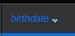

El Explorador de datos ofrece una interfaz web para ver, consultar y editar los datos del almacén de datos de su proyecto. Utilizando esta herramienta, puede navegar fácilmente entre todas sus entidades y buscar, ordenar o filtrar los valores de los atributos. Le ayuda a identificar rápidamente los problemas en cualquier paso del proceso de desarrollo, así como a controlar y editar los datos.


## Configuración

The Data Explorer relies on the [`WebAdmin`](webAdmin.md) web server component for the configuration and authentication settings.

- **configuration**: the Data Explorer configuration reuses the [`WebAdmin` web server settings](webAdmin.md#webadmin-settings),
- **authentication**: access to the Data Explorer is granted when the [session user is authenticated](webAdmin.md#authentication-and-session) and has the "WebAdmin" privilege. When the Data Explorer is accessed through the **Data Explorer** menu item (see below), an automatic authentication is provided.

> The Data Explorer access can be disabled using the [`.setAdminProtection()`](API/DataStoreClass.md#setadminprotection) function.

## Apertura del Explorador de datos

[The `WebAdmin` web server](webAdmin.md#starting-the-webadmin-web-server) is started automatically if necessary when the Data Explorer is clicked on.

Para conectarse a la página web del Explorador de datos:

- De una aplicación 4D (con interfaz):
  - To open a new 4D window with the Data Explorer page displayed in a web area, select **Data Explorer** in the **Records** menu or click on the **Data** button in the main toolbar.
  - To open the Data Explorer in an external browser tab, select **Data Explorer In Browser** in the **Records** menu or press the **Alt** key (Windows)/**Option** key (macOS) and click on the **Data** button in the main toolbar.

- From 4D Server, select **Data Explorer In Browser** in the **Window** menu (the Data Explorer can only be opened on an external browser).

- Tanto si utiliza una aplicación 4D sin interfaz como si no, puede abrir su navegador web e introducir la siguiente dirección:

`IPaddress:HTTPPort/dataexplorer`
or
`IPaddress:HTTPSPort/dataexplorer`

In this context, you will be prompted to enter the [access key](webAdmin.md#access-key) to open a `WebAdmin` session on the server:


> [HTTPPort](webAdmin.md#http-port) and [HTTPSPort](webAdmin.md#https-port) values are configured in the `WebAdmin` settings.

## Requisitos

El Explorador de datos es compatible con los siguientes navegadores web:

- Chrome
- Safari
- Edge
- FireFox

La resolución mínima para utilizar el Explorador de Datos es de 1280x720. La resolución recomendada es de 1920x1080.

## Navegando datos

Además de una vista completa y personalizable de sus datos, el Explorador de datos le permite consultar y ordenar sus datos.

### Básicos

The Data Explorer provides an overall access to the ORDA data model with respect to the [ORDA mapping rules](ORDA/dsMapping.md#general-rules).

:::info

Cuando el modelo ORDA o los datos se modifican del lado de la base de datos (se añade una tabla, se edita o se elimina un registro, etc.), basta con actualizar la página del Explorador de datos en el navegador (utilizando la tecla F5, por ejemplo).

:::

You can switch to the **dark mode** display theme using the selector at the bottom of the page:


La página contiene varias áreas:

- On the left side are the **Dataclasses area** and **Attributes area**, allowing you can select the dataclasses and attributes to display. Los atributos se ordenan según el orden de creación de la estructura subyacente. Las llaves primarias y los atributos indexados tienen un icono específico. Puede filtrar la lista de nombres de clases de datos y de atributos propuestos utilizando las áreas de búsqueda respectivas.
  

- The central part contains the **Search area** and the **Data grid** (list of entities of the selected dataclass). Cada columna de la cuadrícula representa un atributo del almacén de datos.
  - Por defecto, se muestran todas las entidades. Puede filtrar las entidades mostradas utilizando el área de búsqueda. Two query modes are available: [Query on attributes](#query-on-attributes) (selected by default), and the [Advanced query with expression](#advanced-query-with-expression). You select the query mode by clicking on the corresponding button (the **X** button allows you to reset the query area and thus stop filtering):
    
  - El nombre de la clase de datos seleccionada se añade como una pestaña encima de la cuadrícula de datos. Utilizando estas pestañas, puede cambiar entre las clases de datos que ya han sido seleccionadas. Puede eliminar una clase de datos referenciada haciendo clic en el icono "eliminar" situado a la derecha del nombre de la clase de datos.
  - Puede reducir el número de columnas desmarcando los atributos en la parte izquierda. También puede cambiar las columnas de la cuadrícula de datos utilizando arrastrar y soltar. You can click on a column header to [sort entities](#ordering-entities) according to its values (when possible).
  - Si una operación requiere mucho tiempo, se muestra una barra de progreso. You can stop the running operation at any moment by clicking on the red button:<br/>
    

- On the right side is the **Details area**: it displays the attribute values of the currently selected entity as well as **related data**, if any. You can browse between the entities of the dataclass by clicking the **First** / **Previous** / **Next** / **Last** links at the bottom of the area.
  - All attribute types are displayed, including pictures, objects (expressed in json) as well as [computed](../ORDA/ordaClasses.md#computed-attributes-1) and [alias](../ORDA/ordaClasses.md#alias-attributes-1) attributes.
  - Related data (many-to-one and one-to-many relations) can be displayed through expandable/collapsable areas:<br/>
    
  - **Ctrl+Click** (Windows) or **Command+Click** (macOS) on a related attribute name in the right side area displays the values of the attribute in an independant, floating area:<br/>
    

### Ordenar las entidades

Puede reordenar la lista de entidades mostrada según los valores de los atributos. Todos los tipos de atributos pueden utilizarse para una ordenación, excepto la imagen y el objeto.

- Haga clic en el encabezado de una columna para ordenar entidades de acuerdo a los valores de atributo correspondientes. Por defecto, la ordenación es ascendente. Haga clic dos veces para una ordenación descendente. A column used to sort entities is displayed with a small icon and its name is in _italics_.



- Puede ordenar los atributos en varios niveles. Por ejemplo, puede ordenar a los empleados por ciudad y luego por salario. To do that, hold down the **Shift** key and click sequentially on each column header to include in the sort order.

### Consultas basadas en atributos

En este modo, puede filtrar las entidades introduciendo los valores que desea encontrar (o excluir) en las áreas situadas arriba de la lista de atributos. Puede filtrar por uno o varios atributos. La lista de entidades se actualiza automáticamente cuando se digita.


Si introduce varios atributos, se aplica automáticamente un AND. For example, the following filter displays entities with _firstname_ attribute starting with "flo" AND _salary_ attribute value > 50000:


The **X** button allows you to remove entered attributes and thus stop filtering.

Existen diferentes operadores y opciones de consulta, según el tipo de datos del atributo.

> No se puede filtrar por atributos de imagen o de objeto.

#### Operadores numéricos

Con los atributos numéricos, de fecha y de hora, el operador "=" está seleccionado por defecto. Sin embargo, puede seleccionar otro operador de la lista de operadores (haga clic en el icono "=" para mostrar la lista):


#### Fechas

Con los atributos de fecha, puede introducir la fecha a utilizar a través de un widget de selección de fecha (haga clic en el área de la fecha para mostrar el calendario):


#### Booleanos

When you click on a boolean attribute area, you can filter on **true**/**false** values but also on **null**/**not null** values:


- **null** indicates that the attribute value was not defined
- **not null** indicates that the attribute value is defined (thus true or false).

#### Text

Los filtros texto no son diacríticos (a = A).

El filtro es del tipo "empieza por". Por ejemplo, al introducir "Jim" se mostrarán los valores "Jim" y "Jimmy".

También puede utilizar el carácter comodín (@) para sustituir uno o varios caracteres iniciales. Por ejemplo:

| Un filtro con       | Resultados                                                |
| ------------------- | --------------------------------------------------------- |
| Bel                 | Todos los valores que empiezan por "Bel"                  |
| @do    | Todos los valores que contienen "do"                      |
| Bel@do | Todos los valores que empiezan por "Bel" y contienen "do" |

Si desea crear consultas más específicas, como "es exactamente", es posible que tenga que utilizar la función de consultas avanzadas.

### Consultas avanzadas con expresión

Cuando se selecciona esta opción, aparece un área de consulta sobre la lista de entidades, que permite introducir cualquier expresión para filtrar el contenido:


Puede introducir consultas avanzadas que no están disponibles como consultas de atributos. For example, if you want to find entities with _firstname_ attribute containing "Jim" but not "Jimmy", you can write:

```
firstname=="Jim"
```

You can use any ORDA query expression as [documented with the `query()` function](API/DataClassClass.md#query), with the following limitations or differences:

- For security, you cannot execute formulas using `eval()`.
- Placeholders cannot be used; you have to write a _queryString_ with values.
- Los valores de las cadenas que contienen caracteres de espacio deben ir entre comillas dobles ("").

Por ejemplo, con la clase de datos Employee, puede escribir:

```
firstname = "Marie Sophie" AND manager.lastname = "@th"
```

You can click on the `v` icon to display both [`queryPlan`](API/DataClassClass.md#queryplan) and [`queryPath`](API/DataClassClass.md#querypath). En el área, puede pasar sobre los bloques de subconsultas para tener información detallada por subconsulta:


Haga clic derecho en el área de consulta para mostrar las anteriores consultas válidas:


## Edición de Datos

El Explorador de datos permite modificar los valores de los atributos y añadir o eliminar entidades. Esta función está destinada a los administradores, por ejemplo para probar implementaciones o solucionar problemas con datos inválidos.

### Allow editing

For security reasons, to be able to edit data through the Data Explorer, you first need to enable the editing mode using the **Allow editing** selector. Cuando está activado, los botones de acción de edición se muestran a la derecha:


This selector is enabled **per dataclass** and **per browser session**.

:::info

El selector está pensado para evitar modificaciones accidentales, ya que no se muestran diálogos de confirmación cuando se editan datos a través del Explorador de datos.

:::

### Ingresar valores

When the **Allow editing** selector is enabled for a dataclass, you can enter values for a new or selected entity through dedicated input widgets in the **Details** area for the selected dataclass.

Se pueden editar los siguientes valores de atributos escalares:

- text
- boolean
- numeric
- date
- time
- imagen (puede cargar o arrastrar y soltar una imagen)
- objeto (cadena JSON)

Los atributos de los blobs no pueden modificarse.

New or modified values are stored in the local cache, you need to [save them explicitely](#saving-modifications) to store them in the data.

### Creación de entidades

You can create a new, empty entity in the selected table by clicking on the creation button . You can then [enter values](#entering-values) for this entity.

The new entity is is kept in the local cache, you need to [save it explicitely](#saving-modifications) to store it in the data.

:::info

Los valores de los atributos que necesitan ser calculados por 4D (IDs, atributos calculados) serán devueltos sólo después de haber guardado la entidad.

:::

### Valores de recarga

The **reload** button  reloads the entity attribute values from the data file. Este botón es útil, por ejemplo, cuando desea asegurarse de que los valores mostrados son los valores guardados más recientes.

### Guardar modificaciones

Except for [deletion](#deleting-entities) (see below), entity modifications are done locally and need to be saved so that they are stored in the data file.

To save modifications or to save an entity you created in the Data Explorer, click on the **Save** button .

:::info

Las modificaciones en una entidad existente se guardan automáticamente cuando se selecciona otra entidad de la misma clase de datos.

:::

En caso de conflicto (por ejemplo, si otro usuario ha modificado el mismo valor de atributo en la misma entidad), aparecerá un mensaje de error en la parte inferior del Explorador de datos. You can click on the [**Reload** button](#reloading-values) to get the new value from the data and then, apply and save your modifications.

### Eliminación de entidades

You can delete entities by clicking on the **delete** button .

To delete a set of entities, select two or more entities in the list area using **Shift+click** (continuous selection) or **Ctrl/Command+click** (discontinuous selection) and click on the **delete** button.

:::note

Si algunas entidades no se han podido eliminar debido a un conflicto (por ejemplo, entidades bloqueadas en el servidor), aparecen resaltadas en la lista.

:::

:::caution

Al eliminar entidades no aparece ningún cuadro de diálogo de confirmación. Las entidades seleccionadas se eliminan inmediatamente de los datos.

:::
