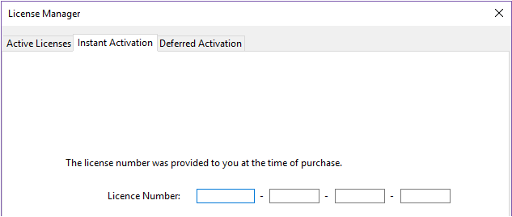
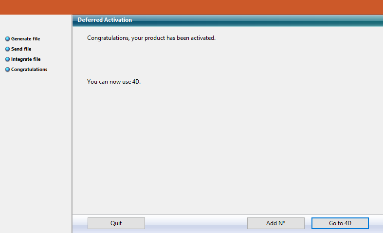
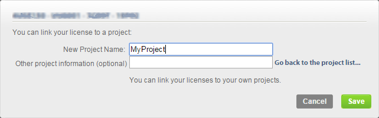

Una vez instalados en su disco, debe activar sus productos 4D para poder utilizarlos. Usually, the activation is automatic if you [sign in using your 4D account](GettingStarted/Installation.md) in the Welcome Wizard.

Sin embargo, en algunos casos específicos podría ser necesario activar las licencias manualmente, por ejemplo si:

- su configuración no permite la activación automática,
- ha adquirido licencias adicionales.

No es necesaria la activación para los siguientes usos:

- 4D utilizado en modo remoto (conexión a un 4D Server)
- 4D utilizado en modo local con un proyecto aplicación interpretado sin acceso al entorno Diseño.

## Primera activación

With 4D, select the **License Manager...** command from the **Help** menu of the application. Con 4D Server, basta con lanzar la aplicación 4D Server. The dialog box for choosing the [activation mode](#activation-mode) appears.

4D ofrece tres modos de activación. We recommend **Instant Activation**.

### Activación inmediata

Introduzca su identificación de usuario (correo electrónico o cuenta 4D) así como su contraseña. Si no tiene una cuenta de usuario, deberá crearla en la siguiente dirección:

[https://account.4d.com/us/login.shtml](https://account.4d.com/us/login.shtml)

A continuación, introduzca el número de licencia del producto que desea activar. Este número se facilita por correo electrónico o por correo tras la compra de un producto.

### Activación diferida

If you are unable to use [instant activation](#instant-activation) because your computer does not have internet access, please proceed to deferred activation using the following steps.

1. In the License Manager window, select the **Deferred Activation** tab.
2. Enter the License Number and your e-mail address, then click **Generate file** to create the ID file (_reg.txt_).

3. Save the _reg.txt_ file to a USB drive and take it to a computer that has internet access.
4. On the machine with internet access, login to [https://activation.4d.com](https://activation.4d.com).
5. On the Web page, click on the **Choose File...** button and select the _reg.txt_ file from steps 3 and 4; then click on the **Activate** button.
6. Descargue los archivos seriales.

7. Save the _license4d_ file(s) on a shared media and transfer them back to the 4D machine from step 1.
8. Now back on the machine with 4D, still on the **Deferred Activation** page, click **Next**; then click the **Load...** button and select a _license4d_ file from the shared media from step 7.

With the license file loaded, click on **Next**.

9. Click on the **Add N°** button to add another license. Repita estos pasos hasta que se hayan integrado todas las licencias del paso 6.

Su aplicación 4D está ahora activada.

### Activación de emergencia

Este modo puede utilizarse para una activación temporal especial de 4D (5 días como máximo) sin conectarse al sitio web de 4D. Esta activación sólo puede utilizarse una vez.

## Añadir las licencias

Puede añadir nuevas licencias, por ejemplo para ampliar las capacidades de su aplicación, en cualquier momento.

Choose the **License Manager...** command from the **Help** menu of the 4D or 4D Server application, then click on the **Refresh** button:

This button connects you to our customer database and automatically activates any new or updated licenses related to the current license (the current license is displayed in **bold** in the "Active Licenses" list). Sólo se le pedirá su cuenta de usuario y su contraseña.

- If you purchased additional expansions for a 4D Server, you do not need to enter any license number -- just click **Refresh**.
- En la primera activación de un 4D Server, basta con introducir el número de servidor y todas las expansiones adquiridas se asignan automáticamente.

You can use the **Refresh** button in the following contexts:

- Cuando haya comprado una expansión adicional y quiera activarla,
- Cuando necesite actualizar un número temporal caducado (Partners o evoluciones).

## 4D Online Store

En 4D Store, puede pedir, actualizar, extender y/o gestionar los productos 4D. You can reach the store at the following address: [https://store.4d.com/us/](https://store.4d.com/us/) (you will need to select your country).

Click **Login** to sign in using your existing account or **New Account** to create a new one, then follow the on-screen instructions.

### Gestión de licencias

After you log in, you can click on **License list** at the top right of the page:

Aquí puede gestionar sus licencias asignándolas a proyectos.

Select the appropriate license from the list then click **Link to a project... >**:

Puede seleccionar un proyecto existente o crear uno nuevo:

Puede utilizar los proyectos para organizar sus licencias según sus necesidades:

## Solución de problemas

Si el proceso de instalación o activación falla, compruebe la siguiente tabla, en la que se indican las causas más comunes de mal funcionamiento:

| Síntomas                                                                                               | Causas posibles                                                    | Solución(es)                                                                                                                                                     |
| ------------------------------------------------------------------------------------------------------ | ------------------------------------------------------------------ | ----------------------------------------------------------------------------------------------------------------------------------------------------------------------------------- |
| Imposible descargar el producto desde el sitio web de 4D                                               | Sitio de Internet no disponible, aplicación antivirus, cortafuegos | 1- Inténtelo de nuevo más tarde O 2- Desactive temporalmente su aplicación antivirus o su cortafuegos.                                                              |
| Imposible instalar el producto en el disco (instalación rechazada). | Derechos de acceso de usuario insuficientes                        | Abra una sesión con derechos de acceso que le permitan instalar aplicaciones (acceso administrador)                                                              |
| Fallo de activación en línea                                                                           | Aplicación antivirus, cortafuegos, proxy                           | 1- Desactivar temporalmente su aplicación antivirus o su cortafuegos O 2- Utilizar la activación diferida (no disponible con las licencias de las versiones "R") |

Si esta información no le ayuda a resolver su problema, contacte 4D o a su distribuidor local.

## Contactos

Para cualquier pregunta sobre la instalación o activación de su producto, póngase en contacto con 4D, Inc. o con su distribuidor local.

Para US:

- Web: [https://us.4d.com/4d-technical-support](https://us.4d.com/4d-technical-support)
- Tel: 1-408-557-4600

Para UK:

- Web: [https://uk.4d.com/4d-technical-support](https://uk.4d.com/4d-technical-support)
- Teléfono: 01625 536178
