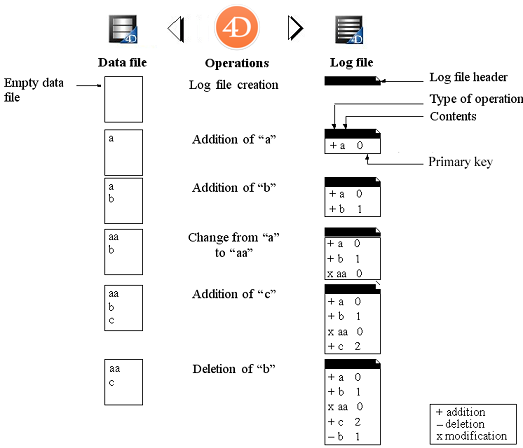

Una aplicación de uso continuo siempre está registrando cambios, adiciones o supresiones. Realizar copias de seguridad periódicas de los datos es importante, pero no permite (en caso de incidente) restaurar los datos introducidos desde la última copia de seguridad. Para responder a esta necesidad, 4D ofrece ahora una herramienta específica: el archivo de historial. Este archivo permite garantizar la seguridad permanente de los datos.

Además, 4D trabaja continuamente con una caché de datos en la memoria. Esto acelera el funcionamiento de las aplicaciones; de hecho, el acceso a la memoria es más rápido que el acceso al disco duro. Todos los cambios realizados en los datos de la aplicación se almacenan temporalmente en la caché antes de escribirse en el disco duro. Si se produce un incidente en la aplicación antes de que los datos almacenados en la caché puedan escribirse en el disco, deberá incluir el archivo de historial actual para poder recuperar la aplicación por completo.

Por último, 4D dispone de funciones que analizan el contenido del archivo de historial, permitiendo revertir las operaciones realizadas sobre los datos de la aplicación. These functions area available in the MSC: refer to the [Activity analysis](MSC/analysis.md) page and the [Rollback](MSC/rollback.md) page.

## Funcionamiento del archivo de historial

El archivo de historial generado por 4D contiene una descripción de todas las operaciones realizadas en los datos de las tablas registradas en el diario, que se registran de forma secuencial. By default, all the tables are journaled, i.e. included in the log file, but you can deselect individual tables using the **Include in Log File** table property.

Así, cada operación realizada por un usuario provoca dos acciones simultáneas: la primera en el archivo de datos (la instrucción se ejecuta normalmente) y la segunda en el archivo de historial (se registra la descripción de la operación). El archivo de historial se crea de forma independiente, sin perturbar ni ralentizar el trabajo del usuario. El archivo de historial se crea de forma independiente, sin perturbar ni ralentizar el trabajo del usuario. El archivo de historial registra los siguientes tipos de acciones:

- Apertura y cierre del archivo de datos,
- Apertura y cierre del proceso (contextos),
- Adición de registros o BLOBs,
- Modificación de registros,
- Eliminación de registros,
- Creación y cierre de transacciones.

For more information about these actions, refer to the [Activity analysis](MSC/analysis.md) page of the MSC.

4D gestiona el archivo de historial. Tiene en cuenta todas las operaciones que afectan al archivo de datos por igual, independientemente de las manipulaciones realizadas por un usuario, métodos 4D, el motor SQL, los plug-ins, o un navegador web o una aplicación móvil.

La siguiente ilustración resume el funcionamiento del archivo de historial:

El archivo de historial actual se guarda automáticamente con el archivo de datos actual. Este mecanismo tiene dos ventajas distintas:

- Evitar la saturación del volumen de disco donde se almacena el archivo de historial. Sin una copia de seguridad, el archivo de historial se haría cada vez más grande con el uso, y acabaría utilizando todo el espacio disponible en el disco. Para cada copia de seguridad del archivo de datos, 4D o 4D Server cierra el archivo de historial actual e inmediatamente inicia un nuevo archivo vacío, evitando así el riesgo de saturación. A continuación, el archivo de historial antiguo se archiva y, finalmente, se destruye en función del mecanismo de gestión de los conjuntos de copias de seguridad.
- Conservar los archivos de historial correspondientes a las copias de seguridad para poder analizar o reparar una aplicación en un momento posterior. La integración de un archivo de historial sólo puede hacerse en la aplicación a la que corresponde. Para poder integrar correctamente un archivo de historial en una copia de seguridad, es importante que las copias de seguridad y los archivos de historial se archiven simultáneamente.

## Crear el archivo de historial

By default, any application project created with 4D uses a log file (option set in the **General** page of the Preferences). The log file is named _data.journal_ and is placed in the Data folder.

You can find out if your application uses a log file at any time: just check whether the **Use Log** option is selected on the **Backup/Configuration** page of the Settings. Si deselecciona esta opción, o si utiliza una aplicación sin archivo de historial y desea configurar una estrategia de copia de seguridad con un archivo de historial, tendrá que crear uno.

Para crear un archivo de historial:

1. On the **Backup/Configuration** page of the Structure Settings, check the **Use Log** option.
   El programa muestra una caja de diálogo estándar de abrir/nuevo archivo. By default, the log file is named _data.journal_.

2. Mantenga el nombre por defecto o cambie el nombre, y luego seleccione la ubicación del archivo.
   Si tiene al menos dos discos duros, se recomienda colocar el archivo de historial en un disco distinto al que contiene el proyecto de aplicación. Si se pierde el disco duro de la aplicación, aún puede recuperar su archivo de historial.

3. Presione **Guardar**.
   The disk and the name of the open log file are now displayed in the **Use Log** area of the dialog box. Puede hacer clic en esta área para que aparezca un menú emergente con la ruta del historial en el disco.

4. Valide la caja de diálogo de las Propiedades.

Para poder crear directamente un archivo de historial, los datos deben estar en una de las siguientes situaciones:

- El archivo de datos está en blanco,
- Acaba de realizar una copia de seguridad y aún no se han realizado cambios en los datos.

Si hace clic en <strong x-id="1">Aceptar</strong>, la copia de seguridad comienza inmediatamente, y luego se activa el archivo de historial. If you click **OK**, the backup begins immediately, then the log file is activated. If you click **Cancel**, the request is saved but the creation of the log file is postponed and it will actually be created only after the next backup of the application. Esta precaución es indispensable porque, para restaurar una aplicación después de algún incidente, necesitará una copia de la aplicación en la que se integrarán las operaciones registradas en el archivo de historial.

Sin tener que hacer nada más, todas las operaciones realizadas sobre los datos se registran en este archivo y se utilizarán en el futuro cuando se abra la aplicación.

Debe crear otro archivo de historial si crea un nuevo archivo de datos. Debe establecer o crear otro archivo de historial si abre otro archivo de datos que no está asociado a un archivo de historial (o si falta el archivo de historial).

## Parámetros del archivo de historial

The [log file settings](settings.md#log-file-management) are based on two pieces of information: a boolean value and a path.

1. **Boolean Value**: indicating whether the "Use Log File" feature is enabled or disabled within the application. By default, the boolean value is stored in _catalog.4DCatalog_. However, when the [user settings](../Desktop/user-settings.md) are activated, the _catalog.4DCatalog_ file configuration is overriden, and the boolean value can then be set either in the _Backup.4DSettings_ file [next to the data file](../Project/architecture.md#settings-user-data) or the _Backup.4DSettings_ file [in the project folder](../Project/architecture.md#settings-user) (see also the `JournalFileEnabled` xml backup key documentation on [doc.4d.com](https://doc.4d.com)).

2. **Path**: a string pointing to where the log file is located. La ruta del archivo de registro siempre se almacena en el archivo de datos vinculados.

## Cerrar el historial

If you would like to stop logging operations to the current log file, simply deselect the **Use Log** option on the **Backup/Configuration** page of the Settings.

4D muestra entonces un mensaje de alerta para recordarle que esta acción le impide aprovechar la seguridad que ofrece el archivo de historial:

If you click **Stop**, the current log file is immediately closed (the Settings dialog box does not need to be validated afterwards).

Si desea cerrar el archivo de historial actual porque es demasiado grande, puede considerar la posibilidad de realizar una copia de seguridad del archivo de datos, lo que hará que el archivo de historial se copie también.

> **4D Server:** The `New log file` command automatically closes the current log file and starts a new one.
> Si por alguna razón el archivo de historial no está disponible durante una sesión de trabajo, se genera el error 1274 y 4D Server no permite a los usuarios escribir más datos. Cuando el archivo de historial está disponible de nuevo, es necesario hacer una copia de seguridad.
