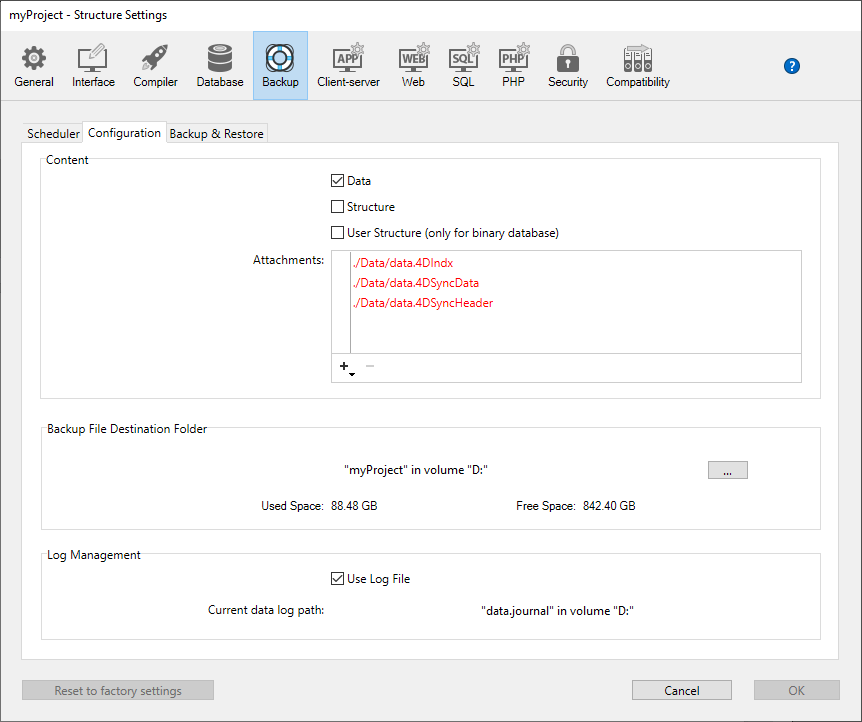
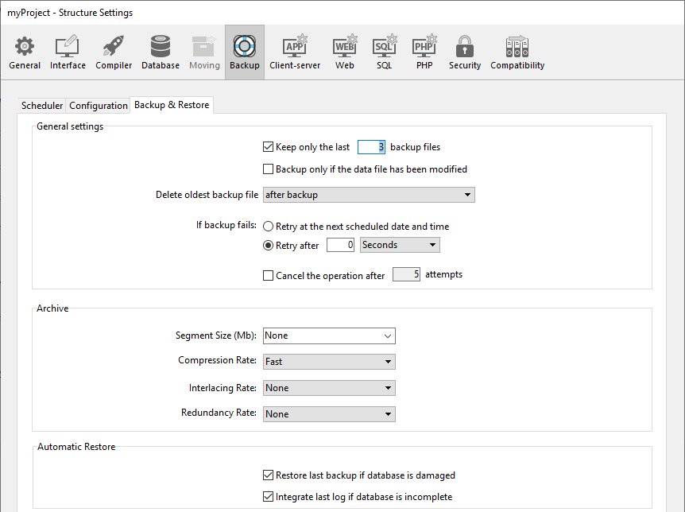

Backup settings are defined through three pages in the [Settings dialog box](../settings/overview.md). Puede definir:

- la periodicidad de las copias de seguridad automáticas
- los archivos a incluir en cada copia de seguridad
- las funcionalidades avanzadas permiten ejecutar tareas automáticas

> Settings defined in this dialog box are written in the _Backup.4DSettings_ file, stored in the [Settings folder](Project/architecture.md#settings-folder).

## Backups periódicos

Puede automatizar la copia de seguridad de las aplicaciones abiertas con 4D o 4D Server (incluso cuando no hay máquinas cliente conectadas). Esto implica definir una frecuencia de copia de seguridad (en horas, días, semanas o meses); para cada sesión, 4D inicia automáticamente una copia de seguridad utilizando la configuración de copia de seguridad actual.

If this application was not launched at the theoretical moment of the backup, the next time 4D is launched, it considers the backup as having failed and proceeds as set in the Settings (refer to [Handling backup issues](backup.md#handling-backup-issues)).

The scheduler backup settings are defined on the **Backup/Scheduler** page of the Structure Settings:

Las opciones que se encuentran en esta pestaña le permiten establecer y configurar las copias de seguridad periódicas automáticas de la aplicación. Puede elegir una configuración rápida estándar o puede personalizarla completamente. Various options appear depending on the choice made in the **Automatic Backup** menu:

- **Never**: The scheduled backup feature is disabled.
- **Every Hour**: Programs an automatic backup every hour, starting with the next hour.
- **Every Day**: Programs an automatic backup every day. A continuación, puede introducir la hora a la que debe comenzar la copia de seguridad.
- **Every Week**: Programs an automatic backup every week. Dos áreas de entrada adicionales le permiten indicar el día y la hora en que debe comenzar la copia de seguridad.
- **Every Month**: Programs an automatic backup every month. Dos áreas de entrada adicionales le permiten indicar el día del mes y la hora en que debe comenzar la copia de seguridad.
- **Personalized**: Used to configure "tailormade" automatic backups. Al seleccionar esta opción, aparecen varias áreas de entrada adicionales:
  - **Every X hour(s)**: Allows programming backups on an hourly basis. Puede introducir un valor entre 1 y 24.
  * **Every X day(s) at x**: Allows programming backups on a daily basis. Por ejemplo, introduzca 1 si desea realizar una copia de seguridad diaria. Cuando esta opción está marcada, debe introducir la hora a la que debe comenzar la copia de seguridad.
  * **Every X week(s) day at x**: Allows programming backups on a weekly basis. Introduzca 1 si desea realizar una copia de seguridad semanal. Cuando esta opción está marcada, debe introducir el día(s) de la semana y la hora que debe comenzar la copia de seguridad. Si lo desea, puede seleccionar varios días de la semana. Por ejemplo, puede utilizar esta opción para definir dos copias de seguridad semanales: una el miércoles y otra el viernes.
  * **Every X month(s), Xth Day at x**: Allows programming backups on a monthly basis. Introduzca 1 si desea realizar una copia de seguridad mensual. Cuando esta opción está marcada, debe indicar el día de cada mes y la hora a la cual debe comenzar la copia de seguridad.

> Los cambios de la hora estándar a la hora de verano podrían afectar temporalmente al programador automático y activar la siguiente copia de seguridad con un cambio de hora de una hora. Esto ocurre sólo una vez y las siguientes copias de seguridad se ejecutan a la hora prevista.

## Configuración

La página Copia de seguridad/Configuración de las Propiedades permite designar los archivos de copia de seguridad y su ubicación, así como la del archivo de historial. Estos parámetros son específicos de cada aplicación abierta por 4D o 4D Server.

> **4D Server:** These parameters can only be set from the 4D Server machine.

### Contenido

Esta área le permite determinar qué archivos y/o carpetas deben copiarse durante la siguiente copia de seguridad.

- **Data**: Application data file. Cuando esta opción está marcada, los siguientes elementos se copian automáticamente al mismo tiempo que los datos:
  - el archivo de historial actual de la aplicación (si existe),
  - the full `Settings` folder located [next to the data file](Project/architecture.md#settings-folder) (if it exists), i.e. the _user settings for data_.
- **Structure**: Application project folders and files. En el caso de proyectos compilados, esta opción permite hacer una copia de seguridad del archivo .4dz. When this option is checked, the full `Settings` folder located [at the same level as the Project folder](Project/architecture.md#settings-folder-1), i.e. the _user settings_, is automatically backed up.
- **User Structure File (only for binary database)**: _deprecated feature_
- **Attachments**: This area allows you to specify a set of files and/or folders to be backed up at the same time as the application. Estos archivos pueden ser de cualquier tipo (documentos o plantillas de plug-ins, etiquetas, informes, imágenes, etc.). Puede definir archivos individuales o carpetas cuyo contenido se respaldará completamente. Cada elemento adjunto aparece con su ruta de acceso completa en el área "Adjuntos ".
  - **Delete**: Removes the selected file from the list of attached files.
  - **Add folder...**: Displays a dialog box that allows selecting a folder to add to the backup. En el caso de una restitución, la carpeta se recuperará con su estructura interna. Puede seleccionar toda carpeta o volumen conectado a la máquina, a excepción de la carpeta que contiene los archivos de la aplicación.
  - **Add file...**: Displays a dialog box that allows you to select a file to add to the backup.

### Carpeta de destino del archivo de copia de seguridad

Esta área le permite visualizar y cambiar la ubicación en la que se almacenarán los archivos de copia de seguridad, así como los archivos de copia de seguridad del archivo historial (si procede).

Para ver la ubicación de los archivos, haga clic en el área para que aparezca su ruta de acceso en un menú emergente.

To modify the location where these files are stored, click the **...** button. Aparece una caja de diálogo de selección, que permite seleccionar la carpeta o el disco donde se colocarán las copias de seguridad. Las áreas "Espacio utilizado" y "Espacio libre" se actualizan automáticamente e indican el espacio restante en el disco de la carpeta seleccionada.

### Gestión del archivo de historial

The **Use Log File** option, when checked, indicates that the application uses a log file. La ruta del archivo de historial para el archivo de datos actual se especifica debajo de la opción. Cuando esta opción está marcada, no es posible abrir la aplicación sin un archivo de historial. For more information about the log file, please refer to [log file](log.md)

By default, any project created with 4D uses a log file (option **Use Log File** checked in the **General Page** of the **Preferences**). The log file is named _data.journal_ and is placed in the Data folder.

> La activación de un nuevo archivo de historial requiere una copia de seguridad previa de los datos de la aplicación. Si marca esta opción para el archivo de datos utilizado actualmente, un mensaje de advertencia le informará de que es necesario realizar una copia de seguridad. La creación del archivo de historial se pospone y se creará realmente sólo después de la siguiente copia de seguridad de la aplicación.

## Copia de seguridad y restauración

La modificación de las opciones de copia de seguridad y restauración es opcional. Sus valores por defecto corresponden a un uso estándar de la función.

### Parámetros generales

- **Keep only the last X backup files**: This parameter activates and configures the mechanism used to delete the oldest backup files, which avoids the risk of saturating the disk drive. Esta funcionalidad opera de la siguiente manera: una vez finalizado el backup actual, 4D elimina el archivo más antiguo si se encuentra en la misma ubicación que el archivo del que se está haciendo el backup y tiene el mismo nombre (puede solicitar que el archivo más antiguo se elimine antes del backup para ahorrar espacio).
  Si, por ejemplo, el número de conjuntos se define en 3, las tres primeras copias de seguridad crean los archivos MyBase-0001, MyBase-0002 y MyBase-0003 respectivamente. Durante la cuarta copia de seguridad, se crea el archivo MyBase-0004 y se elimina MyBase-0001. Por defecto, el mecanismo de eliminación de conjuntos está activado y 4D guarda 3 conjuntos de copia de seguridad.
  Para desactivar el mecanismo, basta con deseleccionar la opción.

> Este parámetro se refiere tanto a las copias de seguridad de la aplicación como de los archivos del historial.

- **Backup only if the data file has been modified**: When this option is checked, 4D starts scheduled backups only if data has been added, changed or deleted since the last backup. De lo contrario, la copia de seguridad programada se cancela y se pospone hasta la siguiente copia de seguridad programada. No se genera ningún error; sin embargo, el diario de copias de seguridad señala que la copia de seguridad se ha pospuesto. Esta opción también permite ahorrar tiempo de máquina para la copia de seguridad de las aplicaciones utilizadas principalmente para su visualización. Tenga en cuenta que al activar esta opción no se tienen en cuenta las modificaciones realizadas en los archivos de estructura o en los archivos adjuntos.

> Este parámetro se refiere tanto a las copias de seguridad de la aplicación como de los archivos del historial.

- **Delete oldest backup file before/after backup**: This option is only used if the "Keep only the last X backup files" option is checked. It specifies whether 4D should start by deleting the oldest archive before starting the backup (**before** option) or whether the deletion should take place once the backup is completed (**after** option). Para que este mecanismo funcione, el archivo más antiguo no debe haber sido renombrado o movido.

- **If backup fails**: This option allows setting the mechanism used to handle failed backups (backup impossible). Cuando no se puede realizar una copia de seguridad, 4D le permite realizar un nuevo intento.
  - **Retry at the next scheduled date and time**: This option only makes sense when working with scheduled automatic backups. Equivale a anular la copia de seguridad fallida. Se genera un error.
  - **Retry after X second(s), minute(s) or hour(s)**: When this option is checked, a new backup attempt is executed after the wait period. Este mecanismo permite anticipar ciertas circunstancias que pueden bloquear la copia de seguridad. Puede establecer un periodo de espera en segundos, minutos u horas utilizando el menú correspondiente. Si el nuevo intento también falla, se genera un error y se anota el fallo en el área de estado de la última copia de seguridad y en el archivo del diario de copias de seguridad.
  - **Cancel the operation after X attempts**: This parameter is used to set the maximum number of failed backup attempts. Si la copia de seguridad no se ha realizado con éxito una vez alcanzado el número máximo de intentos establecido, se cancela y se genera el error 1401 ("Se ha alcanzado el número máximo de intentos de copia de seguridad; la copia de seguridad automática está temporalmente desactivada"). En este caso, no se intentará realizar una nueva copia de seguridad automática mientras no se haya reiniciado la aplicación o se haya realizado con éxito una copia de seguridad manual.
    Este parámetro es útil para evitar un caso en el que un problema prolongado (que requiera la intervención humana) que impidiera la realización de una copia de seguridad hubiera llevado a la aplicación a intentar repetidamente la copia de seguridad en detrimento de su rendimiento general. Por defecto, este parámetro no está seleccionado.

> 4D considera que una copia de seguridad ha fallado si la aplicación no se ha iniciado en el momento en que se ha programado la realización de la copia de seguridad automática.

### Archivo

Estas opciones se aplican a los archivos de copia de seguridad principales y a los archivos de copia de seguridad del historial.

- **Segment Size (Mb)**
  4D allows you to segment archives, i.e., to cut it up into smaller sizes. Este funcionamiento permite, por ejemplo, almacenar una copia de seguridad en varios discos diferentes (DVD, dispositivos usb, etc.). Durante la restauración, 4D fusionará automáticamente los segmentos. Cada segmento se llama MyApplication[xxxx-yyyy].4BK, donde xxxx es el número de copia de seguridad e yyyy es el número de segmento. Por ejemplo, los tres segmentos de la copia de seguridad de la base MyApplication se llaman MyApplication[0006-0001].4BK, MyApplication[0006-0002].4BK y MyApplication[0006-0003].4BK.
  The **Segment Size** menu is a combo box that allows you to set the size in MB for each segment of the backup. Puede elegir uno de los tamaños preestablecidos o introducir un tamaño específico entre 0 y 2048. If you pass 0, no segmentation occurs (this is the equivalent of passing **None**).

- **Compression Rate**
  By default, 4D compresses backups to help save disk space. Sin embargo, la fase de compresión de archivos puede ralentizar notablemente las copias de seguridad cuando se trata de grandes volúmenes de datos. The **Compression Rate** option allows you to adjust file compression:
  - **None:** No file compression is applied. La copia de seguridad es más rápida, pero los archivos son considerablemente más grandes.
  - **Fast** (default): This option is a compromise between backup speed and archive size.
  - **Compact**: The maximum compression rate is applied to archives. Los ficheros de archivos ocupan el menor espacio posible en el disco, pero la copia de seguridad se ralentiza notablemente.

- **Interlacing Rate and Redundancy Rate**
  4D generates archives using specific algorithms that are based on optimization (interlacing) and security (redundancy) mechanisms. Puedes configurar estos mecanismos en función de sus necesidades. The menus for these options contain rates of **Low**, **Medium**, **High** and **None** (default).
  - **Interlacing Rate**: Interlacing consists of storing data in non-adjacent sectors in order to limit risks in the case of sector damage. Cuanto mayor sea la tasa, mayor será la seguridad; sin embargo, el procesamiento de datos utilizará más memoria.
  - **Redundancy Rate**: Redundancy allows securing data present in a file by repeating the same information several times. Cuanto mayor sea la tasa de redundancia, mayor será la seguridad de los archivos; sin embargo, el almacenamiento será más lento y el tamaño de los archivos aumentará en consecuencia.

### Restauración automática e integración de registros

- **Restore last backup if database is damaged**: When this option is checked, the program automatically starts the restore of the data file of the last valid backup of the application, if an anomaly is detected (corrupted file, for example) during application launch. No se requiere ninguna intervención por parte del usuario; sin embargo, la operación se registra en el diario de copias de seguridad.

- **Integrate the latest logs if the database is incomplete**: When this option is checked, the program automatically integrates the current log file if it contains operations that are not present in the data file. Si existe una secuencia válida de archivos .journal en el mismo repositorio, el programa integra de antemano todos los archivos .journal necesarios desde el más antiguo hasta el más actual.

  Esta situación se produce, por ejemplo, si se produce un corte de corriente cuando hay operaciones en la caché de datos que aún no se han escrito en el disco, o después de que se haya detectado una anomalía al abrir el archivo de datos y se haya producido una restauración.

  :::note

  Esta funcionalidad implica que el programa analiza todos los archivos de registro de la carpeta de archivos de registro actual al iniciarse. Por lo tanto, por razones de rendimiento, asegúrese de que no hay archivos de registro inútiles almacenados en la carpeta.

  :::

El usuario no ve ninguna caja de diálogo; la operación es completamente automática. El objetivo es facilitar al máximo su uso. La operación se registra en el diario de copias de seguridad.

> En el caso de una restauración automática, sólo se restauran los siguientes elementos:
>
> - archivo .4DD
> - archivo .4DIndx
> - archivo .4DSyncData
> - archivo .4DSyncHeader
> - Carpeta External Data
>
> If you wish to get the attached files or the project files, you must perform a [manual restore](restore.md#manually-restoring-a-backup-standard-dialog).

:::caution

If the [data file is encrypted](../MSC/encrypt.md), make sure you [saved the data encryption key](../MSC/encrypt#saving-the-encryption-key) in a `.4DKeyChain` file stored at the first level of the drive, so that 4D can access it if the automatic restore feature triggered. De lo contrario, se devolverá un error durante la secuencia de restauración.

:::
