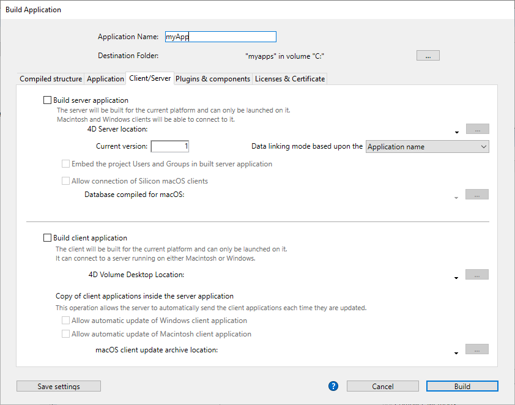
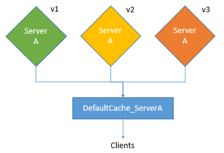
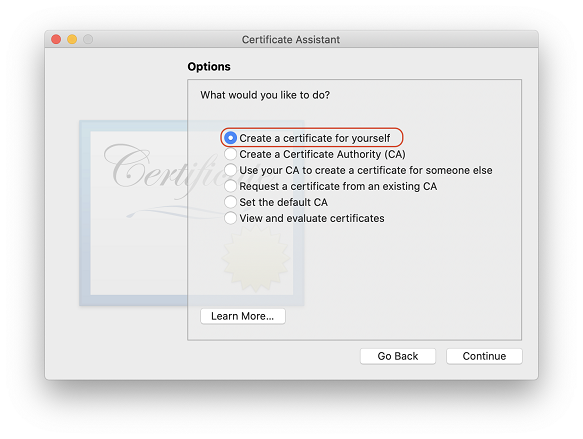
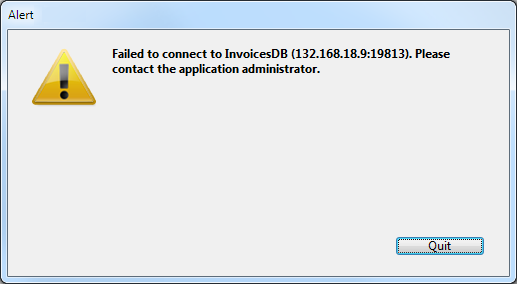

4D incluye un generador de aplicaciones para crear un paquete de proyecto (versión final). Este generador simplifica el proceso de finalización y despliegue de las aplicaciones compiladas en 4D. Maneja automáticamente las funcionalidades específicas de los distintos sistemas operativos y facilita el despliegue de aplicaciones cliente-servidor.

El generador de aplicaciones le permite:

- Build a compiled structure or component, without interpreted code,
- Build a stand-alone, double-clickable application, _i.e._, merged with 4D Volume Desktop, the 4D database engine,
- Generar diferentes aplicaciones a partir de la misma estructura compilada mediante un proyecto XML,
- Generar aplicaciones cliente-servidor homogéneas,
- Generar aplicaciones cliente-servidor con actualización automática de los componentes del cliente y del servidor.
- Save your build settings for future use (_Save settings_ button).

> Compiled applications are based upon [.4dz files](#build-compiled-structure) that are **read-only**. Keep in mind that using commands or functions that modify the source files (such as `CREATE INDEX` or `CREATE TABLE` (SQL)) is not possible by default in compiled applications. However, you can build specific applications that support local modifications by using the `PackProject` XML key (see [doc.4d.com](https://doc.4d.com)).

## Generalidades

Generar un paquete de proyecto puede realizarse utilizando:

- either the [`BUILD APPLICATION`](https://doc.4d.com/4dv20/help/command/en/page871.html) command,
- or the [Build Application dialog](#application-builder).

:::tip

You can also download and use [`Build4D`](https://github.com/4d-depot/Build4D), a component that provides classes to compile, build, and sign 4D projects, even from a headless application.

:::

### Diálogo crear aplicación

To display the Build application dialog, select **Design** > **Build Application...** from the menu bar.


La caja de diálogo del generador de aplicaciones incluye varias páginas a las que se puede acceder mediante pestañas:


La generación sólo puede efectuarse una vez compilado el proyecto. Si selecciona este comando sin haber compilado previamente el proyecto, o si el código compilado no se corresponde con el código interpretado, aparece una caja de diálogo de advertencia que indica que el proyecto debe ser (re)compilado.

### buildApp.4DSettings

Each build application parameter is stored as an XML key in the application project file named `buildApp.4DSettings` XML file, located in the [`Settings` folder of the project](../Project/architecture.md#settings-1).

Los parámetros por defecto se utilizan la primera vez que se utiliza la caja de diálogo del Generador de aplicaciones. The contents of the project file are updated, if necessary, when you click **Build** or **Save settings**. You can define several other XML settings file for the same project and employ them using the [BUILD APPLICATION](https://doc.4d.com/4dv19/help/command/en/page871.html) command.

Las llaves XML ofrecen opciones adicionales a las que se muestran en la caja de diálogo del Generador de aplicaciones. The description of these keys are detailed in the [4D XML Keys BuildApplication](https://doc.4d.com/4Dv19/4D/19/4D-XML-Keys-BuildApplication.100-5447429.en.html) manual.

### Archivo de historial

When an application is built, 4D generates a log file named _BuildApp.log.xml_ in the **Logs** folder of the project. El archivo de historial almacena la siguiente información para cada generación:

- El inicio y el fin de la generación de objetivos,
- El nombre y la ruta de acceso completa de los archivos generados,
- La fecha y la hora de la generación,
- Todos los errores que se han producido,
- Todo problema de firma (por ejemplo, un plug-in no firmado).

La verificación de este archivo puede ayudarle a ahorrar tiempo durante los siguientes pasos de despliegue, por ejemplo, si tiene la intención de notarizar su aplicación.

> Use the `Get 4D file(Build application log file)` command to get the log file location.

## Nombre de la aplicación y carpeta de destino


Enter the name of the application in **Application Name**.

Specify the folder for the built application in **Destination Folder**. If the specified folder does not already exist, 4D will create a _Build_ folder for you.

## Página de estructura compilada

Esta pestaña le permite generar un archivo de estructura compilado estándar y/o un componente compilado:


### Generar una estructura compilada

Genera una aplicación que sólo contiene código compilado.

This feature creates a _.4dz_ file within a `Compiled Database/<project name>` folder. Por ejemplo, si ha llamado a su aplicación "MyProject", 4D creará:

`<destination>/Compiled Database/MyProject/MyProject.4dz`

Un archivo .4dz es esencialmente una versión comprimida (empaquetada) de la carpeta del proyecto. Un archivo .4dz es esencialmente una versión comprimida (empaquetada) de la carpeta del proyecto. El tamaño compacto y optimizado de los archivos .4dz hace que los paquetes de proyectos sean fáciles de desplegar.

> When generating .4dz files, 4D uses a **standard** zip format by default. La ventaja de este formato es que es fácilmente legible por cualquier herramienta unzip. If you do not want to use this standard format, add the `UseStandardZipFormat` XML key with value `False` in your [`buildApp.4DSettings`](#build-application-settings) file (for more information, see the [4D XML Keys BuildApplication](https://doc.4d.com/4Dv19/4D/19/4D-XML-Keys-BuildApplication.100-5447429.en.html) manual).

#### Incluir las carpetas asociadas

When you check this option, any folders related to the project are copied into the Build folder as _Components_ and _Resources_ folders. For more information about these folders, refer to the [description of project architecture](Project/architecture.md).

### Generar un componente

Genera un componente compilado a partir de la estructura.

A [component](../Extensions/develop-components.md) is a standard 4D project in which specific functionalities have been developed. Once the component has been configured and [installed in another 4D project](../Project/components.md) (the host application project), its functionalities are accessible from the host project.

If you have named your application, _MyComponent_, 4D will create a _Components_ folder containing _MyComponent.4dbase_ folder:

`<destination>/Components/MyComponent.4dbase/MyComponent.4DZ`.

The _MyComponent.4dbase_ folder contains:

- archivo _MyComponent.4DZ_
- A _Resources_ folder - any associated Resources are automatically copied into this folder. Los otros componentes y/o carpetas de plugins no se copian (un componente no puede utilizar plugins u otros componentes).

The _MyComponent.4dbase_ folder is the [package folder of the compiled component](../Project/components.md).

## Página Application

Esta pestaña le permite crear una versión autónoma y monopuesto de su aplicación:


### Crear una aplicación autónoma

Checking the **Build stand-alone Application** option and clicking **Build** will create a stand-alone (double-clickable) application directly from your application project.

Los siguientes elementos son necesarios para la creación:

- 4D Volume Desktop (el motor de la base de datos 4D),
- an [appropriate license](#licenses)

En Windows, esta función crea un archivo ejecutable (.exe). En macOS, se encarga de la creación de paquetes de software.

El principio consiste en fusionar un archivo de estructura compilado con 4D Volume Desktop. Las funcionalidades ofrecidas por el archivo 4D Volume Desktop están relacionadas con la oferta de productos a la que se ha suscrito. For more information about this point, refer to the sales documentation and to the [4D Store](http://www.4d.com/).

You can define a default data file or allow users to [create and use their own data file](#management-of-data-files).

It is possible to [automate the update of merged single-user applications](#automatic-updating-of-server-or-single-user-applications) by means of a sequence of language commands.

#### Ubicación de 4D Volume Desktop

Para crear una aplicación autónoma, primero debe designar la carpeta que contiene el archivo 4D Volume Desktop:

- _Windows_ - the folder contains the 4D Volume Desktop.4DE, 4D Volume Desktop.RSR, as well as various files and folders required for its operation. Estos elementos deben colocarse al mismo nivel que la carpeta seleccionada.
- _macOS_ - 4D Volume Desktop is provided in the form of a structured software package containing various generic files and folders.

To select the 4D Volume Desktop folder, click on the **[...]** button. Aparece una caja de diálogo que le permite designar la carpeta de 4D Volume Desktop (Windows) o el paquete (macOS).

Una vez seleccionada la carpeta, se muestra su ruta completa y, si realmente contiene 4D Volume Desktop, se activa la opción de generación de una aplicación ejecutable.

> El número de versión de 4D Volume Desktop debe coincidir con el número de versión de 4D Developer Edition. Por ejemplo, si utiliza 4D Developer v18, debe seleccionar un 4D Volume Desktop v18.

#### Modo de enlace de datos

Esta opción permite elegir el modo de enlace entre la aplicación fusionada y el archivo de datos local. Hay dos modos de enlazar disponibles:

- **By application name** (default) - The 4D application automatically opens the most recently opened data file corresponding to the structure file. Esto le permite mover el paquete de aplicaciones libremente en el disco. Esta opción debería usarse generalmente para aplicaciones fusionadas, a menos que necesite específicamente duplicar su aplicación.

- **By application path** - The merged 4D application will parse the application's _lastDataPath.xml_ file and try to open the data file with an "executablePath" attribute that matches the application's full path. Si se encuentra una entrada de este tipo, se abre su correspondiente archivo de datos (definido a través de su atributo "dataFilePath"). Si se encuentra una entrada de este tipo, se abre su correspondiente archivo de datos (definido a través de su atributo "dataFilePath").

For more information about the data linking mode, refer to the [Last data file opened](#last-data-file-opened) section.

#### Archivos generados

When you click on the **Build** button, 4D automatically creates a **Final Application** folder in the specified **Destination Folder**. Dentro de la carpeta Final Application hay una subcarpeta con el nombre de la aplicación especificada.

Si ha especificado "MyProject" como nombre de la aplicación, encontrará los siguientes archivos en esta subcarpeta (MyProject):

- _Windows_
  - MyProject.exe - Su ejecutable y un MyProject.rsr (los recursos de la aplicación)
  - Las carpetas 4D Extensions y Resources, varias librerías (DLL), la carpeta Native Components y SASL Plugins - Archivos necesarios para el funcionamiento de la aplicación
  - Una carpeta Database  - Incluye una carpeta Resources y un archivo MyProject.4DZ. Constituyen la estructura compilada del proyecto, así como también la carpeta Resources.
    **Note**: This folder also contains the _Default Data_ folder, if it has been defined (see [Data file management in final applications](#data-file-management-in-final-applicatons).
  - (Opcional) Carpeta de componentes y/o carpeta Plugins - Contiene todos los componentes y/o archivos de plugins incluidos en el proyecto. For more information about this, refer to the [Plugins and components](#plugins-and-components) section.
  - Carpeta Licenses - Un archivo XML de números de licencia integrados en la aplicación. For more information about this, refer to the [Licenses & Certificate](#licenses-and-certificate) section.
  - Additional items added to the 4D Volume Desktop folder, if any (see [Customizing the 4D Volume Desktop folder](#customizing-4d-volume-desktop-folder)).

Todos estos elementos deben estar en la misma carpeta para que el ejecutable funcione.

- _macOS_
  - Un paquete de software llamado MyProject.app que contiene su aplicación y todos los elementos necesarios para su funcionamiento, incluyendo los plug-ins, componentes y licencias. For more information about integrating plug-ins and components, refer to the [Plugins and components](#plugins-and-components) section. For more information about integrating licenses, refer to the [Licenses & Certificate](#licenses-and-certificate) section. **Note**: In macOS, the [Application file](https://doc.4d.com/4Dv18R4/4D/18-R4/Application-file.301-4982855.en.html) command of the 4D language returns the pathname of the ApplicationName file (located in the Contents:macOS folder of the software package) and not that of the .comp file (Contents:Resources folder of the software package).

#### Personalizar la carpeta 4D Volume Desktop

When building a stand-alone application, 4D copies the contents of the 4D Volume Desktop folder into Destination folder > _Final Application_ folder. A continuación, podrá personalizar el contenido de la carpeta 4D Volume Desktop original según sus necesidades. Puede, por ejemplo:

- Instalar una versión de 4D Volume Desktop correspondiente a un lenguaje específico;
- Add a custom _PlugIns_ folder;
- Customize the contents of the _Resources_ folder.

> The macOS packages built contain the same items as the Windows subfolders. In order to modify it, you must first display its contents (**Control+click** on the icon).

#### Ubicación de los archivos web

Si su aplicación ejecutable se utiliza como servidor web, los archivos y los archivos y carpetas requeridos por el servidor deben instalarse en ubicaciones específicas. Estos elementos son los siguientes:

- _cert.pem_ and _key.pem_ files (optional): These files are used for TLS connections and by data encryption commands,
- carpeta raíz web por defecto.

Los elementos deben ser instalados:

- **on Windows**: in the _Final Application\MyProject\Database_ subfolder.
- **on macOS**: next to the _MyProject.app_ software package.

## Página Cliente/Servidor

En esta pestaña, usted puede construir aplicaciones cliente y servidor personalizadas que son homogénicas, multiplataforma y con una opción de actualización automática.



### ¿Qué es una aplicación cliente/servidor?

Una aplicación cliente/servidor proviene de la combinación de tres elementos:

- Un proyecto 4D compilado,
- La aplicación 4D Server,
- La aplicación 4D Volumen Desktop (macOS y/o Windows).

Una vez generada, una aplicación cliente/servidor se compone de dos partes personalizadas: la parte Servidor (única) y la parte Cliente (a instalar en cada máquina cliente).

> If you want to deploy a client/server application in an heterogeneous environment (client applications running on Intel/AMD and Apple Silicon machines), it is recommended to [compile the project for all processors](Project/compiler.md#compilation-target) on a macOS machine, so that all client applications will run natively.

Además, se personaliza la aplicación cliente/servidor y se simplifica su manejo:

- Para lanzar la parte del servidor, el usuario simplemente hace doble clic en la aplicación servidor. No es necesario seleccionar el archivo proyecto.
- Para lanzar la parte cliente, el usuario simplemente hace doble clic en la aplicación cliente, que se conecta directamente a la aplicación servidor. No es necesario elegir un servidor en una caja de diálogo de conexión. The client targets the server either using its name, when the client and server are on the same sub-network, or using its IP address, which is set using the `IPAddress` XML key in the buildapp.4DSettings file. If the connection fails, [specific alternative mechanisms can be implemented](#management-of-client-connections). You can "force" the display of the standard connection dialog box by holding down the **Option** (macOS) or **Alt** (Windows) key while launching the client application.
  Sólo la parte cliente puede conectarse a la parte del servidor correspondiente. Si un usuario intenta conectarse a la parte servidor utilizando una aplicación estándar 4D, se devuelve un mensaje de error y la conexión es imposible.
- A client/server application can be set so that the client portion [can be updated automatically over the network](#copy-of-client-applications-in-the-server-application). Sólo es necesario crear y distribuir una versión inicial de la aplicación cliente, las actualizaciones posteriores se gestionan mediante el mecanismo de actualización automática.
- It is also possible to automate the update of the server part through the use of a sequence of language commands ([SET UPDATE FOLDER](https://doc.4d.com/4dv19/help/command/en/page1291.html) and [RESTART 4D](https://doc.4d.com/4dv19/help/command/en/page1292.html).

### Construir aplicación servidor

Marque esta opción para generar la parte del servidor de su aplicación durante la fase de construcción. Debe designar la ubicación en su disco de la aplicación 4D Server que va a utilizar. Debe designar la ubicación en su disco de la aplicación 4D Server que va a utilizar.

#### Ubicación de 4D Server

Click on the **[...]** button and use the _Browse for folder_ dialog box to locate the 4D Server application. En macOS, debe seleccionar directamente el paquete 4D Server.

#### Versión actual

Se utiliza para indicar el número de versión actual de la aplicación generada. A continuación, podrá aceptar o rechazar las conexiones de las aplicaciones cliente en función de su número de versión. The interval of compatibility for client and server applications is set using specific [XML keys](#buildapp4dsettings)).

#### Integrar el proyecto Usuarios y Grupos en la aplicación servidor creada

**Preliminary Note:** The following terms are used in this section:

| Nombre                                 | Definición                                                                                                                                                                                 |
| -------------------------------------- | ------------------------------------------------------------------------------------------------------------------------------------------------------------------------------------------ |
| Archivo de directorio del proyecto     | [directory.json](../Users/handling_users_groups.md#directoryjson-file) file located in the [Settings folder](../Project/architecture.md#settings-1) of the project         |
| Archivo de directorio de la aplicación | [directory.json](../Users/handling_users_groups.md#directoryjson-file) file located in the [Settings folder](../Project/architecture.md#settings-1) of the built 4D Server |
| Archivo de directorio de datos         | [directory.json](../Users/handling_users_groups.md#directoryjson-file) file in the [Data > Settings folder](../Project/architecture.md#settings)                           |

Cuando se marca esta opción, el archivo del directorio del proyecto se copia en el archivo del directorio de la aplicación en el momento de la generación.

Cuando ejecute una aplicación 4D Server generada:

- Si el servidor tiene un archivo de directorio de datos, se carga.
- Si el servidor no tiene un archivo de directorio de datos, se carga el archivo de directorio de la aplicación.

El archivo de directorio de la aplicación es de sólo lectura. Las modificaciones realizadas a los usuarios, grupos y permisos durante la ejecución del servidor se almacenan en el archivo del directorio de datos. Si ya no existe ningún archivo de directorio de datos, se creará automáticamente. Si el archivo del directorio de la aplicación estaba integrado, se duplica como archivo del directorio de datos.

La incorporación del archivo del directorio del proyecto le permite desplegar una aplicación cliente/servidor con una configuración básica de la seguridad de los usuarios y de los grupos. Las modificaciones posteriores se añaden al archivo del directorio de datos.

#### Autorizar la conexión de los clientes Silicon Mac

Cuando se cree un servidor en Windows, marque esta opción para permitir que los clientes Apple Silicon se conecten a su aplicación servidor. A continuación, puede especificar una ruta de acceso a la estructura compilada para Apple Silicon/Intel.

Para permitir a los clientes Apple Silicon conectarse a una aplicación servidor creada en Windows, primero debe crear una aplicación cliente en macOS, con un proyecto compilado para Apple Silicon e Intel. This automatically creates a compiled structure, identical to the one created with the **[Build compiled structure](#build-compiled-structure)** option (without the related folders).

A continuación, puede copiar esa estructura en su máquina Windows y utilizarla para construir la aplicación servidor:


#### Ubicación de la estructura compilada

Path to compiled structure of the Apple Silicon/Intel client application used to build a Windows Server (see [Allow connection of Silicon Mac clients](#allow-connection-of-silicon-mac-clients).

#### Modo de enlace de datos

Esta opción permite elegir el modo de enlace entre la aplicación fusionada y el archivo de datos local. Hay dos modos de enlazar disponibles:

- **By application name** (default) - The 4D application automatically opens the most recently opened data file corresponding to the structure file. Esto le permite mover el paquete de aplicaciones libremente en el disco. Esta opción debería usarse generalmente para aplicaciones fusionadas, a menos que necesite específicamente duplicar su aplicación.

- **By application path** - The merged 4D application will parse the application's _lastDataPath.xml_ file and try to open the data file with an "executablePath" attribute that matches the application's full path. Si se encuentra una entrada de este tipo, se abre su correspondiente archivo de datos (definido a través de su atributo "dataFilePath"). Si se encuentra una entrada de este tipo, se abre su correspondiente archivo de datos (definido a través de su atributo "dataFilePath").

For more information about the data linking mode, refer to the [Last data file opened](#last-data-file-opened) section.

### Construir la aplicación cliente

Marque esta opción para generar la parte cliente de su aplicación durante la fase de construcción.

Puede marcar esta opción:

- along with the [**Build server application**](#build-server-application) option to build matching server and client parts for the current platform and (optionally) include the automatic update archive files,
- without selecting the [**Build server application**](#build-server-application) option, usually to build the update archive file to be selected from the "concurrent" platform when building the server part.

#### Ubicación de 4D Volume Desktop

Designa la ubicación en su disco de la aplicación 4D Volume Desktop que se utilizará para construir la parte cliente de su aplicación.

> El número de versión de 4D Volume Desktop debe coincidir con el número de versión de 4D Developer Edition. El número de versión de 4D Volume Desktop debe coincidir con el número de versión de 4D Developer Edition.

El 4D Volume Desktop debe corresponder a la plataforma actual (que será también la plataforma de la aplicación cliente). Si desea generar una aplicación cliente para la plataforma "concurrente", debe realizar una operación adicional utilizando una aplicación 4D que se ejecute en dicha plataforma.

If you want the client application to connect to the server using a specific address (other than the server name published on the sub-network), you must use the `IPAddress` XML key in the buildapp.4DSettings file. For more information about this file, refer to the description of the [`BUILD APPLICATION`](https://doc.4d.com/4dv19/help/command/en/page871.html) command. También puede implementar mecanismos específicos en caso de fallo de la conexión. The different scenarios proposed are described in the [Management of connections by client applications](#management-of-client-connections) paragraph.

#### Copia de las aplicaciones clientes en la aplicación servidor

Las opciones de esta área configuran el mecanismo para actualizar la(s) parte(s) cliente de sus aplicaciones cliente/servidor utilizando la red cada vez que se genera una nueva versión de la aplicación. These options are only enabled when the **Build client application** option is checked.

- **Allow automatic update of Windows client application** - Check this option to build a `.4darchive` file that can be sent to your client applications on the Windows platform in case of update.
- **Allow automatic update of Macintosh client application** - Check this option to build a `.4darchive` file that can be sent to your client applications on the Macintosh platform in case of update.

The `.4darchive` is copied at the following location:

```
<ApplicationName>_Build/Client Server executable/Upgrade4DClient/
```

#### Seleccionar el archivo cliente para la plataforma concurrente

You can check the **Allow automatic update...** option for client applications running on the concurrent platform. Esta opción sólo se activa si:

- the **Build server application** option is checked,
- the **Allow automatic update...** option for client applications running on the current platform is checked.

This feature requires that you click on the **[...]** button and designate the location on your disk of the file to use for the update. El archivo a seleccionar depende de la plataforma actual del servidor:

| Plataforma del servidor actual | Archivo requerido                                            | Detalles                                                                                                                                                                                                                                                                                       |
| ------------------------------ | ------------------------------------------------------------ | ---------------------------------------------------------------------------------------------------------------------------------------------------------------------------------------------------------------------------------------------------------------------------------------------- |
| macOS                          | Windows 4D Volume Desktop _or_ Windows client update archive | By default, you select the `4D Volume Desktop` application for Windows. To select a `.4darchive` file previously built on Windows, press **Shift** while clicking on [...] |
| Windows                        | macOS client update archive                                  | Select a signed `.4darchive` file previously built on macOS                                                                                                                                                                                                                                    |

You can build specific a `.4darchive` file on the concurrent platform by selecting only the [**Build client application**](#build-client-application) and the appropriate [**Allow automatic update...**](#copy-of-client-applications-inside-the-server-application) option.

#### Visualización de la notificación de actualización

La notificación de actualización de la aplicación cliente se realiza automáticamente tras la actualización de la aplicación servidor.

It works as follows: when a new version of the client/server application is built using the application builder, the new client portion is copied as a compressed file in the **Upgrade4DClient** subfolder of the **ApplicationName** Server folder (in macOS, these folders are included in the server package). If you have followed the process for generating a cross-platform client application, a ._4darchive_ update file is available for each platform:

Para activar las notificaciones de actualización de la aplicación cliente, basta con sustituir la versión antigua de la aplicación servidor por la nueva y ejecutarla. El resto del proceso es automático.

Del lado del cliente, cuando la aplicación cliente "antigua" intenta conectarse a la aplicación servidor actualizada, se muestra una caja de diálogo en la máquina cliente, indicando que hay nueva versión disponible. El usuario puede actualizar su versión o cancelar la caja de diálogo.

- If the user clicks **OK**, the new version is downloaded to the client machine over the network. Una vez finalizada la descarga, se cierra la aplicación cliente antigua y se lanza la nueva versión, que se conecta al servidor. Una vez finalizada la descarga, se cierra la aplicación cliente antigua y se lanza la nueva versión, que se conecta al servidor.
- If the user clicks **Cancel**, the update is cancelled; if the old version of the client application is not in the range of versions accepted by the server (please refer to the following paragraph), the application is closed and connection is impossible. En caso contrario (por defecto), se establece la conexión.

#### Forzar las actualizaciones automáticas

En algunos casos, es posible que desee evitar que las aplicaciones cliente puedan cancelar la descarga de la actualización. Por ejemplo, si ha utilizado una nueva versión de la aplicación fuente de 4D Server, la nueva versión de la aplicación cliente debe estar instalada en cada máquina cliente.

Para forzar la actualización, basta con excluir el número de versión actual de las aplicaciones cliente (X-1 y anteriores) en el rango de número de versión compatible con la aplicación servidor. En este caso, el mecanismo de actualización no permitirá que las aplicaciones cliente no actualizadas se conecten. En este caso, el mecanismo de actualización no permitirá que las aplicaciones cliente no actualizadas se conecten.

The [current version number](#current_version) is set on the Client/Server page of the Build Application dialog box. The intervals of authorized numbers are set in the application project using specific [XML keys](#buildapp4dsettings).

#### En caso de error

Si 4D no puede llevar a cabo la actualización de la aplicación cliente, la máquina cliente muestra el siguiente mensaje de error: "La actualización de la aplicación cliente falló. La aplicación va a cerrar ahora."

Hay muchas causas posibles para este error. Cuando reciba este mensaje, es aconsejable que compruebe primero los siguientes parámetros:

- **Pathnames** - Check the validity of the pathnames set in the application project via the Application builder dialog box or via XML keys (for example _ClientMacFolderToWin_). Más concretamente, compruebe los nombres de ruta de las versiones de 4D Volume Desktop.
- **Read/write privileges** - On the client machine, check that the current user has write access rights for the client application update.

### Archivos generados

Once a client/server application is built, you will find a new folder in the destination folder named **Client Server executable**. This folder contains two subfolders, `<ApplicationName>Client` and `<ApplicationName>Server`.

> Estas carpetas no se generan si ocurre un error. In this case, open the [log file](#log-file) in order to find out the cause of the error.

The `<ApplicationName>Client` folder contains the client portion of the application corresponding to the execution platform of the application builder. Esta carpeta debe instalarse en cada máquina cliente. The `<ApplicationName>Server` folder contains the server portion of the application.

El contenido de estas carpetas varía en función de la plataforma actual:

- _Windows_ - Each folder contains the application executable file, named `<ApplicationName>Client.exe` for the client part and `<ApplicationName>Server.exe` for the server part as well as the corresponding .rsr files. Las carpetas también contienen varios archivos y carpetas necesarios para que las aplicaciones funcionen y elementos personalizados que pueden estar en las carpetas originales de 4D Volume Desktop y 4D Server.
- _macOS_ - Each folder contains only the application package, named `<ApplicationName> Client` for the client part and `<ApplicationName> Server` for the server part. Cada paquete contiene todos los elementos necesarios para que la aplicación funcione. En macOS, un paquete se lanza haciendo doble clic en él.

> Los paquetes macOS generados contienen los mismos elementos que las subcarpetas Windows. You can display their contents (**Control+click** on the icon) in order to be able to modify them.

If you checked the “Allow automatic update of client application” option, an additional subfolder called _Upgrade4DClient_ is added in the `<ApplicationName>Server` folder/package. Esta subcarpeta contiene la aplicación cliente en formato macOS y/o Windows como archivo comprimido. Esta subcarpeta contiene la aplicación cliente en formato macOS y/o Windows como archivo comprimido.

#### Ubicación de los archivos web

Si la parte servidor y/o la del cliente de su aplicación ejecutable se utiliza como servidor web, los archivos y carpetas requeridos por el servidor deben instalarse en ubicaciones específicas. Estos elementos son los siguientes:

- _cert.pem_ and _key.pem_ files (optional): These files are used for TLS connections and by data encryption commands,
- Carpeta raíz web por defecto (WebFolder).

Los elementos deben ser instalados:

- **en Windows**
  - **Server application** - in the `Client Server executable/<ApplicationName>Server/Server Database` subfolder.
  - **Client application** - in the `Client Server executable/<ApplicationName>Client` subfolder.

- **en macOS**
  - **Server application** - next to the `<ApplicationName>Server` software package.
  - **Client application** - next to the `<ApplicationName>Client` software package.

### Integrar una aplicación cliente monopuesto

4D permite integrar una estructura compilada en la aplicación Cliente. This feature can be used, for example, to provide users with a "portal" application, that gives access to different server applications thanks to the `OPEN DATABASE` command executing a `.4dlink` file.

To enable this feature, add the `DatabaseToEmbedInClientWinFolder` and/or `DatabaseToEmbedInClientMacFolder` keys in the _buildApp_ settings file. When one of these keys is present, the client application building process generates a single-user application: the compiled structure, instead of the _EnginedServer.4Dlink_ file, is placed in the "Database" folder.

- Si existe una carpeta de datos por defecto en la aplicación monopuesto, se integra una licencia.
- Si no existe una carpeta de datos por defecto en la aplicación monopuesto, ésta se ejecutará sin archivo de datos y sin licencia.

El escenario básico es:

1. En la caja de diálogo del Generador de aplicaciones, seleccione la opción "Generar una estructura compilada" para producir un .4DZ o un .4DC para utilizar la aplicación en modo monopuesto.
2. In the _buildApp.4DSettings_ file of the client-server application, use following xml key(s) to indicate the path to the folder containing the compiled single user application:

- `DatabaseToEmbedInClientWinFolder`
- `DatabaseToEmbedInClientMacFolder`

3. Genere la aplicación cliente-servidor. Esto tendrá los siguientes efectos:

- la carpeta de la aplicación monopuesto se copia completa dentro de la carpeta "Database" del cliente fusionado
- the _EnginedServer.4Dlink_ file of the "Database" folder is not generated
- los archivos .4DC, .4DZ, .4DIndy de la copia de la aplicación monopuesto se renombran utilizando el nombre del cliente fusionado
- the `PublishName` key is not copied in the _info.plist_ of the merged client
- si la aplicación monopuesto no tiene una carpeta "Data" por defecto, el cliente fusionado se ejecutará sin datos.

Automatic update 4D Server features ([Current version](#current-version) number, `SET UPDATE FOLDER` command...) work with single-user application as with standard remote application. At connection, the single-user application compares its `CurrentVers` key to the 4D Server version range. Si está fuera del rango, la aplicación cliente actualizada se descarga del servidor y el Updater lanza el proceso de actualización local.

### Personalizar nombres de carpeta de caché cliente y/o servidor

Las carpetas de caché cliente y servidor se utilizan para almacenar elementos compartidos, como recursos o componentes. Son necesarios para gestionar los intercambios entre el servidor y los clientes remotos. Las aplicaciones cliente/servidor utilizan las rutas de acceso por defecto para las carpetas de caché sistema del cliente y servidor.

En algunos casos específicos, puede ser necesario personalizar los nombres de estas carpetas para implementar arquitecturas específicas (ver abajo). 4D provides you with the `ClientServerSystemFolderName` and `ServerStructureFolderName` keys to be set in the _buildApp_ settings file.

#### Carpeta de caché cliente

La personalización del nombre de la carpeta de caché del lado del cliente puede ser útil cuando su aplicación cliente se utiliza para conectarse a varios servidores fusionados que son similares pero utilizan diferentes conjuntos de datos. En este caso, para ahorrar múltiples descargas innecesarias de recursos locales idénticos, puede utilizar la misma carpeta de caché local personalizada.

- Default configuration (_for each connection to a server, a specific cache folder is downloaded/updated_):


- Using the `ClientServerSystemFolderName` key (_a single cache folder is used for all servers_):


#### Carpeta de caché del servidor

La personalización del nombre de la carpeta de caché del lado del servidor es útil cuando se ejecutan varias aplicaciones servidor idénticas creadas con diferentes versiones de 4D en el mismo ordenador. Si quiere que cada servidor utilice su propio conjunto de recursos, debe personalizar la carpeta de caché del servidor.

- Default configuration (_same server applications share the same cache folder_):



- Using the `ServerStructureFolderName` key (_a dedicated cache folder is used for each server application_):


## Página Plugins y componentes

On this tab, you set each [**plug-in**](Concepts/plug-ins.md), [**component**](../Project/components.md), and [**module**](#deselecting-modules) that you will use in your stand-alone or client/server application.

La página lista los elementos cargados por la aplicación 4D actual:


- **Active** column - Indicates that the items will be integrated into the application package built. Todos los elementos están marcados por defecto. Para excluir un plug-in, un componente o un módulo, desmarque la casilla de selección situada junto a él.

- **Plugins and components** column - Displays the name of the plug-in/component/module.

- **ID** column - Displays the element's identification number (if any).

- **Type** column - Indicates the type of item: Plug-in, Component, or Module.

### Añadiendo plug-ins o componentes

If you want to integrate other plug-ins or components into the executable application, you just need to place them in a **PlugIns** or **Components** folder next to the 4D Volume Desktop application or next to the 4D Server application. The mechanism for copying the contents of the source application folder (see [Customizing the 4D Volume Desktop folder](#customizing-4d-volume-desktop-folder)) can be used to integrate any type of file into the executable application.

Si hay un conflicto entre dos versiones diferentes del mismo plug-in (una cargada por 4D y la otra ubicada en la carpeta de la aplicación fuente), la prioridad la tiene el plug-in instalado en la carpeta de 4D Volume Desktop/4D Server. Sin embargo, si hay dos instancias de un mismo componente, la aplicación no se abrirá.

> El uso de plug-ins y/o componentes en una versión de despliegue puede requerir números de licencia.

### Desmarcar módulos

Un módulo es una librería de código integrada que 4D utiliza para controlar funcionalidades específicas. Si sabe que su aplicación generada no utiliza ninguna de las funcionalidades cubiertas por un módulo, puede desmarcarlo en la lista para reducir el tamaño de los archivos de su aplicación.

> **Warning:** Deselecting a module could prevent your built application from working as expected. Si no está 100% seguro de que un módulo nunca será llamado por su aplicación, se recomienda mantenerlo seleccionado.

Los siguientes módulos opcionales pueden ser deseleccionados:

- **CEF**: Chromium embedded library. It is necessary to run [Web areas](../FormObjects/webArea_overview.md) that use the embedded rendering engine and [4D View Pro areas](../FormObjects/viewProArea_overview.md). La llamada a estas áreas cuando el CEF está deseleccionado mostrará áreas en blanco y/o generará errores.
- **MeCab**: Library used for text indexing in Japanese language (see this [settings paragraph](../settings/database.md#support-of-mecab-japanese-version)). Si se deselecciona este módulo, los índices de texto se reconstruirán en japonés.

> If you deselect MeCab for an application in Japanese language used on heterogeneous platforms, make sure to deselect it on both client/server build and [client application build](#build-client-application) (for the concurrent platform), otherwise major malfunctions will occur in the application.

- **SpellChecker**: Used for built-in [spellchecking features](../FormObjects/properties_Entry.md#auto-spellcheck) and commands available for input areas and 4D Write Pro areas.
- **4D Updater**: Controls the [automatic update](#what-is-a-clientserver-application) of client parts and is used by the `SET UPDATE FOLDER` command for [automated server updates](#automatic-updating-of-server-or-single-user-applications).

## Licenses & Certificate page

The Licences & Certificate page can be used to:

- designe el número o los números de licencia que desea integrar en su aplicación ejecutable monopuesto
- firmar la aplicación mediante un certificado en macOS.


### Licencias

Esta pestaña muestra la lista de licencias de despliegue disponibles que puede integrar en su aplicación. Por defecto, la lista está vacía. You must explicitly add your _4D Developer Professional_ license as well as each _4D Desktop Volume_ license to be used in the application built. Puede añadir otro número 4D Developer Professional y sus licencias asociadas que no sea el que se está utilizando actualmente.

To remove or add a license, use the **[+]** and **[-]** buttons at the bottom of the window.

When you click on the \[+] button, an open file dialog box appears displaying by default the contents of the _Licenses_ folder of your machine. For more information about the location of this folder, refer to the [Get 4D folder](https://doc.4d.com/4Dv17R6/4D/17-R6/Get-4D-folder.301-4311294.en.html) command.

Debe designar los archivos que contienen su licencia Developer, así como los que contienen sus licencias de despliegue. These files were generated or updated when the _4D Developer Professional_ license and the _4D Desktop Volume_ licenses were purchased.

Una vez seleccionado un archivo, la lista indicará las características de la licencia que contiene.

- **License #** - Product license number
- **License** - Name of the product
- **Expiration date** - Expiration date of the license (if any)
- **Path** -  Location on disk

Si una licencia no es válida, un mensaje le avisará.

Puede designar tantos archivos válidos como desee. Al generar una aplicación ejecutable, 4D utilizará la licencia más apropiada disponible.

> Se necesitan licencias "R" dedicadas para generar aplicaciones basadas en las versiones "R-release" (los números de licencia de los productos "R" empiezan por "R-4DDP").

Una vez generada la aplicación, se incluye automáticamente un nuevo archivo de licencia de despliegue en la carpeta Licencias junto a la aplicación ejecutable (Windows) o en el paquete (macOS).

### Certificación de las aplicaciones en OS X

El generador de aplicaciones puede firmar aplicaciones 4D fusionadas bajo macOS (aplicaciones monopuesto, componentes, 4D Server y partes cliente bajo macOS). La firma de una aplicación autoriza su ejecución por la funcionalidad Gatekeeper de macOS cuando se selecciona la opción "Mac App Store y desarrolladores identificados" (ver "Acerca de Gatekeeper" más adelante).

- Check the **Sign application** option to include certification in the application builder procedure for OS X. 4D will check the availability of elements required for certification when the build occurs:


Esta opción aparece tanto en Windows como en macOS, pero sólo se tiene en cuenta en las versiones de macOS.

- **Name of certificate** - Enter the name of your developer certificate validated by Apple in this entry area. El nombre del certificado suele ser el nombre del certificado en el utilitario Keychain Access (la parte en rojo en el siguiente ejemplo):


To obtain a developer certificate from Apple, Inc., you can use the commands of the Keychain Access menu or go here: [http://developer.apple.com/library/mac/#documentation/Security/Conceptual/CodeSigningGuide/Procedures/Procedures.html](http://developer.apple.com/library/mac/#documentation/Security/Conceptual/CodeSigningGuide/Procedures/Procedures.html).

> Este certificado requiere la presencia del utilitario codesign de Apple, que se ofrece por defecto y suele estar ubicado en la carpeta "/usr/bin/". Si se produce un error, asegúrese de que este utilitario esté presente en su disco.

- **Generate self-signed certificate** - runs the "Certificate Assistant" that allows you to generate a self-signed certificate. Si no tiene un certificado de desarrollador Apple, debe suministrar un certificado autofirmado. Con este certificado, no se muestra ningún mensaje de alerta si la aplicación se despliega internamente. Si la aplicación se despliega externamente (es decir, a través de http o correo electrónico), al iniciarse macOS muestra un mensaje de alerta que indica que el desarrollador de la aplicación no está identificado. El usuario puede "forzar" la apertura de la aplicación. In the "Certificate Assistant", be sure to select the appropriate options:
  
  

> 4D recomienda suscribirse al Programa Apple Developer Program para tener acceso a los Certificados de Desarrollador que son necesarios para notarizar las aplicaciones (ver más abajo).

#### Sobre Gatekeeper

Gatekeeper es una función de seguridad de OS X que controla la ejecución de las aplicaciones descargadas de Internet. Si una aplicación descargada no procede del Apple Store o no está firmada, se rechaza y no se puede ser lanzada.

> On Apple Silicon machines, 4D [components](#components) need to be actually signed. Un componente sin firmar generará un error al iniciar la aplicación ("lib4d-arm64.dylib no se puede abrir...").

The **Sign application** option of the 4D application builder lets you generate applications and components that are compatible with this option by default.

#### Sobre la notarización

La notarización de las aplicaciones es muy recomendada por Apple a partir de macOS 10.14.5 (Mojave) y 10.15 (Catalina), ya que las aplicaciones no notarizadas que se despliegan a través de internet se bloquean por defecto.

The 4D [built-in signing features](#os-x-signing-certificate) have been adapted to meet all of Apple's requirements to allow using the Apple notary service. La notarización en sí debe ser realizada por el desarrollador y es independiente de 4D (tenga en cuenta también que requiere la instalación de Xcode). Please refer to [this 4D blog post](https://blog.4d.com/how-to-notarize-your-merged-4d-application/) that provides a step-by-step description of the notarization process.

For more information on the notarization concept, please refer to [this page on the Apple developer website](https://developer.apple.com/documentation/xcode/notarizing_your_app_before_distribution/customizing_the_notarization_workflow).

## Personalizar los iconos de una aplicación

4D asocia un icono por defecto a las aplicaciones ejecutables (monopuestos y cliente-servidor). Sin embargo puede personalizar el icono para cada aplicación.

- **macOs** - When building a double-clickable application, 4D handles the customizing of the icon. Para ello, debe crear un archivo de iconos (tipo icns), antes de crear el archivo de la aplicación, y colocarlo junto a la carpeta del proyecto.

> Apple, Inc. provides a specific tool for building _icns_ icon files (for more information, please refer to [Apple documentation](https://developer.apple.com/library/archive/documentation/GraphicsAnimation/Conceptual/HighResolutionOSX/Optimizing/Optimizing.html#//apple_ref/doc/uid/TP40012302-CH7-SW2)).

Your icon file must have the same name as the project file and include the _.icns_ extension. 4D automatically takes this file into account when building the double-clickable application (the _.icns_ file is renamed _ApplicationName.icns_ and copied into the Resources folder; the _CFBundleFileIcon_ entry of the _info.plist_ file is updated).

- **Windows** - When building a double-clickable application, 4D handles the customizing of its icon. In order to do this, you must create an icon file (_.ico_ extension), prior to building the application file, and place it next to the project folder.

Your icon file must have the same name as the project file and include the _.ico_ extension. 4D tiene en cuenta automáticamente este archivo cuando genera la aplicación de doble clic.

You can also set specific [XML keys](https://doc.4d.com/4Dv17R6/4D/17-R6/4D-XML-Keys-BuildApplication.100-4465602.en.html) in the buildApp.4DSettings file to designate each icon to use. Están disponibles las siguientes llaves:

- RuntimeVLIconWinPath
- RuntimeVLIconMacPath
- ServerIconWinPath
- ServerIconMacPath
- ClientMacIconForMacPath
- ClientWinIconForMacPath
- ClientMacIconForWinPath
- ClientWinIconForWinPath

## Gestión de archivos de datos

### Apertura del archivo de datos

Cuando un usuario lanza una aplicación fusionada o una actualización (aplicaciones monopuesto o cliente/servidor), 4D intenta seleccionar un archivo de datos válido. Varias ubicaciones son examinadas sucesivamente por la aplicación.

La secuencia de lanzamiento de una aplicación fusionada es:

1. 4D tries to open the last data file opened, [as described below](#last-data-file-opened) (not applicable during initial launch).
2. Si no se encuentra, 4D intenta abrir el archivo de datos en una carpeta de datos por defecto junto al archivo .4DZ en modo de sólo lectura.
3. Si no se encuentra, 4D intenta abrir el archivo de datos estándar por defecto (mismo nombre y misma ubicación que el archivo .4DZ).
4. Si no se encuentra, 4D muestra una caja de diálogo estándar "Abrir archivo de datos".

### Último archivo de datos abierto

#### Ruta del último archivo de datos

Toda aplicación autónoma o servidor generada con 4D almacena la ruta de acceso del último archivo de datos abierto en la carpeta de preferencias del usuario de la aplicación.

La ubicación de la carpeta de preferencias del usuario de la aplicación corresponde a la ruta devuelta por la instrucción siguiente:

```4d
userPrefs:=Get 4D folder(Carpeta 4D activa)
```

The data file path is stored in a dedicated file, named _lastDataPath.xml_.

Gracias a esta arquitectura, cuando usted ofrece una actualización de su aplicación, el archivo de datos del usuario local (último archivo de datos utilizado) se abre automáticamente en el primer lanzamiento.

Este mecanismo suele ser adecuado para los despliegues estándar. Sin embargo, para necesidades específicas, por ejemplo, si duplica sus aplicaciones fusionadas, es posible que desee cambiar la forma en que el archivo de datos está vinculado a la aplicación (se describe a continuación).

#### Configurar el modo de enlace de los datos

Con sus aplicaciones compiladas, 4D utiliza automáticamente el último archivo de datos abierto. By default, the path of the data file is stored in the application's user preferences folder and is linked to the **application name**.

Esto puede ser inadecuado si se quiere duplicar una aplicación fusionada destinada a utilizar diferentes archivos de datos. Las aplicaciones duplicadas en realidad comparten la carpeta de preferencias del usuario de la aplicación y, por lo tanto, siempre utilizan el mismo archivo de datos - incluso si el archivo de datos se cambia de nombre, porque se abre el último archivo utilizado para la aplicación.

Por lo tanto, 4D le permite vincular la ruta del archivo de datos a la ruta de la aplicación. En este caso, el archivo de datos se relacionará con una ruta específica y no será simplemente el último archivo abierto. You therefore link your data **by application path**.

Este modo le permite duplicar sus aplicaciones fusionadas sin romper el vínculo con el archivo de datos. However, with this option, if the application package is moved on the disk, the user will be prompted for a data file, since the application path will no longer match the "executablePath" attribute (after a user has selected a data file, the _lastDataPath.xml_ file is updated accordingly).

_Duplication when data linked by application name:_


_Duplication when data linked by application path:_


Puede seleccionar el modo de vinculación de datos durante el proceso de generación de la aplicación. Puede:

- Use the [Application page](#application) or [Client/Server page](#client-server) of the Build Application dialog box.
- Use the **LastDataPathLookup** XML key (single-user application or server application).

### Definir una carpeta de datos por defecto

4D le permite definir un archivo de datos por defecto en la fase de construcción de la aplicación. When the application is launched for the first time, if no local data file is found (see [opening sequence described above](#opening-the-data-file)), the default data file is automatically opened silently in read-only mode by 4D. Cuando la aplicación se lanza por primera vez, si no se encuentra ningún archivo de datos local (ver \[secuencia de lanzamiento descrita anteriormente\](#opening-the-data-file)), el archivo de datos por defecto se abre automáticamente y de forma silenciosa en modo de sólo lectura por 4D.

Más específicamente, se cubren los siguientes casos:

- Evitar la visualización de la caja de diálogo "Abrir archivo de datos" de 4D al lanzar una nueva aplicación fusionada o actualizada. Puede detectar, por ejemplo al inicio, que se ha abierto el archivo de datos por defecto y así ejecutar su propio código y/o diálogos para crear o seleccionar un archivo de datos local.
- Permitir la distribución de aplicaciones fusionadas con datos de sólo lectura (para aplicaciones de demostración, por ejemplo).

Para definir y utilizar un archivo de datos por defecto:

- Debe suministrar un archivo de datos por defecto (llamado "Default.4DD") y almacenarlo en una carpeta específica por defecto (llamada "Default Data") dentro de la carpeta del proyecto de la aplicación. Este archivo debe suministrarse junto con todos los demás archivos necesarios, dependiendo de la configuración del proyecto: índice (.4DIndx), blobs externos, journal, etc. Es su responsabilidad proveer un archivo de datos válido por defecto. Es su responsabilidad proveer un archivo de datos válido por defecto.
- Cuando se genera la aplicación, la carpeta de datos por defecto se integra en la aplicación fusionada. Todos los archivos dentro de esta carpeta por defecto también están anidados.

El siguiente gráfico ilustra esta funcionalidad:


Cuando se detecta el archivo de datos por defecto en el primer lanzamiento, se abre silenciosamente en modo de sólo lectura, lo que le permite ejecutar toda operación personalizada que no modifique el archivo de datos en sí.

## Gestión de la conexión(es) de las aplicaciones clientes

La gestión de las conexiones de las aplicaciones clientes abarca los mecanismos por los que una aplicación cliente fusionada se conecta al servidor objetivo, una vez que está en su entorno de producción.

### Escenario de conexión

El procedimiento de conexión para las aplicaciones cliente fusionadas admite los casos en los que el servidor dedicado no está disponible. El escenario de inicio de una aplicación cliente 4D es el siguiente:

1. If valid connection information is stored in the "EnginedServer.4DLink" file within the client application, the client application connects to the specified server address.\
   OR\
   The client application tries to connect to the server using the discovery service (based upon the server name, broadcasted on the same subnet).

2. Si esto falla, la aplicación cliente intenta conectarse al servidor utilizando la información almacenada en la carpeta de preferencias del usuario de la aplicación (archivo "lastServer.xml", ver último paso).

3. Si esto falla, la aplicación cliente muestra una caja de diálogo de error de conexión.

- If the user clicks on the **Select...** button (when allowed by the 4D developer at the build step, see below), the standard "Server connection" dialog box is displayed.
- If the user clicks on the **Quit** button, the client application quits.

4. Si la conexión tiene éxito, la aplicación cliente guarda esta información de conexión en la carpeta de preferencias usuario de la aplicación para su uso futuro.

Todo el procedimiento se describe en el siguiente diagrama:


### Almacenando la última ruta del servidor

La última ruta servidor utilizada y validada se guarda automáticamente en un archivo llamado "lastServer.xml" en la carpeta de preferencias usuario de la aplicación. Esta carpeta se guarda en la siguiente ubicación:

```4d
userPrefs:=Get 4D folder(Carpeta 4D activa)
```

Este mecanismo aborda el caso en el que el servidor objetivo primario esté disponible temporalmente por alguna razón (modo mantenimiento, por ejemplo). Cuando se produce este caso por primera vez, se muestra la caja de diálogo de selección de servidor (si está permitido, ver más adelante) y el usuario puede seleccionar manualmente un servidor alternativo, cuya ruta se guarda si la conexión tiene éxito. Toda indisponibilidad posterior se gestionaría automáticamente a través de la información de la ruta "lastServer.xml".

> - When client applications cannot permanently benefit from the discovery service, for example because of the network configuration, it is recommended that the developer provide a host name at build time using the [IPAddress](https://doc.4d.com/4Dv17R6/4D/17-R6/IPAddress.300-4465710.en.html) key in the "BuildApp.4DSettings" file. El mecanismo aborda los casos de indisponibilidad temporal.
> - Pressing the **Alt/Option** key at startup to display the server selection dialog box is still supported in all cases.

### Disponibilidad de la caja de diálogo de selección del servidor en caso de error

Puede elegir si mostrar o no la caja de diálogo estándar de selección de servidor en las aplicaciones cliente fusionadas cuando no se puede acceder al servidor. The configuration depends on the value of the [ServerSelectionAllowed](https://doc.4d.com/4Dv17R6/4D/17-R6/ServerSelectionAllowed.300-4465714.en.html) XML key on the machine where the application was built:

- **Visualización de un mensaje de error sin poder acceder a la caja de diálogo de selección del servidor**. Funcionamiento por defecto. The application can only quit.\
  `ServerSelectionAllowed`: **False** or key omitted
  

- **Visualización de un mensaje de error con acceso posible a la caja de diálogo de selección del servidor**. The user can access the server selection window by clicking on the **Select...** button.
  `ServerSelectionAllowed`: **True**
  
  

## Actualización automática de aplicaciones servidor o monopuesto

En principio, la actualización de las aplicaciones servidor o de las aplicaciones monopuesto fusionadas requiere la intervención del usuario (o la programación de rutinas de sistema personalizadas): cada vez que esté disponible una nueva versión de la aplicación fusionada, hay que salir de la aplicación en producción y sustituir manualmente los archivos antiguos por los nuevos; a continuación, reiniciar la aplicación y seleccionar el archivo de datos actual.

You can automate this procedure to a large extent using the following language commands: [`SET UPDATE FOLDER`](https://doc.4d.com/4dv19/help/command/en/page1291.html), [`RESTART 4D`](https://doc.4d.com/4dv19/help/command/en/page1292.html), and also [`Get last update log path`](https://doc.4d.com/4dv19/help/command/en/page1301.html) for monitoring operations. La idea es implementar una función en su aplicación 4D que active la secuencia de actualización automática descrita a continuación. Puede ser un comando de menú o un proceso que se ejecuta en segundo plano y comprueba a intervalos regulares la presencia de un archivo en un servidor.

> You also have XML keys to elevate installation privileges so that you can use protected files under Windows (see the [4D XML Keys BuildApplication](https://doc.4d.com/4Dv19/4D/19/4D-XML-Keys-BuildApplication.100-5447429.en.html) manual).

Este es el escenario para actualizar un servidor o una aplicación unipersonal fusionada:

1. Se transfiere, por ejemplo utilizando un servidor HTTP, la nueva versión de la aplicación servidor o la aplicación monopuesto fusionada a la máquina en producción.
2. In the application in production, you call the `SET UPDATE FOLDER` command: this command designates the location of the folder where the "pending" update of the current application is found. Opcionalmente, puede copiar en esta carpeta los elementos personalizados de la versión en producción (archivos usuario).
3. In the application in production, call the `RESTART 4D` command: this command automatically triggers execution of a utility program named "updater" that exits the current application, replaces it using the "pending" update if one is specified, and restarts the application with the current data file. La versión anterior ha sido renombrada.

> Esta secuencia es compatible con las aplicaciones servidor de Windows que se ejecutan como servicio.

### Historial de actualización

El procedimiento de instalación genera un archivo de registro en el que se detallan las operaciones de actualización de las aplicaciones fusionadas (cliente, servidor o monopuesto) en los equipos de destino. Este archivo es útil para analizar cualquier error que se produzca durante el proceso de instalación.

The update log is named `YYYY-MM-DD_HH-MM-SS_log_X.txt`, for example, `2021-08-25_14-23-00_log_1.txt` for a file created on August 25, 2021 at 14:23.

Este archivo se crea en la carpeta de la aplicación "Updater", dentro de la carpeta de usuario del sistema. You can find out the location of this file at any time using the [`Get last update log path`](https://doc.4d.com/4dv19/help/command/en/page1301.html) command.
