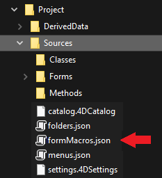

El editor de formularios 4D soporta macros. Una macro es un conjunto de instrucciones que permiten realizar una acción o una secuencia de acciones. Cuando se llama, la macro ejecutará sus instrucciones y realiza automáticamente la(s) acción(es).

Por ejemplo, si tiene un informe recurrente con un formato específico (por ejemplo, cierto texto debe aparecer en rojo y cierto texto debe aparecer en verde), puede crear una macro para definir automáticamente el color. Puede crear macros para el editor de formularios 4D que pueden:

- Crear y ejecutar código 4D
- Mostrar las cajas de diálogo
- Seleccione los objetos de formulario
- Añadir / eliminar / modificar los formularios, los objetos de formulario así como sus propiedades
- Modificar los archivos del proyecto (actualizar, eliminar)

Macros code supports [class functions](Concepts/classes.md) and [form object properties in JSON](FormObjects/properties_Reference.md) to let you define any custom feature in the Form editor.

Las macros pueden definirse para el proyecto local o para componentes dentro del proyecto. Por lo general, se crea una macro y se instala dentro de los componentes que se utilizan para el desarrollo.

Cuando se llama, una macro anula todo comportamiento especificado previamente.

## Ejemplo práctico

En este breve ejemplo, verá cómo crear y llamar a una macro que añade un botón de alerta "Hello World" en la esquina superior izquierda de su formulario.

1. In a `formMacros.json` file within the `Sources` folder of your project, you write:

```js
{
   "macros": {
      "Add Hello World button": {
       "class": "AddButton"
     }
   }
}
```

2. Create a 4D class named `AddButton`.

3. Within the `AddButton` class, write the following function:

```4d
Function onInvoke($editor : Object)->$result : Object
	
	var $btnHello : Object
	
	// Create a "Hello" button
	$btnHello:=New object("type"; "button"; \
	"text"; "Hello World!"; \
	"method"; New object("source"; "ALERT(\"Hello World!\")"); \
	"events"; New collection("onClick"); \
	"width"; 120; \
	"height"; 20; \
	"top"; 0; \
	"left"; 0)	
	
	// Add button in the current page
	$editor.editor.currentPage.objects.btnHello:=$btnHello	
	
	// Select the new button in the form editor
	$editor.editor.currentSelection.clear() //unselect elements
	$editor.editor.currentSelection.push("btnHello")	
	
	// Notify the modification to the 4D Form editor
	$result:=New object("currentSelection"; $editor.editor.currentSelection;\  
		"currentPage"; $editor.editor.currentPage)
```

You can then call the macro:


## Llamar a las macros en el editor de formularios

Cuando las macros están definidas en su proyecto 4D, puede llamar una macro utilizando el menú contextual del editor de formularios:


This menu is built upon the `formMacros.json` [macro definition file(s)](#location-of-macros). Los elementos de la macro se clasifican en orden alfabético.

Este menú puede ser llamado en un área vacía o en una selección en el formulario. Selected object are passed to `$editor.currentSelection` or `$editor.target` in the [`onInvoke`](#oninvoke) function of the macro.

Una sola macro puede ejecutar varias operaciones. If selected, the **Undo** feature of the Form editor can be used to reverse macro operations globally.

## Ubicación del archivo de macro

All 4D Form Editor macros are defined within a single JSON file per project or component: `FormMacros.json`.

This file must be located in the host or component's **Project** > **Sources** folder:



## Declaración de macros

The structure of the `formMacros.json` file is the following:

```js
{
    "macros": {
            <macroName>: {
                "class": <className>,
                <customProperty> : <value>
        }
    }
}
```

Esta es la descripción del contenido del archivo JSON:

| Atributo |               |                    | Tipo   | Descripción                                                                     |
| -------- | ------------- | ------------------ | ------ | ------------------------------------------------------------------------------- |
| macros   |               |                    | object | lista de macros definidas                                                       |
|          | `<macroName>` |                    | object | definición de la macro                                                          |
|          |               | class              | string | nombre de clase de la macro                                                     |
|          |               | `<customProperty>` | any    | (opcional) valor personalizado a recuperar en el constructor |

Custom properties, when used, are passed to the [constructor](#class-constructor) function of the macro.

### Ejemplo

```js
{
   "macros": {
     "Open Macros file": {
       "class": "OpenMacro"
     },
     "Align to Right on Target Object": {
       "class": "AlignOnTarget",
       "myParam": "right"
     },
     "Align to Left on Target Object": {
       "class": "AlignOnTarget",
       "myParam": "left"
     }
   }
}
```

## Instanciar las macros en 4D

Each macro you want to instantiate in your project or component must be declared as a [4D class](Concepts/classes.md).

The class name must match the name defined using the [class](#creating-macros) attribute of the `formMacros.json` file.

Las macros se instancian al iniciar la aplicación. Consequently, if you modify the macro class structure (add a function, modify a parameter...) or the [constructor](#class-constructor), you will have to restart the application to apply the changes.

## Funciones macro

Every macro class can contain a `Class constructor` and two functions: `onInvoke()` and `onError()`.

### Class constructor

#### Class constructor($macro : Object)

| Parámetros | Tipo   | Descripción                                                                 |
| ---------- | ------ | --------------------------------------------------------------------------- |
| $macro     | Object | Macro declaration object (in the `formMacros.json` file) |

Macros are instantiated using a [class constructor](Concepts/classes.md#class-constructor) function, if it exists.

El class constructor se llama una vez durante la instanciación de clase, que se produce al inicio de la aplicación.

Custom properties added to the [macro declaration](#declaring-macros) are returned in the parameter of the class contructor function.

#### Ejemplo

In the `formMacros.json` file:

```js
{
   "macros": {
     "Align to Left on Target Object": {
       "class": "AlignOnTarget",
       "myParam": "left"
     }
   }
}
```

Puede escribir:

```4d
// Class "AlignOnTarget"
Class constructor($macro : Object)
    This.myParameter:=$macro.myParam //left
    ...
```

### onInvoke()

#### onInvoke($editor : Object) -> $result : Object

| Parámetros | Tipo   | Descripción                                                                                                        |
| ---------- | ------ | ------------------------------------------------------------------------------------------------------------------ |
| $editor    | Object | Objeto Form Editor Macro Proxy que contiene las propiedades del formulario                                         |
| $result    | Object | Objeto Form Editor Macro Proxy que devuelve las propiedades modificadas por la macro (opcional) |

The `onInvoke` function is automatically executed each time the macro is called.

When the function is called, it receives in the `$editor.editor` property a copy of all the elements of the form with their current values. Luego puede ejecutar cualquier operación en estas propiedades.

Once operations are completed, if the macro results in modifying, adding, or removing objects, you can pass the resulting edited properties in `$result`. El procesador de macros analizará las propiedades devueltas y aplicará las operaciones necesarias en el formulario. Obviamente, cuanto menos propiedades devuelva, menos tiempo requerirá el procesamiento.

Here are the properties returned in the _$editor_ parameter:

| Propiedad                                                        | Tipo       | Descripción                                                                                       |
| ---------------------------------------------------------------- | ---------- | ------------------------------------------------------------------------------------------------- |
| $editor.editor.form              | Object     | Formulario completo                                                                               |
| $editor.editor.file              | File       | Objeto File del archivo de formularios                                                            |
| $editor.editor.name              | String     | Nombre del formulario                                                                             |
| $editor.editor.table             | number     | Número de tabla del formulario, 0 para el formulario proyecto                                     |
| $editor.editor.currentPageNumber | number     | El número de la página actual                                                                     |
| $editor.editor.currentPage       | Object     | La página actual, que contiene todos los objetos de formulario y el orden de entrada de la página |
| $editor.editor.currentSelection  | Collection | Colección de nombres de objetos seleccionados                                                     |
| $editor.editor.formProperties    | Object     | Propiedades del formulario actual                                                                 |
| $editor.editor.target            | string     | Nombre del objeto bajo el ratón cuando se hace clic en una macro                                  |

Here are the properties that you can pass in the `$result` object if you want the macro processor to execute a modification. Todas las propiedades son opcionales:

| Propiedad                         | Tipo       | Descripción                                                             |
| --------------------------------- | ---------- | ----------------------------------------------------------------------- |
| currentPage                       | Object     | currentPage incluyendo los objetos modificados por la macro, si los hay |
| currentSelection                  | Collection | currentSelection si es modificada por la macro                          |
| formProperties                    | Object     | formProperties si es modificado por la macro                            |
| editor.groups     | Object     | información de grupo, si los grupos son modificados por la macro        |
| editor.views      | Object     | ver información, si las vistas son modificadas por la macro             |
| editor.activeView | String     | Nombres de vistas activos                                               |

Por ejemplo, si los objetos de la página actual y de los grupos han sido modificados, puede escribir:

```4d
	$result:=New object("currentPage"; $editor.editor.currentPage ; \ 
			"editor"; New object("groups"; $editor.editor.form.editor.groups))

```

#### `method` attribute

When handling the `method` attribute of form objects, you can define the attribute value in two ways in macros:

- Using a [string containing the method file name/path](FormObjects/properties_Action.md#method).

- Utilizando un objeto con la siguiente estructura:

| Propiedad | Tipo   | Descripción |
| --------- | ------ | ----------- |
| source    | String | method code |

4D will create a file using the object name in the "objectMethods" folder with the content of `source` attribute. Esta función solo está disponible para el código macro.

#### `$4dId` property in `currentPage.objects`

The `$4dId` property defines a unique ID for each object in the current page. This key is used by the macro processor to control changes in `$result.currentPage`:

- if the `$4dId` key is missing in both the form and an object in `$result`, the object is created.
- if the `$4dId` key exists in the form but is missing in `$result`, the object is deleted.
- if the `$4dId` key exists in both the form and an object in `$result`, the object is modified.

#### Ejemplo

Quiere definir una función macro que aplique el color rojo y el estilo de letra itálica a cualquier objeto seleccionado.

```4d
Function onInvoke($editor : Object)->$result : Object
	var $name : Text
	
	If ($editor.editor.currentSelection.length>0)		
		// Set stroke to red and style to italic for each selected object
		For each ($name; $editor.editor.currentSelection)
			$editor.editor.currentPage.objects[$name].stroke:="red"
			$editor.editor.currentPage.objects[$name].fontStyle:="italic"

		End for each 
		
	Else 
		ALERT("Please select a form object.")
	End if 
	
	// Notify to 4D the modification
	$result:=New object("currentPage"; $editor.editor.currentPage)
```

### onError()

#### onError($editor : Object; $resultMacro : Object ; $error : Collection)

| Parámetros   |                                                                                           | Tipo       | Descripción                              |
| ------------ | ----------------------------------------------------------------------------------------- | ---------- | ---------------------------------------- |
| $editor      |                                                                                           | Object     | Object send to [onInvoke](#oninvoke)     |
| $resultMacro |                                                                                           | Object     | Object returned by [onInvoke](#oninvoke) |
| $error       |                                                                                           | Collection | Pila de errores                          |
|              | [].errCode            | Number     | Código de error                          |
|              | [].message            | Text       | Descripción del error                    |
|              | [].componentSignature | Text       | Firma del componente interno             |

The `onError` function is executed when the macros processor encounters an error.

Cuando se ejecuta una macro, si 4D encuentra un error que impide la cancelación de la macro, no la ejecuta. Es el caso, por ejemplo, de que la ejecución de una macro resulte en:

- borrar o modificar un script cuyo archivo es de sólo lectura.
- crear dos objetos con el mismo ID interno.

#### Ejemplo

En la definición de una clase macro, se puede escribir el siguiente código de error genérico:

```4d
Function onError($editor : Object; $resultMacro : Object; $error : Collection)
	var $obj : Object
	var $txt : Text
	$txt:=""
	
	For each ($obj; $error)
		$txt:=$txt+$obj.message+" \n"
	End for each 
	
	ALERT($txt)
```
