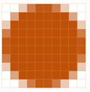

4D soporta específicamente las imágenes utilizadas en sus formularios.

## Formatos nativos soportados

4D integra la gestión nativa de los formatos de imagen. Esto significa que las imágenes se mostrarán y almacenarán en su formato original, sin ninguna interpretación en 4D. The specific features of the different formats (shading, transparent areas, etc.) will be retained when they are copied and pasted, and will be displayed without alteration. This native support is valid for all pictures stored in 4D forms: [static pictures](FormObjects/staticPicture.md) pasted in Design mode, pictures pasted into [inputs objects](FormObjects/input_overview.md) at runtime, etc.

Los formatos de imagen más comunes son soportados en ambas plataformas: .jpeg, .gif, .png, .tiff, .bmp, etc. En macOS, el formato .pdf también está disponible para su codificación y descodificación.

> La lista completa de formatos soportados varía según el sistema operativo y los códecs personalizados que estén instalados en las máquinas. To find out which codecs are available, you must use the `PICTURE CODEC LIST` command (see also the [picture data type](Concepts/dt_picture.md) description).

### Formato de imagen no disponible

Se muestra un icono específico para las imágenes guardadas en un formato que no está disponible en la máquina. La extensión del formato que falta se muestra en la parte inferior del icono:

El icono se utiliza automáticamente en todos los lugares en los que se pretende visualizar la imagen:

Este icono indica que la imagen no puede ser visualizada o manipulada localmente, pero puede ser guardada sin alteraciones para que pueda ser visualizada en otras máquinas. Este es el caso, por ejemplo, para las imágenes PDF en Windows, o las imágenes en formato PICT.

## Imágenes de alta resolución

4D soporta imágenes de alta resolución tanto en plataformas macOS como Windows. Las imágenes de alta resolución pueden definirse por el factor de escala o dpi.

### Factor de escala

Las pantallas de alta resolución tienen una mayor densidad de píxeles que las pantallas estándar tradicionales. For pictures to render correctly on high resolution displays, the number of pixels in the picture must be multiplied by the _scale factor_ (_i.e._, two times larger, three times larger, etc.).

When using high resolution pictures, you can specify the scale factor by adding "@nx" in the picture's name (where _n_ designates the scale factor). In the table below, you can see that the scale factor is indicated in the names of the high resolution pictures, _circle@2x.png_ and _circle@3x.png_.

| Tipo de visualización | Factor de escala                                                     | Ejemplo                                                                                                                                                                                         |
| --------------------- | -------------------------------------------------------------------- | ----------------------------------------------------------------------------------------------------------------------------------------------------------------------------------------------- |
| Resolución estándar   | densidad de pixel 1:1.               | **1x**  _circle.png_                                                                                                          |
| Alta resolución       | La densidad de píxeles se ha multiplicado por 2 o 3. | <table><th>2x</th><th>3x</th><tr><td>*circle@2x.png*</td><td> *circle@3x.png*</td></tr></table> |

Las imágenes de alta resolución con la convención @nx pueden utilizarse en los siguientes objetos:

- [Static pictures](FormObjects/staticPicture.md)
- [Buttons](FormObjects/button_overview.md)/[radio](FormObjects/radio_overview.md)/[check boxes](FormObjects/checkbox_overview.md)
- [Picture buttons](FormObjects/pictureButton_overview.md)/[Picture pop-ups](FormObjects/picturePopupMenu_overview.md)
- [Tab controls](FormObjects/tabControl.md)
- [List box headers](FormObjects/listbox_overview.md#list-box-headers)
- [Menu icons](Menus/properties.md#item-icon)

4D prioriza automáticamente las imágenes con mayor resolución. 4D prioriza automáticamente las imágenes con mayor resolución. Even if a command or property specifies _circle.png_, _circle@3x.png_ will be used (if it exists).

> Tenga en cuenta que la priorización de la resolución sólo se produce para la visualización de imágenes en pantalla, no se realiza una priorización automática al imprimir.

### DPI

While 4D automatically prioritizes the highest resolution,  there are, however, some behavioral differences depending on screen and image dpi\*(\*)\*, and picture format:

| Operación                                                                                                                                                   | Comportamiento                                                                                                                                                                                                                                                                                                                                                                                                                                                                                                                                                                                                                                                                   |
| ----------------------------------------------------------------------------------------------------------------------------------------------------------- | -------------------------------------------------------------------------------------------------------------------------------------------------------------------------------------------------------------------------------------------------------------------------------------------------------------------------------------------------------------------------------------------------------------------------------------------------------------------------------------------------------------------------------------------------------------------------------------------------------------------------------------------------------------------------------- |
| Soltar o pegar                                                                                                                                              | If the picture has:<ul><li>**72dpi or 96dpi** - The picture is "[Center](FormObjects/properties_Picture.md#center--truncated-non-centered)" formatted and the object containing the picture has the same number of pixels.</li><li>**Other dpi** - The picture is "[Scaled to fit](FormObjects/properties_Picture.md#scaled-to-fit)" formatted and the object containing the picture is equal to (picture's number of pixels \* screen dpi) / (picture's dpi)</li> <li>**No dpi** - The picture is "[Scaled to fit](FormObjects/properties_Picture.md#scaled-to-fit)" formatted.</li></ul> |
| [Automatic Size](https://doc.4d.com/4Dv19/4D/19/Setting-object-display-properties.300-5416671.en.html#148057) (Form Editor context menu) | If the picture's display format  is:<ul><li>**[Scaled](FormObjects/properties_Picture.md#scaled-to-fit)** - The object containing the picture is resized according to (picture's number of pixels \* screen dpi) / (picture's dpi) </li> <li>**Not scaled** - The object containing the picture has the same number of pixels as the picture.</li></ul>                                                                                                                                                                                                                                                    |

_(\*) Typically,  macOS = 72dpi, Windows = 96dpi_

## Imágenes en modo oscuro (sólo en macOS)

You can define specific pictures and icons to be used instead of standard pictures when [forms use the dark scheme](properties_FormProperties.md#color-scheme).

Una imagen en modo oscuro se define de la siguiente manera:

- dark mode picture has the same name as the standard (light scheme) version with the suffix "`_dark`"
- la imagen en modo oscuro se almacena junto a la versión estándar.

At runtime, 4D will automatically load the light or dark image according to the [current form color scheme](https://doc.4d.com/4dv19/help/command/en/1761.html).

## Coordenadas del ratón en una imagen

4D lets you retrieve the local coordinates of the mouse in an [input object](FormObjects/input_overview.md) associated with a [picture expression](FormObjects/properties_Object.md#expression-type), in case of a click or a hovering, even if a scroll or zoom has been applied to the picture. Este mecanismo, similar al de un mapa de imágenes, puede utilizarse, por ejemplo, para manejar barras de botones desplazables o la interfaz de un software de cartografía.

The coordinates are returned in the _MouseX_ and _MouseY_ [System Variables](https://doc.4d.com/4Dv18/4D/18/System-Variables.300-4505547.en.html). Las coordenadas se expresan en píxeles con respecto a la esquina superior izquierda de la imagen (0,0). If the mouse is outside of the picture coordinates system, -1 is returned in _MouseX_ and _MouseY_.

You can get the value of these variables as part of the [`On Clicked`](Events/onClicked.md), [`On Double Clicked`](Events/onDoubleClicked.md), [`On Mouse up`](Events/onMouseUp.md), [`On Mouse Enter`](Events/onMouseEnter.md), or [`On Mouse Move`](Events/onMouseMove.md) form events.
