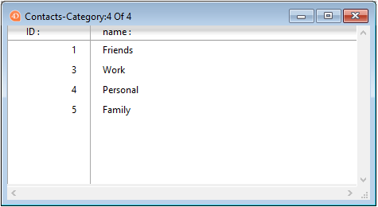

---

## Esquema de colores

> La propiedad de esquema de color sólo se aplica en macOS.

Esta propiedad define el esquema de colores para el formulario. By default when the property is not set, the value for a color scheme is **inherited** (the form uses the scheme defined at the [application level](https://doc.4d.com/4dv19/help/command/en/page1762.html)). Esto se puede cambiar para el formulario a una de las dos opciones siguientes:

- dark -- texto claro sobre fondo oscuro
- light - dark text on a light background
  \> A defined color scheme can not be overridden by a CSS.

> El número de caracteres para el título de una ventana está limitado a 31.

#### Gramática JSON

| Nombre      | Tipos de datos | Valores posibles |
| ----------- | -------------- | ---------------- |
| colorScheme | string         | "dark", "light"  |

---

## CSS

Esta propiedad le permite cargar archivos CSS específicos para el formulario.

Un archivo CSS definido a nivel de formulario anulará la(s) hoja(s) de estilo predeterminada(s). For more information, please refer to [Style sheets](createStylesheet.md) page.

#### Gramática JSON

| Nombre | Tipos de datos     | Valores posibles                                                                                                                                                                                                                                                                                                                |
| ------ | ------------------ | ------------------------------------------------------------------------------------------------------------------------------------------------------------------------------------------------------------------------------------------------------------------------------------------------------------------------------- |
| css    | cadena o colección | CSS file path(s) provided as:<li>a string (a file for both platforms)</li><li>a collection of strings (a list of files for both platform)</li><li>a collection of {"path":string;"media":"mac" \| "win"} objects </li> |

---

## Pages

Cada formulario consta de al menos dos páginas:

- una página 0 (página de fondo)
- una página 1 (página principal)

For more information, please refer to [Form pages](forms.md#form-pages).

#### Gramática JSON

| Nombre | Tipos de datos | Valores posibles                                                                                     |
| ------ | -------------- | ---------------------------------------------------------------------------------------------------- |
| pages  | collection     | Colección de páginas (cada página es un objeto, la página 0 es el primer elemento |

---

## Nombre del formulario

Esta propiedad es el nombre del propio formulario y se utiliza para referirse al formulario por su nombre utilizando el lenguaje 4D. The form name must comply with the [rules specified for identifiers](Concepts/identifiers.md) in 4D.

#### Gramática JSON

El nombre del formulario está definido por el nombre de la carpeta que contiene el archivo form.4Dform. See [project architecture](Project/architecture.md#sources-folder) for more information.

---

## Tipo de formulario

The form type, _i.e._ its destination, defines the features that will be available to the form. For example, [markers](properties_Markers.md) can only be set for list (output) table forms.

Cada tabla de una base de datos suele tener al menos dos formas de tabla. Uno para listar los registros en pantalla y el otro para mostrar un registro a la vez (utilizado para la entrada de datos y las modificaciones):

- Output form - the _output form_ or _list form_ displays a list of records, with a single line per record. Los resultados de las consultas se muestran en un formulario de salida y los usuarios pueden hacer doble clic en una línea para mostrar el formulario de entrada de ese registro.
  

- Formulario de entrada - utilizado para la entrada de datos. It displays a single record per screen and typically has buttons for saving and canceling modifications to the record and for navigating from record to record (_i.e._, First Record, Last Record, Previous Record, Next Record).
  

Los tipos soportados dependen de la categoría de formulario:

| Tipo de formulario              | Gramática JSON   | Descripción                                                      | Soportado con                            |
| ------------------------------- | ---------------- | ---------------------------------------------------------------- | ---------------------------------------- |
| Formulario detallado            | detailScreen     | Un formulario de visualización para introducir y modificar datos | Formularios proyecto - Formularios tabla |
| Formulario detallado imprimible | detailPrinter    | Un informe impreso con una página por registro, como una factura | Formularios proyecto - Formularios tabla |
| Formulario listado              | listScreen       | Un formulario para listar los registros en la pantalla           | Formularios tabla                        |
| Formulario de lista imprimible  | listPrinter      | Un informe impreso que lista los registros                       | Formularios tabla                        |
| Ninguno                         | _no destination_ | Un formulario sin característica específica                      | Formularios proyecto - Formularios tabla |

#### Gramática JSON

| Nombre      | Tipos de datos | Valores posibles                                             |
| ----------- | -------------- | ------------------------------------------------------------ |
| destination | string         | "detailScreen", "listScreen", "detailPrinter", "listPrinter" |

---

## Nombre del formulario heredado

This property designates the [form to inherit](forms.md#inherited-forms) in the current form.

To inherit from a table form, set the table in the [Inherited Form Table](#inherited-form-table) property.

To remove inheritance, select `\<None>` in the Property List (or " " in JSON).

#### Gramática JSON

| Nombre        | Tipos de datos | Valores posibles                                                                                                                                               |
| ------------- | -------------- | -------------------------------------------------------------------------------------------------------------------------------------------------------------- |
| inheritedForm | string         | Nombre de la tabla o formulario proyecto O una ruta POSIX a un archivo .json que describa el formulario O un objeto que describa el formulario |

---

## Tablas de formulario heredadas

This property specifies the database table from which to [inherit a form](forms.md#inherited-forms) in the current form.

Set to `\<None>` in the Property List (or " " in JSON) to inherited from a project form.

#### Gramática JSON

| Nombre             | Tipos de datos  | Valores posibles                  |
| ------------------ | --------------- | --------------------------------- |
| inheritedFormTable | string o number | nombre de tabla o número de tabla |

---

## Publicado como Subformulario

For a component form to be selected as a [subform](FormObjects/subform_overview.md) in a host application, it must have been explicitly shared. Cuando se selecciona esta propiedad, el formulario se publicará en la aplicación local.

Sólo los proyectos formulario se pueden especificar como subformularios publicados.

#### Gramática JSON

| Nombre | Tipos de datos | Valores posibles |
| ------ | -------------- | ---------------- |
| shared | boolean        | true, false      |

---

## Memorizar geometría

When the option is used, if the window is opened using the `Open form window` command with the `*` parameter, several form parameters are automatically saved by 4D when the window is closed, regardless of how they were modified during the session:

- la página actual,
- la posición, el tamaño y la visibilidad de cada objeto del formulario (incluyendo el tamaño y la visibilidad de las columnas de list box).

> This option does not take into account objects generated using the `OBJECT DUPLICATE` command. Para que un usuario pueda recuperar su entorno al utilizar este comando, el desarrollador debe repetir la secuencia de creación, definición y posicionamiento de los objetos.

When this option is selected, the [Save Value](FormObjects/properties_Object.md#save-value) option is available for certain objects.

#### Gramática JSON

| Nombre           | Tipos de datos | Valores posibles |
| ---------------- | -------------- | ---------------- |
| memorizeGeometry | boolean        | true, false      |

#### Ver también

[**Save Value**](FormObjects/properties_Object.md#save-value)

---

## Título de la ventana

The window title is used when the form is opened using the `Open form window` and `Open window` 4D commands in Application environment. El nombre de la ventana aparece en la barra de título de la ventana.

You can use dynamic references to set the window titles for forms, _i.e._:

- Una referencia estándar XLIFF almacenada en la carpeta Resources.
- A table or field label: The syntax to apply is `<?[TableNum]FieldNum>` or `<?[TableName]FieldName>`.
- A variable or a field: The syntax to apply is `\<VariableName>` or `<[TableName]FieldName>`. El valor actual del campo o de la variable se mostrará en el título de la ventana.

> El número de caracteres para el título de una ventana está limitado a 31.

#### Gramática JSON

| Nombre      | Tipos de datos | Valores posibles                                         |
| ----------- | -------------- | -------------------------------------------------------- |
| windowTitle | string         | El nombre de la ventana como texto plano o de referencia |
