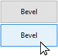

A button is an active object that can be assigned an action (_e.g._, a database task or an interface function) to perform when a user clicks on it.


Los botones pueden cumplir diversas funciones, según su estilo y la acción que se les asigne. Por ejemplo, los botones pueden guiar al usuario a través de un cuestionario o formulario para que lo llene, o para que tome decisiones. Dependiendo de sus propiedades, un botón puede estar diseñado para ser presionado una sola vez y ejecutar un comando, mientras que otros pueden requerir que el usuario haga clic más de una vez para recibir el resultado deseado.

## Gestión de botones

The actions assigned to buttons can originate from predefined [standard actions](properties_Action.md#standard-action) or from custom object methods. Algunos ejemplos de acciones típicas son permitir al usuario aceptar, cancelar o eliminar registros, copiar o pegar datos, pasar de una página a otra en un formulario de varias páginas, abrir, eliminar o añadir registros en un subformulario, manejar los atributos de las fuentes en las áreas de texto, etc.

Los botones con acciones estándar se atenúan cuando es apropiado durante la ejecución del formulario. For example, if the first record of a table is displayed, a button with the `firstRecord` standard action would appear dimmed.

Si desea que un botón realice una acción que no está disponible como acción estándar, deje el campo de acción estándar vacío y escriba un método de objeto para especificar la acción del botón. For more information about object methods and how to create and associate them, see [Using object methods](https://doc.4d.com/4Dv17R5/4D/17-R5/Using-object-methods.300-4163733.en.html).
Normally, you would activate the `On Clicked` event and the method would run only when the button is clicked. Puede asociar un método a cualquier botón.

The [variable](properties_Object.md#variable-or-expression) associated with a button is automatically set to **0** when the form is executed for the first time in Design or Application mode. When the user clicks a button, its variable is set to **1**.

> A un botón se le puede asignar tanto una acción estándar como un método. En este caso, si el botón no está desactivado por la acción estándar, el método se ejecuta antes de la acción estándar.

## Estilos de botón

Los estilos de botón controlan la apariencia general de un botón, así como sus propiedades disponibles. Es posible aplicar diferentes estilos predefinidos a los botones o asociarles menús emergentes. Se puede obtener un gran número de variaciones combinando estas propiedades/comportamientos.

With the exception of the [available properties](#supported-properties), many button objects are _structurally_ identical. La diferencia está en el tratamiento de sus variables asociadas.

4D ofrece botones en los siguientes estilos predefinidos:

### Clásico

The Regular button style is a standard system button (_i.e._, a rectangle with a descriptive label) which executes code when a user clicks on it.


Por defecto, el estilo Clásico tiene un fondo gris claro con una etiqueta en el centro. Cuando el cursor pasa por encima del estilo de botón Clásico, el borde y el color de fondo cambian para demostrar que tiene el foco. Además de iniciar la ejecución del código, el estilo del botón Clásico imita un botón mecánico cambiando rápidamente el color de fondo al ser presionado.

#### Ejemplo JSON:

```4d

	"myButton": {
		"type": "button",	//define the type of object
		"style":"regular",	//define the style of the button
		"defaultButton":"true"	//define button as the default choice
		"text": "OK",	//text to appear on the button
		"action": "Cancel", //action to be be performed 
		"left": 60,	 //left position on the form  
		"top": 160, //top position on the form 
	  	"width": 100,  //width of the button
		"height": 20 //height of the button
		}
```

Only the Regular and Flat styles offer the [Default Button](properties_Appearance.md#default-button) property.

### Plano

The Flat button style is a standard system button (_i.e._, a rectangle with a descriptive label) which executes code when a user clicks on it.


Por defecto, el estilo Plano tiene un fondo blanco con una etiqueta en el centro, esquinas redondeadas y una apariencia minimalista. El estilo gráfico del botón Flat es especialmente útil para los formularios a imprimir.

#### Ejemplo JSON:

```4d

	"myButton": {
                "type": "button",	
                "style":"flat",	
                "defaultButton":"true"	
                "text": "OK",	
                "action": "Cancel", 
                "left": 60,			
                "top": 160,			
                "width": 100,	
                "height": 20	
                }
```

Only the Regular and Flat styles offer the [Default Button](properties_Appearance.md#default-button) property.

### Toolbar (Barra de herramientas)

El estilo de botón de la barra de herramientas está destinado principalmente a integrarse en una barra de herramientas. Incluye la opción de añadir un menú emergente (indicado por un triángulo invertido) que generalmente se utiliza para mostrar opciones adicionales para que el usuario las seleccione.

Por defecto, el estilo Barra de herramientas tiene un fondo transparente con una etiqueta en el centro. La apariencia del botón puede ser diferente cuando el cursor pasa por encima de él dependiendo del sistema operativo:

- _Windows_ - the button is highlighted when it uses the “With Pop-up Menu” property, a triangle is displayed to the right and in the center of the button.


- _macOS_ - the highlight of the button never appears. Cuando utiliza la propiedad "Con menú emergente", aparece un triángulo a la derecha y en la parte inferior del botón.

#### Ejemplo JSON:

```4d
	"myButton": {
                "type": "button",	
                "style":"toolbar",	
                "text": "OK",		
                "popupPlacement":"separated"	
                "action": "Cancel", 	
                "left": 60,				
                "top": 160,				
                "width": 100,			
                "height": 20		
                }
```

### Bevel

The Bevel button style combines the appearance of the [Regular](#regular) (_i.e._, a rectangle with a descriptive label) style with the [Toolbar](#toolbar) style's pop-up menu property option.

Por defecto, el estilo Bevel tiene un fondo gris claro con una etiqueta en el centro. La apariencia del botón puede ser diferente cuando el cursor pasa por encima de él dependiendo del sistema operativo:

- _Windows_ - the button is highlighted. Cuando utiliza la propiedad "Con menú emergente", aparece un triángulo a la derecha y en el centro del botón.



- _macOS_ - the highlight of the button never appears. Cuando utiliza la propiedad "Con menú emergente", aparece un triángulo a la derecha y en la parte inferior del botón.

#### Ejemplo JSON:

```4d
	"myButton": {
                "type": "button",
                "style":"bevel",	
                "text": "OK",		
                "popupPlacement":"linked"	
                "action": "Cancel", 
                "left": 60,		
                "top": 160,		
                "width": 100,	
                "height": 20	
                }
```

### Bevel redondeado

The Rounded Bevel button style is nearly identical to the [Bevel](#bevel) style except, depending on the OS, the corners of the button may be rounded. As with the Bevel style, the Rounded Bevel style combines the appearance of the [Regular](#regular) style with the [Toolbar](#toolbar) style's pop-up menu property option.

Por defecto, el estilo Bevel Redondeado tiene un fondo gris claro con una etiqueta en el centro. La apariencia del botón puede ser diferente cuando el cursor pasa por encima de él dependiendo del sistema operativo:

- _Windows_ - the button is identical to the Bevel style. Cuando utiliza la propiedad "Con menú emergente", aparece un triángulo a la derecha y en el centro del botón.


- _macOS_ - the corners of the button are rounded. Cuando utiliza la propiedad "Con menú emergente", aparece un triángulo a la derecha y en la parte inferior del botón.

#### Ejemplo JSON:

```4d
	"myButton": {
                "type": "button",
                "style":"roundedBevel",	
                "text": "OK",	
                "popupPlacement":"none"	/
                "action": "Cancel", 
                "left": 60,			
                "top": 160,	
                "width": 100,	
                "height": 20	
                }
```

### OS X Gradient

The OS X Gradient button style is nearly identical to the [Bevel](#bevel) style. As with the Bevel style, the OS X Gradient style combines the appearance of the [Regular](#regular) style with the [Toolbar](#toolbar) style's pop-up menu property option.

Por defecto, el estilo OS X Gradient tiene un fondo gris claro con una etiqueta en el centro. La apariencia del botón puede ser diferente cuando el cursor pasa por encima de él dependiendo del sistema operativo:

- _Windows_ - the button is identical to the Bevel style. Cuando utiliza la propiedad "Con menú emergente", aparece un triángulo a la derecha del botón.


- _macOS_ - the button is displayed as a two-tone system button. Cuando utiliza la propiedad "Con menú emergente", aparece un triángulo a la derecha y en la parte inferior del botón.

#### Ejemplo JSON:

```4d
	"myButton": {
                "type": "button",	
                "style":"gradientBevel",
                "text": "OK",	
                "popupPlacement":"linked"
                "action": "Cancel", 	
                "left": 60,		
                "top": 160,	
                "width": 100,	
                "height": 20	
                }
```

### OS X Texturizado

The OS X Textured button style is nearly identical to the [Bevel](#bevel) style but with a smaller size (maximum size is the size of a standard macOS system button). As with the Bevel style, the OS X Textured style combines the appearance of the [Regular](#regular) style with the [Toolbar](#toolbar) style's pop-up menu property option.

Por defecto, el estilo OS X Textured aparece como:

- _Windows_ - a standard system button with a light gray background with a label in the center. Tiene la particularidad de ser transparente en Vista.


- _macOS_ - a standard system button displaying a color change from light to dark gray. Su altura está predefinida: no es posible ampliarla o reducirla.

#### Ejemplo JSON:

```4d
	"myButton": {
                "type": "button",	
                "style":"texturedBevel",	
                "text": "OK",	
                "popupPlacement":"separated"	
                "action": "Cancel", 
                "left": 60,			
                "top": 160,		
                "width": 100,	
                "height": 20	
                }
```

### Office XP

The Office XP button style combines the appearance of the [Regular](#regular) style with the [Toolbar](#toolbar) style's transparency and pop-up menu property option.

Los colores (resaltado y fondo) de un botón con el estilo Office XP se basan en los colores del sistema. La apariencia del botón puede ser diferente cuando el cursor pasa por encima de él dependiendo del sistema operativo:

- _Windows_ - its background only appears when the mouse rolls over it.


- _macOS_ - its background is always displayed.

#### Ejemplo JSON:

```4d
	"myButton": {
                "type": "button",	
                "style":"office",
                "text": "OK",
                "popupPlacement":"none"	
                "action": "Cancel", 
                "left": 60,		
                "top": 160,	
                "width": 100,
                "height": 20	
                }
```

### Ayuda

El estilo del botón Ayuda puede utilizarse para mostrar un botón de ayuda estándar del sistema. Por defecto, el estilo Ayuda se muestra como un signo de interrogación dentro de un círculo.


#### Ejemplo JSON:

```4d
	"myButton": {
                "type": "button",
                "style":"help",		
                "text": "OK",	
                "dropping": "custom", 
                "left": 60,	
                "top": 160,		
                "width": 100,	
                "height": 20	
                }
```

> The Help style does not support [Number of States](properties_TextAndPicture.md#number-of-states), [Picture pathname](properties_TextAndPicture.md#picture-pathname), and [Title/Picture Position](properties_TextAndPicture.md#title-picture-position) basic properties.

### Círculo

El estilo de botón Círculo aparece como un botón sistema circular. Este estilo de botón está diseñado para macOS.


En Windows, es idéntico al estilo "Ninguno" (no se tiene en cuenta el círculo del fondo).

#### Ejemplo JSON:

```
	"myButton": {
                "type": "button",	
                "style":"circular",	
                "text": "OK",	
                "dropping": "custom", 
                "left": 60,	
                "top": 160,		
                "width": 100,
                "height": 20	
                }
```

### Personalizado

El estilo de botón Personalizado acepta una imagen de fondo personalizada y permite gestionar parámetros adicionales como el margen y el desplazamiento del icono.


#### Ejemplo JSON:

```code
	"myButton": {
                "type": "button",	
                "style":"custom",	
                "text": "",	
                "customBackgroundPicture": "/RESOURCES/bkgnd.png",
                "icon": "/RESOURCES/custom.png",  
                "textPlacement": "center",
                "left": 60,	
                "top": 160,		
                "width": 100,	
                "height": 20
                }
```

## Propiedades soportadas

Todos los botones comparten el mismo conjunto de propiedades básicas:

[Bold](properties_Text.md#bold) - [Border Line Style](properties_BackgroundAndBorder.md#border-line-style) - [Bottom](properties_CoordinatesAndSizing.md#bottom) - [Button Style](properties_TextAndPicture.md#button-style) - [Class](properties_Object.md#css-class) - [Droppable](properties_Action.md#droppable) - [Focusable](properties_Entry.md#focusable) - [Font](properties_Text.md#font) - [Font Color](properties_Text.md#font-color) - [Font Size](properties_Text.md#font-size) - [Height](properties_CoordinatesAndSizing.md#height) - [Help Tip](properties_Help.md#help-tip) - [Horizontal Alignment](properties_Text.md#horizontal-alignment) - [Horizontal Sizing](properties_ResizingOptions.md#horizontal-sizing) - [Italic](properties_Text.md#italic) - [Image hugs title](properties_TextAndPicture.md#image-hugs-title)(1) - [Left](properties_CoordinatesAndSizing.md#left) - [Not rendered](properties_Display.md#not-rendered) - [Number of States](properties_TextAndPicture.md#number-of-states)(1) - [Object Name](properties_Object.md#object-name) - [Picture pathname](properties_TextAndPicture.md#picture-pathname)(1) - [Right](properties_CoordinatesAndSizing.md#right) - [Shortcut](properties_Entry.md#shortcut) - [Standard action](properties_Action.md#standard-action) - [Title](properties_Object.md#title) - [Title/Picture Position](properties_TextAndPicture.md#title-picture-position)(1) - [Top](properties_CoordinatesAndSizing.md#top) - [Type](properties_Object.md#type) - [Underline](properties_Text.md#underline) - [Variable or Expression](properties_Object.md#variable-or-expression) - [Vertical Sizing](properties_ResizingOptions.md#vertical-sizing) - [Visibility](properties_Display.md#visibility) - [Width](properties_CoordinatesAndSizing.md#width) - [With pop-up menu](properties_TextAndPicture.md#with-pop-up-menu)(2)

> (1) Not supported by the [Help](#help) style.<br/>
> (2) Not supported by the [Help](#help), [Flat](#flat) and [Regular](#regular) styles.

Additional specific properties are available, depending on the [button style](#button-styles):

- Custom: [Background pathname](properties_TextAndPicture.md#backgroundPathname) - [Horizontal Margin](properties_TextAndPicture.md#horizontalMargin) - [Icon Offset](properties_TextAndPicture.md#icon-offset) - [Vertical Margin](properties_TextAndPicture.md#verticalMargin)
- Flat, Regular: [Default Button](properties_Appearance.md#default-button)
