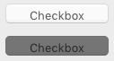

Una casilla de selección es un tipo de botón utilizado para introducir o mostrar datos binarios (verdadero-falso). Basically, it is either checked or unchecked, but a [third state](#three-states-check-box) can be defined.


Check boxes are controlled by methods or [standard actions](#using-a-standard-action). El método asociado a ella se ejecuta cuando se selecciona la casilla de selección. Como todos los botones, la variable de la casilla de selección se pone en 0 cuando se abre el formulario por primera vez.

Una casilla de selección muestra el texto junto a un pequeño cuadrado. This text is set in the [Title](properties_Object.md#title) property of the check box. You can enter a title in the form of an XLIFF reference in this area (see [Appendix B: XLIFF architecture](https://doc.4d.com/4Dv17R5/4D/17-R5/Appendix-B-XLIFF-architecture.300-4163748.en.html)).

## Utilizar casillas de selección

A check box can be associated to a [variable or expression](properties_Object.md#variable-or-expression) of type integer or boolean.

- **integer:** if the box is checked, the variable has the value 1. Cuando no se marca, tiene el valor 0. Si la casilla de selección está en tercer estado (ver más abajo), tiene el valor 2.
- **boolean:** if the box is checked, the variable has the value `True`. When not checked, it has the value `False`.

Una parte o todas las casillas de selección de un formulario pueden estar marcadas o desmarcadas. Las casillas de selección múltiples permiten al usuario seleccionar varias opciones.

### Casilla de selección de tres estados

Check box objects with [Regular](checkbox_overview.md#regular) and [Flat](checkbox_overview.md#flat) [button style](properties_TextAndPicture.md#button-style) accept a third state. Este tercer estado es un estado intermedio, que generalmente se utiliza para fines de visualización. Por ejemplo, permite indicar que una propiedad está presente en una selección de objetos, pero no en cada objeto de la selección.


To enable this third state, you must select the [Three-States](properties_Display.md#three-states) property.

This property is only available for regular and flat check boxes associated with numeric [variables or expressions](properties_Object.md#variable-or-expression) — check boxes for Boolean expressions cannot use the [Three-States](properties_Display.md#three-states) property (a Boolean expression cannot be in an intermediary state).

La variable asociada a la casilla de selección devuelve el valor 2 cuando la casilla está en el tercer estado.

> En el modo de entrada, las casillas de selección de los tres estados muestran cada estado de forma secuencial, en el siguiente orden: sin marcar / marcado / intermedio / sin marcar, etc. El estado intermedio no suele ser muy útil en el modo de entrada; en el código, basta con forzar el valor de la variable a 0 cuando toma el valor de 2 para pasar directamente del estado comprobado al estado no comprobado.

## Utilizar una acción estándar

You can assign a [standard action](properties_Action.md#standard-action) to a check box to handle attributes of text areas. For example, if you assign the `fontBold` standard action, at runtime the check box will manage the "bold" attribute of the selected text in the current area.

Sólo las acciones que pueden representar un estado verdadero/falso (acciones "marcables") son soportadas por este objeto:

| Acciones soportadas                 | Condiciones de uso (si las hay) |
| ----------------------------------- | -------------------------------------------------- |
| avoidPageBreakInsideEnabled         | Área 4D Write Pro únicamente                       |
| fontItalic                          |                                                    |
| fontBold                            |                                                    |
| fontLinethrough                     |                                                    |
| fontSubscript                       | Área 4D Write Pro únicamente                       |
| fontSuperscript                     | Área 4D Write Pro únicamente                       |
| fontUnderline                       |                                                    |
| font/showDialog                     | Mac únicamente                                     |
| htmlWYSIWIGEnabled                  | Área 4D Write Pro únicamente                       |
| section/differentFirstPage          | Área 4D Write Pro únicamente                       |
| section/differentLeftRightPages     | Área 4D Write Pro únicamente                       |
| spell/autoCorrectionEnabled         |                                                    |
| spell/autoDashSubstitutionsEnabled  | Mac únicamente                                     |
| spell/autoLanguageEnabled           | Mac únicamente                                     |
| spell/autoQuoteSubstitutionsEnabled | Mac únicamente                                     |
| spell/autoSubstitutionsEnabled      |                                                    |
| spell/enabled                       |                                                    |
| spell/grammarEnabled                | Mac únicamente                                     |
| spell/showDialog                    | Mac únicamente                                     |
| spell/visibleSubstitutions          |                                                    |
| visibleBackground                   | Área 4D Write Pro únicamente                       |
| visibleFooters                      | Área 4D Write Pro únicamente                       |
| visibleHeaders                      | Área 4D Write Pro únicamente                       |
| visibleHiddenChars                  | Área 4D Write Pro únicamente                       |
| visibleHorizontalRuler              | Área 4D Write Pro únicamente                       |
| visiblePageFrames                   | Área 4D Write Pro únicamente                       |
| visibleReferences                   |                                                    |
| widowAndOrphanControlEnabled        | Área 4D Write Pro únicamente                       |

For detailed information on these actions, please refer to the [Standard actions](properties_Action.md#standard-action) section.

## Estilos de botones casillas de selección

Check boxes use [button styles](properties_TextAndPicture.md#button-style) to control a check box's general appearance as well as its available properties. Es posible aplicar diferentes estilos predefinidos a las casillas de selección. Se puede obtener un gran número de variaciones combinando estas propiedades/comportamientos.

With the exception of the [available properties](#supported-properties), many check box objects are _structurally_ identical. La diferencia está en el tratamiento de sus variables asociadas.

4D ofrece casillas de selección en los siguientes estilos de botón predefinidos:

### Clásico

The Regular check box button style is a standard system check box (_i.e._, a rectangle with a descriptive title):


#### Ejemplo JSON:

```
	"myCheckBox": {
		"type": "checkbox",	
		"style":"regular",
		"text": "Cancel",	
		"action": "Cancel", 	
		"left": 60,			
		"top": 160,		
		"width": 100,			
		"height": 20		
		"dataSourceTypeHint":"boolean"
		}
```

### Plano

El estilo plano del botón casilla de selección tiene una apariencia minimalista. La naturaleza gráfica del estilo Flat es especialmente útil para los formularios que se van a imprimir.


#### Ejemplo JSON:

```
	"myCheckBox": {
			"type": "checkbox",	
			"style":"flat",
			"text": "Cancel",	
			"action": "cancel", 
			"left": 60,		
 			"top": 160,	
 			"width": 100,			
			"height": 20			
			}
```

### Botón barra de herramientas

El estilo del botón barra de herramientas está destinado principalmente a la integración en una barra de herramientas.

El estilo del botón Barra de herramientas tiene un fondo transparente con un título. It is usually associated with a [4-state picture](properties_TextAndPicture.md#number-of-states).

Ejemplo con estados seleccionado / no seleccionado / subrayado:


#### Ejemplo JSON:

```
	"myCheckBox": {
                "type": "checkbox",
                "style":"toolbar",	
                "text": "Checkbox",
				"icon": "/RESOURCES/File.png", 
				"iconFrames": 4 
                "left": 60,	
                "top": 160,	
                "width": 100,					
                "height": 20					
                }
```

### Bevel

The Bevel check box button style combines the appearance of the [Regular](#regular) button style (_i.e._, a rectangle with a descriptive title) with the [Toolbar Button](#toolbar-button) button style's behavior.

El estilo de botón Bevel redondeado tiene un fondo gris claro con un título. It is usually associated with a [4-state picture](properties_TextAndPicture.md#number-of-states).

Ejemplo con estados seleccionado / no seleccionado / subrayado:


#### Ejemplo JSON:

```
	"myCheckBox": {
                "type": "checkbox",	
                "style":"bevel",
                "text": "Checkbox",	 
 				"icon": "/RESOURCES/File.png", 
				"iconFrames": 4 
              	"left": 60,	
                "top": 160,	
                "width": 100,				
                "height": 20				
                }
```

### Bevel redondeado

The Rounded Bevel check box button style is nearly identical to the [Bevel](#bevel) button style except, depending on the OS, the corners of the button may be rounded. As with the Bevel button style, the Rounded Bevel button style combines the appearance of the [Regular](#regular) button style with the [Toolbar Button](#toolbar-button) button style's behavior.

El botón Bevel tiene un fondo gris claro con un título. It is usually associated with a [4-state picture](properties_TextAndPicture.md#number-of-states).

Ejemplo en macOS:


> On Windows, the Rounded Bevel button style is identical to the [Bevel](#bevel) button style.

#### Ejemplo JSON:

```4d
	"myCheckBox": {
                "type": "checkbox",	
                "style":"roundedBevel",	 
                "text": "Checkbox",	
 				"icon": "/RESOURCES/File.png", 
				"iconFrames": 4 
                "left": 60,	
                "top": 160,	
                "width": 100,			
                "height": 20			
                }
```

### OS X Gradient

The OS X Gradient check box button style is nearly identical to the [Bevel](#bevel) button style. As with the Bevel button style, the OS X Gradient button style combines the appearance of the [Regular](#regular) button style with the [Toolbar Button](#toolbar-button) button style's behavior.

El estilo del botón Gradient OS X tiene un fondo gris claro con un título y se puede mostrar como un botón de sistema de dos tonos en macOS. It is usually associated with a [4-state picture](properties_TextAndPicture.md#number-of-states).


> On Windows, this check box button style is identical to the [Bevel](#bevel) button style.

#### Ejemplo JSON:

```
	"myCheckBox": {
			"type": "checkbox",	
			"style":"gradientBevel", 
			"text": "Checkbox",	
			"icon": "/RESOURCES/File.png",
			"iconFrames": 4
			"left": 60,		
			"top": 160,		
			"width": 100,				
			"height": 20				
           }
```

### OS X Texturizado

The OS X Textured button style is similar to the [Bevel](#bevel) button style but with a smaller size (maximum size is the size of a standard macOS system button). As with the Bevel button style, the OS X Textured button style combines the appearance of the [Regular](#regular) button style with the [Toolbar Button](#toolbar-button) button style's behavior.

Por defecto, el estilo del botón OS X Textured aparece como:

- _Windows_ - a standard system button with a light blue background with a title in the center.


- _macOS_ - a standard system button. Su altura está predefinida: no es posible ampliarla o reducirla.



#### Ejemplo JSON:

```
	"myCheckBox": {
			"type": "checkbox",	
			"style":"texturedBevel", 
			"text": "Checkbox",	
			"left": 60,	
			"top": 160,	
			"width": 100,					
			"height": 20					
			}
```

### Office XP

The Office XP button style combines the appearance of the [Regular](#regular) button style with the [Toolbar Button](#toolbar-button) button style's behavior.

Los colores (resaltado y fondo) de una casilla de selección con el estilo de botón Office XP se basan en los colores del sistema. La apariencia de la casilla de selección puede ser diferente cuando el cursor pasa por encima, dependiendo del sistema operativo:

- _Windows_ - its background only appears when the mouse rolls over it. Ejemplo con estados seleccionado / no seleccionado / subrayado:


- _macOS_ - its background is always displayed. Ejemplo con estados seleccionado / no seleccionado:


#### Ejemplo JSON:

```
	"myCheckBox": {
                "type": "checkbox",	
                "style":"office",
                "text": "Checkbox",	 
                "action": "fontBold",
 				"icon": "/RESOURCES/File.png", 
				"iconFrames": 4 	
               "left": 60,	
                "top": 160,		
                "width": 100,			
                "height": 20			
                }
```

### Contraer/Desplegar

Este estilo de botón de casilla de selección se puede utilizar para añadir un icono estándar de contraer/expandir. Estos iconos se utilizan de forma nativa en las listas jerárquicas.

- _Windows_ - the icon looks like a [+] or a [-]


- _macOS_ - it looks like a triangle pointing right or down.


:::info

The Collapse/Expand style is named "disclosure" in the [button style JSON Grammar](properties_TextAndPicture.md#button-style).

:::

#### Ejemplo JSON:

```
	"myCheckBox": {
                "type": "checkbox",	
                "style":"disclosure",
				"method": "m_collapse",
				"left": 60,	
                "top": 160,	
                "width": 100,			
                "height": 20			
                }
```

### Divulgación

En macOS y Windows, una casilla de selección con el estilo de botón "Divulgación" aparece como un botón de información estándar, normalmente utilizado para mostrar/ocultar información adicional. Cuando se utiliza como botón radio, el símbolo del botón apunta hacia abajo con el valor 0 y hacia arriba con el valor 1.

- _Windows_

  

- _macOS_

  

:::info

The Disclosure style is named "roundedDisclosure" in the [button style JSON Grammar](properties_TextAndPicture.md#button-style).

:::

#### Ejemplo JSON:

```
	"myCheckBox": {
                "type": "checkbox",		
                "style":"roundedDisclosure",	
				"method": "m_disclose",
                "left": 60,		
                "top": 160,	
                "width": 100,			
                "height": 20			
                }
```

### Personalizado

El estilo del botón Personalizado acepta una imagen de fondo personalizada y permite gestionar propiedades específicas:

- [Background pathname](properties_TextAndPicture.md#backgroundPathname)
- [Icon Offset](properties_TextAndPicture.md#icon-offset)
- [Horizontal Margin](properties_TextAndPicture.md#horizontalMargin) and [Vertical Margin](properties_TextAndPicture.md#verticalMargin)

It is usually associated with a [4-state picture](properties_TextAndPicture.md#number-of-states), that can be used in conjunction with a [4-state](properties_TextAndPicture.md#number-of-states) [background picture](properties_TextAndPicture.md#backgroundPathname).

#### Ejemplo JSON:

```
	"myCheckbox": {
		"type": "checkbox",
		"style":"custom",
		"text": "OK", 
		"icon": "/RESOURCES/smiley.jpg", 
		"iconFrame": 4, 
		"customBackgroundPicture": "/RESOURCES/paper.jpg", 
		"iconOffset": 5, //custom icon offset when clicked
		"left": 60,	
		"top": 160,	
		"width": 100,		
		"height": 20,
		"customBorderX": 20,
		"customBorderY": 5
		}
```

## Propiedades soportadas

Todas las casillas de selección comparten un mismo conjunto de propiedades básicas:

[Bold](properties_Text.md#bold) - [Bottom](properties_CoordinatesAndSizing.md#bottom) - [Button Style](properties_TextAndPicture.md#button-style) - [Class](properties_Object.md#css-class) - [Enterable](properties_Entry.md#enterable) - [Expression Type](properties_Object.md#expression-type) - [Focusable](properties_Entry.md#focusable) - [Font](properties_Text.md#font) - [Font Color](properties_Text.md#font-color) - [Font Size](properties_Text.md#font-size) - [Height](properties_CoordinatesAndSizing.md#height) - [Help Tip](properties_Help.md#help-tip) - [Horizontal Alignment](properties_Text.md#horizontal-alignment)(1) - [Horizontal Sizing](properties_ResizingOptions.md#horizontal-sizing) - [Image hugs title](properties_TextAndPicture.md#image-hugs-title)(2) - [Italic](properties_Text.md#italic) - [Left](properties_CoordinatesAndSizing.md#left) - [Number of States](properties_TextAndPicture.md#number-of-states)(2) - [Object Name](properties_Object.md#object-name) - [Picture pathname](properties_TextAndPicture.md#picture-pathname)(2) - [Right](properties_CoordinatesAndSizing.md#right) - [Save value](properties_Object.md#save-value) - [Shortcut](properties_Entry.md#shortcut) - [Standard action](properties_Action.md#standard-action) - [Title](properties_Object.md#title) - [Title/Picture Position](properties_TextAndPicture.md#title-picture-position)(2) - [Top](properties_CoordinatesAndSizing.md#top) - [Type](properties_Object.md#type) - [Underline](properties_Text.md#underline) - [Variable or Expression](properties_Object.md#variable-or-expression) - [Vertical Sizing](properties_ResizingOptions.md#vertical-sizing) - [Visibility](properties_Display.md#visibility) - [Width](properties_CoordinatesAndSizing.md#width)

> (1) Not supported by the [Regular](#regular) and [Flat](#flat) styles.<br/>
> (2) Not supported by the [Regular](#regular), [Flat](#flat), [Disclosure](#disclosure) and [Collapse/Expand](#collapseexpand) styles.

Additional specific properties are available, depending on the [button style](#button-styles):

- Custom: [Background pathname](properties_TextAndPicture.md#backgroundPathname) - [Horizontal Margin](properties_TextAndPicture.md#horizontalMargin) - [Icon Offset](properties_TextAndPicture.md#icon-offset) - [Vertical Margin](properties_TextAndPicture.md#verticalMargin)
- Flat, Regular: [Three-States](properties_Display.md#three-states)
