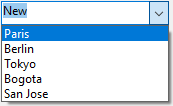

A combo box is similar to a [drop-down list](dropdownList_Overview.md#overview), except that it accepts text entered from the keyboard and has additional options.

Fundamentalmente, debe considerar un combo box como un área editable que utiliza su objeto, array o una lista de selección como el conjunto de valores por defecto.

## Gestión de combo boxes

Use the [`On Data Change`](Events/onDataChange.md) event to manage entries into the enterable area, as you would for any input form object.

You initialize a combo box in exactly the same way as a [drop-down list](dropdownList_Overview.md#overview): using an object, an array, or a choice list.

### Utilizar un objeto

> Esta funcionalidad sólo está disponible en proyectos 4D.

An [object](Concepts/dt_object.md) encapsulating a [collection](../Concepts/dt_collection.md) can be used as the data source of a combo box. El objeto debe contener las siguientes propiedades:

| Propiedad      | Tipo                 | Descripción                                                                                                                                                                                                                                                           |
| -------------- | -------------------- | --------------------------------------------------------------------------------------------------------------------------------------------------------------------------------------------------------------------------------------------------------------------- |
| `valores`      | Collection           | Obligatorio - Colección de valores escalares. Todos los valores deben ser del mismo tipo. Supported types:<li>strings</li><li>numbers</li><li>dates</li><li>times</li>If empty or not defined, the combo box is empty |
| `currentValue` | igual que Collection | Texto introducido por el usuario                                                                                                                                                                                                                                      |

Si el objeto contiene otras propiedades, se ignoran.

When the user enters text into the combo box, the `currentValue` property of the object gets the entered text.

### Utilizar un array

Please refer to **Using an array** in the [drop-down list page](dropdownList_Overview.md#using-an-array) for information about how to initialize the array.

Cuando el usuario introduce texto en el combo box, el elemento 0 del array recibe el texto introducido.

### Utilizar una lista de selección

Si desea utilizar un combo box para gestionar los valores de un área de entrada (campo listado o variable), 4D le permite referenciar el campo o variable directamente como fuente de datos del objeto formulario. Esto facilita la gestión de los campos/variables listados.

> Si utiliza una lista jerárquica, sólo se muestra el primer nivel y se puede seleccionar.

To associate a combo box with a field or variable, you can just enter the name of the field or variable directly in the [Variable or Expression](properties_Object.md#variable-or-expression) of the form object in the Property List.

Cuando se ejecuta el formulario, 4D gestiona automáticamente el combo box durante la entrada o visualización: cuando un usuario elige un valor, éste se guarda en el campo; este valor de campo se muestra en el combo box cuando se visualiza el formulario:

Please refer to **Using a choice** in the [drop-down list page](dropdownList_Overview.md#using-a-choice-list) for more information.

## Opciones

Los objetos de tipo combo box aceptan dos opciones específicas:

- [Automatic insertion](properties_DataSource.md#automatic-insertion): enables automatically adding a value to the data source when a user enters a value that is not found in the list associated with the combo box.
- [Excluded List](properties_RangeOfValues.md#excluded-list) (list of excluded values): allows setting a list whose values cannot be entered in the combo box. Si se introduce un valor excluido, no se acepta y se muestra un mensaje de error.

> Associating a [list of required values](properties_RangeOfValues.md#required-list) is not available for combo boxes. In an interface, if an object must propose a finite list of required values, then you must use a [drop-down list](dropdownList_Overview.md#overview) object.

## Propiedades soportadas

[Alpha Format](properties_Display.md#alpha-format) - [Bold](properties_Text.md#bold) - [Bottom](properties_CoordinatesAndSizing.md#bottom) - [Choice List](properties_DataSource.md#choice-list) - [Class](properties_Object.md#css-class) - [Date Format](properties_Display.md#date-format) - [Expression Type](properties_Object.md#expression-type) - [Font](properties_Text.md#font) - [Font Color](properties_Text.md#font-color) - [Font Size](properties_Text.md#font-size) - [Height](properties_CoordinatesAndSizing.md#height) - [Help Tip](properties_Help.md#help-tip) - [Horizontal Sizing](properties_ResizingOptions.md#horizontal-sizing) - [Italic](properties_Text.md#italic) - [Left](properties_CoordinatesAndSizing.md#left) - [Object Name](properties_Object.md#object-name) - [Right](properties_CoordinatesAndSizing.md#right) - [Time Format](properties_Display.md#time-format) - [Top](properties_CoordinatesAndSizing.md#top) - [Type](properties_Object.md#type) - [Underline](properties_Text.md#underline) - [Variable or Expression](properties_Object.md#variable-or-expression) - [Vertical Sizing](properties_ResizingOptions.md#vertical-sizing) - [Visibility](properties_Display.md#visibility) - [Width](properties_CoordinatesAndSizing.md#width)
