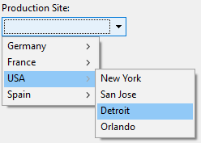

Las listas desplegables son objetos de formulario que permiten al usuario seleccionar de una lista. Los elementos mostrados en la lista desplegable se gestionan mediante un objeto, array, una lista de selección o una acción estándar.

En macOS, las listas desplegables también se denominan a veces "menú emergente". Ambos nombres se refieren a los mismos objetos. Como muestra el siguiente ejemplo, el aspecto de estos objetos puede variar ligeramente según la plataforma:


## Tipos de listas desplegables

Puede crear diferentes tipos de listas desplegables con distintas funcionalidades. To define a type, select the appropriate **Expression Type** and **Data Type** values in the Property list, or use their JSON equivalent.

| Tipo                                        | Funcionalidades                                                                           | Tipo de expresión | Tipos de datos                       | Definición JSON                                                                                                                       |
| ------------------------------------------- | ----------------------------------------------------------------------------------------- | ----------------- | ------------------------------------ | ------------------------------------------------------------------------------------------------------------------------------------- |
| Object                                      | Creado sobre una colección                                                                | Object            | Numeric, Text, Date o Time           | `dataSourceTypeHint: object` + `numberFormat: <format>` or `textFormat: <format>` or `dateFormat: <format>` or `timeFormat: <format>` |
| Array                                       | Basado en un array                                                                        | Array             | Numeric, Text, Date o Time           | `dataSourceTypeHint: arrayNumber` or `arrayText` or `arrayDate` or `arrayTime`                                                        |
| Lista de selección guardada como valor      | Crear en una lista de selección (estándar)                             | Lista             | Valor del elemento seleccionado      | `dataSourceTypeHint: text` + `saveAs: value`                                                                                          |
| Lista de selección guardada como referencia | Creado sobre una lista de selección. La posición del elemento es guardada | Lista             | Referencia del elemento seleccionado | `dataSourceTypeHint: integer` + `saveAs: reference`                                                                                   |
| Lista de selección jerárquica               | Puede mostrar contenido jerárquico                                                        | Lista             | Referencia de la lista               | `dataSourceTypeHint: integer`                                                                                                         |
| Acción estándar                             | Creado automáticamente por la acción                                                      | _cualquiera_      | _todo excepto referencia de lista_   | any definition + `action: <action>` (+ `focusable: false` for actions applying to other areas)                     |

## Gestión de listas desplegables

### Utilizar un objeto

> Esta funcionalidad sólo está disponible en proyectos 4D.

An [object](Concepts/dt_object.md) encapsulating a [collection](Concepts/dt_collection) can be used as the data source of a drop-down list. El objeto debe contener las siguientes propiedades:

| Propiedad      | Tipo                 | Descripción                                                                                                                                                                                                                                                                |
| -------------- | -------------------- | -------------------------------------------------------------------------------------------------------------------------------------------------------------------------------------------------------------------------------------------------------------------------- |
| `valores`      | Collection           | Obligatorio - Colección de valores escalares. Todos los valores deben ser del mismo tipo. Supported types:<li>strings</li><li>numbers</li><li>dates</li><li>times</li>If empty or not defined, the drop-down list is empty |
| `index`        | number               | Index of the currently selected item (value between 0 and `collection.length-1`). If you set -1, `currentValue` is displayed as a placeholder string                                                                                    |
| `currentValue` | igual que Collection | Elemento seleccionado actualmente (se utiliza como valor de marcador de posición si se define por código)                                                                                                                                               |

Si el objeto contiene otras propiedades, se ignoran.

Para inicializar el objeto asociado a la lista desplegable, puede:

- Enter a list of default values in the object properties by selecting `\<Static List>` in the [Data Source](properties_DataSource.md) theme of the Property List. Los valores por defecto se cargan en un objeto automáticamente.

- Ejecutar código que crea el objeto y sus propiedades. For example, if "myList" is the [variable](properties_Object.md#variable-or-expression) associated to the drop-down list, you can write in the [On Load](Events/onLoad.md) form event:

```4d
// Form.myDrop is the datasource of the form object
 
Form.myDrop:=New object
Form.myDrop.values:=New collection("apples"; "nuts"; "pears"; "oranges"; "carrots")
Form.myDrop.index:=-1  //currentValue is a placeholder
Form.myDrop.currentValue:="Select a fruit" 
```

La lista desplegable se muestra con la cadena del marcador de posición:


Después de que el usuario seleccione un valor:


```4d
Form.myDrop.values // ["apples","nuts","pears","oranges","carrots"]
Form.myDrop.currentValue //"oranges"
Form.myDrop.index //3
```

### Utilizar un array

An [array](Concepts/arrays.md) is a list of values in memory that is referenced by the name of the array. Una lista desplegable puede mostrar un array como una lista de valores cuando se hace clic en ella.

Para inicializar el array asociado a la lista desplegable, puede:

- Enter a list of default values in the object properties by selecting `\<Static List>` in the [Data Source](properties_DataSource.md) theme of the Property List. Los valores por defecto se cargan en un array automáticamente. Puede referirse al array utilizando el nombre de la variable asociada al objeto.

- Antes de mostrar el objeto, ejecute el código que asigna valores a los elementos del array. Por ejemplo:

```4d
  ARRAY TEXT(aCities;6) 
  aCities{1}:="Philadelphia" 
  aCities{2}:="Pittsburg" 
  aCities{3}:="Grand Blanc" 
  aCities{4}:="Bad Axe" 
  aCities{5}:="Frostbite Falls" 
  aCities{6}:="Green Bay" 
```

In this case, the name of the [variable](properties_Object.md#variable-or-expression) associated with the object in the form must be `aCities`. This code could be placed in the form method and be executed when the `On Load` form event runs.

- Before the object is displayed, load the values of a list into the array using the [LIST TO ARRAY](https://doc.4d.com/4dv19/help/command/en/page288.html) command. Por ejemplo:

```4d
   LIST TO ARRAY("Cities";aCities)
```

In this case also, the name of the [variable](properties_Object.md#variable-or-expression) associated with the object in the form must be `aCities`. Este código puede ejecutarse en lugar de las sentencias de asignación mostradas anteriormente.

Si necesita guardar la elección del usuario en un campo, deberá utilizar una sentencia de asignación que se ejecute después de aceptar el registro. El código podría ser así:

```4d
  Case of
    :(Form event=On Load)
       LIST TO ARRAY("Cities";aCities)
       If(Record number([People])<0) `new record
          aCities:=3 `display a default value
       Else `existing record, display stored value
          aCities:=Find in array(aCities;City)
       End if
    :(Form event=On Clicked) `user modified selection
       City:=aCities{aCities} `field gets new value
    :(Form event=On Validate)
       City:=aCities{aCities}
    :(Form event=On Unload)
       CLEAR VARIABLE(aCities)
 End case
```

Debe seleccionar cada evento que pruebe en sus sentencia Case. Los arrays siempre contienen un número finito de elementos. La lista de elementos es dinámica y puede ser modificada por un método. Los elementos de un array pueden modificarse, ordenarse y añadirse.

### Utilizar una lista de selección

If you want to use a drop-down list to manage the values of an input area (listed field or variable), 4D lets you reference the field or variable directly as the drop-down list's [data source](properties_Object.md#variable-or-expression). Esto facilita la gestión de los campos/variables listados.

Por ejemplo, en el caso de un campo "Color" que sólo puede contener los valores "Blanco", "Azul", "Verde" o "Rojo", es posible crear una lista que contenga estos valores y asociarla a una lista desplegable que haga referencia al campo "Color" 4D. 4D se encarga entonces de gestionar automáticamente la entrada y la visualización del valor actual en el formulario.

> Si utiliza una lista jerárquica, sólo se muestra el primer nivel y se puede seleccionar. If you want to display hierarchical contents, you need to use a [hierarchical choice list](#using-a-hierarchical-choice-list).

To associate a drop-down list with a field or variable, enter the name of the field or variable directly as the [Variable or Expression](properties_Object.md#variable-or-expression) field of the drop-down list in the Property List.

> No es posible utilizar esta funcionalidad con una lista desplegable de objetos o arrays. Si introduce un nombre de campo en el área "Variable o expresión", deberá utilizar una lista de selección.

Cuando se ejecuta el formulario, 4D gestiona automáticamente la lista desplegable durante la introducción o la visualización: cuando un usuario elige un valor, éste se guarda en el campo; este valor de campo se muestra en la lista desplegable cuando se visualiza el formulario:


#### Valor del elemento seleccionado o Referencia del elemento seleccionado

When you have associated a drop-down list with a choice list and with a field or a variable, you can set the [**Data Type**](properties_DataSource.md#data-type) property to **Selected item value** or **Selected item reference**. Esta opción permite optimizar el tamaño de los datos guardados.

### Uso de una lista de selección jerárquica

Una lista desplegable jerárquica tiene una sublista asociada a cada elemento de la lista. Este es un ejemplo de lista desplegable jerárquica:



> En los formularios, las listas desplegables jerárquicas están limitadas a dos niveles.

You can assign the hierarchical choice list to the drop-down list object using the [Choice List](properties_DataSource.md#choice-list) field of the Property List.

You manage hierarchical drop-down lists using the **Hierarchical Lists** commands of the 4D Language. All commands that support the `(*; "name")` syntax can be used with hierarchical  drop-down lists, e.g. [`List item parent`](https://doc.4d.com/4dv19/help/command/en/page633.html).

### Utilizar una acción estándar

You can build automatically a drop-down list using a [standard action](properties_Action.md#standard-action). Esta funcionalidad es soportada en los siguientes contextos:

- Use of the `gotoPage` standard action. In this case, 4D will automatically display the [page of the form](FormEditor/forms.md#form-pages) that corresponds to the number of the item that is selected. Por ejemplo, si el usuario selecciona el tercer elemento, 4D mostrará la tercera página del formulario actual (si existe). En tiempo de ejecución, la lista desplegable muestra por defecto los números de página (1, 2...).

- Use of a standard action that displays a sublist of items, for example `backgroundColor`. Esta funcionalidad requiere que:
  - a styled text area ([4D Write Pro area](writeProArea_overview.md) or [input](input_overview.md) with [multistyle](properties_Text.md#multi-style) property) is present in the form as the standard action target.
  - the [focusable](properties_Entry.md#focusable) property is not set to the drop-down list.
    En tiempo de ejecución, la lista desplegable mostrará una lista automática de valores, por ejemplo, colores de fondo. Puede reemplazar esta lista automática asignando además una lista de selección en la que cada elemento tenga asignada una acción estándar personalizada.

> Esta funcionalidad no puede utilizarse con una lista desplegable jerárquica.

## Propiedades soportadas

[Alpha Format](properties_Display.md#alpha-format) - [Bold](properties_Text.md#bold) - [Bottom](properties_CoordinatesAndSizing.md#bottom) - [Button Style](properties_TextAndPicture.md#button-style) - [Choice List](properties_DataSource.md#choice-list) - [Class](properties_Object.md#css-class) - [Data Type (expression type)](properties_DataSource.md#data-type-expression-type) - [Data Type (list)](properties_DataSource.md#data-type-list) - [Date Format](properties_Display.md#date-format) - [Expression Type](properties_Object.md#expression-type) - [Focusable](properties_Entry.md#focusable) - [Font](properties_Text.md#font) - [Font Color](properties_Text.md#font-color) - [Font Size](properties_Text.md#font-size) - [Height](properties_CoordinatesAndSizing.md#height) - [Help Tip](properties_Help.md#help-tip) - [Horizontal Sizing](properties_ResizingOptions.md#horizontal-sizing) - [Italic](properties_Text.md#italic) - [Left](properties_CoordinatesAndSizing.md#left) - [Not rendered](properties_Display.md#not-rendered) - [Object Name](properties_Object.md#object-name) - [Right](properties_CoordinatesAndSizing.md#right) - [Standard action](properties_Action.md#standard-action) - [Save value](properties_Object.md#save-value) - [Time Format](properties_Display.md#time-format) - [Top](properties_CoordinatesAndSizing.md#top) - [Type](properties_Object.md#type) - [Underline](properties_Text.md#underline) - [Variable or Expression](properties_Object.md#variable-or-expression) - [Vertical Sizing](properties_ResizingOptions.md#vertical-sizing) - [Visibility](properties_Display.md#visibility) - [Width](properties_CoordinatesAndSizing.md#width)
