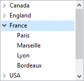

Las listas jerárquicas son objetos formulario que pueden utilizarse para mostrar datos en forma de listas con uno o más niveles que pueden desplegarse o contraerse.



Cuando corresponda, el icono desplegar/contraer se mostrará automáticamente a la izquierda del elemento. Las listas jerárquicas soportan un número ilimitado de subniveles.

## Fuente de datos de lista jerárquica

El contenido de un objeto formulario lista jerárquica se puede inicializar de una de las siguientes maneras:

- Asociar una [lista de opciones](properties_DataSource.md#choice-list) existente al objeto. La lista de elección debe haber sido definida en el editor de listas en modo Diseño.
- Asigne directamente una referencia de lista jerárquica a la [variable o expresión](properties_Object.md#variable-or-expression) asociada al objeto formulario.

En ambos casos, se gestiona una lista jerárquica en tiempo de ejecución a través de su referencia _ListRef_, utilizando los comandos [lista jerárquica](https://doc.4d.com/4Dv17R6/4D/17-R6/Hierarchical-Lists.201-4310291.en.html) del lenguaje 4D.

## RefList y nombre de objeto

Una lista jerárquica es a la vez un **objeto de lenguaje** existente en memoria y un **objeto de formulario**.

El **objeto de lenguaje** está referenciado por un ID interno único de tipo Entero largo, designado por _ListRef_ en el manual de Lenguaje 4D. Este ID es devuelto por los comandos que se pueden usar para crear listas: `New list`, `Copy list`, `Load list`, `BLOB to list`. Sólo hay una instancia del objeto lenguaje en la memoria y cualquier modificación realizada en este objeto se traslada inmediatamente a todos los lugares donde se utiliza.

El **objeto de formulario** no es necesariamente único: puede haber varias representaciones de la misma lista jerárquica en el mismo formulario o en otros diferentes. Al igual que con otros objetos formulario, se especifica el objeto en el lenguaje utilizando la sintaxis (\*; "NomLista", etc.).

Conecte el "objeto lenguaje " lista jerárquica con el "objeto de formulario" lista jerárquica por medio de la variable que contiene el valor RefLista. Conecte el "objeto lenguaje " lista jerárquica con el "objeto de formulario" lista jerárquica por medio de la variable que contiene el valor RefLista.

```4d
mylist:=New list
```

Cada representación de la lista tiene sus propias características específicas y comparte características comunes con todas las demás representaciones. Las siguientes características son específicas de cada representación de la lista:

- La selección,
- El estado desplegado/colapsado de sus elementos,
- La posición del cursor de desplazamiento.

The other characteristics (font, font size, style, entry control, color, list contents, icons, etc.) are common to all the representations and cannot be modified separately.
Consequently, when you use commands based on the expanded/collapsed configuration or the current item, for example `Count list items` (when the final `*` parameter is not passed), it is important to be able to specify the representation to be used without any ambiguity.

Debe utilizar el identificador `RefLista` con los comandos del lenguaje cuando quiera especificar la lista jerárquica que se encuentra en la memoria. En cambio, si desea especificar la representación al nivel del formulario de un objeto Lista jerárquica, debe utilizar el nombre del objeto (tipo cadena) en el comando, mediante la sintaxis estándar (\*; "NomLista", etc.).

> En el caso de los comandos que definen propiedades, la sintaxis basada en el nombre del objeto no significa que sólo el objeto formulario especificado será modificado por el comando, sino que la acción del comando se basará en el estado de este objeto. Las características comunes de las listas jerárquicas se modifican siempre en todas sus representaciones.
> Por ejemplo, si pasa la instrucción:

```4d
SET LIST ITEM FONT(*;"mylist1";*;thefont)
```

> ... you are indicating that you want to modify the font of the hierarchical list item associated with the _mylist1_ form object. El comando tendrá en cuenta el elemento actual del objeto _mylist1_ para definir el elemento a modificar, pero esta modificación se trasladará a todas las representaciones de la lista en todos los procesos.

### Soporte de @

Al igual que con otros comandos de gestión de propiedades de objetos, es posible utilizar el carácter "@" en el parámetro `NomLista`. Por regla general, esta sintaxis se utiliza para designar un conjunto de objetos del formulario. Sin embargo, en el contexto de los comandos de listas jerárquicas, esto no se aplica en todos los casos. Esta sintaxis tendrá dos efectos diferentes según el tipo de comando:

- Para los comandos que fijan propiedades, esta sintaxis designa todos los objetos cuyo nombre corresponde (comportamiento estándar). Por ejemplo, el parámetro "LH@" designa todos los objetos del tipo lista jerárquica cuyo nombre empieza por "LH."
  - `DELETE FROM LIST`
  - `INSERT IN LIST`
  - `SELECT LIST ITEMS BY POSITION`
  - `SET LIST ITEM`
  - `SET LIST ITEM FONT`
  - `SET LIST ITEM ICON`
  - `SET LIST ITEM PARAMETER`
  - `SET LIST ITEM PROPERTIES`

- Para los comandos que recuperan propiedades, esta sintaxis designa el primer objeto cuyo nombre corresponde:
  - `Count list items`
  - `Find in list`
  - `GET LIST ITEM`
  - `Get list item font`
  - `GET LIST ITEM ICON`
  - `GET LIST ITEM PARAMETER`
  - `GET LIST ITEM PROPERTIES`
  - `List item parent`
  - `List item position`
  - `Selected list items`

## Comandos genéricos utilizables con listas jerárquicas

Es posible modificar la apariencia de una lista jerárquica en un formulario utilizando varios comandos 4D genéricos. Puede pasar a estos comandos el nombre del objeto de la lista jerárquica (utilizando el parámetro \*), o su nombre de variable (que contiene el valor ListRef):

- `OBJECT SET FONT`
- `OBJECT SET FONT STYLE`
- `OBJECT SET FONT SIZE`
- `OBJECT SET COLOR`
- `OBJECT SET FILTER`
- `OBJECT SET ENTERABLE`
- `OBJECT SET SCROLLBAR`
- `OBJECT SET SCROLL POSITION`
- `OBJECT SET RGB COLORS`

> Recordatorio: excepto `OBJECT SET SCROLL POSITION`, estos comandos modifican todas las representaciones de una misma lista, aunque sólo se especifique una lista a través de su nombre de objeto.

## Prioridad de los comandos de propiedad

Ciertas propiedades de las listas jerárquicas (por ejemplo, el atributo **editable** o el color) pueden definirse de diferentes maneras: en las propiedades del formulario, mediante un comando del tema "Propiedades de los objetos" o mediante un comando del Cuando se utilizan los tres medios para definir las propiedades de la lista, se aplica el siguiente orden de prioridad:

1. Comandos del tema "Lista jerárquica"
2. Comandos genéricos de propiedad de objeto
3. Propiedad formulario

Este principio se aplica independientemente del orden de llamada de los comandos. Si una propiedad de un elemento se modifica individualmente a través de un comando de lista jerárquica, el comando de propiedad de objeto equivalente no tendrá ningún efecto sobre este elemento, incluso si se llama posteriormente. Por ejemplo, si el color de un elemento se modifica a través del comando `SET LIST ITEM PROPERTIES`, el comando `OBJECT SET COLOR` no tendrá ningún efecto sobre este elemento.

## Gestión de los elementos por posición o por referencia

Normalmente se puede trabajar de dos maneras con el contenido de las listas jerárquicas: por posición o por referencia.

- Cuando se trabaja por posición, 4D se basa en la posición con respecto a los elementos de la lista que aparecen en pantalla para identificarlos. El resultado será diferente según se expandan o colapsen determinados elementos jerárquicos. Tenga en cuenta que en el caso de las representaciones múltiples, cada objeto formulario tiene su propia configuración de elementos expandidos/colapsados.
- Cuando se trabaja por referencia, 4D se basa en el número de identificación _itemRef_ de los elementos de la lista. Así, cada elemento puede especificarse individualmente, independientemente de su posición o de su visualización en la lista jerárquica.

### Utilizar los números de referencia de los artículos (itemRef)

Cada elemento de una lista jerárquica tiene un número de referencia (_itemRef_) del tipo Entero largo. Este valor sólo está destinado a su propio uso: 4D simplemente lo mantiene.

> Atención: puede utilizar cualquier tipo de valor entero largo como número de referencia, excepto 0. De hecho, para la mayoría de los comandos de este tema, se utiliza el valor 0 para especificar el último elemento añadido a la lista.

He aquí algunos consejos para utilizar los números de referencia:

1. No es necesario identificar cada elemento con un número único (nivel principiante).

   - Primer ejemplo: se construye por programación un sistema de pestañas, por ejemplo, una libreta de direcciones. Como el sistema devuelve el número de la pestaña seleccionada, probablemente no necesitará más información que ésta. En este caso, no se preocupe por los números de referencia de los elementos: pase un valor cualquiera (excepto 0) en el parámetro _itemRef_. Tenga en cuenta que para un sistema de libreta de direcciones, puede predefinir una lista A, B, ..., Z en el modo Diseño. También se puede crear por programación para eliminar las letras para las que no hay registros.
   - Segundo ejemplo: al trabajar con una base, se construye progresivamente una lista de palabras clave. Puede guardar esta lista al final de cada sesión utilizando los comandos `SAVE LIST` o `LIST TO BLOB` y volver a cargarla al comienzo de cada nueva sesión utilizando el `Load list` o `BLOB to list`. Puede mostrar esta lista en una paleta flotante; cuando cada usuario hace clic en una palabra clave de la lista, el elemento elegido se inserta en el área introducible que está seleccionada en el proceso en primer plano. Lo importante es que sólo procese el elemento seleccionado, porque el comando `Select list items` devuelve la posición del elemento que debe procesar. Cuando se utiliza este valor de posición, se obtiene el título del elemento mediante el comando `GET LIST ITEM`. También en este caso, no es necesario identificar cada elemento individualmente; puede pasar cualquier valor (excepto 0) en el parámetro _itemRef_.

2. Necesita identificar parcialmente los elementos de la lista (nivel intermediario).\
   You use the item reference number to store information needed when you must work with the item; this point is detailed in the example of the `APPEND TO LIST` command. En este ejemplo, utilizamos los números de referencia de los artículos para almacenar los números de registro. Sin embargo, debemos ser capaces de establecer una distinción entre los elementos que corresponden a los registros [Department] y los que corresponden a los registros [Employees].

3. You need to identify all the list items individually (advanced level).\
   You program an elaborate management of hierarchical lists in which you absolutely must be able to identify each item individually at every level of the list. Una forma sencilla de ponerlo en práctica es mantener un contador personal. Suponga que crea una lista _hlList_ utilizando el comando `APPEND TO LIST`. En esta etapa, se inicializa un contador _vhlCounter_ en 1. Cada vez que se llama a `APPEND TO LIST` o `INSERT IN LIST`, se incrementa este contador `(vhlCounter:=vhlCounter+1)`, y se pasa el número del contador como número de referencia del elemento. El truco consiste en no disminuir nunca el contador cuando se eliminan elementos: el contador sólo puede aumentar. De este modo, se garantiza la unicidad de los números de referencia de los elementos. Since these numbers are of the Longint type, you can add or insert more than two billion items in a list that has been reinitialized... (however if you are working with such a great number of items, this usually means that you should use a table rather than a list.)

> Si se utilizan operadores Bitwise, también se pueden utilizar los números de referencia de los elementos para almacenar información que se puede poner en un Entero largo, es decir, 2 enteros, valores de 4 bytes o de nuevo 32 booleanos.

### ¿Cuándo necesita números de referencia únicos?

En la mayoría de los casos, cuando se utilizan listas jerárquicas con fines de interfaz de usuario y cuando sólo se trata del elemento seleccionado (por un clic o arrastrado), no será necesario utilizar los números de referencia de los elementos en absoluto. Con `Selected list items` y `GET LIST ITEM`, tiene todo lo que necesita para tratar con el elemento seleccionado actualmente. Además, comandos como `INSERT IN LIST` y `DELETE FROM LIST` permiten manipular la lista "relativamente" con respecto al elemento seleccionado.

Básicamente, es necesario tratar con los números de referencia de los elementos cuando se quiere acceder directamente a cualquier elemento de la lista de forma programada y no necesariamente al actualmente seleccionado en la lista.

## Elemento modificable

Puede controlar si los elementos de la lista jerárquica pueden ser modificados por el usuario utilizando el atajo de teclado **Alt+clic**(Windows) / **Opción+clic** (macOS), o realizando una pulsación larga sobre el texto del elemento.

- Sea cual sea la fuente de datos de la lista jerárquica, puede controlar todo el objeto con la propiedad [Editable](properties_Entry.md#enterable).

- Además, si llena la lista jerárquica utilizando una lista creada en el editor de listas, puede controlar si un elemento de una lista jerárquica es modificable mediante la opción **Elemento modificable** del editor de listas. Para más información, consulte [Definir las propiedades de la lista](https://doc.4d.com/4Dv17R6/4D/17-R6/Setting-list-properties.300-4354625.en.html).

## Propiedades soportadas

[Bold](properties_Text.md#bold) - [Border Line Style](properties_BackgroundAndBorder.md#border-line-style) - [Bottom](properties_CoordinatesAndSizing.md#bottom) - [Choice List](properties_DataSource.md#choice-list) - [Class](properties_Object.md#css-class) - [Draggable](properties_Action.md#draggable-and-droppable) - [Droppable](properties_Action.md#draggable-and-droppable) - [Enterable](properties_Entry.md#enterable) - [Entry Filter](properties_Entry.md#entry-filter) - [Fill Color](properties_BackgroundAndBorder.md#background-color-fill-color) - [Focusable](properties_Entry.md#focusable) - [Font](properties_Text.md#font) - [Font Color](properties_Text.md#font-color) - [Font Size](properties_Text.md#font-size) - [Height](properties_CoordinatesAndSizing.md#height) - [Help Tip](properties_Help.md#help-tip) - [Hide focus rectangle](properties_Appearance.md#hide-focus-rectangle) - [Horizontal Scroll Bar](properties_Appearance.md#horizontal-scroll-bar) - [Horizontal Sizing](properties_ResizingOptions.md#horizontal-sizing) - [Italic](properties_Text.md#italic) - [Left](properties_CoordinatesAndSizing.md#left) - [Multi-selectable](properties_Action.md#multi-selectable) - [Object Name](properties_Object.md#object-name) - [Right](properties_CoordinatesAndSizing.md#right) - [Top](properties_CoordinatesAndSizing.md#top) - [Type](properties_Object.md#type) - [Underline](properties_Text.md#underline) - [Vertical Scroll Bar](properties_Appearance.md#vertical-scroll-bar) - [Vertical Sizing](properties_ResizingOptions.md#vertical-sizing) - [Variable or Expression](properties_Object.md#variable-or-expression) - [Visibility](properties_Display.md#visibility) - [Width](properties_CoordinatesAndSizing.md#width)
