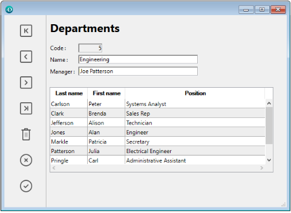
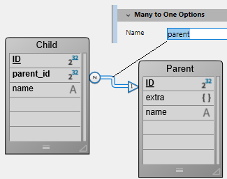
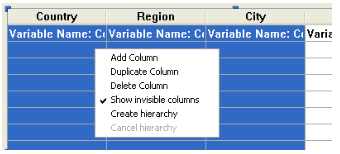
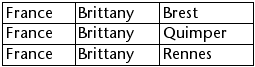
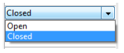
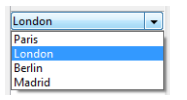
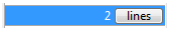

Los list boxes son objetos activos complejos que permiten mostrar e introducir datos en forma de columnas sincronizadas. Pueden vincularse a contenidos de la base de datos, como selecciones de entidades y secciones de registros, o a cualquier contenido del lenguaje, como colecciones y arrays. Incluyen funciones avanzadas relativas a la entrada de datos, la ordenación de columnas, la gestión de eventos, el aspecto personalizado, el desplazamiento de columnas, etc.



Un list box contiene una o varias columnas cuyo contenido se sincroniza automáticamente. El número de columnas es, en teoría, ilimitado (depende de los recursos de la máquina).

## Generalidades

### Principios de utilización básicos

Durante la ejecución, los list box permiten visualizar e introducir datos en forma de listas. To make a cell editable ([if entry is allowed for the column](#managing-entry)), simply click twice on the value that it contains:


Los usuarios pueden introducir y mostrar el texto en varias líneas dentro de una celda de list box. To add a line break, press **Ctrl+Carriage return** on Windows or **Option+Carriage return** on macOS.

En las celdas se pueden mostrar booleanos e imágenes, así como fechas, horas o números. It is possible to sort column values by clicking on a header ([standard sort](#managing-sorts)). Todas las columnas se sincronizan automáticamente.

It is also possible to resize each column, and the user can modify the order of [columns](properties_ListBox.md#locked-columns-and-static-columns) and [rows](properties_Action.md#movable-rows) by moving them using the mouse, if this action is authorized. Note that list boxes can be used in [hierarchical mode](#hierarchical-list-boxes).

The user can select one or more rows using the standard shortcuts: **Shift+click** for an adjacent selection and **Ctrl+click** (Windows) or **Command+click** (macOS) for a non-adjacent selection.

### Partes de list box

Un list box se compone de cuatro partes distintas:

- el objeto list box en su totalidad,
- las columnas,
- los encabezados de las columnas, y
- los pies de las columnas.


Cada parte tiene su propio nombre y propiedades específicas. Por ejemplo, el número de columnas o el color alternativo de cada línea se define en las propiedades del objeto list box, el ancho de cada columna se define en las propiedades de las columnas y el tipo de fuente del encabezado se define en las propiedades de los encabezados.

Es posible añadir un método objeto al objeto list box y/o a cada columna del list box. Los métodos objeto se llaman en el siguiente orden:

1. Método objeto de cada columna
2. Método objeto del list box

The column object method gets events that occur in its [header](#list-box-headers) and [footer](#list-box-footers).

### Tipos de list box

Hay varios tipos de list box, con sus propios comportamientos y propiedades específicas. The list box type depends on its [Data Source property](properties_Object.md#data-source):

- **Arrays**: each column is bound to a 4D array. Array-based list boxes can be displayed as [hierarchical list boxes](listbox_overview.md#hierarchical-list-boxes).
- **Selection** (**Current selection** or **Named selection**): each column is bound to an expression (e.g. a field) which is evaluated for every record of the selection.
- **Collection or Entity selection**: each column is bound to an expression which is evaluated for every element of the collection or every entity of the entity selection.

> No es posible combinar diferentes tipos de list box en el mismo objeto list box. La fuente de datos se define cuando se crea el list box. Entonces ya no es posible modificarlo por programación.

### Gestión de list boxes

Se puede configurar completamente un objeto list box a través de sus propiedades, y también se puede gestionar dinámicamente por programación.

The 4D Language includes a dedicated "List Box" theme for list box commands, but commands from various other themes, such as "Object properties" commands or `EDIT ITEM`, `Displayed line number` commands can also be used. Refer to the [List Box Commands Summary](https://doc.4d.com/4Dv17R6/4D/17-R6/List-Box-Commands-Summary.300-4311159.en.html) page of the _4D Language reference_ for more information.

## Objetos tipo List box

### List box de tipo array

En un list box de tipo array, cada columna debe estar asociada a un array unidimensional 4D; se pueden utilizar todos los tipos de array, a excepción de los arrays de punteros. El número de líneas se basa en el número de elementos del array.

Por defecto, 4D asigna el nombre "ColumnX" a cada columna. You can change it, as well as other column properties, in the [column properties](listbox_overview.md#column-specific-properties). The display format for each column can also be defined using the `OBJECT SET FORMAT` command.

> Array type list boxes can be displayed in [hierarchical mode](listbox_overview.md#hierarchical-list-boxes), with specific mechanisms.

Con los list box de tipo array, los valores introducidos o mostrados se gestionan utilizando el lenguaje 4D. You can also associate a [choice list](properties_DataSource.md#choice-list) with a column in order to control data entry.
The values of columns are managed using high-level List box commands (such as `LISTBOX INSERT ROWS` or `LISTBOX DELETE ROWS`) as well as array manipulation commands. Por ejemplo, para inicializar el contenido de una columna, puede utilizar la siguiente instrucción:

```4d
ARRAY TEXT(varCol;size)
```

También puede utilizar una lista:

```4d
LIST TO ARRAY("ListName";varCol)
```

> **Warning**: When a list box contains several columns of different sizes, only the number of items of the smallest array (column) will be displayed. Debe asegurarse de que cada array tenga el mismo número de elementos que los demás. Además, si una columna del list box está vacía (esto ocurre cuando el array asociado no fue declarado o dimensionado correctamente con el lenguaje), el list box no muestra nada.

### List box de tipo selección

In this type of list box, each column can be associated with a field (for example `[Employees]LastName)` or an expression. The expression can be based on one or more fields (for example, `[Employees]FirstName+" "[Employees]LastName`) or it may simply be a formula (for example `String(Milliseconds)`). La expresión también puede ser un método proyecto, una variable o un elemento de array. You can use the `LISTBOX SET COLUMN FORMULA` and `LISTBOX INSERT COLUMN FORMULA` commands to modify columns programmatically.

The contents of each row is then evaluated according to a selection of records: the **current selection** of a table or a **named selection**.

En el caso de un list box basado en la selección actual de una tabla, cualquier modificación realizada desde la base de datos se refleja automáticamente en el list box, y viceversa. Por lo tanto, la selección actual es siempre la misma en ambos lugares.

### List box colección o entity selection

En este tipo de list box, cada columna debe estar asociada a una expresión. El contenido de cada línea se evalúa entonces por elemento de la colección o por entidad de la selección de entidades.

Each element of the collection or each entity is available as an object that can be accessed through the [This](../Concepts/classes.md#this) keyword. A column expression can be a property path, a project method, a variable, or any formula, accessing each entity or collection element object through `This`, for example `This.<propertyPath>` (or `This.value` in case of a collection of scalar values). You can use the `LISTBOX SET COLUMN FORMULA` and `LISTBOX INSERT COLUMN FORMULA` commands to modify columns programmatically.

Cuando la fuente de datos es una entity selection, cualquier modificación realizada del lado del list box se guarda automáticamente en la base de datos. Por otro lado, las modificaciones realizadas en la base de datos son visibles en el list box después de que se hayan recargado las entidades modificadas.

Cuando la fuente de datos es una colección, toda modificación realizada en los valores del list box se refleja en la colección. On the other hand, if modifications are done on the collection using for example the various functions of the [Collection class](../API/CollectionClass.md), you will need to explicitely notify 4D by reassigning the collection variable to itself, so that the list box contents is refreshed. Por ejemplo:

```4d
myCol:=myCol.push("new value") //mostrar el nuevo valor en el list box
```

### Propiedades soportadas

Las propiedades soportadas dependen del tipo de list box.

| Propiedad                                                                                    | List box array | List box selección | List box colección o entity selection |
| -------------------------------------------------------------------------------------------- | -------------- | ------------------ | ------------------------------------- |
| [Alternate Background Color](properties_BackgroundAndBorder.md#alternate-background-color)   | X              | X                  | X                                     |
| [Background Color](properties_BackgroundAndBorder.md#background-color)                       | X              | X                  | X                                     |
| [Bold](properties_Text.md#bold)                                                              | X              | X                  | X                                     |
| [Background Color Expression](properties_BackgroundAndBorder.md#background-color-expression) |                | X                  | X                                     |
| [Border Line Style](properties_BackgroundAndBorder.md#border-line-style)                     | X              | X                  | X                                     |
| [Bottom](properties_CoordinatesAndSizing.md#bottom)                                          | X              | X                  | X                                     |
| [Class](properties_Object.md#css-class)                                                      | X              | X                  | X                                     |
| [Collection or entity selection](properties_Object.md#collection-or-entity-selection)        |                | X                  | X                                     |
| [Column Auto-Resizing](properties_ResizingOptions.md#column-auto-resizing)                   | X              | X                  | X                                     |
| [Current item](properties_DataSource.md#current-item)                                        |                |                    | X                                     |
| [Current item position](properties_DataSource.md#current-item-position)                      |                |                    | X                                     |
| [Data Source](properties_Object.md#data-source)                                              | X              | X                  | X                                     |
| [Detail Form Name](properties_ListBox.md#detail-form-name)                                   |                | X                  |                                       |
| [Display Headers](properties_Headers.md#display-headers)                                     | X              | X                  | X                                     |
| [Display Footers](properties_Footers.md#display-footers)                                     | X              | X                  | X                                     |
| [Double-click on row](properties_ListBox.md#double-click-on-row)                             |                | X                  |                                       |
| [Draggable](properties_Action.md#droppable)                                                  | X              | X                  | X                                     |
| [Droppable](properties_Action.md#droppable)                                                  | X              | X                  | X                                     |
| [Focusable](properties_Entry.md#focusable)                                                   | X              | X                  | X                                     |
| [Font](properties_Text.md#font)                                                              | X              | X                  | X                                     |
| [Font Color](properties_Text.md#font_color)                                                  | X              | X                  | X                                     |
| [Font Color Expression](properties_Text.md#font-color-expression)                            |                | X                  | X                                     |
| [Font Size](properties_Text.md#font-size)                                                    | X              | X                  | X                                     |
| [Height (list box)](properties_CoordinatesAndSizing.md#height)            | X              | X                  | X                                     |
| [Height (headers)](properties_Headers.md#height)                          | X              | X                  | X                                     |
| [Height (footers)](properties_Footers.md#height)                          | X              | X                  | X                                     |
| [Hide extra blank rows](properties_BackgroundAndBorder.md#hide-extra-blank-rows)             | X              | X                  | X                                     |
| [Hide focus rectangle](properties_Appearance.md#hide-focus-rectangle)                        | X              | X                  | X                                     |
| [Hide selection highlight](properties_Appearance.md#hide-selection-highlight)                | X              | X                  | X                                     |
| [Hierarchical List Box](properties_Object.md#hierarchical-list-box)                          | X              |                    |                                       |
| [Highlight Set](properties_ListBox.md#highlight-set)                                         |                | X                  |                                       |
| [Horizontal Alignment](properties_Text.md#horizontal-alignment)                              | X              | X                  | X                                     |
| [Horizontal Line Color](properties_Gridlines.md#horizontal-line-color)                       | X              | X                  | X                                     |
| [Horizontal Padding](properties_CoordinatesAndSizing.md#horizontal-padding)                  | X              | X                  | X                                     |
| [Horizontal Scroll Bar](properties_Appearance.md#horizontal-scroll-bar)                      | X              | X                  | X                                     |
| [Horizontal Sizing](properties_ResizingOptions.md#horizontal-sizing)                         | X              | X                  | X                                     |
| [Italic](properties_Text.md#italic)                                                          | X              | X                  | X                                     |
| [Left](properties_CoordinatesAndSizing.md#left)                                              | X              | X                  | X                                     |
| [Master Table](properties_DataSource.md#table)                                               |                | X                  |                                       |
| [Meta info expression](properties_Text.md#meta-info-expression)                              |                |                    | X                                     |
| [Method](properties_Action.md#method)                                                        | X              | X                  | X                                     |
| [Movable Rows](properties_Action.md#movable-rows)                                            | X              |                    |                                       |
| [Named Selection](properties_DataSource.md#selectionName)                                    |                | X                  |                                       |
| [Number of Columns](properties_ListBox.md#number-of-columns)                                 | X              | X                  | X                                     |
| [Number of Locked Columns](properties_ListBox.md#number-of-locked-columns)                   | X              | X                  | X                                     |
| [Number of Static Columns](properties_ListBox.md#number-of-static-columns)                   | X              | X                  | X                                     |
| [Object Name](properties_Object.md#object-name)                                              | X              | X                  | X                                     |
| [Right](properties_CoordinatesAndSizing.md#right)                                            | X              | X                  | X                                     |
| [Row Background Color Array](properties_BackgroundAndBorder.md#row-background-color-array)   | X              |                    |                                       |
| [Row Control Array](properties_ListBox.md#row-control-array)                                 | X              |                    |                                       |
| [Row Font Color Array](properties_Text.md#row-font-color-array)                              | X              |                    |                                       |
| [Row Height](properties_CoordinatesAndSizing.md#row-height)                                  | X              |                    |                                       |
| [Row Height Array](properties_CoordinatesAndSizing.md#row-height-array)                      | X              |                    |                                       |
| [Row Style Array](properties_Text.md#row-style-array)                                        | X              |                    |                                       |
| [Selected Items](properties_DataSource.md#selected-items)                                    |                |                    | X                                     |
| [Selection Mode](properties_ListBox.md#selection-mode)                                       | X              | X                  | X                                     |
| [Single-Click Edit](properties_Entry.md#single-click-edit)                                   | X              | X                  | X                                     |
| [Sortable](properties_Action.md#sortable)                                                    | X              | X                  | X                                     |
| [Standard action](properties_Action.md#standard-action)                                      | X              |                    |                                       |
| [Style Expression](properties_Text.md#style-expression)                                      |                | X                  | X                                     |
| [Top](properties_CoordinatesAndSizing.md#top)                                                | X              | X                  | X                                     |
| [Transparent](properties_BackgroundAndBorder.md#transparent)                                 | X              | X                  | X                                     |
| [Type](properties_Object.md#type)                                                            | X              | X                  | X                                     |
| [Underline](properties_Text.md#underline)                                                    | X              | X                  | X                                     |
| [Variable or Expression](properties_Object.md#variable-or-expression)                        | X              | X                  |                                       |
| [Vertical Alignment](properties_Text.md#vertical-alignment)                                  | X              | X                  | X                                     |
| [Vertical Line Color](properties_Gridlines.md#vertical-line-color)                           | X              | X                  | X                                     |
| [Vertical Padding](properties_CoordinatesAndSizing.md#vertical-padding)                      | X              | X                  | X                                     |
| [Vertical Scroll Bar](properties_Appearance.md#vertical-scroll-bar)                          | X              | X                  | X                                     |
| [Vertical Sizing](properties_ResizingOptions.md#vertical-sizing)                             | X              | X                  | X                                     |
| [Visibility](properties_Display.md#visibility)                                               | X              | X                  | X                                     |
| [Width](properties_CoordinatesAndSizing.md#width)                                            | X              | X                  | X                                     |

> Las columnas, los encabezados y los pies de list box soportan propiedades específicas.

### Eventos formulario soportados

| Evento formulario    | Additional Properties Returned (see [Form event](https://doc.4d.com/4Dv18/4D/18/FORM-Event.301-4522191.en.html) for main properties)                                                        | Comentarios                                                                                                                                                                                    |
| -------------------- | -------------------------------------------------------------------------------------------------------------------------------------------------------------------------------------------------------------- | ---------------------------------------------------------------------------------------------------------------------------------------------------------------------------------------------- |
| On After Edit        | <li>[column](#additional-properties)</li><li>[columnName](#additional-properties)</li><li>[row](#additional-properties)</li>                                                                                   |                                                                                                                                                                                                |
| On After Keystroke   | <li>[column](#additional-properties)</li><li>[columnName](#additional-properties)</li><li>[row](#additional-properties)</li>                                                                                   |                                                                                                                                                                                                |
| On After Sort        | <li>[column](#additional-properties)</li><li>[columnName](#additional-properties)</li><li>[headerName](#additional-properties)</li>                                                                            | _Las fórmulas compuestas no se pueden ordenar. <br/>(e.g., This.firstName + This.lastName)_ |
| On Alternative Click | <li>[column](#additional-properties)</li><li>[columnName](#additional-properties)</li><li>[row](#additional-properties)</li>                                                                                   | _List box array únicamente_                                                                                                                                                                    |
| On Before Data Entry | <li>[column](#additional-properties)</li><li>[columnName](#additional-properties)</li><li>[row](#additional-properties)</li>                                                                                   |                                                                                                                                                                                                |
| On Before Keystroke  | <li>[column](#additional-properties)</li><li>[columnName](#additional-properties)</li><li>[row](#additional-properties)</li>                                                                                   |                                                                                                                                                                                                |
| On Begin Drag Over   | <li>[column](#additional-properties)</li><li>[columnName](#additional-properties)</li><li>[row](#additional-properties)</li>                                                                                   |                                                                                                                                                                                                |
| On Clicked           | <li>[column](#additional-properties)</li><li>[columnName](#additional-properties)</li><li>[row](#additional-properties)</li>                                                                                   |                                                                                                                                                                                                |
| On Close Detail      | <li>[row](#additional-properties)</li>                                                                                                                                                                         | _Current Selection & Named Selection list boxes only_                                                                                                                      |
| On Collapse          | <li>[column](#additional-properties)</li><li>[columnName](#additional-properties)</li><li>[row](#additional-properties)</li>                                                                                   | _List box jerárquicos únicamente_                                                                                                                                                              |
| On Column Moved      | <li>[columnName](#additional-properties)</li><li>[newPosition](#additional-properties)</li><li>[oldPosition](#additional-properties)</li>                                                                      |                                                                                                                                                                                                |
| On Column Resize     | <li>[column](#additional-properties)</li><li>[columnName](#additional-properties)</li><li>[newSize](#additional-properties)</li><li>[oldSize](#additional-properties)</li>                                     |                                                                                                                                                                                                |
| On Data Change       | <li>[column](#additional-properties)</li><li>[columnName](#additional-properties)</li><li>[row](#additional-properties)</li>                                                                                   |                                                                                                                                                                                                |
| On Delete Action     | <li>[row](#additional-properties)</li>                                                                                                                                                                         |                                                                                                                                                                                                |
| On Display Detail    | <li>[isRowSelected](#additional-properties)</li><li>[row](#additional-properties)</li>                                                                                                                         |                                                                                                                                                                                                |
| On Double Clicked    | <li>[column](#additional-properties)</li><li>[columnName](#additional-properties)</li><li>[row](#additional-properties)</li>                                                                                   |                                                                                                                                                                                                |
| On Drag Over         | <li>[area](#additional-properties)</li><li>[areaName](#additional-properties)</li><li>[column](#additional-properties)</li><li>[columnName](#additional-properties)</li><li>[row](#additional-properties)</li> |                                                                                                                                                                                                |
| On Drop              | <li>[column](#additional-properties)</li><li>[columnName](#additional-properties)</li><li>[row](#additional-properties)</li>                                                                                   |                                                                                                                                                                                                |
| On Expand            | <li>[column](#additional-properties)</li><li>[columnName](#additional-properties)</li><li>[row](#additional-properties)</li>                                                                                   | _List box jerárquicos únicamente_                                                                                                                                                              |
| On Footer Click      | <li>[column](#additional-properties)</li><li>[columnName](#additional-properties)</li><li>[footerName](#additional-properties)</li>                                                                            | _Arrays, Current Selection & Named Selection list boxes only_                                                                                                              |
| On Getting Focus     | <li>[column](#additional-properties)</li><li>[columnName](#additional-properties)</li><li>[row](#additional-properties)</li>                                                                                   | _Propiedades adicionales devueltas sólo al editar una celda_                                                                                                                                   |
| On Header Click      | <li>[column](#additional-properties)</li><li>[columnName](#additional-properties)</li><li>[headerName](#additional-properties)</li>                                                                            |                                                                                                                                                                                                |
| On Load              |                                                                                                                                                                                                                |                                                                                                                                                                                                |
| On Losing Focus      | <li>[column](#additional-properties)</li><li>[columnName](#additional-properties)</li><li>[row](#additional-properties)</li>                                                                                   | _Propiedades adicionales devueltas sólo cuando la modificación de una celda se completa_                                                                                                       |
| On Mouse Enter       | <li>[area](#additional-properties)</li><li>[areaName](#additional-properties)</li><li>[column](#additional-properties)</li><li>[columnName](#additional-properties)</li><li>[row](#additional-properties)</li> |                                                                                                                                                                                                |
| On Mouse Leave       |                                                                                                                                                                                                                |                                                                                                                                                                                                |
| On Mouse Move        | <li>[area](#additional-properties)</li><li>[areaName](#additional-properties)</li><li>[column](#additional-properties)</li><li>[columnName](#additional-properties)</li><li>[row](#additional-properties)</li> |                                                                                                                                                                                                |
| On Open Detail       | <li>[row](#additional-properties)</li>                                                                                                                                                                         | _Current Selection & Named Selection list boxes only_                                                                                                                      |
| On Row Moved         | <li>[newPosition](#additional-properties)</li><li>[oldPosition](#additional-properties)</li>                                                                                                                   | _List box array únicamente_                                                                                                                                                                    |
| On Selection Change  |                                                                                                                                                                                                                |                                                                                                                                                                                                |
| On Scroll            | <li>[horizontalScroll](#additional-properties)</li><li>[verticalScroll](#additional-properties)</li>                                                                                                           |                                                                                                                                                                                                |
| On Unload            |                                                                                                                                                                                                                |                                                                                                                                                                                                |

#### Propiedades adicionales

Los eventos formulario de los objetos list box o columnas de list box pueden devolver las siguientes propiedades adicionales:

| Propiedad        | Tipo         | Descripción                                                                          |
| ---------------- | ------------ | ------------------------------------------------------------------------------------ |
| area             | text         | Área de objeto list box ("header", "footer", "cell")              |
| areaName         | text         | Nombre del área                                                                      |
| column           | entero largo | Número de columna                                                                    |
| columnName       | text         | Nombre de la columna                                                                 |
| footerName       | text         | Nombre del pie                                                                       |
| headerName       | text         | Nombre del encabezado                                                                |
| horizontalScroll | entero largo | Positivo si el desplazamiento es hacia la derecha, negativo si es hacia la izquierda |
| isRowSelected    | boolean      | True si la línea está seleccionada, de lo contrario False                            |
| newPosition      | entero largo | Nueva posición de la columna o línea                                                 |
| newSize          | entero largo | Nuevo tamaño (en píxeles) de la columna o línea                   |
| oldPosition      | entero largo | Posición anterior de la columna o línea                                              |
| oldSize          | entero largo | Tamaño anterior (en píxeles) de la columna o línea                |
| row              | entero largo | Número de línea                                                                      |
| verticalScroll   | entero largo | Positivo si el desplazamiento es hacia abajo, negativo si es hacia arriba            |

> Si un evento se produce en una columna o línea "fake" que no existe, se suele devolver una cadena vacía.

## Columnas de list box

Un list box está formado por uno o varios objetos columna que tienen propiedades específicas. Puede seleccionar una columna de list box en el editor de formularios haciendo clic en ella cuando el objeto list box está seleccionado:


You can set standard properties (text, background color, etc.) for each column of the list box; these properties take priority over those of the list box object properties.

> You can define the [Expression type](properties_Object.md#expression-type) for array list box columns (String, Text, Number, Date, Time, Picture, Boolean, or Object).

### Propiedades específicas de la columna

[Alpha Format](properties_Display.md#alpha-format) - [Alternate Background Color](properties_BackgroundAndBorder.md#alternate-background-color) - [Automatic Row Height](properties_CoordinatesAndSizing.md#automatic-row-height) - [Background Color](properties_Text.md#background-color) - [Background Color Expression](properties_BackgroundAndBorder.md#background-color-expression) - [Bold](properties_Text.md#bold) - [Choice List](properties_DataSource.md#choice-list) - [Class](properties_Object.md#css-class) - [Data Type (selection and collection list box column)](properties_DataSource.md#data-type) - [Date Format](properties_Display.md#date-format) - [Default Values](properties_DataSource.md#default-values) - [Display Type](properties_Display.md#display-type) - [Enterable](properties_Entry.md#enterable) - [Entry Filter](properties_Entry.md#entry-filter) - [Excluded List](properties_RangeOfValues.md#excluded-list) - [Expression](properties_DataSource.md#expression) - [Expression Type (array list box column)](properties_Object.md#expression-type) - [Font](properties_Text.md#font) - [Font Color](properties_Text.md#font-color) - [Horizontal Alignment](properties_Text.md#horizontal-alignment) - [Horizontal Padding](properties_CoordinatesAndSizing.md#horizontal-padding) - [Italic](properties_Text.md#italic) - [Invisible](properties_Display.md#visibility) - [Maximum Width](properties_CoordinatesAndSizing.md#maximum-width) - [Method](properties_Action.md#method) - [Minimum Width](properties_CoordinatesAndSizing.md#minimum-width) - [Multi-style](properties_Text.md#multi-style) - [Number Format](properties_Display.md#number-format) - [Object Name](properties_Object.md#object-name) - [Picture Format](properties_Display.md#picture-format) - [Resizable](properties_ResizingOptions.md#resizable) - [Required List](properties_RangeOfValues.md#required-list) - [Row Background Color Array](properties_BackgroundAndBorder.md#row-background-color-array) - [Row Font Color Array](properties_Text.md#row-font-color-array) - [Row Style Array](properties_Text.md#row-style-array) - [Save as](properties_DataSource.md#save-as) - [Style Expression](properties_Text.md#style-expression) - [Text when False/Text when True](properties_Display.md#text-when-false-text-when-true) - [Time Format](properties_Display.md#time-format) - [Truncate with ellipsis](properties_Display.md#truncate-with-ellipsis) - [Underline](properties_Text.md#underline) - [Variable or Expression](properties_Object.md#variable-or-expression) - [Vertical Alignment](properties_Text.md#vertical-alignment) - [Vertical Padding](properties_CoordinatesAndSizing.md#vertical-padding) - [Width](properties_CoordinatesAndSizing.md#width) - [Wordwrap](properties_Display.md#wordwrap)

### Eventos formulario soportados

| Evento formulario    | Additional Properties Returned (see [Form event](https://doc.4d.com/4Dv18/4D/18/FORM-Event.301-4522191.en.html) for main properties)                                                        | Comentarios                                                                                                                                                                                    |
| -------------------- | -------------------------------------------------------------------------------------------------------------------------------------------------------------------------------------------------------------- | ---------------------------------------------------------------------------------------------------------------------------------------------------------------------------------------------- |
| On After Edit        | <li>[column](#additional-properties)</li><li>[columnName](#additional-properties)</li><li>[row](#additional-properties)</li>                                                                                   |                                                                                                                                                                                                |
| On After Keystroke   | <li>[column](#additional-properties)</li><li>[columnName](#additional-properties)</li><li>[row](#additional-properties)</li>                                                                                   |                                                                                                                                                                                                |
| On After Sort        | <li>[column](#additional-properties)</li><li>[columnName](#additional-properties)</li><li>[headerName](#additional-properties)</li>                                                                            | _Las fórmulas compuestas no se pueden ordenar. <br/>(e.g., This.firstName + This.lastName)_ |
| On Alternative Click | <li>[column](#additional-properties)</li><li>[columnName](#additional-properties)</li><li>[row](#additional-properties)</li>                                                                                   | _List box array únicamente_                                                                                                                                                                    |
| On Before Data Entry | <li>[column](#additional-properties)</li><li>[columnName](#additional-properties)</li><li>[row](#additional-properties)</li>                                                                                   |                                                                                                                                                                                                |
| On Before Keystroke  | <li>[column](#additional-properties)</li><li>[columnName](#additional-properties)</li><li>[row](#additional-properties)</li>                                                                                   |                                                                                                                                                                                                |
| On Begin Drag Over   | <li>[column](#additional-properties)</li><li>[columnName](#additional-properties)</li><li>[row](#additional-properties)</li>                                                                                   |                                                                                                                                                                                                |
| On Clicked           | <li>[column](#additional-properties)</li><li>[columnName](#additional-properties)</li><li>[row](#additional-properties)</li>                                                                                   |                                                                                                                                                                                                |
| On Column Moved      | <li>[columnName](#additional-properties)</li><li>[newPosition](#additional-properties)</li><li>[oldPosition](#additional-properties)</li>                                                                      |                                                                                                                                                                                                |
| On Column Resize     | <li>[column](#additional-properties)</li><li>[columnName](#additional-properties)</li><li>[newSize](#additional-properties)</li><li>[oldSize](#additional-properties)</li>                                     |                                                                                                                                                                                                |
| On Data Change       | <li>[column](#additional-properties)</li><li>[columnName](#additional-properties)</li><li>[row](#additional-properties)</li>                                                                                   |                                                                                                                                                                                                |
| On Double Clicked    | <li>[column](#additional-properties)</li><li>[columnName](#additional-properties)</li><li>[row](#additional-properties)</li>                                                                                   |                                                                                                                                                                                                |
| On Drag Over         | <li>[area](#additional-properties)</li><li>[areaName](#additional-properties)</li><li>[column](#additional-properties)</li><li>[columnName](#additional-properties)</li><li>[row](#additional-properties)</li> |                                                                                                                                                                                                |
| On Drop              | <li>[column](#additional-properties)</li><li>[columnName](#additional-properties)</li><li>[row](#additional-properties)</li>                                                                                   |                                                                                                                                                                                                |
| On Footer Click      | <li>[column](#additional-properties)</li><li>[columnName](#additional-properties)</li><li>[footerName](#additional-properties)</li>                                                                            | _Arrays, Current Selection & Named Selection list boxes only_                                                                                                              |
| On Getting Focus     | <li>[column](#additional-properties)</li><li>[columnName](#additional-properties)</li><li>[row](#additional-properties)</li>                                                                                   | _Propiedades adicionales devueltas sólo al editar una celda_                                                                                                                                   |
| On Header Click      | <li>[column](#additional-properties)</li><li>[columnName](#additional-properties)</li><li>[headerName](#additional-properties)</li>                                                                            |                                                                                                                                                                                                |
| On Load              |                                                                                                                                                                                                                |                                                                                                                                                                                                |
| On Losing Focus      | <li>[column](#additional-properties)</li><li>[columnName](#additional-properties)</li><li>[row](#additional-properties)</li>                                                                                   | _Propiedades adicionales devueltas sólo cuando la modificación de una celda se completa_                                                                                                       |
| On Row Moved         | <li>[newPosition](#additional-properties)</li><li>[oldPosition](#additional-properties)</li>                                                                                                                   | _List box array únicamente_                                                                                                                                                                    |
| On Scroll            | <li>[horizontalScroll](#additional-properties)</li><li>[verticalScroll](#additional-properties)</li>                                                                                                           |                                                                                                                                                                                                |
| On Unload            |                                                                                                                                                                                                                |                                                                                                                                                                                                |

## Encabezados de list box

> To be able to access the header properties of a list box, you must enable the [Display Headers](properties_Headers.md#display-headers) option of the list box.

Cuando se muestran los encabezados, puede seleccionar un encabezado en el editor de formularios haciendo clic en él cuando el objeto List box esté seleccionado:


Puede definir propiedades de texto estándar para cada encabezado de columna de List box; en este caso, estas propiedades tienen prioridad sobre las de la columna o del propio List box.

Además, tiene acceso a las propiedades específicas de los encabezados. Specifically, an icon can be displayed in the header next to or in place of the column title, for example when performing [customized sorts](#managing-sorts).


At runtime, events that occur in a header are generated in the [list box column object method](#object-methods).

When the `OBJECT SET VISIBLE` command is used with a header, it is applied to all headers, regardless of the individual element set by the command. For example, `OBJECT SET VISIBLE(*;"header3";False)` will hide all headers in the list box object to which _header3_ belongs and not simply this header.

### Propiedades específicas de los encabezados

[Bold](properties_Text.md#bold) - [Class](properties_Object.md#css-class) - [Font](properties_Text.md#font) - [Font Color](properties_Text.md#font-color) - [Help Tip](properties_Help.md#help-tip) - [Horizontal Alignment](properties_Text.md#horizontal-alignment) - [Horizontal Padding](properties_CoordinatesAndSizing.md#horizontal-padding) - [Icon Location](properties_TextAndPicture.md#icon-location) - [Italic](properties_Text.md#italic) - [Object Name](properties_Object.md#object-name) - [Pathname](properties_TextAndPicture.md#picture-pathname) - [Title](properties_Object.md#title) - [Underline](properties_Text.md#underline) - [Variable or Expression](properties_Object.md#variable-or-expression) - [Vertical Alignment](properties_Text.md#vertical-alignment) - [Vertical Padding](properties_CoordinatesAndSizing.md#vertical-padding) - [Width](properties_CoordinatesAndSizing.md#width)

## Pies de list box

> To be able to access footer properties for a list box, you must enable the [Display Footers](properties_Footers.md#display-footers) option.

Los List box pueden contener "pies de página" no editables, que muestren información adicional. En el caso de los datos mostrados en forma de tabla, los pies de página suelen utilizarse para mostrar cálculos como los totales o los promedios.

Cuando se muestran los pies, puede hacer clic para seleccionar un pie de list box en el editor de formularios haciendo clic en el objeto:


Para cada pie de columna de list box, puede definir propiedades de texto estándar: en este caso, estas propiedades tienen prioridad sobre las de la columna o del list box. También puede acceder a propiedades específicas para los pies de página. In particular, you can insert a [custom or automatic calculation](properties_Object.md#variable-calculation).

At runtime, events that occur in a footer are generated in the [list box column object method](#object-methods).

When the `OBJECT SET VISIBLE` command is used with a footer, it is applied to all footers, regardless of the individual element set by the command. For example, `OBJECT SET VISIBLE(*;"footer3";False)` will hide all footers in the list box object to which _footer3_ belongs and not simply this footer.

### Propiedades específicas de los pies

[Alpha Format](properties_Display.md#alpha-format) - [Background Color](properties_BackgroundAndBorder.md#background-color-fill-color) - [Bold](properties_Text.md#bold) - [Class](properties_Object.md#css-class) - [Date Format](properties_Display.md#date-format) - [Expression Type](properties_Object.md#expression-type) - [Font](properties_Text.md#font) - [Font Color](properties_Text.md#font-color) - [Help Tip](properties_Help.md#help-tip) - [Horizontal Alignment](properties_Text.md#horizontal-alignment) - [Horizontal Padding](properties_CoordinatesAndSizing.md#horizontal-padding) - [Italic](properties_Text.md#italic) - [Number Format](properties_Display.md#number-format) - [Object Name](properties_Object.md#object-name) - [Picture Format](properties_Display.md#picture-format) - [Time Format](properties_Display.md#time-format) - [Truncate with ellipsis](properties_Display.md#truncate-with-ellipsis) - [Underline](properties_Text.md#underline) - [Variable Calculation](properties_Object.md#variable-calculation) - [Variable or Expression](properties_Object.md#variable-or-expression) - [Vertical Alignment](properties_Text.md#vertical-alignment) - [Vertical Padding](properties_CoordinatesAndSizing.md#vertical-padding) - [Width](properties_CoordinatesAndSizing.md#width) - [Wordwrap](properties_Display.md#wordwrap)

## Gestión de entrada

Para que una celda de list box sea editable, deben cumplirse las dos condiciones siguientes:

- The cell’s column must have been set as [Enterable](properties_Entry.md#enterable) (otherwise, the cells of the column can never be enterable).
- In the `On Before Data Entry` event, $0 does not return -1. When the cursor arrives in the cell, the `On Before Data Entry` event is generated in the column method. Si, en el contexto de este evento, $0 se define como -1, la celda se considera como no editable. If the event was generated after **Tab** or **Shift+Tab** was pressed, the focus goes to either the next cell or the previous one, respectively. Si $0 no es -1 (por defecto $0 es 0), la celda se puede introducir y pasa al modo de edición.

Consideremos el ejemplo de un list box que contiene dos arrays, uno fecha y otro texto. El array de la fecha no se puede introducir, pero el array del texto sí se puede introducir si la fecha no ha pasado.


Here is the method of the _arrText_ column:

```4d
 Case of
    :(FORM event.code=On Before Data Entry) // a cell gets the focus
       LISTBOX GET CELL POSITION(*;"lb";$col;$row)
  // identification of cell
       If(arrDate{$row}<Current date) // if date is earlier than today
          $0:=-1 // cell is NOT enterable
       Else
  // otherwise, cell is enterable
       End if
 End case
```

The `On Before Data Entry` event is returned before `On Getting Focus`.

Para preservar la coherencia de los datos para los list box de tipo de selección y selección de entidades, todo registro/entidad modificado se guarda automáticamente en cuanto se valida la celda, es decir:

- cuando se desactiva la celda (el usuario presiona el tabulador, hace clic, etc.)
- cuando el listbox ya no tiene el foco,
- cuando el formulario ya no tiene el foco.

La secuencia típica de eventos generados durante la entrada o la modificación de datos es la siguiente:

| Acción                                                                                             | Tipo(s) de Listbox   | Secuencia de eventos                                                                                                                                                                                                                                                                                                             |
| -------------------------------------------------------------------------------------------------- | --------------------------------------- | -------------------------------------------------------------------------------------------------------------------------------------------------------------------------------------------------------------------------------------------------------------------------------------------------------------------------------- |
| A cell switches to edit mode (user action or a call to the `EDIT ITEM` command) | Todos                                   | On Before Data Entry                                                                                                                                                                                                                                                                                                             |
|                                                                                                    | Todos                                   | On Getting Focus                                                                                                                                                                                                                                                                                                                 |
| Cuando se ha editado el valor de una celda                                                         | Todos                                   | On Before Keystroke                                                                                                                                                                                                                                                                                                              |
|                                                                                                    | Todos                                   | On After Keystroke                                                                                                                                                                                                                                                                                                               |
|                                                                                                    | Todos                                   | On After Edit                                                                                                                                                                                                                                                                                                                    |
| Un usuario valida y abandona la celda                                                              | List box de tipo selección              | Guardar                                                                                                                                                                                                                                                                                                                          |
|                                                                                                    | List box de tipo selección de registro  | Activación de On saving an existing record (si definido)                                                                                                                                                                                                                                                      |
|                                                                                                    | List box de tipo selección              | On Data Change(\*)                                                                                                                                                                                                                                                                                            |
|                                                                                                    | List box de tipo selección de entidades | La entidad se guarda con la opción automerger, bloqueo optimista (ver entity.save( )). En caso de guardar con éxito, la entidad se refresca con la última actualización realizada. Si la operación de guardado falla, se mostrará un error |
|                                                                                                    | Todos                                   | On Losing Focus                                                                                                                                                                                                                                                                                                                  |

(\*) Con los list box de tipo selección de entidades, en el evento On Data Change:

- the [Current item](properties_DataSource.md#current-item) object contains the value before modification.
- the `This` object contains the modified value.

> La entrada de datos en los list box de tipo colección/selección de entidades tiene una limitación cuando la expresión se evalúa como nula. En este caso, no es posible editar o eliminar el valor nulo en la celda.

## Gestión de selecciones

La gestión de selecciones es diferente dependiendo de si el list box se basa en un array, en una selección de registros o en una selección de colecciones/entidades:

- **Selection list box**: Selections are managed by a set, which you can modify if necessary, called `$ListboxSetX` by default (where X starts at 0 and is incremented based on the number of list boxes in the form). This set is [defined in the properties](properties_ListBox.md#highlight-set) of the list box. Es mantenido automáticamente por 4D: si el usuario selecciona una o más líneas en el list box, el conjunto se actualiza inmediatamente. Por otra parte, también es posible utilizar los comandos del tema "Conjuntos" para modificar por programación la selección en el list box.

- **Collection/Entity selection list box**: Selections are managed through dedicated list box properties:
  - [Current item](properties_DataSource.md#current-item) is an object that will receive the selected element/entity
  - [Selected Items](properties_DataSource.md#selected-items) is a collection of selected items
  - [Current item position](properties_DataSource.md#current-item-position) returns the position of the selected element or entity.

- **Array list box**: The `LISTBOX SELECT ROW` command can be used to select one or more rows of the list box by programming.
  The [variable linked to the List box object](properties_Object.md#variable-or-expression) is used to get, set or store selections of object rows. Esta variable corresponde a un array de booleanos que es creado y mantenido automáticamente por 4D. El tamaño de este array viene determinado por el tamaño del list box: contiene el mismo número de elementos que el array más pequeño asociado a las columnas.
  Each element of this array contains `True` if the corresponding line is selected and `False` otherwise. 4D actualiza el contenido de este array en función de las acciones del usuario. Por el contrario, puede cambiar el valor de los elementos del array para cambiar la selección en el list box.
  Por otra parte, no se pueden insertar ni borrar líneas en este array; tampoco se pueden reescribir las líneas. The `Count in array` command can be used to find out the number of selected lines.
  Por ejemplo, este método permite invertir la selección de la primera línea del list box (tipo array):

```4d
 ARRAY BOOLEAN(tBListBox;10)
  //tBListBox is the name of the list box variable in the form
 If(tBListBox{1}=True)
    tBListBox{1}:=False
 Else
    tBListBox{1}:=True
 End if
```

> The `OBJECT SET SCROLL POSITION` command scrolls the list box rows so that the first selected row or a specified row is displayed.

### Personalizar la apariencia de las líneas seleccionadas

When the [Hide selection highlight](properties_Appearance.md#hide-selection-highlight) option is selected, you need to make list box selections visible using available interface options. Dado que las selecciones siguen siendo gestionadas en su totalidad por 4D, esto significa:

- En el caso de los list box de tipo array, debe analizar la variable array booleana asociada al list box para determinar qué líneas están seleccionadas o no.
- For selection type list boxes, you have to check whether the current record (row) belongs to the set specified in the [Highlight Set](properties_ListBox.md#highlight-set) property of the list box.

A continuación, puede definir por programación los colores de fondo, los colores y/o estilos de fuentes específicas para personalizar la apariencia de las líneas seleccionadas. Esto puede hacerse utilizando arrays o expresiones, en función del tipo de list box mostrado (ver las siguientes secciones).

> You can use the `lk inherited` constant to mimic the current appearance of the list box (e.g., font color, background color, font style, etc.).

#### List box de tipo selección

To determine which rows are selected, you have to check whether they are included in the set indicated in the [Highlight Set](properties_ListBox.md#highlight-set) property of the list box. You can then define the appearance of selected rows using one or more of the relevant [color or style expression property](#using-arrays-and-expressions).

Tenga en cuenta que las expresiones se reevalúan automáticamente cada vez que:

- la selección de list box cambia.
- list box obtiene o pierde el foco.
- la ventana formulario que contiene el list box se convierte, o deja de ser, la ventana del primer plano.

#### List box de tipo array

You have to parse the Boolean array [Variable or Expression](properties_Object.md#variable-or-expression) associated with the list box to determine whether rows are selected or not selected.

You can then define the appearance of selected rows using one or more of the relevant [color or style array property](#using-arrays-and-expressions).

Note that list box arrays used for defining the appearance of selected rows must be recalculated during the `On Selection Change` form event; however, you can also modify these arrays based on the following additional form events:

- `On Getting Focus` (list box property)
- `On Losing Focus` (list box property)
- `On Activate` (form property)
- `On Deactivate` (form property)
  ...depending on whether and how you want to visually represent changes of focus in selections.

##### Ejemplo

Ha elegido ocultar el resaltado sistema y desea mostrar las selecciones en el list box con un color de fondo verde, como se muestra aquí:


For an array type list box, you need to update the [Row Background Color Array](properties_BackgroundAndBorder.md#row-background-color-array) by programming. En el formulario JSON, ha definido el Array colores de fondo de línea para el list box:

```
	"rowFillSource": "_ListboxBackground",
```

En el método objeto del list box, puede escribir:

```4d
 Case of
    :(FORM event.code=On Selection Change)
       $n:=Size of array(LB_Arrays)
       ARRAY LONGINT(_ListboxBackground;$n) // row background colors
       For($i;1;$n)
          If(LB_Arrays{$i}=True) // selected
             _ListboxBackground{$i}:=0x0080C080 // green background
          Else // not selected
             _ListboxBackground{$i}:=lk inherited
          End if
       End for
 End case
```

For a selection type list box, to produce the same effect you can use a method to update the [Background Color Expression](properties_BackgroundAndBorder.md#background-color-expression) based on the set specified in the [Highlight Set](properties_ListBox.md#highlight-set) property.

Por ejemplo, en el formulario JSON, ha definido el conjunto resaltado y la expresión de color de fondo siguientes para el list box:

```
	"highlightSet": "$SampleSet",
	"rowFillSource": "UI_SetColor",
```

You can write in the _UI_SetColor_ method:

```4d
 If(Is in set("$SampleSet"))
    $color:=0x0080C080 // green background
 Else
    $color:=lk inherited
 End if
 
 $0:=$color
```

> In hierarchical list boxes, break rows cannot be highlighted when the [Hide selection highlight](properties_Appearance.md#hide-selection-highlight) option is checked. Como no es posible tener colores distintos para los encabezados del mismo nivel, no hay manera de destacar una línea de ruptura específica por programación.

## Gestión de ordenaciones

Un orden en un list box puede ser estándar o personalizado. Cuando se ordena una columna de un list box, todas las demás columnas se sincronizan siempre automáticamente.

### Ordenación estándar

Por defecto, un list box ofrece una ordenación de columnas estándar cuando se hace clic en el encabezado. Una ordenación estándar es una ordenación alfanumérica de los valores de las columnas evaluadas, alternativamente ascendiendo/descendiendo con cada clic sucesivo.

You can enable or disable standard user sorts by disabling the [Sortable](properties_Action.md#sortable) property of the list box (enabled by default).

El soporte de ordenación estándar depende del tipo de list box:

| Tipo de list box               | Soporte de ordenación estándar | Comentarios                                                                                                                                                                                                                                                                                                                                                                                                                                                                                                                                                                                                                                                   |
| ------------------------------ | ------------------------------ | ------------------------------------------------------------------------------------------------------------------------------------------------------------------------------------------------------------------------------------------------------------------------------------------------------------------------------------------------------------------------------------------------------------------------------------------------------------------------------------------------------------------------------------------------------------------------------------------------------------------------------------------------------------- |
| Colección de objetos           | Sí                             | <li>"This.a" or "This.a.b" columns are sortable.</li><li>The [list box source property](properties_Object.md#variable-or-expression) must be an [assignable expression](../Concepts/quick-tour.md#assignable-vs-non-assignable-expressions).</li>                                                                                                                                                                                                                                                                                                                                                                                                             |
| Colección de valores escalares | No                             | Use custom sort with [`orderBy()`](../API/CollectionClass.md#orderby) function                                                                                                                                                                                                                                                                                                                                                                                                                                                                                                                                                                                |
| Entity selection               | Sí                             | <li>The [list box source property](properties_Object.md#variable-or-expression) must be an [assignable expression](../Concepts/quick-tour.md#assignable-vs-non-assignable-expressions).</li><li>Supported: sorts on object attribute properties (e.g. "This.data.city" when "data" is an object attribute)</li><li>Supported: sorts on related attributes (e.g. "This.company.name")</li><li>Not supported: sorts on object attribute properties through related attributes (e.g. "This.company.data.city"). For this, you need to use custom sort with [`orderByFormula()`](../API/EntitySelectionClass.md#orderbyformula) function (see example below)</li> |
| Selección actual               | Sí                             | Only simple expressions are sortable (e.g. `[Table_1]Field_2`)                                                                                                                                                                                                                                                                                                                                                                                                                                                                                                                                             |
| Selección temporal             | No                             |                                                                                                                                                                                                                                                                                                                                                                                                                                                                                                                                                                                                                                                               |
| Arrays                         | Sí                             | Las columnas vinculadas a arrays de imágenes y punteros no se pueden ordenar                                                                                                                                                                                                                                                                                                                                                                                                                                                                                                                                                                                  |

### Ordenación personalizada

The developer can set up custom sorts, for example using the [`LISTBOX SORT COLUMNS`](https://doc.4d.com/4dv19/help/command/en/page916.html) command and/or combining the [`On Header Click`](../Events/onHeaderClick) and [`On After Sort`](../Events/onAfterSort) form events and relevant 4D commands.

Los ordenamientos personalizados le permiten:

- carry out multi-level sorts on several columns, thanks to the [`LISTBOX SORT COLUMNS`](https://doc.4d.com/4dv19/help/command/en/page916.html) command,
- use functions such as [`collection.orderByFormula()`](../API/CollectionClass.md#orderbyformula) or [`entitySelection.orderByFormula()`](../API/EntitySelectionClass.md#orderbyformula) to sort columns on complex criteria.

#### Ejemplo

Desea ordenar un list box utilizando los valores de una propiedad almacenada en un atributo de objeto relacionado. Tiene la siguiente estructura:



You design a list box of the entity selection type, bound to the `Form.child` expression. In the `On Load` form event, you execute `Form.child:=ds.Child.all()`.

Se muestran dos columnas:

| Nombre del hijo | Apodo del padre              |
| --------------- | ---------------------------- |
| `This.name`     | `This.parent.extra.nickname` |

Si quiere ordenar el list box utilizando los valores de la segunda columna, debe escribir:

```4d
If (Form event code=On Header Click)
	Form.child:=Form.child.orderByFormula("This.parent.extra.nickname"; dk ascending)
End if
```

### Variable de encabezado de columna

The value of the [column header variable](properties_Object.md#variable-or-expression) allows you to manage additional information: the current sort of the column (read) and the display of the sort arrow.

- Si la variable se define en 0, la columna no se ordena y la flecha de ordenación no se muestra.\
  

- Si la variable está en 1, la columna se ordena en orden ascendente y se muestra la flecha de ordenación.
  

- Si la variable se establece en 2, la columna se clasifica en orden descendente y se muestra la flecha de clasificación.
  

> Only declared or dynamic [variables](Concepts/variables.md) can be used as header column variables. Other kinds of [expressions](Concepts/quick-tour.md#expressions) such as `Form.sortValue` are not supported.

Puede definir el valor de la variable (por ejemplo, Header2:=2) para "forzar" la visualización de la flecha de ordenación. En este caso no se modifica la ordenación por columnas en sí, sino que es el desarrollador quien debe encargarse de ello.

> The [`OBJECT SET FORMAT`](https://doc.4d.com/4dv19/help/command/en/page236.html) command offers specific support for icons in list box headers, which can be useful when you want to work with a customized sort icon.

## Gestión de los colores, estilos y visualización de las líneas

Hay varias formas de definir los colores de fondo, los colores de fuente y los estilos de fuente en los list box:

- at the level of the [list box object properties](#list-box-objects),
- at the level of the [column properties](#list-box-columns),
- using [arrays or expressions properties](#using-arrays-and-expressions) for the list box and/or for each column,
- at the level of the text of each cell (if [multi-style text](properties_Text.md#multi-style)).

### Priority & inheritance

Los principios de prioridad y de herencia se observan cuando la misma propiedad se define en más de un nivel.

| Nivel de prioridad | Ubicación del parámetro                                                                                     |
| ------------------ | ----------------------------------------------------------------------------------------------------------- |
| alta prioridad     | Celda (si texto multiestilo)                                                             |
|                    | Arrays de columnas/métodos                                                                                  |
|                    | Arrays/métodos de Listbox                                                                                   |
|                    | Propiedades de la columna                                                                                   |
|                    | Propiedades de list box                                                                                     |
| baja prioridad     | Expresiones de metainformación (para colecciones o list boxes de selección de entidades) |

Por ejemplo, si define un estilo de fuente en las propiedades del list box y otro mediante un array de estilos para la columna, se tendrá en cuenta este último.

For each attribute (style, color and background color), an **inheritance** is implemented when the default value is used:

- para los atributos de las celdas: valores de atributos de las líneas
- para los atributos líneas: valores de atributos de columnas
- para los atributos de la columna: valores de los atributos del list box

This way, if you want an object to inherit the attribute value from a higher level, you can use pass the `lk inherited` constant (default value) to the definition command or directly in the element of the corresponding style/color array. For example, given an array list box containing a standard font style with alternating colors:


Realiza las siguientes modificaciones:

- change the background of row 2 to red using the [Row Background Color Array](properties_BackgroundAndBorder.md#row-background-color-array) property of the list box object,
- change the style of row 4 to italics using the [Row Style Array](properties_Text.md#row-style-array) property of the list box object,
- two elements in column 5 are changed to bold using the [Row Style Array](properties_Text.md#row-style-array) property of the column 5 object,
- the 2 elements for column 1 and 2 are changed to dark blue using the [Row Background Color Array](properties_BackgroundAndBorder.md#row-background-color-array) property for the column 1 and 2 objects:


Para restaurar la apariencia original de la caja del list box, puede:

- pass the `lk inherited` constant in element 2 of the background color arrays for columns 1 and 2: then they inherit the red background color of the row.
- pass the `lk inherited` constant in elements 3 and 4 of the style array for column 5: then they inherit the standard style, except for element 4, which changes to italics as specified in the style array of the list box.
- pass the `lk inherited` constant in element 4 of the style array for the list box in order to remove the italics style.
- pass the `lk inherited` constant in element 2 of the background color array for the list box in order to restore the original alternating color of the list box.

### Uso de arrays y expresiones

Según el tipo de list box, puede utilizar diferentes propiedades para personalizar los colores, estilos y visualización de las líneas:

| Propiedad        | List box array                                                                             | List box selección                                                                           | List box colección o entity selection                                                                                                                           |
| ---------------- | ------------------------------------------------------------------------------------------ | -------------------------------------------------------------------------------------------- | --------------------------------------------------------------------------------------------------------------------------------------------------------------- |
| Color de fondo   | [Row Background Color Array](properties_BackgroundAndBorder.md#row-background-color-array) | [Background Color Expression](properties_BackgroundAndBorder.md#background-color-expression) | [Background Color Expression](properties_BackgroundAndBorder.md#background-color-expression) or [Meta info expression](properties_Text.md#meta-info-expression) |
| Color de fuente  | [Row Font Color Array](properties_Text.md#row-font-color-array)                            | [Font Color Expression](properties_Text.md#font-color-expression)                            | [Font Color Expression](properties_Text.md#font-color-expression) or [Meta info expression](properties_Text.md#meta-info-expression)                            |
| Estilo de fuente | [Row Style Array](properties_Text.md#row-style-array)                                      | [Style Expression](properties_Text.md#style-expression)                                      | [Style Expression](properties_Text.md#style-expression) or [Meta info expression](properties_Text.md#meta-info-expression)                                      |
| Visualización    | [Row Control Array](properties_ListBox.md#row-control-array)                               | -                                                                                            | *                                                                                                                                                               |

## Imprimir list boxes

Two printing modes are available: **preview mode** - which can be used to print a list box like a form object, and **advanced mode** - which lets you control the printing of the list box object itself within the form. Tenga en cuenta que la apariencia "Impresión" está disponible para los list boxes en el editor de formularios.

### Modo de vista previa

Printing a list box in preview mode consists of directly printing the list box and the form that contains it using the standard print commands or the **Print** menu command. El list box se imprime tal como está en el formulario. Este modo no permite controlar con precisión la impresión del objeto; en particular, no permite imprimir todas las líneas de un list box que contenga más líneas de las que puede mostrar.

### Modo avanzado

In this mode, the printing of list boxes is carried out by programming, via the `Print object` command (project forms and table forms are supported). The `LISTBOX GET PRINT INFORMATION` command is used to control the printing of the object.

En este modo:

- La altura del objeto list box se reduce automáticamente cuando el número de líneas a imprimir es inferior a la altura original del objeto (no se imprimen líneas "vacías"). Por el contrario, la altura no aumenta automáticamente en función del contenido del objeto. The size of the object actually printed can be obtained via the `LISTBOX GET PRINT INFORMATION` command.
- El objeto list box se imprime "tal cual", es decir, teniendo en cuenta sus parámetros de visualización actuales: visibilidad de los encabezados y de las rejillas, líneas ocultas y mostradas, etc.
  These parameters also include the first row to be printed: if you call the `OBJECT SET SCROLL POSITION` command before launching the printing, the first row printed in the list box will be the one designated by the command.
- An automatic mechanism facilitates the printing of list boxes that contain more rows than it is possible to display: successive calls to `Print object` can be used to print a new set of rows each time. The `LISTBOX GET PRINT INFORMATION` command can be used to check the status of the printing while it is underway.

## List box jerárquicos

Un list box jerárquico es un list box en el que el contenido de la primera columna aparece en forma jerárquica. Este tipo de representación se adapta a la presentación de información que incluye valores repetidos y/o que dependen jerárquicamente (país/región/ciudad, etc.).

> Only [array type list boxes](#array-list-boxes) can be hierarchical.

Los list box jerárquicos son una forma particular de representar los datos, pero no modifican la estructura de datos (arrays). Los list box jerárquicos se gestionan exactamente igual que los list box clásicos.

### Definir una jerarquía

Para definir un list box jerárquico, existen varias posibilidades:

- Configurar manualmente los elementos jerárquicos utilizando la lista de propiedades del editor de formularios (o editar el formulario JSON).
- Generar visualmente la jerarquía utilizando el menú emergente de gestión de list box, en el editor de formularios.
- Use the [LISTBOX SET HIERARCHY](https://doc.4d.com/4Dv17R5/4D/17-R5/LISTBOX-SET-HIERARCHY.301-4127969.en.html) and [LISTBOX GET HIERARCHY](https://doc.4d.com/4Dv17R5/4D/17-R5/LISTBOX-GET-HIERARCHY.301-4127970.en.html) commands, described in the _4D Language Reference_ manual.

#### Propiedades del List Box jerárquico

Esta propiedad especifica que el list box debe mostrarse en forma jerárquica. In the JSON form, this feature is triggered [when the column _dataSource_ property value is an array](properties_Object.md#array-list-box), i.e. a collection.

Additional options (**Variable 1...10**) are available when the _Hierarchical List Box_ option is selected, corresponding to each element of the _dataSource_ array to use as break column. Cada vez que se introduce un valor en un campo, se añade una nueva línea. Se pueden especificar hasta 10 variables. Estas variables definen los niveles jerárquicos a mostrar en la primera columna.

La primera variable corresponde siempre al nombre de la variable de la primera columna del list box (los dos valores se vinculan automáticamente). Esta primera variable está siempre visible y se puede editar. Por ejemplo: country.
La segunda variable también es siempre visible y editable; define el segundo nivel jerárquico. Por ejemplo: regions.
A partir del tercer campo, cada variable depende de la anterior. Por ejemplo: counties, cities, etc. Se puede especificar un máximo de diez niveles jerárquicos. Si se elimina un valor, toda la jerarquía sube de nivel.

La última variable nunca es jerárquica aunque existan varios valores idénticos en este nivel. Por ejemplo, refiriéndonos a la configuración ilustrada anteriormente, imagine que arr1 contiene los valores A A B B B, arr2 tiene los valores 1 1 1 2 2 2 y arr3 los valores X X Y Y Z. En este caso, A, B, 1 y 2 podrían aparecer de forma contraída, pero no X e Y:


Este principio no se aplica cuando sólo se especifica una variable en la jerarquía: en este caso, pueden agruparse valores idénticos.

> Si especifica una jerarquía basada en las primeras columnas de un list box existente, deberá eliminar u ocultar estas columnas (excepto la primera), ya que de lo contrario aparecerán duplicadas en el list box. Si especifica la jerarquía mediante el menú emergente del editor (ver abajo), las columnas innecesarias se eliminan automáticamente del list box.

#### Crear una jerarquía utilizando el menú contextual

When you select at least one column in addition to the first one in a list box object (of the array type) in the form editor, the **Create hierarchy** command is available in the context menu:



Este comando es un acceso directo para definir una jerarquía. Cuando se selecciona, se llevan a cabo las siguientes acciones:

- The **Hierarchical list box** option is checked for the object in the Property List.
- Las variables de las columnas se utilizan para definir la jerarquía. Reemplazan las variables ya definidas.
- Las columnas seleccionadas ya no aparecen en el list box (excepto el título de la primera).

Ejemplo: dado un list box cuyas primeras columnas contienen País, Región, Ciudad y Población. When Country, Region and City are selected, if you choose **Create hierarchy** in the context menu, a three-level hierarchy is created in the first column, columns 2 and 3 are removed and the Population column becomes the second:


##### Cancelar jerarquía

When the first column is selected and already specified as hierarchical, you can use the **Cancel hierarchy** command. Cuando elige este comando, se llevan a cabo las siguientes acciones:

- The **Hierarchical list box** option is deselected for the object,
- Los niveles jerárquicos 2 a X se eliminan y se transforman en columnas añadidas al list box.

### Principios de funcionamiento

Cuando se abre por primera vez un formulario que contiene un list box jerárquico, por defecto se despliegan todas las líneas.

Cuando los valores se repiten en los arrays, se añade automáticamente una línea de ruptura y un "nodo" jerárquico en el list box. Por ejemplo, imagine un list box que contenga cuatro arrays que indiquen las ciudades, cada una de ellas caracterizada por su país, su región, su nombre y su número de habitantes:


Si este list box se muestra en forma jerárquica (los tres primeros arrays están incluidos en la jerarquía), se obtiene:


Los arrays no se ordenan antes de construir la jerarquía. If, for example, an array contains the data AAABBAACC, the hierarchy obtained is:
\>    A
\>    B
\>    A
\>    C

Para desplegar o contraer un "nodo" jerárquico, basta con hacer clic en él. If you **Alt+click** (Windows) or **Option+click** (macOS) on the node, all its sub-elements will be expanded or collapsed as well. These operations can also be carried out by programming using the `LISTBOX EXPAND` and `LISTBOX COLLAPSE` commands.

Cuando se incluyen valores del tipo fecha u hora en un list box jerárquico, se muestran en el formato del sistema corto.

#### Ordenación en list box jerárquicos

Cuando se incluyen valores del tipo fecha u hora en un list box jerárquico, se muestran en el formato del sistema corto.

- En primer lugar, todos los niveles de la columna jerárquica (primera columna) se clasifican automáticamente por orden ascendente.
- La ordenación se realiza por orden ascendente o descendente (según la acción del usuario) sobre los valores de la columna en la que se ha hecho clic.
- Todas las columnas son sincronizadas.
- En las siguientes ordenaciones realizadas en columnas no jerárquicas del list box, sólo se ordena el último nivel de la primera columna. Es posible modificar la ordenación de esta columna haciendo clic en su encabezado.

Cuando se incluyen valores del tipo fecha u hora en un list box jerárquico, se muestran en el formato del sistema corto.


Si hace clic en el encabezado "Population" para ordenar las poblaciones por orden ascendente (o alternativamente descendente), los datos aparecen de la siguiente manera:


As for all list boxes, you can [disable the standard sort mechanism](properties_Action.md#sortable) and manage sorts using programming.

#### Selecciones y posiciones en list box jerárquicos

Un list box jerárquico muestra un número variable de líneas en la pantalla según el estado desplegado/contraído de los nodos jerárquicos. Sin embargo, esto no significa que el número de líneas de los arrays varíe. Sólo se modifica la visualización, no los datos. Es importante entender este principio porque la gestión programada de los list box jerárquicos se basa siempre en los datos de los arrays, no en los datos mostrados. En particular, las filas de ruptura añadidas automáticamente no se tienen en cuenta en los arrays de opciones de visualización (ver más adelante).

Veamos, por ejemplo, los siguientes arrays:



Si estos arrays se representan jerárquicamente, la línea "Quimper" no se mostrará en la segunda línea, sino en la cuarta, debido a las dos líneas de ruptura que se añaden:


Independientemente de cómo se muestren los datos en el list box (de forma jerárquica o no), si quiere cambiar la línea que contiene "Quimper" a negrita, debe utilizar la instrucción Style{2} = bold. Sólo se tiene en cuenta la posición de la línea en los arrays.

Este principio se aplica a los arrays internos que se pueden utilizar para gestionar:

- colores

- colores de fondo

- estilos

- líneas ocultas

- selecciones

Este principio se aplica a los arrays internos que se pueden utilizar para gestionar:

```4d
 ->MyListbox{3}:=True
```

Non-hierarchical representation:

Hierarchical representation:


> Si una o más líneas están ocultas porque sus padres están contraídos, ya no se seleccionan. Sólo se pueden seleccionar las líneas visibles (directamente o por desplazamiento). En otras palabras, las líneas no pueden estar ocultas y seleccionadas a la vez.

As with selections, the `LISTBOX GET CELL POSITION` command will return the same values for a hierarchical list box and a non-hierarchical list box. This means that in both of the examples below, `LISTBOX GET CELL POSITION` will return the same position: (3;2).

_Non-hierarchical representation:_


_Hierarchical representation:_


Cuando se ocultan todas las líneas de una subjerarquía, la línea de ruptura se oculta automáticamente. En el ejemplo anterior, si las líneas 1 a 3 están ocultas, la línea de ruptura "Bretaña" no aparecerá.

#### Líneas de quiebre

If the user selects a break row, `LISTBOX GET CELL POSITION` returns the first occurrence of the row in the corresponding array. En el caso siguiente:


... `LISTBOX GET CELL POSITION` returns (2;4). To select a break row by programming, you will need to use the `LISTBOX SELECT BREAK` command.

Las líneas de rotura no se tienen en cuenta en los arrays internos utilizados para gestionar el aspecto gráfico de los list box (estilos y colores). No obstante, es posible modificar estas características para las líneas de ruptura mediante los comandos de gestión gráfica de los objetos. Basta con ejecutar los comandos adecuados en los arrays que constituyen la jerarquía.

El siguiente list box fue diseñado utilizando un array de objetos:

_Non-hierarchical representation:_


_Hierarchical representation:_


In hierarchical mode, break levels are not taken into account by the style modification arrays named `tStyle` and `tColors`. Para modificar el color o el estilo de los niveles de ruptura, debe ejecutar las siguientes instrucciones:

```4d
 OBJECT SET RGB COLORS(T1;0x0000FF;0xB0B0B0)
 OBJECT SET FONT STYLE(T2;Bold)
```

> En este contexto, sólo la sintaxis que utiliza la variable array puede funcionar con los comandos de la propiedad del objeto porque los arrays no tienen ningún objeto asociado.

Resultado:


#### Gestión optimizada de desplegar/contraer

You can optimize hierarchical list boxes display and management using the `On Expand` and `On Collapse` form events.

Un list box jerárquico se construye a partir del contenido de sus arrays, por lo que sólo puede mostrarse cuando todos estos arrays están cargados en memoria. This makes it difficult to build large hierarchical list boxes based on arrays generated from data (through the `SELECTION TO ARRAY` command), not only because of the display speed but also the memory used.

Using the `On Expand` and `On Collapse` form events can overcome these constraints: for example, you can display only part of the hierarchy and load/unload the arrays on the fly, based on user actions. In the context of these events, the `LISTBOX GET CELL POSITION` command returns the cell where the user clicked in order to expand or collapse a row.

En este caso, debe llenar y vaciar los arrays por código. Los principios que deben aplicarse son:

- Cuando se muestra el list box, sólo se debe llenar el primer array. However, you must create a second array with empty values so that the list box displays the expand/collapse buttons:
  

- When a user clicks on an expand button, you can process the `On Expand` event. The `LISTBOX GET CELL POSITION` command returns the cell concerned and lets you build the appropriate hierarchy: you fill the first array with the repeated values and the second with the values sent from the `SELECTION TO ARRAY` command and you insert as many rows as needed in the list box using the `LISTBOX INSERT ROWS` command.
  

- When a user clicks on a collapse button, you can process the `On Collapse` event. The `LISTBOX GET CELL POSITION` command returns the cell concerned: you remove as many rows as needed from the list box using the `LISTBOX DELETE ROWS` command.

## Arrays de objetos en columnas

Las columnas de list box pueden manejar arrays de objetos. Como los arrays de objetos pueden contener diferentes tipos de datos, esta nueva y poderosa funcionalidad permite mezclar diferentes tipos de entrada en las líneas de una misma columna, y mostrar también varios widgets. Por ejemplo, puede insertar una entrada de texto en la primera línea, una casilla de selección en la segunda y una lista desplegable en la tercera. Los arrays de objetos también dan acceso a nuevos tipos de widgets, como botones o selectores de color.

El siguiente list box fue diseñado utilizando un array de objetos:


### Configurar una columna array de objetos

To assign an object array to a list box column, you just need to set the object array name in either the Property list ("Variable Name" field), or using the [LISTBOX INSERT COLUMN](https://doc.4d.com/4Dv17R6/4D/17-R6/LISTBOX-INSERT-COLUMN.301-4311153.en.html) command, like with any array-based column. En la lista de propiedades, ahora puede seleccionar Objeto como "Tipo de expresión" para la columna:


Las propiedades estándar relacionadas con las coordenadas, el tamaño y el estilo están disponibles para las columnas de tipo objeto. Puede definirlos utilizando la lista de Propiedades, o programando el estilo, el color de fuente, el color de fondo y la visibilidad para cada línea de una columna objeto del list box. Estos tipos de columnas también se pueden ocultar.

Sin embargo, el tema Fuente de datos no está disponible para las columnas objeto del list box. De hecho, el contenido de cada celda de la columna se basa en los atributos presentes en el elemento correspondiente del array de objetos. Cada elemento de array puede definir:

the value type (mandatory): text, color, event, etc. the value itself (optional): used for input/output.
the cell content display (optional): button, list, etc. additional settings (optional): depend on the value type To define these properties, you need to set the appropriate attributes in the object (available attributes are listed below). Por ejemplo, puede escribir "¡Hola Mundo!" en una columna objeto utilizando este sencillo código:

```4d
ARRAY OBJECT(obColumn;0) //column array
 C_OBJECT($ob) //first element
 OB SET($ob;"valueType";"text") //defines the value type (mandatory)
 OB SET($ob;"value";"Hello World!") //defines the value
 APPEND TO ARRAY(obColumn;$ob)  
```


> El formato de visualización y los filtros de entrada no pueden definirse para una columna de objetos. Dependen automáticamente del tipo de valor.

#### valueType y visualización de datos

Cuando una columna de list box está asociada a un array de objetos, la forma en que se muestra, introduce o edita una celda se basa en el atributo valueType del elemento del array. Los valores valueType soportados son:

- "text": para un valor de texto
- "real": for a numeric value that can include separators like a `\<space>`, `<.>`, or `<,>`
- "integer": para un valor entero
- "boolean": para un valor True/False
- "color": para definir un color de fondo
- "event": para mostrar un botón con una etiqueta.

4D uses default widgets with regards to the "valueType" value (i.e., a "text" is displayed as a text input widget, a "boolean" as a check box), but alternate displays are also available through options (_e.g._, a real can also be represented as a drop-down menu). La siguiente tabla muestra la visualización por defecto, así como las alternativas para cada tipo de valor:

| valueType | Widget por defecto                                                     | Widget(s) alternativo(s)                                                                                       |
| --------- | ---------------------------------------------------------------------- | ---------------------------------------------------------------------------------------------------------------------------------------------------- |
| text      | entrada de texto                                                       | menú desplegable (lista obligatoria) o combo box (lista de selección)                                          |
| real      | entrada de texto controlada (números y separadores) | menú desplegable (lista obligatoria) o combo box (lista de selección)                                          |
| integer   | entrada de texto controlada (números únicamente)    | menú desplegable (lista obligatoria) o combo box (lista de opciones) o casilla de verificación de tres estados |
| boolean   | casilla de selección                                                   | menú desplegable (lista requerida)                                                                                                |
| color     | color de fondo                                                         | text                                                                                                                                                 |
| evento    | botón con etiqueta                                                     |                                                                                                                                                      |
|           |                                                                        | Todos los widgets pueden tener un botón adicional de alternancia de unidades o un botón de elipsis asociado a la celda.              |

Usted define la visualización de la celda y las opciones utilizando atributos específicos en cada objeto (ver abajo).

#### Formatos de visualización y filtros de entrada

No se pueden definir formatos de visualización ni filtros de entrada para las columnas objeto de los list box. Se definen automáticamente en función del tipo de valor. Estos están listados en la siguiente tabla:

| Tipo de valor | Formato por defecto                                                                                  | Control de entrada                          |
| ------------- | ---------------------------------------------------------------------------------------------------- | ------------------------------------------- |
| text          | lo mismo que se define en el objeto                                                                  | cualquiera (sin control) |
| real          | lo mismo que se define en el objeto (utilizando el separador decimal del sistema) | "0-9" y "." y "-"           |
|               |                                                                                                      | "0-9" y "." si min>=0       |
| integer       | lo mismo que se define en el objeto                                                                  | "0-9" y "-"                                 |
|               |                                                                                                      | "0-9" si min>=0                             |
| Boolean       | casilla de selección                                                                                 | N/A                                         |
| color         | N/A                                                                                                  | N/A                                         |
| evento        | N/A                                                                                                  | N/A                                         |

### Atributos

Cada elemento del array de objetos es un objeto que puede contener uno o más atributos que definirán el contenido de la celda y la visualización de los datos (ver el ejemplo anterior).

El único atributo obligatorio es "valueType" y sus valores soportados son "text", "real", "integer", "boolean", "color" y "event". La siguiente tabla lista todos los atributos soportados en los arrays de objetos de los list box, en función del valor "valueType" (cualquier otro atributo se ignora). A continuación se detallan los formatos de visualización y se ofrecen ejemplos.

|                       | valueType                                               | text | real | integer | boolean | color | evento |
| --------------------- | ------------------------------------------------------- | ---- | ---- | ------- | ------- | ----- | ------ |
| _Atributos_           | _Description_                                           |      |      |         |         |       |        |
| value                 | valor de la celda (entrada o salida) | x    | x    | x       |         |       |        |
| min                   | valor mínimo                                            |      | x    | x       |         |       |        |
| max                   | valor máximo                                            |      | x    | x       |         |       |        |
| behavior              | Valor "tres Estados"                                    |      |      | x       |         |       |        |
| requiredList          | lista desplegable definida en objeto                    | x    | x    | x       |         |       |        |
| choiceList            | combo box definido en objeto                            | x    | x    | x       |         |       |        |
| requiredListReference | RefList 4D, depende del valor de "saveAs"               | x    | x    | x       |         |       |        |
| requiredListName      | Nombre de la lista 4D, depende del valor "saveAs"       | x    | x    | x       |         |       |        |
| saveAs                | "reference" o "value"                                   | x    | x    | x       |         |       |        |
| choiceListReference   | RefList 4D, muestra un combo box                        | x    | x    | x       |         |       |        |
| choiceListName        | Nombre de la lista 4D, mostrar combo box                | x    | x    | x       |         |       |        |
| unitList              | array de X elementos                                    | x    | x    | x       |         |       |        |
| unitReference         | índice del elemento seleccionado                        | x    | x    | x       |         |       |        |
| unitsListReference    | Ver lista de unidades 4D                                | x    | x    | x       |         |       |        |
| unitsListName         | 4D lista nombre de la unidad                            | x    | x    | x       |         |       |        |
| alternateButton       | añadir un botón alternativo                             | x    | x    | x       | x       | x     |        |

#### value

Los valores de las celdas se almacenan en el atributo "value". Este atributo se utiliza tanto para la entrada como para la salida. También puede utilizarse para definir valores por defecto cuando se utilizan listas (ver a continuación).

```4d
 ARRAY OBJECT(obColumn;0) //column array
 C_OBJECT($ob1)
 $entry:="Hello world!"
 OB SET($ob1;"valueType";"text")
 OB SET($ob1;"value";$entry) // if the user enters a new value, $entry will contain the edited value
 C_OBJECT($ob2)
 OB SET($ob2;"valueType";"real")
 OB SET($ob2;"value";2/3)
 C_OBJECT($ob3)
 OB SET($ob3;"valueType";"boolean")
 OB SET($ob3;"value";True)
 
 APPEND TO ARRAY(obColumn;$ob1)
 APPEND TO ARRAY(obColumn;$ob2)
 APPEND TO ARRAY(obColumn;$ob3)
```


> Los valores null se soportan y dan como resultado una celda vacía.

#### min y max

Cuando el "valueType" es "real" o "integer", el objeto también acepta atributos min y max con valores apropiados (los valores deben ser del mismo tipo que el valueType).

Estos atributos pueden utilizarse para controlar el rango de valores de entrada. Cuando se valida una celda (cuando pierde el foco), si el valor de entrada es menor que el valor mínimo o mayor que el valor máximo, entonces se rechaza. En este caso, se mantiene el valor anterior y un consejo muestra una explicación.

```4d
 C_OBJECT($ob3)
 $entry3:=2015
 OB SET($ob3;"valueType";"integer")
 OB SET($ob3;"value";$entry3)
 OB SET($ob3;"min";2000)
 OB SET($ob3;"max";3000)
```


#### behavior

El atributo behavior ofrece variaciones a la representación estándar de los valores. En 4D v15, se ofrece una única variación:

| Atributo | Valor(es) disponible(s) | valueType(s) | Descripción                                                                                                                                                                                                                                                      |
| -------- | ------------------------------------------------------------- | ------------------------------- | ---------------------------------------------------------------------------------------------------------------------------------------------------------------------------------------------------------------------------------------------------------------- |
| behavior | threeStates                                                   | integer                         | Representa un valor numérico como una casilla de selección de tres estados.<br/> 2=intermediario, 1=seleccionado, 0=no seleccionado, -1=invisible, -2=no seleccionado desactivado, -3=seleccionado desactivado, -4=semi seleccionado desactivado |

```4d
 C_OBJECT($ob3)
 OB SET($ob3;"valueType";"integer")

 OB SET($ob3;"value";-3)
 C_OBJECT($ob4)
 OB SET($ob4;"valueType";"integer")
 OB SET($ob4;"value";-3)
 OB SET($ob4;"behavior";"threeStates")
```


#### requiredList y choiceList

Cuando un atributo "choiceList" o "requiredList" está presente dentro del objeto, la entrada de texto se sustituye por una lista desplegable o un combo box, dependiendo del atributo:

- Si el atributo es "choiceList", la celda se muestra como un combo box. Esto significa que el usuario puede seleccionar o escribir un valor.
- Si el atributo es "requiredList", la celda se muestra como una lista desplegable y el usuario sólo puede seleccionar uno de los valores de la lista.

En ambos casos, se puede utilizar un atributo "valor" para preseleccionar un valor en el widget.

> Los valores del widget se definen a través de un array. Si quiere asociar el widget a una lista 4D existente, debe utilizar los atributos "requiredListReference", "requiredListName", "choiceListReference" o "choiceListName".

Ejemplos:

- Quiere mostrar una lista desplegable con sólo dos opciones: "Open" o "Closed". "Closed" debe estar preseleccionado:

```4d
	ARRAY TEXT($RequiredList;0)
	APPEND TO ARRAY($RequiredList;"Open")
	APPEND TO ARRAY($RequiredList;"Closed")
	C_OBJECT($ob)
	OB SET($ob;"valueType";"text")
	OB SET($ob;"value";"Closed")
	OB SET ARRAY($ob;"requiredList";$RequiredList)
```



- Quiere aceptar todo valor entero, pero mostrar un combo box para sugerir los valores más comunes:

```4d
	ARRAY LONGINT($ChoiceList;0)
	APPEND TO ARRAY($ChoiceList;5)
	APPEND TO ARRAY($ChoiceList;10)
	APPEND TO ARRAY($ChoiceList;20)
	APPEND TO ARRAY($ChoiceList;50)
	APPEND TO ARRAY($ChoiceList;100)
	C_OBJECT($ob)
	OB SET($ob;"valueType";"integer")
	OB SET($ob;"value";10) //10 as default value
	OB SET ARRAY($ob;"choiceList";$ChoiceList)
```


#### requiredListName y requiredListReference

Los atributos "requiredListName" y "requiredListReference" permiten utilizar, en una celda de list box, una lista definida en 4D, ya sea en modo Diseño (en el editor de Listas de la Caja de Herramientas) o por programación (utilizando el comando New list). La celda se mostrará entonces como una lista desplegable. Esto significa que el usuario sólo puede seleccionar uno de los valores proporcionados en la lista.

Utilice "requiredListName" o "requiredListReference" en función del origen de la lista: si la lista procede de la caja de herramientas, pase un nombre; en caso contrario, si la lista se ha definido por programación, pase una referencia. En ambos casos, se puede utilizar un atributo "valor" para preseleccionar un valor en el widget.

> - Si desea definir estos valores a través de un simple array, debe utilizar el atributo "requiredList".
> - Si la lista contiene elementos de texto que representan valores reales, el separador decimal debe ser un punto ("."), independientemente de la configuración local, por ejemplo "17.6" "1234.456".

Ejemplos:

- Desea mostrar una lista desplegable basada en una lista de "colores" definida en la caja de herramientas (que contiene los valores "azul", "amarillo" y "verde"), guardarla como valor y mostrar "azul" por defecto:


```4d
	C_OBJECT($ob)
	OB SET($ob;"valueType";"text")
	OB SET($ob;"saveAs";"value")
	OB SET($ob;"value";"blue")
	OB SET($ob;"requiredListName";"colors")	
```


- Quiere mostrar una lista desplegable basada en una lista definida por programación y guardarla como referencia:

```4d
	<>List:=New list
	APPEND TO LIST(<>List;"Paris";1)
	APPEND TO LIST(<>List;"London";2)
	APPEND TO LIST(<>List;"Berlin";3)
	APPEND TO LIST(<>List;"Madrid";4)
	C_OBJECT($ob)
	OB SET($ob;"valueType";"integer")
	OB SET($ob;"saveAs";"reference")
	OB SET($ob;"value";2) //displays London by default
	OB SET($ob;"requiredListReference";<>List)
```

```

```

#### choiceListName y choiceListReference

Los atributos "choiceListName" and "choiceListReference" permiten utilizar, en una celda de list box, una lista definida en 4D, ya sea en modo Diseño (en el editor de Listas de la Caja de Herramientas) o por programación (utilizando el comando New list). La celda se muestra entonces como un combo box, lo que significa que el usuario puede seleccionar o escribir un valor.

Utilice "choiceListName" o "choiceListReference" en función del origen de la lista: si la lista procede de la caja de herramientas, pase un nombre; en caso contrario, si la lista se ha definido por programación, pase una referencia. En ambos casos, se puede utilizar un atributo "valor" para preseleccionar un valor en el widget.

> - Si desea definir estos valores a través de un simple array, debe utilizar el atributo "choiceList".
> - Si la lista contiene elementos de texto que representan valores reales, el separador decimal debe ser un punto ("."), independientemente de la configuración local, por ejemplo "17.6" "1234.456".

Ejemplo:

Ejemplo:


```4d
 C_OBJECT($ob)
 OB SET($ob;"valueType";"text")
 OB SET($ob;"value";"blue")
 OB SET($ob;"choiceListName";"colors")
```


#### unitsList, unitsListName, unitsListReference y unitReference

You can use specific attributes to add units associated with cell values (_e.g._: "10 cm", "20 pixels", etc.). Para definir la lista de unidades, puede utilizar uno de los siguientes atributos:

- "unitsList": un array que contiene los elementos x utilizados para definir las unidades disponibles (por ejemplo: "cm", "pulgadas", "km", "millas", etc.). Utilice este atributo para definir las unidades dentro del objeto.
- "unitsListReference": una referencia a una lista 4D que contiene las unidades disponibles. Use this attribute to define units with a 4D list created with the [New list](https://doc.4d.com/4Dv15/4D/15.6/New-list.301-3818474.en.html) command.
- "unitsListName": un nombre de una lista 4D basada en el diseño que contiene unidades disponibles. Utilice este atributo para definir las unidades con una lista 4D creada en la caja de herramientas.

Independientemente de la forma en que se defina la lista de unidades, puede asociarse con el siguiente atributo:

- "unitReference": un único valor que contiene el índice (de 1 a x) del elemento seleccionado en la lista de valores "unitList", "unitsListReference" o "unitsListName".

The current unit is displayed as a button that cycles through the "unitList", "unitsListReference" or "unitsListName" values each time it is clicked (e.g., "pixels" -> "rows" -> "cm" -> "pixels" -> etc.)

Ejemplo:

Queremos definir una entrada numérica seguida de dos posibles unidades: " líneas " o " píxeles ". El valor actual es "2" + "líneas". Utilizamos valores definidos directamente en el objeto (atributo "unitsList"):

```4d
ARRAY TEXT($_units;0)
APPEND TO ARRAY($_units;"lines")
APPEND TO ARRAY($_units;"pixels")
C_OBJECT($ob)
OB SET($ob;"valueType";"integer")
OB SET($ob;"value";2) // 2 "units"
OB SET($ob;"unitReference";1) //"lines"
OB SET ARRAY($ob;"unitsList";$_units)
```



#### alternateButton

If you want to add an ellipsis button [...] to a cell, you just need to pass the "alternateButton" with the True value in the object. El botón se mostrará en la celda automáticamente.

When this button is clicked by a user, an `On Alternate Click` event will be generated, and you will be able to handle it however you want (see the "Event management" paragraph for more information).

Ejemplo:

```4d
C_OBJECT($ob1)
$entry:="Hello world!"
OB SET($ob;"valueType";"text")
OB SET($ob;"alternateButton";True)
OB SET($ob;"value";$entry)
```


#### valueType color

El atributo valueType de valor "color" permite mostrar un color o un texto.

- Si el valor es un número, se dibuja un rectángulo de color dentro de la celda. Ejemplo:

  ```4d
  C_OBJECT($ob4)
  OB SET($ob4;"valueType";"color")
  OB SET($ob4;"value";0x00FF0000)
  ```


- If the value is a text, then the text is displayed (_e.g._: "value";"Automatic").

#### event valueType

The "event" valueType displays a simple button that generates an `On Clicked` event when clicked. No se puede pasar ni devolver ningún dato o valor.

Opcionalmente, se puede pasar un atributo "label".

Ejemplo:

```4d
C_OBJECT($ob)
OB SET($ob;"valueType";"event")
OB SET($ob;"label";"Edit...")
```


### Gestión de eventos

Se pueden manejar varios eventos mientras se utiliza un array list box de objetos:

- **On Data Change**: An `On Data Change` event is triggered when any value has been modified either:
  - en un área de entrada de texto
  - en una lista desplegable
  - en un área combo box
  - en un botón de unidad (cambiar del valor x al valor x+1)
  - en una casilla de selección (cambia entre marcado/desmarcado)
- **On Clicked**: When the user clicks on a button installed using the "event" _valueType_ attribute, an `On Clicked` event will be generated. Este evento es gestionado por el programador.
- **On Alternative Click**: When the user clicks on an ellipsis button ("alternateButton" attribute), an `On Alternative Click` event will be generated. Este evento es gestionado por el programador.
