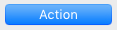

## Botón por defecto

La propiedad del botón por defecto designa el botón que obtiene el foco inicial en ejecución cuando ningún botón del formulario tiene la propiedad [Focusable](properties_Entry.md#focusable).

Sólo puede haber un botón por defecto por página de formulario.

Además, en macOS, la propiedad del botón por defecto modifica la apariencia del botón para indicar una "opción recomendada" al usuario y se vincula automáticamente a la tecla **Intro**, aunque no tenga el foco. El botón por defecto puede ser diferente del botón enfocado. Los botones por defecto tienen un aspecto azul específico en macOS:

> El botón debe tener una altura estándar para obtener la apariencia de botón por defecto.

En Windows, el concepto de "opción recomendada" no está soportado: sólo el botón enfocado tiene una apariencia diferente en tiempo de ejecución y la tecla **Intro** está vinculada al botón enfocado. Sin embargo, en el editor de formularios de 4D, el botón por defecto se representa con un contorno azul:

#### Gramática JSON

| Nombre        | Tipos de datos | Valores posibles |
| ------------- | -------------- | ---------------- |
| defaultButton | boolean        | true, false      |

#### Objetos soportados

[Botón regular ](button_overview.md#regular) - [Botón plano](button_overview.md#regular)

---

## Ocultar rectángulo de enfoque

Durante la ejecución, un campo o toda área introducible es delimitada por un rectángulo de selección cuando tiene el foco (a través de la tecla Tab o un simple clic). Puede ocultar este rectángulo activando esta propiedad. Ocultar el rectángulo de enfoque puede ser útil en el caso de interfaces específicas.

#### Gramática JSON

| Nombre        | Tipos de datos | Valores posibles |
| ------------- | -------------- | ---------------- |
| hideFocusRing | boolean        | true, false      |

#### Objetos soportados

[Áreas 4D Write Pro](writeProArea_overview.md) - [Lista jerárquica](list_overview.md) - [Área de entrada](input_overview.md) - [List Box](listbox_overview.md) - [Sub formulario](subform_overview.md)

---

## Ocultar resaltado selección

`List boxes de tipo selección`

Esta propiedad se utiliza para desactivar el resaltado de la selección en los list box.

Cuando esta opción está activada, el resaltado de la selección ya no es visible para las selecciones realizadas en los list box. Las selecciones en sí siguen siendo válidas y funcionan exactamente igual que antes; sin embargo, ya no se representan gráficamente en pantalla, y tendrá que [definir su apariencia por programación](listbox_overview.md#customizing-appearance-of-selected-rows).

Por defecto, esta opción no está activa.

#### Gramática JSON

| Nombre              | Tipos de datos | Valores posibles |
| ------------------- | -------------- | ---------------- |
| hideSystemHighlight | boolean        | true, false      |

#### Objetos soportados

[List Box](listbox_overview.md)

---

## Barra de desplazamiento horizontal

Una herramienta de interfaz que permite al usuario desplazar el área de visualización hacia la izquierda o la derecha.

Valores disponibles:

| Lista de propiedades | Valor JSON  | Descripción                                                                                                                                                                                         |
| -------------------- | ----------- | --------------------------------------------------------------------------------------------------------------------------------------------------------------------------------------------------- |
| Sí                   | "visible"   | La barra de desplazamiento está siempre visible, incluso cuando no es necesaria (es decir, cuando el tamaño del contenido del objeto es menor que el del marco). |
| No                   | "hidden"    | La barra de desplazamiento nunca es visible                                                                                                                                                         |
| Automático           | "automatic" | La barra de desplazamiento aparece automáticamente cuando es necesario y el usuario puede introducir un texto mayor que el ancho del objeto                                                         |

> Los objetos imagen pueden tener las barras de desplazamiento cuando el formato de visualización de la imagen está definido como "Truncado (no centrado)."

#### Gramática JSON

| Nombre              | Tipos de datos | Valores posibles                 |
| ------------------- | -------------- | -------------------------------- |
| scrollbarHorizontal | text           | "visible", "hidden", "automatic" |

#### Objetos soportados

[Lista jerárquica](list_overview.md#overview) - [Sub formulario](subform_overview.md#overview) - [List Box](listbox_overview.md#overview) - [Área de entrada](input_overview.md) - [Área 4D Write Pro](writeProArea_overview.md)

#### Ver también

[Barra de desplazamiento vertical](#vertical-scroll-bar)

---

## Resolution

Define la resolución de la pantalla para el contenido del área 4D Write Pro. Por defecto, se define a 72 ppp (macOS), que es la resolución estándar para los formularios 4D en todas las plataformas. Si se define esta propiedad en 96 ppp, se establecerá un renderizado Windows/Web tanto en plataformas macOS como Windows. Si se define esta propiedad como **automática** significa que la representación del documento diferirá entre las plataformas macOS y Windows.

#### Gramática JSON

| Nombre | Tipos de datos | Valores posibles    |
| ------ | -------------- | ------------------- |
| dpi    | number         | 0=automatic, 72, 96 |

#### Objetos soportados

[Área 4D Write Pro](writeProArea_overview.md)

---

## Mostrar el fondo

Muestra/oculta tanto las imágenes de fondo como el color de fondo.

#### Gramática JSON

| Nombre         | Tipos de datos | Valores posibles                             |
| -------------- | -------------- | -------------------------------------------- |
| showBackground | boolean        | true (por defecto), false |

#### Objetos soportados

[Área 4D Write Pro](writeProArea_overview.md)

---

## Mostrar los pies de página

Muestra/oculta los pies de página cuando el [modo visualización de la página ](#view-mode) está definido como "Página".

#### Gramática JSON

| Nombre      | Tipos de datos | Valores posibles                             |
| ----------- | -------------- | -------------------------------------------- |
| showFooters | boolean        | true (por defecto), false |

#### Objetos soportados

[Área 4D Write Pro](writeProArea_overview.md)

---

## Mostrar la barra de fórmula

Cuando está activada, la barra de fórmulas es visible debajo de la interfaz de la barra de herramientas en el área 4D View Pro. Si no se selecciona, la barra de fórmulas se oculta.

> Esta propiedad sólo está disponible para la interfaz de la [Barra de herramientas](#user-interface).

#### Gramática JSON

| Nombre         | Tipos de datos | Valores posibles                             |
| -------------- | -------------- | -------------------------------------------- |
| withFormulaBar | boolean        | true (por defecto), false |

#### Objetos soportados

[Área 4D View Pro](viewProArea_overview.md)

---

## Mostrar los encabezados

Muestra/oculta los encabezados cuando el [modo visualización de la página ](#view-mode) está definido como "Página".

#### Gramática JSON

| Nombre      | Tipos de datos | Valores posibles                             |
| ----------- | -------------- | -------------------------------------------- |
| showHeaders | boolean        | true (por defecto), false |

#### Objetos soportados

[Área 4D Write Pro](writeProArea_overview.md)

---

## Mostrar los caracteres ocultos

Muestra/oculta los caracteres invisibles

#### Gramática JSON

| Nombre          | Tipos de datos | Valores posibles                             |
| --------------- | -------------- | -------------------------------------------- |
| showHiddenChars | boolean        | true (por defecto), false |

#### Objetos soportados

[Área 4D Write Pro](writeProArea_overview.md)

---

## Mostrar la regla horizontal

Muestra/oculta la regla horizontal cuando la vista del documento está en modo [Página](#modo-de-vista).

#### Gramática JSON

| Nombre              | Tipos de datos | Valores posibles                             |
| ------------------- | -------------- | -------------------------------------------- |
| showHorizontalRuler | boolean        | true (por defecto), false |

#### Objetos soportados

[Área 4D Write Pro](writeProArea_overview.md)

---

## Mostrar HTML WYSYWIG

Activa/desactiva la vista HTML WYSIWYG, en la que se eliminan los atributos avanzados de 4D Write Pro que no son compatibles con todos los navegadores.

#### Gramática JSON

| Nombre          | Tipos de datos | Valores posibles                             |
| --------------- | -------------- | -------------------------------------------- |
| showHTMLWysiwyg | boolean        | true, false (por defecto) |

#### Objetos soportados

[Área 4D Write Pro](writeProArea_overview.md)

---

## Mostrar el marco de la página

Muestra/oculta el marco de la página cuando [modo visualización de página ](#view-mode) está definido como "Página".

#### Gramática JSON

| Nombre         | Tipos de datos | Valores posibles |
| -------------- | -------------- | ---------------- |
| showPageFrames | boolean        | true, false      |

#### Objetos soportados

[Área 4D Write Pro](writeProArea_overview.md)

---

## Mostrar las referencias

Muestra todas las expresiones 4D insertadas en el documento de 4D Write Pro como _referencias_. Cuando esta opción está desactivada, las expresiones 4D se muestran como _valores_. Por defecto, cuando se inserta un campo o expresión 4D, 4D Write Pro calcula y muestra su valor actual. Seleccione esta propiedad si desea saber qué campo o expresión se muestra. Las referencias de campo o de expresión aparecen entonces en su documento, con un fondo gris.

Por ejemplo, ha insertado la fecha actual junto con un formato, la fecha se muestra:

Con la propiedad Mostrar referencias activada, se muestra la referencia:

> Las expresiones 4D se pueden insertar con el comando `ST INSERT EXPRESSION`.

#### Gramática JSON

| Nombre         | Tipos de datos | Valores posibles                             |
| -------------- | -------------- | -------------------------------------------- |
| showReferences | boolean        | true, false (por defecto) |

#### Objetos soportados

[Área 4D Write Pro](writeProArea_overview.md)

---

## Mostrar regla vertical

Muestra/oculta la regla vertical cuando la vista del documento está en modo [Página](#view-mode).

#### Gramática JSON

| Nombre            | Tipos de datos | Valores posibles                             |
| ----------------- | -------------- | -------------------------------------------- |
| showVerticalRuler | boolean        | true (por defecto), false |

#### Objetos soportados

[Área 4D Write Pro](writeProArea_overview.md)

---

## Pestañas

Puede definir la dirección de las pestañas en sus formularios. Esta propiedad está disponible en todas las plataformas, pero sólo puede mostrarse en macOS. Puede elegir colocar los controles de las pestañas en la parte superior (estándar) o en la parte inferior.

Cuando los controles de pestañas con una dirección personalizada se muestran en Windows, vuelven automáticamente a la dirección estándar (superior).

#### Gramática JSON

| Nombre          | Tipos de datos | Valores posibles |
| --------------- | -------------- | ---------------- |
| labelsPlacement | boolean        | "top", "bottom"  |

#### Objetos soportados

[Control de pestañas](tabControl.md)

---

## Interfaz de usuario

Puede añadir una interfaz a las áreas 4D View Pro para permitir a los usuarios finales realizar modificaciones básicas y manipulaciones de datos. 4D View Pro ofrece dos interfaces opcionales a elegir, **Cinta** y **Barra de herramientas**.

#### Gramática JSON

| Nombre        | Tipos de datos | Valores posibles                                             |
| ------------- | -------------- | ------------------------------------------------------------ |
| userInterface | text           | "none" (por defecto), "ribbon", "toolbar" |

#### Objetos soportados

[Área 4D View Pro](viewProArea_overview.md)

#### Ver también

[Guía de referencia de 4D View Pro](../ViewPro/getting-started.md)

---

## Barra de desplazamiento vertical

Una herramienta de interfaz que permite al usuario mover el área de visualización hacia arriba y hacia abajo.

Valores disponibles:

| Lista de propiedades | Valor JSON  | Descripción                                                                                                                                                                                         |
| -------------------- | ----------- | --------------------------------------------------------------------------------------------------------------------------------------------------------------------------------------------------- |
| Sí                   | "visible"   | La barra de desplazamiento está siempre visible, incluso cuando no es necesaria (es decir, cuando el tamaño del contenido del objeto es menor que el del marco). |
| No                   | "hidden"    | La barra de desplazamiento nunca es visible                                                                                                                                                         |
| Automático           | "automatic" | La barra de desplazamiento aparece automáticamente cuando es necesario (es decir, cuando el tamaño del contenido del objeto es mayor que el del marco)                           |

> Los objetos imagen pueden tener las barras de desplazamiento cuando el formato de visualización de la imagen está definido como "Truncado (no centrado)."

> Si un objeto de entrada de texto no tiene una barra de desplazamiento, el usuario puede desplazarse por la información utilizando las teclas de flecha.

#### Gramática JSON

| Nombre            | Tipos de datos | Valores posibles                 |
| ----------------- | -------------- | -------------------------------- |
| scrollbarVertical | text           | "visible", "hidden", "automatic" |

#### Objetos soportados

[Lista jerárquica](list_overview.md#overview) - [Sub formulario](subform_overview.md#overview) - [List Box](listbox_overview.md#overview) - [Área de entrada](input_overview.md) - [Área 4D Write Pro](writeProArea_overview.md)

#### Ver también

[Barra de desplazamiento horizontal](#horizontal-scroll-bar)

---

## Modo de visualización

Establece el modo de visualización del documento de 4D Write Pro en el área del formulario. Hay tres valores disponibles:

- **Página**: el modo de vista más completo, que incluye contornos de página, orientación, márgenes, saltos de página, encabezados y pies de página, etc.
- **Borrador**: modo borrador con propiedades básicas del documento
- **Embedded**: modo de vista adecuado para zonas integradas; no muestra márgenes, pies de página, encabezados, marcos de página, etc. Este modo también se puede utilizar para producir una salida de vista similar a la de la web (si también selecciona la [resolución de 96 dpi ](#resolution) y las propiedades [Mostrar HTML WYSIWYG](#show-html-wysiwyg)).

> La propiedad Modo vista sólo se utiliza para la renderización en pantalla. En cuanto a la configuración de la impresión, se utilizan automáticamente reglas de renderización específicas.

#### Gramática JSON

| Nombre     | Tipos de datos | Valores posibles            |
| ---------- | -------------- | --------------------------- |
| layoutMode | text           | "page", "draft", "embedded" |

#### Objetos soportados

[Área 4D Write Pro](writeProArea_overview.md)

---

## Zoom

Define el porcentaje de zoom para mostrar el contenido del área 4D Write Pro.

#### Gramática JSON

| Nombre | Tipos de datos | Valores posibles |
| ------ | -------------- | ---------------- |
| zoom   | number         | mínimo = 0       |

#### Objetos soportados

[Área 4D Write Pro](writeProArea_overview.md)
