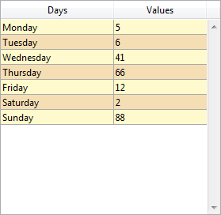

## Color de fondo alternado

Permite definir un color de fondo diferente para las líneas o columnas impares de un list box. Por defecto, _Automático_ está seleccionado: la columna utiliza el color de fondo alternativo definido en el nivel del list box.

También puede definir esta propiedad utilizando el comando [`OBJECT SET RGB COLORS`](https://doc.4d.com/4dv20/help/command/en/page628.html).

#### Gramática JSON

| Nombre        | Tipos de datos | Valores posibles                                                        |
| ------------- | -------------- | ----------------------------------------------------------------------- |
| alternateFill | string         | todos los valores css; "transparent"; "automatic"; "automaticAlternate" |

#### Objetos soportados

[List Box](listbox_overview.md#overview) - [Columna List Box](listbox_overview.md#list-box-columns)

---

## Color de fondo / Color de relleno

Define el color de fondo de un objeto.

En el caso de un list box, por defecto se selecciona _Automático_: la columna utiliza el color de fondo definido al nivel del list box.

También puede definir esta propiedad utilizando el comando [`OBJECT SET RGB COLORS`](https://doc.4d.com/4dv20/help/command/en/page628.html).

#### Gramática JSON

| Nombre | Tipos de datos | Valores posibles                         |
| ------ | -------------- | ---------------------------------------- |
| fill   | string         | un valor css; "transparent"; "automatic" |

#### Objetos soportados

[Lista jerárquica](list_overview.md) - [Entrada](input_overview.md) - [List Box](listbox_overview.md) - [Columna List Box](listbox_overview.md#list-box-columns) - [Pie List Box](listbox_overview.md#list-box-footers) - [Óvalo](shapes_overview.md#oval) - [Rectángulo](shapes_overview.md#rectangle) - [Área de texto](text.md)

#### Ver también

[Transparente](#transparente)

---

## Expresión color de fondo

`List box de tipo colección y de tipo selección de entidades`

Una expresión o una variable (no se pueden utilizar variables array) para aplicar un color de fondo personalizado a cada línea del list box. La expresión o la variable se evaluará para cada línea mostrada y debe devolver un valor de color RGB. Para más información, consulte la descripción del comando [`OBJECT SET RGB COLORS`](https://doc.4d.com/4dv20/help/command/en/page628.html) en el _Manual de Referencia del Lenguaje 4D_.

También puede establecer esta propiedad utilizando el comando [`LISTBOX SET PROPERTY`](https://doc.4d.com/4dv20/help/command/en/page1440.html) con la constante `lk background color expression`.

> Con los list box de tipo colección o selección de entidades, esta propiedad también puede definirse utilizando una [Meta Info Expression](properties_Text.md#meta-info-expression).

#### Gramática JSON

| Nombre        | Tipos de datos | Valores posibles                                 |
| ------------- | -------------- | ------------------------------------------------ |
| rowFillSource | string         | Una expresión que devuelve un valor de color RGB |

#### Objetos soportados

[List Box](listbox_overview.md#overview) - [Columna List Box](listbox_overview.md#list-box-columns)

---

## Estilo del borde

Permite definir un estilo estándar para el borde del objeto.

#### Gramática JSON

| Nombre      | Tipos de datos | Valores posibles                                                  |
| ----------- | -------------- | ----------------------------------------------------------------- |
| borderStyle | text           | "system", "none", "solid", "dotted", "raised", "sunken", "double" |

#### Objetos soportados

[4D View Pro Area](viewProArea_overview.md) - [4D Write Pro areas](writeProArea_overview.md) - [Buttons](button_overview.md) - [Button Grid](buttonGrid_overview.md) - [Hierarchical List](list_overview.md#overview) - [Input](input_overview.md) - [List Box](listbox_overview.md#overview) - [Picture Button](pictureButton_overview.md) - [Picture Pop-up Menu](picturePopupMenu_overview.md) - [Plug-in Area](pluginArea_overview.md#overview) - [Progress Indicator](progressIndicator.md) - [Ruler](ruler.md) - [Spinner](spinner.md) - [Stepper](stepper.md) - [Subform](subform_overview.md#overview) - [Text Area](text.md) - [Web Area](webArea_overview.md#overview)

---

## Tipo de línea punteada

Describe el tipo de línea punteada como una secuencia de puntos blancos y negros.

#### Gramática JSON

| Nombre          | Tipos de datos             | Valores posibles                                                                                                                                 |
| --------------- | -------------------------- | ------------------------------------------------------------------------------------------------------------------------------------------------ |
| strokeDashArray | arrays numéricos o cadenas | Ej. "6 1" o \[6,1\] para una secuencia de 6 puntos negros y 1 punto blanco |

#### Objetos soportados

[Rectángulo](shapes_overview.md#rectangle) - [Óvalo](shapes_overview.md#oval) - [Línea](shapes_overview.md#line)

---

## Ocultar líneas vacías finales

Controla la visualización de las líneas vacías adicionales añadidas en la parte inferior de un objeto list box. Por defecto, 4D añade esas líneas adicionales para llenar el área vacía:


Puede eliminar estas líneas vacías seleccionando esta opción. La parte inferior del objeto del list box se deja vacía:



#### Gramática JSON

| Nombre             | Tipos de datos | Valores posibles |
| ------------------ | -------------- | ---------------- |
| hideExtraBlankRows | boolean        | true, false      |

#### Objetos soportados

[List Box](listbox_overview.md#overview)

---

## Color de línea

Designa el color de las líneas del objeto.
El color puede ser especificado por:

- un nombre de color - como "red"
- un valor HEX - como "# ff0000"
- un valor RVB - como "rgb (255,0,0)"

También puede definir esta propiedad utilizando el comando [`OBJECT SET RGB COLORS`](https://doc.4d.com/4dv20/help/command/en/page628.html).

#### Gramática JSON

| Nombre | Tipos de datos | Valores posibles                         |
| ------ | -------------- | ---------------------------------------- |
| stroke | string         | un valor css, "transparent", "automatic" |

> Esta propiedad también está disponible para los objetos basados en texto, en cuyo caso designa tanto el color de la fuente como las líneas del objeto, ver [Color de la fuente](properties_Text.md#font-color).

#### Objetos soportados

[Línea](shapes_overview.md#line) - [Óvalo](shapes_overview.md#oval) - [Rectángulo](shapes_overview.md#rectangle)

---

## Ancho de línea

Designa el grosor de una línea.

#### Gramática JSON

| Nombre      | Tipos de datos | Valores posibles                                                                       |
| ----------- | -------------- | -------------------------------------------------------------------------------------- |
| strokeWidth | number         | 0 para el ancho más pequeño en un formulario impreso, o cualquier valor de entero < 20 |

#### Objetos soportados

[Línea](shapes_overview.md#line) - [Óvalo](shapes_overview.md#oval) - [Rectángulo](shapes_overview.md#rectangle)

---

## Array colores de fondo

`List boxes de tipo array`

El nombre de un array para aplicar un color de fondo personalizado a cada línea o columna del list box.

Debe introducirse el nombre de un array Entero largo. Cada elemento de este array corresponde a una línea del list box (si se aplica al list box) o a una celda de la columna (si se aplica a una columna), por lo que el array debe tener el mismo tamaño que el array asociado a la columna. Puede utilizar las constantes del tema [SET RGB COLORS](https://doc.4d.com/4Dv20/4D/20.1/SET-RGB-COLORS.302-6481080.en.html). Si desea que la celda herede el color de fondo definido en el nivel superior, pase el valor -255 al elemento del array correspondiente.

Por ejemplo, dado un list box en el que las líneas tienen un color gris/gris claro alternado, definido en las propiedades del list box. También se ha definido para el list box un array de color de fondo con el fin de cambiar a naranja claro el color de las líneas en las que al menos un valor es negativo:

```4d
 <>_BgndColors{$i}:=0x00FFD0B0 // naranja
 <>_BgndColors{$i}:=-255 // valor por defecto
```


A continuación, quiere colorear las celdas con valores negativos en naranja oscuro. Para ello, se define un array de colores de fondo para cada columna, por ejemplo `<>_BgndColor_1`, `<>_BgndColor_2` y `<>_BgndColor_3`. Los valores de estos arrays tienen prioridad sobre los definidos en las propiedades del list box, así como los del array de color de fondo general:

```4d
 <>_BgndColorsCol_3{2}:=0x00FF8000 // naranja oscuro
 <>_BgndColorsCol_2{5}:=0x00FF8000
 <>_BgndColorsCol_1{9}:=0x00FF8000
 <>_BgndColorsCol_1{16}:=0x00FF8000
```


Puede obtener el mismo resultado utilizando los comandos [`LISTBOX SET ROW FONT STYLE`](https://doc.4d.com/4dv20/help/command/en/page1268.html) y [`LISTBOX SET ROW COLOR`](https://doc.4d.com/4dv20/help/command/en/page1270.html). Tienen la ventaja de permitirle omitir el tener que predefinir arrays de estilo/color para las columnas: en su lugar son creadas dinámicamente por los comandos.

#### Gramática JSON

| Nombre        | Tipos de datos | Valores posibles                                    |
| ------------- | -------------- | --------------------------------------------------- |
| rowFillSource | string         | El nombre de un array entero largo. |

#### Objetos soportados

[List Box](listbox_overview.md) - [Columna List Box](listbox_overview.md#list-box-columns)

---

## Transparente

Define el fondo del list box como "Transparent". Cuando se define, se ignora cualquier [color de fondo alternativo](#alternate-background-color) o [color de fondo](#background-color-fill-color) definido para la columna.

#### Gramática JSON

| Nombre | Tipos de datos | Valores posibles |
| ------ | -------------- | ---------------- |
| fill   | text           | "transparent"    |

#### Objetos soportados

[List Box](listbox_overview.md#overview)

#### Ver también

[Background Color / Fill Color](#background-color-fill-color)
