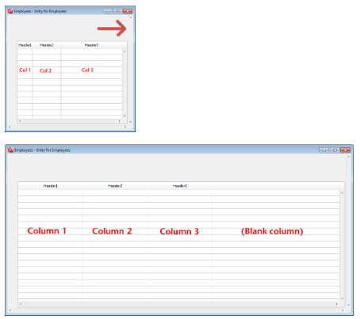

## Redimensionamiento columnas auto

When this property is enabled (`rightToLeft` value in JSON), list box columns are automatically resized along with the list box, within the limits of the [minimum](properties_CoordinatesAndSizing.md#minimum-width) and [maximum](properties_CoordinatesAndSizing.md#maximum-width) widths defined.

When this property is disabled (`legacy` value in JSON), only the rightmost column of the list box is resized, even if its width exceeds the maximum value defined.

### Cómo funciona el redimensionamiento automático de las columnas

- As the list box width increases, its columns are enlarged, one by one, starting from right to left, until each reaches its [maximum width](properties_CoordinatesAndSizing.md#maximum-width). Only columns with the [Resizable](#resizable) property selected are resized.

- The same procedure applies when the list box width decreases, but in reverse order (_i.e._, columns are resized starting from left to right). When each column has reached its [minimum width](properties_CoordinatesAndSizing.md#minimum-width), the horizontal scroll bar becomes active again.

- Columns are resized only when the horizontal scroll bar is not "active"; _i.e._, all columns are fully visible in the list box at its current size. **Note**: If the horizontal scroll bar is hidden, this does not alter its state: a scroll bar may still be active, even though it is not visible.

- Una vez que todas las columnas alcanzan su tamaño máximo, dejan de ampliarse y en su lugar se añade una columna en blanco (falsa) a la derecha para rellenar el espacio extra. Si hay una columna falsa (en blanco), cuando el ancho del list box disminuye, ésta es la primera área que se reduce.

#### Sobre la columna falsa (en blanco)

La apariencia de la columna falsa coincide con la de las columnas existentes; tendrá un encabezado y/o un pie de página falsos si estos elementos están presentes en las columnas del list box existentes y tendrá aplicados los mismos colores de fondo.

The fake header and/or footer can be clicked but this does not have any effect on the other columns (e.g.: no sort is performed); nevertheless, the `On Clicked`, `On Header Click` and `On Footer Click` events are generated accordingly.

If a cell in the fake column is clicked, the [LISTBOX GET CELL POSITION](https://doc.4d.com/4Dv17R6/4D/17-R6/LISTBOX-GET-CELL-POSITION.301-4311145.en.html) command returns "X+1" for its column number (where X is the number of existing columns).

#### Gramática JSON

| Nombre       | Tipos de datos | Valores posibles        |
| ------------ | -------------- | ----------------------- |
| resizingMode | string         | "rightToLeft", "legacy" |

#### Objetos soportados

[List Box](listbox_overview.md)

---

## Dimensionamiento horizontal

Esta propiedad indica si el tamaño horizontal de un objeto debe ser movido o redimensionado cuando un usuario cambia el tamaño del formulario. It can also be set dynamically by the `OBJECT SET RESIZING OPTIONS` language command.

Hay tres opciones disponibles:

| Option   | Valor JSON | Result                                                                                                                                                |
| -------- | ---------- | ----------------------------------------------------------------------------------------------------------------------------------------------------- |
| Agrandar | "grow"     | El mismo porcentaje se aplica al ancho del objeto cuando el usuario redimensiona el ancho de la ventana,                                              |
| Mover    | "move"     | El objeto se desplaza la misma cantidad a la izquierda o a la derecha que el aumento del ancho cuando el usuario redimensiona el ancho de la ventana, |
| Ninguno  | "fixed"    | El objeto permanece inmóvil cuando se cambia el tamaño del formulario                                                                                 |

> This property works in conjunction with the [Vertical Sizing](#vertical-sizing) property.

#### Gramática JSON

| Nombre  | Tipos de datos | Valores posibles        |
| ------- | -------------- | ----------------------- |
| sizingX | string         | "grow", "move", "fixed" |

#### Objetos soportados

[4D View Pro Area](viewProArea_overview.md) - [4D Write Pro Area](writeProArea_overview.md) - [Button](button_overview.md) - [Button Grid](buttonGrid_overview.md) - [Check Box](checkbox_overview.md) - [Combo Box](comboBox_overview.md) - [Dropdown list](dropdownList_Overview.md) - [Group Box](groupBox.md) - [Hierarchical List](list_overview.md#overview) - [Input](input_overview.md) - [List Box](listbox_overview.md#overview) - [Line](shapes_overview.md#line) - [List Box Column](listbox_overview.md#list-box-columns) - [Oval](shapes_overview.md#oval) - [Picture Button](pictureButton_overview.md) - [Picture Pop up menu](picturePopupMenu_overview.md) - [Plug-in Area](pluginArea_overview.md#overview) - [Progress Indicators](progressIndicator.md) - [Radio Button](radio_overview.md) - [Ruler](ruler.md) - [Rectangle](shapes_overview.md#rectangle) - [Spinner](spinner.md) - [Splitter](splitters.md) - [Static Picture](staticPicture.md) - [Stepper](stepper.md) - [Subform](subform_overview.md) - [Tab control](tabControl.md) - [Web Area](webArea_overview.md#overview)

---

## Dimensionamiento vertical

Esta propiedad indica si el tamaño vertical de un objeto debe ser movido o redimensionado cuando un usuario cambia el tamaño del formulario. It can also be set dynamically by the `OBJECT SET RESIZING OPTIONS` language command.

Hay tres opciones disponibles:

| Option   | Valor JSON | Result                                                                                                                                                |
| -------- | ---------- | ----------------------------------------------------------------------------------------------------------------------------------------------------- |
| Agrandar | "grow"     | El mismo porcentaje se aplica a la altura del objeto cuando el usuario redimensiona el ancho de la ventana,                                           |
| Mover    | "move"     | El objeto se desplaza la misma cantidad hacia arriba o hacia abajo que el aumento de la altura cuando el usuario redimensiona el ancho de la ventana, |
| Ninguno  | "fixed"    | El objeto permanece inmóvil cuando se cambia el tamaño del formulario                                                                                 |

> This property works in conjunction with the [Horizontal Sizing](#horizontal-sizing) property.

#### Gramática JSON

| Nombre  | Tipos de datos | Valores posibles        |
| ------- | -------------- | ----------------------- |
| sizingY | string         | "grow", "move", "fixed" |

#### Objetos soportados

[4D View Pro Area](viewProArea_overview.md) - [4D Write Pro Area](writeProArea_overview.md) - [Button](button_overview.md) - [Button Grid](buttonGrid_overview.md) - [Check Box](checkbox_overview.md) - [Combo Box](comboBox_overview.md) - [Dropdown list](dropdownList_Overview.md) - [Group Box](groupBox.md) - [Hierarchical List](list_overview.md#overview) - [Input](input_overview.md) - [List Box](listbox_overview.md#overview) - [Line](shapes_overview.md#line) - [List Box Column](listbox_overview.md#list-box-columns) - [Oval](shapes_overview.md#oval) - [Picture Button](pictureButton_overview.md) - [Picture Pop up menu](picturePopupMenu_overview.md) - [Plug-in Area](pluginArea_overview.md#overview) - [Progress Indicators](progressIndicator.md) - [Radio Button](radio_overview.md) - [Ruler](ruler.md) - [Rectangle](shapes_overview.md#rectangle) - [Spinner](spinner.md) - [Splitter](splitters.md) - [Static Picture](staticPicture.md) - [Stepper](stepper.md) - [Subform](subform_overview.md) - [Tab control](tabControl.md) - [Web Area](webArea_overview.md#overview)

---

## Pulsador

Cuando un objeto splitter tiene esta propiedad, los otros objetos a su derecha (splitter vertical) o debajo de él (separador horizontal) son empujados al mismo tiempo que el splitter, sin parar.

Here is the result of a “pusher” splitter being moved:

Cuando esta propiedad no se aplica al splitter, el resultado es el siguiente:

#### Gramática JSON

| Nombre       | Tipos de datos |                              Valores posibles                              |
| :----------- | :------------: | :------------------------------------------------------------------------: |
| splitterMode |     string     | "move" (pusher), "resize" (standard) |

#### Objetos soportados

[Splitter](splitters.md)

---

## Redimensionable

Designa si el tamaño de la columna puede ser modificado por el usuario.

#### Gramática JSON

| Nombre          | Tipos de datos | Valores posibles |
| :-------------- | :------------: | :--------------: |
| redimensionable |     boolean    |  "true", "false" |

#### Objetos soportados

[List Box Column](listbox_overview.md#list-box-columns)
