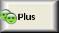
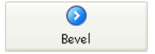
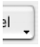

## Ruta de acceso fondo

Define la ruta de la imagen que se dibujará en el fondo del objeto. If the object uses an [icon](#picture-pathname) with [different states](#number-of-states), the background picture will automatically support the same number of states.

The pathname to enter is similar as for the [Pathname property for static pictures](properties_Picture.md#pathname).

#### Gramática JSON

| Nombre                  | Tipos de datos | Valores posibles                                                                                                                              |
| ----------------------- | -------------- | --------------------------------------------------------------------------------------------------------------------------------------------- |
| customBackgroundPicture | string         | Ruta relativa en sintaxis POSIX. Debe utilizarse junto con la opción "Personalizado" de la propiedad "Style". |

#### Objetos soportados

[Custom Button](button_overview.md#custom) - [Custom Check Box](checkbox_overview.md#custom) - [Custom Radio Button](radio_overview.md#custom)

---

## Estilos de botón

Aspecto general del botón. El estilo del botón también influye en la disponibilidad de ciertas opciones.

#### Gramática JSON

| Nombre | Tipos de datos | Valores posibles                                                                                                                                                   |
| :----: | :------------: | ------------------------------------------------------------------------------------------------------------------------------------------------------------------ |
|  style |      text      | "regular", "flat", "toolbar", "bevel", "roundedBevel", "gradientBevel", "texturedBevel", "office", "help", "circular", "disclosure", "roundedDisclosure", "custom" |

#### Objetos soportados

[Button](button_overview.md) - [Radio Button](radio_overview.md) - [Check Box](checkbox_overview.md) - [Radio Button](radio_overview.md)

---

## Margen horizontal

Esta propiedad permite definir el tamaño (en píxeles) de los márgenes horizontales del botón. Este margen delimita el área que el icono del botón y el título no deben sobrepasar.

Este parámetro es útil, por ejemplo, cuando la imagen de fondo contiene bordes:

| Con / Sin                | Ejemplo                                                      |
| ------------------------ | ------------------------------------------------------------ |
| Sin margen               |  |
| Con un margen 13 píxeles |  |

> This property works in conjunction with the [Vertical Margin](#vertical-margin) property.

#### Gramática JSON

| Nombre        | Tipos de datos | Valores posibles                                                                   |
| ------------- | -------------- | ---------------------------------------------------------------------------------- |
| customBorderX | number         | Para usar con el estilo "personalizado". Mínimo: 0 |

#### Objetos soportados

[Custom Button](button_overview.md#custom) - [Custom Check Box](checkbox_overview.md#custom) - [Custom Radio Button](radio_overview.md#custom)

---

## Ubicación del icono

Designa la ubicación de un icono en relación con el objeto formulario.

#### Gramática JSON

| Nombre        | Tipos de datos | Valores posibles        |
| ------------- | -------------- | ----------------------- |
| iconPlacement | string         | "none", "left", "right" |

#### Objetos soportados

[List Box Header](listbox_overview.md#list-box-headers)

---

## Desplazamiento icono

Define un valor de desplazamiento personalizado en píxeles, que se utilizará cuando se haga clic en el botón

El título del botón se desplazará hacia la derecha y hacia la parte inferior por el número de píxeles introducidos. Esto permite aplicar un efecto 3D personalizado cuando se presiona el botón.

#### Gramática JSON

| Nombre       | Tipos de datos | Valores posibles          |
| ------------ | -------------- | ------------------------- |
| customOffset | number         | mínimo: 0 |

#### Objetos soportados

[Custom Button](button_overview.md#custom) - [Custom Check Box](checkbox_overview.md#custom) - [Custom Radio Button](radio_overview.md#custom)

---

## Número de estados

This property sets the exact number of states present in the picture used as the icon for a [button with icon](button_overview.md), a [check box](checkbox_overview.md) or a custom [radio button](radio_overview.md).

La imagen puede contener de 2 a 6 estados.

- 2 estados: false, true
- 3 estados: false, true, rollover,
- 4 estados: false, true, rollover, desactivado,
- 5 estados (sólo para casillas de verificación y botones radio): false, true, rollover false, rollover true, desactivado
- 6 estados (sólo para casillas de verificación y botones radio): false, true, false rollover, true rollover, false desactivado, true desactivado.

:::note

- "false" significa botón no presionado/no seleccionado o casilla desmarcada (valor de la variable=0)
- "true" significa botón presionado/seleccionado o casilla marcada (valor de la variable=1)

:::

Cada estado está representado por una imagen diferente. En la imagen fuente, los estados deben apilarse verticalmente:

#### Gramática JSON

| Nombre     | Tipos de datos | Valores posibles                                                                    |
| ---------- | -------------- | ----------------------------------------------------------------------------------- |
| iconFrames | number         | Número de estados en la imagen del icono. Mínimo: 1 |

#### Objetos soportados

[Button](button_overview.md) (all styles except [Help](button_overview.md#help)) - [Check Box](checkbox_overview.md) - [Radio Button](radio_overview.md)

---

## Ruta de acceso de la imagen

Define la ruta de la imagen que se utilizará como icono del objeto.

The pathname to enter is similar as for the [Pathname property for static pictures](properties_Picture.md#pathname).

> When used as icon for active objects, the picture must be designed to support a variable [number of states](#number-of-states).

#### Gramática JSON

| Nombre | Tipos de datos | Valores posibles                                              |
| ------ | -------------- | ------------------------------------------------------------- |
| icon   | picture        | Ruta relativa o filesystem en sintaxis POSIX. |

#### Objetos soportados

[Button](button_overview.md) (all styles except [Help](button_overview.md#help)) - [Check Box](checkbox_overview.md) - [List Box Header](listbox_overview.md#list-box-headers) - [Radio Button](radio_overview.md)

---

## Posición título/imagen

Esta propiedad permite modificar la ubicación relativa del título del botón en relación con el icono asociado. Esta propiedad no tiene efecto cuando el botón sólo contiene un título (sin imagen asociada) o una imagen (sin título). Por defecto, cuando un botón contiene un título y una imagen, el texto se coloca debajo de la imagen.

Aquí están los resultados utilizando las distintas opciones para esta propiedad:

| Option       | Descripción                                                                                                                                                                       | Ejemplo                                                           |
| ------------ | --------------------------------------------------------------------------------------------------------------------------------------------------------------------------------- | ----------------------------------------------------------------- |
| **Left**     | El texto se coloca a la izquierda del icono. El contenido del botón se alinea a la derecha.                                                       |   |
| **Top**      | El texto se coloca debajo del icono. El contenido del botón está centrado.                                                                        |       |
| **Right**    | El texto se coloca a la derecha del icono. El contenido del botón se alinea a la izquierda.                                                       |     |
| **Bottom**   | El texto se coloca sobre el icono. El contenido del botón está centrado.                                                                          |    |
| **Centered** | El texto del icono está centrado vertical y horizontalmente en el botón. Este parámetro es útil, por ejemplo, para el texto incluido en un icono. |  |

#### Gramática JSON

| Nombre        | Tipos de datos | Valores posibles                           |
| ------------- | -------------- | ------------------------------------------ |
| textPlacement | string         | "left", "top", "right", "bottom", "center" |

#### Objetos soportados

[Button](button_overview.md) (all styles except [Help](button_overview.md#help)) - [Check Box](checkbox_overview.md) - [Radio Button](radio_overview.md)

---

## Posición título imagen

This property allows you to define whether the title and the picture of the button should be visually adjoined or separated, according to the [Title/Picture position](#titlepicture-position) and [Horizontal Alignment](#horizontal-alignment) properties.

Esta propiedad no tiene efecto cuando el botón sólo contiene un título (sin imagen asociada) o una imagen (sin título).

Por defecto, cuando un botón contiene un título y una imagen, los elementos se unen. The following graphic shows the effect of the `imageHugsTitle` property (true when property is enabled) with different button alignments:

#### Gramática JSON

| Nombre         | Tipos de datos | Valores posibles                             |
| -------------- | -------------- | -------------------------------------------- |
| imageHugsTitle | boolean        | true (por defecto), false |

#### Objetos soportados

[Button](button_overview.md) (all styles except Help) - [Check Box](checkbox_overview.md) (all styles except Regular, Flat, Disclosure and Collapse/Expand) - [Radio Button](radio_overview.md) (all styles except Regular, Flat, Disclosure and Collapse/Expand).

---

## Margen vertical

Esta propiedad permite definir el tamaño (en píxeles) de los márgenes verticales del botón. Este margen delimita el área que el icono del botón y el título no deben sobrepasar.

Este parámetro es útil, por ejemplo, cuando la imagen de fondo contiene bordes.

> This property works in conjunction with the [Horizontal Margin](#horizontal-margin) property.

#### Gramática JSON

| Nombre        | Tipos de datos | Valores posibles                                                                   |
| ------------- | -------------- | ---------------------------------------------------------------------------------- |
| customBorderY | number         | Para usar con el estilo "personalizado". Mínimo: 0 |

#### Objetos soportados

[Custom Button](button_overview.md#custom) - [Custom Check Box](checkbox_overview.md#custom) - [Custom Radio Button](radio_overview.md#custom)

---

## Con menú pop-up

Esta propiedad permite mostrar un símbolo que aparece como un triángulo en el botón para indicar la presencia de un menú emergente adjunto:

La apariencia y ubicación de este símbolo depende del estilo del botón y de la plataforma actual.

### Vinculados y separados

Para asociar un símbolo de menú emergente a un botón, hay dos opciones de visualización disponibles:

|                         Enlazado                        |                          Separado                          |
| :-----------------------------------------------------: | :--------------------------------------------------------: |
|  |  |

> La disponibilidad efectiva de un modo "separado" depende del estilo del botón y de la plataforma.

Cada opción precisa la relación entre el botón y el menú emergente asociado:

- Cuando el menú emergente está **separado**, al hacer clic en la parte izquierda del botón se ejecuta directamente la acción actual del botón; esta acción puede modificarse mediante el menú emergente accesible en la parte derecha del botón.
- Cuando el menú emergente está **vinculado**, un simple clic en el botón sólo muestra el menú emergente. Sólo la selección de la acción en el menú emergente provoca su ejecución.

:::info

Refer to the [`On Alternative Click` event description](../Events/onAlternativeClick.md) for more information on the handling of events in this case.

:::

### Gestión del menú emergente

Es importante señalar que la propiedad "Con menú emergente" sólo gestiona el aspecto gráfico del botón. The display of the pop-up menu and its values must be handled entirely by the developer, more particularly using `form events` and the [`Dynamic pop up menu`](https://doc.4d.com/4dv19R7/help/command/en/page1006.html) and [`Pop up menu`](https://doc.4d.com/4dv19R7/help/command/en/page542.html) commands.

#### Gramática JSON

| Nombre         | Tipos de datos | Valores posibles                                     |
| :------------- | -------------- | ---------------------------------------------------- |
| popupPlacement | string         | <li>"none"</li><li>"linked"</li><li>"separated"</li> |

#### Objetos soportados

[Toolbar Button](button_overview.md#toolbar) - [Bevel Button](button_overview.md#bevel) - [Rounded Bevel Button](button_overview.md#Rounded-bevel) - [OS X Gradient Button](button_overview.md#os-x-gradient) - [OS X Textured Button](button_overview.md#os-x-textured) - [Office XP Button](button_overview.md#office-XP) - [Circle Button](button_overview.md#circle) - [Custom](button_overview.md#custom)
