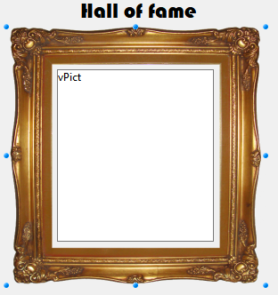

Static pictures are [static objects](formObjects_overview.md#active-and-static-objects) that can be used for various purposes in 4D forms, including decoration, background, or user interface:

Las imágenes estáticas se almacenan fuera de los formularios y se insertan por referencia. En el editor de formularios, los objetos imagen estáticos se crean mediante operaciones de copiar/pegar o arrastrar y soltar.

> Si coloca una imagen estática en la página 0 de un formulario de varias páginas, aparecerá automáticamente como elemento de fondo en todas las páginas. También puede incluirlo en un formulario heredado, aplicado en el fondo de otros formularios diferentes. De cualquier manera, su aplicación funcionará más rápido que si la imagen se pegara en cada página.

## Formato y ubicación

La imagen original debe estar almacenada en un formato gestionado de forma nativa por 4D (4D reconoce los principales formatos de imagen: JPEG, PNG, BMP, SVG, GIF, etc.).

Se pueden utilizar dos ubicaciones principales para la trayectoria de la imagen estática:

- in the **Resources** folder of the project. Apropiado cuando se desea compartir imágenes estáticas entre varios formularios en el proyecto. In this case, the Pathname is in the "/RESOURCES/\\<picture path\>".
- in an image folder (e.g. named **Images**) within the form folder. Conveniente cuando las imágenes estáticas se utilizan sólo en el formulario y/o se quiere poder mover o duplicar todo el formulario dentro del proyecto o de diferentes proyectos. En este caso, el nombre de la ruta es "<\picture path\>" y se resuelve desde la raíz de la carpeta del formulario.

## Propiedades soportadas

[Bottom](properties_CoordinatesAndSizing.md#bottom) - [CSS Class](properties_Object.md#css-class) - [Display](properties_Picture.md#display) - [Height](properties_CoordinatesAndSizing.md#height) - [Horizontal Sizing](properties_ResizingOptions.md#horizontal-sizing) - [Left](properties_CoordinatesAndSizing.md#left) - [Object Name](properties_Object.md#object-name) - [Pathname](properties_Picture.md#pathname) - [Right](properties_CoordinatesAndSizing.md#right) - [Top](properties_CoordinatesAndSizing.md#top) - [Type](properties_Object.md#type) - [Vertical Sizing](properties_ResizingOptions.md#vertical-sizing) - [Visibility](properties_Display.md#visibility)  - [Width](properties_CoordinatesAndSizing.md#width)
