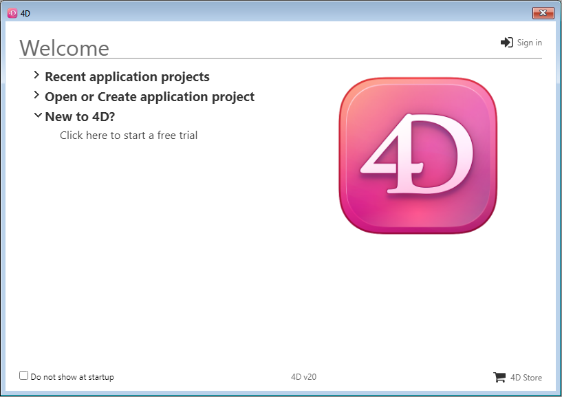

¡Bienvenido a 4D! ¡Bienvenido a 4D! A continuación encontrará toda la información necesaria sobre cómo instalar y registrar su aplicación 4D. Welcome to 4D! On this page, you will find all of the necessary information about installing and launching your 4D product.

## Configuración requerida

The [Product Download](https://us.4d.com/product-download) page on the 4D website provides information about the minimum macOS / Windows system requirements for your 4D series.

Additional technical details are available on the 4D website's [Resources page](https://us.4d.com/resources/feature-release).

## Instalación en disco

Los productos 4D se instalan desde el sitio web de 4D:

1. Connect to the 4D website and go to the [Downloads](https://us.4d.com/product-download) page.

2. Haga clic en el enlace de descarga de su producto 4D y siga las instrucciones en pantalla.

## Conexión

Una vez que haya completado la instalación, puede iniciar 4D e iniciar la sesión. Para ello, haga doble clic en el icono del producto 4D.

A continuación, aparece el Asistente de bienvenida:

- If you want to discover and explore 4D, click on the **free trial** link. Sólo se le pedirá que se registre o que cree una cuenta 4D.

- If you already have a 4D account, click on the **Sign in** link in the upper right side of the Welcome Wizard dialog and enter your account information. Toda licencia 4D ya registrada se actualiza automáticamente (o se cargan paquetes de expansión adicionales) en su máquina.

Expand the **Open or create project application** area and select the action you want to perform:

- **Connect to 4D Server** - use 4D as a remote client and connect to an application that is already loaded by 4D Server.

- **Open a local application project** - load an existing application project stored on your disk.

- **Create a new application project** - create a new, empty application project on your disk.

¡Disfrute de su experiencia 4D!

:::info

¿Necesita activar licencias específicas? Visit the [Managing 4D licenses](../Admin/licenses.md) page.

:::
