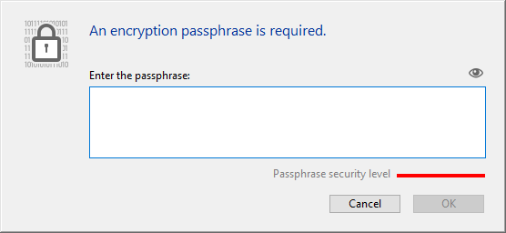

You can use this page to encrypt or _decrypt_ (i.e. remove encryption from) the data file, according to the **Encryptable** attribute status defined for each table in the database.

:::info

For detailed information about data encryption in 4D, please refer to the [Encrypting data](https://doc.4d.com/4Dv20/4D/20/Encrypting-data.300-6263735.en.html) section in the _Design Reference_ manual. You can also read the [A deeper look into 4D data encryption](https://blog.4d.com/a-deeper-look-into-4d-data-encryption/) blog post.

:::

Se crea una nueva carpeta cada vez que se realiza una operación de cifrado/descifrado. It is named "Replaced Files (Encrypting) _yyyy-mm-dd hh-mm-ss_> or "Replaced Files (Decrypting) _yyyy-mm-dd hh-mm-ss_".

> Encryption is only available in [maintenance mode](overview.md#display-in-maintenance-mode). Si intenta realizar esta operación en modo estándar, un diálogo de advertencia le informará de que la aplicación se cerrará y se reiniciará en modo de mantenimiento

**Warning:**

- Cifrar un archivo de datos es una operación de larga duración. Muestra un indicador de progreso (que puede ser interrumpido por el usuario). Tenga en cuenta también que una operación de encriptación de una aplicación incluye un paso de compactación.
- Cada operación de cifrado produce una copia del archivo de datos, lo que aumenta el tamaño de la carpeta de la aplicación. Es importante tener esto en cuenta (especialmente en macOS, donde las aplicaciones 4D aparecen como paquetes) para que el tamaño de la aplicación no aumente excesivamente. Mover o eliminar manualmente las copias del archivo original dentro del paquete puede ser útil para minimizar el tamaño del paquete.

## Cifrar datos por primera vez

Para cifrar los datos por primera vez con el CSM es necesario seguir los siguientes pasos:

1. In the Structure editor, check the **Encryptable** attribute for each table whose data you want to encrypt. Ver la sección "Propiedades de las tablas".
2. Abra la página de encriptación del CSM.
   If you open the page without setting any tables as **Encryptable**, the following message is displayed in the page:
   
   Otherwise, the following message is displayed:
   

   This means that the **Encryptable** status for at least one table has been modified and the data file still has not been encrypted.
   \*\*Note: \*\*The same message is displayed when the **Encryptable** status has been modified in an already encrypted data file or after the data file has been decrypted (see below).

3. Click on the Encrypt picture button.\
   \
   You will be prompted to enter a passphrase for your data file:
   
   The passphrase is used to generate the data encryption key. Una frase secreta es una versión más segura de una contraseña y puede contener un gran número de caracteres. Por ejemplo, puede introducir una frase de paso como "We all came out to Montreux" o "¡Mi primera gran frase de paso!".
   The security level indicator can help you evaluate the strength of your passphrase:
   
   (deep green is the highest level)
4. Introduzca para confirmar su frase secreta segura.

A continuación, se inicia el proceso de encriptación. Si el CSM se abrió en modo estándar, la aplicación se reabre en modo mantenimiento.

4D offers to save the encryption key (see [Saving the encryption key](#saving-the-encryption-key) below). Puedes hacerlo en este momento o más adelante. También puede abrir el archivo de historial de encriptación.

Si el proceso de encriptación es exitoso, la página de encriptación muestra los botones de operaciones de mantenimiento de encriptación.

**Warning:** During the encryption operation, 4D creates a new, empty data file and fills it with data from the original data file. Los registros correspondientes a las tablas "encriptadas" se encriptan y luego se copian, los demás registros sólo se copian (también se ejecuta una operación de compactación). Si la operación tiene éxito, el archivo de datos original se traslada a una carpeta de "Archivos reemplazados (encriptados)". Si tiene la intención de entregar un archivo de datos encriptado, asegúrese antes de mover/eliminar cualquier archivo de datos no encriptado de la carpeta de la aplicación.

## Operaciones de mantenimiento de la encriptación

Cuando una aplicación está encriptada (ver arriba), la página Encriptar ofrece varias operaciones de mantenimiento de la encriptación, correspondientes a los escenarios estándar.

### Suministrar la llave de encriptación de datos actual

Por razones de seguridad, todas las operaciones de mantenimiento del cifrado requieren necesitan la llave de cifrado de datos actual.

- Si la llave de encriptación de datos ya está cargada en el llavero 4D(1), ésta es reutilizada automáticamente por 4D.
- Si no se encuentra la llave de encriptación de datos, debe proporcionarla. The following dialog is displayed:
  

En este paso, tiene dos opciones:

- enter the current passphrase(2) and click **OK**.
  O
- connect a device such as a USB key and click the **Scan devices** button.

(1) El llavero 4D almacena todas las llaves de cifrado de datos válidas introducidas durante la sesión de aplicación.\
(2) La frase de contraseña actual es la frase de contraseña utilizada para generar la clave de cifrado actual.

En todos los casos, si se proporciona información válida, 4D se reinicia en modo de mantenimiento (si no es ya el caso) y ejecuta la operación.

### Volver a cifrar los datos con la llave de cifrado actual

This operation is useful when the **Encryptable** attribute has been modified for one or more tables containing data. En este caso, para evitar incoherencias en el archivo de datos, 4D impide cualquier acceso de escritura a los registros de las tablas en la aplicación. Entonces es necesario volver a cifrar los datos para restablecer un estado de cifrado válido.

1. Click on **Re-encrypt data with the current encryption key**.
2. Introduzca la llave de encriptación de datos actual.

The data file is properly re-encrypted with the current key and a confirmation message is displayed:

### Cambiar la frase secreta y volver a encriptar los datos

Esta operación es útil cuando se necesita cambiar la llave de datos de encriptación actual. Por ejemplo, es posible que tenga que hacerlo para cumplir con las normas de seguridad (como la exigencia de cambiar la frase secreta cada tres meses).

1. Click on **Change your passphrase and re-encrypt data**.
2. Introduzca la llave de encriptación de datos actual.
3. Enter the new passphrase (for added security, you are prompted to enter it twice):
   
   The data file is encrypted with the new key and the confirmation message is displayed.
   

### Desencriptar todos los datos

Esta operación elimina toda la codificación del archivo de datos. Si ya no desea tener sus datos encriptados:

1. Click on **Decrypt all data**.
2. Introduzca la llave de encriptación de datos actual ( ver Suministrar la llave de encriptación de datos actual).

The data file is fully decrypted and a confirmation message is displayed:

> Una vez descifrado el archivo de datos, el estado de cifrado de las tablas no coincide con sus atributos Encriptables. To restore a matching status, you must deselect all **Encryptable** attributes at the database structure level.

## Guardar la llave de encriptación

4D le permite guardar la llave de encriptación de datos en un archivo dedicado. The file name must have the `.4DKeyChain` extension, for example "myKeys.4DKeyChain". El almacenamiento de este archivo en un dispositivo externo, como una llave USB, facilitará el uso de una aplicación cifrada, ya que el usuario sólo tendría que conectar el dispositivo para entregar la llave antes de abrir la aplicación para acceder a los datos cifrados.

Puede guardar la llave de encriptación cada vez que se proporcione una nueva frase secreta:

- cuando la aplicación es cifrada por primera vez
- cuando la aplicación se vuelve a encriptar con una nueva frase secreta.

Las llaves de encriptación sucesivas pueden ser almacenadas en el mismo dispositivo.

:::caution

Storing the data encryption key file at the first level of the device is mandatory when you use the  [Automatic restore and log integration feature](../Backup/settings.md#automatic-restore-and-log-integration). Cuando se activa la secuencia de restauración, 4D debe tener acceso al archivo de llave de cifrado, de lo contrario se produce un error.

:::

## Archivo de historial

Una vez finalizada una operación de encriptación, 4D genera un archivo en la carpeta Logs de la aplicación. It is created in XML format and named "_ApplicationName_Encrypt_Log_yyyy-mm-dd hh-mm-ss.xml_" or "_ApplicationName_Decrypt_Log_yyyy-mm-dd hh-mm-ss.xml_".

Cada vez que se genera un nuevo archivo de registro, aparece un botón para abrirlo en la página del CSM.

El archivo de historial lista todas las operaciones internas ejecutadas relacionadas con el proceso de cifrado/descifrado, así como los errores (si los hay).
