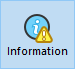

La página Información proporciona información sobre los entornos 4D y sistema, así como sobre los archivos de la base de datos y de la aplicación. Cada página puede visualizarse mediante los controles de pestañas en la parte superior de la ventana.

## Programa

Esta página indica el nombre, la versión y la ubicación de la aplicación, así como la carpeta 4D activa (para más información sobre la carpeta 4D activa, consulte la descripción del comando `Get 4D folder` en el manual _Lenguaje 4D_).

La parte central de la ventana indica el nombre y la ubicación del proyecto y de los os archivos de datos, así como también el archivo de historial (si lo hay). La parte inferior de la ventana indica el nombre del titular de la licencia 4D, el tipo de licencia y el nombre del usuario 4D actual.

- **Visualización y selección de nombres de ruta**: en la pestaña **Programa**, los nombres de ruta se muestran en menús emergentes que contienen la secuencia de carpetas tal y como se encuentran en el disco:\
  
  Si selecciona un elemento del menú (disco o carpeta), se muestra en una nueva ventana del sistema.
  El comando **Copiar la ruta** copia el nombre completo de la ruta en el portapapeles como texto, utilizando los separadores de la plataforma actual.

- **"Licenses" Folder** The **"Licenses" Folder** button displays the contents of the active Licenses folder in a new system window. Todos los archivos de licencia instalados en su entorno 4D están agrupados en esta carpeta, en su disco duro. Cuando se abren con un navegador web, estos archivos muestran información sobre las licencias que contienen y sus características.
  La ubicación de la carpeta "Licenses" puede variar en función de la versión de su sistema operativo. Para obtener más información sobre la ubicación de esta carpeta, consulte el comando `Get 4D folder`.
  _**Nota:** también puede acceder a esta carpeta desde la caja de diálogo "Actualizar licencias" (disponible en el menú Ayuda)._

## Tablas

Esta página ofrece una visión general de las tablas de su base:

> La información de esta página está disponible tanto en el modo estándar como en el de mantenimiento.

La página lista todas las tablas de la base (incluidas las tablas invisibles), así como sus características:

- **ID**: número internos de la tabla.
- **Tablas**: nombres de las tablas. Los nombres de las tablas borradas se muestran entre paréntesis (si todavía están en la papelera).
- **Registros**: número total de registros en la tabla. Si un registro está dañado o no se puede leer, se muestra _Error_ en lugar del número. En este caso, puede considerar el uso de las herramientas de verificación y de reparación.
- **Campos**: número de campos en la tabla. Los campos invisibles se cuentan, sin embargo, los campos borrados no se cuentan.
- **Índices**: número de índices de todo tipo en la tabla
- **Encriptable**: si el atributo **Encriptable** se marca para la tabla al nivel de la estructura (ver el párrafo "Encriptable" en el Manual de Diseño).
- **Encriptado**: si se marca, los registros de la tabla se cifran en el archivo de datos. **Encriptado**: si se marca, los registros de la tabla se cifran en el archivo de datos.
- **Tamaño tabla direcciones**: tamaño de la tabla de direcciones para cada tabla. La tabla de direcciones es una tabla interna que almacena un elemento por cada registro creado en la tabla. De hecho, vincula los registros a su dirección física. Por razones de rendimiento, no se redimensiona cuando se eliminan registros, por lo que su tamaño puede ser diferente del número de registros actual de la tabla. Si esta diferencia es significativa, se puede ejecutar una operación de compactación de datos con la opción "Compactar la tabla de direcciones" marcada para optimizar el tamaño de la tabla de direcciones (ver la página [Compactar](compact.md)).
  _**Nota:** las diferencias entre el tamaño de la tabla de direcciones y el número de registros también pueden ser el resultado de un incidente durante la escritura de la caché en el disco._

## Datos

La página **Datos** ofrece información sobre el espacio de almacenamiento disponible y utilizado en el archivo de datos.

> No se puede acceder a esta página en modo mantenimiento

La información se ofrece en forma gráfica:

> Esta página no tiene en cuenta los datos que puedan estar almacenados fuera del archivo de datos (ver "Almacenamiento externo").

Los archivos demasiado fragmentados reducen el rendimiento del disco y, por tanto, de la base. Si la tasa de ocupación es demasiado baja, 4D lo indicará con un icono de advertencia (que aparece en el botón de información y en la pestaña del tipo de archivo correspondiente) y especificará que es necesario compactar:

También se muestra un icono de advertencia en el botón de la página [Compact](compact.md):

