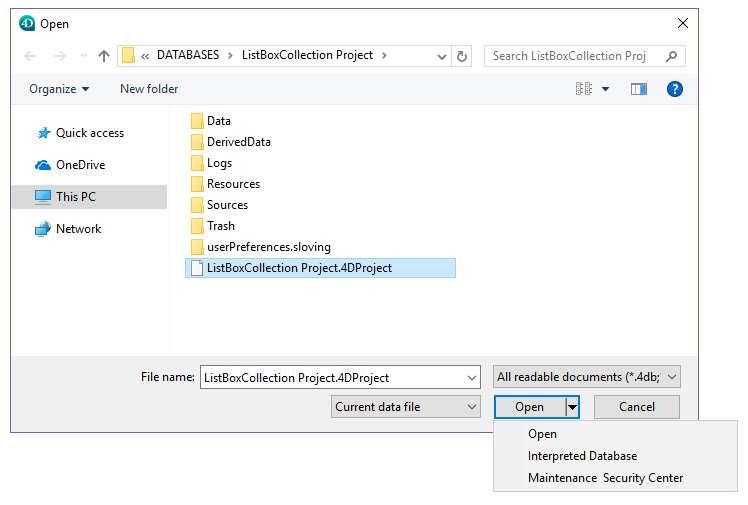

La ventana del Centro de Mantenimiento y Seguridad (CSM) contiene todas las herramientas necesarias para la verificación, el análisis, el mantenimiento, la copia de seguridad, la compactación y el cifrado de los archivos de datos. La ventana CSM está disponible en todas las aplicaciones 4D: 4D monousuario, 4D Server o 4D Desktop.

**Note:** The MSC window is not available from a 4D remote connection.

Hay varias formas de abrir la ventana del CSM. El modo de acceso también determina el modo de apertura de la aplicación proyecto: en modo "mantenimiento" o en modo "estándar". En modo mantenimiento, el proyecto no es abierto por 4D, sólo se provee su referencia al CSM. En modo estándar, el proyecto es abierto por 4D.

## Acceso en modo de mantenimiento

En modo mantenimiento, sólo se muestra la ventana del CSM (el proyecto no es abierto por la aplicación 4D). Esto significa que los proyectos que están demasiado dañados para ser abiertas en modo estándar por 4D pueden, sin embargo, ser accedidos. Moreover, certain operations (compacting, repair, and so on) require the project to be opened in maintenance mode (see [Feature availability](#feature-availability)).

Puede abrir el CSM en modo mantenimiento desde dos lugares:

- **From the standard project opening dialog box**
  The standard Open dialog includes the **Maintenance Security Center** option from the menu associated with the **Open** button:
  
- **Help/Maintenance Security Center** menu or **MSC** button in the tool bar (project not open)\
  \
  When you call this function, a standard Open file dialog appears so that you can select the _.4DProject_ or _.4dz_ file of the to be examined. El proyecto no será abierto por 4D.

## Acceso al modo estándar

En modo estándar, un proyecto se abre. En este modo, algunas funciones de mantenimiento no están disponibles. Tiene varias posibilidades para acceder a la ventana del CSM:

- Use the **Help/Maintenance Security Center** menu or the **MSC** button in the 4D toolbar:\
  
- Utilizar la acción estándar "Csm" que es posible asociar a un comando de menú o a un objeto de formulario.
- Use the `OPEN SECURITY CENTER` language command.

## Disponibilidad de las funcionalidades

Algunas funciones del CSM no están disponibles dependiendo del modo de apertura del CSM:

- La función de copia de seguridad sólo está disponible cuando el proyecto está abierto (el CSM debe haber sido abierto en modo estándar).
- Las funciones de compactación, reversión, restauración, reparación y cifrado de datos sólo pueden utilizarse con archivos de datos que no estén abiertos (el CSM debe haberse abierto en modo de mantenimiento). Si se intentan estas funciones mientras el proyecto está abierto en modo estándar, una caja de diálogo le advierte que implica que la aplicación se cierre y se reinicie en modo mantenimiento.
- In encrypted databases, access to encrypted data or to the .journal file requires that a valid encryption data key be provided (see [Encrypt page](encrypt.md)). De lo contrario, los datos encriptados no son visibles.
