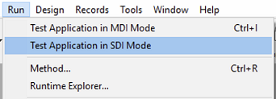

Las barras de menú constituyen la principal interfaz de las aplicaciones personalizadas. Para cada aplicación personalizada, debe crear al menos una barra de menú con al menos un menú. Por defecto, Menu Bar #1 es la barra de menús que se muestra en el entorno de la aplicación. Puede cambiar la barra de menús que se muestra utilizando el comando `SET MENU BAR`.

4D permite asociar una imagen de pantalla de inicio personalizada con cada barra de menús y previsualizar esta barra de menú en cualquier momento.

## Pantalla de bienvenida

Puede mejorar la apariencia de cada barra de menú asociando una pantalla de inicio personalizada. La ventana que contiene la pantalla de inicio se muestra debajo de la barra de menús cuando aparece. Puede contener un logo o cualquier tipo de imagen. Por defecto, 4D muestra el logo 4D en la pantalla de inicio:

Una imagen de pantalla de inicio personalizada puede provenir de cualquier aplicación gráfica. 4D le permite pegar una imagen del portapapeles o utilizar cualquier imagen presente en su disco duro. Se puede utilizar cualquier formato de imagen estándar soportado por 4D.

La imagen de la pantalla de inicio sólo puede definirse en el editor de menús: seleccione la barra de menús a la que desea asociar la pantalla de inicio personalizada. Observe el área "Imagen de fondo" en la parte derecha de la ventana.
Para abrir directamente una imagen almacenada en su disco, haga clic en el botón **Abrir** o en el área "Imagen de fondo". Aparece un menú emergente:

- Para pegar una imagen desde el portapapeles, seleccione **Pegar**.
- Para abrir una imagen almacenada en un archivo de disco, seleccione **Abrir**.
  Si selecciona Abrir, aparecerá una caja de diálogo estándar de Abrir archivo para que pueda seleccionar el archivo de imagen que va a utilizar. Una vez definida, la imagen se muestra en miniatura en la zona. A continuación, se asocia a la barra de menús.

Puede ver el resultado final probando la barra de menús (ver la sección siguiente). En el modo Aplicación, la imagen se muestra en la pantalla de inicio con el formato de tipo "Truncado (Centrado)".

> Puede elegir si desea mostrar u ocultar esta ventana mediante la opción **Mostrar la barra de herramientas** en las Propiedades.

Para eliminar la imagen personalizada y mostrar la predeterminada en su lugar, haga clic en el botón **Borrar** o seleccione **Borrar** en el menú emergente del área.

## Vista previa de las barras de menús

El editor de la barra de menús le permite ver los menús personalizados y la pantalla de inicio en cualquier momento, sin cerrar la ventana de la caja de herramientas.

Para ello, basta con seleccionar la barra de menús y elegir **Probar la barra de menús "Barra de menús #X"** en el menú contextual o en el menú de opciones del editor.

4D muestra una vista previa de la barra de menús así como de la pantalla de inicio. Puede desplazarse por los menús y submenús para ver su contenido. Sin embargo, estos menús no están activos. Para probar el funcionamiento de los menús y la barra de herramientas, debe utilizar el comando **Probar la aplicación** en el menú **Ejecutar**.

:::info

Si la opción **Utilizar el modo SDI en Windows** está seleccionada en la página ["Interfaz" de la caja de diálogo Configuración](../settings/interface.md#display-windows), el menú **Probar aplicación** le permite probar su aplicación en modo [SDI o MDI](sdi/md) en Windows:

:::
