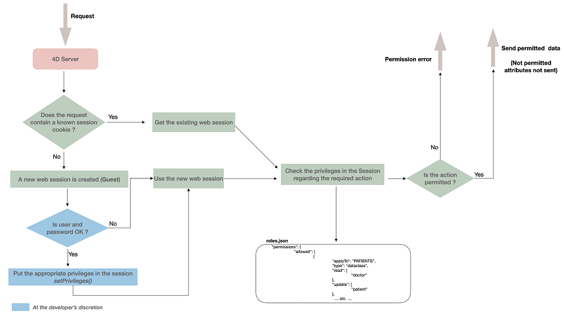

Proteger los datos a la vez que se permite un acceso rápido y sencillo a los usuarios autorizados es un reto importante para las aplicaciones web. The ORDA security architecture is implemented at the heart of your datastore and allows you to define specific privileges to all web or REST user sessions for the various resources in your project (datastore, dataclasses, functions, etc.).

## Generalidades

La arquitectura de seguridad ORDA se basa en los conceptos de privilegios, acciones de permiso (read, create, etc.) y recursos.

When web users or REST users get logged, their session is automatically loaded with associated privilege(s). Privileges are assigned to the session using the [`session.setPrivileges()`](../API/SessionClass.md#setprivileges) function.

Every user request sent within the session is evaluated against privileges defined in the project's `roles.json` file.

Si un usuario intenta ejecutar una acción y no tiene los derechos de acceso adecuados, se genera un error de privilegio o, en el caso de que falte el permiso de Lectura en los atributos, no se envían.



## Resources

Puede asignar acciones de permiso específicas a los siguientes recursos expuestos en su proyecto:

- el almacén de datos
- una clase de datos
- un atributo (incluidos los calculados y los alias)
- una función de clase de modelo de datos

Una acción de permiso definida en un nivel determinado se hereda por defecto en los niveles inferiores, pero se pueden establecer varios permisos:

- Una acción de permiso definida a nivel de almacén de datos se asigna automáticamente a todas las clases de datos.
- Una acción de permiso definida a nivel de clase de datos anula la configuración del almacén de datos (si existe). Por defecto, todos los atributos de la clase de datos heredan de los permisos de la clase de datos.
- A diferencia de los permisos de clase de datos, una acción de permiso definida a nivel de atributo no anula los permisos de clase de datos padre, sino que se añade a ellos. Por ejemplo, si asignó el privilegio "general" a una clase de datos y el privilegio "detail" a un atributo de la clase de datos, tanto el privilegio "general" como el privilegio "detail" deben definirse en la sesión para acceder al atributo.

:::info

Los permisos controlan el acceso a los objetos del almacén de datos. If you want to filter read data according to some criteria, you might consider [restricting entity selections](entities.md#restricting-entity-selections) which can be more appropriate in this case.

:::

## Acciones de autorización

Las acciones disponibles están relacionadas con el recurso de destino.

| Acciones     | Almacén de datos                                                                                                            | dataclass                                                                                                                                                                                | atributo                                                                                                                                                       | función de modelo de datos                                                                                                                                                                                                                                                                                                    |
| ------------ | --------------------------------------------------------------------------------------------------------------------------- | ---------------------------------------------------------------------------------------------------------------------------------------------------------------------------------------- | -------------------------------------------------------------------------------------------------------------------------------------------------------------- | ----------------------------------------------------------------------------------------------------------------------------------------------------------------------------------------------------------------------------------------------------------------------------------------------------------------------------- |
| **create**   | Crear entidad en cualquier clase de datos                                                                                   | Crear entidad en esta clase de datos                                                                                                                                                     | Crea una entidad con un valor diferente del valor por defecto permitido para este atributo (ignorado para atributos alias). | n/a                                                                                                                                                                                                                                                                                                                           |
| **read**     | Leer atributos en cualquier dataclass                                                                                       | Leer atributos en esta clase de datos                                                                                                                                                    | Lea el contenido de este atributo                                                                                                                              | n/a                                                                                                                                                                                                                                                                                                                           |
| **update**   | Actualizar atributos en cualquier clase de datos.                                                           | Actualiza los atributos de esta clase de datos.                                                                                                                          | Actualiza el contenido de este atributo (ignorado para atributos alias).                                                    | n/a                                                                                                                                                                                                                                                                                                                           |
| **drop**     | Borrar datos en cualquier clase de datos.                                                                   | Borrar los datos de esta clase de datos.                                                                                                                                 | Eliminar un valor no nulo para este atributo (excepto para alias y atributo calculado).                                     | n/a                                                                                                                                                                                                                                                                                                                           |
| **execute**  | Ejecutar toda función en el proyecto (almacén de datos, clase de datos, selección de entidades, entidad) | Ejecuta cualquier función en la clase de datos. Las funciones dataclass, las funciones entidad y las funciones selección de entidades se tratan como funciones dataclass | n/a                                                                                                                                                            | Ejecutar esta función                                                                                                                                                                                                                                                                                                         |
| **describe** | Todas las clases de datos están disponibles en /rest/$catalog API                                                           | Esta dataclass está disponible en la /rest/$catalog API                                                                                                                                  | Este atributo está disponible en la API /rest/$catalog.                                                                                        | Esta función dataclass está disponible en la API /rest/$catalog                                                                                                                                                                                                                                                               |
| **promote**  | n/a                                                                                                                         | n/a                                                                                                                                                                                      | n/a                                                                                                                                                            | Asocia un privilegio determinado durante la ejecución de la función. El privilegio se añade temporalmente a la sesión y se elimina al final de la ejecución de la función. Por seguridad, sólo se añade el privilegio al proceso que ejecuta la función, no a toda la sesión. |

**Notas:**

- Un alias puede leerse tan pronto como los privilegios de sesión permitan el acceso al propio alias, aunque los privilegios de sesión no permitan el acceso a los atributos que resuelven el alias.
- Se puede acceder a un atributo calculado aunque no haya permisos en los atributos sobre los que se crea.
- Default values: in the current implementation, only _Null_ is available as default value.

La definición de permisos requiere ser coherente, en particular:

- **update** and **drop** permissions also need **read** permission (but **create** does not need it)
- **promote** permission also need **describe** permission.

## Privilegios y roles

A **privilege** is the technical ability to run **actions** on **resources**, while a **role** is a privilege pusblished to be used by an administrator. Básicamente, un rol reúne varios privilegios para definir un perfil de usuario empresarial. Por ejemplo, "manageInvoices" podría ser un privilegio mientras que "secretary" podría ser un rol (que incluye "manageInvoices" y otros privilegios).

Un privilegio o un rol pueden asociarse a varias combinaciones "acción + recurso". Se pueden asociar varios privilegios a una acción. Un privilegio puede incluir otros privilegios.

- You **create** privileges and/or roles in the `roles.json` file (see below). You **configure** their scope by assigning them to permission action(s) applied to resource(s).

- You **allow** privileges and/or roles to every user session using the [`.setPrivileges()`](../API/SessionClass.md#setprivileges) function of the `Session` class.

### Ejemplo

Para permitir un rol en una sesión:

```4d

exposed Function authenticate($identifier : Text; $password : Text)->$result : Text

    var $user : cs.UsersEntity

    Session.clearPrivileges()

    $result:="Your are authenticated as Guest"

    $user:=ds.Users.query("identifier = :1"; $identifier).first()

    If ($user#Null)
        If (Verify password hash($password; $user.password))
            Session.setPrivileges(New object("roles"; $user.role))
            $result:="Your are authenticated as "+$user.role
        End if
    End if


```

## `roles.json` file

The `roles.json` file describes the whole security settings for the project.

:::note

In a context other than _Qodly_ (cloud), you have to create this file at the following location: `<project folder>/Project/Sources/`. See [Architecture](../Project/architecture.md#sources) section.

:::

The `roles.json` file syntax is the following:

| Nombre de propiedad |                                                                                     |                                                                                   | Tipo                               | Obligatorio | Descripción                                                                                  |
| ------------------- | ----------------------------------------------------------------------------------- | --------------------------------------------------------------------------------- | ---------------------------------- | ----------- | -------------------------------------------------------------------------------------------- |
| privileges          |                                                                                     |                                                                                   | Collection of `privilege` objects  | X           | Lista de privilegios definidos                                                               |
|                     | \[].privilege  |                                                                                   | String                             |             | Nombre del privilegio                                                                        |
|                     | \[].includes   |                                                                                   | Colección de cadenas               |             | Lista de nombres de privilegios incluidos                                                    |
| roles               |                                                                                     |                                                                                   | Collection of `role` objects       |             | Lista de roles definidos                                                                     |
|                     | \[].role       |                                                                                   | String                             |             | Nombre del rol                                                                               |
|                     | \[].privileges |                                                                                   | Colección de cadenas               |             | Lista de nombres de privilegios incluidos                                                    |
| permissions         |                                                                                     |                                                                                   | Object                             | X           | Lista de acciones permitidas                                                                 |
|                     | allowed                                                                             |                                                                                   | Collection of `permission` objects |             | Lista de permisos permitidos                                                                 |
|                     |                                                                                     | \[].applyTo  | String                             | X           | Targeted [resource](#resources) name                                                         |
|                     |                                                                                     | \[].type     | String                             | X           | [Resource](#resources) type: "datastore", "dataclass", "attribute", "method" |
|                     |                                                                                     | \[].read     | Colección de cadenas               |             | Lista de privilegios                                                                         |
|                     |                                                                                     | \[].create   | Colección de cadenas               |             | Lista de privilegios                                                                         |
|                     |                                                                                     | \[].update   | Colección de cadenas               |             | Lista de privilegios                                                                         |
|                     |                                                                                     | \[].drop     | Colección de cadenas               |             | Lista de privilegios                                                                         |
|                     |                                                                                     | \[].describe | Colección de cadenas               |             | Lista de privilegios                                                                         |
|                     |                                                                                     | \[].execute  | Colección de cadenas               |             | Lista de privilegios                                                                         |
|                     |                                                                                     | \[].promote  | Colección de cadenas               |             | Lista de privilegios                                                                         |
| forceLogin          |                                                                                     |                                                                                   | Boolean                            |             | True to enable the ["forceLogin" mode](../REST/authUsers.md#force-login-mode)                |

:::caution Recordatorio

- El nombre de privilegio "WebAdmin" está reservado a la aplicación. No se recomienda utilizar este nombre para los privilegios personalizados.
- `privileges` and `roles` names are case insensitive.

:::

### `Roles_Errors.json` file

The `roles.json` file is parsed by 4D at startup. Debe reiniciar la aplicación si desea que se tengan en cuenta las modificaciones en este archivo.

In case of error(s) when parsing the `roles.json` file, 4D loads the project but disables the global access protection - this allows the developer to access the files and to fix the error. An error file named `Roles_Errors.json` is generated in the [`Logs` folder of the project](../Project/architecture.md#logs) and describes the error line(s). This file is automatically deleted when the `roles.json` file no longer contains error(s).

It is recommended to check at startup if a `Roles_Errors.json` file exists in the [Logs folder](../Project/architecture.md#logs), which means that there was a parsing error and that accesses will not limited. Puede escribir, por ejemplo:

```4d title="/Sources/DatabaseMethods/onStartup.4dm"
If (Not(File("/LOGS/"+"Roles_Errors.json").exists))
…
Else // you can prevent the project to open
 ALERT("The roles.json file is malformed or contains inconsistencies, the application will quit.")
 QUIT 4D
End if
```

## Inicialización de privilegios para el despliegue

By default, if no specific parameters are defined in the `roles.json` file, accesses are not limited. Esta configuración le permite desarrollar la aplicación sin tener que preocuparse por los accesos.

Sin embargo, cuando la aplicación está a punto de desplegarse, una buena práctica es bloquear todos los privilegios y, a continuación, configurar el archivo para que sólo abra las partes controladas a las sesiones autorizadas. To lock all privileges on all resources, put the following `roles.json` file in your project folder (it includes examples of methods):

```json title="/Project/Sources/roles.json"
{
	"privileges": [
		{
			"privilege": "none",
			"includes": []
		}
	],

	"roles": [],

	"permissions": {
		"allowed": [{
			"applyTo": "ds",
			"type": "datastore",
			"read": [
				"none"
			],
			"create": [
				"none"
			],
			"update": [
				"none"
			],
			"drop": [
				"none"
			],
			"execute": [
				"none"
			],
			"describe": [
				"none"
			],
			"promote": [
				"none"
			]
		},
		{
			"applyTo": "ds.loginAs",
			"type": "method",
			"execute": [
					"guest"
				]
		},
		{
			"applyTo": "ds.hasPrivilege",
			"type": "method",
			"execute": [
					"guest"
				]
		},
		{
			"applyTo": "ds.clearPrivileges",
			"type": "method",
			"execute": [
					"guest"
				]
		},
		{
			"applyTo": "ds.isGuest",
			"type": "method",
			"execute": [
					"guest"
				]
		},
		{
			"applyTo": "ds.getPrivileges",
			"type": "method",
			"execute": [
					"guest"
				]
		},
		{
			"applyTo": "ds.setAllPrivileges",
			"type": "method",
			"execute": [
				"guest"
			]
	}

		]
	}
}
```
