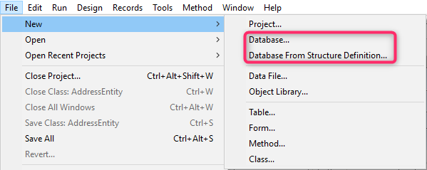

Esta página contiene varias opciones para configurar el funcionamiento general de su aplicación 4D.

## Opciones

### Al inicio

Esta opción permite configurar la visualización por defecto de 4D al inicio, cuando el usuario lanza únicamente la aplicación.

- **Do nothing**: Only the application window appears, empty.
- **Open Local Project dialog**: 4D displays a standard open document dialog box, allowing you to select a local project.
- **Open last used project**: 4D directly opens the last project used; no opening dialog box appears.
  > To force the display of the opening dialog box when this option is selected, hold down the **Alt** (Windows) or **Option** (macOS) key while launching the project.
- **Open Remote Project dialog**: 4D displays the standard 4D Server logon dialog, allowing you to select a project published on the network.
- **Open Welcome Wizard dialog** (factory setting): 4D displays the Welcome Wizard dialog box.

> **4D Server**: The 4D Server application ignores this option. In this environment, the **Do nothing** mode is always used.

### Creación de formularios automática

> Esta opción sólo se utiliza en bases de datos binarias; se ignora en la arquitectura proyectos. Ver doc.4d.com.

### Ventana con pestañas (sólo en macOS)

A partir de macOS Sierra, las aplicaciones Mac pueden beneficiarse de la función de tabulación automática de ventanas que ayuda a organizar varias ventanas: las ventanas de documentos se apilan en una única ventana principal y se puede navegar a través de pestañas. Esta función es útil en pantallas pequeñas y/o cuando se utiliza un trackpad.

Puede beneficiarse de esta funcionalidad en los siguientes entornos (sólo con las versiones 4D de 64 bits):

- Ventanas del editor de código
- Ventanas del editor de formularios

Todas las ventanas de estos editores se pueden poner en forma de pestaña:


A set of commands in the **Window** menu allows managing the tabs:


In the 4D's Preferences dialog box, the **Window tabbing** option allows you to control this feature:


Hay tres opciones disponibles:

- **According to System Preferences** (default): 4D windows will behave like defined in the macOS System Preferences (In full screen, Always, or Manually).
- **Never**: Opening a new document in 4D form editor or Code Editor will always result in creating a new window (tabs are never created).
- **Always**: Opening a new document in 4D form editor or method editors will always result in creating a new tab.

### Apariencia (sólo para macOS)

This menu lets you select the color scheme to use for the **4D development** environment. El esquema especificado se aplicará a todos los editores y ventanas del modo Diseño.

> You can also set the color scheme to use in your **desktop applications** in the "Interface" page of the Settings dialog box.

Hay tres opciones disponibles:

- **According to System Color Scheme Preferences** (default): Use the color scheme defined in the macOS System Preferences.
- **Light**: Use the Light Theme
- **Dark**: Use the Dark Theme

> Esta preferencia sólo es compatible en macOS. En Windows, se utiliza siempre el esquema "Light".

### Salir del modo Diseño al ir al modo Aplicación

If this option is checked, when the user switches to the Application environment using the **Test Application** menu command, all the windows of the Design environment are closed. Si esta opción no está marcada (configuración de fábrica), las ventanas del entorno Diseño permanecen visibles al fondo del entorno Aplicación.

### Activar la creación de bases de datos binarias

If you check this option, two items are added in the **File > New** menu and the **New** toolbar button:

- **Base de datos...**
- **Base de datos a partir de una definición de estructura...**



These items allow you to create binary databases (see [Creating a new database](https://doc.4d.com/4Dv18R6/4D/18-R6/Creating-a-new-database.300-5217610.en.html) section). Ya no se proponen por defecto porque 4D recomienda utilizar la arquitectura basada en proyectos para los nuevos desarrollos.

## Al crear un nuevo proyecto

### Utilizar archivo historial

Cuando esta opción está marcada, se inicia automáticamente un archivo de historial que se utiliza cuando se crea una nueva base. For more information, please refer to [Log file (.journal)](Backup/log.md).

### Crear un paquete

Cuando esta opción está seleccionada, las bases de datos 4D se crean automáticamente en una carpeta con el sufijo .4dbase.

Gracias a este principio, en macOS las carpetas de las bases aparecen como paquetes con propiedades específicas. En Windows, este funcionamiento no tiene ningún impacto particular.

### Incluir los tokens en los archivos fuente del proyecto

When this option is checked, saved [method source files](../Project/architecture.md#sources) in new 4D projects will contain **tokens** for classic language and database objects (constants, commands, tables and fields). Tokens are additional characters such as `:C10` or `:5` inserted in the source code files, that allow renaming tables and fields and identifying elements whatever the 4D version (see [Using tokens in formulas](https://doc.4d.com/4Dv19R3/4D/19-R3/Using-tokens-in-formulas.300-5583062.en.html)).

Si tiene intención de utilizar VCS o los editores de código externos con sus nuevos proyectos, es posible que desee desmarcar esta opción para una mejor legibilidad del código con estas herramientas.

> Esta opción sólo puede aplicarse a proyectos (las bases de datos binarias siempre incluyen tokens).

> You can always get the code with tokens by calling [`METHOD GET CODE`](https://doc.4d.com/4dv19R/help/command/en/page1190.html) with 1 in the _option_ parameter.

#### Exclusión de los tokens en los proyectos existentes

You can configure your existing projects to save code **without tokens** by inserting the following key in the [`<applicationName>.4DProject`](../Project/architecture.md#applicationname4dproject-file) file using a text editor:

```
"tokenizedText": false
```

> Este parámetro sólo se tiene en cuenta cuando se guardan los métodos. Los métodos existentes en sus proyectos no se modifican, a menos que los vuelva a guardar.

### Create `.gitignore` file

Puede que necesite o quiera que git ignore algunos archivos en sus nuevos proyectos.

You can set this preference by checking the **Create .gitignore file**  option.

When a project is created in 4D and that box is checked, 4D creates a `.gitignore` file at the same level as the `Project` folder (see [Architecture of a Project](Project/architecture.md#gitignore-file-optional)).

You can define the default contents of the `.gitignore` file by clicking the pencil icon. Esto abrirá el archivo de configuración .gitignore en su editor de texto. The contents of this file will be used to generate the `.gitignore` files in your new projects.

The [official git documentation](https://git-scm.com/docs/gitignore) is a great resource to understand how `.gitignore` files work.

### Lenguaje de comparación de texto

Este parámetro permite definir el lenguaje utilizado por defecto utilizado para el procesamiento y la comparación de cadenas de caracteres en las nuevas bases. La elección de un idioma de comparación afecta a la ordenación y la búsqueda de textos, así como al cambio entre minúsculas y mayúsculas, pero no afecta a la traducción de etiquetas ni a los formatos de fecha, hora o moneda, que permanecen en el idioma del sistema. Por defecto (configuración de fábrica), 4D utiliza el idioma actual del usuario definido en el sistema.

Una base 4D puede funcionar en un lenguaje distinto al del sistema. Cuando se abre una base, el motor de 4D detecta el lenguaje utilizado por el fichero de datos y lo pasa al lenguaje (modo intérpretado o compilado). Las comparaciones de texto, independientemente de si las realiza el motor de la base de datos o el lenguaje, se hacen en el mismo lenguaje.

Al crear un nuevo archivo de datos, 4D utiliza el idioma previamente configurado en este menú. Al abrir un archivo de datos que no está en el mismo idioma que la estructura, se utiliza el idioma del archivo de datos y el código del idioma se copia en la estructura.

> You can modify this parameter for the open database using the Database Settings (see [Text comparison](../settings/database.md#text-comparison)).

## Ubicación de la documentation

Esta área configura el acceso a la documentación HTML de 4D mostrada en su navegador actual:

- When you hit the **F1** key while the cursor is inserted in a 4D class function or command name in the Code Editor;
- When you double-click on a 4D command in the **Commands Page** of the Explorer.

### Lenguaje de la documentación

Lenguaje de la documentación HTML a mostrar. Puede seleccionar una documentación en un idioma distinto del idioma de la aplicación.

### Primero buscar en la carpeta local

> Esta opción sólo se tiene en cuenta para el acceso a la documentación de comandos (excluyendo las funciones de clase).

Define dónde buscará 4D las páginas de documentación.

- Cuando está marcada (por defecto), 4D busca primero la página en la carpeta local (ver abajo). Si se encuentra, 4D muestra la página en el navegador actual. If it is found, 4D displays the page in the current browser. Esto permite acceder a la documentación incluso cuando se está desconectado.
- Cuando no está marcada, 4D busca la página deseada directamente en el sitio web de documentación en línea y la muestra en el navegador actual. Si no se encuentra, 4D muestra un mensaje de error en el navegador.

### Carpeta local

> Esta opción sólo se tiene en cuenta para el acceso a la documentación de comandos (excluyendo las funciones de clase).

Indica la ubicación de la documentación HTML estática. Por defecto, se trata de la subcarpeta \Help\Command\language. Puede ver la ubicación haciendo clic en el menú asociado al área. Si esta subcarpeta no está presente, la ubicación se muestra en rojo.

Puede modificar esta ubicación como desee, por ejemplo, si quiere mostrar la documentación en un idioma diferente al de la aplicación. La documentación HTML estática puede estar ubicada en otro volumen, en un servidor web, etc. To designate a different location, click on the **[...]** button next to the entry area and choose a documentation root folder (folder corresponding to the language: `fr`, `en`, `es`, `de` or `ja`).
