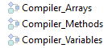

Puede compilar sus proyectos, es decir, traducir todos sus métodos a lenguaje máquina. La compilación de un proyecto permite verificar la coherencia del código y acelerar su ejecución, además de posibilitar ocultar el código en su totalidad. La compilación es un paso indispensable entre el desarrollo de proyectos con 4D y su despliegue como aplicaciones independientes.

## Compilar

La compilación se realiza desde su aplicación 4D y es totalmente automática.

> On macOS, the compilation requires that you install `Xcode`. See [this section](#silicon-compiler) for more information about this requirement.

1. Open the compiler window by selecting the **Compiler...** command in the **Design** menu or the **Compiler** toolbar button.

   

   

> You can also launch directly the compilation by selecting the **Start Compilation** menu item from the **Design** menu.

2. Click the **Compile** button to launch the compilation using the current [compilation settings](#compiler-settings).

Si no se detecta ningún error, se inicia la compilación y se muestra el mensaje "Compilación exitosa" en la parte inferior de la ventana cuando se completa la compilación:


You can immediately [run your application in compiled mode](#run-compiled) and see how faster it is.

Si se detectan errores, se detiene el proceso y se muestra el mensaje "Compilación fallida". El área de información de la ventana muestra los nombres de los métodos y los números de línea correspondientes en una lista jerárquica:


Haga doble clic en cada error detectado para abrir el método o la clase en cuestión directamente en el Editor de código 4D. La línea que contiene el error se resalta y el tipo de error se muestra en el área de sintaxis de la ventana.

Use the **Previous Error** / **Next Error** commands of the **Method** menu to navigate from one error to the next.

El número de errores encontrados durante las primeras compilaciones puede ser desalentador, pero no deje que esto lo desanime. Pronto descubrirá que a menudo proceden de la misma fuente, es decir, el incumplimiento de ciertas convenciones del proyecto. The compiler always provides a [precise diagnosis](#error-file) of the errors in order to help you correct them.

> La compilación requiere una licencia apropiada. Sin esta licencia, no es posible llevar a cabo una compilación (los botones están desactivados). Sin embargo, aún es posible comprobar la sintaxis y generar métodos de digitación.

## Ejecutar la compilación

Once a project is compiled, it is possible to switch from [interpreted mode to compiled mode](Concepts/interpreted.md), and vice versa, at any time and without having to quit the 4D application (except when the interpreted code has been removed). To do this, use the **Restart Interpreted** and **Restart Compiled** commands of the **Run** menu. The [Open project dialog box](GettingStarted/creating.md#options) also offers a choice between interpreted or compiled mode for database startup.

Cuando pasa de un modo al otro, 4D cierra el modo actual y abre el nuevo. Esto equivale a salir y volver a abrir la aplicación. Each time you change from one mode to another, 4D executes the two following database methods (if specified) in this order: `On Exit` -> `On Startup`.

Si modifica su proyecto en modo interpretado, debe recompilarlo para que sus modificaciones sean tenidas en cuenta en modo compilado.

## Características de la ventana del compilador

In addition to the [**Compile** button](#compile), the Compiler window provides additional features that are useful during the project development phase.

### Verificar la sintaxis

The **Check Syntax** button starts the execution of the syntax-checking phase. Al final del proceso de verificación, los errores detectados se listan en el área de información. Puede hacer doble clic en una línea de error para mostrar el método correspondiente.

Syntax checking can also be launched directly using the **Check Syntax** command associated with the **Compiler** toolbar button. Esta opción es la única disponible si no dispone de una licencia adecuada para permitir la compilación de aplicaciones.

### Declarar tipos

The **Generate Typing** button creates or updates typing compiler methods. Compiler methods are project methods that group together all the variable and array typing declarations (process and interprocess), as well as the [method parameters declared outside prototypes](../Concepts/parameters.md#method-parameters-declared-outside-prototypes). Estos métodos, cuando existen, son utilizados directamente por el compilador durante la compilación del código, lo que da lugar a tiempos de compilación más rápidos.

The name of these methods must begin with `Compiler_`. You can set the default name for each of the 5 compiler methods in the [compiler settings window](#compiler-methods-for). The compiler methods that are generated and maintained by 4D automatically have the `Invisible` attribute:



Sólo se generan los métodos de compilación necesarios (es decir, aquellos para los que ya existen elementos en el proyecto).

El área de información indica todo error encontrado durante la creación o actualización del método. Hacer doble clic en una línea de error provoca que el método y la línea en cuestión se muestren en el editor de código.

### Eliminar el código de compilación

The **Clear compiled code** button deletes the compiled code of the project. When you click on it, all of the [code generated during compilation](#classic-compiler) is deleted, the **Restart Compiled** command of the **Run** menu is disabled and the "Compiled Project" option is not available at startup.

### Mostrar/Ocultar advertencias

Las advertencias son mensajes específicos generados por el compilador cuando verifica la sintaxis. Estos mensajes están destinados a llamar su atención sobre las declaraciones que podrían llevar a errores de ejecución. No impiden la compilación.

Dependiendo de las circunstancias y del estilo de programación utilizado, estas advertencias pueden ser más o menos relevantes. You can toggle the warnings on or off by clicking the **Show/Hide Warnings** button:


Cuando esta opción está marcada, las advertencias (si las hay) se muestran en la ventana, después de los otros tipos de error. Aparecen en itálica:


Al hacer doble clic en un aviso se abre el método correspondiente.

#### Desactivar las advertencias durante la compilación

Puede desactivar selectivamente ciertas advertencias durante la compilación insertando el siguiente en el código de un método 4D:

```4d
  //%W-<warning number>
```

Sólo se pueden desactivar los avisos con números. Los números de advertencia se indican al final de cada mensaje en la lista de errores de compilación. Por ejemplo, para desactivar la siguiente advertencia:

_1: Puntero en una declaración de array (518.5)_

... you just need to write the following comment in a 4D method, preferably a `COMPILER_xxx` method (method compiled first):

```4d
  //%W-518.5
```

## Parámetros del compilador

La página "Compilador" de la caja de diálogo de Propiedades le permite definir los parámetros relacionados con la compilación del proyecto. You can directly open this page from the [compiler window](#compiler-window) by clicking on the **Compiler Settings** button:


### Opciones de compilación

Esta área agrupa las opciones genéricas utilizadas durante el proceso de compilación.

#### Generar el archivo de símbolos

Used to generate the symbol file (see [symbol file](#symbol-file)). The symbol file is created in the in the [Logs folder](Project/architecture.md#logs) of the project with the name `ProjectName_symbols.txt`.

#### Generar archivo de errores

Used to generate the error file (see [error file](#error-file)) at the time of syntax checking. The error file is created in the [Logs folder](Project/architecture.md#logs) of the project with the name `ProjectName_errors.xml`.

#### Ruta de compilación

Permite definir el número de pases (análisis de código) que realiza el compilador y, por tanto, la duración de la compilación.

- **Type the variables**: Check this option if you want the compiler to infer the type of variables and parameters in your code. Esta opción requiere que el compilador realice todas las etapas que hacen posible la compilación, lo que aumenta la duración de la compilación.
- **Process and interprocess variables are typed**: The pass for typing process and interprocess variables as well as method parameters declared outside prototypes is not carried out. Esta opción se puede utilizar cuando ya ha definido el tipo de todas sus variables proceso e interproceso por sí mismo o utilizando la función de generación automática de los métodos compilador.
- **All variables are typed**: The pass for typing local, process and interprocess variables as well as method parameters declared outside prototypes is not carried out. Utilice esta opción cuando esté seguro de que todas las variables locales, proceso e interproceso, así como los parámetros de los métodos, han sido claramente declarados.

:::tip

You can use the [Generate Typing](#generate-typing) button then compile with one of the two last options.

:::

#### Objetivo de compilación

<details><summary>Historia</summary>

| Lanzamiento | Modificaciones |
| ----------- | -------------- |
| 19          | Añadidos       |

</details>

Este parámetro le permite seleccionar la familia de procesadores para la cual su proyecto 4D debe estar compilado de forma nativa. El compilador 4D puede generar código nativo para dos familias de procesadores:

- **Intel/AMD** processors (all machines),
- **Apple Silicon** processors.

Se proponen dos opciones de objetivo. El resultado depende del procesador de la máquina en la que se ejecuta 4D.

| _Opción_                                                                  | _en Windows Intel/AMD_                                                               | _macOS Intel_                                                                          | _macOS Silicon_                                                                        |
| ------------------------------------------------------------------------- | ------------------------------------------------------------------------------------ | -------------------------------------------------------------------------------------- | -------------------------------------------------------------------------------------- |
| **Todos los procesadores (Intel/AMD y Apple Silicon)** | Code for Intel/AMD<br/>_It is not possible to produce Apple Silicon code on Windows_ | Code for Apple Silicon + Code for Intel/AMD<br/>_Two compiled codes will be available_ | Code for Apple Silicon + Code for Intel/AMD<br/>_Two compiled codes will be available_ |
| **Mi procesador (procesador)**                         | Código para Intel/AMD                                                                | Código para Intel/AMD                                                                  | Código para Apple Silicon                                                              |

> Apple Silicon compiler target requires that the **Clang** application be installed on your machine. Clang viene con la última versión de Xcode. See the [Silicon compiler requirements](#requirements) for more information.

### Declaración de tipos por defecto

Utilice este área para definir el tipo por defecto para los objetos de base de datos ambiguos.

- **Numeric**: Used to force numeric typing in an unambiguous manner, either in real or longint. Esto no anulará las directivas que haya establecido en su proyecto. Puede optimizar el funcionamiento de su base de datos eligiendo el tipo Longint.
- **Button**: Used to force button typing in an unambiguous manner, either in real or longint. Esto no anulará las directivas que haya establecido en su proyecto. Este tipo se aplica a los botones y a las casillas de selección, a los botones imagen, a las rejillas de botones, a los botones radio, a los menús pop-up imagen y a las listas desplegables.

### Métodos Compilador para...

This area lets you rename the Compiler methods that are generated automatically by the compiler when you click [Generate Typing](#generate-typing).

Se pueden generar hasta 5 métodos de compilación; un método de compilación sólo se genera si el proyecto contiene los siguientes elementos:

- **Variables**: Groups together process variable declarations;
- **Interprocess Variables**: Groups together interprocess variable declarations;
- **Arrays**: Groups together process array declarations;
- **Interprocess Arrays**: Groups together interprocess array declarations;
- **Methods**: Groups together method parameter declarations (e.g `C_LONGINT(mymethod;$1;$2)`) for [method parameters declared outside prototypes](../Concepts/parameters.md#method-parameters-declared-outside-prototypes). For more information, see [`Compiler_Methods` method](../Concepts/parameters.md#compiler_methods-method).

You can rename each of these methods in the corresponding areas, but they will always be preceded by the label `Compiler_` (non-modifiable). El nombre de cada método (prefijo incluido) no debe tener más de 31 caracteres. It must also be unique and comply with [4D rules for naming methods](Concepts/identifiers.md#project-methods).

## Herramientas de compilación

### Archivo Symbol

If you check the [**Generate the symbol file**](#generate-the-symbol-file) option in the compiler settings, a symbol file called `ProjectName_symbols.txt` is created in the [Logs folder](Project/architecture.md#logs) of the project during compilation. Está dividido en varias partes:

#### Lista de las variables proceso e interproceso

Estas dos listas contienen cuatro columnas:

- Nombres de las variables y arrays proceso e interproceso utilizados en su proyecto. Estas variables están listadas en orden alfabético.
- Tipo de la variable. Los tipos se definen por medio de comandos de directivas de compilación o son determinados por el compilador en función del uso de la variable. Si no se puede determinar el tipo de una variable, la columna está vacía.
- Número de dimensiones si la variable es un array.
- Referencia al contexto en el que el compilador estableció el tipo de la variable. Si la variable se utiliza en varios contextos, el contexto mencionado es el que utiliza el compilador para determinar su tipo.
  - Si la variable se encuentra en un método base, se indica el nombre del método base, precedido por (M)\*.
  - Si la variable se encuentra en un método proyecto, el método se identifica como se ha definido en 4D, precedido de (M).
  - Si la variable se encuentra en un trigger, se indica el nombre de la tabla, precedido por (TM).
  - Si la variable se encontró en un método formulario, se da el nombre del formulario, precedido por el nombre de la tabla y (FM).
  - Si la variable se encontró en un método objeto, se da el nombre del método objeto, precedido por el nombre del formulario, el nombre de la tabla y por (OM).
  - Si la variable es un objeto de un formulario y no aparece en ningún método proyecto, formulario, objeto o trigger, se indica el nombre del formulario en el que aparece, precedido de (F).
    Al final de cada lista, puede encontrar los tamaños de las variables proceso e interproceso en bytes.

> Al compilar, el compilador no puede determinar en qué proceso se utiliza una determinada variable proceso. Una variable proceso puede tener un valor diferente en cada proceso. En consecuencia, todas las variables proceso se duplican sistemáticamente cuando se lanza cada nuevo proceso: por lo tanto, es aconsejable vigilar la cantidad de memoria que ocuparán. También hay que tener en cuenta que el espacio para las variables proceso no está relacionado con el tamaño de la pila del proceso.

#### Lista de las variables locales

La lista de variables locales está ordenada por método base, método proyecto, trigger, método formulario y método objeto, en el mismo orden que en 4D.

Esta lista está dividida en tres columnas:

- la lista de las variables locales utilizadas en el método;
- tipo de la variable;
- número de dimensiones si la variable es un array.

#### Lista completa de los métodos

Al final del archivo se ofrece una lista completa de sus métodos base y proyecto con:

- su tipo (procedimiento o función que devuelve un valor)
- los tipos de datos de sus parámetros y del resultado devuelto
- el número de llamadas
- la propiedad Thread Safe o Thread Unsafe.

Esta información aparece así:

```
Procedimiento o función <Method name>(tipos de datos de los parámetros):
tipo resultado, número de llamadas, Thread Safe o Thread Unsafe
```

### Archivo de errores

You can choose whether or not to generate an error file during compilation using the [**Generate error file**](#generate-error-file) option in the compiler settings. The error file is automatically named `projectName_errors.xml` and is placed in the [Logs folder](Project/architecture.md#logs) of the project.

Although the errors can be accessed directly via the [compiler window](#compile), it can be useful to have an error file that can be transmitted from one machine to another. El archivo de errores se genera en formato XML para facilitar el análisis automático de su contenido. También permite la creación de interfaces personalizadas de visualización de errores.

La longitud del archivo de errores depende del número de errores y advertencias emitidos por el compilador.

La estructura del archivo de errores es la siguiente:

- En la parte superior del archivo se encuentra la lista de errores y advertencias, ordenados por método y en su orden de creación en 4D.
- In the _**General errors**_ section, all the typing impossibilities and identity ambiguities are grouped together. Estos errores y advertencias se listan utilizando el siguiente formato:
  - el número de línea en el método (0 indica errores generales)
  - el atributo warning indica si la anomalía detectada es una advertencia (warning="true") o un error (warning="false")
  - diagnóstico que describe el error

If your project does not have any general errors, the file will not have a _General errors_ section.

Un archivo de error puede contener tres tipos de mensajes:

- **Errors linked to a specific line**: these errors are displayed in context — the line in which they were found — with an explanation. El compilador informa de este tipo de error cuando encuentra una expresión en la que ve una incoherencia relacionada con el tipo de datos o la sintaxis. En la ventana del compilador, haga doble clic en cada error detectado para abrir el método en cuestión directamente en el editor de código 4D, con la línea que contiene el error resaltada.

- **General errors**: These are errors that make it impossible to compile the project. Hay dos casos en los que el compilador informa de un error general:
  - No se ha podido determinar el tipo de datos de una variable proceso.
  - Dos tipos diferentes de objetos tienen el mismo nombre.

Los errores generales se denominan así porque no pueden vincularse a ningún método específico. En el primer caso, el compilador no pudo realizar una tipificación específica en ninguna parte del proyecto. En el segundo, no pudo decidir si asociar un nombre determinado con un objeto y no con otro.

- **Warnings**: Warnings are not errors. No impiden la compilación del proyecto, sino que simplemente señalan posibles errores de código. En la ventana del compilador, las advertencias aparecen en itálica. Haga doble clic en cada advertencia para abrir el método en cuestión directamente en el editor de código 4D, con la línea que contiene la advertencia resaltada.

### Control de ejecución

El código generado por el compilador de 4D comprueba automáticamente que cada acceso a un elemento del array o a una referencia de caracter se efectúe dentro del rango real de los elementos del array o de los caracteres de la cadena. Los accesos fuera de rango provocarán errores durante la ejecución.

En algunos casos, puede preferir que el control de rangos no se aplique a ciertas partes del código que se consideran fiables. En particular, en el caso de los bucles que se repiten un gran número de veces, y cuando se ejecuta la base compilada en máquinas antiguas, el control de rangos puede ralentizar considerablemente el procesamiento. Si está absolutamente seguro de que el código en cuestión es fiable y no puede causar errores en el sistema, puede desactivar la comprobación del rango localmente.

To do this, you must surround the code to be excluded from range checking with the special comments `//%R-` and `//%R+`. The `//%R-` comment disables range checking and `//%R+` enables it again:

```4d
  // %R-   to disable range checking
 
 ... //Place the code to be excluded from range checking here
 
  // %R+   to enable range checking again for the rest
```

## Acerca de los compiladores

4D incluye dos compiladores:

- un compilador "clásico", utilizado para compilar código nativo para los procesadores Intel/AMD;
- un compilador Silicon, utilizado para compilar código nativo para los procesadores Apple Silicon.

El compilador clásico puede utilizarse en cualquier plataforma, mientras que el compilador Silicon sólo puede utilizarse en una máquina Mac:

|             |    Compilar para Windows    |  Compilación para Intel Mac | Compilación para Mac Silicon |
| ----------- | :-------------------------: | :-------------------------: | :--------------------------: |
| En Windows  | &#10003 | &#10003 |  &#10007 |
| Intel Mac   | &#10003 | &#10003 |  &#10003 |
| Silicon Mac | &#10003 | &#10003 |  &#10003 |

Ambos compiladores están integrados en 4D. The appropriate compiler is automatically selected depending on the [compilation target](#compilation-target) option.

### Compilador clásico

El compilador clásico genera código compilado nativo para procesadores Intel/AMD en cualquier máquina. No requiere ninguna configuración específica.

Resulting compiled code is stored in the [DerivedData](architecture.md#deriveddata) folder of the project.

### Compilador Silicon

The Silicon compiler generates native compiled code for Apple Silicon processors, such as _Apple M1_.

Resulting compiled code is stored in the [Libraries](architecture.md#libraries) folder of the project.

#### Requisitos

- **Apple machine**: The Silicon compiler can only be run from an Apple machine.
- **4D Project architecture**: The Silicon compiler is only available for 4D developments using [project architecture](architecture.md).
- **Xcode or Developer Tools**: The Silicon compiler calls the **Clang** open-source macOS compiler to compile the project from C++ code at the [second step](#incremental-compiler) of compilation. _clang_ requires Apple native libraries, which are provided by either the **Xcode** or **Developer Tools** package.
  - **If you already have** Xcode or Developer Tools installed on your computer, you only need to make sure that its version is compliant with 4D requirements.
  - **If you do not have** any of these tools installed on your computer, you will need to download one of them from the Apple Developer web site.

> We recommend to install **Xcode**, which is quite simple to install. You can decide to install **Developer Tools** which is more compact, however its installation is a little more complex.

En todos los casos, el compilador Silicon de 4D le advertirá si su configuración no cumple con sus requisitos.

#### Compilación incremental

El compilador Silicon es incremental, lo que significa que:

- During the very first compilation, **all 4D methods** are compiled. Este paso podría tomar un cierto tiempo. Sin embargo, sólo ocurre una vez.
- During all subsequent compilations, only **new or modified methods** are processed, thus reducing drastically the compilation time.
