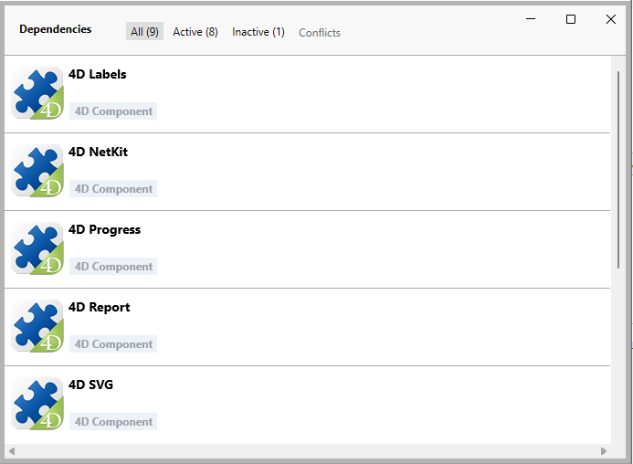

A 4D component is a set of 4D code and/or 4D forms representing one or more functionalities that you can add and use in your projects. For example, the [4D SVG](https://github.com/4d/4D-SVG) component adds advanced commands and an integrated rendering engine that can be used to display SVG files.

You can [develop](../Extensions/develop-components.md) and [build](../Desktop/building.md) your own 4D components, or download public components shared by the 4D community that [can be found on GitHub](https://github.com/search?q=4d-component\&type=Repositories).

## Componentes interpretados y compilados

Los componentes pueden ser interpretados o [compilados](../Desktop/building.md). La carpeta del paquete de un componente puede contener:

- ya sea una carpeta Proyecto (componente interpretado)
- o un archivo .4DZ (componente compilado)

A 4D project running in interpreted mode can use either interpreted or compiled components. A 4D project running in compiled mode cannot use interpreted components. En este caso, sólo se pueden utilizar componentes compilados.

## Cargando componentes

### Básicos

Para cargar un componente en su proyecto 4D, usted puede:

- reference the component in the **dependencies.json** file (and, optionnally, the **environment4d.json** file)
- o copia los archivos del componente en la [carpeta **Components** de su proyecto](architecture.md#components).

If the same component is installed at different locations, a [priority order] is applied.

### dependencies.json

1. Reference the component name in the **dependencies.json** file of your 4D project. Este archivo de manifiesto debe ser guardado en la carpeta **Sources** de la carpeta del proyecto 4D, por ejemplo:
   ```
   /MyProjectRoot/Project/Sources/dependencies.json
   ```
2. By default, copy the component's package folder (_i.e._ the project root folder of the component) at the same level as your 4D project's package folder, e.g.:
   ```
   /MyProjectRoot/
   /MyProjectComponentRoot/
   ```

Thanks to this architecture, you can simply copy all your components at the same level as your projects and reference them in your **dependencies.json** files if necessary. Además, puede personalizar la ruta de sus componentes, ver abajo.

The **/Sources/dependencies.json** file contents must have the following structure:

```json
{
	"dependencies": {
		"myComponent1" : {},
		"myComponent2" : {}
	}
}
```

... where "myComponent1" and "myComponent2" are the name of the components, located at the same level as your project's package folder, that you want to be loaded in your project.

### environment4d.json

If you want to customize the location of the components that are [declared in the **dependencies.json** file](#dependenciesjson), you can use a **environment4d.json** file. This file allows you to declare the paths for the dependencies that are not stored at the same level as the project folder.

You can use absolute or relative paths, expressed in POSIX syntax as described in [this paragraph](../Concepts/paths#posix-syntax). Las rutas relativas son relativas al archivo environment4d.json.

Ejemplos:

```json
{
	"dependencies": {
		"myComponent1" : "MyComponent1",
		"myComponent2" : "../MyComponent2",
        "myComponent3" : "file:///Users/jean/MyComponent3"
    }
}
```

The **environment4d.json** file can be stored in your project package folder or in one of its parent folders, at any level (up to the root). The benefit of this architecture is that you can store this environment file in a parent folder of your projects and decide not to commit it, allowing you to have your local component organization.

:::note

If a component path declared in the **environment4d.json** file is not found when the project is started, the component is not loaded and gets the _Not found_ [status](dependency-status), even if a version of the component exists next to the project's package folder.

:::

### Prioridad

Since components can be installed in different ways, a priority order is applied when the same component is referenced at several locations:

**Máxima prioridad**

1. Components stored in the [**Components** folder of the project](architecture.md#components).
2. Componentes declarados en el archivo **dependencies.json**.
3. Componentes 4D internos del usuario (por ejemplo, 4D NetKit, 4D SVG...)

**Prioridad más baja**


When a component cannot be loaded because of another instance of the same component located at a higher priority level, it is given the _Overloaded_ [status](#dependency-status). The loaded component has the _Overloading_ [status](#dependency-status).

## Monitoreo de dependencias del proyecto

In an opened project, you can get information about dependencies and their current loading status in the **Dependencies** panel.

Para mostrar el panel Dependencias:

- con 4D, seleccione el ítem de menú **Diseño/Dependencias del Proyecto** (entorno de desarrollo),<br/>
  

- con 4D Server, seleccione el ítem de menú **Ventana/Dependencias del Proyecto**.<br/>
  

A continuación se muestra el panel Dependencias. Las dependencias se ordenan por nombre en orden alfabético:



### Origen de dependencia

The Dependencies panel lists all project dependencies, whatever their origin, i.e. wherever they come from. El origen de la dependencia lo suministra la etiqueta bajo su nombre:


Se soportan los siguientes orígenes:

| Etiqueta de origen      | Descripción                                                                     |
| ----------------------- | ------------------------------------------------------------------------------- |
| Componente 4D           | Built-in 4D component, stored in the `Components` folder of the 4D application  |
| Source                  | Componente declarado en el archivo [`dependencies.json`](#dependenciesjson)     |
| Entorno                 | Componente declarado en el archivo [`environnement4d.json`](#environment4djson) |
| Componente del proyecto | Component located in the [`Components`](architecture.md#components) folder      |

**Clic derecho** en una línea de dependencia y selecciona **Mostrar en el disco** para revelar la ubicación de una dependencia:


:::note

This item is not displayed if the dependency is inactive because its files are not found.

:::

### Filtering Dependencies

By default, all dependencies identified by the Dependency manager are listed, whatever their [status](#dependency-status). You can filter the displayed dependencies according to their status by selecting the appropriate tab at the top of the Dependencies panel:


- **Activo**: dependencias que están cargadas y pueden ser utilizadas en el proyecto. Incluye dependencias _overloading_, las cuales son realmente cargadas. Las dependencias _Overloaded_ se enumeran en el panel **Conflicts** junto con todas las dependencias en conflicto.
- **Inactivo**: dependencias que no están cargadas en el proyecto y no están disponibles. There are many possible reasons for this status: missing files, version incompatibility...
- **Conflict**: Dependencies that are loaded but that overloads at least one other dependency at lower [priority level](#priority). Overloaded dependencies are also displayed so that you can check the origin of the conflict and take appropriate actions.

### Estado de dependencia

Dependencies requiring the developer's attention are indicated by a **status label** at the right side of the line and a specific background color:


Las siguientes etiquetas de estado están disponibles:

- **Overloaded**: The dependency is not loaded because it is overloaded by another dependency with the same name at a higher [priority level](#priority).
- **Overloading**: The dependency is loaded and is overloading one or more other dependencies with the same name at a lower [priority level](#priority).
- **Not found**: la dependencia está declarada en el archivo dependencies.json pero no se encuentra.
- **Inactive**: The dependency is not loaded because it is not compatible with the project (e.g. the component is not compiled for the current platform).
- **Duplicated**: The dependency is not loaded because another dependency with the same name exists at the same location (and is loaded).

A tooltip is displayed when you hover over the dependency line, provding additional information about the status:


